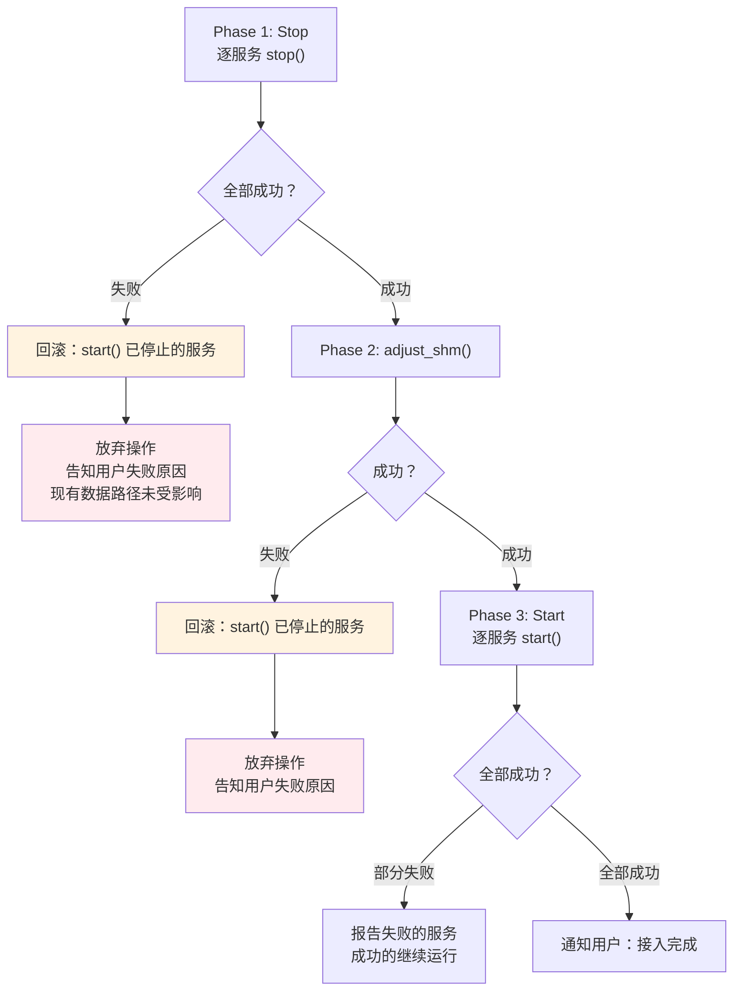
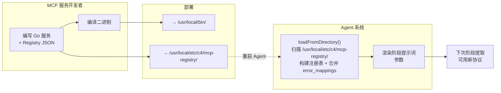
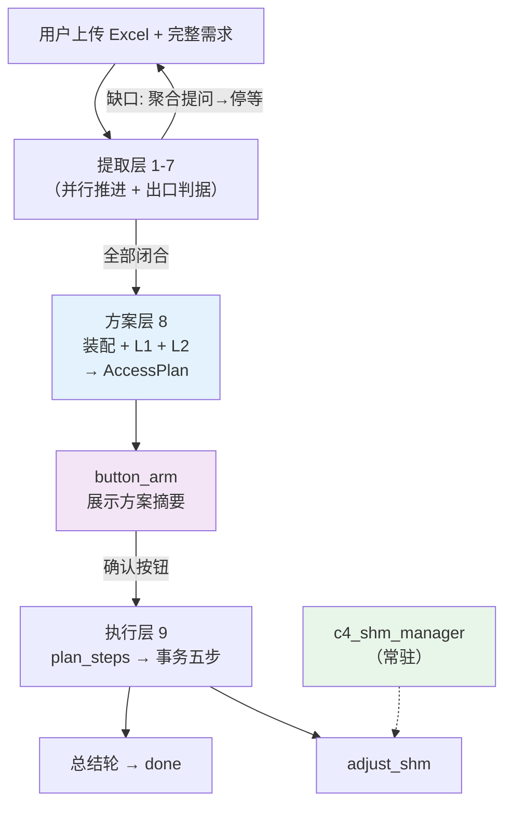

# C4 Agent 系统架构设计

> **版本**：v0.6.0 | **最后更新**：2026-09-23 | **父文档**：[c4_architecture.md](c4_architecture.md)
>
> **设计范围**：C4 Agent 系统的数据接入架构，覆盖从用户输入到 MCP 服务启动的完整数据接入流程。监控自愈等功能不在本次设计范围内。
>
> **架构形态**：缺口驱动的三段流水线（提取层 → 方案层 → 执行层，§2）。LLM 仅在提取层
> 承担窄提取职责；方案层与执行层为确定性代码。本章描述的就是目标架构本身。

---

## 1. 设计背景

### 1.1 定位

C4 Agent 是 C4 实例的智能决策层。它运行在工业数据服务器上，通过 Web 界面与用户交互，
通过 MCP 协议管理和监控 Go 编写的 MCP 服务集群。**Agent 不进入实时数据路径。**

Agent 是一个**单一系统**，不是多个独立 Agent 的集合。核心是**缺口驱动的阶段流水线**
（提取层 → 方案层 → 执行层，§2.1-2.3）：LLM 只做提取与匹配判断，流程、校验与执行
全部由确定性代码承担。

### 1.2 功能覆盖

Agent 系统覆盖数据接入流程中 Agent 侧的全部职能：

| 阶段 | 功能 | 承担方式 |
|------|------|---------|
| **理解** | C4_FUN_00001 理解自然语言、C4_FUN_00002/00003 收集信息 | 提取层：四个阶段提示词（§3.2）+ csv/xlsx/txt parser 确定性预处理 |
| **规划** | C4_FUN_00004 生成接入方案 | 方案层：装配 + L1/L2 校验（§2.2 阶段 8） |
| **执行** | C4_FUN_00044 分解为可执行配置、C4_FUN_00006 MCP 生命周期管理 | 执行层：plan_steps 拆解 + 事务五步（§3.2.1、§3.2.2） |
| **交互** | C4_FUN_00041 Web 界面、C4_FUN_00005 非技术语言 | Express + React（SSE 事件流不变） |
| **扩展** | C4_FUN_00017 新协议 MCP 服务可插拔 | MCP Service Registry（prompt_hints 结构化注入，§3.3） |

#### 1.2.1 已实现功能清单

本设计文档覆盖的功能点及实现方式：

| 功能码 | 功能名称 | 当前实现 | 设计章节 | 可确定性测试 |
|--------|---------|---------|---------|:--:|
| C4_FUN_00001 | 理解自然语言 | 阶段提示词（§3.2）+ 对话能力 | §3.2 | ❌（LLM 推理） |
| C4_FUN_00002 | 收集结构化文档接入信息 | parser 工具（`<file_data>` 注入点表阶段） + 出口判据 | §3.2 | ❌（LLM 推理） |
| C4_FUN_00003 | 收集非结构化文档接入信息 | txt_parser 工具 + 出口判据 | §3.2 | ❌（LLM 推理） |
| C4_FUN_00004 | 生成接入方案 | 方案层：装配 + L1/L2 校验（纯代码）+ 确定性方案展示文本（逐条「地址 ↔ 点名」） | §2.2 阶段 8 | ✅ 黑盒（聚合提问/方案展示断言） |
| C4_FUN_00044 | 分解为可执行配置 | plan_steps 确定性拆解器 + Zod 校验（确认按钮触发，非 LLM 参与） | §3.2.1 | ✅ generatePlanSteps |
| C4_FUN_00005 | 非技术语言交互 | 阶段提示词 + 聚合提问/总结轮（非技术语言约束） | §3.1、§2.6 | ❌（LLM 行为） |
| C4_FUN_00006 | MCP 生命周期管理 | 执行模块：Stop-Start 协议 + 启动恢复 | §3.2, §3.2.3 | ✅ mergeConfigFromSteps |
| C4_FUN_00007 | 常规操作自主执行 | 执行模块：config 合并 + 幂等 stop | §3.2 | ✅ 同 C4_FUN_00006 |
| C4_FUN_00017 | 新协议可插拔扩展 | MCP Service Registry + 双层注入 | §3.3 | ✅ Registry 加载 |
| C4_FUN_00041 | Web 界面交互 | Express v5 + SSE 流（text/tool_call/button_arm/button_disarm 语义事件） | §3.5 | ✅ 黑盒（SSE 可观测面） |
| C4_FUN_00082 | 点位实时快照查询 | PointDisplayService：c4_shm_manager `read_points` 读取 + 状态标注 | §3.6 | ✅ c4_fun_00082 |
| C4_FUN_00083 | 点位刷新频率展示 | 会话 tick 的 write_seq 差分 + 滑动窗口 | §3.6 | ✅ c4_fun_00083 |
| C4_FUN_00084 | 持续显示与终止控制 | DisplaySession 会话模型（时长/次数/手动/切换终止） | §3.6 | ✅ c4_fun_00084 |
| C4_FUN_00085 | 点位发现与批量选择 | `list_points` 工具（config.json 枚举 + 筛选） | §3.6 | ✅ c4_fun_00085 |
| C4_FUN_00086 | modbus 点表方案期校验 | `validate_points`（与启动校验同源，§2.7.1） | §2.7.1 | ✅ validate_points_test.go |
| C4_FUN_00087 | iec104 点表方案期校验 | 同上 | §2.7.1 | ✅ validate_points_test.go |
| C4_FUN_00088 | asfp2_client 点表方案期校验 | 同上 | §2.7.1 | ✅ validate_points_test.go |
| C4_FUN_00089 | asfp2_server 点表方案期校验 | 同上 | §2.7.1 | ✅ validate_points_test.go |
| C4_FUN_00090 | influxdb 点表方案期校验 | 同上 | §2.7.1 | ✅ validate_points_test.go |

> **确定性测试**：标记 ✅ 的功能不依赖 LLM 推理，可在 Python 黑盒测试（`test/c4_fun_XXXXX/`）中
> 通过操作真实 MCP 服务验证。标记 ❌ 的功能需要 TypeScript 侧单元测试（`GenericFakeChatModel` mock LLM）。

### 1.3 框架选型

| 组件 | 目标选型 | 当前实现 | 理由 |
|------|------|------|------|
| Agent 框架 | LangChain（阶段提示词逐次调用） | `createAgent` 逐阶段调用 | 提取器为纯 prompt→JSON，无需 agent 循环框架 |
| LLM | `@langchain/openai`（OpenAI 兼容端点，模型经 agent.json base_url/name 配置） | 同 | 已预置 `ZHIPU_API_KEY`；DeepSeek 等其它 OpenAI 兼容服务经 `base_url`（如 `https://api.deepseek.com`）接入 |
| MCP 客户端 | `@modelcontextprotocol/sdk` | 同 | MCP over Unix domain socket（`/run/c4/<service>.sock`）；Agent 是 MCP 客户端，只连接、从不拉起 MCP 进程 |
| 服务端 | `express` v5 | 同 | 文件上传、REST API、SSE streaming |
| 流式传输 | 编排器 `invoke` 生成器直出事件 | 编排器事件流（text/tool_call/button_arm/disarm） | ReAct 循环与 streamEvents 消费已退役（§3.1） |
| 结构化输出 | prompt 约定严格 JSON + 解析兜底重试 | — | 阶段输出由出口判据（L1/L2）校验，非 LLM 自我校验 |
| 类型 | `zod` v4 | 同 | Schema + API 校验 |
| 工具定义 | `StructuredTool` 子类 | `tool()` helper | 更简洁的函数式工具定义 |

### 1.4 LLM 交互原则（阶段提取模式）

> **核心原则**：不要假设大模型的行为是确定的。Agent 适配 LLM 的方式不是用提示词与
> 重试循环矫正自由行为，而是**把 LLM 的职责压缩到「忠实提取与匹配判断」**——其余一切
> （流程、完备性裁决、状态、执行）由确定性代码承担。

1. **LLM 只做窄提取**：每个阶段提示词只要求一件事——按注入的字段/别名知识，从用户
   输入中忠实提取结构化结果。禁止编造、推断、补默认值；模糊一律判 ambiguous 交由
   上游追问。
2. **提取所需知识由 registry 注入**：枚举映射（"32位浮点"→type=10）、合法范围、协议
   别名、必填清单全部来自 `prompt_hints` / schema 的结构化数据。禁止 LLM 凭预训练
   知识猜测编码，禁止在提示词模板中硬编码协议知识。
3. **完备性裁决归代码**：提取结果与必填清单的差异、合法范围、身份查重、跨字段约束的
   最终裁决由阶段出口判据（L1）与 validate_points（L2）执行——提示词知识只是让 LLM
   一次做对的指导，不是校验器。
4. **缺口聚合提问**：缺口由代码计算并合并为一次复合提问，提问后回合即终止（提问即
   终局，§2.6）。不允许 LLM 自问自答；流程行为不依赖重试循环矫正。
5. **适配 LLM**：不同 LLM（DeepSeek/GPT/Claude）行为有差异。提取质量由注入知识的
   精度与出口判据兜底保证，而非提示词措辞调优——更换 LLM 时提示词主体不变，仅需
   回归验证。

---

## 2. 整体架构

### 2.1 目标架构：三层缺口驱动流水线

接入过程由「提取层 → 方案层 → 执行层」三段确定性流水线构成。LLM 只在提取层承担
窄提取职责（§1.4），方案层与执行层为纯代码：

```
提取层  { 1 场站 │ 2 接入协议 │ 3 接入点表 │ 4 接入信息 │ 5 转发协议 │ 6 转发点表 │ 7 转发信息 }
            │ 七个窄提取器（每条用户消息全部并行推进，各自只认领自己领域），产出原料写入会话状态
            ↓ 缺口计算器判定全部闭合
方案层  { 8 装配（合并原料 + 缺省点名/abbr + seq 编号） → L1 结构校验 → L2 协议语义校验
            → AccessPlan → 展示方案摘要 → button_arm → 停等 }
            ↓ 确认按钮（全流程唯一硬交互边界）
执行层  { 9 plan_steps 拆解 → 事务五步 → 总结轮 }
```

架构要点：

- **编号 = 数据依赖 + 逻辑分组**（接入链 2→3→4 / 转发链 5→6→7 镜像对称），不是执行
  时序——提取器按消息缺口驱动并行推进，同一条消息可同时喂饱多条链；
- **5/6/7 为条件阶段**：无转发意图时整条转发链标记 not_applicable，不产生缺口；
- **8 与 9 之间是全流程唯一硬交互边界**（确认按钮），不可合并——9 是新增/修改/删除
  三路径公共出口，拆解必须紧贴执行以保证翻译最新裁决方案；
- **状态精简**：`accessPlan` 为唯一方案态；deviceInfo/deviceInfoReady 中间态、
  missing_fields 通道、nudge 补跑、递归上限、伪 user 消息全部随 ReAct 循环退役。

### 2.2 九阶段定义表

| # | 阶段 | 类型 | 激活条件 | 提示词 | 产出 |
|---|------|------|----------|--------|------|
| 1 | 场站信息 | 提取 | 每条消息 | `location_prompt.txt` | site{name, abbr}、归属判定 |
| 2 | 接入协议 | 提取 | 每条消息 | `protocol_prompt.txt`（side=receive） | canonical_name + match |
| 3 | 接入点表 | 提取 | 阶段2 matched | `point_prompt.txt`（side=receive） | devices[{name, abbr, points[]}] |
| 4 | 接入信息 | 提取 | 阶段2 matched | `connection_prompt.txt`（side=receive） | 按设备归档的 connection |
| 5 | 转发协议 | 提取 | **条件**：存在转发意图 | `protocol_prompt.txt`（side=forward） | canonical_name + match |
| 6 | 转发点表 | 提取 | 阶段5 matched | `point_prompt.txt`（side=forward） | forward 点表（addr 展开） |
| 7 | 转发信息 | 提取 | 阶段5 matched | `connection_prompt.txt`（side=forward） | 目标名 + connection |
| 8 | 方案层 | 装配+校验 | 1-7 全部闭合 | **无（纯代码）** | AccessPlan + button_arm |
| 9 | 执行层 | 拆解+执行 | 确认按钮 | **无（确定性拆解器）** | ServiceStep[] → 事务执行 |

各阶段的参数注入、输出 JSON 形状与出口判据详见 §3.2 阶段提取器与 §3.3。

### 2.3 缺口驱动回合模型

```
用户消息到达
  ↓
① 取消检测（顶层，确定性）：短取消词命中 → 清理在途态 → 「已取消」→ 终局
  ↓
② 提取遍历：阶段 1-7 全部提取器并行处理消息（各自只认领自己领域的信息）；
   同回合内状态合并按阶段编号拓扑序执行（1→2→3→4、5→6→7）——下游消费同回合
   上游产物（阶段 3 依赖阶段 2 的 matched；阶段 6 的 1:1 对齐依赖阶段 3 点表列表）
  ↓
③ 状态合并：按「单调累积 + 显式改口才覆盖」规则并入会话状态；协议受逐侧锁约束
  ↓
④ 缺口计算：按依赖序检查各阶段出口判据；聚合全部缺口
  ↓
⑤ 分叉：
   有缺口 → 复合提问（一次问全，提问即终局）→ 等待下一条消息
   无缺口 → 确定性穿越 8 → 展示方案 → button_arm → 停等确认
```

信息充分的用户（一条消息给全场站/协议/点表/转发/连接）零追问直达方案展示；
信息缺失时每个缺口在所属阶段被拦下，聚合进一次复合提问，答完即推进——
运行时轮次由用户输入的完备度决定，与阶段编号无关。

### 2.4 协议逐侧锁与任意阶段取消

#### 2.4.1 协议逐侧锁

接入协议与转发协议各自独立上锁（`receive_protocol_locked` / `forward_protocol_locked`）：

- **上锁时机**：下游首次产出非空数据（阶段 3/4 闭合 → receive 锁；阶段 6/7 闭合 →
  forward 锁）。协议已声明但下游无数据时仍视为"协议阶段过程中"，允许改口——
  覆盖声明即可，此时代价为零；
- **锁后行为**：提取结果 ≠ 锁定值 → 丢弃提取 + 记"协议变更尝试"；回复以拒绝说明开头
  （"接入协议已锁定为 X…如需更换请回复「取消」后重新开始"），其余缺口继续追问；
- **提取结果 == 锁定值** → 静默放行（用户复述需求不触发拒绝）；
- **例外——锁侧撤回**：转发链的整链撤回（§2.4.2）不受锁约束，属字段级操作；
  接入协议无对应例外（其撤回等价整体取消）。

价值：结构性消灭跨阶段协议失效——点表/连接/方案永远基于锁定协议构建，
"协议漂移导致下游全部作废"的失效路径不存在。

#### 2.4.2 任意阶段取消

- **检测**：顶层确定性拦截。消息**去空白后与取消词表全等匹配**（表：`取消`/`算了`/
  `不接了`/`放弃`/`停止接入`，均为 ≤4 字短词）→ 整体取消。**禁止包含匹配**——如
  "取消转发目标"含"取消"但与词表不全等，走提取层字段语义（见下条锁侧撤回），
  不得误触发整体清除；
- **清理范围**：清除本次接入在途态（协议声明、点表、连接、方案、确认、端口、uid
  集合、两把锁、按钮武装）；保留场站绑定、abbr 记忆库、对话历史（追加合成取消记录）；
- **executing 窗口例外**：**确认按钮被消费（`userConfirmed` 置位）起至回滚/清除完成止**
  拒绝取消——窗口覆盖 plan_steps 拆解期（此时尚未写事务标记，但确认是不可撤销的硬边界，
  且 §3.2.1.6 执行闸门只在拆解前检查确认，中途清除会造成"确认已失、执行继续"的竞态）；
  执行失败经回滚回到方案展示态后，用户可再次取消（回到整体取消路径）；
- **锁侧撤回（字段级）**：转发意图的整链撤回（如"取消转发目标"/"不转发到第三方了"）
  是**字段级操作而非协议变更**：清除转发侧全部在途态（forward 锁、阶段 5/6/7 数据、
  captured.forward 的 uid/端口/地址记录），转发意图回到 `not_applicable`，AccessPlan 失效（§2.5）；接入侧
  状态与 receive 锁**不受影响**。接入侧不支持等价操作（场站绑定不可变，接入协议撤回
  等价整体取消）；
- 取消后同一会话可重新接入，等价新会话。

### 2.5 失效传播表

| 变更 | 失效动作 |
|------|----------|
| 阶段 3/6 点表变更 | 使 AccessPlan 失效（按钮解除、重新装配） |
| 阶段 4/7 连接变更 | 使 AccessPlan 失效 |
| 阶段 2/5 协议变更（锁前） | 覆盖声明；下游已有产出则连带失效（同回合内代价为零） |
| 阶段 2/5 协议变更（锁后） | 不发生——拒绝（§2.4.1） |
| 转发链整链撤回（字段级，§2.4.2） | 清除转发侧在途态（forward 锁、阶段 5/6/7 数据）；AccessPlan 失效；接入侧不受影响 |
| 场站 | 绑定后不可变（首次接入语义） |

### 2.6 提问即终局与聚合提问

- **缺口聚合**：缺口计算器将全部未闭合项合并为**一次复合提问**（"还需要设备的 IP
  和端口""线圈点的 type 是布尔量还是位？"），提问后回合即终止，等待用户答复——
  不允许自问自答，不允许问完继续调用方案/执行类动作；
- **方案确认句式排除**："是否确认执行"类句子走 button_arm 判定（§2.8），不触发
  提问终局；
- **连续追问上限**：同一缺口连续两轮未收敛（用户两次答复仍无法闭合，如坚持使用
  不支持的协议）→ 强制收摊，向用户说明原因与补救路径（取消重开 / 换协议）；
- **动机**：Modbus 的 port/uid/fun/type 存在行业默认值（可猜字段），LLM 会"贴心
  补全"——提取提示词（§1.4 原则 1）与出口判据对可猜字段双重设防，任何未被用户
  明确提供的值一律以缺口形式回到用户手中，猜测值永不落盘（唯一例外：**确定性推导**——
  可从已确认数据唯一推导的值由方案层填充并在方案展示中标注供确认，见 §2.7.1；推导不是猜测）。

### 2.7 校验分层（L0 提示词知识 / L1 通用结构检查 / L2 协议语义工具）

点表与连接信息的合法性由三层共同保证，知识、结构检查与协议语义裁决各归其位：

| 层 | 职责 | 执行者 |
|----|------|--------|
| **L0 提示词知识** | 单点字段枚举映射（"32位浮点"→type=10）、合法范围、取值语义、跨字段规则说明——**只供提取，无裁决权** | registry `prompt_hints.point_field_hints` → 阶段提示词（§3.2） |
| **L1 通用结构检查** | 数量对账（提取数 vs declared_count）、必填字段完备、identity_fields 身份查重、点名重复、reader-key 唯一性（转发链，§2.7.1）、uid 交叉校验（提取值 ⊆ 确定性捕获声明）。**不含单点范围校验**——范围语义是协议知识，hints 中的范围为散文描述无法机读，由 L0（提取避坑）+ L2 同源（启动校验兜底）覆盖 | agent 本地确定性代码，比对键由 `point_schema.identity_fields` 声明，代码通用执行 |
| **L2 协议语义检查** | 身份重复、区间重叠（span 按 type，区间编址协议）、字段合法值/范围校验（各协议错误码见 §2.7.1 规则表；读组数量约束运行期在轮询层处理，不在配置校验/本工具范围） | **MCP validate_points 工具**（各协议 server 暴露），与运行期 INVALID_POINT 启动校验**同源** |

#### 2.7.1 validate_points 接口契约

各数据路径 MCP 服务（modbus/iec104/asfp2_client/asfp2_server/influxdb）各自注册一个
`validate_points` 工具：**接口形状全协议统一，校验语义各协议自治**。统一的是参数与
返回 schema（调用方零分支）；不统一的是校验规则与错误码枚举（住在各服务内部，与运行期
校验走同一份代码路径——同源）。

**统一参数**（无状态、只读、纯计算；全量传入本轮提取产物，天然覆盖 modify 场景）：

```json
{ "points": [ { "name": "...", "...": "该协议点表完整字段" } ] }
```

> 点级字段全部必填、**无猜测性默认值**（`swap`/`type` 这类语义字段若设默认，填错只会
> 产生静默数据错误——如 modbus 的 swap=0 也是合法配置，运行期不会报错）。唯一例外是
> **确定性推导**：字段值可从已确认数据唯一推导时（如 influxdb 的 `type` 可由源点类型
> 映射、`measurement` 可由场站缩写生成），方案层可自动填充，但必须在方案展示中显式
> 标注推导值，用户确认按钮即对推导值的确认——推导不是猜测，不允许留白式缺省。registry
> 字段的 `point_field_hints.<field>.extraction` 声明推导来源（L0 知识；类型推导映射 v1 仅覆盖 modbus 源点，其他 Writer 源待扩展）；L1 必填检查对
> 已声明可推导的字段放行缺失（方案层填充兜底）。因此 L2 的输入与运行期启动校验的输入
> **天然同态**（推导填充发生在 L2 之前的方案层）；实例级 default 同理在方案层装配时
> 填充（§3.2.0.1），不出现在本工具参数中。
>
> **与启动校验的同源实现口径**：两者调用**同一校验函数**（如 `validatePoints(points, opts)`），
> 以参数化子集处理 shm_id 校验差异——启动路径 `opts.requireShmID=true`（shm_id 执行期回填，
> 恒非 0），本工具 `opts.requireShmID=false`（方案期 shm_id 恒为 0）。**若共享化后发现其他
> 行为差异**（如 influxdb 启动校验容忍空 `type`/`field` 的运行期推导语义），以追加 opts 开关
> 显式建模，禁止工具侧私设第二套逻辑。各服务的差异声明见其文档；新增校验规则一律在共享
> 函数演进，两路径自动同步。

**统一返回**：

```json
{
  "valid": false,
  "errors": [
    { "code": "POINT_OVERLAP",
      "message": "点 windspeed2 与 windspeed1 地址区间重叠（3001-3002 vs 3001）",
      "points": ["windspeed2", "windspeed1"],
      "field": "addr" }
  ],
  "warnings": []
}
```

- `valid` 是编排器**唯一的分叉依据**；`errors[].message` 为人话，直接用于追问句与报错
  展示；`errors[].points[]` 供 agent 定位到具体点追问
- `code` 各协议自治枚举（如 modbus：POINT_DUP / POINT_OVERLAP / FUN_TYPE_MISMATCH / BAD_SWAP；
  influxdb：POINT_DUP），agent 不解析其值——仅用于日志与测试断言
- `warnings` 不阻断流程，v1 恒为空数组（结构预留）

**调用方与时机**：阶段 3/6 出口判据第⑤步，L1 全过后由**编排器**调用（非 LLM 直接调），
`service_type` 对应服务的 validate_points。管线顺序固定为 `L1 → L2 → 阶段通过`。

**C4_FUN 分配**：

| 服务 | 工具 | C4_FUN |
|------|------|--------|
| c4_modbus_client | validate_points | C4_FUN_00086 |
| c4_iec104_client | validate_points | C4_FUN_00087 |
| c4_asfp2_client | validate_points | C4_FUN_00088 |
| c4_asfp2_server | validate_points | C4_FUN_00089 |
| c4_influxdb_client | validate_points | C4_FUN_00090 |

**各协议校验规则**（契约引用本节；规则详见各服务设计文档的 MCP 工具接口章节）：

| 服务 | 校验规则（错误码见各服务文档） | 状态 |
|------|---------|------|
| c4_modbus_client | UID_OUT_OF_RANGE / ADDR_OUT_OF_RANGE（>0xFFFF）/ FUN_TYPE_MISMATCH（fun∈{1,2}→type∈{0,15}；fun∈{3,4}→8 个寄存器型）/ BAD_SWAP（合法值 {0,1,2,4}；单数据单元点必须 0；须整除字节跨度）/ POINT_DUP（uid+fun+addr）/ POINT_OVERLAP（同 uid+fun 组内，跨度=pointSpan） | ✅ 已从 validateConfig 源码确认（完整规则见该文档） |
| c4_asfp2_client / c4_asfp2_server | POINT_DUP（addr 为 24 位 key，重复即映射静默覆盖；**dup 检测加入共享校验函数，启动校验随之修复现状缺口**）/ ADDR_OUT_OF_RANGE（> MaxAddr 0xFFFFFF）；addr 非区间编址，无重叠概念 | ✅ 已确认 |
| c4_iec104_client | POINT_DUP（信息对象地址重复）；addr 上限归启动校验（依赖实例级 ioa_size，本工具参数不含实例字段） | ✅ 已确认 |
| c4_influxdb_client | POINT_DUP（measurement+field 组合）/ MEASUREMENT_EMPTY / INVALID_TYPE / FIELD_FORMAT（`^[a-zA-Z_]+$`，tags 若提供则同校验）。**同 Writer key 双映射**（两个不同 measurement+field 引用同一 Writer 点 → 运行期 duplicate shm_id）由 **L1 reader-key 唯一性**在阶段 6 出口拦截（本工具参数含 key 字段可查，但职责归 L1——key 是结构引用非协议语义） | ✅ 已确认 |

价值：消除 agent（TS）与 server（Go）双源漂移，把「执行期才发现重叠 → 回滚」前移到
方案确认之前（批次内 L2 在阶段出口；批次 × 既有点的合并比较域在方案层装配/merge 前置，
均在确认按钮之前，见 §2.7 比较域分层）。跨字段组合约束（如 fun=1/2 → type ∈ {0,15}）的
**裁决**在 L2；提示词中的 `cross_rules` 是 L2 已裁决规则的知识投影——**准入约束：凡写入
cross_rules 的规则必须在 L2/启动校验中存在对应裁决实现**（无裁决对应的规则禁止写入，
防止出现"提示词声称但校验不拦"的静默漏洞）；满足该约束时漂移的最坏后果是多一轮 L2 拒绝，
不会错判。

**共享校验契约（point_rules）**——L1 的单点不变式收敛到单一模块 `executor/point_rules.ts`，
规则只写一次：

| 规则 | 语义 |
|------|------|
| `register_span(type)` | 寄存器跨度（17 型全表见下） |
| `check_point_identity` | 身份组合（uid+fun+addr）规范化 |
| `check_duplicate_points` | 身份组合重复检测 |
| `check_shm_overlap` | 同 uid+fun 下 [addr, addr+span) 区间重叠检测 |
| `check_required_fields` | 逐点必填字段（point_schema.fields） |

接入层（按新流水线，全部为确定性代码接入点）：

1. **阶段 3/6 出口判据**（§3.2）：identity 查重 + 必填完备（L1）；
2. **方案层装配**（§3.2.0.1，阶段 8）：批次×既有点的合并比较域 overlap + duplicate 校验
   （此处在确认按钮**之前**，编造字段与点冲突在此拦截）；
3. **plan_steps 拆解器**（§3.2.0.1，阶段 9）：`validate_step_invariants` 引用共享库；
4. **merge 前置**（执行模块）：merge 前对最终点表再执行 overlap + duplicate 校验，
   违例拒绝执行——坏配置落不了盘。

c4_modbus_client 启动校验保留为最后防线（Go 侧不动）。方案层合并比较域的规则**仅对
身份+type 字段齐全的点执行**，字段不齐交由拆解器/merge 前置拦截。

**寄存器跨度全表**（权威 = `c4_modbus_client/main.go pointSpan(fun, type)`，modbus 采集/转发
的实际跨度语义；protocol 17 型枚举中 modbus 不支持的类型——Int8/Uint8/Float16 及变长型——
不在点表枚举内，unknown 一律 fail-closed 拒绝并返回可读错误，不默认 1）：

| 类型 | 跨度（寄存器） |
|------|---------------|
| BOOLEAN / BIT | 1（位编址，见下注） |
| INT8 / UINT8 / FLOAT16 | 1*（protocol 通用跨度；modbus 不支持此三型——`pointSpan` 无对应分支，点表枚举亦不含，出现即 fail-closed） |
| INT16 / UINT16 | 1 |
| INT32 / UINT32 / FLOAT32 | 2 |
| INT64 / UINT64 / FLOAT64 | 4 |
| STRING / BLOB / BITSTRING / LargeDataBlock | 变长——**fail-closed 拒绝** |

> fun ∈ {1, 2}（线圈 / 离散输入）为**位编址**，不适用寄存器跨度重叠，由身份查重覆盖；
> 比较域**分两层**：L2 validate_points 与阶段出口 L1 的比较域 = **本轮提取批次**
> （工具无状态，看不到既有配置）；**批次 × 既有点的合并比较域** = 方案层装配与 merge 前置
> （上述接入层 2/4——均在确认按钮之前，覆盖 modify/add-points 路径，"前移到方案期"
> 的承诺在此兑现）。

#### 2.7.2 单元测试（point_rules）

- **实现**：`agent/src/executor/point_rules.ts`；**测试**：`agent/test/executor/point_rules.test.ts`
  （vitest；测试统一存放 `agent/test/`，与 `c4/test/` 目录约定一致）；**运行**：`cd c4/agent && npm test`
- **规范对齐**：类型枚举以 `c4/mcp/internal/protocol/const.go`（17 型）为准；寄存器跨度以
  `c4_modbus_client/main.go` 的 `pointSpan` 为权威（位编址 fun∈{1,2} → 1；16 位 → 1；32 位 → 2；
  64 位 → 4）——注意 TypeByteSize 返回**字节**，寄存器跨度非其直接换算
- **覆盖矩阵**：

| 测试组 | 覆盖条款 | 关键场景 |
|--------|---------|---------|
| **提问终局判定（§2.6，question_hit）** | 问询句式 + 确认句式排除 | 陈述「是否」不误报；提问即终局一票否决（阶段门禁转移表随 §2.4.1 退役删除） |
| register_span | 跨度全表 | 17 型逐型断言；变长/未知 fail-closed |
| point_identity | 身份规范化 | 齐全/不全（跳过判定语义，m7） |
| check_duplicate_points | 身份查重 | 9/19 事故变体（同组同地址双点）；跨 uid/fun 不误报 |
| check_shm_overlap | 区间重叠 | **3008+3009 相邻 float32 重叠（事故本体）**；3008+3010 边界相接不误报；int64 跨度 4 覆盖判定；乱序输入；变长 fail-closed |
| check_required_fields | 必填字段 | 逐点列出、多缺失分号连接、空串/null 视同缺失 |
| validate_point_table | 一站式 | 三类违例同报；批次内比较域（批次×既有点归方案层，见比较域分层注） |

- **接入状态**：模块已就绪；四层接线（阶段 3/6 出口 L1 / 方案层装配 / plan_steps 拆解器 / merge 前置，详见 §2.7 接入层）
  按 §2.7 接入点定义随实施落地

### 2.8 按钮状态语义化

按钮武装由后端显式事件驱动（`button_arm` / `button_disarm{reason}`），前端不再从工具事件推断
（web.md §3.1.3 同步修订）。判定**在回合终结时执行一次**：

- **arm 条件**：本回合内方案层装配成功产出 AccessPlan（§3.2.0.1，原 output_access_plan）
  **且** 回合终结时 `gaps` 为空（方案确认句式已排除于提问终局判定，见 §2.6）；
- **disarm 条件**：方案被消耗（**执行完成**）、被新方案覆盖（方案过期）、缺口置位
  （聚合提问停等）、出口判据拒绝——但**若仍存在未消耗的有效方案则重发 `button_arm`**（拒绝
  文案引导用户点击按钮，不得自相矛盾地撤掉按钮）；无方案的"回合结束"不构成 disarm 条件；
  **回滚不销毁方案**：执行失败经回滚回到方案展示态（§2.4.2），accessPlan 保留、
  `userConfirmed` 复位、button 重新武装——用户可重新确认执行或整体取消；
  **整体取消与转发链锁侧撤回（§2.4.2）均触发 `button_disarm`**（前者清全部，后者清转发侧）。

工具副作用 ≠ 语义状态，UI 状态必须派生自后者。

### 2.9 执行结果先行，总结后置

plan_steps 校验通过后，merge → stop_start → persist **全部完成**，编排器以**会话状态渲染**
（执行步骤结果 + 事务/回滚状态，**不注入伪 user 消息**——NUDGE/plan_rejected 注入机制已随
ReAct 循环退役，见 §2.1/§3.1）生成一轮非技术语言总结——**最终汇报只允许出现在这一轮**。执行代码块中先行的「配置已写入」成功文案删除或移至 stop_start 成功
之后；"执行完成 ✅" 与 error 并存由该结构保证不发生，而非依赖文本过滤。

### 2.10 回滚策略

stop_start 失败**一律回滚**——起不来的配置即坏配置，滞留比失败更危险；取消 config 类 /
非 config 类错误的分类豁免（INVALID_POINT 重叠即曾因分类为启动类错误而跳过回滚，导致坏配置
滞留）。回滚细则：

- `restore_prev1` 执行前校验 `config.json.prev.1`（.prev 链，transaction 层）存在且可解析；
  缺失/不可解析时降级：保留当前 config.json + **保留 pending_change.json 标记**（交由 L0
  重启收敛）+ 向用户报告「配置状态需人工核验」；
- 回滚自身的 Stop-Start 失败 → 报告「已恢复变更前配置，但服务未完全恢复，需人工核验」+
  保留/重建事务标记。

---

## 3. 核心组件

### 3.1 Workflow 编排器（阶段流水线执行器）

编排器是 `invoke` 生成器，实现 §2.3 的缺口驱动回合模型。**退役组件**：createAgent
ReAct 组装、C4Agent wrapper（确认检测/验证循环/结构化捕获）、streamEvents 消费循环、
工具闸门包装——全部由阶段流水线与出口判据取代。

**会话状态对象**（每会话一份，提取层唯一写入点，方案层/执行层只读）：

```typescript
interface SessionState {
    site: { name: string; abbr: string } | null;        // 阶段1
    operation: 'add' | 'modify' | 'delete' | null;      // 操作意图（记忆库检索判定）
    abbrCandidates: string[];                            // abbr 候选（提取层产出，待记忆确认）
    declaredCounts: Record<string, number>;             // 用户声明的点数（阶段3/6 出口对账）
    captured: {                                          // 确定性捕获声明（uid/端口/地址交叉校验基准，按侧划分——锁侧撤回只清转发侧）
        receive: { uids: number[]; ports: number[]; addrRanges: string[] };
        forward:  { uids: number[]; ports: number[]; addrRanges: string[] };
    };
    forwardIntent: 'active' | 'not_applicable';          // 转发意图（阶段5-7 激活条件）
    protocols: {                                         // 阶段2/5
        receive:  { canonical: string; locked: boolean } | null;
        forward:  { canonical: string; locked: boolean } | null;   // 条件阶段
    };
    receivePoints: { devices: DeviceGroup[] } | null;    // 阶段3
    forwardPoints: { targets: TargetGroup[] } | null;    // 阶段6（条件）
    connections: {                                       // 阶段4/7
        receive: Record<string, unknown> | null;
        forward: Record<string, unknown> | null;
    };
    accessPlan: AccessPlan | null;                       // 阶段8 产出，唯一方案态
    gaps: Gap[];                                         // 缺口计算结果（空 = 无待补缺口）
    userConfirmed: boolean;                              // 确认按钮置位
}
```

**回合循环**：

```
① 取消检测（§2.4.2）
② 提取遍历：渲染各阶段提示词 → LLM → 出口判据过滤 → 状态合并（§2.3 ②③）
③ 缺口计算（§2.3 ④）
④ 分叉：聚合提问终局 / 方案层装配校验 → AccessPlan → button_arm 停等
```

**方案层（阶段 8，纯函数）**：合并原料 + 缺省点名/abbr 生成 + seq 编号 → L1 结构校验 →
L2 `validate_points` → AccessPlan。装配失败即代码 bug；校验拒绝则错误回流追问。

**执行层（阶段 9）**：确认按钮触发 → plan_steps 拆解 → 事务五步（§3.2 执行模块）→
总结轮（输入由会话状态渲染，不再注入伪 user 消息对话）。

**保留组件**：SSE 流式事件（text/tool_call/tool_result/button_arm/disarm）、
会话历史持久化（含合成记录：取消/拒绝事实）、单飞锁、AgentStateWriter 状态上报。

### 3.2 阶段提取器与执行模块

#### 3.2.0 阶段提取器（提示词驱动，非工具）

四个提取器由提示词驱动（§2.2），**不以 tool 形式存在**——LLM 按注入参数产出 JSON，
工作流以出口判据过滤后写入会话状态。registry 知识按阶段切片注入：

| 阶段 | 提示词 | 注入参数（registry 渲染） | 出口判据要点 |
|------|--------|--------------------------|--------------|
| 1 场站 | location_prompt.txt | known_site | 归属一致 / 首次接入提取名称+缩写 |
| 2/5 协议 | protocol_prompt.txt | side, supported_list, match_hints | canonical ∈ 支持列表；受逐侧锁约束 |
| 3/6 点表 | point_prompt.txt | side, protocol, point_fields, point_field_hints | 数量对账、字段完备（uid 在此闭环）、身份查重、点名唯一、L2 validate_points |
| 4/7 连接 | connection_prompt.txt | side, protocol, config_fields（无 default=required）, connection_hints | required 完备、格式校验；默认值话术 → ambiguous |

**文件解析工具**（csv/xlsx/txt parser，确定性预处理）保留：产出 raw tabular data
以 `<file_data>` 标签注入点表阶段，映射规则见 point_prompt.txt 提取规则。

**query_abbr_registry**（agent 内部确定性检索函数，非 MCP 工具、不占 C4_FUN 编号；C4_FUN_00017 属 Registry）保留：阶段 3/6 出口判据之一
（add 场景命中 → 升级为修改语义；modify/delete 场景无命中 → 直接回复"目标不存在"），
也是修改/删除路径的记忆查询入口。

**LLM 边界**（§1.4）：提取器只做忠实提取与匹配判断；完备性裁决归出口判据（L1），
协议语义裁决归 validate_points（L2），提问归缺口计算器（§2.6）。

#### 3.2.0.1 方案层（原 plan-generator 职责收编，纯代码）

原 plan-generator 的「选型 + 组装方案 + 方案确认」职责收编为阶段 8：

- **装配**：合并会话状态原料 → devices/forward_targets 完整视图；
- **必填项前置校验**：registry 无 `default` 键的实例字段 + `point_schema.fields`
  全部点字段必须就绪（缺口已在提取层闭合，此处为防御性复验）；
- **方案确认（含协议隐含确认 + 标识确认）**：展示方案时须一并展示协议与采集/转发
  目标标识（abbr），让用户确认协议是否正确、abbr 是否绑定到正确的设备——用户点
  确认按钮即代表对二者的最终确认。
展示接入方案时须**逐条列出「地址 ↔ 点名」映射**供用户核对——错位（off-by-one）无法纯确定性判断，交由方案确认逐条展示；无点名的点列出系统生成的点名（如 addr=1000 → p_1000，标注「自动生成」）。

**询问 vs 确认分离**：询问（提取层，补齐缺失信息，如「请提供 IP」）≠ 确认
（方案层，批准方案，如「是否执行？」按钮）。必填字段通过提取层多轮聚合提问收集，
缺失不放行；有 `default` 的字段为技术默认值，不询问、自动填充。

**step-decomposer**（C4_FUN_00044）—— 确定性拆解函数（**非 LLM 工具**；由编排器在确认按钮消费后直接调用，执行层全程无 LLM 参与）：

```typescript
const generatePlanSteps = (input: AccessPlan, registry: Registry): StepsResult => {
        // 运行时校验：按 protocol 查 registry，动态构建强校验 schema
        for (const dev of input.devices) {
            const svcType = find_service_type(registry, dev.protocol, "writer");
            const entry = registry.queryRegistry(svcType);
            const pointSchema = pointFieldsToZod(entry.point_schema.fields);   // 点字段 → Zod
            const configSchema = configFieldsToZod(entry.config_schema); // 实例字段 → Zod（白名单）
            for (const pt of dev.points) {
                const r = pointSchema.safeParse(pt);
                if (!r.success) return { success: false, errors: r.error.issues };
            }
            const r2 = configSchema.safeParse(pickPlanFields(dev, entry.config_schema));   // 校验实例 plan 字段（剥离结构化键）
            if (!r2.success) return { success: false, errors: r2.error.issues };
        }
        // 校验转发目标（Reader）
        for (const ft of input.forward_targets) {
            const svcType = find_service_type(registry, ft.protocol, "reader");
            const entry = registry.queryRegistry(svcType);
            const configSchema = configFieldsToZod(entry.config_schema);
            const r = configSchema.safeParse(pickPlanFields(ft, entry.config_schema));
            if (!r.success) return { success: false, errors: r.error.issues };
        }
    return { success: true, steps: generate_steps(input, registry) };
};
```

**双层校验**（协议无关，是 agent 与 mcp 的边界）：

| 层 | 位置 | 职责 | schema 来源 |
|---|------|------|-----------|
| ① 结构守卫 | 拆解入口 | 宽松形状检查（name/protocol/points 键存在），放行协议特有字段 | 静态，协议无关 |
| ② 运行时强校验 | generatePlanSteps 内 | 按 protocol 查 registry，动态构建 Zod：`pointFieldsToZod` 校验点字段 + `configFieldsToZod` 校验实例字段（白名单） | registry 的 `point_schema.fields`/`config_schema` 驱动 |

> ② 是 agent 与 mcp 的**边界**：只有通过 registry 驱动强校验的数据才进入 `generate_steps` →
> `merge_config_from_steps` → config.json。校验失败在此拦截，**绝不流入 mcp**。

**运行时校验的三态结果**（按字段逐个判定）：

| 结果 | 判定 | 处理 |
|------|------|------|
| 通过 | 值存在且类型合法 | 继续 |
| 类型错误 | 值存在但类型不符（如 `addr` 传成字符串） | 拆解中止 + 事务不启动 + 错误上报（执行层无 LLM，不存在重试；类型错误说明方案层校验有缺口，属需修复的 bug） |
| 信息缺失 | 必要字段未提供（point_schema.fields 全部字段 + 无 `default` 键的实例字段） | 已由提取层收尾的确定性校验保证，此处是双保险最后防线——若仍发生说明链路有 bug，返回错误 |

> **C4_FUN_00005 缺失引导**（C4_RS_00261）：业务字段（地址/表名/实例参数等）的值来自**用户**或 registry
> **显式声明的 `default`**（协议技术参数默认值，如 Modbus 的 `t0` 超时）；agent 不得在 registry 未声明时
> 自行编造默认值（C4_RS_00044）。缺失引导由提取层缺口聚合提问负责（§2.6），
> generatePlanSteps 的运行时校验只是最后防线。引导清单由 registry 的 `point_schema.fields`（全部字段）与
> 无 `default` 键的实例字段声明驱动，零协议硬编码。

配套的协议无关通用转换器（写一次，所有协议复用）：

```typescript
// point_schema.fields → Zod schema（registry 驱动，无协议硬编码）
function pointFieldsToZod(pointFields: PointField[]): z.ZodObject<any> {
    const shape: Record<string, z.ZodTypeAny> = {};
    for (const f of pointFields) {
        shape[f.name] = typeToZod(f.type).describe(f.description);   // 全部字段必填（无默认值）
    }
    return z.object(shape).passthrough();   // passthrough 放行 id/key/shm_id 等通用字段
}

// config_schema 的实例字段 → Zod schema（registry 驱动，无协议硬编码）
function configFieldsToZod(configSchema: ConfigSchema): z.ZodObject<any> {
    const shape: Record<string, z.ZodTypeAny> = {};
    for (const [name, f] of Object.entries(configSchema.fields)) {
        const t = typeToZod(f.type).describe(f.description);
        // 无 default 键（或 null）= 必填，必须由用户提供；有 default = 技术默认值，入参可省略
        shape[name] = f.default === undefined || f.default === null ? t : t.optional();
    }
    return z.object(shape).strict();        // strict：拒绝未声明的字段（白名单）
}

// 剥离结构化键（id/name/abbr/protocol/points 等），只保留 config_schema 声明的平铺字段子集——
// 供 configFieldsToZod 的 .strict() 白名单校验前调用，避免误伤 AccessPlan 的结构化字段
function pickPlanFields(obj: Record<string, unknown>, configSchema: ConfigSchema): Record<string, unknown> {
    const out: Record<string, unknown> = {};
    for (const [name, _f] of Object.entries(configSchema.fields)) {
        if (name in obj) {
            out[name] = obj[name];
        }
    }
    return out;
}
```

> **passthrough vs strict 的取舍**：`pointFieldsToZod` 用 `.passthrough()` 放行 point 的通用字段
> （`id`/`key`/`shm_id`）；`configFieldsToZod` 用 `.strict()`（白名单）——instance 里除声明字段外
> **不该有任何东西**，拼错的 `prot`、凭空加的 `foo` 都会被拒绝，防止垃圾字段流入 config.json。
> instance 的 `id`/`name` 由 generate_steps 生成，`abbr`/`protocol`/`points` 是 AccessPlan 的结构化字段，均不经过校验。

> **白名单作用域 = 实例平铺字段**：`configFieldsToZod` 只校验 config_schema 声明的平铺字段，结构化键不在此列。
> 校验前用 `pickPlanFields(dev, config_schema)` 剥离结构化键，只取 plan 字段子集传入 `.strict()`，避免误伤合法字段。

**执行模块（确定性代码，非子代理）**：

step-decomposer 本身即确定性代码（registry 驱动的数据变换）；其输出 AccessPlanSteps
后的后续操作（校验/合并/事务执行）同为确定性代码——由 Workflow 编排器（§3.1）在执行层直接调用：

**mergeConfigFromSteps(steps, configPath)**：变更事务（c4_architecture.md §3.1.2 协议）+ 合并 +
原子写入 config.json。任何修改前先写事务标记 pending_change.json，并把历史滚动到
config.json.prev.1（回滚源，滚动保留 .prev.1~.3 三版）：

```
1. 写事务标记 pending_change.json（持久化：变更描述、涉及服务、回滚源路径），写后 fsync
2. 复制 config.json → config.json.prev.1（滚动保留 .prev.1~.3 三版），拷贝后 fsync
   - config.json 不存在 → 跳过复制（首次接入，无可回滚对象）
3. 逐一处理 AccessPlanSteps（add/modify/delete — 见 §3.2.1.6）
4. 合并结果先写入 config.json.tmp → fsync → 原子 rename() → 对父目录 fsync
   （rename 原子性保证磁盘上的 config.json 任意瞬间要么旧完整、要么新完整）
5. 成功 → 删除事务标记；失败 → 恢复 .prev + 报告失败（回滚序列见 executeStopAndStart）
```

**executeStopAndStart()**：Stop-Start 安全协议。`stop` 是幂等操作（对已停止的服务调用
仍返回 success），此属性是启动恢复（§3.2.3）的基础。
`config.json` 的绝对路径通过工具参数直接传递，不依赖 MCP roots/list 协议。

```
Stop 阶段:
  for 每个数据路径 MCP 服务（不含 c4_shm_manager）: call stop()
  if 任一失败:                                  ← stop 不读 config，非 config 类失败
    恢复 config.json.prev.1 为 config.json
    以恢复后的配置执行完整 Stop-Start 协议（stop → adjust_shm → start），
    含 c4_shm_manager.adjust_shm——shm 分配表必须与恢复后的配置重新同步，
    禁止只 restart 不调 adjust_shm（否则已回收的 shm 块与恢复后的点位错配）
    报告失败，删除事务标记（变更作废，不续做）

adjust_shm 阶段:
  call adjust_shm(instance_id, config_path)                  ← config.json 路径作为工具参数传入
  if 失败（config 类或 shm/系统类均同）:
    恢复 config.json.prev.1 为 config.json
    以恢复后的配置执行完整 Stop-Start 协议（含 adjust_shm，同上）
    报告失败，删除事务标记

Start 阶段:
  for 每个 MCP 服务: call start(instance_id, config_path)    ← config.json 路径作为工具参数传入
  部分失败 → 恢复 .prev + 完整 Stop-Start 回滚（含 adjust_shm）+ 报告失败
```

事务失败与崩溃同语义：已开始的变更一律作废回滚、不续做（§3.1.2 崩溃恢复语义），
恢复 .prev 后必须以恢复的配置重跑完整 Stop-Start（含 adjust_shm），使 shm 与配置一致。

**单飞规则**：config.json 变更是单飞操作——进程级配置事务互斥锁自写入 pending_change.json
起持有，至删除事务标记释放。并发配置变更请求在会话层直接拒绝，向用户提示
「有配置变更正在执行，请稍后重试」；只读操作（点位查询、状态展示）不持锁；
启动恢复瀑布（§3.2.3）持同一把锁直至收敛完成。每个 C4 实例仅一个 Agent 进程，
且只有 Agent 写 config.json，进程内异步互斥锁已足够。

**调用时机**：确认按钮触发后，Workflow 编排器（§3.1）调用拆解器取得 AccessPlanSteps，
直接调用执行模块，并以非技术语言向用户汇报执行结果。

#### 3.2.1 AccessPlanSteps 格式与转换规则

AccessPlanSteps 是 step-decomposer 的输出，描述本次接入任务需要执行的增量操作。
执行模块将其转换为 config.json 中的全量配置。

**3.2.1.1 格式定义**

```typescript
// 操作类型
type StepAction = "add" | "modify" | "delete"

// 单条操作步骤
interface ServiceStep {
  action: StepAction           // 操作类型
  service_type: string         // MCP 服务类型，如 "c4_modbus_client"
  instance: {
    id: string                 // 实例唯一标识（modify/delete 按此匹配）
    name: string               // 实例名称（人可读）
    // + 服务特有的配置字段，值来源见 §3.2.1.2
  }
  points: ServicePoint[]       // 数据点列表
}

// 数据点（Writer / Reader 共用，字段由 registry 声明）
// Writer 点用 `id` 标识（采集点名），Reader 点用 `key` 标识（引用 Writer 点），二者互斥——
// 用判别联合强制：id 与 key 恰好其一合法，双缺或双填均被类型系统拒绝
type ServicePoint = WriterPoint | ReaderPoint;

interface WriterPoint {
  id: string                   // Writer 点标识：采集点名（global key = {instance.id}.{point.id}）
  key?: never                  // Writer 点无 key
  shm_id: number               // 固定为 0，由 c4_shm_manager 分配后回填
  [field: string]: unknown     // 业务字段由 point_schema.fields 声明（Writer / Reader 统一）
}

interface ReaderPoint {
  id?: never                   // Reader 点无 id
  key: string                  // Reader 点标识：引用 Writer 点（值 = {writer_instance_id}.{point_id}），agent 确定性生成
  shm_id: number               // 固定为 0，由 c4_shm_manager 分配后回填
  [field: string]: unknown     // 业务字段由 point_schema.fields 声明（Writer / Reader 统一）
}
```

**Writer 点字段**：由 Registry 的 `point_schema.fields` 描述（每个字段含 `name`/`type`/`description`，**全部必须提供、无默认值**）。
step-decomposer 遍历 `point_schema.fields`，从点表/设备信息中按字段名提取对应值，**不硬编码任何协议字段**。
例如 Modbus 的 `point_schema.fields` 含 `addr/uid/fun/type/swap`，IEC104 只含 `addr`。

**Reader 点字段**：Reader 与 Writer 统一使用 `point_schema.fields` 描述业务字段（如 ASFP2 的 `addr` 转发地址、
InfluxDB 的 `measurement` 表名），**不区分 reader_point**。Reader 的 point 比 Writer 多一个 `key`
通用字段（引用 Writer 的点，值 = `{writer_instance_id}.{point_id}`，agent 确定性生成，非业务数据）。

step-decomposer 按 `{id（Writer）/ key（Reader）, shm_id:0} + point_schema.fields（用户提供）` 通用生成 point，
**不区分具体服务类型**。点表业务字段（`point_schema.fields`）**无默认值、无自动分配**——用户未提供时由 C4_FUN_00005 引导补充。

**3.2.1.2 字段值来源（config_schema.fields 的 default 键驱动）**

每个服务实例的 config_schema 中，每个字段以**是否声明 `default` 键**决定取值方式：

| 字段声明 | 含义 | 填充方式 |
|---------|------|---------|
| 无 `default` 键（或 `null`） | **必填**——必须由用户提供 | 从 AccessPlan 提取；提取不到时报错（Zod 强校验拦截） |
| `"default": 值` | 技术默认值 | 用户未提供时自动填充 `config_schema.fields[field].default` |

step-decomposer 对每个服务类型：
1. 调 `queryRegistryTool(service_type)` 获取完整 config_schema
2. 遍历 `config_schema.fields`：
   - 无 `default` 键 → 从 AccessPlan 对应字段提取，提取不到时报错（Zod 强校验兜底）
   - 有 `default` → 用户未提供时填入 `default` 值

**实例字段**：`config_schema.fields` 的字段（除 `id`/`name` 等实例标识外）
即实例的业务字段，**直接平铺在 AccessPlan 的 device/forward_target 上**，不做"连接/认证/归属"
之类的语义分类——step-decomposer 按 config_schema 逐字段提取，不硬编码 `ip/port/url` 等。
Modbus 的 `ip/port`、InfluxDB 的 `url/token/org/bucket`、未来串口协议的 `serial_port/baud_rate`
都由各自 registry 的 `config_schema` 声明，agent 代码零协议硬编码、零语义猜测。

**运行时强校验**：实例字段与点字段在进入 `generate_steps` 前，由 registry 驱动动态构建
Zod schema 校验（见 §3.2 的"双层校验"）：点字段用 `pointFieldsToZod`，实例字段用 `configFieldsToZod`
（`.strict()` 白名单，拒绝未声明字段）。无 `default` 键的实例字段与 `point_schema.fields`（全部字段）
共同构成 agent 与 mcp 的边界——校验失败则拆解中止（确定性代码无重试语义；类型级错误
说明方案层校验存在缺口，属需修复的 bug），不写入 config.json。

**3.2.1.2a AccessPlan 格式定义**

AccessPlan 是方案层（阶段 8）的输出，也是执行层拆解器的输入。它是一个
内存中的结构化 JSON 对象，描述本次接入的完整意图——设备采集和转发目标。

```typescript
interface AccessPlan {
  // ===== 场站信息 =====
  site: {
    name: string              // 场站名称，如 "华能阿拉善"
    abbr: string              // 场站缩写，如 "hnals"（用于生成 instance.id）
  }

  // ===== 采集设备列表 =====
  devices: DeviceSpec[]

  // ===== 转发目标列表 =====
  forward_targets: ForwardTargetSpec[]
}

// 单个采集设备
interface DeviceSpec {
  name: string                // 设备名称（中文显示，如 "1#升压站"）
  abbr: string                // 采集目标标识（候选，LLM 从用户消息提取，如 "transformer1"）；须经 §3.2.1.3a 记忆确认后固化，最终 id 以记忆库为准
  protocol: string            // 通信协议（必填——用户在阶段 2 提供或询问确定，方案确认时一并核对）
  points: DevicePoint[]       // 采集点列表
  [field: string]: unknown    // 实例字段直接平铺（ip/port、url/token/org/bucket 等，由 config_schema.fields 声明）
}

// 采集点（从点表提取）—— 仅保留 name 骨架，协议特有字段由 registry 的 point_schema.fields 声明
interface DevicePoint {
  name: string                // 点名称（对应 point.id）
  [field: string]: unknown    // 如 addr/uid/fun/type/swap（Modbus）、addr（IEC104）
}

// 转发目标 —— 实例 plan 字段直接平铺，目标级字段由 point_schema.fields 声明
interface ForwardTargetSpec {
  name: string                // 目标名称（中文显示，如 "中心侧数据库"）
  abbr: string                // 转发目标标识（候选，LLM 从用户消息提取，如 "center"）；须经 §3.2.1.3a 记忆确认后固化，最终 id 以记忆库为准
  protocol: string            // 转发协议（必填——用户在阶段 5 提供或询问确定，方案确认时一并核对）
  points?: object[]           // 转发点业务字段（必要项）：按采集点顺序与采集点一一对应，每个元素含 point_schema.fields 声明的全部业务字段（如 ASFP2 的 addr、InfluxDB 的 measurement/field/type）；用户未提供时必须询问，禁止自动编造
  [field: string]: unknown    // 仅实例 plan 字段（ip/port、url/token/org/bucket 等）；点级业务字段只存在于 points[] 各元素（identity_fields 已定案 measurement/field 为点级，见 registry）
}
```

**AccessPlan 示例**（接入华能阿拉善 1# 风机 + 转发到中心侧）：

```json
{
  "site": {
    "name": "华能阿拉善",
    "abbr": "hnals"
  },
  "devices": [
    {
      "name": "1#风机",
      "abbr": "wt1",
      "protocol": "modbus",
      "ip": "192.168.110.1",
      "port": 502,
      "points": [
        { "name": "windspeed",  "addr": 1000, "uid": 1, "fun": 3, "type": 10, "swap": 2 },
        { "name": "temperature", "addr": 1002, "uid": 1, "fun": 3, "type": 10, "swap": 2 }
      ]
    }
  ],
  "forward_targets": [
    {
      "name": "中心侧数据库",
      "abbr": "center",
      "protocol": "asfp2",
      "ip": "172.16.109.11",
      "port": 9999
    }
  ]
}
```

**step-decomposer 如何使用 AccessPlan**：

1. `site.abbr` + `target.abbr`（采集/转发目标标识）→ 生成 `instance.id`（如 `hnals_transformer1`）
2. `device` 的实例字段（平铺）→ 填入实例配置字段（字段名由 config_schema 声明，见 §3.2.1.2）
3. `device.points[]` → 映射到 Writer 服务的 `points[]`（字段由 point_schema.fields 声明提取）
4. `forward_targets[]` 的 plan 字段（平铺）→ 填入 Reader 服务的实例配置（字段名由 config_schema 声明）
5. 每个采集点生成对应的 Reader point：`{key, shm_id:0} + point_schema.fields（用户提供）`（见 §3.2.1.1）

**3.2.1.3 实例 id 生成规则**

`id` 是 config.json 中每个服务实例的唯一标识。step-decomposer 按以下规则生成：

```
{site_abbr}_{target_abbr}
```

其中：
- `site_abbr`：场站缩写，从 AccessPlan 提取（如 "hnals" = 华能阿拉善）
- `target_abbr`：**采集目标标识**（Writer）/ **转发目标标识**（Reader），由 LLM 从用户消息提取，
  是**用户提供的业务信息**。命名规则：**设备类型英文名 + 编号（多台时）**，单台直接用类型名。
  例如："采集 1#风机" → `wt1`（wind turbine 1）；"采集 1#升压站" → `transformer1`；"采集升压站"（单台、无编号）→ `transformer`；
  "采集华能通辽开鲁风场风功率预测数据" → `power_forecast`。

> ⚠️ abbr 由 LLM 提取是**非确定性**操作，不能每次操作都重新提取——其跨会话稳定性由
> §3.2.1.3a「id 稳定性保障（abbr 记忆与确认机制）」保证：首次提取后固化到记忆库，
> 后续 modify/delete/加点操作引用已存 id，不再重新提取 abbr。

示例：`hnals_transformer1` = 华能阿拉善 1# 升压站采集；`hnals_power_forecast` = 华能阿拉善风功率预测入库

> **协议与角色解耦**：id **不含协议/服务类型信息**。协议是技术维度（Modbus/IEC104/ASFP2），
> 采集目标是业务维度（升压站/风功率预测），两者正交、非一一对应。同一采集目标无论用
> Modbus 还是 IEC104，id 都不变。id 只反映业务维度，协议信息由 service_type（config.json 的
> 顶层 key）承载。

points 的 `id` 字段直接使用点表中的点名称（如 `windspeed`、`temperature`），
全局 key 自动组合为 `{instance.id}.{point.id}`（如 `hnals_transformer1.windspeed`）。
点名称需为不含 `.`/`/` 等分隔符的合法标识符，否则会破坏 global key 的 `{instance.id}.{point.id}` 解析。
点名缺失、含中文或非规范时的生成与翻译规则见 §3.2.1.3b。

**3.2.1.3a id 稳定性保障（abbr 记忆与确认机制）**

`abbr` 由 LLM 从用户自然语言描述提取，是**非确定性**操作——同一台「1#风机」在不同会话、
不同措辞下可能被提取成 `wt1` / `windturbine1` / `fan1`。而 `id` 的硬约束是**稳定**
（modify/delete 按 id 精确匹配、Reader key 跨重启引用）。因此 abbr **不能每次操作重新提取**，
必须「首次提取后固化 + 后续检索确认」。

**记忆库（abbr registry）**：agent 内部状态，持久化于 `~/.local/c4/abbr_registry.json`
（非 MCP 配置，MCP 服务不读取）。**site 存于 `agent.json`（权威配置，启动必读），
entries 存于 `abbr_registry.json`**：

```json
{
  "entries": [
    {
      "id": "hnals_wt1",
      "name": "1#风机",
      "abbr": "wt1",
      "service_type": "c4_modbus_client",
      "role": "writer",
      "description": "采集 1#风机的数据",
      "pointMap": { "windspeed": "windspeed", "温度": "temperature" }
    }
  ]
}
```

`agent.json` 中的 site 字段（场站单例信息）：

```json
{
  "site": { "name": "华能阿拉善", "abbr": "hnals" }
}
```

- `id`：稳定实例 id（主键），由 `{site_abbr}_{abbr}` 生成，**固化后永不改变**
- `name` / `description`：设备名称 + 首次接入时的原始描述（用于后续检索匹配）
- `service_type` / `role`：所属服务类型与角色（重建时从 config.json 顶层 key + Registry 反推）

**site 获取机制**（一个 C4 实例 = 一个场站的一台接入服务器，site 是单例，绑定后不可更换）：
- **首次接入**：C4 只询问**场站名称**（如「场站名称：华能阿拉善」）；**缩写由 LLM 按拼音首字母自动生成**
  （如 华能阿拉善→hnals、开鲁→kl），在回复与接入方案中展示给用户，随方案确认固化到 `agent.json` 的 `site` 字段
- **绑定唯一**：site 固化后不得询问、不得变更；用户消息无场站信息时一律默认当前场站；
  用户明确提供其他场站（如「场站名称：开鲁」而当前为华能阿拉善）→ 回复「该资料不属于当前场站」并停止
- **后续接入的场站归属校验**（由 `query_abbr_registry` 函数在 `add` 意图下**确定性执行**（agent 内部函数，非 MCP 工具），非 LLM 判断）：
  - 用户资料**无场站信息** → 默认就是当前场站的资料（正常检索记忆库）
  - 用户资料**出现场站信息且归属不明**（地名与当前场站一致但非完整场站名，如「阿拉善风电场」）→ 返回判定标签 `site_ambiguous`，提醒用户确认场站归属
  - 资料**明确不属于当前场站**（完整场站名地名不同，如「华能大青山」vs「华能阿拉善」）→ 返回判定标签 `site_mismatch`，提醒用户「该资料不属于当前场站」

**id 确定流程**（提取层生成候选+检索记忆库 → 方案层确认 → 执行层固化）：

1. **识别操作意图 + 提取候选**（提取层）：提取层收集信息时，先识别操作意图
   （add / modify / delete），再从用户描述提取目标标识、生成候选 abbr（`wt1`），写入阶段 1 场站产物 / 操作上下文的 abbr 候选（§3.1 SessionState）——
   此 abbr 仅是**候选**，不作最终依据。
2. **检索记忆库**（提取层，生成算法的一部分）：生成候选时**必须查记忆库**——复用历史 + 避免冲突。
    检索由提取层通过只读函数 `query_abbr_registry` 执行（返回 entries + 描述匹配结果 + 判定标签 `decision`）。
    在 `add` 意图下，函数先做**场站归属确定性校验**（见上「site 获取机制」）：返回 `site_mismatch`（其他场站）或 `site_ambiguous`（归属不明）时，不再检索记忆库，直接按标签回复。
    **场地判定仲裁规则**：阶段 1 的 LLM 语义判断（location_prompt，含语义等价→一致）与
    记忆库确定性校验（site_ambiguous/site_mismatch 标签）**并行执行、确定性标签优先**——
    LLM 判「一致」但记忆库返回 `site_ambiguous`/`site_mismatch` 时以记忆库为准（走确认/
    拒绝路径）；LLM 判「不一致/需确认」而记忆库无标签时以 LLM 为准。冲突不静默吞并，
    取更保守的一方。
    查库结果**结合操作意图**解释：
   - 命中 `active` 记录 → 候选 id = 已存 `id`（复用历史）
   - 无命中 + `add` → 视为新设备，用候选 abbr
   - 无命中 + `modify`/`delete` → 报错「目标不存在，可能已删除或从未接入」
3. **确认环节**（方案层，★ 确定性来源，不可省略 ★）：无论命中与否，都必须向用户确认后才固化为最终 id——
   此确认**作为方案确认提示里的一个条目**，与协议确认、执行动作合并为**单次确认**（§3.2），
   不单独打断用户、不产生第二次询问：
   - 命中：在方案确认提示中列出「将在 `hnals_wt1`（1#风机）上修改/删除/加点」
   - 未命中（新增）：在方案确认提示中列出「将新建设备 `hnals_wt1`（1#风机）」
   用户对整份方案（协议 + abbr 绑定 + 执行动作）做**一次性批准**，而非先确认 abbr 再确认方案。
4. **固化**（执行层确定性代码）：确认后，将 `<描述, id>` 写入记忆库；delete 时从记忆库**物理删除**该记录。
   固化与 `mergeConfigFromSteps`（写 config.json）同为编排器的确定性文件操作。

**abbr 冲突处理**（新设备候选 abbr 与已有记录相同时）：

| 场景 | 判定依据 | 处理 |
|------|---------|------|
| 同一设备加点 | 描述也匹配已有记录 | 询问「是否在 `hnals_wt1` 上增加点？」→ 合并（modify/add points） |
| 不同设备撞 abbr | 描述不同（如「2#风机」也被提取成 `wt1`） | ★ 重新生成不同 abbr（`wt1_2` / `windturbine1`），不得复用 |

> **判定依据是「描述是否也匹配」，而非仅 abbr 相同**——abbr 相同但描述不同，是两台不同设备
> 撞车，必须重新生成不同 abbr，而不是「增加点」。

**生命周期**（abbr 的删除规则）：

- `delete` 设备时，记忆库记录**物理删除**——记忆库只保留在用设备，不保留已删除设备的历史。
- 删除后，该 abbr 立即空闲，可被新设备复用（无冲突，因为旧设备已从 config.json 移除）。

**记忆库重建**（abbr_registry.json 丢失/损坏时）：
- `entries` 丢失 → 从 config.json 重建：`id` 取自 `instance.id`，`name` 取自 `instance.name`，
  `abbr` 由 `id` 反推（去掉 `{site_abbr}_` 前缀，`site_abbr` 取自 `agent.json` 的 `site.abbr`），
  `description` 退化为 `name`
- `site` 存于 `agent.json`（权威配置），不随 abbr_registry.json 丢失/损坏而丢失，无需重建
- 因此 abbr_registry 是可重建的派生数据，config.json 是权威数据源——id/abbr/name/service_type/role 等**接入关键字段完整恢复**；`description` 退化为 `name`（展示层信息损失，不影响 id 稳定性）；
  `pointMap` 可从 config.json 点表的 `name → point.id` 确定性重建（同源数据）

> **为什么需要这套机制**：LLM 文本提取天然非确定，记忆库 + 确认把「非确定的提取」变成
> 「一次提取 + 确认固化 + 后续查表」，从而保证 id 跨会话稳定。记忆库只提供**候选**
> （「想起来可能是谁」），用户确认负责**最终判定**（「确定就是谁」）——二者缺一不可，
> 确认是不可省略的确定性来源。

**3.2.1.3b 点名（point.id）生成与翻译规则**

`point.id` 是数据点的稳定标识，全局 key = `{instance.id}.{point.id}`（§3.2.1.1），
与 `instance.id` 共用同一标识符规则：匹配 `^[a-zA-Z][a-zA-Z0-9_]*$`——字母开头、
仅含字母/数字/下划线（ASCII 字符集）、长度 ≤ 1024 字节（§3.2.1.3）。

**背景**：工业现场用户常不提供英文点名（没有、或不愿意），LLM 在信息收集阶段会自行
发明点名（如「点1000」），含中文等非法字符，最终在执行模块 `mergeConfigFromSteps`
的校验中被拒绝。因此点名须纳入「信息收集与询问机制」（§3.2），并补一层确定性兜底。

**点名来源三态**（提取层收集，方案层确认）：

| 来源 | 处理 |
|------|------|
| 用户提供合规英文点名 | 直接使用 |
| 用户提供中文/非规范点名 | LLM 翻译为英文 id（如「风速」→ `windspeed`；翻译非确定，可接受） |
| 用户未提供点名（仅地址/序号） | 询问用户；用户明确表示没有 → 确定性生成（`p_` + 身份字段值） |

> **空字符串视为无点名**：点名缺失与空字符串等价，二者都归入「未提供点名」态，走询问/生成路径。
> **身份字段与生成名**：`point_schema.identity_fields` 声明能唯一标识一个点的字段（按字段名，顺序即
> 拼接顺序，独立于 `fields` 声明顺序）——如 asfp2_server 为 `["addr"]`，modbus_client 为 `["uid", "fun", "addr"]`。
> 生成名 = `p_` + 各身份字段值（先经 `sanitize_identifier` 清洗为 ASCII/下划线/小写）按 `identity_fields`
> 顺序用 `_` 连接，保证本实例内唯一——如 asfp2_server 的 addr=1000 → `p_1000`；modbus_client 的 uid=1、
> fun=3、addr=1000 → `p_1_3_1000`。生成的 id 由身份字段确定性派生（`sanitize_identifier` 对数值字段可逆，字符串
> 字段可能碰撞）；但字段值本身仍可能被采集时配错，故仍须方案确认展示映射核对。生成全程由 registry 驱动，
> 零协议硬编码；生成的 id 若点重复同样报告用户。身份字段组合唯一同时意味着同一地址仅允许一种
> 解码配置——如 Modbus 同 uid/fun/addr 配不同 type/swap 即点重复（禁止同一寄存器双类型解码）。
> 转发端（Reader，如 InfluxDB）无需点名，不涉及生成。

**硬约束（确定性兜底，不依赖 LLM 自觉）**：无论点名来自翻译还是生成，写入 config.json
前必须经确定性代码校验（step-decomposer 与执行模块双层校验，见 §3.2「双层校验」；执行模块为最终防线）：

1. 格式：匹配 `^[a-zA-Z][a-zA-Z0-9_]*$`（字母开头，仅字母/数字/下划线）
2. 长度：≤ 1024 字节
3. 唯一：同一实例内点不重复（identity_fields 组合不重复）
4. 违规处理：格式不符 → 从身份字段重新生成；长度超限 → 报错，提示用户「点名太长，需 1K 以内」；点重复（identity_fields 组合重复，无论 id 来源）→ 报告用户，让用户选择「提供新点表」或「结束本次接入任务」（报告口径见下注）

> **点重复报告口径**：发现问题的当时立即提问，且精确指出错误——仅展示冲突项的身份字段值与点名，
> 不展示无关的其他信息。「提供新点表」→ 重新进入解析/校验循环（已收集的实例参数不重问）；
> 「结束本次接入任务」→ 本次方案不写入任何变更（校验先于写入，config.json 保持原状，含 modify/delete 流程）。

> **一一对应**：点名与点必须一一对应——存在性（每个点都有点名）由 §3.2 确定性完整性校验兜底，
> 唯一性（点不重复）由上述硬约束兜底（点重复报告用户，不静默去重）；正确性（无错位
> /off-by-one）对所有 id 都交由方案确认的逐条映射展示核对——生成 id 的「名 ↔ 字段值」确定、但字段值
> 可能采集错，翻译/用户 id 的名与值都可能错。

> **翻译交给 LLM，格式/长度/查重交给确定性代码**：LLM 翻译是非确定的、可能译错或撞名，
> 因此「符合 id + 点不重复」这两个硬约束必须由确定性代码兜底（点重复报告用户，不静默去重），绝不依赖 LLM 自觉——否则
> 非法/点重复的点名会一路漏到执行模块才报错（已在实测中发生：LLM 产出「点1000」被
> `mergeConfigFromSteps` 拒绝）。查重指 identity_fields 组合重复；翻译撞名（同 id 不同点）不在确定性查重
> 范围内，由方案确认的逐条映射展示核对兜底。

> 点名统一使用 ASCII 英文字符（翻译后即为英文），由正则强制；因此无需处理 Unicode
> 归一化（NFC/NFD、全角字符等）——非 ASCII 字符一律被正则拒绝。

**确认环节**：翻译/生成后的点名随「方案确认」（§3.2）一并展示，**逐条列出「地址 ↔ 点名」映射**
供用户核对一一对应的正确性（错位/off-by-one 无法确定性判断）；用户对整份方案
（协议 + abbr 绑定 + 点名映射 + 执行动作）一次性批准后，才写入 config.json。

> **reader key 派生**：Reader 点的 `key = {writer_instance.id}.{point.id}`
> （§3.2.1.1），由 writer 的 `point.id` 确定性派生——因此只需保证 writer 点名合法，
> reader key 自动合法，无需单独校验。

> **稳定性说明**：instance.id 的稳定性由 abbr 记忆库保证（§3.2.1.3a）；point.id 的
> 翻译是非确定的，同一中文点名跨会话可能译出不同英文 id。新接入（add）不受影响；
> 后续 modify/delete 的**点级映射为记忆库正式字段**：方案确认时把「源点名 → 生效
> point.id」写入 abbr_registry 条目（`pointMap`），modify/delete 按记忆库映射匹配旧点，
> 禁止仅凭重新翻译的点名匹配（翻译漂移会导致误建新点而非更新既有点）。

**3.2.1.4 Writer/Reader 自动分类**

`c4_shm_manager` 的 `writer` / `reader` 数组在 config.json 中按服务角色自动维护。
执行模块合并 AccessPlanSteps 时：

- `add` 一个 role=writer 的服务 → 将 `service_type` 追加到 `c4_shm_manager.writer[]`
- `add` 一个 role=reader 的服务 → 将 `service_type` 追加到 `c4_shm_manager.reader[]`
- `delete` 最后一个该类型实例 → 从对应数组中删除 `service_type`
- `modify` → 不改变 writer/reader 分类

服务角色从 Registry JSON 的 `role` 字段获取（§3.3 定义）。

**3.2.1.5 具体示例**

**示例 1：add（首次接入风机）**

输入 AccessPlan：接入华能阿拉善 1# 风机（采集目标标识 `wt1`），协议 modbus，IP 192.168.110.1，数据点 windspeed(addr=1000) 和 temperature(addr=1002)；转发到中心侧（目标标识 `center`，asfp2），转发地址由用户指定从 3001 起

step-decomposer 输出 AccessPlanSteps：

```json
[
  {
    "action": "add",
    "service_type": "c4_modbus_client",
    "instance": {
      "id": "hnals_wt1",
      "name": "华能阿拉善1#风机采集服务",
      "ip": "192.168.110.1",
      "port": 502
    },
    "points": [
      {"id": "windspeed",  "uid": 1, "addr": 1000, "fun": 3, "type": 10, "swap": 2},
      {"id": "temperature", "uid": 1, "addr": 1002, "fun": 3, "type": 10, "swap": 2}
    ]
  },
  {
    "action": "add",
    "service_type": "c4_asfp2_client",
    "instance": {
      "id": "hnals_center",
      "name": "转发到中心侧数据库",
      "ip": "172.16.109.11",
      "port": 9999
    },
    "points": [
      {"key": "hnals_wt1.windspeed",  "addr": 3001},
      {"key": "hnals_wt1.temperature", "addr": 3002}
    ]
  }
]
```

执行模块合并后 config.json：

```json
{
  "c4_shm_manager": {
    "writer": ["c4_modbus_client"],
    "reader": ["c4_asfp2_client"]
  },
  "c4_modbus_client": [{
    "name": "华能阿拉善1#风机采集服务",
    "id": "hnals_wt1",
    "ip": "192.168.110.1",
    "port": 502,
    "hton_register": 1, "hton_total": 0,
    "t0": 30, "t1": 10, "retries": 10,
    "coils_quantity_max": 2000, "registers_quantity_max": 125,
    "timer": 1000,
    "points": [
      {"id": "windspeed",  "uid": 1, "addr": 1000, "fun": 3, "type": 10, "swap": 2, "shm_id": 0},
      {"id": "temperature", "uid": 1, "addr": 1002, "fun": 3, "type": 10, "swap": 2, "shm_id": 0}
    ]
  }],
  "c4_asfp2_client": [{
    "id": "hnals_center",
    "name": "转发到中心侧数据库",
    "ip": "172.16.109.11", "port": 9999,
    "t0": 30, "t1": 20, "t2": 10,
    "key_sequence": 1, "same_data_type": 1, "same_timestamp": 1, "smart": 1,
    "forward_kack": 255, "inverse_keep": 0, "timer": 100,
    "points": [
      {"key": "hnals_wt1.windspeed",  "addr": 3001, "shm_id": 0},
      {"key": "hnals_wt1.temperature", "addr": 3002, "shm_id": 0}
    ]
  }]
}
```

> `shm_id` 全部为 0——将在 Stop-Start 协议中由 `c4_shm_manager.adjust_shm(instance_id, config_path)` 统一分配并回填。

**示例 2：modify（已有转发目标，增加新的转发目标）**

已有 config.json 中含 `c4_asfp2_client[0]`（发往 172.16.109.11）。
用户请求再转发给第三方服务器 172.16.109.13。

step-decomposer 输出 AccessPlanSteps：

```json
[
  {
    "action": "add",
    "service_type": "c4_asfp2_client",
    "instance": {
      "id": "hnals_third",
      "name": "转发到第三方数据服务器",
      "ip": "172.16.109.13",
      "port": 9999
    },
    "points": [
      {"key": "hnals_wt1.windspeed",  "addr": 3001},
      {"key": "hnals_wt1.temperature", "addr": 3002}
    ]
  }
]
```

执行模块：`c4_asfp2_client[]` 已有 1 个实例，追加第 2 个。Writer 不变。

**示例 3：delete（停用设备）**

用户请求停用华能阿拉善 2# 风机（`hnals_wt2`）。
该设备只有一个采集服务，没有专属的转发目标。

step-decomposer 输出 AccessPlanSteps：

```json
[
  {
    "action": "delete",
    "service_type": "c4_modbus_client",
    "instance": { "id": "hnals_wt2" }
  }
]
```

执行模块：删除 `c4_modbus_client[]` 中 id=`hnals_wt2` 的条目。
若这是 `c4_modbus_client` 的最后一个实例，同时从 `c4_shm_manager.writer[]` 中移除
`"c4_modbus_client"`。

> **相关性检查**：删除设备时，step-decomposer 需判断该设备的采集点是否还被其他
> Reader 引用（如 `c4_asfp2_client` 的 key）。若被引用，需同时生成对应的
> `modify` 操作删除 Reader 中的相关 points。

**3.2.1.6 转换规则（mergeConfigFromSteps 确定性逻辑）**

```
输入：AccessPlanSteps[], 现有 config.json（可能不存在）

对每个 ServiceStep：

  action = "add":
    1. 合并 instance + points，shm_id 全部填 0
    2. 将 service_type 的所有声明了 `default` 的 Registry 字段补齐
       （generate_steps 阶段已填充的不再重复，见 §3.2.1.2）
    3. 检查 points 的 id 不重复，instance.id 不与现有冲突
    4. 追加到 config.json[service_type][] 末尾
    5. 若 config.json[service_type] 之前为空或不存在：
       ┌ role=writer → c4_shm_manager.writer[] 追加 service_type
       └ role=reader → c4_shm_manager.reader[] 追加 service_type

  action = "modify":
    1. 在 config.json[service_type][] 中按 instance.id 匹配
    2. 用 AccessPlanSteps 中的字段覆盖匹配实例的对应字段（浅合并）；
       例外：**监听端口**（Writer 服务的 `port`，如 c4_asfp2_server）不参与覆盖——保持原值；
       **客户端连接端口**（connect 型服务的 `port`，如 modbus/iec104 设备端口、asfp2_client
       服务器端口）可随覆盖变更——冻结范围与 §3.3 监听端口约束一致
    3. points 按 point.id 匹配：同名 point 更新字段，新 point 追加到末尾
    4. id 不匹配 → 报错

  action = "delete":
    1. 在 config.json[service_type][] 中按 instance.id 匹配
    2. 从数组中移除该实例
    3. 若删除后 config.json[service_type] 为空：
       ┌ role=writer → 从 c4_shm_manager.writer[] 中移除 service_type
       └ role=reader → 从 c4_shm_manager.reader[] 中移除 service_type

最终：整个合并结果先写 config.json.tmp，然后 rename() → config.json（原子写入）
```

**执行闸门（确定性强制）**：`generatePlanSteps` 的输出进入 config.json / 触发 Stop-Start 前，
Agent 校验本会话状态机：**未收到用户确认 → 拒绝执行**并提示先完成确认流程。

- 确认的唯一通道是 Web 前端确认按钮：按钮点击发送结构化消息（前缀 `[C4_BUTTON_CONFIRM]`，
  取消为 `[C4_BUTTON_CANCEL]`，见 web.md §3.1.3），后端据此置位「已确认」；执行完成后复位
- 按钮由后端显式事件驱动（v0.5.0 修订）：`button_arm` 事件渲染按钮（arm 条件 = access_plan
    成功且缺口（gaps）为空，回合终结时判定）；`button_disarm{reason}` 解除武装——前端 planArmed
    推断机制废除（agent.md §2.8、web.md §3.1.3）
- 自由文本一律不构成确认——参数回答与确认表达在文本上重叠（如「从一万**开始**」）时，
  不再产生误判；未确认时的闸门拒绝文案引导用户点击按钮
- 方案摘要展示（监听端口、点表映射）由交互规则约定，不作为闸门条件

**3.2.1.7 产物生命周期总览**

数据接入流程中涉及三个核心产物，按产生顺序和生命周期区分：

```
用户输入（自然语言 + 上传文件）
  │
  ▼  提取层
设备信息（内存对象，JSON）           ← 无名称，即解析结果
  │
  ▼  方案层（阶段8）
AccessPlan（内存对象，JSON）         ← 方案层产物（阶段8）
  │  生命周期：生成 → 展示确认 → 传入 step-decomposer →
  │  执行成功（方案被消耗）后不再使用；失败回滚后保留以供重新确认（§2.8）
  │
  ▼  用户确认 → step-decomposer
AccessPlanSteps（内存对象，JSON）    ← 拆解器产物（阶段9），短暂存在
  │  生命周期：生成 → 校验 → 传入执行模块后不再使用
  │
  ▼  执行模块 mergeConfigFromSteps()
config.json（磁盘文件）              ← 持久化产物，跨重启生存
     生命周期：首次接入创建 → 每次接入更新 → 持续存续
```

| 产物 | 形态 | 存在位置 | 生命周期 | 格式 | 谁生产 | 谁消费 |
|------|------|---------|---------|------|--------|--------|
| **设备信息** | 内存对象 | 编排器内存（SessionState） | 解析后即用，不持久化 | 结构化 JSON（`{name, protocol, points[]}`） | 提取层（阶段3/6） | 方案层（阶段8） |
| **AccessPlan** | 内存对象 | AgentState.accessPlan | 生成 → 展示 → 确认后传递给拆解器 → 执行成功置 null / 回滚保留（§2.8） | 结构化 JSON（协议、设备、数据点映射、转发目标） | 方案层（阶段8） | 编排器（展示）、执行层拆解器（分解） |
| **AccessPlanSteps** | 内存对象 | 编排器 → 执行模块传参 | 生成 → 校验 → 传入 mergeConfigFromSteps 后销毁 | 结构化 JSON（`ServiceStep[]`，含 action） | step-decomposer | 执行模块 |
| **config.json** | 磁盘文件 | `~/.local/c4/config.json` | 首次接入创建，之后每次接入更新，跨重启永久存续 | MCP 服务全量配置（见 c4_architecture.md §3.2） | 执行模块 | MCP 服务（启动读取）、Agent（下次接入参考） |

**用户可见性**：

| 产物 | 用户可见？ | 呈现方式 |
|------|:--:|---------|
| 设备信息 | ✅ | 提取层闭合后方案层以自然语言展示方案摘要 |
| AccessPlan | ✅ | 方案层生成后编排器以非技术语言展示方案，**必须等待用户确认** |
| AccessPlanSteps | ❌ | 纯内部，用户不可见——Agent 保证 config_schema + 默认值填充的正确性 |
| config.json | ❌ | 纯内部，用户不可见——确定性代码合并，零误改 |

**会话状态（运行时状态）**：Workflow 编排器维护的会话状态（§3.1 SessionState），`AccessPlan` 存于 `state.accessPlan`；
`AgentState` 是 `GET /api/state` 的最小可观测出口（§3.5，仅暴露可观测子集）：

```typescript
interface AgentState {
    phase: "idle" | "collecting" | "planning" | "confirmed" | "executing"
    //  状态语义见 §3.1 SessionState（提取缺口计数 / 方案就绪 / 已确认）
    //  confirmed=用户已确认 / executing=step-decomposer + 执行
    hasAccessPlan: boolean      // 是否存在待执行的 AccessPlan（等价于 accessPlan !== null，作为不暴露对象的可观测布尔）
    accessPlan: AccessPlan | null  // 待执行的方案（方案层产出后赋值；**执行成功（方案被消耗）后置 null**——回滚不销毁方案，回滚后保留以供 button 重新武装，见 §2.8；经 checkpoint 持久化（若启用），不经 GET /api/state 暴露）
    lastError: string | null    // 最近一次错误（非技术语言），无错误 = null
}
```

**`GET /api/state`**（§3.5 Web 层）：返回 `AgentState` 的**可观测子集**（`phase` / `hasAccessPlan` / `lastError`），
不暴露完整 `accessPlan` 内容：

```json
{ "phase": "idle", "hasAccessPlan": false, "lastError": null }
```

> AgentState 持久化于 LangGraph checkpoint（§5.1 `state.backend`）。`kill()` → 重启后能否自动恢复
> `phase` 与 `accessPlan`，取决于当前实现是否加载 persistent checkpoint——若 checkpoint 未自动恢复，
> 相关测试需降级为 TypeScript 单元测试（mock checkpoint）。

#### 3.2.2 错误处理

编排器是所有错误的唯一出口——阶段失败时编排器向用户呈现非技术语言的
错误信息。MCP 操作类错误遵循"安全优先，不残留中间态"原则：恢复已执行的操作后再告知用户。

**按组件分别处理**：

| 组件 | 失败模式 | 处理方式 |
|--------|---------|---------|
| **提取层（点表/文件）** | 文件格式损坏或不支持 | "无法识别此文件格式，请确认文件完整且格式为 Excel（.xlsx）或 CSV/TXT 文本。" |
| 提取层 | 缺少必要信息 | 逐个询问用户补齐："找到了风速、温度共 2 个数据点，但缺少设备 IP 地址，请提供。" |
| **方案层** | 未找到支持的服务类型 | "无法找到匹配的 MCP 服务。请确认设备的通信方式，或检查是否已部署对应的 MCP 服务。" |
| **step-decomposer** | generatePlanSteps 校验失败 | 拆解中止，事务未启动（无变更产生，无需回滚；确定性拆解无重试意义）。上报："配置生成遇到问题，本次接入已安全回退，未产生任何变更。请重新发起接入或联系维护人员。" |
| **执行模块** | stop 失败 | 回滚（恢复 config.json.prev.1 → 完整 Stop-Start 含 adjust_shm）。放弃操作。"无法停止现有服务，接入请求已取消。当前运行的数据采集未受影响。" |
| 执行模块 | adjust_shm 失败（config 类：配置冲突/缺失） | 恢复 config.json.prev.1 → 完整 Stop-Start 回滚（含 adjust_shm）。"接入方案中的配置与现有配置冲突，请调整后重试。" |
| 执行模块 | adjust_shm 失败（非 config 类：shm/系统错误） | 恢复 config.json.prev.1 → 完整 Stop-Start 回滚（含 adjust_shm）。"数据管道调整遇到系统问题，请稍后重试。已接入的设备不受影响。" |
| 执行模块 | start 部分失败 | 已成功的保持运行，报告失败的服务："接入部分完成。以下服务未能启动：[列表]，其余正常运行。可以稍后重试。" |
| **编排器** | LLM 超时或不可达 | "服务暂时不可用，请稍后重试。" |

**Stop-Start 安全协议**（详见 §3.2 执行模块中的 `executeStopAndStart()`）：



#### 3.2.3 Agent 启动与恢复

Agent 启动后按 c4_architecture.md §3.1.2 的四级瀑布收敛：L0 确立 config.json 权威地位 →
L1 连接 MCP 通道 → L2 按差异最小动作收敛实例 → L3 监控接续。收敛不做全量 Stop-Start——
已运行的实例不打断，只有涉及已回滚事务的服务才执行完整 Stop-Start。

> **设计变更**：旧版「每次启动无条件 Stop-Start」的前提（MCP 子进程随 Agent 终止、
> 无状态可查）已随独立服务模型消除，收敛改为按差异最小动作（详见 c4_architecture.md §3.1.2）。

```
Agent 启动
  │
  ├─ L0. config.json 健康：parse + schema 校验
  │     不存在 → 启动完成（无数据路径服务，等待用户首次接入）
  │     pending_change.json 存在（上次变更未完成）→ 恢复 .prev，
  │       向用户报告"上次接入变更未完成，已回滚，接入不成功"（变更作废，不续做）；
  │       恢复 .prev 前先校验其 parse + schema（同架构文档 L0）
  │     存在但损坏（JSON 解析失败）：
  │       ┌ config.json.prev.1 存在且通过 parse + schema 校验 → 恢复之，覆盖 config.json，继续
  │       └ config.json.prev.1 不可用（损坏/缺失）→ 不得覆盖 config.json，保留现状，
  │         删除 pending_change.json（避免每次重启重入该分支），报告异常，等待人工介入；
  │         首次接入尚无 .prev 的情形见架构文档 §3.1.2（保留新 config.json，
  │         报告"上次变更结果未知，请核验"）
  │     通过 → config.json 获得权威地位（期望状态声明）
  │
  ├─ L1. 连接：逐服务连 Unix socket（/run/c4/<service>.sock）+ MCP initialize
  │     （不启动数据路径；MCP 服务均为常驻 systemd 单元，Agent 只连接、从不拉起进程）：
  │     c4_shm_manager 是唯一的全局前置（硬前置）：其 socket 不可连 → 挂起全部
  │       数据路径服务的收敛（start），退避等待重连，不得以 SHM_OPEN_FAILED
  │       告警风暴的形式失败
  │     其余服务：socket 不可连（服务重启中/未部署）→ 退避重试并标记降级，
  │       不重启进程，不阻塞其余服务
  │
  ├─ L2. 收敛（信任 MCP 契约返回，不做独立的状态探测）：
  │     涉及已回滚事务的服务 → 完整 Stop-Start 协议（stop → adjust_shm → start，
  │       以恢复后的配置执行，确定性全量重载；禁止只 restart 不调 adjust_shm）
  │     其余服务 → start(instance_id, config_path)：
  │       · config_path 为 config.json 的绝对路径，作为工具参数直接传入
  │       · 首次接入：Agent 调用 c4_shm_manager 的 create_shm/adjust_shm 工具完成
  │         shm 新建或附加——先 create_shm 创建共享内存，再经 adjust_shm 完成分配
  │         （adjust_shm 依赖已存在的 shm，不承担创建）；非首次但 shm 缺失（如整机
  │         重启后 tmpfs 清零）→ 先调 create_shm（幂等 create-or-attach）再 start
  │         （同架构 §3.1.1 三层防线）
  │       · success ＝ 此前为空白进程，实例已按当前配置拉起
  │       · ALREADY_RUNNING ＝ 实例本就在运行 → 无动作，不重启实例、不中断数据路径
  │       · 空配置段 ＝ 期望为零实例，start 幂等返回 success，不作为错误
  │       └─ 若任一服务 MCP 不可达：记录失败并保持降级，继续处理其余服务
  │
  └─ L3. 监控接续：重建周期监控，服务存活状态由连接状态推导（供页面展示与告警）；
        Agent 就绪
```

> **契约信任原则**（同架构文档 §3.1.2）：Agent 信任 MCP 的同步契约返回——start/stop 的
> success 即事实；运行期行为（连接建立、数据流动）由 L3 持续监控独立观测。
> MCP 若违背契约（如返回 success 而实例未运行）属于 MCP 缺陷，经诊断/修复路径处理，
> 不设计成 Agent 的运行时防御逻辑。

### 3.3 MCP Service Registry（C4_FUN_00017）

全局单例，方案层与执行层拆解器（确定性代码）通过 `queryRegistryTool` 查询。Agent 启动时扫描 `agent.json` 中
`mcp_registry.path` 配置的目录（默认 `/usr/local/etc/c4/mcp-registry/`）。

#### 3.3.0 双层注入设计

Registry 内容分两层交付，避免上下文窗口膨胀：

| 层 | 注入方式 | 内容 | 使用者 | 上下文位置 |
|---|---------|------|--------|-----------|
| **L1: 阶段参数渲染** | 阶段提示词参数（`{{ supported_list }}`/`{{ match_hints }}`/`{{ point_fields }}`/`{{ point_field_hints }}`/`{{ config_fields }}`/`{{ connection_hints }}`/`{{ known_site }}`） | 按 side/protocol 从 registry 提取：protocols、point_schema.fields + identity_fields、config_schema（区分「无 default 键=必填」/「有 default=技术默认值可选」）、prompt_hints 四节（见下文「系统提示与 MCP 解耦」） | 提取层阶段 1-7 的提示词渲染 | **始终加载（逐字节稳定 → 前缀缓存命中）** |
| **L2: 完整定义** | 函数调用 `queryRegistryTool(service_type)` | 完整 Registry JSON（含 config_schema 全量、binary_path、error_mappings） | 方案层装配（default 填充）+ 执行层拆解器生成配置 | **按需拉取** |

**约束**：
- 阶段参数**只注入 L1 摘要**，不包含 `config_schema` 全量、`binary_path`、`error_mappings`；
  但 `config_fields` 含必填标记（无 default 键 = required，供提取器区分目标与可跳过项）
- `queryRegistryTool` 返回指定服务的**完整 JSON**（所有字段）
- 方案层与执行层拆解器只拉取当前接入涉及的服务类型，不全量加载
- 提取层通过 L1 注入完成协议匹配与字段映射，无需调用 `queryRegistryTool`
- 服务使用知识（`prompt_hints`）按阶段切片注入——见下文「**系统提示与 MCP 解耦**」

**运行时构建**：Agent 启动时 `McpServiceRegistry.loadFromDirectory()` 扫描全部 Registry JSON，
构建运行时注册表与 L1 摘要。阶段提示词为静态模板，参数由渲染器从 L1 摘要按
side/protocol 填充；同一部署内渲染结果逐字节稳定（前缀缓存全量命中）。
L2 完整 JSON 保留在注册表内存中，方案层（default 填充需 config_schema 全量，L1 摘要不含）与执行层拆解器通过 `queryRegistryTool` 按需拉取。

```json
// config/mcp-registry/c4_modbus_client.json（节选，完整内容以实际 JSON 为准）
{
  "service_type": "c4_modbus_client",
  "display_name": "Modbus 数据采集",
  "role": "writer",
  "protocols": [{
    "protocol": "modbus",
    "description": "Modbus TCP 数据采集客户端，从工业设备读取数据后写入共享内存",
    "selection_rules": [
      { "condition": "device.protocol == 'modbus'", "description": "Modbus 协议设备数据采集" }
    ]
  }],
  "point_schema": {
    "fields": [
      { "name": "addr", "type": "integer", "description": "寄存器地址" },
      { "name": "uid",  "type": "integer", "description": "单元标识符" },
      { "name": "fun",  "type": "integer", "description": "功能码" },
      { "name": "type", "type": "integer", "description": "数据类型" },
      { "name": "swap", "type": "integer", "description": "字节交换" }
    ],
    "identity_fields": ["uid", "fun", "addr"]
  },
  "config_schema": {
    "fields": {
      "ip":   { "type": "string",  "description": "设备 IP 地址（必填：无 default 键，必须由用户提供）" },
      "port": { "type": "integer", "description": "Modbus 设备端口（必填：无 default 键，必须由用户显式指定，禁止使用协议常见端口作为默认值）" },
      // ……（t0/t1/retries/coils_quantity_max 等技术默认值字段，完整清单见实际 JSON）
      "timer":{ "type": "integer", "default": 1000, "description": "采集周期（毫秒，有 default 键 = 技术默认值，未提供时自动填充）" }
    }
  },
  "binary_path": "/usr/local/bin/c4_modbus_client",
  "prompt_hints": {
    "protocol_match": {
      "aliases": ["Modbus", "Modbus TCP", "Modbus TCP/IP", "Modbus TCP 协议"],
      "rejected_variants": [
        { "name": "Modbus RTU", "reason": "串口制式，本服务仅支持 Modbus TCP" }
      ]
    },
    "point_field_hints": {
      "fun":  { "enum": { "1": "读线圈", "2": "读离散输入", "3": "读保持寄存器", "4": "读输入寄存器" } },
      "type": { "enum": { "10": "32位单精度浮点", "11": "64位双精度浮点", "…": "…" } },
      "swap": { "range": "0/1/2/4" },
      "cross_rules": [ "fun=1/2 时 type 仅可为 0/15 且 swap 必须为 0" ]
    },
    "connection_hints": [ "port 必填追问规则", "有默认值字段无需询问清单" ],
    "display": "Modbus TCP 数据采集端（客户端）：从工业设备读取数据后写入共享内存"
  },
  "error_mappings": {
    // ……（错误码 → 用户可读消息，完整 8 条见实际 JSON：CONFIG_PARSE_ERROR/
    //      SHM_*/INVALID_POINT/CONNECT_FAILED 等）
  }
}
```

> **协议无关性（C4_FUN_00017 核心）**：Agent 代码中**不得出现**任何协议/服务专属词汇
> （`modbus`/`iec104`/`asfp2`/`influxdb`/`uid`/`swap`/`measurement` 等）。
> 所有协议知识由 Registry JSON 提供：
> - `point_schema.fields` → Writer/Reader 共用的点表业务字段定义（**全部必须提供、无默认值**），**双重角色**：
>   ① 注入 point_fields 供 LLM 理解点表列；② 驱动运行时强校验（`pointFieldsToZod` 动态构建 Zod）
> - `point_schema.identity_fields` → 能唯一标识一个点的字段子集（按字段名声明，顺序即拼接顺序，独立于
>   `fields` 声明顺序）；Writer 与 Reader 均声明（Reader 如 asfp2_client=[addr]、
>   influxdb_client=[measurement,field]，用于批次内身份查重与 L2 查重键）；点名确定性
>   生成仅 Writer 使用——Reader 点以 key 引用 Writer 点，无点名生成
>   `point.id`（§3.2.1.3b）。**加载期校验**：role=writer 的条目必须声明非空 `identity_fields`，且每个条目
>   必须是 `fields` 中已声明的字段名；不满足则 Registry 加载报错
> - `config_schema.fields`（除 `id`/`name`）→ 实例字段（平铺 + 校验，不做语义分类）
>
> **系统提示与 MCP 解耦（服务使用知识按阶段路由注入）**：
> 某个 MCP 服务特有的使用知识——如「ASFP2 数据接收监听端口为必填项，必须由用户显式指定」、
> 「Modbus RTU 不受支持」——属于该服务的自描述内容，**禁止硬编码在任何阶段提示词模板中**。
> 阶段提示词只保留与具体服务无关的骨架规则（提取边界、输出格式、保守原则）。
> 服务使用知识由 Registry JSON 的 **`prompt_hints`** 字段承载（**结构化对象**，按消费阶段路由）：
>
> - **字段定义**：四节对象——`protocol_match`（aliases/rejected_variants/ambiguous_patterns）
>   → 协议阶段 `{{ match_hints }}`；`point_field_hints`（逐字段 enum/range/extraction + cross_rules）
>   → 点表阶段 `{{ point_field_hints }}`；`connection_hints`（连接语义与追问规则）→ 连接阶段
>   `{{ connection_hints }}`；`display`（服务一句话描述）→ 方案展示/错误解释。
>   由 MCP 服务开发者编写，与 Registry JSON 一同交付（与 `binary_path` 同信任级别）
> - **内容边界**：只能写「该服务自身的使用知识」——枚举语义、合法范围、字段间约束
>   （如 t2 < t1）、端口策略；**不得**书写 agent 全局策略（确认流程、场站归属、错误话术），
>   也不得覆盖 agent 的硬约束规则
> - **注入机制**：Agent 启动加载 Registry 后，渲染器按 side/protocol 从 prompt_hints 取节
>   填充阶段提示词参数。**零硬编码**：新增/更新一个 MCP 服务的使用知识 = 只改它的
>   Registry JSON，阶段提示词与代码零改动
> - **加载期校验**：字段可省略；存在时必须是合法结构（Zod 校验四节类型），空对象等价于省略
>
> **协议与角色解耦**：id **不含协议/服务类型信息**。协议是技术维度（Modbus/IEC104/ASFP2），
> 采集目标是业务维度（升压站/风功率预测），两者正交、非一一对应。同一采集目标无论用
> Modbus 还是 IEC104，id 都不变。id 只反映业务维度，协议信息由 service_type（config.json 的
> 顶层 key）承载。

points 的 `id` 字段直接使用点表中的点名称（如 `windspeed`、`temperature`），
全局 key 自动组合为 `{instance.id}.{point.id}`（如 `hnals_transformer1.windspeed`）。
点名称需为不含 `.`/`/` 等分隔符的合法标识符，否则会破坏 global key 的 `{instance.id}.{point.id}` 解析。
点名缺失、含中文或非规范时的生成与翻译规则见 §3.2.1.3b。

**必填项用户提供原则（无默认值原则）**：
> 所有必须由用户提供的信息——点表业务字段（addr/uid/fun/type/swap 等）、实例必填配置项
> （如监听端口 port）、转发目标（ip/port）及其转发点业务字段——**必须由用户显式提供，一律
> 不设默认值、无猜测性自动推断与自动选择**（唯一例外：**确定性推导**——可从已确认数据
> 唯一推导的值，如 influxdb 的 measurement/type，由方案层自动填充并在方案展示中标注供
> 确认，推导不是猜测，见 §2.7.1）：
> - **生成接入方案摘要之前**，Agent 必须核验上述必填项是否齐备；任一缺失 → 不展示方案，
>   先向用户询问缺失项，通过多轮询问与确认收集完整
> - LLM 在工具调用中漏传的项，由此在多轮确认与询问中被完整收集，而不是被默认值静默填补
>   （教训：LLM 重试时曾把用户指定的端口静默回退为 registry 默认值）
> - 必填性以 registry 字段级声明为唯一权威：**`point_schema.fields` 全量必填**（点表业务字段）；
>   **`config_schema.fields` 中无 `default` 键（或 `null`）的项必填**（实例配置项）；有 `default`
>   的项为技术默认值，自动填充。
>   该字段级声明语义贯穿全链路——L1 注入渲染「必填」、工具入参 Zod 强校验
>   （`configFieldsToZod`）拦截缺失、不参与默认值填充
> - 确定性校验兜底：提取层（阶段 4/7 出口 L1 拦截点业务字段缺失，§2.7）与执行层
>   （`generatePlanSteps` 的运行时 Zod 强校验），拦截均以可读错误
>   要求向用户询问，禁止编造
> - 字段分类三分法：**用户数据类必填**（无 `default`）——点表业务字段与用户实例参数，
>   必须由用户提供、缺失必须询问（即上述各条原则，不因分类改变）
> - **协议级参数**为可选项——`default` 取协议标准值（如 asfp2 t0=30s、iec104 t0/t1/t2/t3
>   标准值），自动填充
> - **实现级参数**——实现定义缺省值、**永不询问**：协议规范未定义的实现类参数（如 modbus
>   重连间隔——Modbus 规范只有 t1.5/t3.5 帧间隔，无重连参数）由实现定义缺省值，非必填、
>   不由用户提供、不进入询问流程
>
> **监听端口的必填约束**（适用于带监听端口的 Writer 服务，如 `c4_asfp2_server` 的 `port`）：
> **端口为必填项，不设置默认值**——必须由用户显式指定（registry 声明：`port` 字段无
> `default` 键，经工具入参 Zod 强校验）：
> - **用户未提供端口**：Agent 不得生成方案或写入配置，必须先询问用户要使用的端口；
>   禁止自动选择空闲端口或回退默认值（LLM 重试时曾把用户指定的端口静默回退为
>   registry 默认值，默认值机制因此整体移除）。
> - **已接入实例的监听端口**（Writer 服务的 `port`，如 c4_asfp2_server）一经确定**永不变更**
>   ——在其上加点/修改配置时端口保持原值；**客户端连接端口**（connect 型服务的 `port`，
>   如 modbus/iec104 的设备端口、asfp2_client 的服务器端口）可随 modify 变更（目标网络
>   地址变更属正常运维，无监听占用问题）。
> - **用户指定的端口被占用**：原样写入，由 Start 阶段报错上报（如 PORT_BIND_FAILED）。
>
> 校验边界（§3.2 双层校验）：声明式 schema 宽松（可扩展），运行时按 registry 动态强校验
> （错误不流入 mcp）。新增一个 MCP 服务 = 只交付「二进制 + Registry JSON」，**零 Agent 代码改动**。

**Registry JSON 由谁生成**：MCP 服务的开发者。每个 MCP 服务作为独立的 Go 项目交付，
Registry JSON 是服务包的一部分，与服务代码同仓库。Agent 不生成它——只读取它。

**交付物与部署位置**：

| 交付物 | 生成者 | 部署位置 | 用途 |
|--------|--------|---------|------|
| MCP 服务二进制 | MCP 服务开发者编译 | `/usr/local/bin/` | systemd 常驻服务进程（Agent 经 Unix socket 连接，不拉起进程） |
| Registry JSON | MCP 服务开发者编写 | `/usr/local/etc/c4/mcp-registry/` | 注册表加载元数据 |

JSON 中的 `binary_path` 字段指向二进制部署位置，是两者之间的关联键。

**完整扩展流程**：

```
1. MCP 服务开发者
   编写 Go 服务 + Registry JSON（同仓库）
         │
         ▼
2. 打包交付
   c4_modbus_client  → /usr/local/bin/c4_modbus_client        (二进制)
   registry JSON      → /usr/local/etc/c4/mcp-registry/c4_modbus_client.json
         │
         ▼
3. 重启 Agent
   McpServiceRegistry.loadFromDirectory() 扫描 JSON
   → 构建运行时注册表
   → 构建 L1 摘要 → 供阶段提示词参数渲染（{{ supported_list }}/{{ match_hints }}/…）
   → 合并所有 error_mappings → ERROR_TRANSLATIONS
   → L2 完整 JSON 保留在内存中，供 queryRegistryTool 按需返回
         │
         ▼
4. 下次阶段提取即识别新协议（阶段提示词参数由 registry 渲染）
   无需修改 Agent 源代码
```



### 3.4 MCP Client Bridge

Agent 通过 `@modelcontextprotocol/sdk` 连接 Go MCP 服务。传输层为 Unix domain socket
（`/run/c4/<service>.sock`）；MCP 服务是常驻 systemd 单元，Agent 作为 MCP 客户端连接，
从不拉起 MCP 进程。

**工具转换与错误翻译**：`convertMcpTool` 将 MCP 工具包装为 LangChain `StructuredTool`。
在执行结果进入 Agent 上下文之前，对已知错误码做**确定性翻译**。
未匹配的错误码原样透传，由编排器的兜底规则处理。

```typescript
const ERROR_TRANSLATIONS: Record<string, string> = {
  SHM_CORRUPTED:    "数据存储异常，请联系管理员；恢复可经整机重启，或由管理员执行清理脚本",
  SHM_NOT_CREATED:  "共享内存尚未初始化，请先完成首次接入",
  SHM_SYSCALL_FAILED: "系统资源不足，共享内存操作失败，请联系管理员",
  CONFIG_MISSING_SECTION: "配置文件不完整，请重新描述接入需求",
  CONFIG_PATH_MISSING: "配置文件路径无效，请检查 Agent 部署是否正确",
  DUPLICATE_KEY:    "数据点配置冲突，请检查是否有重复的数据点名称",
  UNKNOWN_READER_KEY: "转发配置引用了不存在的数据点，请确认数据点名称正确",
  CONNECTION_REFUSED: "设备连接失败，请确认设备已开机且网络可达",
  TIMEOUT:          "设备响应超时，请检查网络连接和设备状态",
  SERVICE_NOT_READY: "服务尚未就绪，请稍后再试",
  INVALID_CONFIG:   "配置参数有误，请检查提交的信息",
  FILE_NOT_FOUND:   "配置文件未找到，请联系管理员确认部署",
  PERMISSION_DENIED: "权限不足，请联系管理员",
}

function translateError(text: string): string {
  for (const [code, msg] of Object.entries(ERROR_TRANSLATIONS)) {
    if (text.includes(code)) return msg
  }
  return text  // 未匹配的错误码原样透传，编排器兜底
}
```

**分层处理**：

```
MCP 服务返回 "CONNECT_FAILED: 192.168.1.1:502"
    │
    ▼
convertMcpTool.translateError()        ← 确定性层：匹配 → 翻译
     │                                    ERROR_TRANSLATIONS = Agent 内置
     │                                    通用错误码基线 + 各注册文件 error_mappings 合并
    ▼
"设备连接失败，请检查设备 IP 和端口"
    │
    ▼
阶段提示词                        ← LLM 兜底层：未匹配的错误码由
    │                                    通用规则约束，LLM 自行推断翻译
    ▼
用户看到自然语言描述
```

**扩展机制**：注册文件中支持 `error_mappings`，新协议的 MCP 服务可以自带已知错误码的翻译：

```json
{
  "service_type": "c4_modbus_client",
  "error_mappings": {
    "INVALID_POINT": "数据点配置无效，请检查功能码/地址/数据类型",
    "CONNECT_FAILED": "设备连接失败，请检查设备 IP 和端口"
  }
}
```

Agent 启动时，所有注册文件的 `error_mappings` 合并到 `ERROR_TRANSLATIONS`。新协议接入时无需修改 Agent 代码。

### 3.5 Web 层（C4_FUN_00041）

```
React SPA                    Express Server
  useStream()  ──SSE──→  POST /api/chat (LangServe 兼容)
  文件上传组件 ──HTTP─→  POST /api/upload (multer)
                           │
                           ▼  multer 保存文件到 /tmp/
                           │  获得 { path, originalName, mimeType }
                           │
                           ▼  superWorker.invoke({
                           │    messages: [HumanMessage(
                           │      "用户上传了文件: path=/tmp/upload_abc.xlsx, name=风机点表.xlsx"
                           │    )]
                           │  })
                           │
                           ▼  编排器检测到文件上传
                           │  → 注入点表阶段 <file_data>（
                           │       prompt="解析文件 /tmp/upload_abc.xlsx，提取设备信息")
                           │
                           ▼  提取层 的 xlsxParserTool 打开文件路径，读取内容
  仪表盘组件  ──HTTP─→  GET  /api/services
  仪表盘组件  ──HTTP─→  GET  /api/state     (AgentState：phase / hasAccessPlan / lastError)
```

**文件传递方式**：Express 将文件保存到磁盘后，把**文件路径**注入点表阶段提示词的 `<file_data>`。
解析工具通过路径打开文件读取，不传 base64（大文件会撑爆上下文窗口）。

编排器事件流：编排器 `invoke` 生成器直出（`streamEvents` 消费循环已随 ReAct 退役，§3.1），
事件来自阶段提取器与执行层。

---

### 3.6 点位显示服务（PointDisplayService，C4_FUN_00082 ~ 00085）

> 对应需求 C4_RS_00054 ~ 00057（接入后对点核验）。数据接入完成后，用户以自然语言查询/持续
> 显示点位实时数据，与厂家原生系统进行人工对点核验。

#### 3.6.1 定位与原则

- **控制面走 LLM，数据面走确定性代码**：LLM 只负责理解订阅/终止意图并调用控制工具；
  周期刷新、频率统计、终止判定全部由后端确定性模块执行——持续显示每秒刷新绝不经 LLM 往返。
- **Agent 不直接读 shm（硬约束）**：共享内存的所有访问（含只读观测）统一经 c4_shm_manager
  的 `read_points` MCP 工具（c4_shm_manager.md §3.3）完成——shm 的权威管理者是
  c4_shm_manager，读写边界不因功能新增而打开。读取是确定性工具调用，不经 LLM。
- **观测消费，不在实时数据路径中**：读取仅为展示观测，不写共享内存、不参与采集转发，
  与 C4_RS_00002（AI 不干涉数据搬运）不冲突。
- **不落地**：累积展示缓冲仅存于会话内存，会话结束即清除，不持久化（符合 C4_RS_00131）。
- **呈现边界**：只显示数值不含单位（单位对照由用户依据厂家点表自行进行）；展示原始值，
  不做精度修饰或舍入（C4_FUN_00082）。

#### 3.6.2 数据读取通道（c4_shm_manager `read_points` 工具）

会话每个 tick 调用一次 `read_points`（c4_shm_manager.md §3.3，经既有 mcp/bridge 通道，
Unix socket 上的 MCP JSON-RPC），单次批量覆盖会话全部点（工具上限 1000 点，远超显示需求）。调用约定：

- **seqlock 重试在 MCP 侧**：单块 contention 计入应答 `errors` 数组；Agent 对该点立即
  重试一次，仍失败则沿用上次成功值并维持原状态标注（下一 tick 自然再试）；
- **调用级失败**（bridge 未连接 / c4_shm_manager 崩溃或 Stop-Start 进行中 / 传输错误）：
  本轮 tick 整体跳过，所有点保持上次值与状态标注（不杜撰）；连续 ≥ 3 轮失败时会话进入
  **降级态**（前端横幅"读取通道异常，数据管道不受影响"）；调用恢复后自动继续，失败轮次
  **不计入任何终止条件**（C4_RS_00056 的终止途径是封闭清单）；
- **状态判定在 Agent 侧**（C4_RS_00054 强制）：
  - 工具返回 `no_data`（块未激活）→ **暂无数据**（该点从未收到数据）；
  - `now − timestamp_ms > 有效阈值` → **已停止刷新**（标注时长）。有效阈值 =
    `max(staleThresholdMs, 3 × 该点最近一次非空 60s 窗口计算的平均间隔)`——**窗口被剪空后
    保留最近一次计算值**，直至出现新变位再重算（staleThresholdMs 默认 60 s，
    `agent.json → display.staleThresholdMs` 可配）——自适应下限防止慢周期点
    （如 5 分钟刷新的油温）被误标；会话初期无观测值时先用 staleThresholdMs，
    频率统计建立后自动收紧到观测值；
  - 其余 → **正常**；
- 无数据/陈旧时**不得以零值或过时值冒充当前值**——展示层必须携带状态标注；
- `value_raw` 权威位型：INT64/UINT64 且绝对值 ≥ 2^53 时展示以 `value_raw` 为准
  （JSON number 精度限制）。

#### 3.6.3 会话模型（`display/session.ts`）

```typescript
interface DisplaySession {
  id: string;
  createdAt: number;
  points: Array<{ key: string; shmId: number; addr: number }>;  // 1..N 个（≤ read_points 单次上限 1000；超出拒绝订阅并提示分批）
  mode: 'realtime' | 'cumulative';       // 实时值模式（缺省）| 累积模式
  intervalMs: number;                    // 缺省 1000；低于 250 拒绝建立（返回错误，不钳制）
  terminate:
    | { kind: 'duration'; deadlineMs: number }
    | { kind: 'count'; budget: number }
    | { kind: 'manual' };
  tickCount: number;
  cumulative: Map<key, Array<{ t: number; v: number }>>;   // 累积模式，每点上限 600 条（≈10min@1s）
  freq: Map<key, { changes: number[]; lastSeq: number }>;  // write_seq 变位时间戳，滑动 60s 窗口
}
```

- **单活跃会话**：每实例同时至多一个活跃会话；`display_points` 建立新会话时隐式结束旧
  会话（"切换即取消"，C4_RS_00056）；
- **终止途径**：时长到期 / `tickCount` 达次数预算 / `stop_display`（整会话或点级移除，
  points 清空即会话结束）；
- **tick 竞态防护**：`read_points` await 返回后校验会话仍为当前活跃会话（按 id）且各点
  仍在会话内——期间发生 stop / 切换 / 点移除则丢弃本轮结果，不写入 freq/cumulative/
  tickCount（Node 单线程不消除 await 间隙）；
- **频率统计**（C4_RS_00055）：每个 tick 比对 `read_points` 返回的 `seq`，变位时刻
  （以 tick 时刻近似，粒度 = `intervalMs`）入 `changes`（首个 tick 仅初始化 lastSeq，
  不计变位）；滑动 60 s 窗口 → 刷新次数 + 平均间隔（相邻变位差的均值）。展示周期应
  ≥ 数据实际周期——频率统计天然给出实际周期，随快照一并呈现；
- **单次快照的频率**（无会话时）：250 ms × 9 次 `read_points` 突发采样（跨约 2 s，
  每次全量批量），报告"近 2 秒刷新 N 次"；N=0 如实呈现"近 2 秒无刷新"，不杜撰；
- **累积缓冲**：仅累积模式维护，每点环形上限 600 条，会话结束即丢弃。

#### 3.6.4 控制面工具（LLM，注册于 Workflow 编排器）

| 工具 | 输入 | 行为 |
|------|------|------|
| `list_points` | `{ filter?: string }` | 读 `~/.local/c4/config.json` 中 **writer 类服务的 points**——按 config 模型的 writer/reader 分类，reader 对同 key 的引用仅作一致性校验、不产生独立条目（否则枚举必然重复）；每点含 key / addr / shm_id / 所属实例，支持按实例（设备）或 key 关键词筛选；无匹配时返回空列表由 LLM 告知 |
| `display_points` | `{ pointKeys: string[], displayNames?: Record<string, string>, mode?: 'realtime'\|'cumulative', durationMinutes?: number, refreshCount?: number }` | 校验 keys 存在 → 建立会话（隐式结束旧会话）→ 返回会话摘要（模式/周期/终止条件），LLM 据此告知用户卡片位置与终止方式。`displayNames`（pointKey→点名原文）：用户用中文点名时由 LLM 传入对话中出现的中文名，卡片以中文名为主、key 为辅；未提供的点回退显示 key |
| `stop_display` | `{ pointKeys?: string[] }` | 无参：终止整个会话；带参：仅移除指定点（清空则会话结束） |

- **歧义消解**（C4_RS_00057）：用户说"风速"而多设备均有时，LLM 以 `list_points` 取候选
  列表并列出供用户选择，不擅自猜测；
- **批量订阅**：`pointKeys` 可含整设备全部点（LLM 经 `list_points` 按实例名聚合），
  如"显示 1#风机的所有点"；
- 呈现约束（无单位、原始值、状态标注必须随值输出）由阶段提示词硬约束
  （§3.1 追加），与 C4_FUN_00005 非技术语言原则衔接。

#### 3.6.5 数据面 REST（前端轮询，路由挂 §3.5 Web 层）

| 路由 | 方法 | 作用 |
|------|------|------|
| `/api/points?filter=` | GET | 点位发现（00085）：已接入点列表 |
| `/api/display` | GET | 活跃会话状态（无活跃会话时返回 lastSession 摘要 + `{ active: false }`） |
| `/api/display` | POST | 创建显示会话：`{ pointKeys[], mode?, intervalMs?, durationMinutes?, refreshCount? }`——**重新订阅按钮与 LLM `display_points` 走同一服务入口**（确定性创建，不经 LLM） |
| `/api/display/stop` | POST | `{ pointKeys?: string[] }` 停止——UI 停止按钮与 LLM `stop_display` 走同一服务入口 |

**`/api/display` 载荷契约**：

```typescript
{
  active: boolean,
  session?: {
    sessionId: string,           // 会话唯一标识——前端发现 id 变化即弃游标、全量拉取
    intervalMs: number,          // 前端轮询周期
    mode: 'realtime' | 'cumulative',
    tick: number,                // 会话内单调 tick 序号（累积模式游标基准）
    terminateRemaining?: string, // 剩余时长 / 剩余次数（人类可读）
    degraded?: boolean,          // 读取通道连续失败降级态
    points: Array<{
      key: string,
      name?: string,             // 用户输入的中文点名（displayNames 传入）；前端主显 name、副显 key
      value: number | string,    // number；INT64/UINT64 大值时为 value_raw 字符串
      timestampMs: number,
      state: 'ok' | 'no_data' | 'stale',
      staleForMs?: number,       // state=stale 时距最后刷新时长
      freq: { count: number; intervalMs: number },   // 近 60s 窗口
      lastError?: string,        // contention 持续等单点异常
    }>,
  },
  lastSession?: {                // 上一个会话的终止摘要（自然结束/被切换/降级中止）
    endedReason: 'completed_count' | 'completed_duration' | 'stopped' | 'replaced' | 'error',
    finalTick: number,
  },
}
```

累积模式增量：前端 `GET /api/display?since=<tick>`，返回该 tick 之后追加的记录
（每条携带自身 tick 序号）——游标是**会话内 tick 序号**，非 shm write_seq（后者跨点
跳变、且会话替换后无意义）。`since` 仅在当前会话内有意义：`since ≥ 当前 tick` → 空增量；
游标无效或跨会话 → 返回**全量**（安全默认）。前端轮询周期取会话 `intervalMs`。

#### 3.6.6 Agent 重启语义

显示会话仅存内存（不写入 state 后端，避免持久化采集衍生数据）。Agent 重启后会话消失：
前端轮询得 `{ active: false }` → 展示"显示已中止（Agent 重启），数据管道未受影响"并提供
**重新订阅**入口（按上次会话参数一键重建——上次参数由前端持有，不经后端持久化）。
不自动恢复会话：订阅意图属用户上下文，恢复行为经用户确认，避免臆测式重启订阅。
（C4_RS_00056 的"恢复后主动告知"以 UI 中止态横幅实现，不产生 LLM 主动消息——
重启检测是确定性逻辑，不占推理；FUN_00084 的"告知"按此机制理解。）

---

## 4. 示例：端到端数据接入

**输入**：用户上传 `风机点表.xlsx` + "接入华能阿拉善1号风机变桨控制器，用 modbus 采集，从站号1，10个点，转发采用 asfp2 协议到 II 区服务器，转发地址从 5000 开始连续 10 个"

**缺口驱动流水线**（信息充分 → 零追问直达方案）：

```
[提取层] 每条消息并行推进，各自出口判据：
  1 场站        → 已绑定（华能阿拉善），消息无冲突场站 ✓
  2 接入协议    → "modbus" → matched (canonical: modbus) ✓
  3 接入点表    → parser 解析 Excel → <file_data> → 10 点逐点提取
                  （uid=1/fun=3/type=10/swap=2 全局声明展开）→ L1+L2 ✓
  4 接入信息    → ip/port …（用户已给则提取；缺则进入缺口）
  5 转发协议    → "转发采用 asfp2 协议" → matched ✓（forward 锁上）
  6 转发点表    → 消息声明的转发地址范围（5000~5009）展开 → 10 个转发地址 ✓
  7 转发信息    → 目标名"II区服务器"+ 地址端口 ✓
        ↓ 全部缺口闭合
[方案层 8] 装配（devices/forward_targets + 缺省点名 p_3000… + seq）
        → L1 结构校验 → L2 validate_points → AccessPlan
        → 展示方案摘要（逐条「地址↔点名」映射）→ button_arm → 停等
        ↓ 用户点击确认按钮
[执行层 9] plan_steps 拆解 → ServiceStep[]（instance.id=hnals_wt1 记忆复用）
        → 事务五步（标记+.prev → merge → stop → adjust_shm → start）
        → 成功：固化 abbr 记忆库 + 清标记 + 总结轮
```



> 示例为信息充分的乐观路径。信息缺失时对应阶段记缺口 → 聚合提问 → 停等，
> 用户答复后重新推进；锁定协议的变更尝试被拒绝并引导取消重开（§2.4）。

---

## 5. 文件结构

```
c4/agent/                              # Agent 系统
├── package.json                       # langchain, @langchain/openai, @langchain/langgraph,
│                                      # @modelcontextprotocol/sdk, express, zod, winston, xlsx
├── src/
│   ├── index.ts                       # 入口: 配置加载(Zod) + Registry + DisplayService
│   │                                  #   + 编排器装配 + Express + 四级启动瀑布(§3.2.3)
│   ├── orchestrator/
│   │   └── orchestrator.ts            # Workflow 编排器（§2.3 回合循环：取消检测 → 阶段提取
│   │                                  #   1-7 → 缺口计算/聚合提问 → 方案层装配(§3.2.0.1)
│   │                                  #   → 确认执行/事务回滚）。阶段提取器为编排器内联的
│   │                                  #   提示词调用 + 出口判据（未单设 stages/ 目录）
│   ├── super_worker/
│   │   ├── prompts/                   # 阶段提示词（§3.2 参数注入约定）
│   │   │   ├── location_prompt.txt    # 阶段1 场站
│   │   │   ├── protocol_prompt.txt    # 阶段2/5 协议（side 参数化）
│   │   │   ├── point_prompt.txt       # 阶段3/6 点表
│   │   │   ├── connection_prompt.txt  # 阶段4/7 连接
│   │   │   └── change_prompt.txt      # 修改/删除意图提取（已接入设备变更路径）
│   │   ├── turn_rules.ts              # 回合状态机纯函数（问询句式/阶段转移表，单测覆盖）
│   │   ├── super_worker.ts            # （退役保留）旧 ReAct 循环实现，运行时不再装配
│   │   └── subagents.ts               # （退役保留）旧子代理装配
│   ├── registry/
│   │   ├── registry.ts               # McpServiceRegistry（单例，L1/L2 双层）
│   │   ├── loader.ts                 # 目录扫描
│   │   ├── abbr_registry.ts          # abbr 记忆库（§3.2.1.3a，实例 id 稳定性）
│   │   └── types.ts
│   ├── mcp/
│   │   ├── client.ts                 # C4McpManager：Unix socket 连接 + 重连收敛（§3.2.3）
│   │   ├── sock_client.ts            # socket MCP JSON-RPC 基础客户端
│   │   └── tools.ts                  # 错误翻译层（registry error_mappings 驱动）
│   ├── executor/
│   │   ├── point_rules.ts           # 共享点校验规则库（§2.7.2，四接线点共用）
│   │   ├── executor.ts              # merge/Stop-Start 协议（确定性代码）
│   │   ├── transaction.ts           # 变更事务（pending_change.json + .prev 滚动 + 原子写）
│   │   └── single_flight.ts         # 配置事务单飞锁（c4_architecture.md §3.1.2）
│   ├── display/                       # 点位显示服务（§3.6，C4_FUN_00082~00085）
│   │   ├── shm_client.ts             # 经 mcp client 调 c4_shm_manager read_points（批量/重试/状态判定）
│   │   ├── session.ts                # DisplaySession 会话模型、ticker、频率统计
│   │   ├── tools.ts                  # list_points / display_points / stop_display
│   │   └── routes.ts                 # GET /api/points、GET/POST /api/display、POST /api/display/stop
│   ├── server/
│   │   ├── app.ts                     # Express 路由装配
│   │   ├── routes/{chat,upload,services,state}.ts
│   │   └── types.ts                   # C4Agent 接口（编排器实现并注入）
│   ├── subagents/tools/               # 确定性工具（编排器直接调用，非 LLM 工具）
│   │   ├── doc_parsers.ts             # csv/xlsx/txt 确定性解析（产 <file_data>）
│   │   ├── output_plan_steps.ts       # 执行层确定性拆解器 generate_steps（C4_FUN_00044）
│   │   ├── query_registry.ts          # 查询 Registry
│   │   └── query_abbr_registry.ts     # 检索 abbr 记忆库
│   ├── logging/agent_logger.ts        # 结构化 NDJSON 日志（§5.2 双层日志）
│   └── types/index.ts                 # Registry/ServiceStep/SystemConfig 等共享类型
├── test/                              # vitest 单元测试（npm test）
│   ├── executor/point_rules.test.ts   # §2.7.2 覆盖矩阵
│   └── super_worker/turn_rules.test.ts
├── frontend/                          # React SPA（见 web.md）
└── config/
    ├── agent.json
    └── mcp-registry/                  # 注册文件（由 MCP 服务开发者提供）
        ├── c4_modbus_client.json
        ├── c4_iec104_client.json
        └── ...
```

### 5.1 agent.json 配置

Agent 启动时读取 `~/.local/c4/agent.json`（固定位置，`~` 为运行 C4 的专用账户主目录，不可配置），作为整个系统的运行时配置入口：

```json
{
  // ========== 实例标识 ==========
  "instance_id": "c4_hnalsfarm01",

  // ========== LLM 配置 ==========
  "model": {
    "provider": "zhipu",
    "name": "glm-5.3-flash",
    "base_url": "https://open.bigmodel.cn/api/coding/paas/v4",
    "temperature": 0,
    "max_tokens": 4096,
    "api_key_env": "ZHIPU_API_KEY"
  },

  // ========== Express 服务端 ==========
  "server": {
    "host": "0.0.0.0",
    "port": 9988,
    "cors_origin": "*"
  },

  // ========== MCP Service Registry ==========
  "mcp_registry": {
    "path": "/usr/local/etc/c4/mcp-registry"
  },

  // ========== 常驻基础设施 ==========
  "shm_manager": {
    "binary": "/usr/local/bin/c4_shm_manager",
    "config_path": "~/.local/c4/config.json"
  },

  // ========== 对话状态持久化 ==========
  "state": {
    "backend": "filesystem",
    "path": "~/.local/c4/state"
  },

  // ========== 日志 ==========
  "logging": {
    "level": "info",
    "dir": "/var/log/c4/agent",
    "agent_level": "debug"
  },

  // ========== Web 前端静态托管 ==========
  "frontend": {
    "dir": "/usr/local/lib/c4/frontend"
  }
}
```

| 字段 | 类型 | 说明 |
|------|------|------|
| `instance_id` | string | C4 实例标识，作为后续所有 shm 操作的参数（instance_id 即共享内存名 `/dev/shm/{instance_id}`），须匹配 `c4_[a-zA-Z0-9]+` |
| `model.provider` | string | LLM 提供商（对应 `@langchain/*` 包） |
| `model.name` | string | 模型名称 |
| `model.temperature` | number | 推理温度，0 表示确定性输出 |
| `model.max_tokens` | number | 单次推理最大 token 数 |
| `model.api_key_env` | string | API Key 环境变量名 |
| `server.host` / `server.port` | string/number | Express 监听地址和端口 |
| `server.cors_origin` | string | 跨域允许来源 |
| `mcp_registry.path` | string | MCP 注册文件目录（相对于项目根或绝对路径） |
| `shm_manager.binary` | string | c4_shm_manager 的二进制路径 |
| `shm_manager.config_path` | string | 数据路径 MCP 服务配置文件路径 |
| `state.backend` | string | 状态存储后端（`"filesystem"` / `"memory"`）。生产环境用 filesystem 保活，开发可用 memory |
| `state.path` | string | filesystem 后端的存储目录 |
| `logging.level` | string | 运维日志（console 通道）级别：`"debug"` / `"info"` / `"warn"` / `"error"` |
| `logging.dir` | string | 结构化运行日志（NDJSON，每日文件）输出目录；打包部署配 `/var/log/c4/agent`（需 systemd 授予运行账户写权限） |
| `logging.agent_level` | string | 可选。结构化日志级别：`"debug"` / `"info"` / `"warn"` / `"error"`，缺省 `"debug"` |
| `frontend.dir` | string | Web 前端静态资源目录（Express 托管，缺省则不托管） |

### 5.2 运行时目录结构

Agent 部署后的运行时目录布局。`~/.local/c4/agent.json` 为固定位置（`~` 为运行 C4 的
专用账户主目录），其余路径可由 `agent.json` 中各配置域覆盖。除 MCP 注册表外，配置与
状态位于 `~/.local/c4/` 下；结构化运行日志目录由 `logging.dir` 指定（打包部署为
`/var/log/c4/agent`）；MCP 注册表位于 `/usr/local/etc/c4/mcp-registry/`
（随包安装、root 所有、只读）。Agent 与 MCP 服务以非 root 账户运行，无需 root 权限。
MCP 服务二进制路径不由 agent.json 统一指定——各 MCP 服务通过其 Registry JSON 中的
`binary_path` 字段声明自身二进制位置（如 `/usr/local/bin/c4_modbus_client`）。

**日志（双层，已实现）**：

- **运维层**（`Logger`，console 通道）：格式 `[INFO]/[ERROR]/[DEBUG] <ISO时间> <消息>`，
  输出 stdout/stderr，systemd 服务下经 journald 收集；级别由 `logging.level` 控制。
  承载进程生命周期与系统事件（启动、配置加载、MCP 连接、致命错误）；
- **结构化层**（`AgentLogger`，NDJSON 文件）：每日文件 `agent-YYYY-MM-DD.log` 写入
  `logging.dir`，行格式 `{"ts", "level", "event", "conversation", "data"}`；事件目录
  `user_input` / `llm_call` / `llm_text` / `tool_call` / `tool_result` / `done` 等，
  级别由 `logging.agent_level` 控制（生产配 debug 全量）。承载 LLM 交互与工具调用
  流水，是功能调试的主要数据源，与运维层互不镜像；
- **规划中**：运维层升级为 journald 五级（crit/err/warning/info/debug，`<N>` 前缀，
  与 MCP `internal/logger` 同约定，见 c4_asfp2_server.md §9），使 `journalctl -p`
  跨 Agent 与 MCP 原生过滤（见 c4_deployment.md §10）。
二进制与注册表由安装脚本在部署阶段以 root 一次性安装，运行时以非 root 账户执行。
`~/.local/c4/` 目录及目录下的配置文件由 Agent 首次启动时创建，具体创建方法后续补充。

> **⚠️ 待解决冲突**：`agent.json` 含 `instance_id`、`model.api_key_env` 等 Agent 无法自行生成的配置项，与「由 Agent 首次启动时创建」的表述存在冲突；`mcp-registry/` 已明确由安装包以 root 预置于 `/usr/local/etc/c4/mcp-registry/`（只读，Agent 不创建）。须在后续补充「具体创建方法」时一并解决 `agent.json` 由谁、以何权限、在何时生成或预置。

```
~/.local/c4/                          # C4 专用账户数据目录（配置 + 状态 + 日志）
├── agent.json                    # Agent 自身配置
├── config.json                   # 数据路径 MCP 服务配置（Agent 生成/修改）
├── config.json.prev.1~.3          # config.json 滚动历史（保留最近 3 版，回滚用）
├── pending_change.json            # 配置事务标记（变更期间存在，完成即删除）
├── state/                        # 对话状态持久化
│   └── (LangGraph checkpoint 文件)
└── log/                          # Agent 日志
    └── c4-agent.log

/usr/local/etc/c4/                # C4 系统级只读配置（随包安装，root 所有）
└── mcp-registry/                 # MCP 服务注册文件（随包分发，Agent 只读扫描）
    ├── c4_modbus_client.json       ← 随包提供
    ├── c4_iec104_client.json
    ├── c4_iec101_client.json       ← 规划中
    ├── c4_asfp2_server.json
    ├── c4_asfp2_client.json
    └── c4_influxdb_client.json

/usr/local/bin/                   # Go MCP 服务二进制（安装脚本以 root 安装，一次性）
├── c4_shm_manager                  ← C4 项目编译
├── c4_modbus_client
├── c4_iec104_client
├── c4_iec101_client              ← 规划中
├── c4_asfp2_server
├── c4_asfp2_client
└── c4_influxdb_client
```

| 目录 | 配置来源 | 内容 | 读写者 |
|------|---------|------|--------|
| `~/.local/c4/` | — | 所有配置文件 | 运行账户（写入），Agent（读取） |
| `~/.local/c4/agent.json` | 固定位置 | Agent 自身运行时配置 | 运行账户（写入），Agent 启动时读取 |
| `~/.local/c4/config.json` | `agent.json → shm_manager.config_path` | 数据路径 MCP 服务配置 | Agent（写入），MCP 服务（读取） |
| `/usr/local/etc/c4/mcp-registry/` | `agent.json → mcp_registry.path` | MCP 服务注册 JSON | 安装包（root 预置），Agent 只读扫描 |
| `/usr/local/bin/`（等） | Registry JSON `→ binary_path` | MCP 服务 Go 二进制 | 安装脚本（root 安装，一次性），systemd 常驻拉起 |
| `~/.local/c4/state/` | `agent.json → state.path` | LangGraph 对话状态 | Agent（读写），用于跨重启保活 |
| `logging.dir`（打包部署 `/var/log/c4/agent`） | `agent.json → logging.dir` | 结构化运行日志（NDJSON 每日文件） | Agent（写入，需 systemd 授权），运维人员（查看） |

**配置文件关系**：

```
agent.json                     config.json                   MCP Registry JSON
Agent 启动时读取                Agent 运行时生成/修改           Agent 启动时扫描
│                                 │                              │
│  mcp_registry.path              │  c4_modbus_client            │  service_type
│  shm_manager.config_path ───────┘    → binary_path:           │  binary_path
│                                      /usr/local/bin/          │  config_schema
│                                      c4_modbus_client         │  protocols[]
│                                                                │  error_mappings
│
└── Agent 不直接操作共享内存 ←─ c4_shm_manager 的 MCP 工具处理
```

---

## 6. 设计决策记录

| 决策 | 选项 | 结论 | 理由 |
|------|------|------|------|
| Agent 架构 | 多独立 Agent / SuperWorker+Subagent | ~~SuperWorker+Subagent~~ → 缺口驱动阶段流水线（§2.1 取代） | 统一用户入口；编排器 + 阶段提取器替代子代理 |
| 子代理粒度 | 合并 / 按功能拆分 | ~~按功能拆分 (3 个)~~ → 无子代理（流水线取代） | 独立工具集和系统提示，上下文窗口隔离 |
| SuperWorker 记忆（v0.x，已被取代） | 启用 / 禁用 | ~~MemoryMiddleware~~ → 会话状态对象（§3.1） | 多轮上下文由阶段状态对象承载 |
| 子代理记忆 | 继承 / 隔离 | ~~隔离（独立上下文）~~ → 无子代理（已取代） | 只接收当前任务描述，不继承完整历史 |
| MCP 服务类型 | 硬编码 / 动态注册表 | 动态注册表 | C4_FUN_00017 零代码扩展 |
| 用户交互 | API / Web | Web (Express+React) | C4_FUN_00041 浏览器操作 |
| 输出模式 | 自由文本 / tool+schema | tool+schema | Schema 约束类型安全 |
| 系统提示 | 固定 / 动态生成 | ~~动态生成~~ → 无系统提示词，阶段参数渲染（§3.3.0） | 注册表变化自动同步 |
| 阶段门禁 | 提示词约束 / 工具层强制 | ~~工具层强制~~ → 出口判据（确定性代码）+ 逐侧协议锁（§2.4） | 提示词无法阻止 LLM 跳站与编造（9/19 Modbus 实测） |
| 提问后回合 | LLM 自觉结束 / 提问即终局 | ~~questionPending 强制~~ → 提问即终局（§2.6） | 问后自答导致按钮乱弹与冲突未决执行 |
| 点级校验契约 | 各层独立实现 / 共享规则库 | 共享规则库 point_rules | 层间强度不对称导致非法点表落盘（shm 重叠） |
| 按钮武装信号 | 工具事件推断 / 后端语义事件 | 后端语义事件 | 工具副作用 ≠ 语义状态，误武装 |
| 回滚触发 | 按错误分类豁免 / stop_start 失败一律回滚 | 一律回滚 | 起不来的配置即坏配置，滞留更危险 |
| 接入流程架构 | 大提示词+闸门 ReAct / 缺口驱动阶段流水线 | 缺口驱动阶段流水线（§2.1-2.10） | 隐式状态通道引发引用断裂与乒乓循环（9/19 实测）；显式阶段消除整类缺陷 |
| 协议变更窗口 | 全程可改 / 仅协议阶段可改+逐侧锁定 | 仅协议阶段（下游产出后锁定） | 结构性消灭跨阶段协议失效；错误代价前置于重新接入 |
| 取消机制 | 仅确认拒绝 / 任意阶段顶层确定性取消 | 任意阶段（executing 窗口除外） | 用户控制权；取消词确定性拦截零 LLM 参与 |
| 点表协议语义校验归属 | agent 内 TS 复制 / MCP validate_points 工具 | MCP 工具（与运行期启动校验同源） | 消灭双源漂移；INVALID_POINT 类错误前移到方案期 |
| registry prompt 知识 | 自由字符串数组 / 按阶段路由的结构化对象 | 结构化对象（protocol_match/point_field_hints/connection_hints/display） | 自由文本无法路由到阶段提示词，且与结构化 schema 漂移 |
| uid 追问时机 | access_plan provenance 拦截 / 点表阶段闭环 | 点表阶段闭环（provenance 退化为交叉校验） | 缺口不流入下游，消灭乒乓回路 |
| device_info / access_plan | 两个 LLM 工具 + 两道闸门 / 合并为方案层纯函数 | 合并 | 无 LLM 自由度后两道闸门失去存在理由；中间产物无消费者 |

---

## 7. 参考

| 来源 | 内容 | 应用的模式 |
|------|------|-----------|
| DeepAgents `graph.py` + `subagents.py` | SuperWorker + Subagent | `createDeepAgent({ subagents })` + `task` 委托 |
| DeepAgents `frontend/overview` | 子代理流式渲染 | `useStream()` + `stream.subagents` |
| Hermes `delegate_tool.py` | 批量委托 | 多 `task()` 并行 |
| Hermes `mcp_tool.py` | MCP 工具转换 | `convertMcpTool` 注册表模式 |
| OpenCode `agent/agent.ts` | 子代理配置注册 | build/plan/general/explore 定义 |
| OpenCode `mcp/catalog.ts` | MCP 工具桥接 | `convertTool` → `StructuredTool` |
| OpenCode `plan-mode.txt` | 阶段工作流 | explore → design → review → plan |
| C4 `c4_architecture.md` | 配置字段、Stop-Start | config_schema 来源、执行模块流程 |
