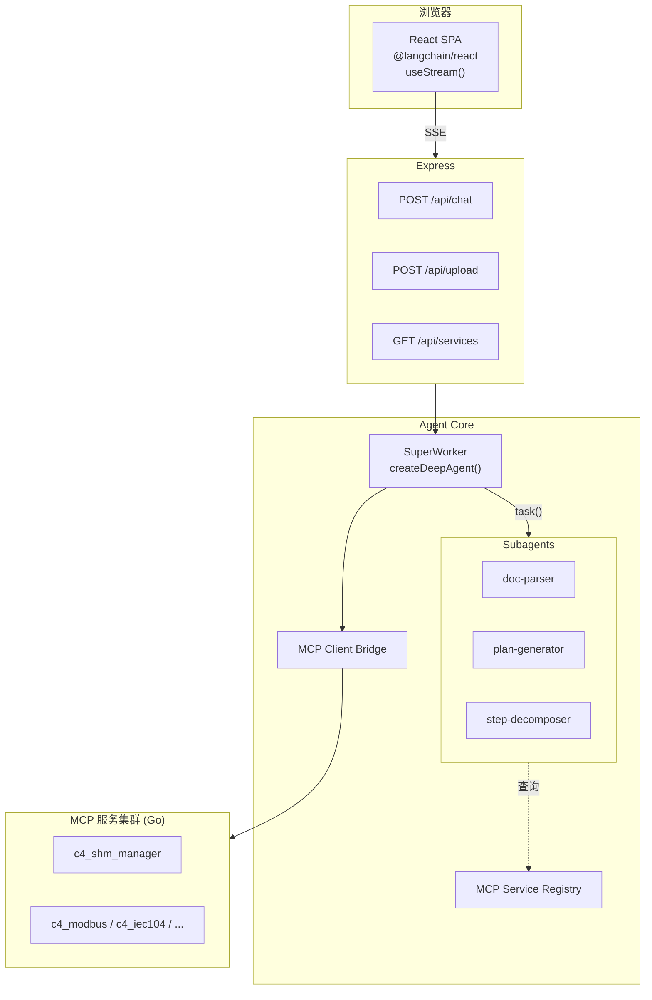
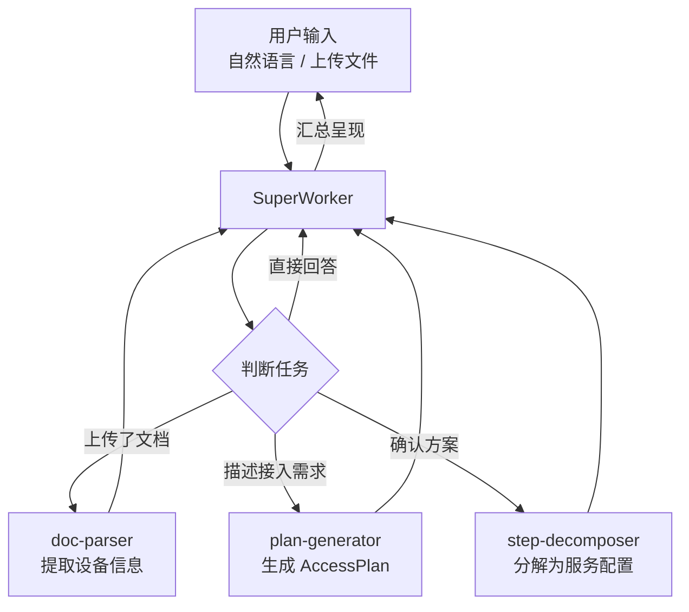
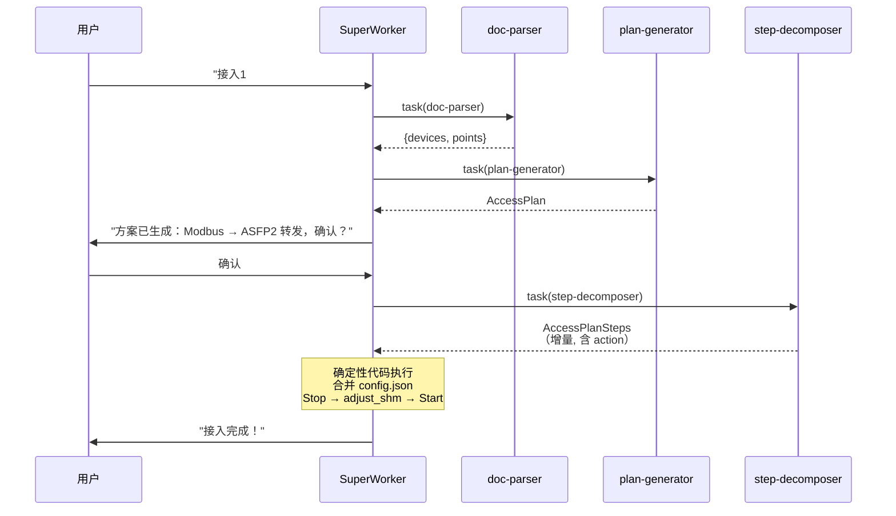
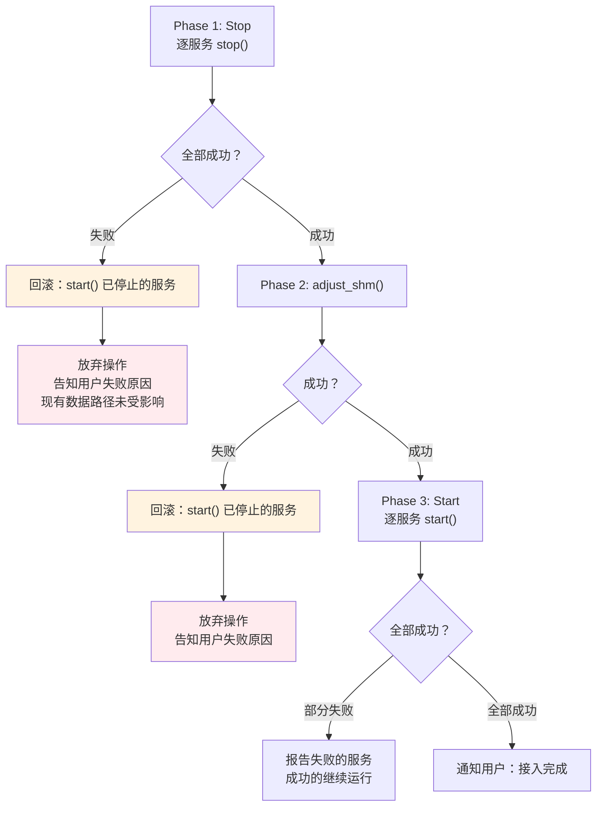
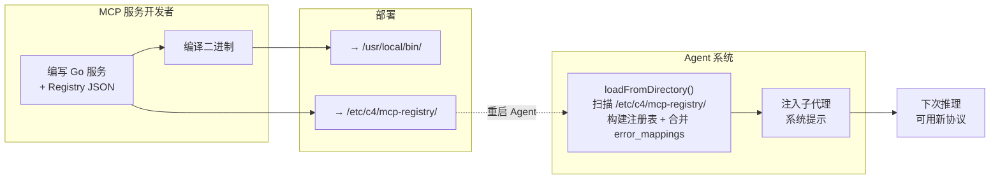
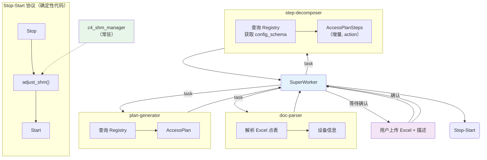

# C4 Agent 系统架构设计

> **版本**：v0.3.0 | **最后更新**：2026-08-06 | **父文档**：[c4_architecture.md](c4_architecture.md)
>
> **设计范围**：C4 Agent 系统的数据接入架构，覆盖从用户输入到 MCP 服务启动的完整数据接入流程。监控自愈等功能不在本次设计范围内。

---

## 1. 设计背景

### 1.1 定位

C4 Agent 是 C4 实例的智能决策层。它运行在工业数据服务器上，通过 Web 界面与用户交互，
通过 MCP 协议管理和监控 Go 编写的 MCP 服务集群。**Agent 不进入实时数据路径。**

Agent 是一个**单一系统**，不是多个独立 Agent 的集合。它使用 **SuperWorker + Subagent** 模式：
一个主代理（SuperWorker）承担主要的理解和推理工作，必要时将需要隔离上下文的专项任务委托给子代理（Subagent）。

### 1.2 功能覆盖

Agent 系统覆盖数据接入流程中 Agent 侧的全部职能：

| 阶段 | 功能 | 承担方式 |
|------|------|---------|
| **理解** | C4_FUN_00001 理解自然语言、C4_FUN_00002/00003 解析文档 | SuperWorker 直接处理 + 委托 doc-parser 子代理 |
| **规划** | C4_FUN_00004 生成接入方案、C4_FUN_00044 分解为可执行配置 | SuperWorker → plan-generator → step-decomposer |
| **执行** | C4_FUN_00006 MCP 生命周期管理、C4_FUN_00007 常规操作自主执行 | SuperWorker 直接执行（Stop-Start 为确定性代码逻辑） |
| **交互** | C4_FUN_00041 Web 界面、C4_FUN_00005 非技术语言 | Express + React（SuperWorker 对话能力） |
| **扩展** | C4_FUN_00017 新协议 MCP 服务可插拔 | MCP Service Registry（基础设施） |

### 1.3 框架选型

| 组件 | 选型 | 理由 |
|------|------|------|
| Agent 框架 | `deepagents` v1.11.1（LangChain/LangGraph） | 原生 SuperWorker + Subagent、中间件栈、记忆 |
| LLM | `@langchain/deepseek` v1.1.5 | 已预置 `DEEPSEEK_API_KEY` |
| MCP 客户端 | `@modelcontextprotocol/sdk` | Go MCP 服务使用 stdio 传输 |
| 服务端 | `express` v5 | 文件上传、REST API、静态托管、中间件 |
| 前端 | `@langchain/react`（`useStream`） | 子代理流式渲染、todo、中断，deepagents 原生支持 |
| 类型 | `zod` v4 | Schema + API 校验 |

---

## 2. 整体架构

### 2.1 SuperWorker + Subagent 模式

```
用户浏览器 (React SPA)
    │
    ▼ HTTP/SSE
┌─────────────────────────────────────────────────────────────┐
│                    Express Server                             │
│  POST /api/chat    POST /api/upload   GET /api/services      │
└────────────────────────┬────────────────────────────────────┘
                         │
                         ▼
┌─────────────────────────────────────────────────────────────┐
│              SuperWorker (createDeepAgent)                     │
│                                                               │
│  System Prompt: C4 Agent 角色 + 可用子代理清单                │
│  Middleware: Memory + Summarization                           │
│  Tools: task（子代理委托），MCP 工具                           │
│                                                               │
│  直接能力: 理解意图 · 引导澄清 · 回答咨询 · 判断委托时机       │
│                                                               │
│  ┌───────────────────────────────────────────────────────┐  │
│  │ Subagent: doc-parser    │ Subagent: plan-generator    │  │
│  │ 解析文档提取设备信息     │ 生成结构化 AccessPlan       │  │
│  │ C4_FUN_00002/00003     │ C4_FUN_00004               │  │
│  ├─────────────────────────┼─────────────────────────────┤  │
│  │ Subagent: step-        │ Subagent: —                │  │
│  │ decomposer             │ （执行阶段由 SuperWorker    │  │
│  │ AccessPlan → 服务配置   │  直接调用确定性代码，        │  │
│  │ C4_FUN_00044           │  不需要子代理）              │  │
│  │                        │                             │  │
│  ├─────────────────────────┼─────────────────────────────┤  │
│  │                          SuperWorker 直接处理              │  │
│  │                          一般性问题、澄清追问等             │  │
│  └───────────────────────────────────────────────────────┘  │
│                                                               │
│  ┌───────────────────────────────────────────────────────┐  │
│  │              MCP Client Bridge                          │  │
│  │  Stdio Transport · Tool Converter · Permission         │  │
│  └───────────────────────────────────────────────────────┘  │
│  ┌───────────────────────────────────────────────────────┐  │
│  │              MCP Service Registry                       │  │
│  │  动态协议映射 · 配置 Schema · C4_FUN_00017 扩展         │  │
│  └───────────────────────────────────────────────────────┘  │
└─────────────────────────────────────────────────────────────┘
         │                  │                  │
         ▼                  ▼                  ▼
┌──────────────┐  ┌──────────────┐  ┌──────────────┐
│ c4_shm       │  │ c4_modbus    │  │ c4_iec104    │  ...
│ _manager     │  │ _client      │  │ _client      │
│   (Go,常驻)  │  │   (Go)       │  │   (Go)       │
└──────────────┘  └──────────────┘  └──────────────┘
         ▲                  ▲                  ▲
         └──────────────────┼──────────────────┘
                            │ 浏览器
                 React SPA (@langchain/react)
                 useStream() → 流式 Agent 交互
```



### 2.2 SuperWorker

SuperWorker 是用户对话的**唯一入口**，承担两方面职责：

**直接处理**（无需委托）：
- 理解用户自然语言意图（C4_FUN_00001）
- 引导用户澄清不明确的信息（C4_FUN_00005）
- 回答一般性咨询问题
- 判断何时需要委托子代理

**委托子代理**（需要专用工具或隔离上下文时）：
- 上传文件需解析 → 委托 doc-parser
- 需生成结构化方案 → 委托 plan-generator
- 需将方案分解为配置 → 委托 step-decomposer
- 配置生成后 → 直接执行 Stop-Start 协议（确定性代码，非子代理）



### 2.3 完整请求流程

以"用户上传 Modbus 点表并提出接入需求"为例：

```
用户: "接入华能阿拉善1#风机，这是点表" + 上传 Excel
         │
         ▼
┌─────────────────────────────────────────────────────┐
│ SuperWorker                                          │
│ "用户上传了文件，需要先解析"                           │
│ → task(subagent_type="doc-parser",                   │
│        prompt="解析此 Excel 点表提取设备信息")         │
└───────────┬─────────────────────────────────────────┘
            │
            ▼
┌─────────────────────────────────────────────────────┐
│ doc-parser (C4_FUN_00002)                            │
│ 工具: xlsx 解析                                       │
│ → 输出: { name:"1#风机", protocol:"modbus_tcp",       │
│           points:[{name:"windspeed",addr:1000},...]}  │
└───────────┬─────────────────────────────────────────┘
            │
            ▼
┌─────────────────────────────────────────────────────┐
│ SuperWorker                                          │
│ "文件解析完成。检测到 Modbus TCP 设备，生成接入方案"    │
│ → task(subagent_type="plan-generator",               │
│        prompt="为设备生成 AccessPlan...")              │
└───────────┬─────────────────────────────────────────┘
            │
            ▼
┌─────────────────────────────────────────────────────┐
│ plan-generator (C4_FUN_00004)                        │
│ 查询 Registry → 输出: AccessPlan                      │
│ （格式定义见 §3.2.1.2a）                               │
└───────────┬─────────────────────────────────────────┘
            │
            ▼
┌─────────────────────────────────────────────────────┐
│ SuperWorker                                          │
│ "方案已生成：Modbus TCP → ASFP2 转发，请确认"         │
│ → 等待用户确认 (interrupt)                             │
└───────────┬─────────────────────────────────────────┘
            │ 用户确认
            ▼
┌─────────────────────────────────────────────────────┐
│ SuperWorker                                          │
│ 自动链式执行：先委托 step-decomposer → 取得          │
│ AccessPlanSteps → 直接执行 Stop-Start 协议             │
│ （确定性代码：合并配置 → stop → adjust_shm → start）    │
│ （Agent 保证配置正确性，无需用户审核细节参数）          │
└───────────┬─────────────────────────────────────────┘
            │
            ▼
┌─────────────────────────────────────────────────────┐
│ step-decomposer (C4_FUN_00044)                       │
│ 查询 Registry 获取每类服务的 config_schema            │
│ 从 AccessPlan 提取 plan 值 + 填充默认值                │
│ → 输出 AccessPlanSteps（本次接入任务的增量配置）        │
│   每项含 action: add / modify / delete                 │
└───────────┬─────────────────────────────────────────┘
            │ 返回 SuperWorker
            ▼
┌─────────────────────────────────────────────────────┐
│ Step 3: 执行（确定性代码，非 LLM）                     │
│ ① 合并 AccessPlanSteps → config.json                 │
│ ② Stop 所有数据路径 MCP → adjust_shm → Start         │
└───────────┬─────────────────────────────────────────┘
            │
            ▼
         "接入完成！"
```



---

## 3. 核心组件

### 3.1 SuperWorker

```typescript
const superWorker = createDeepAgent({
  model: new ChatDeepSeek({ apiKey: process.env.DEEPSEEK_API_KEY }),
  // 注：示例代码，实际实现从 /etc/c4/agent.json 读取 model.provider/name/api_key_env
  systemPrompt: SUPERWORKER_SYSTEM_PROMPT,

  // 多轮对话需要记忆 + 摘要
  middleware: [
    createMemoryMiddleware({ backend: new StateBackend() }),
    createSummarizationMiddleware(),
  ],

  tools: [/* MCP 工具运行时注入 */],

  subagents: [
    docParserSubagent,
    planGeneratorSubagent,
    stepDecomposerSubagent,
  ],
})
```

**AgentState 与防 SummarizationMiddleware 丢上下文**：

`SummarizationMiddleware` 长对话时压缩 `messages` 字段，但 **LangGraph 的结构化状态字段不受压缩影响**。
利用此特性，在 AgentState 中维护流程关键信息，确保 SuperWorker 即使对话历史被压缩也不会"失忆"。

```typescript
// LangGraph graph state annotation — 定义流程关键字段
const C4AgentState = Annotation.Root({
  // ===== 消息（唯一被 SummarizationMiddleware 压缩的字段） =====
  messages: Annotation<BaseMessage[]>({
    reducer: messagesStateReducer,
  }),

  // ===== 流程阶段（不被压缩，始终精确） =====
  phase: Annotation<"idle" | "parsing" | "parsed" | "plan_ready" | "confirmed" | "configuring" | "starting">({
    default: () => "idle",
  }),

  // ===== 当前阶段结果（不被压缩） =====
  status: Annotation<"success" | "error">({
    default: () => "error",
  }),

  // ===== 当前接入方案（用户确认后冻结，不被压缩） =====
  accessPlan: Annotation<object | null>({
    default: () => null,
  }),

  // ===== 等待中的子代理（崩溃恢复用） =====
  pendingSubagent: Annotation<string | null>({
    default: () => null,
  }),

  // ===== 用户原始请求（长对话中追溯） =====
  userRequest: Annotation<string | null>({
    default: () => null,
  }),
})
```

**写入时机**（SuperWorker 在关键流转点更新 state）：

| 触发事件 | 写入 |
|----------|------|
| 用户发起新接入请求 | `userRequest = msg`, `phase = "parsing"`, `status = "success"` |
| doc-parser 返回 | `phase = "parsed"` |
| plan-generator 返回 | `phase = "plan_ready"`, `accessPlan = result` |
| 用户确认方案 | `phase = "confirmed"` |
| 委托 step-decomposer | `phase = "configuring"`, `pendingSubagent = taskId` |
| step-decomposer 返回 | `phase = "starting"` |
| Stop-Start 执行完成 | `phase = "idle"`, `accessPlan = null`, `pendingSubagent = null` |
| 任一子代理或执行模块失败 | `status = "error"`（phase 保持不变，保留 userRequest + accessPlan 供具体步骤重试） |

SuperWorker 每个推理周期开始时，先读取 `state.phase` 判断当前阶段——不需要从压缩后的对话历史中推断。

**SuperWorker 系统提示结构**：

```
你是 C4 Agent，运行于工业数据服务器上，帮助用户完成数据接入工作。

## 核心原则
- 不进入实时数据路径。你负责理解、规划、配置和执行。
- c4_shm_manager 始终运行，作为共享内存基础设施。
- 涉及数据路径变更的操作必须在用户确认接入方案后执行 (C4_RS_00066)。
- 遵守以下非技术语言规则（硬约束）。

## 可用子代理
| 子代理 | 使用场景 |
| doc-parser | 用户上传了 Excel/CSV/PDF 文档，提取设备信息 |
| plan-generator | 从设备信息生成结构化的接入方案 |
| step-decomposer | 将接入方案分解为 MCP 服务配置 |

配置生成后，由 SuperWorker 直接调用确定性代码执行 Stop-Start 协议（合并 config.json → stop → adjust_shm → start），不需要子代理。

任何未匹配上述子代理的任务由 SuperWorker 直接处理。

## 非技术语言规则（硬约束）
与用户交流时，必须将以下内容自行转换为自然语言描述，不得直接展示：

**1. 协议与通信术语**
- "Modbus TCP"、"IEC104"、"ASFP2" → 用 "数据采集"、"设备通信"、"数据转发" 替代
  （例外：在向用户展示接入方案等待确认时，可用协议名 + 通俗解释，如"通过 Modbus 通信采集风机数据，转发到中心侧数据库"）
- "波特率 9600, 8 数据位, 1 停止位, 偶校验" → "串口通信参数已配置"

**2. 共享内存与内部标识**
- "shm_id"、"shm"、"共享内存" → "数据通道"
- "point_count"、"max_points" → 不提，只描述"数据点容量"
- "adjust_shm" → "调整数据管道"
- "Stop-Start 协议" → "重启服务"

**3. 错误与内部标识**
- 永远不向用户展示：错误码（如 SHM_CORRUPTED）、MCP 工具名（如 output_plan_steps）、
  内部状态码、JSON 字段名、枚举值、端口号
- 收到任何错误信息时，自行转换为用户可理解的自然语言描述
- 如果无法判断错误的准确含义，使用通用描述"操作遇到问题"并建议稍后重试，不猜测原因
- 已知的关键错误码（如 CONNECTION_REFUSED）在传入 SuperWorker 之前已由 MCP Client Bridge
  转换为自然语言，无需 SuperWorker 再次翻译

**4. 永远不向用户直接展示**
- JSON 结构 / 原始错误消息 / MCP 工具名 / 端口号 / 内部状态码 / 枚举值

## 可用 MCP 服务类型（动态生成）
{{ service_catalog }}

（`service_catalog` 仅含服务名、角色、协议、简介——不含 config_schema。
 完整字段定义见 [§3.3 Registry 双层注入](#33-mcp-service-registryc4_fun_00017)）

## 工作指南
- 上传文件 → 自动委托 doc-parser 解析
- 解析完成 → 展示结果，询问是否生成方案
- 方案生成 → 展示方案（非技术语言），等待用户确认
- 用户确认 → 自动执行 step-decomposer，然后直接调用 Stop-Start 协议
  （Agent 保证从方案到配置的转化正确性，用户无需审核技术参数）
```

### 3.2 子代理定义与执行模块

**doc-parser**（C4_FUN_00002 / 00003）：

```typescript
const docParserSubagent = {
  name: "doc-parser",
  description: "解析 Excel/CSV/PDF/Word/图片，提取设备地址、寄存器映射、数据类型、通信参数。工具接收文件路径字符串，自行打开文件读取内容。",
  systemPrompt: "从文档中提取接入所需关键信息。支持 .xlsx .csv .pdf .docx .png .jpg。工具参数是文件路径，收到后调用对应解析工具。输出结构化数据。信息不完整时列出缺失字段。",
  tools: [xlsxParserTool, csvParserTool, pdfParserTool, imageAnalyzerTool],
}
```

**plan-generator**（C4_FUN_00004）：

plan-generator 通过系统提示中的 L1 服务摘要（`{{ service_catalog }}`）获知可用服务
及其支持协议，无需调用工具查询——协议选择所需信息全部在 L1 层。完整 config_schema
在后续 step-decomposer 环节按需拉取。

```typescript
const planGeneratorSubagent = {
  name: "plan-generator",
  description: "从设备信息生成结构化接入方案 (AccessPlan)，包含协议选择、设备清单、数据点映射、转发目标",
  systemPrompt: "根据设备连接参数推断协议，从以下可用服务中选择匹配的服务类型生成 AccessPlan。\n\n## 可用 MCP 服务\n{{ service_catalog }}",
  tools: [],
}
```

**step-decomposer**（C4_FUN_00044）：

step-decomposer 为**本次接入任务**生成增量配置。它不关心 config.json 中已有哪些服务——
只根据当前请求的 AccessPlan 输出需要新增、修改或删除的 MCP 服务条目。每条输出带有 `action`
字段（`add` / `modify` / `delete`），由执行模块负责合并到全量 config.json。

```typescript
const stepDecomposerSubagent = {
  name: "step-decomposer",
  description: "将本次接入的 AccessPlan 分解为增量 MCP 服务配置。输出带 action（add/modify/delete）的 AccessPlanSteps，告知执行模块如何更新 config.json。",
  systemPrompt: [
    "你负责将本次接入方案转化为增量 MCP 服务配置。",
    "只需输出本次请求涉及的服务，不需要关心 config.json 中已有的其他服务。",
    "每条配置用 action 标注操作类型：",
    "  add    — 本次新增的 MCP 服务",
    "  modify — 修改已有服务的参数（如添加新转发目标）",
    "  delete — 本次要移除的 MCP 服务",
    "",
    "流程：1) 查 Registry 获取每类服务的 config_schema",
    "      2) 从 AccessPlan 提取设备/转发信息填入 plan 来源字段",
    "      3) 对 source=default 的字段填充 config_schema 中的默认值",
    "c4_shm_manager 已在运行，不在输出范围。",
    registry.generateServiceCatalog(),
    registry.generateConfigHints(),
    "所有服务在同一 Stop-Start 周期统一处理。用 output_plan_steps 输出。",
  ].join("\n"),
  tools: [outputPlanStepsTool, queryRegistryTool],
}
```

**执行模块（确定性代码，非子代理）**：

step-decomposer 输出 AccessPlanSteps 后，后续操作全部是确定性代码逻辑，
不需要 LLM 推理，因此不作为子代理——由 SuperWorker 的运行时直接调用：

**mergeConfigFromSteps(steps, configPath)**：合并 + 备份 + 原子写入 config.json

```
1. 读取现有 /etc/c4/config.json：
   - 不存在 → 创建空结构；新文件写入后也备份一份 config.json.bak
   - 存在且有效 → 先复制当前内容到 config.json.bak（失败前快照）
   - 存在但损坏（JSON 解析失败）→ 若 config.json.bak 存在则恢复之，否则创建空结构
2. 逐一处理 AccessPlanSteps（add/modify/delete — 见 §3.2.1.6）
3. 合并结果先写入 config.json.tmp，然后 rename() → config.json（原子写入）
```

**executeStopAndStart()**：Stop-Start 安全协议。`stop` 是幂等操作（对已停止的服务调用
仍返回 success），此属性是启动恢复（§3.2.3 无条件 Stop-Start）的基础。

```
Stop 阶段:
  for 每个数据路径 MCP 服务（不含 c4_shm_manager）: call stop()
  if 任一失败:                                  ← stop 不读 config，非 config 类失败
    for 已停止的服务: call start() 恢复          ← 回滚：只 restart，不恢复 config
    abort 操作

adjust_shm 阶段:
  call adjust_shm()
  if 失败:
    if 错误码为 CONFIG_MISSING_SECTION / DUPLICATE_KEY / UNKNOWN_READER_KEY:
      将 config.json.bak 恢复为 config.json      ← config 有问题，回退配置
    for 已停止的服务: call start() 恢复           ← 统一 restart
    abort 操作
  （SHM_NOT_CREATED / SHM_SYSCALL_FAILED 等非 config 类失败：
    不恢复 config，后续用户解决 shm 问题后只需重试 adjust_shm → start）

Start 阶段:
  for 每个 MCP 服务: call start()
  部分失败 → 不回滚已成功的，只报告哪些失败
```

**调用时机**：SuperWorker 收到 step-decomposer 的 AccessPlanSteps 后，直接调用这两个函数，
执行结果返回 SuperWorker，由 SuperWorker 以非技术语言告知用户。

#### 3.2.1 AccessPlanSteps 格式与转换规则

AccessPlanSteps 是 step-decomposer 的输出，描述本次接入任务需要执行的增量操作。
执行模块将其转换为 config.json 中的全量配置。

**3.2.1.1 格式定义**

```typescript
// 操作类型
type StepAction = "add" | "modify" | "delete"

// 单条操作步骤
interface ServiceStep {
  action: StepAction           // 操作类型
  service_type: string         // MCP 服务类型，如 "c4_modbus_client"
  instance: {
    id: string                 // 实例唯一标识（modify/delete 按此匹配）
    name: string               // 实例名称（人可读）
    // + 服务特有的配置字段，值来源见 §3.2.1.2
  }
  points: ServicePoint[]       // 数据点列表
}

// 数据点（Writer / Reader 共用，字段按服务类型区分）
interface ServicePoint {
  // ---- Writer 通用 ----
  id: string                   // 采集点标识符（global key = {instance.id}.{point.id}）
  // + 协议特有字段（addr, uid, fun, type 等）

  // ---- Reader 通用 ----
  key?: string                 // 引用的 Writer key（{service_id}.{point_id}）
  // + 协议特有字段（addr 等）

  // shm_id 固定为 0，由 c4_shm_manager 分配后回填
}
```

**Writer 点特有字段**（按服务类型）：

| 服务类型 | point 字段 | 含义 | 来源 |
|----------|-----------|------|------|
| `c4_modbus_client` | `uid`, `addr`, `fun`, `type`, `swap` | Modbus 寄存器参数 | plan（从点表提取） |
| `c4_iec104_client` | `addr` | IEC104 信息体地址 (IOA) | plan（从点表提取） |
| `c4_asfp2_server` | `addr` | ASFP2 协议 key（接收端） | plan |

**Reader 点特有字段**（按服务类型）：

| 服务类型 | point 字段 | 含义 | 来源 |
|----------|-----------|------|------|
| `c4_asfp2_client` | `key`, `addr` | 转发点配置 | plan + default |
| `c4_influxdb_client` | `key` | 入库点引用 | plan |

**3.2.1.2 字段值来源（config_schema.source 驱动）**

每个服务实例的 config_schema 中，每个字段标注 `source`，决定 step-decomposer 从何处取值：

| source | 含义 | 填充方式 |
|--------|------|---------|
| `"plan"` | 需从 AccessPlan 提取 | step-decomposer 从用户确认的方案中取值，如 IP、设备名 |
| `"default"` | 使用默认值 | 直接取 `config_schema.fields[field].default` |

step-decomposer 对每个服务类型：
1. 调 `queryRegistryTool(service_type)` 获取完整 config_schema
2. 遍历 `config_schema.fields`：
   - `source: "plan"` → 从 AccessPlan 对应字段提取
   - `source: "default"` → 填入 `default` 值
3. `config_schema.required` 中的字段必须全部有值，否则报错

##### 3.2.1.2a AccessPlan 格式定义

AccessPlan 是 plan-generator 的输出，也是 step-decomposer 的输入。它是一个
内存中的结构化 JSON 对象，描述本次接入的完整意图——设备采集和转发目标。

```typescript
interface AccessPlan {
  // ===== 场站信息 =====
  site: {
    name: string              // 场站名称，如 "华能阿拉善"
    abbr: string              // 场站缩写，如 "hnals"（用于生成 instance.id）
  }

  // ===== 采集设备列表 =====
  devices: DeviceSpec[]

  // ===== 转发目标列表 =====
  forward_targets: ForwardTargetSpec[]
}

// 单个采集设备
interface DeviceSpec {
  name: string                // 设备名称，如 "1#风机"
  seq: number                 // 设备编号，如 1（用于生成 instance.id）
  protocol: string            // 通信协议，如 "modbus_tcp", "iec104"
  connection: {
    ip: string                // 设备 IP
    port: number              // 端口
  }
  points: DevicePoint[]       // 采集点列表
}

// 采集点（从点表提取）
interface DevicePoint {
  name: string                // 点名称，如 "windspeed"（对应 point.id）
  addr: number                // 协议地址（Modbus=寄存器地址, IEC104=IOA）
  // 以下为协议特有字段，视设备协议而定：
  uid?: number                // Modbus: 单元标识符
  fun?: number                // Modbus: 功能码
  type?: number               // Modbus: 数据类型枚举
  swap?: number               // Modbus: 字节交换大小
}

// 转发目标
interface ForwardTargetSpec {
  name: string                // 目标名称，如 "中心侧数据库"
  protocol: string            // 转发协议，如 "asfp2", "influxdb"
  connection: {
    ip: string                // 目标 IP
    port: number              // 端口
  }
  // 转发点的 addr 映射（可选，由 step-decomposer 自动分配）
  point_addr_start?: number   // 转发点 addr 起始值，默认自动分配
}
```

**AccessPlan 示例**（接入华能阿拉善 1# 风机 + 转发到中心侧）：

```json
{
  "site": {
    "name": "华能阿拉善",
    "abbr": "hnals"
  },
  "devices": [
    {
      "name": "1#风机",
      "seq": 1,
      "protocol": "modbus_tcp",
      "connection": { "ip": "192.168.110.1", "port": 502 },
      "points": [
        { "name": "windspeed",  "addr": 1000, "uid": 1, "fun": 3, "type": 10, "swap": 2 },
        { "name": "temperature", "addr": 1002, "uid": 1, "fun": 3, "type": 10, "swap": 2 }
      ]
    }
  ],
  "forward_targets": [
    {
      "name": "中心侧数据库",
      "protocol": "asfp2",
      "connection": { "ip": "172.16.109.11", "port": 9999 }
    }
  ]
}
```

**step-decomposer 如何使用 AccessPlan**：

1. `site.abbr` + `device.seq` + 服务角色缩写 → 生成 `instance.id`（如 `hnals_1_scada`）
2. `device.connection.{ip, port}` → 填入 `source="plan"` 的实例配置字段
3. `device.points[]` → 映射到 Writer 服务的 `points[]`（name→id, addr, uid, fun, type, swap）
4. `forward_targets[].connection.{ip, port}` → 填入 Reader 服务的实例配置
5. 每个采集点自动生成对应的 Reader point：`key = {instance.id}.{point.name}`，`addr` 由 step-decomposer 分配

**3.2.1.3 实例 id 生成规则**

`id` 是 config.json 中每个服务实例的唯一标识。step-decomposer 按以下规则生成：

```
{site_abbr}_{device_seq}_{role_abbr}
```

其中：
- `site_abbr`：场站缩写，从 AccessPlan 提取（如 "hnals" = 华能阿拉善）
- `device_seq`：设备编号，从 AccessPlan 提取（如 "1" = 1#风机）
- `role_abbr`：角色缩写，按服务类型固定映射：
  - `c4_modbus_client` → `scada`
  - `c4_iec104_client` → `transformer`
  - `c4_asfp2_client` → `asfp2`
  - `c4_influxdb_client` → `influx`
  - 其余 → llm_assign（step-decomposer 自行命名）

示例：`hnals_1_scada` = 华能阿拉善 1# 风机 SCADA 采集

points 的 `id` 字段直接使用点表中的点名称（如 `windspeed`、`temperature`），
全局 key 自动组合为 `{instance.id}.{point.id}`（如 `hnals_1_scada.windspeed`）。

**3.2.1.4 Writer/Reader 自动分类**

`c4_shm_manager` 的 `writer` / `reader` 数组在 config.json 中按服务角色自动维护。
执行模块合并 AccessPlanSteps 时：

- `add` 一个 role=writer 的服务 → 将 `service_type` 追加到 `c4_shm_manager.writer[]`
- `add` 一个 role=reader 的服务 → 将 `service_type` 追加到 `c4_shm_manager.reader[]`
- `delete` 最后一个该类型实例 → 从对应数组中删除 `service_type`
- `modify` → 不改变 writer/reader 分类

服务角色从 Registry JSON 的 `role` 字段获取（第 §3.3 定义）。

**3.2.1.5 具体示例**

**示例 1：add（首次接入风机）**

输入 AccessPlan：接入华能阿拉善 1# 风机，协议 modbus_tcp，IP 192.168.110.1，数据点 windspeed(addr=1000) 和 temperature(addr=1002)

step-decomposer 输出 AccessPlanSteps：

```json
[
  {
    "action": "add",
    "service_type": "c4_modbus_client",
    "instance": {
      "id": "hnals_1_scada",
      "name": "华能阿拉善1#风机SCADA服务",
      "ip": "192.168.110.1",
      "port": 502
    },
    "points": [
      {"id": "windspeed",  "uid": 1, "addr": 1000, "fun": 3, "type": 10, "swap": 2},
      {"id": "temperature", "uid": 1, "addr": 1002, "fun": 3, "type": 10, "swap": 2}
    ]
  },
  {
    "action": "add",
    "service_type": "c4_asfp2_client",
    "instance": {
      "id": "hnals_asfp2_center",
      "name": "转发到中心侧数据库",
      "ip": "172.16.109.11",
      "port": 9999
    },
    "points": [
      {"key": "hnals_1_scada.windspeed",  "addr": 3001},
      {"key": "hnals_1_scada.temperature", "addr": 3002}
    ]
  }
]
```

执行模块合并后 config.json：

```json
{
  "c4_shm_manager": {
    "writer": ["c4_modbus_client"],
    "reader": ["c4_asfp2_client"]
  },
  "c4_modbus_client": [{
    "name": "华能阿拉善1#风机SCADA服务",
    "id": "hnals_1_scada",
    "ip": "192.168.110.1",
    "port": 502,
    "hton_register": 1, "hton_total": 0,
    "t0": 30, "t1": 10, "retries": 10,
    "coils_quantity_max": 2000, "registers_quantity_max": 125,
    "timer": 1000,
    "points": [
      {"id": "windspeed",  "uid": 1, "addr": 1000, "fun": 3, "type": 10, "swap": 2, "shm_id": 0},
      {"id": "temperature", "uid": 1, "addr": 1002, "fun": 3, "type": 10, "swap": 2, "shm_id": 0}
    ]
  }],
  "c4_asfp2_client": [{
    "id": "hnals_asfp2_center",
    "name": "转发到中心侧数据库",
    "ip": "172.16.109.11", "port": 9999,
    "t0": 30, "t1": 20, "t2": 10,
    "key_sequence": 1, "same_data_type": 1, "same_timestamp": 1, "smart": 1,
    "forward_kack": 255, "inverse_keep": 0, "timer": 100,
    "points": [
      {"key": "hnals_1_scada.windspeed",  "addr": 3001, "shm_id": 0},
      {"key": "hnals_1_scada.temperature", "addr": 3002, "shm_id": 0}
    ]
  }]
}
```

> `shm_id` 全部为 0——将在 Stop-Start 协议中由 `c4_shm_manager.adjust_shm()` 统一分配并回填。

**示例 2：modify（已有转发目标，增加新的转发目标）**

已有 config.json 中含 `c4_asfp2_client[0]`（发往 172.16.109.11）。
用户请求再转发给第三方服务器 172.16.109.13。

step-decomposer 输出 AccessPlanSteps：

```json
[
  {
    "action": "add",
    "service_type": "c4_asfp2_client",
    "instance": {
      "id": "hnals_asfp2_third",
      "name": "转发到第三方数据服务器",
      "ip": "172.16.109.13",
      "port": 9999
    },
    "points": [
      {"key": "hnals_1_scada.windspeed",  "addr": 3001},
      {"key": "hnals_1_scada.temperature", "addr": 3002}
    ]
  }
]
```

执行模块：`c4_asfp2_client[]` 已有 1 个实例，追加第 2 个。Writer 不变。

**示例 3：delete（停用设备）**

用户请求停用华能阿拉善 2# 风机（`hnals_2_scada`）。
该设备只有一个采集服务，没有专属的转发目标。

step-decomposer 输出 AccessPlanSteps：

```json
[
  {
    "action": "delete",
    "service_type": "c4_modbus_client",
    "instance": { "id": "hnals_2_scada" }
  }
]
```

执行模块：删除 `c4_modbus_client[]` 中 id=`hnals_2_scada` 的条目。
若这是 `c4_modbus_client` 的最后一个实例，同时从 `c4_shm_manager.writer[]` 中移除
`"c4_modbus_client"`。

> **相关性检查**：删除设备时，step-decomposer 需判断该设备的采集点是否还被其他
> Reader 引用（如 `c4_asfp2_client` 的 key）。若被引用，需同时生成对应的
> `modify` 操作删除 Reader 中的相关 points。

**3.2.1.6 转换规则（mergeConfigFromSteps 确定性逻辑）**

```
输入：AccessPlanSteps[], 现有 config.json（可能不存在）

对每个 ServiceStep：

  action = "add":
    1. 合并 instance + points，shm_id 全部填 0
    2. 将 service_type 的所有 Registry default 字段补齐（source=default 的字段）
    3. 检查 points 的 id 不重复，instance.id 不与现有冲突
    4. 追加到 config.json[service_type][] 末尾
    5. 若 config.json[service_type] 之前为空或不存在：
       ┌ role=writer → c4_shm_manager.writer[] 追加 service_type
       └ role=reader → c4_shm_manager.reader[] 追加 service_type

  action = "modify":
    1. 在 config.json[service_type][] 中按 instance.id 匹配
    2. 用 AccessPlanSteps 中的字段覆盖匹配实例的对应字段（浅合并）
    3. points 按 point.id 匹配：同名 point 更新字段，新 point 追加到末尾
    4. id 不匹配 → 报错

  action = "delete":
    1. 在 config.json[service_type][] 中按 instance.id 匹配
    2. 从数组中移除该实例
    3. 若删除后 config.json[service_type] 为空：
       ┌ role=writer → 从 c4_shm_manager.writer[] 中移除 service_type
       └ role=reader → 从 c4_shm_manager.reader[] 中移除 service_type

最终：整个合并结果先写 config.json.tmp，然后 rename() → config.json（原子写入）
```

**3.2.1.7 产物生命周期总览**

数据接入流程中涉及三个核心产物，按产生顺序和生命周期区分：

```
用户输入（自然语言 + 上传文件）
  │
  ▼  doc-parser
设备信息（内存对象，JSON）           ← 无名称，即解析结果
  │
  ▼  plan-generator
AccessPlan（内存对象，JSON）         ← 子代理产物，短暂存在
  │  生命周期：生成 → 展示确认 → 传入 step-decomposer 后不再使用
  │
  ▼  用户确认 → step-decomposer
AccessPlanSteps（内存对象，JSON）    ← 子代理产物，短暂存在
  │  生命周期：生成 → 校验 → 传入执行模块后不再使用
  │
  ▼  执行模块 mergeConfigFromSteps()
config.json（磁盘文件）              ← 持久化产物，跨重启生存
     生命周期：首次接入创建 → 每次接入更新 → 持续存续
```

| 产物 | 形态 | 存在位置 | 生命周期 | 格式 | 谁生产 | 谁消费 |
|------|------|---------|---------|------|--------|--------|
| **设备信息** | 内存对象 | LangGraph state / 子代理返回值 | 解析后即用，不持久化 | 结构化 JSON（`{name, protocol, points[]}`） | doc-parser | plan-generator |
| **AccessPlan** | 内存对象 | AgentState.accessPlan | 生成 → 展示 → 确认后传递给 step-decomposer | 结构化 JSON（协议、设备、数据点映射、转发目标） | plan-generator | SuperWorker（展示）、step-decomposer（分解） |
| **AccessPlanSteps** | 内存对象 | SuperWorker → 执行模块传参 | 生成 → 校验 → 传入 mergeConfigFromSteps 后销毁 | 结构化 JSON（`ServiceStep[]`，含 action） | step-decomposer | 执行模块 |
| **config.json** | 磁盘文件 | `/etc/c4/config.json` | 首次接入创建，之后每次接入更新，跨重启永久存续 | MCP 服务全量配置（见 c4_architecture.md §3.2） | 执行模块 | MCP 服务（启动读取）、Agent（下次接入参考） |

**用户可见性**：

| 产物 | 用户可见？ | 呈现方式 |
|------|:--:|---------|
| 设备信息 | ✅ | doc-parser 解析后 SuperWorker 以自然语言展示摘要 |
| AccessPlan | ✅ | plan-generator 生成后 SuperWorker 以非技术语言展示方案，**必须等待用户确认** |
| AccessPlanSteps | ❌ | 纯内部，用户不可见——Agent 保证 config_schema + 默认值填充的正确性 |
| config.json | ❌ | 纯内部，用户不可见——确定性代码合并，零误改 |

### 3.2.2 错误处理

SuperWorker 是所有错误的唯一出口——子代理失败时 SuperWorker 向用户呈现非技术语言的
错误信息。MCP 操作类错误遵循"安全优先，不残留中间态"原则：恢复已执行的操作后再告知用户。

**按子代理分别处理**：

| 子代理 | 失败模式 | 处理方式 |
|--------|---------|---------|
| **doc-parser** | 文件格式损坏或不支持 | "无法识别此文件格式，请确认文件完整且格式为 Excel、CSV、PDF 或图片。" |
| doc-parser | 解析成功但缺少关键字段 | 列出已有和缺失信息："找到了风速、温度共 2 个数据点，但缺少设备 IP 地址，请提供。" |
| **plan-generator** | 无法推断协议 / 未找到支持的服务 | "无法从设备信息确定通信方式。请提供通信方式（如设备直连、串口连接）和相关参数。" |
| **step-decomposer** | output_plan_steps 校验失败 | 重试一次。仍失败："配置生成遇到问题，请重新描述需求。不需要您提供技术细节，只需说明要接入哪个设备、转发到哪个系统。" |
| **执行模块** | stop 失败 | 回滚。放弃操作。"无法停止现有服务，接入请求已取消。当前运行的数据采集未受影响。" |
| 执行模块 | adjust_shm 失败（config 类：配置冲突/缺失） | 回退 config.json.bak → start 恢复。"接入方案中的配置与现有配置冲突，请调整后重试。" |
| 执行模块 | adjust_shm 失败（非 config 类：shm/系统错误） | start 恢复（不回退 config）。"数据管道调整遇到系统问题，请稍后重试。已接入的设备不受影响。" |
| 执行模块 | start 部分失败 | 已成功的保持运行，报告失败的服务："接入部分完成。以下服务未能启动：[列表]，其余正常运行。可以稍后重试。" |
| **SuperWorker** | LLM 超时或不可达 | "服务暂时不可用，请稍后重试。" |

**Stop-Start 安全协议**（详见 §3.2 执行模块中的 `executeStopAndStart()`）：



### 3.2.3 Agent 启动与恢复

Agent 每次启动无条件执行 Stop-Start 协议。不区分首次、正常重启还是崩溃恢复——
统一路径覆盖所有场景，无需状态检测、无需恢复日志、无边界条件。

```
Agent 启动
  │
  ├─ 1. 启动 / 重连 c4_shm_manager
  │     └─ MCP 连接（c4_shm_manager 自身处理 shm 新建或附加，见其 §1.3 崩溃恢复）
  │
  ├─ 2. 读取 /etc/c4/config.json
  │     不存在 → 启动完成（无数据路径服务，等待用户首次接入）
  │     存在但损坏（JSON 解析失败）：
  │       ┌ config.json.bak 存在且有效 → 恢复之，覆盖 config.json，继续
  │       └ config.json.bak 也不存在/损坏 → 清空，同"不存在"
  │     存在且有效   → 继续
  │
  ├─ 3. 确保 config.json 中所有 MCP 服务的 MCP 传输可用（不含 c4_shm_manager）：
  │     └─ 进程不存在 → spawn 进程 + 建立 MCP stdio 连接（不启动数据路径）
  │        进程已存在 → MCP stdio 重连（不重启进程，数据路径不受影响）
  │
  ├─ 4. 无条件执行 stop → c4_shm_manager.adjust_shm() → start
  │     · 首次启动：shm 通过 adjust_shm 间接创建（create_shm），服务初始化
  │     · 正常重启：config 与 shm 一致，adjust_shm 为 no-op；stop/start 重新加载
  │     · 崩溃后：无论崩溃在 stop/adjust_shm/start 哪一步，全路径重走一致化三者
  │     · stop 对已停止的服务是幂等操作（返回 success）
  │     · 正常重启数据中断 < 5ms（c4_shm_manager §1.2），低频可接受
  │     └─ 若任一服务 MCP 不可达：记录失败，继续处理其余服务
  │
  └─ 5. Agent 就绪
```

**崩溃场景自动覆盖**：

| 崩溃时刻 | 启动后效果 |
|----------|-----------|
| 正常运行中 | stop→adjust_shm(no-op)→start，<5ms 中断 |
| 更新 config 后，未执行 stop | adjust_shm 同步 config→shm，stop(idempotent)→start |
| stop 阶段完成 | adjust_shm 同步，start 恢复 |
| adjust_shm 完成 | start 恢复（stop 幂等不变） |
| start 阶段中途 | stop(all)→adjust_shm(no-op)→start，全部一致 |

> **统一路径原则**：config.json → shm → 服务状态三者由一次 Stop-Start 保证一致，
> 不依赖任何时刻的状态快照或判断分支。代价是每次重启的短暂中断（< 5ms），
> 换取零边界条件的恢复逻辑。

### 3.3 MCP Service Registry（C4_FUN_00017）

全局单例，所有子代理通过 `queryRegistryTool` 查询。Agent 启动时扫描 `agent.json` 中
`mcp_registry.path` 配置的目录（默认 `/etc/c4/mcp-registry/`）。

#### 3.3.0 双层注入设计

Registry 内容分两层交付，避免上下文窗口膨胀：

| 层 | 注入方式 | 内容 | 使用者 | 上下文位置 |
|---|---------|------|--------|-----------|
| **L1: 服务摘要** | 系统提示模板变量 `{{ service_catalog }}` | 服务名、display_name、role、protocols（含 description 和 selection_rules） | SuperWorker 路由 / plan-generator 选型 | **始终加载** |
| **L2: 完整定义** | 工具调用 `queryRegistryTool(service_type)` | 完整 Registry JSON（含 config_schema、binary_path、error_mappings） | step-decomposer 生成配置 | **按需拉取** |

**约束**：
- `{{ service_catalog }}` **只注入 L1**，不包含 `config_schema`、`binary_path`、`error_mappings`
- `queryRegistryTool` 返回指定服务的**完整 JSON**（所有字段）
- step-decomposer 只拉取当前 AccessPlan 涉及的服务类型，不全量加载
- plan-generator 通过 L1 选择协议，无需调用 `queryRegistryTool`（其 tools 列表不含此工具）

**运行时构建**：Agent 启动时 `McpServiceRegistry.loadFromDirectory()` 扫描全部 Registry JSON，
提取 L1 摘要生成 `service_catalog` 字符串，注入以下系统提示：
- SuperWorker 系统提示（§3.1）— 路由决策用途
- plan-generator 系统提示（§3.2）— 协议选择用途

L2 完整 JSON 保留在注册表内存中，仅 step-decomposer 通过 `queryRegistryTool` 按需拉取。

```json
// config/mcp-registry/c4_modbus_client.json
{
  "service_type": "c4_modbus_client",
  "display_name": "Modbus 数据采集",
  "role": "writer",
  "protocols": [{
    "protocol": "modbus_tcp",
    "description": "Modbus TCP 协议采集",
    "selection_rules": [
      { "condition": "device.port == 502", "description": "标准 Modbus TCP 端口" }
    ]
  }],
  "config_schema": {
    "required": ["id", "ip", "port", "timer"],
    "fields": {
      "ip":   { "type": "string",  "source": "plan",    "default": null, "description": "设备 IP" },
      "port": { "type": "integer", "source": "plan",    "default": 502,  "description": "端口" },
      "timer":{ "type": "integer", "source": "default", "default": 1000, "description": "采集周期(ms)" }
    }
  },
  "binary_path": "/usr/local/bin/c4_modbus_client",
  "error_mappings": {
    "MODBUS_EXCEPTION": "设备返回异常，请检查设备状态和寄存器配置",
    "GATEWAY_PATH_UNAVAILABLE": "网关路径不可达"
  }
}
```

**Registry JSON 由谁生成**：MCP 服务的开发者。每个 MCP 服务作为独立的 Go 项目交付，
Registry JSON 是服务包的一部分，与服务代码同仓库。Agent 不生成它——只读取它。

**交付物与部署位置**：

| 交付物 | 生成者 | 部署位置 | 用途 |
|--------|--------|---------|------|
| MCP 服务二进制 | MCP 服务开发者编译 | `/usr/local/bin/` | Agent spawn 子进程 |
| Registry JSON | MCP 服务开发者编写 | `/etc/c4/mcp-registry/` | 注册表加载元数据 |

JSON 中的 `binary_path` 字段指向二进制部署位置，是两者之间的关联键。

**完整扩展流程**：

```
1. MCP 服务开发者
   编写 Go 服务 + Registry JSON（同仓库）
         │
         ▼
2. 打包交付
   c4_modbus_client  → /usr/local/bin/c4_modbus_client        (二进制)
   registry JSON      → /etc/c4/mcp-registry/c4_modbus_client.json
         │
         ▼
3. 重启 Agent
   McpServiceRegistry.loadFromDirectory() 扫描 JSON
   → 构建运行时注册表
   → 提取 L1 摘要 → 注入 SuperWorker 系统提示 ({{ service_catalog }})
   → 合并所有 error_mappings → ERROR_TRANSLATIONS
   → L2 完整 JSON 保留在内存中，供 queryRegistryTool 按需返回
         │
         ▼
4. Planner 下次推理即可识别新协议
   无需修改 Agent 源代码
```



### 3.4 MCP Client Bridge

Agent 通过 `@modelcontextprotocol/sdk` 的 `StdioClientTransport` 连接 Go MCP 服务。

**工具转换与错误翻译**：`convertMcpTool` 将 MCP 工具包装为 LangChain `StructuredTool`。
在执行结果进入 Agent 上下文之前，对已知错误码做**确定性翻译**。
未匹配的错误码原样透传，由 SuperWorker 的兜底规则处理。

```typescript
const ERROR_TRANSLATIONS: Record<string, string> = {
  SHM_CORRUPTED:    "数据存储异常，请联系管理员检查共享内存状态",
  SHM_ALREADY_EXISTS: "共享内存已存在，请重启 Agent 后重试",
  SHM_NOT_CREATED:  "共享内存尚未初始化，请先完成首次接入",
  SHM_SYSCALL_FAILED: "系统资源不足，共享内存操作失败，请联系管理员",
  CONFIG_MISSING_SECTION: "配置文件不完整，请重新描述接入需求",
  CONFIG_PATH_MISSING: "配置文件路径无效，请检查 Agent 部署是否正确",
  DUPLICATE_KEY:    "数据点配置冲突，请检查是否有重复的数据点名称",
  UNKNOWN_READER_KEY: "转发配置引用了不存在的数据点，请确认数据点名称正确",
  CONNECTION_REFUSED: "设备连接失败，请确认设备已开机且网络可达",
  TIMEOUT:          "设备响应超时，请检查网络连接和设备状态",
  SERVICE_NOT_READY: "服务尚未就绪，请稍后再试",
  INVALID_CONFIG:   "配置参数有误，请检查提交的信息",
  FILE_NOT_FOUND:   "配置文件未找到，请联系管理员确认部署",
  PERMISSION_DENIED: "权限不足，请联系管理员",
}

function translateError(text: string): string {
  for (const [code, msg] of Object.entries(ERROR_TRANSLATIONS)) {
    if (text.includes(code)) return msg
  }
  return text  // 未匹配的错误码原样透传，SuperWorker 兜底
}
```

**分层处理**：

```
MCP 服务返回 "CONNECTION_REFUSED: 192.168.1.1:502"
    │
    ▼
convertMcpTool.translateError()        ← 确定性层：匹配 → 翻译
    │                                    ERROR_TRANSLATIONS 由 Registry
    │                                    注册文件的 error_mappings 合并生成
    ▼
"设备连接失败，请确认设备已开机且网络可达"
    │
    ▼
SuperWorker 系统提示                    ← LLM 兜底层：未匹配的错误码由
    │                                    通用规则约束，LLM 自行推断翻译
    ▼
用户看到自然语言描述
```

**扩 展机制**：注册文件中支持 `error_mappings`，新协议的 MCP 服务可以自带已知错误码的翻译：

```json
{
  "service_type": "c4_modbus_client",
  "error_mappings": {
    "MODBUS_EXCEPTION": "设备返回异常，请检查设备状态和寄存器配置",
    "GATEWAY_PATH_UNAVAILABLE": "网关路径不可达"
  }
}
```

Agent 启动时，所有注册文件的 `error_mappings` 合并到 `ERROR_TRANSLATIONS`。新协议接入时无需修改 Agent 代码。

### 3.5 Web 层（C4_FUN_00041）

```
React SPA                    Express Server
  useStream()  ──SSE──→  POST /api/chat (LangServe 兼容)
  文件上传组件 ──HTTP─→  POST /api/upload (multer)
                           │
                           ▼  multer 保存文件到 /tmp/
                           │  获得 { path, originalName, mimeType }
                           │
                           ▼  superWorker.invoke({
                           │    messages: [HumanMessage(
                           │      "用户上传了文件: path=/tmp/upload_abc.xlsx, name=风机点表.xlsx"
                           │    )]
                           │  })
                           │
                           ▼  SuperWorker 检测到文件上传
                           │  → task(doc-parser,
                           │       prompt="解析文件 /tmp/upload_abc.xlsx，提取设备信息")
                           │
                           ▼  doc-parser 的 xlsxParserTool 打开文件路径，读取内容
  仪表盘组件  ──HTTP─→  GET  /api/services
```

**文件传递方式**：Express 将文件保存到磁盘后，把**文件路径**传给 SuperWorker 的消息文本。
doc-parser 的工具通过路径打开文件读取，不传 base64（大文件会撑爆上下文窗口）。

`@langchain/react` 能力：子代理实时进度（`stream.subagents`）、对话（`stream.messages`）、todo 进度（`stream.values.todos`）、用户确认中断（`stream.interrupt`）。

---

## 4. 示例：端到端数据接入

**输入**：用户上传 `风机点表.xlsx` + "接入华能阿拉善1#风机，转发到 172.16.109.11"

**处理链路**：

```
SuperWorker → doc-parser: 解析 Excel 点表
  → { name:"1#风机", protocol:"modbus_tcp", points:[windspeed, temperature] }

SuperWorker → plan-generator: 生成接入方案
  → AccessPlan { protocol:"modbus_tcp", forwardTarget:"asfp2" }

SuperWorker → 展示方案，用户确认

SuperWorker → step-decomposer: 返回增量配置 (AccessPlanSteps)
SuperWorker → 直接执行 Stop-Start 协议（确定性代码，非子代理）
  → 合并 → stop → adjust_shm → start
```



---

## 5. 文件结构

```
c4/agent/                              # Agent 系统
├── package.json                       # deepagents, langchain, express, @langchain/react, ...
├── src/
│   ├── index.ts                       # 入口: Express + 注册表 + SuperWorker
│   ├── super_worker/
│   │   ├── super_worker.ts            # createDeepAgent 组装
│   │   ├── prompts/system.txt         # SuperWorker 系统提示模板
│   │   └── subagents.ts               # 子代理注册
│   ├── subagents/
│   │   ├── doc_parser.ts              # C4_FUN_00002/00003
│   │   ├── plan_generator.ts          # C4_FUN_00004
│   │   ├── step_decomposer.ts         # C4_FUN_00044
│   │   └── tools/
│   │       ├── output_plan_steps.ts   # 结构化输出
│   │       ├── query_registry.ts      # 查询 Registry
│   │       └── doc_parsers.ts         # 文档解析
│   ├── registry/
│   │   ├── registry.ts               # McpServiceRegistry（单例）
│   │   ├── loader.ts                 # 目录扫描
│   │   └── types.ts
│   ├── mcp/
│   │   ├── bridge.ts                 # StdioClientTransport
│   │   ├── tools.ts                  # convertMcpTool + 错误翻译层
│   │   └── permission.ts
│   ├── executor/
│       └── executor.ts             # Stop-Start 协议（确定性代码）
│   └── server/
│       ├── app.ts                     # Express 路由
│       └── routes/{chat,upload,status}.ts
├── frontend/                          # React SPA
│   ├── package.json                   # react, @langchain/react, vite
│   └── src/
│       ├── App.tsx                    # useStream + 路由
│       └── components/
│           ├── ChatView.tsx           # 对话 + 子代理卡片
│           ├── ConfigPreview.tsx      # 配置确认
│           ├── FileUpload.tsx         # 文件上传
│           └── Dashboard.tsx          # 状态仪表盘
└── config/
    ├── agent.json
    └── mcp-registry/                  # 注册文件（由 MCP 服务开发者提供）
        ├── c4_modbus_client.json
        ├── c4_iec104_client.json
        └── ...
```

### 5.1 agent.json 配置

Agent 启动时读取 `/etc/c4/agent.json`（固定路径，不可配置），作为整个系统的运行时配置入口：

```json
{
  // ========== LLM 配置 ==========
  "model": {
    "provider": "deepseek",
    "name": "deepseek-chat",
    "temperature": 0,
    "max_tokens": 4096,
    "api_key_env": "DEEPSEEK_API_KEY"
  },

  // ========== Express 服务端 ==========
  "server": {
    "host": "0.0.0.0",
    "port": 3000,
    "cors_origin": "*"
  },

  // ========== MCP Service Registry ==========
  "mcp_registry": {
    "path": "/etc/c4/mcp-registry"
  },

  // ========== 常驻基础设施 ==========
  "shm_manager": {
    "binary": "/usr/local/bin/c4_shm_manager",
    "instance_id": "c4_default",
    "config_path": "/etc/c4/config.json"
  },

  // ========== 对话状态持久化 ==========
  "state": {
    "backend": "filesystem",
    "path": "/var/lib/c4/state"
  },

  // ========== 日志 ==========
  "logging": {
    "level": "info",
    "dir": "/var/log/c4"
  }
}
```

| 字段 | 类型 | 说明 |
|------|------|------|
| `model.provider` | string | LLM 提供商（对应 `@langchain/*` 包） |
| `model.name` | string | 模型名称 |
| `model.temperature` | number | 推理温度，0 表示确定性输出 |
| `model.max_tokens` | number | 单次推理最大 token 数 |
| `model.api_key_env` | string | API Key 环境变量名 |
| `server.host` / `server.port` | string/number | Express 监听地址和端口 |
| `server.cors_origin` | string | 跨域允许来源 |
| `mcp_registry.path` | string | MCP 注册文件目录（相对于项目根或绝对路径） |
| `shm_manager.binary` | string | c4_shm_manager 的二进制路径 |
| `shm_manager.instance_id` | string | 共享内存实例标识（对应 `/c4_{instance_id}`） |
| `shm_manager.config_path` | string | 数据路径 MCP 服务配置文件路径 |
| `state.backend` | string | 状态存储后端（`"filesystem"` / `"memory"`）。生产环境用 filesystem 保活，开发可用 memory |
| `state.path` | string | filesystem 后端的存储目录 |
| `logging.level` | string | 日志级别：`"debug"` / `"info"` / `"warn"` / `"error"` |
| `logging.dir` | string | 日志文件输出目录（默认 `/var/log/c4`） |

### 5.2 运行时目录结构

Agent 部署后的运行时目录布局。`/etc/c4/agent.json` 为固定路径，其余路径可由
`agent.json` 中各配置域覆盖。MCP 服务二进制路径不由 agent.json 统一指定——各
MCP 服务通过其 Registry JSON 中的 `binary_path` 字段声明自身二进制位置
（如 `/usr/local/bin/c4_modbus_client` 或 `/usr/bin/c4_asfp2_server`）。

```
/etc/c4/                          # 配置文件目录
├── agent.json                    # Agent 自身配置
├── config.json                   # 数据路径 MCP 服务配置（Agent 生成/修改）
├── config.json.bak               # config.json 备份（每次修改前自动生成，崩溃恢复用）
└── mcp-registry/                 # MCP 服务注册文件
    ├── c4_modbus_client.json       ← MCP 服务开发者提供
    ├── c4_iec104_client.json
    ├── c4_iec101_client.json
    ├── c4_asfp2_server.json
    ├── c4_asfp2_client.json
    └── c4_influxdb_client.json

/usr/local/bin/                   # Go MCP 服务二进制
├── c4_shm_manager                  ← C4 项目编译
├── c4_modbus_client
├── c4_iec104_client
├── c4_iec101_client
├── c4_asfp2_server
├── c4_asfp2_client
└── c4_influxdb_client

/var/lib/c4/                      # Agent 运行时数据
└── state/                        # 对话状态持久化
    └── (LangGraph checkpoint 文件)

/var/log/c4/                      # Agent 日志
└── c4-agent.log
```

| 目录 | 配置来源 | 内容 | 读写者 |
|------|---------|------|--------|
| `/etc/c4/` | — | 所有配置文件 | 管理员（写入），Agent（读取） |
| `/etc/c4/agent.json` | 固定路径 | Agent 自身运行时配置 | 管理员（写入），Agent 启动时读取 |
| `/etc/c4/config.json` | `agent.json → shm_manager.config_path` | 数据路径 MCP 服务配置 | Agent（写入），MCP 服务（读取） |
| `/etc/c4/mcp-registry/` | `agent.json → mcp_registry.path` | MCP 服务注册 JSON | MCP 服务开发者（放入），Agent 启动时扫描 |
| `/usr/local/bin/`（等） | Registry JSON `→ binary_path` | MCP 服务 Go 二进制 | MCP 服务开发者（放入），Agent spawn 子进程 |
| `/var/lib/c4/state/` | `agent.json → state.path` | LangGraph 对话状态 | Agent（读写），用于跨重启保活 |
| `/var/log/c4/` | `agent.json → logging.dir` | 结构化运行日志 | Agent（写入），运维人员（查看） |

**配置文件关系**：

```
agent.json                     config.json                   MCP Registry JSON
Agent 启动时读取                Agent 运行时生成/修改           Agent 启动时扫描
│                                 │                              │
│  mcp_registry.path              │  c4_modbus_client            │  service_type
│  shm_manager.config_path ───────┘    → binary_path:           │  binary_path
│                                      /usr/local/bin/          │  config_schema
│                                      c4_modbus_client         │  protocols[]
│                                                                │  error_mappings
│
└── Agent 不直接操作共享内存 ←─ c4_shm_manager 的 MCP 工具处理
```

---

## 6. 设计决策记录

| 决策 | 选项 | 结论 | 理由 |
|------|------|------|------|
| Agent 架构 | 多独立 Agent / SuperWorker+Subagent | SuperWorker+Subagent | 统一用户入口；SuperWorker 直接处理常规任务，子代理隔离专项上下文 |
| 子代理粒度 | 合并 / 按功能拆分 | 按功能拆分 (3 个) | 独立工具集和系统提示，上下文窗口隔离 |
| SuperWorker 记忆 | 启用 / 禁用 | 启用（MemoryMiddleware） | 多轮对话需记住上下文 |
| 子代理记忆 | 继承 / 隔离 | 隔离（独立上下文） | 只接收当前任务描述，不继承完整历史 |
| MCP 服务类型 | 硬编码 / 动态注册表 | 动态注册表 | C4_FUN_00017 零代码扩展 |
| 用户交互 | API / Web | Web (Express+React) | C4_FUN_00041 浏览器操作 |
| 输出模式 | 自由文本 / tool+schema | tool+schema | Schema 约束类型安全 |
| 系统提示 | 固定 / 动态生成 | 动态生成（Registry 注入） | 注册表变化自动同步 |

---

## 7. 参考

| 来源 | 内容 | 应用的模式 |
|------|------|-----------|
| DeepAgents `graph.py` + `subagents.py` | SuperWorker + Subagent | `createDeepAgent({ subagents })` + `task` 委托 |
| DeepAgents `frontend/overview` | 子代理流式渲染 | `useStream()` + `stream.subagents` |
| Hermes `delegate_tool.py` | 批量委托 | 多 `task()` 并行 |
| Hermes `mcp_tool.py` | MCP 工具转换 | `convertMcpTool` 注册表模式 |
| OpenCode `agent/agent.ts` | 子代理配置注册 | build/plan/general/explore 定义 |
| OpenCode `mcp/catalog.ts` | MCP 工具桥接 | `convertTool` → `StructuredTool` |
| OpenCode `plan-mode.txt` | 阶段工作流 | explore → design → review → plan |
| C4 `c4_architecture.md` | 配置字段、Stop-Start | config_schema 来源、执行模块流程 |
