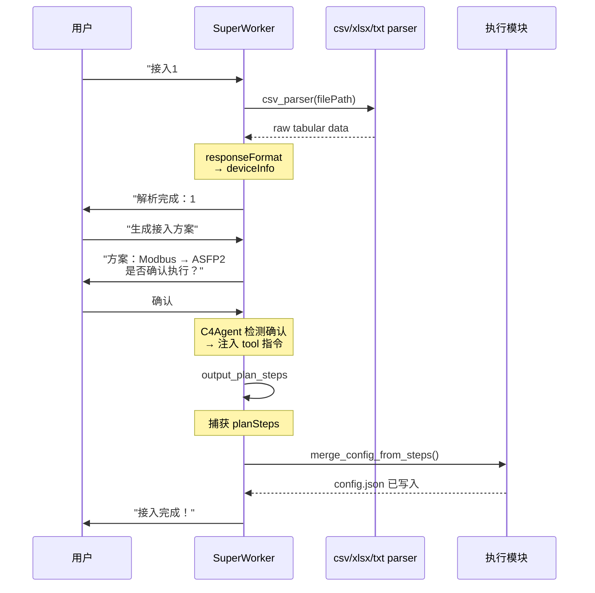
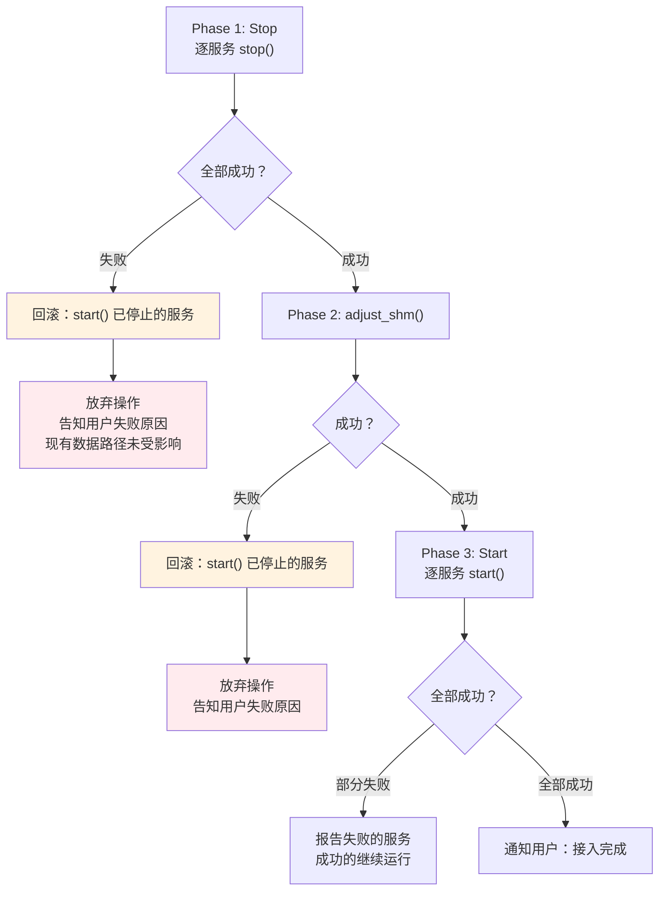
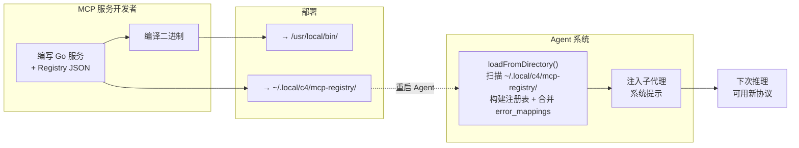
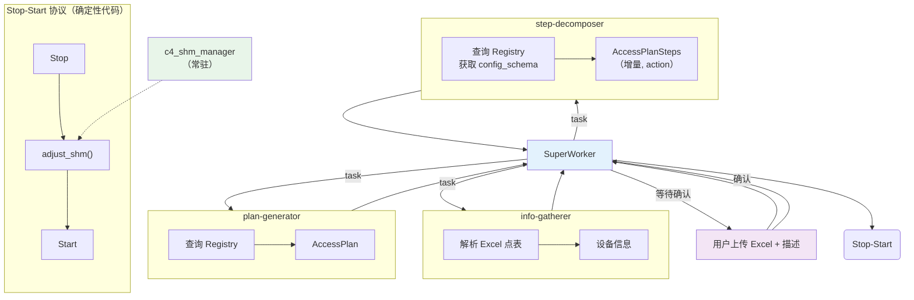

# C4 Agent 系统架构设计

> **版本**：v0.4.0 | **最后更新**：2026-08-11 | **父文档**：[c4_architecture.md](c4_architecture.md)
>
> **设计范围**：C4 Agent 系统的数据接入架构，覆盖从用户输入到 MCP 服务启动的完整数据接入流程。监控自愈等功能不在本次设计范围内。
>
> **当前实现**：因 `createDeepAgent` + deepseek-chat 的工具绑定不稳定，当前的实现使用
> `createAgent`（LangChain）+ 扁平工具 + `responseFormat` 的降级方案（详见 §2.1 的 [目标 vs 实现](#21-目标架构-vs-当前实现)）。
> 设计文档中的 SuperWorker + Subagent 三层分工为**目标架构**，待 LangChain tool binding 稳定后恢复。

---

## 1. 设计背景

### 1.1 定位

C4 Agent 是 C4 实例的智能决策层。它运行在工业数据服务器上，通过 Web 界面与用户交互，
通过 MCP 协议管理和监控 Go 编写的 MCP 服务集群。**Agent 不进入实时数据路径。**

Agent 是一个**单一系统**，不是多个独立 Agent 的集合。它使用 **SuperWorker + Subagent**
模式作为目标架构，当前实现为 **单 Agent + 扁平工具** 的过渡方案（见 §2.1）。

### 1.2 功能覆盖

Agent 系统覆盖数据接入流程中 Agent 侧的全部职能：

| 阶段 | 功能 | 目标承担方式 | 当前实现 |
|------|------|---------|---------|
| **理解** | C4_FUN_00001 理解自然语言、C4_FUN_00002/00003 收集信息 | SuperWorker + info-gatherer 子代理 | SuperWorker + csv/xlsx/txt parser 工具 + `responseFormat` |
| **规划** | C4_FUN_00004 生成接入方案、C4_FUN_00044 分解为可执行配置 | SuperWorker → plan-generator → step-decomposer | SuperWorker + `output_plan_steps` 工具 |
| **执行** | C4_FUN_00006 MCP 生命周期管理、C4_FUN_00007 常规操作自主执行 | SuperWorker 直接执行 | 同（确定性代码，不受架构影响） |
| **交互** | C4_FUN_00041 Web 界面、C4_FUN_00005 非技术语言 | Express + React | 同 |
| **扩展** | C4_FUN_00017 新协议 MCP 服务可插拔 | MCP Service Registry | 同 |

#### 1.2.1 已实现功能清单

本设计文档覆盖的功能点及实现方式：

| 功能码 | 功能名称 | 当前实现 | 设计章节 | 可确定性测试 |
|--------|---------|---------|---------|:--:|
| C4_FUN_00001 | 理解自然语言 | SuperWorker 系统提示 + 对话能力 | §3.1 | ❌（LLM 推理） |
| C4_FUN_00002 | 收集结构化文档接入信息 | csv_parser / xlsx_parser 工具 + `responseFormat` | §3.2 | ❌（LLM 推理） |
| C4_FUN_00003 | 收集非结构化文档接入信息 | txt_parser 工具 + `responseFormat` | §3.2 | ❌（LLM 推理） |
| C4_FUN_00004 | 生成接入方案 | LLM 推理 + 自然语言输出（待添加 `output_access_plan` 工具） | §3.2 | ❌（LLM 推理） |
| C4_FUN_00044 | 分解为可执行配置 | `output_plan_steps` 工具 + Zod 校验 | §3.2.1 | ❌（LLM 推理） |
| C4_FUN_00005 | 非技术语言交互 | SuperWorker 系统提示硬约束 | §3.1 | ❌（LLM 行为） |
| C4_FUN_00006 | MCP 生命周期管理 | 执行模块：Stop-Start 协议 + 启动恢复 | §3.2, §3.2.3 | ✅ mergeConfigFromSteps |
| C4_FUN_00007 | 常规操作自主执行 | 执行模块：config 合并 + 幂等 stop | §3.2 | ✅ 同 C4_FUN_00006 |
| C4_FUN_00017 | 新协议可插拔扩展 | MCP Service Registry + 双层注入 | §3.3 | ✅ Registry 加载 |
| C4_FUN_00041 | Web 界面交互 | Express + SSE streaming（streamEvents v3） | §3.5 | ❌（UI） |

> **确定性测试**：标记 ✅ 的功能不依赖 LLM 推理，可在 Python 黑盒测试（`test/c4_fun_XXXXX/`）中
> 通过操作真实 MCP 服务验证。标记 ❌ 的功能需要 TypeScript 侧单元测试（`GenericFakeChatModel` mock LLM）。

### 1.3 框架选型

| 组件 | 目标选型 | 当前实现 | 理由 |
|------|------|------|------|
| Agent 框架 | `deepagents` v1.11.1（LangChain/LangGraph） | `createAgent`（LangChain v1.5）| `createDeepAgent` + deepseek-chat 工具绑定不稳定，降级为扁平 `createAgent` |
| LLM | `@langchain/deepseek` v1.1.5 | 同 | 已预置 `DEEPSEEK_API_KEY` |
| MCP 客户端 | `@modelcontextprotocol/sdk` | 同 | Go MCP 服务使用 stdio 传输 |
| 服务端 | `express` v5 | 同 | 文件上传、REST API、SSE streaming |
| 流式传输 | `streamMode="messages"`（Pregel） | `streamEvents({version:"v3"})` | v3 typed projections：`stream.messages` / `stream.output` |
| 结构化输出 | — | `responseFormat: toolStrategy(schema)` | LangChain 内置 Zod 校验 + 自动重试 |
| 类型 | `zod` v4 | 同 | Schema + API 校验 |
| 工具定义 | `StructuredTool` 子类 | `tool()` helper | 更简洁的函数式工具定义 |

### 1.4 LLM 交互原则（ReAct 模式）

> **核心原则**：在与大模型的交互过程中，不要假设大模型的行为是确定的。Agent
> 必须**适配 LLM**，而不是假设 LLM 的行为符合预期。

具体原则：

1. **明确每步的最终结果，而非假设工具调用路径**：Agent 的每个步骤应明确需要什么
   最终结果（如"获得设备信息"、"生成 config.json"），而非依赖 LLM 按预设顺序
   调用特定工具。当 LLM 产出文本而非工具调用，或调用了错误的工具时，Agent 应
   检测到结果未达成并采取纠正措施。

2. **结果未达成则持续交互（ReAct 模式）**：如果与 LLM 的一轮交互没有得到期望的
   最终结果，Agent 应向 LLM 提供更明确的指令（如"你必须调用 X 工具，不要用文字回答"），
   重新发起交互，直到结果达成或达到最大重试次数。这是典型的 **ReAct（Reasoning + Acting）**
   模式——Agent 观察 LLM 的输出，判断是否需要进一步行动，循环此过程。

3. **Agent 适配 LLM，而非假设 LLM 的行为**：不同的 LLM（如 DeepSeek、GPT-4、Claude）
   对同一提示词的响应行为不同。提示词、工具描述、参数格式都应该针对具体的 LLM 进行
   优化。如果更换了 LLM，应重新评估和调整交互策略。不要假设 LLM 会"自动"理解意图
   并采取正确的行动。

4. **工具调用是不可靠的，必须有兜底逻辑**：LLM 可能将工具调用输出为纯文本（而非
   结构化的 tool_call），可能提前终止（不调用工具直接结束），可能产生无效 JSON 参数。
   Agent 必须在代码层面对这些失败模式进行检测和纠正，而不是依赖提示词工程完全消除它们。

5. **验证循环优于单次尝试**：Agent 的实现应采用验证循环模式——执行 → 检查结果 →
   若不满足则纠正重试——而非假设单次 LLM 调用就能得到正确结果。

```typescript
// ReAct 验证循环模式（概念示例）
while (!resultAchieved && retries < maxRetries) {
    const response = await llm.invoke(messages, tools)
    
    if (noExpectedToolCalled(response)) {
        messages.push({ role: "user", content: `你必须调用 ${expectedTool} 工具。不要用文字回答。` })
        retries++
        continue
    }
    
    const result = executeToolCall(response)
    if (result.success) {
        resultAchieved = true
    } else {
        messages.push({ role: "user", content: `调用失败: ${result.error}。请修正参数后重试。` })
        retries++
    }
}
```

---

## 2. 整体架构

### 2.1 目标架构 vs 当前实现

**目标架构**（设计文档原意）—— SuperWorker + Subagent 三层分工：

```
SuperWorker (createDeepAgent)
  ├─ info-gatherer 子代理     (解析文档 + 推断协议 + 收集信息 → 结构化设备信息)
  ├─ plan-generator 子代理  (设备信息 → AccessPlan)
  └─ step-decomposer 子代理 (AccessPlan → ServiceStep[])
```

**当前实现**（v0.4.0）—— 单 Agent + 扁平工具 + responseFormat：

```
SuperWorker (createAgent)
  ├─ csv_parser / xlsx_parser / txt_parser 工具  (纯格式提取)
  ├─ responseFormat: deviceInfoSchema              (结构化设备信息)
  ├─ output_plan_steps 工具                        (结构化 ServiceStep[])
  └─ 确定性自动执行 (merge_config_from_steps)        (config.json 写入)
```

**降级原因**：`createDeepAgent` 在 deepseek-chat 上存在工具绑定失效问题（工具不被调用，或产出文本而非 tool_call），降级为 `createAgent` + 扁平工具 + `responseFormat`。

**恢复条件**：LangChain 的 `createDeepAgent` 在 deepseek-chat 上稳定工作后，恢复子代理模式。

### 2.2 当前架构图

```
用户浏览器 (React SPA)
    │
    ▼ HTTP/SSE
┌─────────────────────────────────────────────────────────────┐
│                    Express Server                             │
│  POST /api/chat    POST /api/upload   GET /api/services      │
└────────────────────────┬────────────────────────────────────┘
                         │
                         ▼
┌─────────────────────────────────────────────────────────────┐
│              SuperWorker (createAgent)                        │
│                                                               │
│  System Prompt: C4 Agent 角色 + 工具调用规则                  │
│  Streaming: streamEvents({version:"v3"})                      │
│  responseFormat: toolStrategy(deviceInfoSchema)               │
│                                                               │
│  工具:                                                        │
│  ┌──────────────────────────────────────────────────────┐   │
│  │ csv_parser  │ xlsx_parser │ txt_parser               │   │
│  │ 读取 CSV/XLSX/TXT，返回 raw tabular data              │   │
│  ├──────────────────────────────────────────────────────┤   │
│  │ output_plan_steps                                     │   │
│  │ 输出结构化 ServiceStep[]，含 Zod + 业务校验            │   │
│  ├──────────────────────────────────────────────────────┤   │
│  │ query_registry                                        │   │
│  │ 按 service_type 查询 RegistryEntry (config_schema)    │   │
│  ├──────────────────────────────────────────────────────┤   │
│  │ query_abbr_registry                                   │   │
│  │ 检索 abbr 记忆库，判断目标设备是否已接入              │   │
│  └──────────────────────────────────────────────────────┘   │
│                                                               │
│  ┌──────────────────────────────────────────────────────┐   │
│  │  C4Agent wrapper（createC4Agent）                       │   │
│  │  · 确认消息检测 + tool 指令前缀注入                      │   │
│  │  · 验证循环 (ReAct，无 tool call → 纠正重试)            │   │
│  │  · stream.output.structuredResponse 捕获 deviceInfo     │   │
│  │  · 确定性自动执行 (confirm → planSteps → config.json)   │   │
│  └──────────────────────────────────────────────────────┘   │
│                                                               │
│  ┌──────────────────────────────────────────────────────┐   │
│  │              MCP Service Registry                       │   │
│  │              动态协议映射 · 配置 Schema                 │   │
│  └──────────────────────────────────────────────────────┘   │
└─────────────────────────────────────────────────────────────┘
         │                  │                  │
         ▼                  ▼                  ▼
    c4_shm_manager    c4_modbus_client    c4_iec104_client  ...
       (Go,常驻)          (Go)               (Go)
```

### 2.3 完整请求流程

以"用户上传 Modbus 点表并提出接入需求"为例：

```
用户: "接入华能阿拉善1#风机" + 上传 CSV
         │
         ▼
┌─────────────────────────────────────────────────────┐
│ Step 1: info-gatherer                                   │
│                                                       │
│ LLM 发现 path=...csv → 调用 csv_parser({filePath})    │
│ csv_parser 返回 raw tabular data (headers + rows)     │
│ LLM 分析 raw data + 对话上下文                         │
│ responseFormat 强制产出结构化 deviceInfo:             │
│   { devices: [{ name:"1#风机", protocol:"modbus_tcp", │
│                 ip:"...", port:502, points:[...] }]} │
│                                                       │
│ → deviceInfo 被 C4Agent wrapper 捕获                  │
│ → SS E 输出自然语言摘要:"解析完成，设备名：1#风机..."  │
└───────────┬─────────────────────────────────────────┘
            │
            ▼
┌─────────────────────────────────────────────────────┐
│ Step 2: plan-generator                               │
│                                                       │
│ 用户: "生成接入方案"                                   │
│ LLM 根据 deviceInfo + service_catalog                 │
│ → 自然语言展示方案 + 确认信号                          │
│ "方案：Modbus TCP 采集 → ASFP2 转发到中心侧"          │
│ "是否确认执行？"                                       │
└───────────┬─────────────────────────────────────────┘
            │ 用户确认
            ▼
┌─────────────────────────────────────────────────────┐
│ Step 3: confirm + execute                             │
│                                                       │
│ C4Agent wrapper 检测确认消息 → 注入 tool 指令          │
│ LLM 调用 output_plan_steps({ steps: [...] })          │
│ → stream.toolCalls 捕获 planSteps                     │
│ → 确定性执行: merge_config_from_steps()               │
│ → config.json 写入                                    │
│                                                       │
│ "接入方案已执行，配置已写入。"                          │
└─────────────────────────────────────────────────────┘
```



---

## 3. 核心组件

### 3.1 SuperWorker

**目标实现**（待 `createDeepAgent` + deepseek-chat 稳定后启用）：

```typescript
const superWorker = createDeepAgent({
  model: new ChatDeepSeek({ apiKey: process.env.DEEPSEEK_API_KEY }),
  systemPrompt: SUPERWORKER_SYSTEM_PROMPT,
  middleware: [
    createMemoryMiddleware({ backend: new StateBackend() }),
    createSummarizationMiddleware(),
  ],
  tools: [/* MCP 工具运行时注入 */],
  subagents: [
    infoGathererSubagent,
    planGeneratorSubagent,
    stepDecomposerSubagent,
  ],
})
```

**当前实现**（`createAgent` + 扁平工具 + `responseFormat`）：

```typescript
const agent = createAgent({
    model: new ChatDeepSeek({ ... }),
    tools: [csvParser, xlsxParser, txtParser, outputPlanSteps, queryRegistry],
    systemPrompt: SUPERWORKER_SYSTEM_PROMPT,
    responseFormat: toolStrategy(deviceInfoSchema),
})
```

**C4Agent wrapper**（`createC4Agent`）在 `createAgent` 之上增加：

| 机制 | 说明 |
|------|------|
| 确认检测 | 正则匹配 `确认/好的/执行/按方案` → 自动注入 `"立即调用 output_plan_steps"` 指令 |
| 验证循环 | ReAct 模式：流结束后检测 `hasToolCall`，无工具调用时注入纠正提示重试（最多 3 次） |
| 结构化捕获 | `stream.output.structuredResponse` → `deviceInfo`；`stream.toolCalls` → `planSteps` |
| 确定性执行 | confirm + 无 `planSteps` → 从 `deviceInfo` 自动构造 `ServiceStep[]` → `merge_config_from_steps` |
| 流式传输 | `streamEvents({version:"v3"})` — `stream.messages` 投影像（text + tool names）

### 3.2 工具定义与执行模块

> **注意**：以下定义的 `info-gatherer`、`plan-generator`、`step-decomposer` 在目标架构中为子代理，
> 当前实现中为 SuperWorker 的扁平工具。此处以工具形式描述当前实现，子代理形式为目标架构预留。

**info-gatherer**（原 doc-parser，C4_FUN_00002 / 00003）：

负责**收集接入所需的全部必要信息**——解析文档、推断协议、收集实例参数与点表字段，缺失时逐个询问用户补齐。
接入任务（add/modify/delete）天然是「采集（Writer）+ 转发（Reader）」的完整链路，info-gatherer **同时收集两端**：
采集设备（devices）与转发目标（forward_targets），缺一端即信息不完整。产出"信息齐全"的设备信息，供 plan-generator 组装方案。

| 工具 | 职责 | 输入 | 输出 |
|------|------|------|------|
| `csv_parser` | 读取 CSV，返回 raw tabular data | `filePath` | `{headers, rows, rowCount, formatted}` |
| `xlsx_parser` | 读取 Excel，转 CSV 后同 csv_parser | `filePath` | 同上 |
| `txt_parser` | 读取纯文本文件 | `filePath` | `{content}` |

解析工具只做**纯格式提取**，不做语义推断。LLM 拿到 raw data 后，结合 `service_catalog`（含各协议
`point_fields`）理解列含义、推断协议、映射点字段，由 `responseFormat: deviceInfoSchema` 产出结构化设备信息。

`deviceInfoSchema` 是 info-gatherer 的输出骨架。info-gatherer **负责收集齐必要信息**——协议（推断或询问）、采集目标标识 abbr（候选，从描述提取）、
实例参数（`source=plan` 的字段：`default=null` 必填，有 `default` 提示默认值）、点表字段（`point_fields`），缺失时逐个询问用户补齐（见下"信息收集与询问机制"）：

```typescript
const deviceInfoSchema = z.object({
    devices: z.array(z.object({
        name: z.string(),            // 从对话上下文提取
        abbr: z.string(),            // 采集目标标识（候选，info-gatherer 从描述提取，见 §3.2.1.3a）
        protocol: z.string(),        // 协议必填——info-gatherer 三层推断 + 询问闭环保证（见下）
        points: z.array(z.object({   // 点字段宽松，具体字段由 point_fields 决定
            name: z.string(),
        }).passthrough()),
        missing_fields: z.array(z.string()).optional(),
    }).passthrough()),               // 实例 plan 字段（ip/port、url/token 等）直接平铺，由 config_schema.source=plan 声明
    forward_targets: z.array(z.object({
        name: z.string(),            // 转发目标名称
        abbr: z.string(),            // 转发目标标识（候选，info-gatherer 从描述提取，见 §3.2.1.3a）
        protocol: z.string(),        // 转发协议必填——info-gatherer 推断 + 询问闭环保证
        missing_fields: z.array(z.string()).optional(),
    }).passthrough()),               // 实例 plan 字段（ip/port、url/token 等）+ 目标级字段（measurement）平铺
});
```

> 骨架仅保留 `name`/`protocol`/`points` 三要素，其余字段（实例 plan 字段、协议特有点字段）
> 一律 `.passthrough()` 放行。info-gatherer 按 registry 的 `point_fields`/`config_schema` 收集齐必要字段
> （`source=plan` 的实例字段：`default=null` 必填、有 `default` 提示默认值；+ `point_fields` 的全部点字段），缺失时询问用户补齐。

**协议推断（`protocol` 字段，归属 info-gatherer）**：协议是业务信息，由 LLM 分层推断，**不硬编码任何协议**。
推断**由 info-gatherer 完成**——它用 `service_catalog`（含各服务的 `point_fields`）理解点表列 + 推断协议，分三层：

1. **从点表字段推断**：对比 `service_catalog` 中各 Writer 服务的 `point_fields`，若点表列与某协议
   唯一匹配（如含 `uid`/`fun`/`type`/`swap` 列 → Modbus），据此确定协议
2. **从用户描述推断**：若多协议的 `point_fields` 无法区分（如协议 A、B 的点表都只是整数地址列），
   从用户消息中的描述（「采集 Modbus 设备」、「接 IEC104 远动装置」）分析协议类型
3. **询问用户**（C4_FUN_00005）：前两步均无法确定时，询问用户补充协议/通信方式信息，
   得知协议后**用该协议的 `point_fields` 重新理解点表列**，再继续收集其余信息

> 三层推断**同时适用于 Writer（采集协议）与 Reader（转发协议）**——Writer 从采集点表列推断，
> Reader 从转发目标描述推断（如「转发到上级系统」→ ASFP2、「入库」→ InfluxDB）。两类协议都确定后信息才算收集齐。

> 协议推断成功后**不单独打断用户**，协议作为方案的一部分在 plan-generator 的方案确认环节隐含确认。
> `deviceInfo.protocol` 与 `AccessPlan.protocol` 都是**必填**——info-gatherer 通过三层推断 + 询问用户兜底
> 保证协议在收尾时必已确定（推断不出就询问，不产出空协议），到 step-decomposer 查 registry 时协议已就绪。

**信息收集与询问机制**（C4_FUN_00005 缺失引导）：

info-gatherer 收集两类必要信息，都由 registry 声明：

| 类别 | 来源 | 判定「必需」的依据 |
|------|------|----------------|
| **实例参数** | `config_schema.fields` 中 `source=plan` 的字段（除 `id`/`name`） | `source=plan` 且 `default=null` |
| **点表字段** | `point_fields`（含 name/type/description，全部必须） | 全部字段 |

> `source=default` 的字段（如 `timer`）不收集，直接填默认值；`source=plan` 且有 `default` 的字段（如
> `port=502`）询问时提示默认值、允许留空跳过；`id`/`name` 由 agent 生成。
> 上述两类必要信息**对采集设备（Writer）和转发目标（Reader）都适用**——两者都有实例参数（`config_schema.source=plan`）和点表字段（`point_fields`），info-gatherer 分别收集齐全。

**收集流程（循环直到收集齐）**：解析文档 → 推断协议（失败则询问用户协议后重新理解列）→
**确定性完整性校验** → 缺失则**逐个询问**（一次一项）→ 用户提供 → 再校验 → 循环。

**确定性完整性校验**（info-gatherer 收尾时，SuperWorker 用确定性代码执行）：
- info-gatherer 产出 deviceInfo 后、传给 plan-generator 前，SuperWorker 对照 registry 的
  `point_fields`（全部字段）+ `source=plan` 且 `default=null` 的实例字段检查是否齐全
- **缺失 vs 类型错误的判定分离**：本步只做「键存在性检查」——逐键判断 `point_fields` 全部字段与
  `source=plan` 且 `default=null` 的实例字段是否**都有值**（键存在且非空），**不涉及类型合法性**；类型校验交给
  step-decomposer 的运行时强校验（§3.2 双层校验 ②）做三态判定
- 缺失（键不存在或值为空）→ 返回缺失清单 → info-gatherer 逐个询问用户补齐 → 再校验 → 循环，
  齐全才放行给 plan-generator；类型错误在本步**不拦截**，由 step-decomposer 兜底
- 保证「信息齐全」契约由**确定性代码**兜底，而非 LLM 自觉

**询问 vs 确认分离**：询问（info-gatherer，补齐缺失信息，如「请提供 IP」）≠ 确认（plan-generator，
批准方案，如「是否执行？」）。必填字段（`default=null`）的询问由界面技术保证必答；有 `default` 的
字段询问时提示默认值、允许留空跳过（留空即用默认值）。

**plan-generator**（C4_FUN_00004）：

当前实现中，plan-generator 是 LLM 的隐式推理步骤。LLM 根据 info-gatherer 产出的**信息齐全的 deviceInfo** +
`service_catalog` 选型并组装方案，在自然语言中描述接入方案并等待确认。待添加 `output_access_plan`
结构化输出工具后，此步骤可产出结构化的 `AccessPlan`。

> plan-generator **不再推断协议、不再收集信息**——协议已由 info-gatherer 确定，必要信息已收集齐，
> 它只做「选型 + 组装方案 + 方案确认」。

**方案确认（含协议隐含确认 + 标识确认）**：展示接入方案时，须一并展示协议与采集/转发目标标识（abbr），
让用户确认**协议是否正确**、**abbr 是否绑定到正确的设备**——协议由 info-gatherer 推断或询问确定，
abbr 由 §3.2.1.3a 记忆库检索 + 确认确定，二者都作为方案的一部分让用户最终确认。

**step-decomposer**（C4_FUN_00044）—— `output_plan_steps` 工具：

```typescript
const outputPlanStepsTool = tool(
    async (input) => {
        // 运行时校验：按 protocol 查 registry，动态构建强校验 schema
        for (const dev of input.devices) {
            const svcType = find_service_type(registry, dev.protocol, "writer");
            const entry = registry.queryRegistry(svcType);
            const pointSchema = pointFieldsToZod(entry.point_fields);   // 点字段 → Zod
            const configSchema = configFieldsToZod(entry.config_schema); // 实例字段 → Zod（白名单）
            for (const pt of dev.points) {
                const r = pointSchema.safeParse(pt);
                if (!r.success) return JSON.stringify({ success: false, errors: r.error.issues });
            }
            const r2 = configSchema.safeParse(pickPlanFields(dev, entry.config_schema));   // 校验实例 plan 字段（剥离结构化键）
            if (!r2.success) return JSON.stringify({ success: false, errors: r2.error.issues });
        }
        // 校验转发目标（Reader）
        for (const ft of input.forward_targets) {
            const svcType = find_service_type(registry, ft.protocol, "reader");
            const entry = registry.queryRegistry(svcType);
            const configSchema = configFieldsToZod(entry.config_schema);
            const r = configSchema.safeParse(pickPlanFields(ft, entry.config_schema));
            if (!r.success) return JSON.stringify({ success: false, errors: r.error.issues });
        }
        const steps = generate_steps(input, registry);
        return JSON.stringify({ success: true, steps });
    },
    {
        name: "output_plan_steps",
        description: "将接入方案分解为增量 MCP 服务配置步骤...",
        schema: z.object({ /* 宽松骨架，与 AccessPlan 同构（devices + forward_targets） */ }),
    },
);
```

**双层校验**（协议无关，是 agent 与 mcp 的边界）：

| 层 | 位置 | 职责 | schema 来源 |
|---|------|------|-----------|
| ① 声明式 schema | 工具定义时 | 宽松骨架（name/protocol/points），`.passthrough()` 放行协议特有字段 | 静态，协议无关 |
| ② 运行时强校验 | 工具 async 函数内 | 按 protocol 查 registry，动态构建 Zod：`pointFieldsToZod` 校验点字段 + `configFieldsToZod` 校验实例字段（白名单） | registry 的 `point_fields`/`config_schema` 驱动 |

> ② 是 agent 与 mcp 的**边界**：只有通过 registry 驱动强校验的数据才进入 `generate_steps` →
> `merge_config_from_steps` → config.json。校验失败在此拦截，**绝不流入 mcp**。

**运行时校验的三态结果**（按字段逐个判定）：

| 结果 | 判定 | 处理 |
|------|------|------|
| 通过 | 值存在且类型合法 | 继续 |
| 类型错误 | 值存在但类型不符（如 `addr` 传成字符串） | 返回结构化错误 → LLM 重试（§1.4 ReAct） |
| 信息缺失 | 必要字段未提供（point_fields 全部字段 + `source=plan` 且 `default=null` 的实例字段） | 已由 info-gatherer 收尾的确定性校验保证，此处是双保险最后防线——若仍发生说明链路有 bug，返回错误 |

> **C4_FUN_00005 缺失引导**（C4_RS_00261）：业务字段（地址/表名/实例参数等）的值来自**用户**或 registry
> **显式声明的 `default`**（协议标准默认值，如 Modbus TCP 端口 502）；agent 不得在 registry 未声明时
> 自行编造默认值（C4_RS_00044）。缺失引导**由 info-gatherer 负责**（见上「信息收集与询问机制」），
> step-decomposer 的运行时校验只是最后防线。引导清单由 registry 的 `point_fields`（全部字段）与
> `source=plan` 且 `default=null` 的实例字段声明驱动，零协议硬编码。

配套的协议无关通用转换器（写一次，所有协议复用）：

```typescript
// point_fields → Zod schema（registry 驱动，无协议硬编码）
function pointFieldsToZod(pointFields: PointField[]): z.ZodObject<any> {
    const shape: Record<string, z.ZodTypeAny> = {};
    for (const f of pointFields) {
        shape[f.name] = typeToZod(f.type).describe(f.description);   // 全部字段必填（无默认值）
    }
    return z.object(shape).passthrough();   // passthrough 放行 id/key/shm_id 等通用字段
}

// config_schema.source=plan 的实例字段 → Zod schema（registry 驱动，无协议硬编码）
function configFieldsToZod(configSchema: ConfigSchema): z.ZodObject<any> {
    const shape: Record<string, z.ZodTypeAny> = {};
    for (const [name, f] of Object.entries(configSchema.fields)) {
        if (f.source !== "plan") continue;  // source=default 的字段不校验
        const t = typeToZod(f.type).describe(f.description);
        shape[name] = f.default === null ? t : t.optional();  // default=null 必填，有 default 可选（跳过则用默认值）
    }
    return z.object(shape).strict();        // strict：拒绝未声明的字段（白名单）
}

// 剥离结构化键（id/name/abbr/protocol/points 等），只保留 source=plan 的平铺字段子集——
// 供 configFieldsToZod 的 .strict() 白名单校验前调用，避免误伤 AccessPlan 的结构化字段
function pickPlanFields(obj: Record<string, unknown>, configSchema: ConfigSchema): Record<string, unknown> {
    const out: Record<string, unknown> = {};
    for (const [name, f] of Object.entries(configSchema.fields)) {
        if (f.source === "plan" && name in obj) {
            out[name] = obj[name];
        }
    }
    return out;
}
```

> **passthrough vs strict 的取舍**：`pointFieldsToZod` 用 `.passthrough()` 放行 point 的通用字段
> （`id`/`key`/`shm_id`）；`configFieldsToZod` 用 `.strict()`（白名单）——instance 里除声明字段外
> **不该有任何东西**，拼错的 `prot`、凭空加的 `foo` 都会被拒绝，防止垃圾字段流入 config.json。
> instance 的 `id`/`name` 由 generate_steps 生成，`abbr`/`protocol`/`points` 是 AccessPlan 的结构化字段，均不经过校验。

> **白名单作用域 = 实例平铺 plan 字段**：`configFieldsToZod` 只校验 `source=plan` 的平铺字段，结构化键不在此列。
> 校验前用 `pickPlanFields(dev, config_schema)` 剥离结构化键，只取 plan 字段子集传入 `.strict()`，避免误伤合法字段。

**执行模块（确定性代码，非子代理）**：

step-decomposer 输出 AccessPlanSteps 后，后续操作全部是确定性代码逻辑，
不需要 LLM 推理，因此不作为子代理——由 SuperWorker 的运行时直接调用：

**mergeConfigFromSteps(steps, configPath)**：合并 + 备份 + 原子写入 config.json

```
1. 读取现有 ~/.local/c4/config.json：
   - 不存在 → 创建空结构；新文件写入后也备份一份 config.json.bak
   - 存在且有效 → 先复制当前内容到 config.json.bak（失败前快照）
   - 存在但损坏（JSON 解析失败）→ 若 config.json.bak 存在则恢复之，否则创建空结构
2. 逐一处理 AccessPlanSteps（add/modify/delete — 见 §3.2.1.6）
3. 合并结果先写入 config.json.tmp，然后 rename() → config.json（原子写入）
```

**executeStopAndStart()**：Stop-Start 安全协议。`stop` 是幂等操作（对已停止的服务调用
仍返回 success），此属性是启动恢复（§3.2.3 无条件 Stop-Start）的基础。
`config.json` 的绝对路径通过工具参数直接传递，不依赖 MCP roots/list 协议。

```
Stop 阶段:
  for 每个数据路径 MCP 服务（不含 c4_shm_manager）: call stop()
  if 任一失败:                                  ← stop 不读 config，非 config 类失败
    for 已停止的服务: call start(instance_id, config_path)     ← 回滚：只 restart，不恢复 config
    abort 操作

adjust_shm 阶段:
  call adjust_shm(instance_id, config_path)                  ← config.json 路径作为工具参数传入
  if 失败:
    if 错误码为 CONFIG_MISSING_SECTION / DUPLICATE_KEY / UNKNOWN_READER_KEY:
      将 config.json.bak 恢复为 config.json      ← config 有问题，回退配置
    for 已停止的服务: call start(instance_id, config_path)     ← 统一 restart
    abort 操作
  （SHM_NOT_CREATED / SHM_SYSCALL_FAILED 等非 config 类失败：
    不恢复 config，后续用户解决 shm 问题后只需重试 adjust_shm → start）

Start 阶段:
  for 每个 MCP 服务: call start(instance_id, config_path)    ← config.json 路径作为工具参数传入
  部分失败 → 不回滚已成功的，只报告哪些失败
```

**调用时机**：SuperWorker 收到 step-decomposer 的 AccessPlanSteps 后，直接调用这两个函数，
执行结果返回 SuperWorker，由 SuperWorker 以非技术语言告知用户。

#### 3.2.1 AccessPlanSteps 格式与转换规则

AccessPlanSteps 是 step-decomposer 的输出，描述本次接入任务需要执行的增量操作。
执行模块将其转换为 config.json 中的全量配置。

**3.2.1.1 格式定义**

```typescript
// 操作类型
type StepAction = "add" | "modify" | "delete"

// 单条操作步骤
interface ServiceStep {
  action: StepAction           // 操作类型
  service_type: string         // MCP 服务类型，如 "c4_modbus_client"
  instance: {
    id: string                 // 实例唯一标识（modify/delete 按此匹配）
    name: string               // 实例名称（人可读）
    // + 服务特有的配置字段，值来源见 §3.2.1.2
  }
  points: ServicePoint[]       // 数据点列表
}

// 数据点（Writer / Reader 共用，字段由 registry 声明）
// Writer 点用 `id` 标识（采集点名），Reader 点用 `key` 标识（引用 Writer 点），二者互斥——
// 用判别联合强制：id 与 key 恰好其一致合法，双缺或双填均被类型系统拒绝
type ServicePoint = WriterPoint | ReaderPoint;

interface WriterPoint {
  id: string                   // Writer 点标识：采集点名（global key = {instance.id}.{point.id}）
  key?: never                  // Writer 点无 key
  shm_id: number               // 固定为 0，由 c4_shm_manager 分配后回填
  [field: string]: unknown     // 业务字段由 point_fields 声明（Writer / Reader 统一）
}

interface ReaderPoint {
  id?: never                   // Reader 点无 id
  key: string                  // Reader 点标识：引用 Writer 点（值 = {writer_instance_id}.{point_id}），agent 确定性生成
  shm_id: number               // 固定为 0，由 c4_shm_manager 分配后回填
  [field: string]: unknown     // 业务字段由 point_fields 声明（Writer / Reader 统一）
}
```

**Writer 点字段**：由 Registry 的 `point_fields` 描述（每个字段含 `name`/`type`/`description`，**全部必须提供、无默认值**）。
step-decomposer 遍历 `point_fields`，从点表/设备信息中按字段名提取对应值，**不硬编码任何协议字段**。
例如 Modbus 的 `point_fields` 含 `addr/uid/fun/type/swap`，IEC104 只含 `addr`。

**Reader 点字段**：Reader 与 Writer 统一使用 `point_fields` 描述业务字段（如 ASFP2 的 `addr` 转发地址、
InfluxDB 的 `measurement` 表名），**不区分 reader_point**。Reader 的 point 比 Writer 多一个 `key`
通用字段（引用 Writer 的点，值 = `{writer_instance_id}.{point_id}`，agent 确定性生成，非业务数据）。

step-decomposer 按 `{id（Writer）/ key（Reader）, shm_id:0} + point_fields（用户提供）` 通用生成 point，
**不区分具体服务类型**。点表业务字段（`point_fields`）**无默认值、无自动分配**——用户未提供时由 C4_FUN_00005 引导补充。

**3.2.1.2 字段值来源（config_schema.source 驱动）**

每个服务实例的 config_schema 中，每个字段标注 `source`，决定 step-decomposer 从何处取值：

| source | 含义 | 填充方式 |
|--------|------|---------|
| `"plan"` | 需从 AccessPlan 提取 | 从方案取值；提取不到时 `default=null` 报错，有 `default` 用默认值 |
| `"default"` | 使用默认值 | 直接取 `config_schema.fields[field].default` |

step-decomposer 对每个服务类型：
1. 调 `queryRegistryTool(service_type)` 获取完整 config_schema
2. 遍历 `config_schema.fields`：
   - `source: "plan"` → 从 AccessPlan 对应字段提取；提取不到时 `default=null` 报错，有 `default` 用默认值
   - `source: "default"` → 填入 `default` 值
3. `source: "plan"` 且 `default=null` 的字段必须有值，否则报错

**实例 plan 字段**：`config_schema` 中 `source: "plan"` 的字段（除 `id`/`name` 等实例标识外）
即实例的业务字段，**直接平铺在 AccessPlan 的 device/forward_target 上**，不做"连接/认证/归属"
之类的语义分类——step-decomposer 按 config_schema 逐字段提取，不硬编码 `ip/port/url` 等。
Modbus 的 `ip/port`、InfluxDB 的 `url/token/org/bucket`、未来串口协议的 `serial_port/baud_rate`
都由各自 registry 的 `config_schema` 声明，agent 代码零协议硬编码、零语义猜测。

**运行时强校验**：实例字段与点字段在进入 `generate_steps` 前，由 registry 驱动动态构建
Zod schema 校验（见 §3.2 的"双层校验"）：点字段用 `pointFieldsToZod`，实例字段用 `configFieldsToZod`
（`.strict()` 白名单，拒绝未声明字段）。`source=plan` 且 `default=null` 的实例字段与 `point_fields`（全部字段）
共同构成 agent 与 mcp 的边界——校验失败返回 LLM 重试，不写入 config.json。

##### 3.2.1.2a AccessPlan 格式定义

AccessPlan 是 plan-generator 的输出，也是 step-decomposer 的输入。它是一个
内存中的结构化 JSON 对象，描述本次接入的完整意图——设备采集和转发目标。

```typescript
interface AccessPlan {
  // ===== 场站信息 =====
  site: {
    name: string              // 场站名称，如 "华能阿拉善"
    abbr: string              // 场站缩写，如 "hnals"（用于生成 instance.id）
  }

  // ===== 采集设备列表 =====
  devices: DeviceSpec[]

  // ===== 转发目标列表 =====
  forward_targets: ForwardTargetSpec[]
}

// 单个采集设备
interface DeviceSpec {
  name: string                // 设备名称（中文显示，如 "1#升压站"）
  abbr: string                // 采集目标标识（候选，LLM 从用户消息提取，如 "transformer1"）；须经 §3.2.1.3a 记忆确认后固化，最终 id 以记忆库为准
  protocol: string            // 通信协议（必填——由 info-gatherer 推断或询问确定，plan-generator 方案确认，见 §3.2 协议推断）
  points: DevicePoint[]       // 采集点列表
  [field: string]: unknown    // 实例 plan 字段直接平铺（ip/port、url/token/org/bucket 等，由 config_schema.source=plan 声明）
}

// 采集点（从点表提取）—— 仅保留 name 骨架，协议特有字段由 registry 的 point_fields 声明
interface DevicePoint {
  name: string                // 点名称（对应 point.id）
  [field: string]: unknown    // 如 addr/uid/fun/type/swap（Modbus）、addr（IEC104）
}

// 转发目标 —— 实例 plan 字段直接平铺，目标级字段由 point_fields 声明
interface ForwardTargetSpec {
  name: string                // 目标名称（中文显示，如 "中心侧数据库"）
  abbr: string                // 转发目标标识（候选，LLM 从用户消息提取，如 "center"）；须经 §3.2.1.3a 记忆确认后固化，最终 id 以记忆库为准
  protocol: string            // 转发协议（必填——由 info-gatherer 推断或询问确定，plan-generator 方案确认，见 §3.2 协议推断）
  [field: string]: unknown    // 实例 plan 字段（ip/port、url/token/org/bucket 等）+ 目标级字段（measurement，由 point_fields 声明）
}
```

**AccessPlan 示例**（接入华能阿拉善 1# 风机 + 转发到中心侧）：

```json
{
  "site": {
    "name": "华能阿拉善",
    "abbr": "hnals"
  },
  "devices": [
    {
      "name": "1#风机",
      "abbr": "wt1",
      "protocol": "modbus_tcp",
      "ip": "192.168.110.1",
      "port": 502,
      "points": [
        { "name": "windspeed",  "addr": 1000, "uid": 1, "fun": 3, "type": 10, "swap": 2 },
        { "name": "temperature", "addr": 1002, "uid": 1, "fun": 3, "type": 10, "swap": 2 }
      ]
    }
  ],
  "forward_targets": [
    {
      "name": "中心侧数据库",
      "abbr": "center",
      "protocol": "asfp2",
      "ip": "172.16.109.11",
      "port": 9999
    }
  ]
}
```

**step-decomposer 如何使用 AccessPlan**：

1. `site.abbr` + `target.abbr`（采集/转发目标标识）→ 生成 `instance.id`（如 `hnals_transformer1`）
2. `device` 的 plan 字段（平铺）→ 填入 `source="plan"` 的实例配置字段（字段名由 config_schema 声明，见 §3.2.1.2）
3. `device.points[]` → 映射到 Writer 服务的 `points[]`（字段由 point_fields 声明提取）
4. `forward_targets[]` 的 plan 字段（平铺）→ 填入 Reader 服务的实例配置（字段名由 config_schema 声明）
5. 每个采集点生成对应的 Reader point：`{id, key, shm_id:0} + point_fields（用户提供）`（见 §3.2.1.1）

**3.2.1.3 实例 id 生成规则**

`id` 是 config.json 中每个服务实例的唯一标识。step-decomposer 按以下规则生成：

```
{site_abbr}_{target_abbr}
```

其中：
- `site_abbr`：场站缩写，从 AccessPlan 提取（如 "hnals" = 华能阿拉善）
- `target_abbr`：**采集目标标识**（Writer）/ **转发目标标识**（Reader），由 LLM 从用户消息提取，
  是**用户提供的业务信息**。命名规则：**设备类型英文名 + 编号（多台时）**，单台直接用类型名。
  例如："采集 1#风机" → `wt1`（wind turbine 1）；"采集 1#升压站" → `transformer1`；"采集升压站"（单台、无编号）→ `transformer`；
  "采集华能通辽开鲁风场风功率预测数据" → `power_forecast`。

> ⚠️ abbr 由 LLM 提取是**非确定性**操作，不能每次操作都重新提取——其跨会话稳定性由
> §3.2.1.3a「id 稳定性保障（abbr 记忆与确认机制）」保证：首次提取后固化到记忆库，
> 后续 modify/delete/加点操作引用已存 id，不再重新提取 abbr。

示例：`hnals_transformer1` = 华能阿拉善 1# 升压站采集；`hnals_power_forecast` = 华能阿拉善风功率预测入库

> **协议与角色解耦**：id **不含协议/服务类型信息**。协议是技术维度（Modbus/IEC104/ASFP2），
> 采集目标是业务维度（升压站/风功率预测），两者正交、非一一对应。同一采集目标无论用
> Modbus 还是 IEC104，id 都不变。id 只反映业务维度，协议信息由 service_type（config.json 的
> 顶层 key）承载。

points 的 `id` 字段直接使用点表中的点名称（如 `windspeed`、`temperature`），
全局 key 自动组合为 `{instance.id}.{point.id}`（如 `hnals_transformer1.windspeed`）。
点名称需为不含 `.`/`/` 等分隔符的合法标识符，否则会破坏 global key 的 `{instance.id}.{point.id}` 解析。

**3.2.1.3a id 稳定性保障（abbr 记忆与确认机制）**

`abbr` 由 LLM 从用户自然语言描述提取，是**非确定性**操作——同一台「1#风机」在不同会话、
不同措辞下可能被提取成 `wt1` / `windturbine1` / `fan1`。而 `id` 的硬约束是**稳定**
（modify/delete 按 id 精确匹配、Reader key 跨重启引用）。因此 abbr **不能每次操作重新提取**，
必须「首次提取后固化 + 后续检索确认」。

**记忆库（abbr registry）**：agent 内部状态，持久化于 `~/.local/c4/abbr_registry.json`
（非 MCP 配置，MCP 服务不读取）。**site 存于 `agent.json`（权威配置，启动必读），
entries 存于 `abbr_registry.json`**：

```json
{
  "entries": [
    {
      "id": "hnals_wt1",
      "name": "1#风机",
      "abbr": "wt1",
      "service_type": "c4_modbus_client",
      "role": "writer",
      "description": "采集 1#风机的数据"
    }
  ]
}
```

`agent.json` 中的 site 字段（场站单例信息）：

```json
{
  "site": { "name": "华能阿拉善", "abbr": "hnals" }
}
```

- `id`：稳定实例 id（主键），由 `{site_abbr}_{abbr}` 生成，**固化后永不改变**
- `name` / `description`：设备名称 + 首次接入时的原始描述（用于后续检索匹配）
- `service_type` / `role`：所属服务类型与角色（重建时从 config.json 顶层 key + Registry 反推）

**site 获取机制**（一个 C4 实例 = 一个场站的一台接入服务器，site 是单例）：
- **首次接入**：C4 询问当前场站信息（名称 + 缩写），用户提供后记录到 `agent.json` 的 `site` 字段，
  之后固化不再重新提取
- **后续接入的场站归属校验**：
  - 用户资料**无场站信息** → 默认就是当前场站的资料
  - 用户资料**出现场站信息** → 可能多个场站共用一份点表，需提醒用户确认场站归属
  - 资料**明确不属于当前场站** → 提醒用户「该资料不属于当前场站」

**id 确定流程**（info-gatherer 生成+检索 → plan-generator 确认 → SuperWorker 固化）：

1. **识别操作意图 + 提取候选**（info-gatherer）：info-gatherer 收集信息时，先识别操作意图
   （add / modify / delete），再从用户描述提取目标标识、生成候选 abbr（`wt1`），写入 deviceInfo.abbr——
   此 abbr 仅是**候选**，不作最终依据。
2. **检索记忆库**（info-gatherer，生成算法的一部分）：生成候选时**必须查记忆库**——复用历史 + 避免冲突。
   检索由 info-gatherer 通过只读工具 `query_abbr_registry` 执行（返回 entries + 描述匹配结果 + 判定标签 `decision`）。
   查库结果**结合操作意图**解释：
   - 命中 `active` 记录 → 候选 id = 已存 `id`（复用历史）
   - 无命中 + `add` → 视为新设备，用候选 abbr
   - 无命中 + `modify`/`delete` → 报错「目标不存在，可能已删除或从未接入」
3. **确认环节**（plan-generator，★ 确定性来源，不可省略 ★）：无论命中与否，都必须向用户确认后才固化为最终 id——
   此确认**作为方案确认提示里的一个条目**，与协议确认、执行动作合并为**单次确认**（§3.2），
   不单独打断用户、不产生第二次询问：
   - 命中：在方案确认提示中列出「将在 `hnals_wt1`（1#风机）上修改/删除/加点」
   - 未命中（新增）：在方案确认提示中列出「将新建设备 `hnals_wt1`（1#风机）」
   用户对整份方案（协议 + abbr 绑定 + 执行动作）做**一次性批准**，而非先确认 abbr 再确认方案。
4. **固化**（SuperWorker 确定性代码）：确认后，将 `<描述, id>` 写入记忆库；delete 时从记忆库**物理删除**该记录。
   固化与 `mergeConfigFromSteps`（写 config.json）同为 SuperWorker 的确定性文件操作。

**abbr 冲突处理**（新设备候选 abbr 与已有记录相同时）：

| 场景 | 判定依据 | 处理 |
|------|---------|------|
| 同一设备加点 | 描述也匹配已有记录 | 询问「是否在 `hnals_wt1` 上增加点？」→ 合并（modify/add points） |
| 不同设备撞 abbr | 描述不同（如「2#风机」也被提取成 `wt1`） | ★ 重新生成不同 abbr（`wt1_2` / `windturbine1`），不得复用 |

> **判定依据是「描述是否也匹配」，而非仅 abbr 相同**——abbr 相同但描述不同，是两台不同设备
> 撞车，必须重新生成不同 abbr，而不是「增加点」。

**生命周期**（abbr 的删除规则）：

- `delete` 设备时，记忆库记录**物理删除**——记忆库只保留在用设备，不保留已删除设备的历史。
- 删除后，该 abbr 立即空闲，可被新设备复用（无冲突，因为旧设备已从 config.json 移除）。

**记忆库重建**（abbr_registry.json 丢失/损坏时）：
- `entries` 丢失 → 从 config.json 重建：`id` 取自 `instance.id`，`name` 取自 `instance.name`，
  `abbr` 由 `id` 反推（去掉 `{site_abbr}_` 前缀，`site_abbr` 取自 `agent.json` 的 `site.abbr`），
  `description` 退化为 `name`
- `site` 存于 `agent.json`（权威配置），不随 abbr_registry.json 丢失/损坏而丢失，无需重建
- 因此 abbr_registry 是可重建的派生数据，config.json 是权威数据源，双源**完全一致、无任何丢失**

> **为什么需要这套机制**：LLM 文本提取天然非确定，记忆库 + 确认把「非确定的提取」变成
> 「一次提取 + 确认固化 + 后续查表」，从而保证 id 跨会话稳定。记忆库只提供**候选**
> （「想起来可能是谁」），用户确认负责**最终判定**（「确定就是谁」）——二者缺一不可，
> 确认是不可省略的确定性来源。

**3.2.1.4 Writer/Reader 自动分类**

`c4_shm_manager` 的 `writer` / `reader` 数组在 config.json 中按服务角色自动维护。
执行模块合并 AccessPlanSteps 时：

- `add` 一个 role=writer 的服务 → 将 `service_type` 追加到 `c4_shm_manager.writer[]`
- `add` 一个 role=reader 的服务 → 将 `service_type` 追加到 `c4_shm_manager.reader[]`
- `delete` 最后一个该类型实例 → 从对应数组中删除 `service_type`
- `modify` → 不改变 writer/reader 分类

服务角色从 Registry JSON 的 `role` 字段获取（第 §3.3 定义）。

**3.2.1.5 具体示例**

**示例 1：add（首次接入风机）**

输入 AccessPlan：接入华能阿拉善 1# 风机（采集目标标识 `wt1`），协议 modbus_tcp，IP 192.168.110.1，数据点 windspeed(addr=1000) 和 temperature(addr=1002)；转发到中心侧（目标标识 `center`，asfp2），转发地址由用户指定从 3001 起

step-decomposer 输出 AccessPlanSteps：

```json
[
  {
    "action": "add",
    "service_type": "c4_modbus_client",
    "instance": {
      "id": "hnals_wt1",
      "name": "华能阿拉善1#风机采集服务",
      "ip": "192.168.110.1",
      "port": 502
    },
    "points": [
      {"id": "windspeed",  "uid": 1, "addr": 1000, "fun": 3, "type": 10, "swap": 2},
      {"id": "temperature", "uid": 1, "addr": 1002, "fun": 3, "type": 10, "swap": 2}
    ]
  },
  {
    "action": "add",
    "service_type": "c4_asfp2_client",
    "instance": {
      "id": "hnals_center",
      "name": "转发到中心侧数据库",
      "ip": "172.16.109.11",
      "port": 9999
    },
    "points": [
      {"key": "hnals_wt1.windspeed",  "addr": 3001},
      {"key": "hnals_wt1.temperature", "addr": 3002}
    ]
  }
]
```

执行模块合并后 config.json：

```json
{
  "c4_shm_manager": {
    "writer": ["c4_modbus_client"],
    "reader": ["c4_asfp2_client"]
  },
  "c4_modbus_client": [{
    "name": "华能阿拉善1#风机采集服务",
    "id": "hnals_wt1",
    "ip": "192.168.110.1",
    "port": 502,
    "hton_register": 1, "hton_total": 0,
    "t0": 30, "t1": 10, "retries": 10,
    "coils_quantity_max": 2000, "registers_quantity_max": 125,
    "timer": 1000,
    "points": [
      {"id": "windspeed",  "uid": 1, "addr": 1000, "fun": 3, "type": 10, "swap": 2, "shm_id": 0},
      {"id": "temperature", "uid": 1, "addr": 1002, "fun": 3, "type": 10, "swap": 2, "shm_id": 0}
    ]
  }],
  "c4_asfp2_client": [{
    "id": "hnals_center",
    "name": "转发到中心侧数据库",
    "ip": "172.16.109.11", "port": 9999,
    "t0": 30, "t1": 20, "t2": 10,
    "key_sequence": 1, "same_data_type": 1, "same_timestamp": 1, "smart": 1,
    "forward_kack": 255, "inverse_keep": 0, "timer": 100,
    "points": [
      {"key": "hnals_wt1.windspeed",  "addr": 3001, "shm_id": 0},
      {"key": "hnals_wt1.temperature", "addr": 3002, "shm_id": 0}
    ]
  }]
}
```

> `shm_id` 全部为 0——将在 Stop-Start 协议中由 `c4_shm_manager.adjust_shm(instance_id, config_path)` 统一分配并回填。

**示例 2：modify（已有转发目标，增加新的转发目标）**

已有 config.json 中含 `c4_asfp2_client[0]`（发往 172.16.109.11）。
用户请求再转发给第三方服务器 172.16.109.13。

step-decomposer 输出 AccessPlanSteps：

```json
[
  {
    "action": "add",
    "service_type": "c4_asfp2_client",
    "instance": {
      "id": "hnals_third",
      "name": "转发到第三方数据服务器",
      "ip": "172.16.109.13",
      "port": 9999
    },
    "points": [
      {"key": "hnals_wt1.windspeed",  "addr": 3001},
      {"key": "hnals_wt1.temperature", "addr": 3002}
    ]
  }
]
```

执行模块：`c4_asfp2_client[]` 已有 1 个实例，追加第 2 个。Writer 不变。

**示例 3：delete（停用设备）**

用户请求停用华能阿拉善 2# 风机（`hnals_wt2`）。
该设备只有一个采集服务，没有专属的转发目标。

step-decomposer 输出 AccessPlanSteps：

```json
[
  {
    "action": "delete",
    "service_type": "c4_modbus_client",
    "instance": { "id": "hnals_wt2" }
  }
]
```

执行模块：删除 `c4_modbus_client[]` 中 id=`hnals_wt2` 的条目。
若这是 `c4_modbus_client` 的最后一个实例，同时从 `c4_shm_manager.writer[]` 中移除
`"c4_modbus_client"`。

> **相关性检查**：删除设备时，step-decomposer 需判断该设备的采集点是否还被其他
> Reader 引用（如 `c4_asfp2_client` 的 key）。若被引用，需同时生成对应的
> `modify` 操作删除 Reader 中的相关 points。

**3.2.1.6 转换规则（mergeConfigFromSteps 确定性逻辑）**

```
输入：AccessPlanSteps[], 现有 config.json（可能不存在）

对每个 ServiceStep：

  action = "add":
    1. 合并 instance + points，shm_id 全部填 0
    2. 将 service_type 的所有 Registry default 字段补齐（source=default 的字段；
       source=plan 且有 default 的字段已在 generate_steps 阶段填默认值，见 §3.2.1.2）
    3. 检查 points 的 id 不重复，instance.id 不与现有冲突
    4. 追加到 config.json[service_type][] 末尾
    5. 若 config.json[service_type] 之前为空或不存在：
       ┌ role=writer → c4_shm_manager.writer[] 追加 service_type
       └ role=reader → c4_shm_manager.reader[] 追加 service_type

  action = "modify":
    1. 在 config.json[service_type][] 中按 instance.id 匹配
    2. 用 AccessPlanSteps 中的字段覆盖匹配实例的对应字段（浅合并）
    3. points 按 point.id 匹配：同名 point 更新字段，新 point 追加到末尾
    4. id 不匹配 → 报错

  action = "delete":
    1. 在 config.json[service_type][] 中按 instance.id 匹配
    2. 从数组中移除该实例
    3. 若删除后 config.json[service_type] 为空：
       ┌ role=writer → 从 c4_shm_manager.writer[] 中移除 service_type
       └ role=reader → 从 c4_shm_manager.reader[] 中移除 service_type

最终：整个合并结果先写 config.json.tmp，然后 rename() → config.json（原子写入）
```

**3.2.1.7 产物生命周期总览**

数据接入流程中涉及三个核心产物，按产生顺序和生命周期区分：

```
用户输入（自然语言 + 上传文件）
  │
  ▼  info-gatherer
设备信息（内存对象，JSON）           ← 无名称，即解析结果
  │
  ▼  plan-generator
AccessPlan（内存对象，JSON）         ← 子代理产物，短暂存在
  │  生命周期：生成 → 展示确认 → 传入 step-decomposer 后不再使用
  │
  ▼  用户确认 → step-decomposer
AccessPlanSteps（内存对象，JSON）    ← 子代理产物，短暂存在
  │  生命周期：生成 → 校验 → 传入执行模块后不再使用
  │
  ▼  执行模块 mergeConfigFromSteps()
config.json（磁盘文件）              ← 持久化产物，跨重启生存
     生命周期：首次接入创建 → 每次接入更新 → 持续存续
```

| 产物 | 形态 | 存在位置 | 生命周期 | 格式 | 谁生产 | 谁消费 |
|------|------|---------|---------|------|--------|--------|
| **设备信息** | 内存对象 | LangGraph state / 子代理返回值 | 解析后即用，不持久化 | 结构化 JSON（`{name, protocol, points[]}`） | info-gatherer | plan-generator |
| **AccessPlan** | 内存对象 | AgentState.accessPlan | 生成 → 展示 → 确认后传递给 step-decomposer | 结构化 JSON（协议、设备、数据点映射、转发目标） | plan-generator | SuperWorker（展示）、step-decomposer（分解） |
| **AccessPlanSteps** | 内存对象 | SuperWorker → 执行模块传参 | 生成 → 校验 → 传入 mergeConfigFromSteps 后销毁 | 结构化 JSON（`ServiceStep[]`，含 action） | step-decomposer | 执行模块 |
| **config.json** | 磁盘文件 | `~/.local/c4/config.json` | 首次接入创建，之后每次接入更新，跨重启永久存续 | MCP 服务全量配置（见 c4_architecture.md §3.2） | 执行模块 | MCP 服务（启动读取）、Agent（下次接入参考） |

**用户可见性**：

| 产物 | 用户可见？ | 呈现方式 |
|------|:--:|---------|
| 设备信息 | ✅ | info-gatherer 收集后 SuperWorker 以自然语言展示摘要 |
| AccessPlan | ✅ | plan-generator 生成后 SuperWorker 以非技术语言展示方案，**必须等待用户确认** |
| AccessPlanSteps | ❌ | 纯内部，用户不可见——Agent 保证 config_schema + 默认值填充的正确性 |
| config.json | ❌ | 纯内部，用户不可见——确定性代码合并，零误改 |

**AgentState（运行时状态）**：SuperWorker 维护的接入流程状态，`AccessPlan` 存于 `AgentState.accessPlan`；
`AgentState` 是 `GET /api/state` 的最小可观测出口（§3.5，仅暴露可观测子集）：

```typescript
interface AgentState {
    phase: "idle" | "collecting" | "planning" | "confirmed" | "executing"
    //  idle=空闲 / collecting=info-gatherer 收集 / planning=plan-generator 规划
    //  confirmed=用户已确认 / executing=step-decomposer + 执行
    hasAccessPlan: boolean      // 是否存在待执行的 AccessPlan（等价于 accessPlan !== null，作为不暴露对象的可观测布尔）
    accessPlan: AccessPlan | null  // 待执行的方案（plan-generator 产出后赋值，确认后传入 step-decomposer 时置 null；经 checkpoint 持久化（若启用），不经 GET /api/state 暴露）
    lastError: string | null    // 最近一次错误（非技术语言），无错误 = null
}
```

**`GET /api/state`**（§3.5 Web 层）：返回 `AgentState` 的**可观测子集**（`phase` / `hasAccessPlan` / `lastError`），
不暴露完整 `accessPlan` 内容：

```json
{ "phase": "idle", "hasAccessPlan": false, "lastError": null }
```

> AgentState 持久化于 LangGraph checkpoint（§5.1 `state.backend`）。`kill()` → 重启后能否自动恢复
> `phase` 与 `accessPlan`，取决于当前实现是否加载 persistent checkpoint——若 checkpoint 未自动恢复，
> 相关测试需降级为 TypeScript 单元测试（mock checkpoint）。

### 3.2.2 错误处理

SuperWorker 是所有错误的唯一出口——子代理失败时 SuperWorker 向用户呈现非技术语言的
错误信息。MCP 操作类错误遵循"安全优先，不残留中间态"原则：恢复已执行的操作后再告知用户。

**按子代理分别处理**：

| 子代理 | 失败模式 | 处理方式 |
|--------|---------|---------|
| **info-gatherer** | 文件格式损坏或不支持 | "无法识别此文件格式，请确认文件完整且格式为 Excel、CSV、PDF 或图片。" |
| info-gatherer | 收集时缺少必要信息 | 逐个询问用户补齐："找到了风速、温度共 2 个数据点，但缺少设备 IP 地址，请提供。" |
| **plan-generator** | 未找到支持的服务类型 | "无法找到匹配的 MCP 服务。请确认设备的通信方式，或检查是否已部署对应的 MCP 服务。" |
| **step-decomposer** | output_plan_steps 校验失败 | 重试一次。仍失败："配置生成遇到问题，请重新描述需求。不需要您提供技术细节，只需说明要接入哪个设备、转发到哪个系统。" |
| **执行模块** | stop 失败 | 回滚。放弃操作。"无法停止现有服务，接入请求已取消。当前运行的数据采集未受影响。" |
| 执行模块 | adjust_shm 失败（config 类：配置冲突/缺失） | 回退 config.json.bak → start 恢复。"接入方案中的配置与现有配置冲突，请调整后重试。" |
| 执行模块 | adjust_shm 失败（非 config 类：shm/系统错误） | start 恢复（不回退 config）。"数据管道调整遇到系统问题，请稍后重试。已接入的设备不受影响。" |
| 执行模块 | start 部分失败 | 已成功的保持运行，报告失败的服务："接入部分完成。以下服务未能启动：[列表]，其余正常运行。可以稍后重试。" |
| **SuperWorker** | LLM 超时或不可达 | "服务暂时不可用，请稍后重试。" |

**Stop-Start 安全协议**（详见 §3.2 执行模块中的 `executeStopAndStart()`）：



### 3.2.3 Agent 启动与恢复

Agent 每次启动无条件执行 Stop-Start 协议。不区分首次、正常重启还是崩溃恢复——
统一路径覆盖所有场景，无需状态检测、无需恢复日志、无边界条件。

```
Agent 启动
  │
  ├─ 1. 启动 / 重连 c4_shm_manager
  │     └─ MCP 连接（c4_shm_manager 自身处理 shm 新建或附加，见其 §1.3 崩溃恢复）
  │
  ├─ 2. 读取 ~/.local/c4/config.json
  │     不存在 → 启动完成（无数据路径服务，等待用户首次接入）
  │     存在但损坏（JSON 解析失败）：
  │       ┌ config.json.bak 存在且有效 → 恢复之，覆盖 config.json，继续
  │       └ config.json.bak 也不存在/损坏 → 清空，同"不存在"
  │     存在且有效   → 继续
  │
  ├─ 3. 确保 config.json 中所有 MCP 服务的 MCP 传输可用（不含 c4_shm_manager）：
  │     └─ 进程不存在 → spawn 进程 + 建立 MCP stdio 连接（不启动数据路径）
  │        进程已存在 → MCP stdio 重连（不重启进程，数据路径不受影响）
  │
  ├─ 4. 无条件执行 stop → c4_shm_manager.adjust_shm(instance_id, config_path) → start(instance_id, config_path)
  │     · config_path 为 config.json 的绝对路径，作为工具参数直接传入
  │     · 首次启动：shm 通过 adjust_shm 间接创建（create_shm），服务初始化
  │     · 正常重启：config 与 shm 一致，adjust_shm 为 no-op；stop/start 重新加载
  │     · 崩溃后：无论崩溃在 stop/adjust_shm/start 哪一步，全路径重走一致化三者
  │     · stop 对已停止的服务是幂等操作（返回 success）
  │     · 正常重启数据中断 < 5ms（c4_shm_manager §1.2），低频可接受
  │     └─ 若任一服务 MCP 不可达：记录失败，继续处理其余服务
  │
  └─ 5. Agent 就绪
```

**崩溃场景自动覆盖**：

| 崩溃时刻 | 启动后效果 |
|----------|-----------|
| 正常运行中 | stop→adjust_shm(no-op)→start，<5ms 中断 |
| 更新 config 后，未执行 stop | adjust_shm 同步 config→shm，stop(idempotent)→start |
| stop 阶段完成 | adjust_shm 同步，start 恢复 |
| adjust_shm 完成 | start 恢复（stop 幂等不变） |
| start 阶段中途 | stop(all)→adjust_shm(no-op)→start，全部一致 |

> **统一路径原则**：config.json → shm → 服务状态三者由一次 Stop-Start 保证一致，
> 不依赖任何时刻的状态快照或判断分支。代价是每次重启的短暂中断（< 5ms），
> 换取零边界条件的恢复逻辑。

### 3.3 MCP Service Registry（C4_FUN_00017）

全局单例，所有子代理通过 `queryRegistryTool` 查询。Agent 启动时扫描 `agent.json` 中
`mcp_registry.path` 配置的目录（默认 `~/.local/c4/mcp-registry/`）。

#### 3.3.0 双层注入设计

Registry 内容分两层交付，避免上下文窗口膨胀：

| 层 | 注入方式 | 内容 | 使用者 | 上下文位置 |
|---|---------|------|--------|-----------|
| **L1: 服务摘要** | 系统提示模板变量 `{{ service_catalog }}` | 服务名、display_name、role、protocols（含 description 和 selection_rules）、point_fields（含字段说明）、config_schema 中 `source=plan` 字段摘要（区分 `default=null` 必填 / 有默认值可选） | SuperWorker 路由 / info-gatherer 推断协议+收集信息 / plan-generator 选型 | **始终加载** |
| **L2: 完整定义** | 工具调用 `queryRegistryTool(service_type)` | 完整 Registry JSON（含 config_schema 全量、binary_path、error_mappings） | step-decomposer 生成配置 | **按需拉取** |

**约束**：
- `{{ service_catalog }}` **只注入 L1**，不包含 `config_schema` 全量字段、`binary_path`、`error_mappings`；但包含 `config_schema` 的 `source=plan` 字段摘要（供 info-gatherer 判断哪些字段必需收集、哪些有默认值可跳过）
- `queryRegistryTool` 返回指定服务的**完整 JSON**（所有字段）
- step-decomposer 只拉取当前 AccessPlan 涉及的服务类型，不全量加载
- info-gatherer、plan-generator 通过 L1 推断协议/选型，无需调用 `queryRegistryTool`（其 tools 列表不含此工具）

**运行时构建**：Agent 启动时 `McpServiceRegistry.loadFromDirectory()` 扫描全部 Registry JSON，
提取 L1 摘要生成 `service_catalog` 字符串，注入以下系统提示：
- SuperWorker 系统提示（§3.1）— 路由决策用途
- info-gatherer 系统提示（§3.2）— 协议推断 + 信息收集用途
- plan-generator 系统提示（§3.2）— 选型用途

L2 完整 JSON 保留在注册表内存中，仅 step-decomposer 通过 `queryRegistryTool` 按需拉取。

```json
// config/mcp-registry/c4_modbus_client.json
{
  "service_type": "c4_modbus_client",
  "display_name": "Modbus 数据采集",
  "role": "writer",
  "protocols": [{
    "protocol": "modbus_tcp",
    "description": "Modbus TCP 协议采集",
    "selection_rules": [
      { "condition": "device.port == 502", "description": "标准 Modbus TCP 端口" }
    ]
  }],
  "point_fields": [
    { "name": "addr", "type": "integer", "description": "寄存器地址" },
    { "name": "uid",  "type": "integer", "description": "单元标识符" },
    { "name": "fun",  "type": "integer", "description": "功能码" },
    { "name": "type", "type": "integer", "description": "数据类型" },
    { "name": "swap", "type": "integer", "description": "字节交换" }
  ],
  "config_schema": {
    "fields": {
      "ip":   { "type": "string",  "source": "plan",    "default": null, "description": "设备 IP" },
      "port": { "type": "integer", "source": "plan",    "default": 502,  "description": "端口" },
      "timer":{ "type": "integer", "source": "default", "default": 1000, "description": "采集周期(ms)" }
    }
  },
  "binary_path": "/usr/local/bin/c4_modbus_client",
  "error_mappings": {
    "MODBUS_EXCEPTION": "设备返回异常，请检查设备状态和寄存器配置",
    "GATEWAY_PATH_UNAVAILABLE": "网关路径不可达"
  }
}
```

> **协议无关性（C4_FUN_00017 核心）**：Agent 代码中**不得出现**任何协议/服务专属词汇
> （`modbus`/`iec104`/`asfp2`/`influxdb`/`uid`/`swap`/`measurement` 等）。
> 所有协议知识由 Registry JSON 提供：
> - `point_fields` → Writer/Reader 共用的点表业务字段定义（**全部必须提供、无默认值**），**双重角色**：
>   ① 注入 service_catalog 供 LLM 理解点表列；② 驱动运行时强校验（`pointFieldsToZod` 动态构建 Zod）
> - `config_schema` 中 `source=plan` 的字段（除 `id`/`name`）→ 实例 plan 字段（平铺 + 校验，不做语义分类）
>
> **协议与角色解耦**：协议（Modbus/IEC104/ASFP2）与角色/采集目标（升压站/风功率预测）是正交维度，
> **非一一对应**。instance.id 由**采集目标标识**（用户提供、LLM 提取）生成，**不含协议信息**（见 §3.2.1.3）。
>
> **业务字段取值原则**（C4_RS_00044 + C4_RS_00261）：地址、表名、采集目标、实例参数等业务字段的值
> 来自**用户**或 registry **显式声明的 `default`**（协议标准默认值）；agent 不得在 registry 未声明时
> 自行编造默认值（C4_RS_00044）。缺失时由 C4_FUN_00005 引导补充。
>
> 校验边界（§3.2 双层校验）：声明式 schema 宽松（可扩展），运行时按 registry 动态强校验
> （错误不流入 mcp）。新增一个 MCP 服务 = 只交付「二进制 + Registry JSON」，**零 Agent 代码改动**。

**Registry JSON 由谁生成**：MCP 服务的开发者。每个 MCP 服务作为独立的 Go 项目交付，
Registry JSON 是服务包的一部分，与服务代码同仓库。Agent 不生成它——只读取它。

**交付物与部署位置**：

| 交付物 | 生成者 | 部署位置 | 用途 |
|--------|--------|---------|------|
| MCP 服务二进制 | MCP 服务开发者编译 | `/usr/local/bin/` | Agent spawn 子进程 |
| Registry JSON | MCP 服务开发者编写 | `~/.local/c4/mcp-registry/` | 注册表加载元数据 |

JSON 中的 `binary_path` 字段指向二进制部署位置，是两者之间的关联键。

**完整扩展流程**：

```
1. MCP 服务开发者
   编写 Go 服务 + Registry JSON（同仓库）
         │
         ▼
2. 打包交付
   c4_modbus_client  → /usr/local/bin/c4_modbus_client        (二进制)
   registry JSON      → ~/.local/c4/mcp-registry/c4_modbus_client.json
         │
         ▼
3. 重启 Agent
   McpServiceRegistry.loadFromDirectory() 扫描 JSON
   → 构建运行时注册表
   → 提取 L1 摘要 → 注入 SuperWorker 系统提示 ({{ service_catalog }})
   → 合并所有 error_mappings → ERROR_TRANSLATIONS
   → L2 完整 JSON 保留在内存中，供 queryRegistryTool 按需返回
         │
         ▼
4. Planner 下次推理即可识别新协议
   无需修改 Agent 源代码
```



### 3.4 MCP Client Bridge

Agent 通过 `@modelcontextprotocol/sdk` 的 `StdioClientTransport` 连接 Go MCP 服务。

**工具转换与错误翻译**：`convertMcpTool` 将 MCP 工具包装为 LangChain `StructuredTool`。
在执行结果进入 Agent 上下文之前，对已知错误码做**确定性翻译**。
未匹配的错误码原样透传，由 SuperWorker 的兜底规则处理。

```typescript
const ERROR_TRANSLATIONS: Record<string, string> = {
  SHM_CORRUPTED:    "数据存储异常，请联系管理员检查共享内存状态",
  SHM_ALREADY_EXISTS: "共享内存已存在，请重启 Agent 后重试",
  SHM_NOT_CREATED:  "共享内存尚未初始化，请先完成首次接入",
  SHM_SYSCALL_FAILED: "系统资源不足，共享内存操作失败，请联系管理员",
  CONFIG_MISSING_SECTION: "配置文件不完整，请重新描述接入需求",
  CONFIG_PATH_MISSING: "配置文件路径无效，请检查 Agent 部署是否正确",
  DUPLICATE_KEY:    "数据点配置冲突，请检查是否有重复的数据点名称",
  UNKNOWN_READER_KEY: "转发配置引用了不存在的数据点，请确认数据点名称正确",
  CONNECTION_REFUSED: "设备连接失败，请确认设备已开机且网络可达",
  TIMEOUT:          "设备响应超时，请检查网络连接和设备状态",
  SERVICE_NOT_READY: "服务尚未就绪，请稍后再试",
  INVALID_CONFIG:   "配置参数有误，请检查提交的信息",
  FILE_NOT_FOUND:   "配置文件未找到，请联系管理员确认部署",
  PERMISSION_DENIED: "权限不足，请联系管理员",
}

function translateError(text: string): string {
  for (const [code, msg] of Object.entries(ERROR_TRANSLATIONS)) {
    if (text.includes(code)) return msg
  }
  return text  // 未匹配的错误码原样透传，SuperWorker 兜底
}
```

**分层处理**：

```
MCP 服务返回 "CONNECTION_REFUSED: 192.168.1.1:502"
    │
    ▼
convertMcpTool.translateError()        ← 确定性层：匹配 → 翻译
    │                                    ERROR_TRANSLATIONS 由 Registry
    │                                    注册文件的 error_mappings 合并生成
    ▼
"设备连接失败，请确认设备已开机且网络可达"
    │
    ▼
SuperWorker 系统提示                    ← LLM 兜底层：未匹配的错误码由
    │                                    通用规则约束，LLM 自行推断翻译
    ▼
用户看到自然语言描述
```

**扩 展机制**：注册文件中支持 `error_mappings`，新协议的 MCP 服务可以自带已知错误码的翻译：

```json
{
  "service_type": "c4_modbus_client",
  "error_mappings": {
    "MODBUS_EXCEPTION": "设备返回异常，请检查设备状态和寄存器配置",
    "GATEWAY_PATH_UNAVAILABLE": "网关路径不可达"
  }
}
```

Agent 启动时，所有注册文件的 `error_mappings` 合并到 `ERROR_TRANSLATIONS`。新协议接入时无需修改 Agent 代码。

### 3.5 Web 层（C4_FUN_00041）

```
React SPA                    Express Server
  useStream()  ──SSE──→  POST /api/chat (LangServe 兼容)
  文件上传组件 ──HTTP─→  POST /api/upload (multer)
                           │
                           ▼  multer 保存文件到 /tmp/
                           │  获得 { path, originalName, mimeType }
                           │
                           ▼  superWorker.invoke({
                           │    messages: [HumanMessage(
                           │      "用户上传了文件: path=/tmp/upload_abc.xlsx, name=风机点表.xlsx"
                           │    )]
                           │  })
                           │
                           ▼  SuperWorker 检测到文件上传
                           │  → task(info-gatherer,
                           │       prompt="解析文件 /tmp/upload_abc.xlsx，提取设备信息")
                           │
                           ▼  info-gatherer 的 xlsxParserTool 打开文件路径，读取内容
  仪表盘组件  ──HTTP─→  GET  /api/services
  仪表盘组件  ──HTTP─→  GET  /api/state     (AgentState：phase / hasAccessPlan / lastError)
```

**文件传递方式**：Express 将文件保存到磁盘后，把**文件路径**传给 SuperWorker 的消息文本。
info-gatherer 的工具通过路径打开文件读取，不传 base64（大文件会撑爆上下文窗口）。

`@langchain/react` 能力：子代理实时进度（`stream.subagents`）、对话（`stream.messages`）、todo 进度（`stream.values.todos`）、用户确认中断（`stream.interrupt`）。

---

## 4. 示例：端到端数据接入

**输入**：用户上传 `风机点表.xlsx` + "接入华能阿拉善1#风机，转发到 172.16.109.11"

**处理链路**：

```
SuperWorker → info-gatherer: 解析 Excel 点表
  → { name:"1#风机", protocol:"modbus_tcp", points:[windspeed, temperature] }

SuperWorker → plan-generator: 生成接入方案
  → AccessPlan { protocol:"modbus_tcp", forwardTarget:"asfp2" }

SuperWorker → 展示方案，用户确认

SuperWorker → step-decomposer: 返回增量配置 (AccessPlanSteps)
SuperWorker → 直接执行 Stop-Start 协议（确定性代码，非子代理）
  → 合并 → stop → adjust_shm → start
```



---

## 5. 文件结构

```
c4/agent/                              # Agent 系统
├── package.json                       # deepagents, langchain, express, @langchain/react, ...
├── src/
│   ├── index.ts                       # 入口: Express + 注册表 + SuperWorker
│   ├── super_worker/
│   │   ├── super_worker.ts            # createDeepAgent 组装
│   │   ├── prompts/system.txt         # SuperWorker 系统提示模板
│   │   └── subagents.ts               # 子代理注册
│   ├── subagents/
│   │   ├── info_gatherer.ts           # C4_FUN_00002/00003
│   │   ├── plan_generator.ts          # C4_FUN_00004
│   │   ├── step_decomposer.ts         # C4_FUN_00044
│   │   └── tools/
│   │       ├── output_plan_steps.ts   # 结构化输出
│   │       ├── query_registry.ts      # 查询 Registry
│   │       ├── query_abbr_registry.ts # 检索 abbr 记忆库
│   │       └── info_gatherer_tools.ts  # 文档解析工具（csv/xlsx/txt parser）
│   ├── registry/
│   │   ├── registry.ts               # McpServiceRegistry（单例）
│   │   ├── loader.ts                 # 目录扫描
│   │   └── types.ts
│   ├── mcp/
│   │   ├── bridge.ts                 # StdioClientTransport
│   │   ├── tools.ts                  # convertMcpTool + 错误翻译层
│   │   └── permission.ts
│   ├── executor/
│       └── executor.ts             # Stop-Start 协议（确定性代码）
│   └── server/
│       ├── app.ts                     # Express 路由
│       └── routes/{chat,upload,status}.ts
├── frontend/                          # React SPA
│   ├── package.json                   # react, @langchain/react, vite
│   └── src/
│       ├── App.tsx                    # useStream + 路由
│       └── components/
│           ├── ChatView.tsx           # 对话 + 子代理卡片
│           ├── ConfigPreview.tsx      # 配置确认
│           ├── FileUpload.tsx         # 文件上传
│           └── Dashboard.tsx          # 状态仪表盘
└── config/
    ├── agent.json
    └── mcp-registry/                  # 注册文件（由 MCP 服务开发者提供）
        ├── c4_modbus_client.json
        ├── c4_iec104_client.json
        └── ...
```

### 5.1 agent.json 配置

Agent 启动时读取 `~/.local/c4/agent.json`（固定位置，`~` 为运行 C4 的专用账户主目录，不可配置），作为整个系统的运行时配置入口：

```json
{
  // ========== 实例标识 ==========
  "instance_id": "c4_hnalsfarm01",

  // ========== LLM 配置 ==========
  "model": {
    "provider": "deepseek",
    "name": "deepseek-chat",
    "temperature": 0,
    "max_tokens": 4096,
    "api_key_env": "DEEPSEEK_API_KEY"
  },

  // ========== Express 服务端 ==========
  "server": {
    "host": "0.0.0.0",
    "port": 3000,
    "cors_origin": "*"
  },

  // ========== MCP Service Registry ==========
  "mcp_registry": {
    "path": "~/.local/c4/mcp-registry"
  },

  // ========== 常驻基础设施 ==========
  "shm_manager": {
    "binary": "/usr/local/bin/c4_shm_manager",
    "config_path": "~/.local/c4/config.json"
  },

  // ========== 对话状态持久化 ==========
  "state": {
    "backend": "filesystem",
    "path": "~/.local/c4/state"
  },

  // ========== 日志 ==========
  "logging": {
    "level": "info",
    "dir": "~/.local/c4/log"
  }
}
```

| 字段 | 类型 | 说明 |
|------|------|------|
| `instance_id` | string | C4 实例标识，作为后续所有 shm 操作的参数（instance_id 即共享内存名 `/dev/shm/{instance_id}`），须匹配 `c4_[a-zA-Z0-9]+` |
| `model.provider` | string | LLM 提供商（对应 `@langchain/*` 包） |
| `model.name` | string | 模型名称 |
| `model.temperature` | number | 推理温度，0 表示确定性输出 |
| `model.max_tokens` | number | 单次推理最大 token 数 |
| `model.api_key_env` | string | API Key 环境变量名 |
| `server.host` / `server.port` | string/number | Express 监听地址和端口 |
| `server.cors_origin` | string | 跨域允许来源 |
| `mcp_registry.path` | string | MCP 注册文件目录（相对于项目根或绝对路径） |
| `shm_manager.binary` | string | c4_shm_manager 的二进制路径 |
| `shm_manager.config_path` | string | 数据路径 MCP 服务配置文件路径 |
| `state.backend` | string | 状态存储后端（`"filesystem"` / `"memory"`）。生产环境用 filesystem 保活，开发可用 memory |
| `state.path` | string | filesystem 后端的存储目录 |
| `logging.level` | string | 日志级别：`"debug"` / `"info"` / `"warn"` / `"error"` |
| `logging.dir` | string | 日志文件输出目录（默认 `~/.local/c4/log`） |

### 5.2 运行时目录结构

Agent 部署后的运行时目录布局。`~/.local/c4/agent.json` 为固定位置（`~` 为运行 C4 的
专用账户主目录），其余路径可由 `agent.json` 中各配置域覆盖。所有配置、状态与日志
均位于 `~/.local/c4/` 下，Agent 与 MCP 服务以非 root 账户运行，无需 root 权限。
MCP 服务二进制路径不由 agent.json 统一指定——各 MCP 服务通过其 Registry JSON 中的
`binary_path` 字段声明自身二进制位置（如 `/usr/local/bin/c4_modbus_client`）。
二进制由安装脚本在部署阶段以 root 一次性安装，运行时以非 root 账户执行。
`~/.local/c4/` 目录及目录下的配置文件由 Agent 首次启动时创建，具体创建方法后续补充。

> **⚠️ 待解决冲突**：`agent.json` 含 `instance_id`、`model.api_key_env` 等 Agent 无法自行生成的配置项，`mcp-registry/` 由 MCP 服务开发者提供——这两类配置与「由 Agent 首次启动时创建」的表述存在冲突。须在后续补充「具体创建方法」时一并解决，明确 `agent.json` 与 `mcp-registry/` 由谁、以何权限、在何时生成或预置。

```
~/.local/c4/                          # C4 专用账户数据目录（配置 + 状态 + 日志）
├── agent.json                    # Agent 自身配置
├── config.json                   # 数据路径 MCP 服务配置（Agent 生成/修改）
├── config.json.bak               # config.json 备份（每次修改前自动生成，崩溃恢复用）
├── mcp-registry/                 # MCP 服务注册文件
│   ├── c4_modbus_client.json       ← MCP 服务开发者提供
│   ├── c4_iec104_client.json
│   ├── c4_iec101_client.json
│   ├── c4_asfp2_server.json
│   ├── c4_asfp2_client.json
│   └── c4_influxdb_client.json
├── state/                        # 对话状态持久化
│   └── (LangGraph checkpoint 文件)
└── log/                          # Agent 日志
    └── c4-agent.log

/usr/local/bin/                   # Go MCP 服务二进制（安装脚本以 root 安装，一次性）
├── c4_shm_manager                  ← C4 项目编译
├── c4_modbus_client
├── c4_iec104_client
├── c4_iec101_client
├── c4_asfp2_server
├── c4_asfp2_client
└── c4_influxdb_client
```

| 目录 | 配置来源 | 内容 | 读写者 |
|------|---------|------|--------|
| `~/.local/c4/` | — | 所有配置文件 | 运行账户（写入），Agent（读取） |
| `~/.local/c4/agent.json` | 固定位置 | Agent 自身运行时配置 | 运行账户（写入），Agent 启动时读取 |
| `~/.local/c4/config.json` | `agent.json → shm_manager.config_path` | 数据路径 MCP 服务配置 | Agent（写入），MCP 服务（读取） |
| `~/.local/c4/mcp-registry/` | `agent.json → mcp_registry.path` | MCP 服务注册 JSON | MCP 服务开发者（放入），Agent 启动时扫描 |
| `/usr/local/bin/`（等） | Registry JSON `→ binary_path` | MCP 服务 Go 二进制 | 安装脚本（root 安装，一次性），Agent spawn 子进程 |
| `~/.local/c4/state/` | `agent.json → state.path` | LangGraph 对话状态 | Agent（读写），用于跨重启保活 |
| `~/.local/c4/log/` | `agent.json → logging.dir` | 结构化运行日志 | Agent（写入），运维人员（查看） |

**配置文件关系**：

```
agent.json                     config.json                   MCP Registry JSON
Agent 启动时读取                Agent 运行时生成/修改           Agent 启动时扫描
│                                 │                              │
│  mcp_registry.path              │  c4_modbus_client            │  service_type
│  shm_manager.config_path ───────┘    → binary_path:           │  binary_path
│                                      /usr/local/bin/          │  config_schema
│                                      c4_modbus_client         │  protocols[]
│                                                                │  error_mappings
│
└── Agent 不直接操作共享内存 ←─ c4_shm_manager 的 MCP 工具处理
```

---

## 6. 设计决策记录

| 决策 | 选项 | 结论 | 理由 |
|------|------|------|------|
| Agent 架构 | 多独立 Agent / SuperWorker+Subagent | SuperWorker+Subagent | 统一用户入口；SuperWorker 直接处理常规任务，子代理隔离专项上下文 |
| 子代理粒度 | 合并 / 按功能拆分 | 按功能拆分 (3 个) | 独立工具集和系统提示，上下文窗口隔离 |
| SuperWorker 记忆 | 启用 / 禁用 | 启用（MemoryMiddleware） | 多轮对话需记住上下文 |
| 子代理记忆 | 继承 / 隔离 | 隔离（独立上下文） | 只接收当前任务描述，不继承完整历史 |
| MCP 服务类型 | 硬编码 / 动态注册表 | 动态注册表 | C4_FUN_00017 零代码扩展 |
| 用户交互 | API / Web | Web (Express+React) | C4_FUN_00041 浏览器操作 |
| 输出模式 | 自由文本 / tool+schema | tool+schema | Schema 约束类型安全 |
| 系统提示 | 固定 / 动态生成 | 动态生成（Registry 注入） | 注册表变化自动同步 |

---

## 7. 参考

| 来源 | 内容 | 应用的模式 |
|------|------|-----------|
| DeepAgents `graph.py` + `subagents.py` | SuperWorker + Subagent | `createDeepAgent({ subagents })` + `task` 委托 |
| DeepAgents `frontend/overview` | 子代理流式渲染 | `useStream()` + `stream.subagents` |
| Hermes `delegate_tool.py` | 批量委托 | 多 `task()` 并行 |
| Hermes `mcp_tool.py` | MCP 工具转换 | `convertMcpTool` 注册表模式 |
| OpenCode `agent/agent.ts` | 子代理配置注册 | build/plan/general/explore 定义 |
| OpenCode `mcp/catalog.ts` | MCP 工具桥接 | `convertTool` → `StructuredTool` |
| OpenCode `plan-mode.txt` | 阶段工作流 | explore → design → review → plan |
| C4 `c4_architecture.md` | 配置字段、Stop-Start | config_schema 来源、执行模块流程 |
