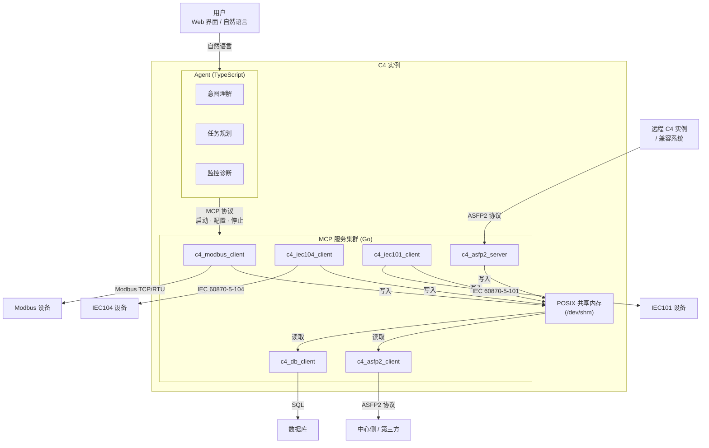
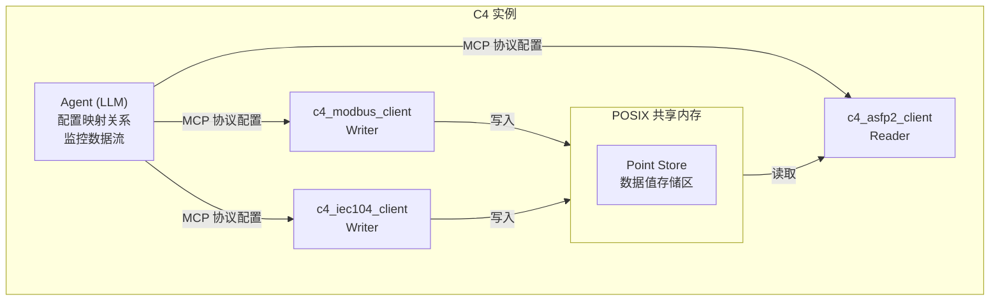
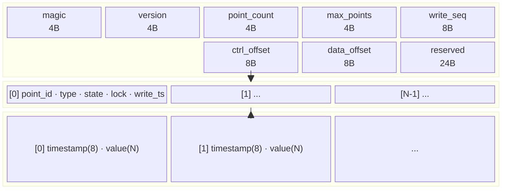
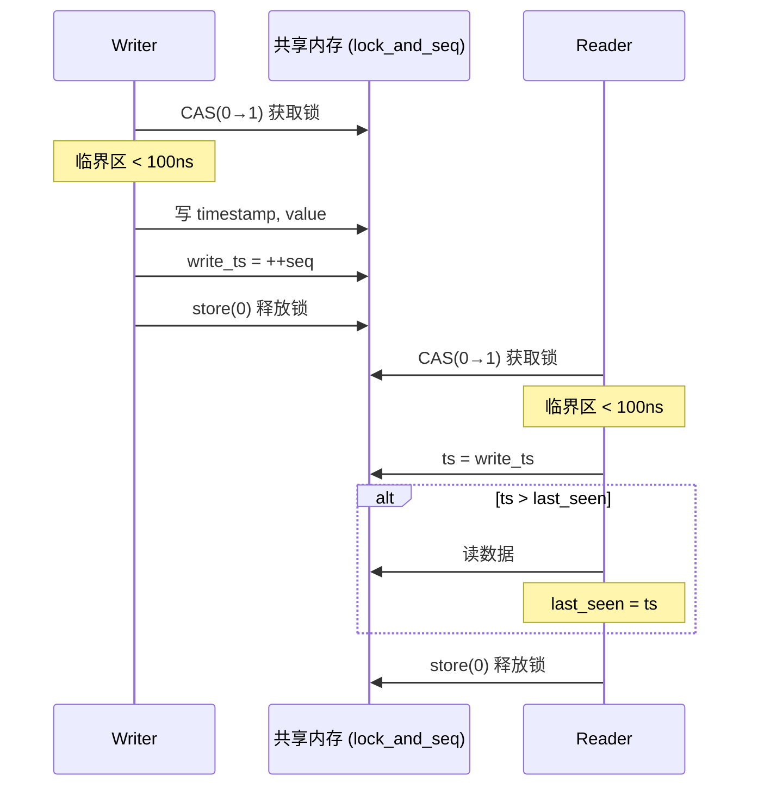
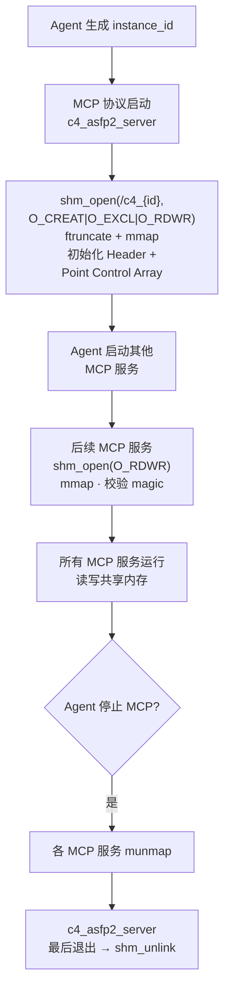
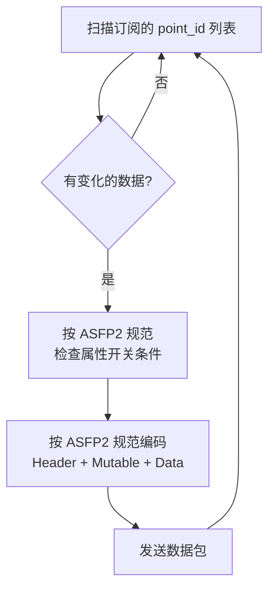

# C4 进程间数据共享架构设计

> **版本**：v0.2.0 | **最后更新**：2026-07-11

## C4 架构概览

C4 采用 **Agent + MCP 服务集群** 架构。Agent 是智能决策层，MCP 服务是确定性执行层，
两者通过进程间通信协作。每个 C4 实例部署在一台工业数据服务器上。

### 技术栈

| 组件 | 语言 | 选型理由 |
|------|------|---------|
| **Agent** | TypeScript | MCP SDK 原生支持、Web 界面同语言、异步 I/O 成熟、LLM 生态丰富 |
| **MCP 服务** | Go | 高性能低内存、交叉编译为静态二进制、goroutine 天然适配多设备并发连接、工业 Linux 部署友好 |

### 架构图

```
                      用户（Web 界面 / 自然语言）
                                │
                                ▼
┌───────────────────────────────────────────────────────────┐
│                    C4 实例（一台服务器）                     │
│                                                           │
│   ┌─────────────────────────────────────────────────┐    │
│   │              Agent (TypeScript)                   │    │
│   │  ┌──────────┐ ┌──────────┐ ┌──────────┐         │    │
│   │  │ 意图理解  │ │ 任务规划  │ │ 监控诊断  │  ...    │    │
│   │  └──────────┘ └──────────┘ └──────────┘         │    │
│   └──────┬──────────────┬──────────────┬────────────┘    │
│          │ MCP 协议     │ MCP 协议     │ MCP 协议         │
│          ▼              ▼              ▼                  │
│   ┌──────────┐   ┌──────────┐   ┌──────────┐   ┌──────────┐   ┌──────────┐   ┌──────────┐    │
│   │ modbus   │   │ iec104  │   │ iec101  │   │ asfp2   │   │ asfp2   │   │ db       │ ...│
│   │ client   │   │ client  │   │ client  │   │ server  │   │ client  │   │ client   │    │
│   │  (Go)    │   │  (Go)   │   │  (Go)   │   │  (Go)   │   │  (Go)   │   │  (Go)    │    │
│   └────┬─────┘   └────┬────┘   └────┬────┘   └────┬────┘   └────┬────┘   └────┬─────┘    │
│        │rw           │rw          │rw          │rw          │r            │r             │
│        ▼             ▼            ▼            ▼            ▼                    │
│   ┌──────────────────────────────────────────────────────────────────────┐       │
│   │                    POSIX 共享内存 (/dev/shm)                          │       │
│   └──────────────────────────────────────────────────────────────────────┘       │
└───────────────────────────────────────────────────────────────────────────────────┘
        │             │            │            │            │
        ▼             ▼            ▼            ▼            ▼
   Modbus 设备    IEC104 设备   IEC101 设备  ASFP2 接收   ASFP2 发送     数据库
   (RTU/TCP)      (远动装置)    (串口)       (服务端)      (中心侧/第三方)
```



**核心设计原则**：

- Agent（TypeScript）处理所有智能决策——理解用户意图、规划接入方案、配置和监控 MCP 服务
- MCP 服务（Go）处理所有确定性数据搬运——协议采集、数据转换、数据转发
- Agent 不在实时数据路径中运行。Agent 故障不影响已运行的 MCP 数据管道
- Agent 与 MCP 之间通过标准 MCP 协议（Model Context Protocol）通信
- MCP 服务之间通过 POSIX 共享内存交换数据，零拷贝、纳秒级延迟。`c4_asfp2_server` 是每个 C4 实例默认启动的首个服务，由它创建并初始化共享内存

---

## 1. 问题背景

C4 的数据接入流程涉及多个 MCP 服务之间的数据传递。典型的场景：

- `c4_modbus_client` 从 Modbus 设备采集寄存器数据
- `c4_iec104_client` 从 IEC104 设备采集远动数据
- `c4_iec101_client` 从 IEC101 串口设备采集数据
- `c4_asfp2_server` 接收远程 C4 实例或兼容系统发来的 ASFP2 数据
- `c4_asfp2_client` 将数据按 ASFP2 协议转发到中心侧
- `c4_db_client` 将数据写入数据库

这些 MCP 服务是**独立进程**，需要一种高效、低延迟的数据共享机制。
方案要求：零拷贝或近零拷贝、确定性延迟、支持一对多写入/读取、故障隔离。

## 2. 核心方案：共享内存 + 点映射表

每个 C4 实例内，所有本地 MCP 服务通过一块 POSIX 共享内存交换数据。
Agent 负责分配点映射关系，MCP 服务按映射读写。

```
┌──────────────────────────────────────────────────────┐
│                   C4 实例（一台服务器）                 │
│                                                      │
│  ┌─────────┐   ┌─────────┐   ┌─────────┐             │
│  │ modbus  │   │ iec104  │   │ asfp2   │             │
│  │ client  │   │ client  │   │ client  │   ...       │
│  │ (writer)│   │ (writer)│   │ (reader)│             │
│  └────┬────┘   └────┬────┘   └────┬────┘             │
│       │  写入        │  写入       │  读取             │
│       ▼              ▼             ▼                  │
│  ┌────────────────────────────────────────────┐      │
│  │              POSIX 共享内存                  │      │
│  │  ┌──────────────────┐ │      │
│  │  │    Point Store    │ │      │
│  │  │  (数据值存储区)    │ │      │
│  │  └──────────────────┘ │      │
│  └────────────────────────────────────────────┘      │
│                                                      │
│  ┌────────────────────────────────────────────┐      │
│  │              Agent (LLM)                    │      │
│  │   配置映射关系、监控数据流、诊断异常          │      │
│  └────────────────────────────────────────────┘      │
└──────────────────────────────────────────────────────┘
```



## 3. 共享内存布局

```
┌──────────────────────────────────────────────────────┐  ← 0x0000
│                     Header (64B)                      │
│  magic(4) | version(4) | point_count(4) | max_points(4)
│  write_seq(8) | ctrl_offset(8) | data_offset(8)     │
│  reserved(24)                                         │
├──────────────────────────────────────────────────────┤
│               Point Control Array                     │
│  [0] point_id | type | state | flags                  │
│      lock(4) | padding(4) | write_ts(8)                │
│      data_offset(8) | slot_size(2) | reserved(6)      │
│  [1] ...                                              │
│  [N-1] ...                                            │
├──────────────────────────────────────────────────────┤
│                 Data Arena                            │
│  [point_0] timestamp(8) | value(N)                     │
│  [point_1] timestamp(8) | value(N)                     │
│  ...                                                  │
└──────────────────────────────────────────────────────┘
```



**Header 字段说明**：

| 字段 | 大小 | 说明 |
|------|------|------|
| `magic` | 4B | `0xC4DA7A00`，共享内存有效性校验 |
| `version` | 4B | 布局版本号，当前 `1` |
| `point_count` | 4B | 当前已注册的 point 数量 |
| `max_points` | 4B | 最大 point 容量（由 shm 大小和 Agent 配置决定） |
| `write_seq` | 8B | 全局写入序号（单调递增），供 reader 判断数据新鲜度 |
| `ctrl_offset` | 8B | Point Control Array 起始偏移 |
| `data_offset` | 8B | Data Arena 起始偏移 |

**Point Control 字段说明**：

| 字段 | 大小 | 说明 |
|------|------|------|
| `point_id` | 4B | 全局唯一 point 标识 |
| `type` | 2B | 数据类型（ASFP2_TYPE_* 枚举） |
| `state` | 1B | 0=空闲, 1=活跃, 2=暂停 |
| `flags` | 1B | 保留标志位 |
| `lock` | 4B | 自旋锁——CAS(0→1) 获取，store(0) 释放 |
| `padding` | 4B | 字节对齐（保证 write_ts 8 字节对齐） |
| `write_ts` | 8B | 最后一次写入的全局序号，reader 用于判断是否有新数据 |
| `data_offset` | 8B | 该 point 在 Data Arena 中的记录偏移量 |
| `slot_size` | 2B | point 记录在 Data Arena 中占用的总字节数 |
| `reserved` | 6B | 对齐填充，总计 40B |

**Data Arena 详细设计**：

Data Arena 是实际数据值的存储区域。每个 point 的数据记录由两部分组成：`timestamp`、`value`。

### 3.1 Data Arena 记录结构

```
每个 point 在 Data Arena 中的记录：
┌────────────────────────────────────────────┐
│  timestamp (8B)     ← 采集时间戳（毫秒）     │
├────────────────────────────────────────────┤
│  value (NB)         ← 实际数据，长度由 type 决定 │
└────────────────────────────────────────────┘
```

### 3.2 字段详解

#### Timestamp（8 字节）

64 位有符号整数，表示数据被采集的时刻与 Unix 纪元（1970-01-01 00:00:00.000 UTC）之间的毫秒差值。使用网络字节序（大端）存储。Agent 可通过此字段判断数据的时效性和顺序。

### 3.3 类型存储

数据直接存储在 Data Arena 的记录槽位中。每个 point 的槽位起点由 Point Control 中的 `data_offset` 字段指定，`slot_size` 根据 point 的 `type` 决定。

| ASFP2 类型 | 枚举值 | Value 大小 | 槽位总大小 (timestamp + value) |
|------------|--------|-----------|-------------------------------|
| BOOLEAN | 0 | 1B | 9B |
| INT8 | 1 | 1B | 9B |
| UINT8 | 2 | 1B | 9B |
| INT16 | 3 | 2B | 10B |
| UINT16 | 4 | 2B | 10B |
| INT32 | 5 | 4B | 12B |
| UINT32 | 6 | 4B | 12B |
| INT64 | 7 | 8B | 16B |
| UINT64 | 8 | 8B | 16B |
| FLOAT16 | 9 | 2B | 10B |
| FLOAT32 | 10 | 4B | 12B |
| FLOAT64 | 11 | 8B | 16B |
| BIT | 15 | 1B | 9B |

所有类型的 value 使用网络字节序（大端）存储。
FLOAT 类型遵循 IEEE 754 标准，不区分字节序。
BOOLEAN 和 BIT 类型：1 字节，最低位（bit 0）表示有效值，其余位为 0。
UINT64/INT64/FLOAT64 的 value 从 timestamp 后的偏移 8 开始，自然 8 字节对齐。

### 3.4 Data Arena 布局示例（以 UINT16 为例）：

```
point_id=0 (UINT16):  offset=0x1000
┌────────────────────────────────────┐
│ 0x1000: timestamp (8B, 大端)        │
│ 0x1008: value (2B, 大端)            │
└────────────────────────────────────┘
                  ↑ 10B 槽位

point_id=1 (UINT16):  offset=0x100A
┌────────────────────────────────────┐
│ 0x100A: timestamp (8B, 大端)        │
│ 0x1012: value (2B, 大端)            │
└────────────────────────────────────┘
```

由于各 point 的 `type` 可能不同，槽位大小不统一，因此采用**间接寻址**：Point Control 中存储每个 point 的 `data_offset`（相对于 Data Arena 起始的偏移量），支持不同大小的类型槽位。

## 4. 点地址映射表

映射表位于共享内存之外（Agent 独立管理），通过 Agent → MCP 的 MCP 协议下发配置。

### 4.1 映射方向

```
  采集端 MCP 的本地地址         全局 point_id        转发端 MCP 的本地地址
  ┌──────────────────┐         ┌─────────┐         ┌──────────────────┐
  │ modbus:           │         │         │         │ asfp2:            │
  │  uid=1,func=3,    │ ──────► │    0    │ ◄────── │  key=100          │
  │  addr=40001       │         │         │         │                  │
  ├──────────────────┤         ├─────────┤         ├──────────────────┤
  │ modbus:           │         │         │         │ asfp2:            │
  │  uid=1,func=3,    │ ──────► │    1    │ ◄────── │  key=101          │
  │  addr=40002       │         │         │         │                  │
  ├──────────────────┤         ├─────────┤         ├──────────────────┤
  │ iec104:            │         │         │         │ asfp2:            │
  │  ca=1,ioa=16385   │ ──────► │   100   │ ◄────── │  key=200          │
  └──────────────────┘         └─────────┘         └──────────────────┘
```

### 4.2 映射表结构

Agent 维护一张全局映射表：

```json
{
  "points": [
    {
      "point_id": 0,
      "type": "uint16",
      "sources": [
        {"mcp": "modbus_client", "uid": 1, "func": 3, "addr": 40001}
      ],
      "targets": [
        {"mcp": "asfp2_client", "asfp2_key": 100}
      ]
    },
    {
      "point_id": 100,
      "type": "float32",
      "sources": [
        {"mcp": "iec104_client", "common_addr": 1, "ioa": 16385}
      ],
      "targets": [
        {"mcp": "asfp2_client", "asfp2_key": 200}
      ]
    }
  ]
}
```

### 4.3 映射下发流程

```
1. Agent 解析用户输入（点表、协议文档）→ 生成映射表
2. Agent 通过 MCP 协议向各 MCP 服务下发各自的地址→point_id 映射
   - modbus_client 收到：{uid:1, func:3, addr:40001} → point_id:0
   - asfp2_client 收到：point_id:0 → asfp2_key:100
3. MCP 服务启动后加载映射，开始读写
```


## 5. 读写并发协议

### 5.1 单写多读模型

每个 point_id **只有一个写入者**（产生数据的采集 MCP），
可有**多个读取者**（转发 MCP 或其他消费者）。

### 5.2 自旋锁保护

每个 point 用一个 `lock` 字段（4 字节原子变量）保护数据记录。CAS 获取锁，
临界区内读写数据，操作完成后释放。

**Writer（采集 MCP）**：

```go
// 自旋获取锁
for !atomic.CompareAndSwapUint32(&point.lock_and_seq, 0, 1) {
    runtime.Gosched()  // 让出 CPU，避免空转浪费
}
// 临界区（< 100ns）
write timestamp, value
global_seq++
point.write_ts = global_seq
// 释放锁
atomic.StoreUint32(&point.lock_and_seq, 0)
```

**Reader（转发 MCP）**：

```go
// 自旋获取锁
for !atomic.CompareAndSwapUint32(&point.lock_and_seq, 0, 1) {
    runtime.Gosched()
}
// 临界区（< 100ns）
ts = point.write_ts
if ts > last_seen[point_id]:
    read timestamp, value
    last_seen[point_id] = ts
// 释放锁
atomic.StoreUint32(&point.lock_and_seq, 0)
```



### 5.3 为什么选择自旋锁

| 对比 | 自旋锁（选用） | Seqlock | Mutex |
|------|:----------:|:------:|:-----:|
| 正确性 | ✅ 简单直接 | ⚠️ reader 重试逻辑 | ✅ |
| reader 等待 | 与 writer 互斥时自旋 | ✅ 永不等待 | 与 writer 互斥时睡眠 |
| 性能（无竞争） | ~20ns | ~15ns | ~1000ns |
| 跨语言实现 | ✅ Go CAS + C CAS | ⚠️ 需内存序 | ❌ 依赖 pthread |
| 代码复杂度 | ✅ 10 行 | ⚠️ 奇偶位 + 重试循环 | ✅ 2 行 |

C4 场景特征：临界区 < 100ns、写频率高、每个 point 通常一写一读——自旋锁竞争中自旋概率极低，综合最优。

### 5.4 Point Control 锁设计

Point Control 中的 `lock` 字段（4 字节）作为自旋锁使用（Go 代码中变量名为 `lock_and_seq`）：

- `CAS(0, 1)` 失败 → 有人在用，自旋
- `CAS(0, 1)` 成功 → 进入临界区，写数据后 `store(0)` 释放

`write_ts`（新数据序号）在临界区内递增并写入 Point Control——reader 在临界区内读取此值判断是否有新数据。`write_seq`（全局序号）保留在 Header 中，用于跨 point 的全局顺序。

## 6. 共享内存生命周期

共享内存由 **`c4_asfp2_server`** 创建并初始化。它是每个 C4 实例默认启动的首个服务
——因为每个 C4 实例都必须具备接收 ASFP2 数据的能力。Agent（TypeScript）不直接操作
共享内存，其职责是生成 `instance_id` 并通过 MCP 协议启动 `c4_asfp2_server`，
再由该服务创建共享内存，随后启动其他 MCP 服务。

### 创建流程

```
Agent 生成 instance_id
        │
        │ MCP 协议启动 c4_asfp2_server
        ▼
┌───────────────────────────────────────────────┐
│         c4_asfp2_server 启动（Go）              │
│                                               │
│  shm_open("/c4_{id}", O_CREAT|O_EXCL|O_RDWR)  │
│  ftruncate(64MB)                              │
│  mmap                                         │
│  初始化 Header（magic, version, max_points）    │
│  初始化 Point Control Array（全部 state=空闲）   │
│  写入 magic = 0xC4DA7A00                       │
└───────────────────────────────────────────────┘
        │
        │ Agent 通过 MCP 协议启动其他 MCP 服务
        ▼
┌───────────────────────────────────────────────┐
│          其他 MCP 服务启动（Go）                 │
│  shm_open("/c4_{id}", O_RDWR)   // 不传 O_CREAT│
│  mmap                                         │
│  校验 magic == 0xC4DA7A00                      │
│  开始读写共享内存                               │
└───────────────────────────────────────────────┘
```



| 操作 | 说明 |
|------|------|
| 创建 | `c4_asfp2_server` 启动时创建，命名规则 `/c4_{instance_id}` |
| 附加 | 后续 MCP 服务以普通 `O_RDWR` 或 `O_RDONLY` 打开，校验 `magic` 后附加 |
| 大小 | 默认 64MB（约可容纳 50 万 point），Agent 可通过 MCP 配置下发调整 |
| 销毁 | `c4_asfp2_server` 最后退出时 `shm_unlink`；进程异常退出由操作系统回收 |

## 7. 与 ASFP2 协议的集成

C4 使用两个独立的 MCP 服务处理 ASFP2 协议：
- `c4_asfp2_client`：从共享内存读取数据，编码为 ASFP2 数据包后发送到中心侧或第三方
- `c4_asfp2_server`：作为服务端接收远程 ASFP2 数据，解析后写入共享内存

### 7.1 ASFP2 发送（`c4_asfp2_client`）

`c4_asfp2_client` 从共享内存读取多个 point 的数据，构造 ASFP2 数据包。

```
asfp2_client 打包循环:
  1. 扫描共享内存中所有已订阅 point_id，取出有新数据的 point
  2. 按 ASFP2 协议规范（`asfp2_specification.md`）的要求，
     检查属性开关条件（SAME_DATA_TYPE / KEY_SEQUENCE / SAME_TIMESTAMP），
     将符合条件的 point 归入同一个数据包
  3. 按 ASFP2 规范编码 Header + Mutable + Data
  4. 发送 → 返回步骤 1
```



### 7.2 point_id 到 asfp2_key 的映射（发送端）

```json
// c4_asfp2_client 从 Agent 接收的配置
{
  "subscriptions": [
    {"point_id": 0,   "asfp2_key": 100},
    {"point_id": 1,   "asfp2_key": 101},
    {"point_id": 100, "asfp2_key": 200}
  ]
}
```

`c4_asfp2_client` 维护 `point_id → asfp2_key` 的本地索引，
打包时遍历索引表，从共享内存读取最新值，按 ASFP2 规范编码。

### 7.3 ASFP2 接收（`c4_asfp2_server`）

`c4_asfp2_server` 以 O_RDWR 模式创建并附加共享内存，作为 ASFP2 服务端监听连接。
收到远程 C4 实例或兼容系统的 ASFP2 数据包后，解析并按 `asfp2_key → point_id`
的反向映射写入对应的 point_id 记录，供本地其他 MCP 服务消费。
接收端的 point 映射由 Agent 配置下发，其 JSON 结构与发送端相反：
`{"asfp2_key": 100, "point_id": 0}`。

## 8. 错误处理

| 场景 | 处理方式 |
|------|---------|
| Writer（采集 MCP）崩溃 | Reader 检测到 `write_ts` 长时间未更新 → 上报 Agent → Agent 决定重启或切换 |
| Reader（转发 MCP）崩溃 | Writer 不受影响；Agent 监控 reader 心跳 → 自动重启 |
| 共享内存损坏 | `magic` 校验失败 → Agent 重建共享内存并重新下发配置 |
| 内存不足 | Agent 检测 `point_count ≥ max_points` → 分配更大的 shm 或拒绝新增 point |
| 跨进程时间同步 | 所有 MCP 进程使用 Unix 纪元毫秒作为统一的时间戳格式；数据新鲜度由 `write_seq` 单调计数器保证，与时间源无关 |

## 9. 性能考量

| 考量 | 设计选择 |
|------|---------|
| Cache line | Point Control 40B/条目，一个条目独占大半个缓存行，相邻 point 的 lock 和 write_ts 不在同一缓存行，无 false sharing |
| 读写放大 | Reader 只在 lock 内检测 `write_ts` 变化，仅拷贝有更新的 point |
| 锁竞争 | 每个 point 独立加锁，writer/reader 只在操作同一 point 时互斥；不同 point 无竞争 |
| 内存占用 | Point Control 40B + 数据槽位（9~16B）/point；50 万 point ≈ 25MB |
| 写入延迟 | CAS（~10ns）+ memcpy（~20ns）+ store 释放（~5ns），总 < 50ns |

## 10. 备选方案讨论

| 方案 | 优点 | 缺点 | 结论 |
|------|------|------|------|
| 共享内存（本方案） | 零拷贝、纳秒级延迟 | 单机限制、需处理并发 | ✅ 选用 |
| Unix Domain Socket | 跨网络、协议灵活 | 数据拷贝、微秒级延迟 | 备选（跨容器场景） |
| Redis/MQ | 解耦、持久化 | 网络开销大、引入外部依赖 | 不适合实时数据路径 |
| 管道/FIFO | 简单 | 单向、无随机访问 | 不适用 |

---

> **对应功能**：C4_FUN_00006, C4_FUN_00008, C4_FUN_00009, C4_FUN_00010, C4_FUN_00011, C4_FUN_00012~00017, C4_FUN_00022, C4_FUN_00024, C4_FUN_00042, C4_FUN_00047
