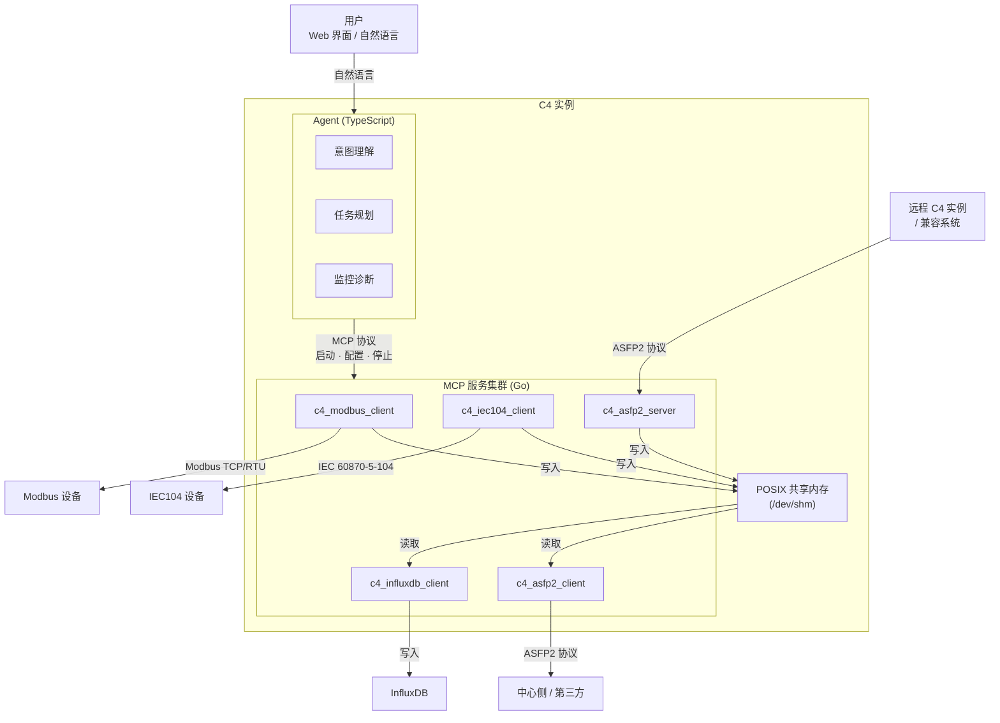
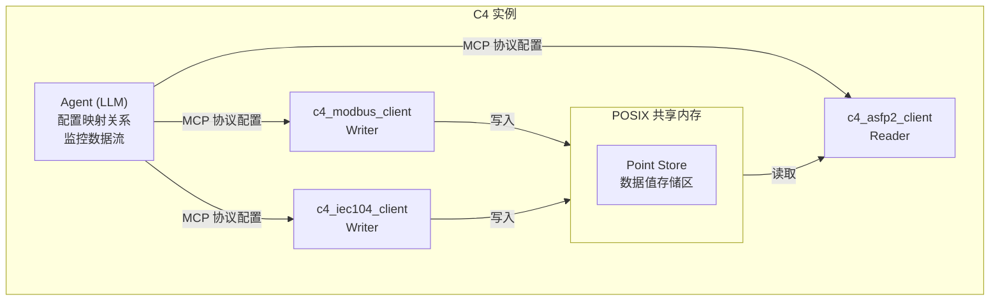
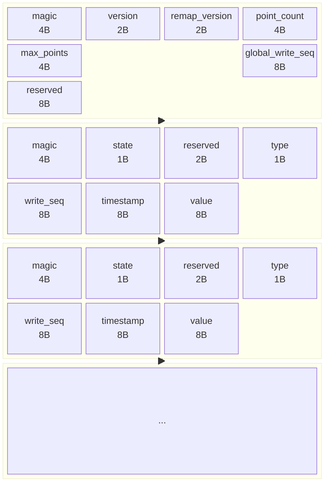
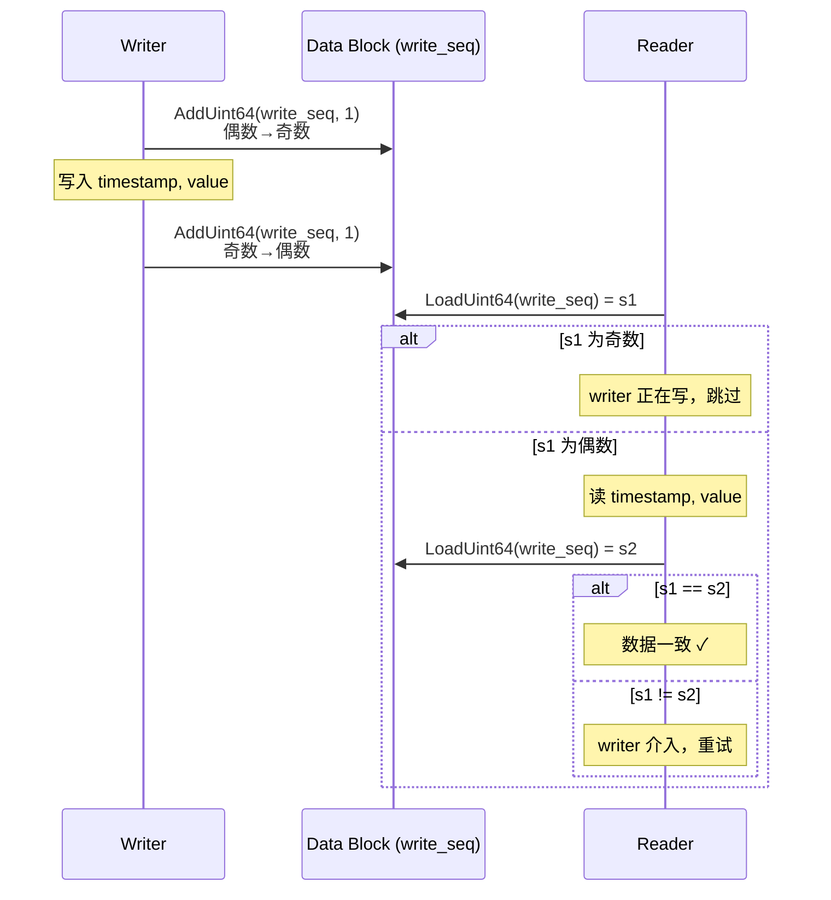
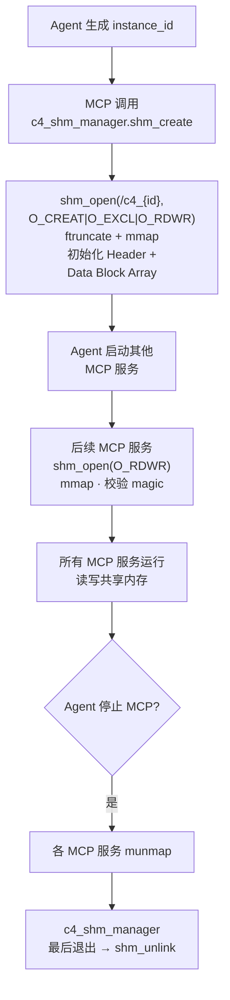
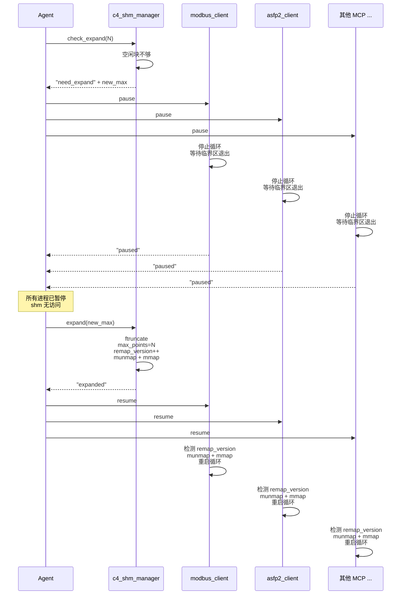
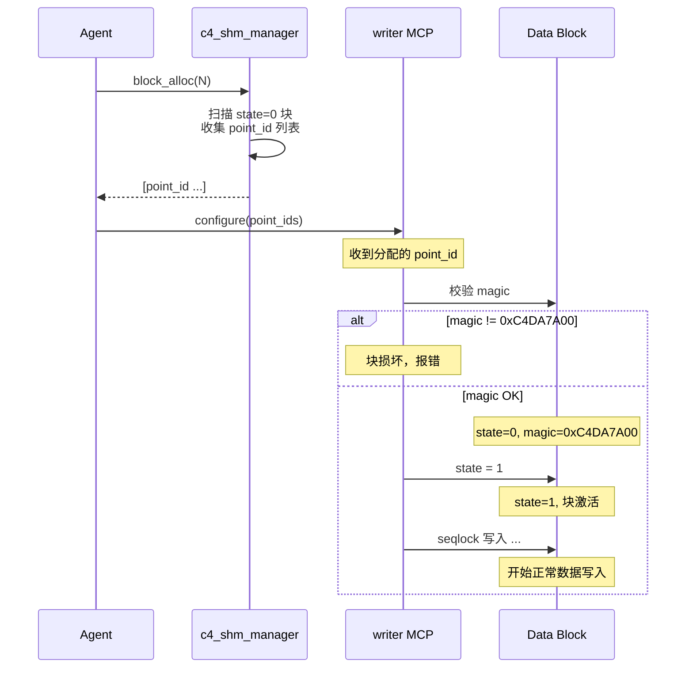
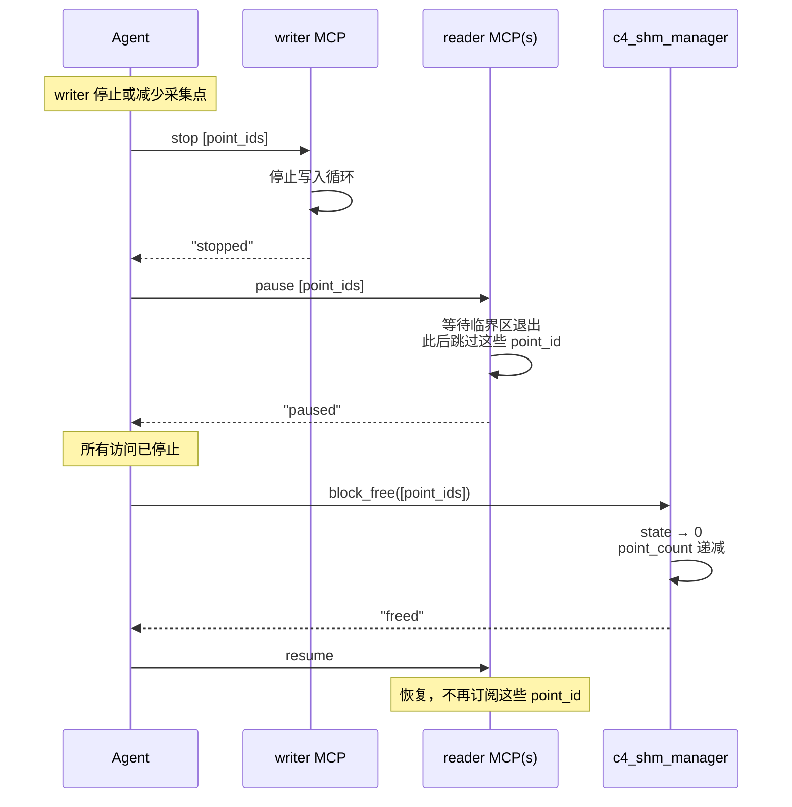
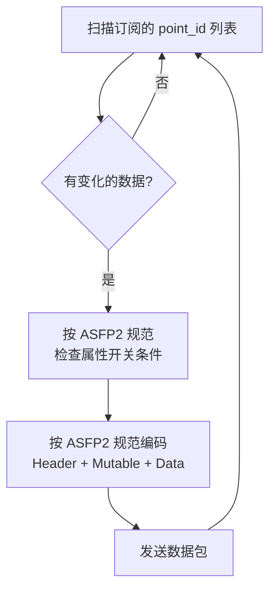

# C4 架构设计

> **版本**：v0.3.0 | **最后更新**：2026-07-14

---

# 第一章 架构设计

## 1.1 设计背景与目标

C4 的数据接入流程涉及多个 MCP 服务之间的数据传递。典型的场景：

- `c4_modbus_client` 从 Modbus 设备采集寄存器数据
- `c4_iec104_client` 从 IEC104 设备采集远动数据
- `c4_asfp2_server` 接收远程 C4 实例或兼容系统发来的 ASFP2 数据
- `c4_asfp2_client` 将数据按 ASFP2 协议转发到中心侧
- `c4_influxdb_client` 将数据写入 InfluxDB

这些 MCP 服务是**独立进程**，需要一种高效、低延迟的数据共享机制。
方案要求：零拷贝或近零拷贝、确定性延迟、支持一对多写入/读取、故障隔离。

## 1.2 技术选型

| 组件 | 语言 | 选型理由 |
|------|------|---------|
| **Agent** | TypeScript | MCP SDK 原生支持、Web 界面同语言、异步 I/O 成熟、LLM 生态丰富 |
| **MCP 服务** | Go | 高性能低内存、交叉编译为静态二进制、goroutine 天然适配多设备并发连接、工业 Linux 部署友好 |

## 1.3 整体架构

C4 采用 **Agent + MCP 服务集群** 架构。Agent 是智能决策层，MCP 服务是确定性执行层，
两者通过进程间通信协作。每个 C4 实例部署在一台工业数据服务器上。

```
                      用户（Web 界面 / 自然语言）
                                │
                                ▼
┌───────────────────────────────────────────────────────────┐
│                    C4 实例（一台服务器）                     │
│                                                           │
│   ┌─────────────────────────────────────────────────┐    │
│   │              Agent (TypeScript)                   │    │
│   │  ┌──────────┐ ┌──────────┐ ┌──────────┐         │    │
│   │  │ 意图理解  │ │ 任务规划  │ │ 监控诊断  │  ...    │    │
│   │  └──────────┘ └──────────┘ └──────────┘         │    │
│   └──────┬──────────────┬──────────────┬────────────┘    │
│          │ MCP 协议     │ MCP 协议     │ MCP 协议         │
│          ▼              ▼              ▼                  │
│   ┌──────────┐   ┌──────────┐   ┌──────────┐   ┌──────────┐   ┌──────────┐    │
│   │ modbus   │   │ iec104  │   │ asfp2   │   │ asfp2   │   │ influxdb│ ...│
│   │ client   │   │ client  │   │ server  │   │ client  │   │ client  │    │
│   │  (Go)    │   │  (Go)   │   │  (Go)   │   │  (Go)   │   │  (Go)   │    │
│   └────┬─────┘   └────┬────┘   └────┬────┘   └────┬────┘   └────┬────┘    │
│        │rw           │rw          │rw          │r            │r             │
│        ▼             ▼            ▼            ▼                          │
│   ┌──────────────────────────────────────────────────────────────────────┐       │
│   │                    POSIX 共享内存 (/dev/shm)                          │       │
│   └──────────────────────────────────────────────────────────────────────┘       │
└───────────────────────────────────────────────────────────────────────────────────┘
        │             │            │            │            │
        ▼             ▼            ▼            ▼            ▼
   Modbus 设备    IEC104 设备  ASFP2 接收   ASFP2 发送    InfluxDB
   (RTU/TCP)      (远动装置)   (服务端)      (中心侧/第三方)
```



## 1.4 核心设计原则

- Agent（TypeScript）处理所有智能决策——理解用户意图、规划接入方案、配置和监控 MCP 服务
- MCP 服务（Go）处理所有确定性数据搬运——协议采集、数据转换、数据转发
- Agent 不在实时数据路径中运行。Agent 故障不影响已运行的 MCP 数据管道
- Agent 与 MCP 之间通过标准 MCP 协议（Model Context Protocol）通信
- MCP 服务之间通过 POSIX 共享内存交换数据，零拷贝、纳秒级延迟。`c4_shm_manager` 是每个 C4 实例默认启动的首个服务，负责共享内存的创建、扩容、块分配回收和销毁

---

# 第二章 MCP 服务和共享内存通信

## 2.1 总体方案：共享内存 + 点映射表

每个 C4 实例内，所有本地 MCP 服务通过一块 POSIX 共享内存交换数据。
Agent 负责分配点映射关系，MCP 服务按映射读写。

```
┌──────────────────────────────────────────────────────┐
│                   C4 实例（一台服务器）                 │
│                                                      │
│  ┌─────────┐   ┌─────────┐   ┌─────────┐             │
│  │ modbus  │   │ iec104  │   │ asfp2   │             │
│  │ client  │   │ client  │   │ client  │   ...       │
│  │ (writer)│   │ (writer)│   │ (reader)│             │
│  └────┬────┘   └────┬────┘   └────┬────┘             │
│       │  写入        │  写入       │  读取             │
│       ▼              ▼             ▼                  │
│  ┌────────────────────────────────────────────┐      │
│  │              POSIX 共享内存                  │      │
│  │  ┌──────────────────┐ │      │
│  │  │    Point Store    │ │      │
│  │  │  (数据值存储区)    │ │      │
│  │  └──────────────────┘ │      │
│  └────────────────────────────────────────────┘      │
│                                                      │
│  ┌────────────────────────────────────────────┐      │
│  │              Agent (LLM)                    │      │
│  │   配置映射关系、监控数据流、诊断异常          │      │
│  └────────────────────────────────────────────┘      │
└──────────────────────────────────────────────────────┘
```



## 2.2 共享内存布局

共享内存采用**定长数据块数组**布局。每个数据块固定 32 字节，全局 Header 占据
块[0]（point_id = 0），实际数据从块[1]（point_id = 1）开始。任意数据块的
地址通过 `point_id * 32` 直接计算，无需间接寻址。

```
┌──────────────────────────────────────────────────────┐  ← 0x0000
│                 Global Header (32B)                    │
│  magic(4) │ version(2) │ remap_version(2) │ point_count(4) │ max_points(4)  │
│  global_write_seq(8) │ reserved(8)                    │
├──────────────────────────────────────────────────────┤  ← 0x0020
│               Data Block [1] (32B)                    │
│  magic(4) │ state(1) │ reserved(2) │ type(1)          │
│  write_seq(8) │ timestamp(8) │ value(8)               │
├──────────────────────────────────────────────────────┤  ← 0x0040
│               Data Block [2] (32B)                    │
│  ...                                                  │
├──────────────────────────────────────────────────────┤
│               Data Block [N] (32B)                    │
│  ...                                                  │
└──────────────────────────────────────────────────────┘
```

地址公式：`block_offset = point_id * 32`



### 2.2.1 Global Header 字段说明

| 字段 | 大小 | 偏移 | 说明 |
|------|------|------|------|
| `magic` | 4B | 0 | `0xC4DA7A00`，共享内存有效性校验 |
| `version` | 2B | 4 | 布局版本号，极少变更，当前 `1` |
| `remap_version` | 2B | 6 | 共享内存大小或布局变更时递增，进程检测此字段以触发 `munmap` + `mmap` 重新映射 |
| `point_count` | 4B | 8 | 当前活跃（state=1）的 point 数量，不包含 Header 自身。分配时递增，回收时递减 |
| `max_points` | 4B | 12 | 最大 point 容量，空闲块数 = `max_points - point_count` |
| `global_write_seq` | 8B | 16 | 全局写入序号（原子单调递增），用于跨 point 的全局顺序 |
| `reserved` | 8B | 24 | 保留，总计 32B |

### 2.2.2 Data Block 字段说明

| 字段 | 大小 | 偏移 | 说明 |
|------|------|------|------|
| `magic` | 4B | 0 | 块级完整性校验。`c4_shm_manager` 在创建/扩容时一次性写入 `0xC4DA7A00`，此后永不变更。Writer 和 Reader 每次访问前校验——`0` 表示未初始化，其他值表示内存损坏 |
| `state` | 1B | 4 | 块激活状态：0=空闲（未激活），1=活跃（Writer 首次写入时置 1）。回收时由 `c4_shm_manager` 置 0 |
| `reserved` | 2B | 5 | 保留 |
| `type` | 1B | 7 | 数据类型（ASFP2_TYPE_* 枚举） |
| `write_seq` | 8B | 8 | Seqlock 序列号——奇数=writer 写入中，偶数=稳定可读。同时承载数据新鲜度判断（超过 `last_seen` 即新数据） |
| `timestamp` | 8B | 16 | 采集时间戳，Unix 纪元毫秒差值（大端） |
| `value` | 8B | 24 | 实际数据值，统一 8B（大端），不足 8B 的类型靠右对齐低位 |

### 2.2.3 数据类型存储

所有类型的 value 统一占用 8B，不足 8B 的类型在低位存储，高位补零。

| ASFP2 类型 | 枚举值 | 有效字节 | 存储位置（8B value 中） |
|------------|--------|---------|------------------------|
| BOOLEAN | 0 | 1B | 最低字节（offset 0） |
| INT8 | 1 | 1B | 最低字节（offset 0） |
| UINT8 | 2 | 1B | 最低字节（offset 0） |
| INT16 | 3 | 2B | 低 2 字节（offset 0~1） |
| UINT16 | 4 | 2B | 低 2 字节（offset 0~1） |
| INT32 | 5 | 4B | 低 4 字节（offset 0~3） |
| UINT32 | 6 | 4B | 低 4 字节（offset 0~3） |
| INT64 | 7 | 8B | 全部 8 字节 |
| UINT64 | 8 | 8B | 全部 8 字节 |
| FLOAT16 | 9 | 2B | 低 2 字节（offset 0~1） |
| FLOAT32 | 10 | 4B | 低 4 字节（offset 0~3） |
| FLOAT64 | 11 | 8B | 全部 8 字节 |
| BIT | 15 | 1B | 最低字节（offset 0） |

所有类型的 value 使用网络字节序（大端）存储。
FLOAT 类型的 value 同样使用网络字节序（大端）存储，字节 swap 方式与整数类型一致（Go: `binary.BigEndian`，C: `htonl`/`ntohl`）。
BOOLEAN 和 BIT 类型：最低位（bit 0）表示有效值，其余位为 0。

### 2.2.4 定长块设计优势

与变长槽位（根据不同 type 分配 9~16B 大小不等的槽位）相比，定长 32B 块设计：

- **O(1) 直接寻址**：`point_id * 32`（一条左移 5 位指令）即定位目标块
- **单次 cache line 访问**：32B 正好半条 cache line（64B），元数据+数据在一次 cache miss 内全部获取
- **块级完整性校验**：`magic` 由 `c4_shm_manager` 创建时一次性写入，Writer/Reader 每次访问前校验，检测内存踩踏或未初始化块
- **无写入顺序问题**：`magic` 永不变更（写入在前），`state` 由 Writer 首次写入时激活（在后）。不存在"先看到 state=1 再看到 magic=0"的竞态
- **Seqlock 崩溃安全**：`write_seq` 的奇偶位替代自旋锁，writer 崩溃后 sequence 停在奇数，reader 跳过此 block 而不阻塞，无"锁永远不释放"问题
- **分配/回收内聚**：`state` 变化即回收，`magic` 保持不变，无需跨区域清理

对于小类型（BOOLEAN / UINT16 等）的 value 空间浪费，50 万 UINT16 点浪费约 3MB（6B×50 万），在 64MB 共享内存上占比 4.7%，可接受。

## 2.3 点地址映射表

映射表位于共享内存之外（Agent 独立管理），通过 Agent → MCP 的 MCP 协议下发配置。

### 2.3.1 映射方向

```
  采集端 MCP 的本地地址         全局 point_id        转发端 MCP 的本地地址
  ┌──────────────────┐         ┌─────────┐         ┌──────────────────┐
  │ modbus:           │         │         │         │ asfp2:            │
  │  uid=1,func=3,    │ ──────► │    1    │ ◄────── │  key=100          │
  │  addr=40001       │         │         │         │                  │
  ├──────────────────┤         ├─────────┤         ├──────────────────┤
  │ modbus:           │         │         │         │ asfp2:            │
  │  uid=1,func=3,    │ ──────► │    2    │ ◄────── │  key=101          │
  │  addr=40002       │         │         │         │                  │
  ├──────────────────┤         ├─────────┤         ├──────────────────┤
  │ iec104:            │         │         │         │ asfp2:            │
  │  ca=1,ioa=16385   │ ──────► │   100   │ ◄────── │  key=200          │
  └──────────────────┘         └─────────┘         └──────────────────┘
```

### 2.3.2 映射表结构

Agent 维护一张全局映射表：

```json
{
  "points": [
    {
      "point_id": 1,
      "type": "uint16",
      "sources": [
        {"mcp": "modbus_client", "uid": 1, "func": 3, "addr": 40001}
      ],
      "targets": [
        {"mcp": "asfp2_client", "asfp2_key": 100}
      ]
    },
    {
      "point_id": 100,
      "type": "float32",
      "sources": [
        {"mcp": "iec104_client", "common_addr": 1, "ioa": 16385}
      ],
      "targets": [
        {"mcp": "asfp2_client", "asfp2_key": 200}
      ]
    }
  ]
}
```

### 2.3.3 映射下发流程

```
1. Agent 解析用户输入（点表、协议文档）→ 生成映射表
2. Agent 通过 MCP 协议向各 MCP 服务下发各自的地址→point_id 映射
   - modbus_client 收到：{uid:1, func:3, addr:40001} → point_id:1
   - asfp2_client 收到：point_id:1 → asfp2_key:100
3. MCP 服务启动后加载映射，开始读写
```


## 2.4 读写并发协议

### 2.4.1 单写多读模型

每个 point_id **只有一个写入者**（产生数据的采集 MCP），
可有**多个读取者**（转发 MCP 或其他消费者）。

### 2.4.2 Seqlock 协议

利用 `write_seq` 的奇偶性实现无锁并发：writer 写入前后各递增一次序列号（偶数→奇数→偶数），reader 通过比较前后序列号是否一致来判断读到的是否为完整数据。

**Writer（采集 MCP）**：

```go
block := (*DataBlock)(unsafe.Pointer(shmPtr + uintptr(pointID)*32))

// 1. 校验块完整性——magic 异常则拒写
if atomic.LoadUint32(&block.magic) != MAGIC {
    logError("block %d magic invalid", pointID)
    return
}

// 2. 首次写入时激活块（state 0→1），并重置序列号为偶数起点
if block.state == 0 {
    block.state = 1
    atomic.StoreUint64(&block.write_seq, 0)  // 归零，保证偶数→奇数→偶数的 seqlock 协议
}

// 3. 获取全局序号
gseq := atomic.AddUint64(&header.global_write_seq, 1)

// 4. 递增序列号为奇数，宣告写入开始
atomic.AddUint64(&block.write_seq, 1)

// 5. 写入数据
block.timestamp = ts
memcpy(&block.value, &data, size)

// 6. 递增序列号为偶数，宣告写入完成
atomic.AddUint64(&block.write_seq, 1)
```

**Reader（转发 MCP）**：

```go
block := (*DataBlock)(unsafe.Pointer(shmPtr + uintptr(pointID)*32))

// 1. 校验块完整性
if atomic.LoadUint32(&block.magic) != MAGIC {
    logError("block %d magic invalid", pointID)
    return
}
// 2. 块未激活，跳过
if block.state == 0 {
    return
}

for {
    s1 := atomic.LoadUint64(&block.write_seq)
    if s1&1 != 0 {           // 奇数：writer 正在写，返回等待下一轮 poll
        return
    }
    // 偶数：block 处于稳定状态，安全读取
    ts := block.timestamp
    val := block.value
    s2 := atomic.LoadUint64(&block.write_seq)
    if s1 == s2 {
        // 序列号未变，读到一致数据
        if s1 > lastSeen[pointID] {
            lastSeen[pointID] = s1
            // 消费数据 ...
        }
        return
    }
    // s1 != s2：writer 在读取期间介入，重试
}
```

**设计约束：Writer 1Hz，Reader 10Hz**。Writer 每秒写入一次（采集周期），Reader 每秒轮询 10 次。
Reader 的 poll 频率 10 倍于 Writer 的写入频率，Writer 在两次 poll 之间最多写入 1 次。
Reader 触发 skip（奇数 seq）的概率 = 1/10，发生 skip 后下一轮 poll（100ms 后）必定拿到已完成的最新值。
Reader 仅在 s1≠s2 时可能重试一次（概率 < 0.001%）。



### 2.4.3 为什么选用 Seqlock

| 特性 | 说明 |
|------|------|
| **崩溃安全** | Writer 崩溃后 `write_seq` 停在奇数，reader 检测到奇数即跳过该 block。无"锁永远不释放"的状态。Agent 监控到 `write_seq` 久未更新后回收 block |
| **Writer 不被 Reader 阻塞** | Writer 只做两次 `atomic.AddUint64`，无需获取锁。Reader 从不阻碍 writer 的数据写入路径 |
| **Reader 不被 Writer 阻塞** | Reader 不获取锁，writer 写入期间 reader 跳过并重试（概率 < 0.001%，工业轮询间隔下实际永不触发） |
| **O_RDONLY 兼容** | Reader 全程只读不写，可以用 `O_RDONLY` mmap 映射。自旋锁方案要求 CAS 原子写，只读页面无法工作 |
| **无自旋等待** | 无 `CAS(0→1)` 自旋循环，CPU 指令流水线不被锁竞争打断 |

**与自旋锁方案的关键差异**：

| 维度 | 自旋锁 | Seqlock |
|------|--------|---------|
| Writer-Reader 关系 | 互斥串行 | 并行 |
| writer 崩溃后果 | lock=1 永存，block 永久死亡 | write_seq 停在奇数，reader 跳过 |
| reader 持锁崩溃 | block 同样死亡 | reader 不持锁，无影响 |
| 临界区写入延迟 | CAS(~10ns) + write(~25ns) + store(~5ns) | AddUint64(~5ns) + write(~25ns) + AddUint64(~5ns) |
| reader 只读路径 | CAS 必须写 `lock`，O_RDONLY 不可用 | 无需写操作，O_RDONLY 可用 |

### 2.4.4 write_seq 语义

`write_seq` 同时承载 seqlock 序列号和数据新鲜度判断：

- **偶数**（bit 0 = 0）：block 处于稳定态，reader 可安全读取
- **奇数**（bit 0 = 1）：writer 正在更新 block，reader 跳过
- **单调递增**：每次写入递增 2（例如 0→1→2, 2→3→4），reader 比较 `write_seq > last_seen`
- **64 位**：2^64 足以覆盖任意部署周期，无需担心溢出（100Hz 写入需 58.5 亿年）

`global_write_seq`（Global Header 中 8B）保留独立职责：跨 point 的全局顺序。
每次 writer 写入时原子递增一次（非两次），与 block 级 `write_seq` 的递增次数无关。

### 2.4.5 不变式

以下规则在正常运行中必须始终成立，是实现和测试的验证基准：

| 不变式 | 维护者 | 校验时机 |
|--------|--------|---------|
| `block.state=1` ⇒ `block.magic=0xC4DA7A00` | Writer（写 state=1 前已验证 magic） | 每次写入前 |
| 每个 block 只有一个 writer（point_id 集合不重叠） | Agent（分配时不交叉） | 分配时 |
| block 被回收（state→0）前，writer 已停止，reader 已暂停 | Agent（Pause-Resume 协议） | 回收 Phase 3 入口 |
| `write_seq` 单调递增（每次 +2：偶数→奇数→偶数） | Writer（seqlock） | — |
| `global_write_seq` 单调递增（每次 +1） | Writer（atomic add） | — |
| 扩容 Phase 2 期间无进程读写 shm | Agent（先 pause 所有 MCP） | Phase 2 入口 |
| `point_count` = 已分配但尚未回收的 block 数 | `c4_shm_manager`（alloc/free 维护；重启时扫描 state=1 重建） | Agent 重启后 |
| `magic` 仅在创建/扩容时由 `c4_shm_manager` 写入，此后永不变 | `c4_shm_manager` | 创建/扩容时 |

## 2.5 共享内存生命周期

共享内存由 **`c4_shm_manager`** 创建并管理。`c4_shm_manager` 是每个 C4 实例默认启动
的首个 MCP 服务，它通过 MCP 协议向 Agent 暴露共享内存管理的全部能力（创建、扩容、
块分配/回收、状态查询）。Agent 不直接操作共享内存——所有 shm 操作通过
`c4_shm_manager` 提供的 MCP 工具完成。具体工具/资源定义见第三章。

### 2.5.1 创建流程

```
Agent 生成 instance_id
        │
        │ MCP 工具调用 c4_shm_manager.shm_create
        ▼
┌───────────────────────────────────────────────┐
│            c4_shm_manager（Go）                 │
│                                               │
│  shm_open("/c4_{id}", O_CREAT|O_EXCL|O_RDWR)  │
│  ftruncate(64MB)                              │
│  mmap                                         │
│  初始化 Header（magic, version, max_points）    │
│  写入所有 Data Block 的 magic = 0xC4DA7A00      │
│  写入 Header magic = 0xC4DA7A00 （最后）          │
│  返回创建结果 → Agent                          │
└───────────────────────────────────────────────┘
        │
        │ Agent 通过 MCP 协议启动其他 MCP 服务
        ▼
┌───────────────────────────────────────────────┐
│          其他 MCP 服务启动（Go）                 │
│  shm_open("/c4_{id}", O_RDWR)   // 不传 O_CREAT│
│  mmap                                         │
│  校验 magic == 0xC4DA7A00                      │
│  开始读写共享内存                               │
└───────────────────────────────────────────────┘
```



| 操作 | 说明 |
|------|------|
| 创建 | Agent 通过 MCP 工具调用 `c4_shm_manager`，命名规则 `/c4_{instance_id}` |
| 附加 | 后续 MCP 服务以普通 `O_RDWR` 或 `O_RDONLY` 打开，校验 `magic` 后附加 |
| 大小 | 默认 64MB（约可容纳 200 万 point），Agent 可通过 MCP 工具调整 |
| 销毁 | `c4_shm_manager` 最后退出时 `shm_unlink`；进程异常退出由操作系统回收 |

### 2.5.2 扩容与块分配管理

#### 扩容机制

POSIX 共享内存支持 `ftruncate` 扩容，但 `munmap` 是进程级操作——如果扩容过程中
有其他 MCP 进程正在读写共享内存，`munmap` 会导致 SIGSEGV。为此采用
**Pause-Resume 两阶段协议**：先暂停所有 MCP 进程的数据路径，待所有临界区退出后
安全扩容，再恢复。

**两阶段扩容流程**：

```
Phase 1 - 检测与暂停：
  a. Agent 识别需要新增采集点，调用 c4_shm_manager.check_expand(new_points)
  b. c4_shm_manager 计算扩容需求：
     - 空闲块足够 → 返回 "no_expand"，跳过 Phase 2，直接分配
     - 空闲块不够 → 返回 "need_expand" + new_max_points
  c. Agent 向所有 MCP 进程下发 pause 指令
  d. 每个 MCP 进程：
     - 停止读写循环（不再进入新临界区）
     - 等待所有 in-flight 临界区自然结束（最多一个写入周期）
     - 向 Agent ack "paused"

Phase 2 - 安全扩容：
  a. Agent 确认所有 MCP 进程已暂停 → 调用 c4_shm_manager.expand(new_max)
  b. c4_shm_manager（此时无人访问 shm）：
     - ftruncate(shm_fd, new_size)
     - header.max_points = new_max
     - header.remap_version++          // 递增版本号
     - munmap + mmap 新大小
      - 新增 block 全部写入 magic = 0xC4DA7A00
  c. 返回 "expanded" 给 Agent

Phase 3 - 恢复：
  a. Agent 向所有 MCP 进程下发 resume 指令（携带 new_max_points）
  b. 每个 MCP 进程：
     - 检测 header.remap_version 与本地 local_remap_version 不一致
     - munmap + mmap 新大小
     - local_remap_version = header.remap_version
     - 重启读写循环
```



**`remap_version` 的双重角色**：

- **主路径**：Pause-Resume 协议保证扩容时无人访问 shm，`remap_version` 作为恢复阶段各进程判断"是否需要重新映射"的依据
- **降级路径**：如果某个 MCP 进程因网络抖动错过了 resume 指令，它在下次读写循环前检测到 `remap_version` 变化后自行 munmap + mmap——不依赖信号到达

**扩容开销**：扩容过程中数据断流时长 ≈ pause 收集时间（< 1ms）+ ftruncate + mmap（~100μs）+ resume 恢复（< 1ms），总计 < 5ms。扩容是低频事件（数天至数月一次），可接受。

扩容由 `c4_shm_manager` 执行（唯一拥有 `O_CREAT` 权限的进程），Agent 通过 MCP 工具
`check_expand` / `expand` 下发指令。扩容过程中 `c4_shm_manager` 将所有新增 block 的 `magic` 一次性写入 `0xC4DA7A00`，
`state` 自然为 0。已有 block 地址不变（`point_id * 32` 与 mmap 基址重新计算后结果一致）。

#### 块分配与回收

每个 Data Block 的 `state` 字段标记占用状态。**writer 持有的不是连续区间，
而是一个 `point_id` 集合**——寻址公式 `point_id * 32` 与集合是否连续无关。
分配和回收均遵循**先确认数据路径静默、再修改元数据**的原则，与扩容的 Pause-Resume
模式一致。

**分配（Agent 通过 `c4_shm_manager` 执行）**：

```
1. c4_shm_manager 扫描 block[1..max_points]，收集所有 state=0 的 point_id
2. 如果空闲块不够 → 触发扩容（走 Pause-Resume 流程），从新增块中取得
3. header.point_count 递增分配的数量
4. 返回分配的 point_id 列表给 Agent
5. Agent 通过 MCP 协议将 point_id 列表下发给对应 writer
6. Writer 收到 point_id 后首次写入时自行将 state 0→1（magic 已由 shm_manager 确保有效）
```



**回收（Agent 协调，4 阶段）**：
回收发生在 writer 停止或需要减少采集点时。必须确保 write 和 read 都已停止后才修改
`state`，避免与新分配的 writer 冲突。

```
Phase 1 - 停止写入：
  Agent → writer MCP: stop [point_ids]
  writer 停止对指定 point_id 的写入循环 → ack
  → 此后再无新数据写入这些 block
  （若 writer 已崩溃，Agent 超时后直接进入 Phase 2——崩溃进程不会再写）

Phase 2 - 停止读取：
  Agent → 订阅这些 point_id 的 reader MCP(s): pause [point_ids]
  reader 等待当前临界区退出，此后跳过这些 point_id → ack
  → 所有 block 不再被读取

Phase 3 - 安全回收：
  Agent → c4_shm_manager: block_free([point_ids])
  c4_shm_manager: state → 0, point_count 递减
  → 无人访问，无竞态

Phase 4 - 恢复：
  通知 reader 恢复（这些 point_id 已不在订阅列表中）
  writer 如已重启则已获得新分配的 point_id
```



**`point_count` 的维护**：由于只有 `c4_shm_manager`（受 Agent 委托）做分配/回收操作，
`point_count` 的读写是无竞争的，无需原子操作保护。

#### Writer 替换示例

```
初始状态（max_points=100）：
  writer1: [ 1..30]  (30个, state=1)
  writer2: [31..60]  (30个, state=1)
  writer3: [61..90]  (30个, state=1)
  空闲:    [91..100] (10个, state=0)
  point_count=90

writer2 停掉 → writer4(20个) + writer5(25个) 上线：

1. 回收 writer2 的块（Pause-Resume 协议）
   Agent → writer2: stop [31..60]
   Agent → 各 reader: pause [31..60]
   Agent → c4_shm_manager: block_free([31..60])
   block[31..60]: state = 1 → 0
   point_count = 90 - 30 = 60
   Agent → 各 reader: resume

2. 分配 writer4 (20个)
   扫描空闲 → [31..50, ...] 足够
   block[31..50]: state=1
   point_count = 60 + 20 = 80
   下发：writer4.owned_points = [31,32,...,50]

3. 分配 writer5 (25个)
   剩余空闲：[51..60, 91..100] = 20个，不够
   需要 5 个新块 → 扩容 max_points=105
   block[101..105] 自然零填充，state=0
   分配 [51..60, 91..100, 101..105]
   下发：writer5.owned_points = [51,...,60, 91,...,100, 101,...,105]

最终：
  writer1:  [ 1..30]   (30个, 不变)
  writer3:  [61..90]   (30个, 不变)
  writer4:  [31..50]   (20个, 复用writer2的块)
  writer5:  [51..60]   (10个, 复用writer2的块)
  writer5:  [91..105]  (15个, 空闲+扩容)
  空闲:     []         (0个)
  point_count=105
```

关键性质：
- **point_id 一次分配，终身不变**：寻址公式绑定物理位置，重编号会导致映射关系全乱
- **碎片可接受**：writer5 的点跨越两段（51..60, 91..105），但 `point_id * 32` 仍是 O(1)
- **不缩容**：已分配后不再缩减共享内存，避免截断仍在使用的块。空间换简单性
- **全量离线可重建**：如果碎片严重，可在所有 writer 离线时 `shm_unlink` 后重新紧凑分配

### 2.5.3 `c4_shm_manager` 崩溃恢复

`c4_shm_manager` 崩溃后，POSIX 共享内存对象 `/c4_{id}` 仍然存在于 `/dev/shm`
（崩溃进程未调用 `shm_unlink`），其他 MCP 进程的 mmap 映射不受影响。

重启时不能走 `O_CREAT|O_EXCL` 路径——名字已被占用。流程如下：

```
c4_shm_manager 重启
        │
        │ shm_open("/c4_{id}", O_RDWR)  // 不传 O_CREAT
        │ 若失败（文件不存在或权限错误）→ shm_unlink + O_CREAT|O_EXCL 新建
        ▼
┌───────────────────────────────────────────────┐
│              附加已有共享内存                   │
│                                               │
│  mmap                                         │
│  校验 Header magic == 0xC4DA7A00              │
│  ┌─ 若 magic 无效：shm_unlink + 重建新 shm     │
│  └─ 若 magic 有效：                           │
│       扫描 block[1..max_points]               │
│         count = 0                             │
│         for i = 1..max_points:                │
│           if block[i].state == 1: count++     │
│         header.point_count = count            │
│        → 以 state=1 为唯一权威源重建 point_count│
│                                               │
│  恢复正常服务（可接受 alloc/free 请求）          │
└───────────────────────────────────────────────┘
```

关键保证：

- **其他 MCP 进程不受影响**：它们的 mmap 在 crash 期间始终有效，不会 SIGSEGV
- **`point_count` 自动修复**：扫描重建，不依赖崩溃前的内存值
- **`state=1` 是权威源**：即使崩溃发生在 alloc 后、writer 首次写入前（block 已分配但 state 仍为 0），重建后这些 block 自然为"空闲"，下次分配时回收——不浪费
- **始终复用而非重建**：重建意味着 `shm_unlink`，会导致其他进程的 mmap 失效后 SIGSEGV。只有 magic 校验失败（shm 真的损坏了）才走重建路径

## 2.6 ASFP2 协议集成

C4 使用两个独立的 MCP 服务处理 ASFP2 协议，另有 `c4_shm_manager` 管理共享内存：
- `c4_asfp2_client`：从共享内存读取数据，编码为 ASFP2 数据包后发送到中心侧或第三方
- `c4_asfp2_server`：作为服务端接收远程 ASFP2 数据，解析后写入共享内存。`c4_asfp2_server` 以 `O_RDWR` 模式打开已有共享内存（由 `c4_shm_manager` 创建），不参与共享内存的创建或销毁

### 2.6.1 ASFP2 发送（`c4_asfp2_client`）

`c4_asfp2_client` 从共享内存读取多个 point 的数据，构造 ASFP2 数据包。

```
asfp2_client 打包循环:
  1. 扫描共享内存中所有已订阅 point_id，取出有新数据的 point
  2. 按 ASFP2 协议规范（`asfp2_specification.md`）的要求，
     检查属性开关条件（SAME_DATA_TYPE / KEY_SEQUENCE / SAME_TIMESTAMP），
     将符合条件的 point 归入同一个数据包
  3. 按 ASFP2 规范编码 Header + Mutable + Data
  4. 发送 → 返回步骤 1
```



### 2.6.2 point_id 到 asfp2_key 的映射（发送端）

```json
// c4_asfp2_client 从 Agent 接收的配置
{
  "subscriptions": [
    {"point_id": 1,   "asfp2_key": 100},
    {"point_id": 2,   "asfp2_key": 101},
    {"point_id": 100, "asfp2_key": 200}
  ]
}
```

`c4_asfp2_client` 维护 `point_id → asfp2_key` 的本地索引，
打包时遍历索引表，从共享内存读取最新值，按 ASFP2 规范编码。

### 2.6.3 ASFP2 接收（`c4_asfp2_server`）

`c4_asfp2_server` 以 O_RDWR 模式附加已有共享内存，作为 ASFP2 服务端监听连接。
收到远程 C4 实例或兼容系统的 ASFP2 数据包后，解析并按 `asfp2_key → point_id`
的反向映射写入对应的 point_id 记录，供本地其他 MCP 服务消费。
接收端的 point 映射由 Agent 配置下发，其 JSON 结构与发送端相反：
`{"asfp2_key": 100, "point_id": 1}`。

## 2.7 错误处理与故障恢复

| 场景 | 处理方式 |
|------|---------|
| Writer（采集 MCP）崩溃 | `write_seq` 停在奇数（seqlock 特征），reader 检测到奇数后跳过该 block；Agent 监控到 `write_seq` 久未更新 → 回收并重启 |
| Reader（转发 MCP）崩溃 | Writer 不受影响（Seqlock 中 writer 不等待 reader）；Agent 监控 reader 心跳 → 自动重启 |
| 共享内存损坏 | Header 或 Data Block 的 `magic` 校验失败 → Agent 重建共享内存并重新下发配置 |
| 内存不足 | Agent 检测 `point_count ≥ max_points` → 触发扩容或拒绝新增 point |
| 跨进程时间同步 | 所有 MCP 进程使用 Unix 纪元毫秒作为统一的时间戳格式；数据新鲜度由 `write_seq` 单调计数器保证，与时间源无关 |

## 2.8 性能考量

| 考量 | 设计选择 |
|------|---------|
| Cache line | Data Block 32B/条目，正好半条 cache line（64B），元数据+数据一次访问到位，无跨块 false sharing |
| 读写并发 | Seqlock 协议——writer/reader 并行不互斥，reader 仅在 writer 写入的 ~35ns 窗口内可能重试一次（概率可忽略） |
| 内存占用 | 32B/point；50 万 point ≈ 16MB（含 Header） |
| 写入延迟 | AddUint64(~5ns) + memcpy(~20ns) + AddUint64(~5ns)，总 ~30ns |
| 读取延迟（无竞争） | LoadUint64(~5ns) + memcpy(~20ns) + LoadUint64(~5ns)，总 ~30ns |
| 崩溃安全 | Seqlock 无锁设计——writer 崩溃只留奇数 seq，reader 跳过；无"锁永远不释放"风险 |

## 2.9 备选方案讨论

| 方案 | 优点 | 缺点 | 结论 |
|------|------|------|------|
| 共享内存（本方案） | 零拷贝、纳秒级延迟 | 单机限制、需处理并发 | ✅ 选用 |
| Unix Domain Socket | 跨网络、协议灵活 | 数据拷贝、微秒级延迟 | 备选（跨容器场景） |
| Redis/MQ | 解耦、持久化 | 网络开销大、引入外部依赖 | 不适合实时数据路径 |
| 管道/FIFO | 简单 | 单向、无随机访问 | 不适用 |

---

# 第三章 Agent 和 MCP 接口规范

> `c4_shm_manager` 向 Agent 暴露的 MCP 工具（`shm_create`、`check_expand`、`expand`、
> `block_alloc`、`block_free`、`shm_status` 等）和资源将在本章中详细定义。
> 其他 MCP 服务暴露的统一工具（`pause`、`resume`）和各自协议的配置下发接口
>（modbus_client、iec104_client、asfp2_client、asfp2_server、influxdb_client）
> 也在此处统一规范。
>
> *本章内容待补充。*

---

> **对应功能**：C4_FUN_00006, C4_FUN_00008, C4_FUN_00009, C4_FUN_00010, C4_FUN_00011, C4_FUN_00012~00017, C4_FUN_00022, C4_FUN_00024, C4_FUN_00042, C4_FUN_00047
