# C4 架构设计

> **版本**：v0.3.1 | **最后更新**：2026-07-15

---

# 第一章 架构设计

## 1.1 设计背景与目标

C4 的数据接入流程涉及多个 MCP 服务之间的数据传递。典型的场景：

- `c4_modbus_client` 从 Modbus 设备采集寄存器数据
- `c4_iec104_client` 从 IEC104 设备采集远动数据
- `c4_asfp2_server` 接收远程 C4 实例或兼容系统发来的 ASFP2 数据
- `c4_asfp2_client` 将数据按 ASFP2 协议转发到中心侧
- `c4_influxdb_client` 将数据写入 InfluxDB

这些 MCP 服务是**独立进程**，需要一种高效、低延迟的数据共享机制。
方案要求：零拷贝或近零拷贝、确定性延迟、支持一对多写入/读取、故障隔离。

## 1.2 技术选型

| 组件 | 语言 | 选型理由 |
|------|------|---------|
| **Agent** | TypeScript | MCP SDK 原生支持、Web 界面同语言、异步 I/O 成熟、LLM 生态丰富 |
| **MCP 服务** | Go | 高性能低内存、交叉编译为静态二进制、goroutine 天然适配多设备并发连接、工业 Linux 部署友好 |

## 1.3 整体架构

C4 采用 **Agent + MCP 服务集群** 架构。Agent 是智能决策层，MCP 服务是确定性执行层，
两者通过进程间通信协作。每个 C4 实例部署在一台工业数据服务器上。

```
                      用户（Web 界面 / 自然语言）
                                │
                                ▼
┌───────────────────────────────────────────────────────────┐
│                    C4 实例（一台服务器）                     │
│                                                           │
│   ┌─────────────────────────────────────────────────┐    │
│   │              Agent (TypeScript)                   │    │
│   │  ┌──────────┐ ┌──────────┐ ┌──────────┐         │    │
│   │  │ 意图理解  │ │ 任务规划  │ │ 监控诊断  │  ...    │    │
│   │  └──────────┘ └──────────┘ └──────────┘         │    │
│   └──────┬──────────────┬──────────────┬────────────┘    │
│          │ MCP 协议     │ MCP 协议     │ MCP 协议         │
│          ▼              ▼              ▼                  │
│   ┌──────────┐   ┌──────────┐   ┌──────────┐   ┌──────────┐   ┌──────────┐    │
│   │ modbus   │   │ iec104  │   │ asfp2   │   │ asfp2   │   │ influxdb│ ...│
│   │ client   │   │ client  │   │ server  │   │ client  │   │ client  │    │
│   │  (Go)    │   │  (Go)   │   │  (Go)   │   │  (Go)   │   │  (Go)   │    │
│   └────┬─────┘   └────┬────┘   └────┬────┘   └────┬────┘   └────┬────┘    │
│        │rw           │rw          │rw          │r            │r             │
│        ▼             ▼            ▼            ▼                          │
│   ┌──────────────────────────────────────────────────────────────────────┐       │
│   │                    POSIX 共享内存 (/dev/shm)                          │       │
│   └──────────────────────────────────────────────────────────────────────┘       │
└───────────────────────────────────────────────────────────────────────────────────┘
        │             │            │            │            │
        ▼             ▼            ▼            ▼            ▼
   Modbus 设备    IEC104 设备  ASFP2 接收   ASFP2 发送    InfluxDB
   (RTU/TCP)      (远动装置)   (服务端)      (中心侧/第三方)
```

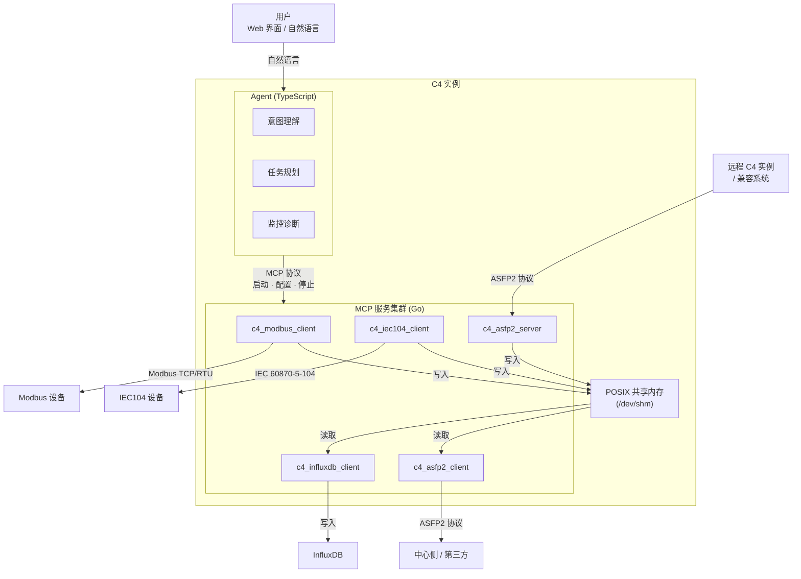

## 1.4 核心设计原则

- Agent（TypeScript）处理所有智能决策——理解用户意图、规划接入方案、配置和监控 MCP 服务
- MCP 服务（Go）处理所有确定性数据搬运——协议采集、数据转换、数据转发
- Agent 不在实时数据路径中运行。Agent 故障不影响已运行的 MCP 数据管道
- Agent 与 MCP 之间通过标准 MCP 协议（Model Context Protocol）通信
- MCP 服务之间通过 POSIX 共享内存交换数据，零拷贝、纳秒级延迟。`c4_shm_manager` 是每个 C4 实例默认启动的首个服务，负责共享内存的创建、扩容、块分配回收和销毁

---

# 第二章 MCP 服务和共享内存通信

## 2.1 总体方案：共享内存 + 点映射表

每个 C4 实例内，所有本地 MCP 服务通过一块 POSIX 共享内存交换数据。
Agent 负责分配点映射关系，MCP 服务按映射读写。

```
┌──────────────────────────────────────────────────────┐
│                   C4 实例（一台服务器）                 │
│                                                      │
│  ┌─────────┐   ┌─────────┐   ┌─────────┐             │
│  │ modbus  │   │ iec104  │   │ asfp2   │             │
│  │ client  │   │ client  │   │ client  │   ...       │
│  │ (writer)│   │ (writer)│   │ (reader)│             │
│  └────┬────┘   └────┬────┘   └────┬────┘             │
│       │  写入        │  写入       │  读取             │
│       ▼              ▼             ▼                  │
│  ┌────────────────────────────────────────────┐      │
│  │              POSIX 共享内存                  │      │
│  │  ┌──────────────────┐ │      │
│  │  │    Point Store    │ │      │
│  │  │  (数据值存储区)    │ │      │
│  │  └──────────────────┘ │      │
│  └────────────────────────────────────────────┘      │
│                                                      │
│  ┌────────────────────────────────────────────┐      │
│  │              Agent (LLM)                    │      │
│  │   配置映射关系、监控数据流、诊断异常          │      │
│  └────────────────────────────────────────────┘      │
└──────────────────────────────────────────────────────┘
```

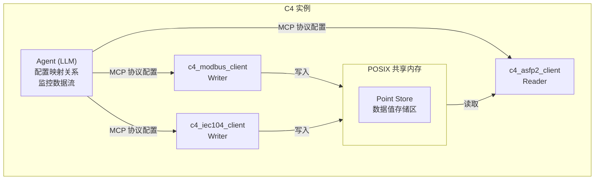

## 2.2 共享内存布局

共享内存采用**定长数据块数组**布局。每个数据块固定 32 字节，全局 Header 占据
块[0]（shm_id = 0），实际数据从块[1]（shm_id = 1）开始。任意数据块的
地址通过 `shm_id * 32` 直接计算，无需间接寻址。

```
┌──────────────────────────────────────────────────────┐  ← 0x0000
│                 Global Header (32B)                    │
│  magic(4) │ version(2) │ remap_version(2) │ point_count(4) │ max_points(4)  │
│  global_write_seq(8) │ reserved(8)                    │
├──────────────────────────────────────────────────────┤  ← 0x0020
│               Data Block [1] (32B)                    │
│  magic(4) │ state(1) │ reserved(2) │ type(1)          │
│  write_seq(8) │ timestamp(8) │ value(8)               │
├──────────────────────────────────────────────────────┤  ← 0x0040
│               Data Block [2] (32B)                    │
│  ...                                                  │
├──────────────────────────────────────────────────────┤
│               Data Block [N] (32B)                    │
│  ...                                                  │
└──────────────────────────────────────────────────────┘
```

地址公式：`block_offset = shm_id * 32`

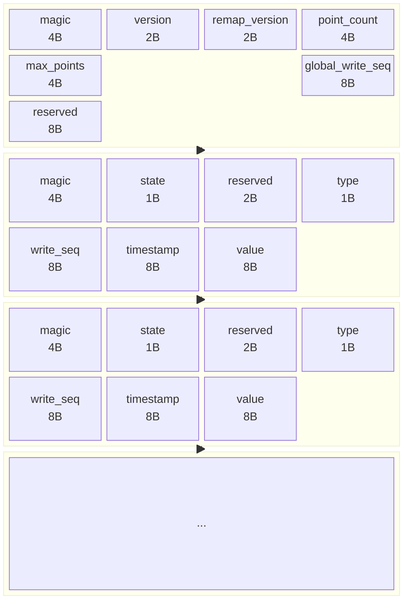

### 2.2.1 Global Header 字段说明

| 字段 | 大小 | 偏移 | 说明 |
|------|------|------|------|
| `magic` | 4B | 0 | `0xC4DA7A00`，共享内存有效性校验 |
| `version` | 2B | 4 | 布局版本号，极少变更，当前 `1` |
| `remap_version` | 2B | 6 | 共享内存大小或布局变更时递增，进程检测此字段以触发 `munmap` + `mmap` 重新映射 |
| `point_count` | 4B | 8 | 当前活跃（state=1）的 point 数量，不包含 Header 自身。分配时递增，回收时递减 |
| `max_points` | 4B | 12 | 最大 point 容量，空闲块数 = `max_points - point_count` |
| `global_write_seq` | 8B | 16 | 全局写入序号（原子单调递增），用于跨 point 的全局顺序 |
| `reserved` | 8B | 24 | 保留，总计 32B |

> **初始化规则**：`c4_shm_manager` 创建共享内存时，先通过 `ftruncate` 将文件扩展到目标大小
> （自动零填充），再按上表写入各字段的指定值。未明确指定非零值的字段（`remap_version`、
> `point_count`、`global_write_seq`、`reserved`）保持 `ftruncate` 后的默认值 `0`。

### 2.2.2 Data Block 字段说明

| 字段 | 大小 | 偏移 | 说明 |
|------|------|------|------|
| `magic` | 4B | 0 | 块级完整性校验。`c4_shm_manager` 在创建/扩容时一次性写入 `0xC4DA7A00`，此后永不变更。Writer 和 Reader 每次访问前校验——`0` 表示未初始化，其他值表示内存损坏 |
| `state` | 1B | 4 | 块激活状态：0=空闲（未激活），1=活跃（Writer 首次写入时置 1）。回收时由 `c4_shm_manager` 置 0 |
| `reserved` | 2B | 5 | 保留 |
| `type` | 1B | 7 | 数据类型（ASFP2_TYPE_* 枚举） |
| `write_seq` | 8B | 8 | Seqlock 序列号——奇数=writer 写入中，偶数=稳定可读。同时承载数据新鲜度判断（超过 `last_seen` 即新数据） |
| `timestamp` | 8B | 16 | 采集时间戳，Unix 纪元毫秒差值（大端） |
| `value` | 8B | 24 | 实际数据值，统一 8B（大端），不足 8B 的类型靠右对齐低位 |

### 2.2.3 数据类型存储

所有类型的 value 统一占用 8B，不足 8B 的类型在低位存储，高位补零。

| ASFP2 类型 | 枚举值 | 有效字节 | 存储位置（8B value 中） |
|------------|--------|---------|------------------------|
| BOOLEAN | 0 | 1B | 最低字节（offset 0） |
| INT8 | 1 | 1B | 最低字节（offset 0） |
| UINT8 | 2 | 1B | 最低字节（offset 0） |
| INT16 | 3 | 2B | 低 2 字节（offset 0~1） |
| UINT16 | 4 | 2B | 低 2 字节（offset 0~1） |
| INT32 | 5 | 4B | 低 4 字节（offset 0~3） |
| UINT32 | 6 | 4B | 低 4 字节（offset 0~3） |
| INT64 | 7 | 8B | 全部 8 字节 |
| UINT64 | 8 | 8B | 全部 8 字节 |
| FLOAT16 | 9 | 2B | 低 2 字节（offset 0~1） |
| FLOAT32 | 10 | 4B | 低 4 字节（offset 0~3） |
| FLOAT64 | 11 | 8B | 全部 8 字节 |
| BIT | 15 | 1B | 最低字节（offset 0） |

所有类型的 value 使用网络字节序（大端）存储。
FLOAT 类型的 value 同样使用网络字节序（大端）存储，字节 swap 方式与整数类型一致（Go: `binary.BigEndian`，C: `htonl`/`ntohl`）。
BOOLEAN 和 BIT 类型：最低位（bit 0）表示有效值，其余位为 0。

### 2.2.4 定长块设计优势

与变长槽位（根据不同 type 分配 9~16B 大小不等的槽位）相比，定长 32B 块设计：

- **O(1) 直接寻址**：`shm_id * 32`（一条左移 5 位指令）即定位目标块
- **单次 cache line 访问**：32B 正好半条 cache line（64B），元数据+数据在一次 cache miss 内全部获取
- **块级完整性校验**：`magic` 由 `c4_shm_manager` 创建时一次性写入，Writer/Reader 每次访问前校验，检测内存踩踏或未初始化块
- **无写入顺序问题**：`magic` 永不变更（写入在前），`state` 由 Writer 首次写入时激活（在后）。不存在"先看到 state=1 再看到 magic=0"的竞态
- **Seqlock 崩溃安全**：`write_seq` 的奇偶位替代自旋锁，writer 崩溃后 sequence 停在奇数，reader 跳过此 block 而不阻塞，无"锁永远不释放"问题
- **分配/回收内聚**：`state` 变化即回收，`magic` 保持不变，无需跨区域清理

对于小类型（BOOLEAN / UINT16 等）的 value 空间浪费，50 万 UINT16 点浪费约 3MB（6B×50 万），在 64MB 共享内存上占比 4.7%，可接受。

## 2.3 点地址映射表

映射表位于共享内存之外（Agent 独立管理），通过 Agent → MCP 的 MCP 协议下发配置。

### 2.3.1 映射方向

```
  采集端 MCP 的本地地址         全局 shm_id        转发端 MCP 的本地地址
  ┌──────────────────┐         ┌─────────┐         ┌──────────────────┐
  │ modbus:           │         │         │         │ asfp2:            │
  │  uid=1,func=3,    │ ──────► │    1    │ ◄────── │  key=100          │
  │  addr=40001       │         │         │         │                  │
  ├──────────────────┤         ├─────────┤         ├──────────────────┤
  │ modbus:           │         │         │         │ asfp2:            │
  │  uid=1,func=3,    │ ──────► │    2    │ ◄────── │  key=101          │
  │  addr=40002       │         │         │         │                  │
  ├──────────────────┤         ├─────────┤         ├──────────────────┤
  │ iec104:            │         │         │         │ asfp2:            │
  │  ca=1,ioa=16385   │ ──────► │   100   │ ◄────── │  key=200          │
  └──────────────────┘         └─────────┘         └──────────────────┘
```

### 2.3.2 映射表结构

Agent 维护一张全局映射表：

```json
{
  "points": [
    {
      "shm_id": 1,
      "type": "uint16",
      "sources": [
        {"mcp": "modbus_client", "uid": 1, "func": 3, "addr": 40001}
      ],
      "targets": [
        {"mcp": "asfp2_client", "asfp2_key": 100}
      ]
    },
    {
      "shm_id": 100,
      "type": "float32",
      "sources": [
        {"mcp": "iec104_client", "common_addr": 1, "ioa": 16385}
      ],
      "targets": [
        {"mcp": "asfp2_client", "asfp2_key": 200}
      ]
    }
  ]
}
```

### 2.3.3 映射下发流程

```
1. Agent 解析用户输入（点表、协议文档）→ 生成映射表
2. Agent 通过 MCP 协议向各 MCP 服务下发各自的地址→shm_id 映射
   - modbus_client 收到：{uid:1, func:3, addr:40001} → shm_id:1
   - asfp2_client 收到：shm_id:1 → asfp2_key:100
3. MCP 服务启动后加载映射，开始读写
```

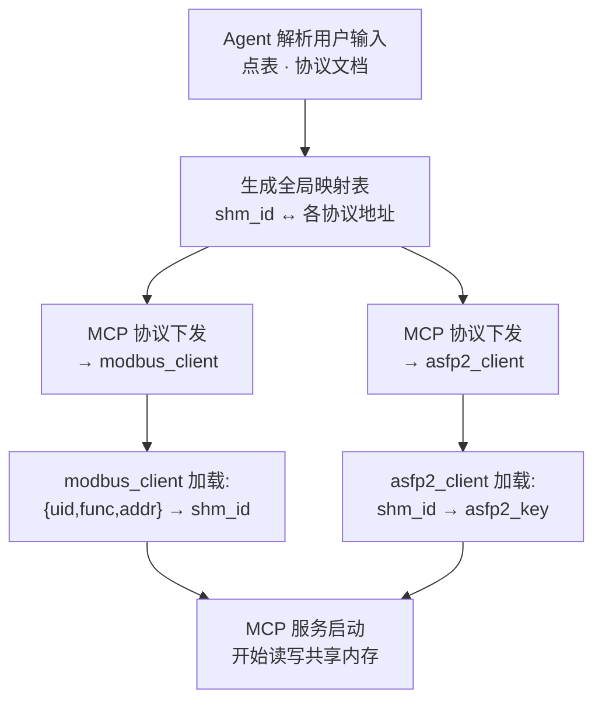

## 2.4 读写并发协议

### 2.4.1 单写多读模型

每个 shm_id **只有一个写入者**（产生数据的采集 MCP），
可有**多个读取者**（转发 MCP 或其他消费者）。

### 2.4.2 Seqlock 协议

利用 `write_seq` 的奇偶性实现无锁并发：writer 写入前后各递增一次序列号（偶数→奇数→偶数），reader 通过比较前后序列号是否一致来判断读到的是否为完整数据。

**Writer（采集 MCP）**：

```go
block := (*DataBlock)(unsafe.Pointer(shmPtr + uintptr(pointID)*32))

// 1. 校验块完整性——magic 异常则拒写
if atomic.LoadUint32(&block.magic) != MAGIC {
    logError("block %d magic invalid", pointID)
    return
}

// 2. 首次写入时激活块（state 0→1），并重置序列号为偶数起点
if block.state == 0 {
    block.state = 1
    atomic.StoreUint64(&block.write_seq, 0)  // 归零，保证偶数→奇数→偶数的 seqlock 协议
}

// 3. 获取全局序号
gseq := atomic.AddUint64(&header.global_write_seq, 1)

// 4. 递增序列号为奇数，宣告写入开始
atomic.AddUint64(&block.write_seq, 1)

// 5. 写入数据
block.timestamp = ts
memcpy(&block.value, &data, size)

// 6. 递增序列号为偶数，宣告写入完成
atomic.AddUint64(&block.write_seq, 1)
```

**Reader（转发 MCP）**：

```go
block := (*DataBlock)(unsafe.Pointer(shmPtr + uintptr(pointID)*32))

// 1. 校验块完整性
if atomic.LoadUint32(&block.magic) != MAGIC {
    logError("block %d magic invalid", pointID)
    return
}
// 2. 块未激活，跳过
if block.state == 0 {
    return
}

for {
    s1 := atomic.LoadUint64(&block.write_seq)
    if s1&1 != 0 {           // 奇数：writer 正在写，返回等待下一轮 poll
        return
    }
    // 偶数：block 处于稳定状态，安全读取
    ts := block.timestamp
    val := block.value
    s2 := atomic.LoadUint64(&block.write_seq)
    if s1 == s2 {
        // 序列号未变，读到一致数据
        if s1 > lastSeen[pointID] {
            lastSeen[pointID] = s1
            // 消费数据 ...
        }
        return
    }
    // s1 != s2：writer 在读取期间介入，重试
}
```

**设计约束：Writer 1Hz，Reader 10Hz**。Writer 每秒写入一次（采集周期），Reader 每秒轮询 10 次。
Reader 的 poll 频率 10 倍于 Writer 的写入频率，Writer 在两次 poll 之间最多写入 1 次。
Reader 触发 skip（奇数 seq）的概率 = 1/10，发生 skip 后下一轮 poll（100ms 后）必定拿到已完成的最新值。
Reader 仅在 s1≠s2 时可能重试一次（概率 < 0.001%）。

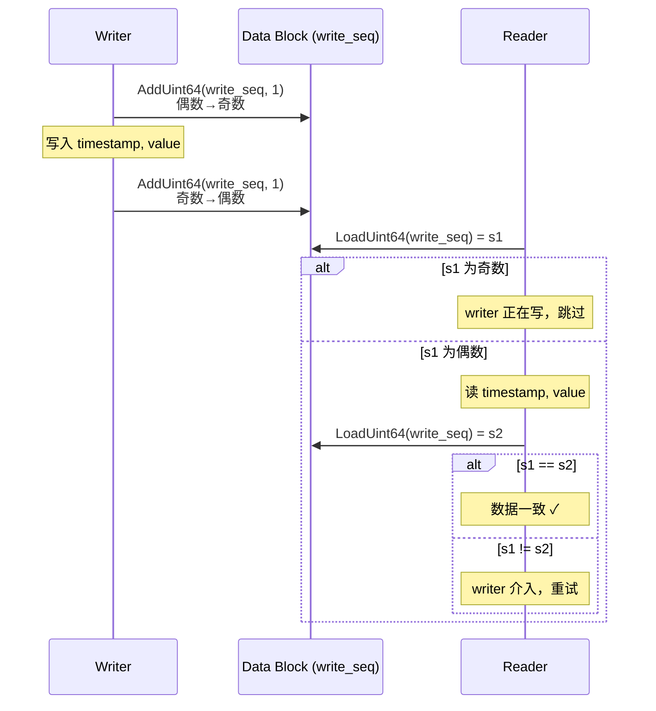

### 2.4.3 为什么选用 Seqlock

| 特性 | 说明 |
|------|------|
| **崩溃安全** | Writer 崩溃后 `write_seq` 停在奇数，reader 检测到奇数即跳过该 block。无"锁永远不释放"的状态。Agent 监控到 `write_seq` 久未更新后回收 block |
| **Writer 不被 Reader 阻塞** | Writer 只做两次 `atomic.AddUint64`，无需获取锁。Reader 从不阻碍 writer 的数据写入路径 |
| **Reader 不被 Writer 阻塞** | Reader 不获取锁，writer 写入期间 reader 跳过并重试（概率 < 0.001%，工业轮询间隔下实际永不触发） |
| **O_RDONLY 兼容** | Reader 全程只读不写，可以用 `O_RDONLY` mmap 映射。自旋锁方案要求 CAS 原子写，只读页面无法工作 |
| **无自旋等待** | 无 `CAS(0→1)` 自旋循环，CPU 指令流水线不被锁竞争打断 |

**与自旋锁方案的关键差异**：

| 维度 | 自旋锁 | Seqlock |
|------|--------|---------|
| Writer-Reader 关系 | 互斥串行 | 并行 |
| writer 崩溃后果 | lock=1 永存，block 永久死亡 | write_seq 停在奇数，reader 跳过 |
| reader 持锁崩溃 | block 同样死亡 | reader 不持锁，无影响 |
| 临界区写入延迟 | CAS(~10ns) + write(~25ns) + store(~5ns) | AddUint64(~5ns) + write(~25ns) + AddUint64(~5ns) |
| reader 只读路径 | CAS 必须写 `lock`，O_RDONLY 不可用 | 无需写操作，O_RDONLY 可用 |

### 2.4.4 write_seq 语义

`write_seq` 同时承载 seqlock 序列号和数据新鲜度判断：

- **偶数**（bit 0 = 0）：block 处于稳定态，reader 可安全读取
- **奇数**（bit 0 = 1）：writer 正在更新 block，reader 跳过
- **单调递增**：每次写入递增 2（例如 0→1→2, 2→3→4），reader 比较 `write_seq > last_seen`
- **64 位**：2^64 足以覆盖任意部署周期，无需担心溢出（100Hz 写入需 58.5 亿年）

`global_write_seq`（Global Header 中 8B）保留独立职责：跨 point 的全局顺序。
每次 writer 写入时原子递增一次（非两次），与 block 级 `write_seq` 的递增次数无关。

### 2.4.5 不变式

以下规则在正常运行中必须始终成立，是实现和测试的验证基准：

| 不变式 | 维护者 | 校验时机 |
|--------|--------|---------|
| `block.state=1` ⇒ `block.magic=0xC4DA7A00` | Writer（写 state=1 前已验证 magic） | 每次写入前 |
| 每个 block 只有一个 writer（shm_id 集合不重叠） | Agent（分配时不交叉） | 分配时 |
| block 被回收（state→0）前，writer 已停止，reader 已暂停 | Agent（Pause-Resume 协议） | 回收 Phase 3 入口 |
| `write_seq` 单调递增（每次 +2：偶数→奇数→偶数） | Writer（seqlock） | — |
| `global_write_seq` 单调递增（每次 +1） | Writer（atomic add） | — |
| 扩容 Phase 2 期间无进程读写 shm | Agent（先 pause 所有 MCP） | Phase 2 入口 |
| `point_count` = 已分配但尚未回收的 block 数 | `c4_shm_manager`（alloc/free 维护；重启时扫描 state=1 重建） | Agent 重启后 |
| `magic` 仅在创建/扩容时由 `c4_shm_manager` 写入，此后永不变 | `c4_shm_manager` | 创建/扩容时 |

## 2.5 共享内存生命周期

共享内存由 **`c4_shm_manager`** 创建并管理。`c4_shm_manager` 是每个 C4 实例默认启动
的首个 MCP 服务，它通过 MCP 协议向 Agent 暴露共享内存管理的全部能力（创建、扩容、
块分配/回收、状态查询）。Agent 不直接操作共享内存——所有 shm 操作通过
`c4_shm_manager` 提供的 MCP 工具完成。具体工具/资源定义见第三章。

### 2.5.1 创建流程

```
Agent 生成 instance_id
        │
        │ MCP 工具调用 c4_shm_manager.create_shm
        ▼
┌───────────────────────────────────────────────┐
│            c4_shm_manager（Go）                 │
│                                               │
│  shm_open("/c4_{id}", O_CREAT|O_EXCL|O_RDWR)  │
│  ftruncate(shm_size)                           │
│  mmap                                         │
│  初始化 Header（magic, version, max_points）    │
│  写入所有 Data Block 的 magic = 0xC4DA7A00      │
│  写入 Header magic = 0xC4DA7A00 （最后）          │
│  返回创建结果 → Agent                          │
└───────────────────────────────────────────────┘
        │
        │ Agent 通过 MCP 协议启动其他 MCP 服务
        ▼
┌───────────────────────────────────────────────┐
│          其他 MCP 服务启动（Go）                 │
│  shm_open("/c4_{id}", O_RDWR)   // 不传 O_CREAT│
│  mmap                                         │
│  校验 magic == 0xC4DA7A00                      │
│  开始读写共享内存                               │
└───────────────────────────────────────────────┘
```


| 操作 | 说明 |
|------|------|
| 创建 | Agent 通过 MCP 工具调用 `c4_shm_manager`，命名规则 `/c4_{instance_id}` |
| 附加 | 后续 MCP 服务以普通 `O_RDWR` 或 `O_RDONLY` 打开，校验 `magic` 后附加 |
| 大小 | 无配置文件时默认 100k 点（≈3 MB）；配置文件存在时按 §3.3.1 算法计算，Agent 可通过 MCP 工具调整 |
| 销毁 | `c4_shm_manager` 最后退出时 `shm_unlink`；进程异常退出由操作系统回收 |

### 2.5.2 扩容与块分配管理

#### 扩容机制

POSIX 共享内存支持 `ftruncate` 扩容，但 `munmap` 是进程级操作——如果扩容过程中
有其他 MCP 进程正在读写共享内存，`munmap` 会导致 SIGSEGV。为此采用
**Pause-Resume 两阶段协议**：先暂停所有 MCP 进程的数据路径，待所有临界区退出后
安全扩容，再恢复。

**两阶段扩容流程**：

```
Phase 1 - 检测与暂停：
  a. Agent 识别需要新增采集点，调用 c4_shm_manager.check_expand(new_points)
  b. c4_shm_manager 计算扩容需求：
     - 空闲块足够 → 返回 "no_expand"，跳过 Phase 2，直接分配
     - 空闲块不够 → 返回 "need_expand" + new_max_points
  c. Agent 向所有 MCP 进程下发 pause 指令
  d. 每个 MCP 进程：
     - 停止读写循环（不再进入新临界区）
     - 等待所有 in-flight 临界区自然结束（最多一个写入周期）
     - 向 Agent ack "paused"

Phase 2 - 安全扩容：
  a. Agent 确认所有 MCP 进程已暂停 → 调用 c4_shm_manager.expand(new_max)
  b. c4_shm_manager（此时无人访问 shm）：
     - ftruncate(shm_fd, new_size)
     - header.max_points = new_max
     - header.remap_version++          // 递增版本号
     - munmap + mmap 新大小
      - 新增 block 全部写入 magic = 0xC4DA7A00
  c. 返回 "expanded" 给 Agent

Phase 3 - 恢复：
  a. Agent 向所有 MCP 进程下发 resume 指令（携带 new_max_points）
  b. 每个 MCP 进程：
     - 检测 header.remap_version 与本地 local_remap_version 不一致
     - munmap + mmap 新大小
     - local_remap_version = header.remap_version
     - 重启读写循环
```

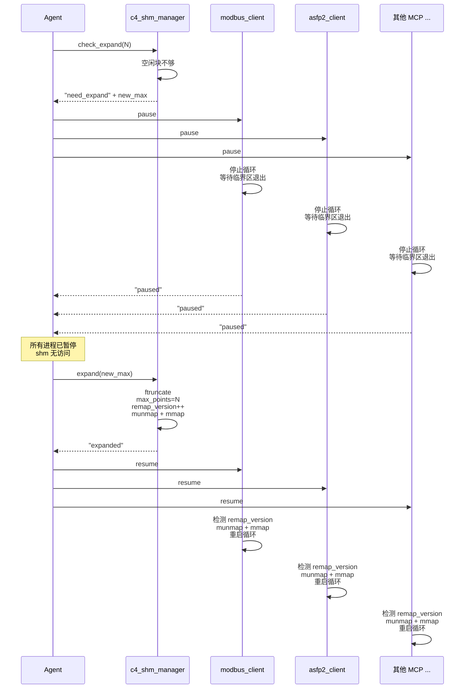

**`remap_version` 的双重角色**：

- **主路径**：Pause-Resume 协议保证扩容时无人访问 shm，`remap_version` 作为恢复阶段各进程判断"是否需要重新映射"的依据
- **降级路径**：如果某个 MCP 进程因网络抖动错过了 resume 指令，它在下次读写循环前检测到 `remap_version` 变化后自行 munmap + mmap——不依赖信号到达

**扩容开销**：扩容过程中数据断流时长 ≈ pause 收集时间（< 1ms）+ ftruncate + mmap（~100μs）+ resume 恢复（< 1ms），总计 < 5ms。扩容是低频事件（数天至数月一次），可接受。

扩容由 `c4_shm_manager` 执行（唯一拥有 `O_CREAT` 权限的进程），Agent 通过 MCP 工具
`check_expand` / `expand` 下发指令。扩容过程中 `c4_shm_manager` 将所有新增 block 的 `magic` 一次性写入 `0xC4DA7A00`，
`state` 自然为 0。已有 block 地址不变（`shm_id * 32` 与 mmap 基址重新计算后结果一致）。

#### 块分配与回收

每个 Data Block 的 `state` 字段标记占用状态。**writer 持有的不是连续区间，
而是一个 `shm_id` 集合**——寻址公式 `shm_id * 32` 与集合是否连续无关。
分配和回收均遵循**先确认数据路径静默、再修改元数据**的原则，与扩容的 Pause-Resume
模式一致。

**分配（Agent 通过 `c4_shm_manager` 执行）**：

```
1. c4_shm_manager 扫描 block[1..max_points]，收集所有 state=0 的 shm_id
2. 如果空闲块不够 → 触发扩容（走 Pause-Resume 流程），从新增块中取得
3. header.point_count 递增分配的数量
4. 返回分配的 shm_id 列表给 Agent
5. Agent 通过 MCP 协议将 shm_id 列表下发给对应 writer
6. Writer 收到 shm_id 后首次写入时自行将 state 0→1（magic 已由 shm_manager 确保有效）
```


**回收（Agent 协调，4 阶段）**：
回收发生在 writer 停止或需要减少采集点时。必须确保 write 和 read 都已停止后才修改
`state`，避免与新分配的 writer 冲突。

```
Phase 1 - 停止写入：
  Agent → writer MCP: stop [shm_ids]
  writer 停止对指定 shm_id 的写入循环 → ack
  → 此后再无新数据写入这些 block
  （若 writer 已崩溃，Agent 超时后直接进入 Phase 2——崩溃进程不会再写）

Phase 2 - 停止读取：
  Agent → 订阅这些 shm_id 的 reader MCP(s): pause [shm_ids]
  reader 等待当前临界区退出，此后跳过这些 shm_id → ack
  → 所有 block 不再被读取

Phase 3 - 安全回收：
  Agent → c4_shm_manager: block_free([shm_ids])
  c4_shm_manager: state → 0, point_count 递减
  → 无人访问，无竞态

Phase 4 - 恢复：
  通知 reader 恢复（这些 shm_id 已不在订阅列表中）
  writer 如已重启则已获得新分配的 shm_id
```


**`point_count` 的维护**：由于只有 `c4_shm_manager`（受 Agent 委托）做分配/回收操作，
`point_count` 的读写是无竞争的，无需原子操作保护。

#### Writer 替换示例

```
初始状态（max_points=100）：
  writer1: [ 1..30]  (30个, state=1)
  writer2: [31..60]  (30个, state=1)
  writer3: [61..90]  (30个, state=1)
  空闲:    [91..100] (10个, state=0)
  point_count=90

writer2 停掉 → writer4(20个) + writer5(25个) 上线：

1. 回收 writer2 的块（Pause-Resume 协议）
   Agent → writer2: stop [31..60]
   Agent → 各 reader: pause [31..60]
   Agent → c4_shm_manager: block_free([31..60])
   block[31..60]: state = 1 → 0
   point_count = 90 - 30 = 60
   Agent → 各 reader: resume

2. 分配 writer4 (20个)
   扫描空闲 → [31..50, ...] 足够
   block[31..50]: state=1
   point_count = 60 + 20 = 80
   下发：writer4.owned_points = [31,32,...,50]

3. 分配 writer5 (25个)
   剩余空闲：[51..60, 91..100] = 20个，不够
   需要 5 个新块 → 扩容 max_points=105
   block[101..105] 自然零填充，state=0
   分配 [51..60, 91..100, 101..105]
   下发：writer5.owned_points = [51,...,60, 91,...,100, 101,...,105]

最终：
  writer1:  [ 1..30]   (30个, 不变)
  writer3:  [61..90]   (30个, 不变)
  writer4:  [31..50]   (20个, 复用writer2的块)
  writer5:  [51..60]   (10个, 复用writer2的块)
  writer5:  [91..105]  (15个, 空闲+扩容)
  空闲:     []         (0个)
  point_count=105
```

关键性质：
- **shm_id 一次分配，终身不变**：寻址公式绑定物理位置，重编号会导致映射关系全乱
- **碎片可接受**：writer5 的点跨越两段（51..60, 91..105），但 `shm_id * 32` 仍是 O(1)
- **不缩容**：已分配后不再缩减共享内存，避免截断仍在使用的块。空间换简单性
- **全量离线可重建**：如果碎片严重，可在所有 writer 离线时 `shm_unlink` 后重新紧凑分配

### 2.5.3 `c4_shm_manager` 崩溃恢复

`c4_shm_manager` 崩溃后，POSIX 共享内存对象 `/c4_{id}` 仍然存在于 `/dev/shm`
（崩溃进程未调用 `shm_unlink`），其他 MCP 进程的 mmap 映射不受影响。

重启时不能走 `O_CREAT|O_EXCL` 路径——名字已被占用。流程如下：

```
c4_shm_manager 重启
        │
        │ shm_open("/c4_{id}", O_RDWR)  // 不传 O_CREAT
        │ 若失败（文件不存在或权限错误）→ shm_unlink + O_CREAT|O_EXCL 新建
        ▼
┌───────────────────────────────────────────────┐
│              附加已有共享内存                   │
│                                               │
│  mmap                                         │
│  校验 Header magic == 0xC4DA7A00              │
│  ┌─ 若 magic 无效：shm_unlink + 重建新 shm     │
│  └─ 若 magic 有效：                           │
│       扫描 block[1..max_points]               │
│         count = 0                             │
│         for i = 1..max_points:                │
│           if block[i].state == 1: count++     │
│         header.point_count = count            │
│        → 以 state=1 为唯一权威源重建 point_count│
│                                               │
│  恢复正常服务（可接受 alloc/free 请求）          │
└───────────────────────────────────────────────┘
```

关键保证：

- **其他 MCP 进程不受影响**：它们的 mmap 在 crash 期间始终有效，不会 SIGSEGV
- **`point_count` 自动修复**：扫描重建，不依赖崩溃前的内存值
- **`state=1` 是权威源**：即使崩溃发生在 alloc 后、writer 首次写入前（block 已分配但 state 仍为 0），重建后这些 block 自然为"空闲"，下次分配时回收——不浪费
- **始终复用而非重建**：重建意味着 `shm_unlink`，会导致其他进程的 mmap 失效后 SIGSEGV。只有 magic 校验失败（shm 真的损坏了）才走重建路径

## 2.6 ASFP2 协议集成

C4 使用两个独立的 MCP 服务处理 ASFP2 协议，另有 `c4_shm_manager` 管理共享内存：
- `c4_asfp2_client`：从共享内存读取数据，编码为 ASFP2 数据包后发送到中心侧或第三方
- `c4_asfp2_server`：作为服务端接收远程 ASFP2 数据，解析后写入共享内存。`c4_asfp2_server` 以 `O_RDWR` 模式打开已有共享内存（由 `c4_shm_manager` 创建），不参与共享内存的创建或销毁

### 2.6.1 ASFP2 发送（`c4_asfp2_client`）

`c4_asfp2_client` 从共享内存读取多个 point 的数据，构造 ASFP2 数据包。

```
asfp2_client 打包循环:
  1. 扫描共享内存中所有已订阅 shm_id，取出有新数据的 point
  2. 按 ASFP2 协议规范（`asfp2_specification.md`）的要求，
     检查属性开关条件（SAME_DATA_TYPE / KEY_SEQUENCE / SAME_TIMESTAMP），
     将符合条件的 point 归入同一个数据包
  3. 按 ASFP2 规范编码 Header + Mutable + Data
  4. 发送 → 返回步骤 1
```

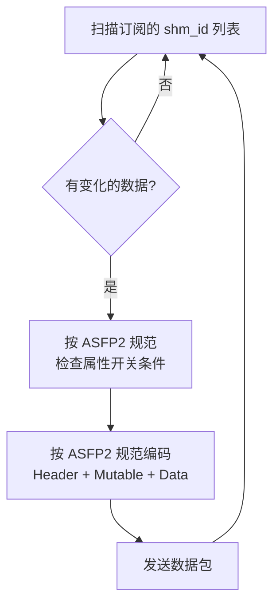

### 2.6.2 shm_id 到 asfp2_key 的映射（发送端）

```json
// c4_asfp2_client 从 Agent 接收的配置
{
  "subscriptions": [
    {"shm_id": 1,   "asfp2_key": 100},
    {"shm_id": 2,   "asfp2_key": 101},
    {"shm_id": 100, "asfp2_key": 200}
  ]
}
```

`c4_asfp2_client` 维护 `shm_id → asfp2_key` 的本地索引，
打包时遍历索引表，从共享内存读取最新值，按 ASFP2 规范编码。

### 2.6.3 ASFP2 接收（`c4_asfp2_server`）

`c4_asfp2_server` 以 O_RDWR 模式附加已有共享内存，作为 ASFP2 服务端监听连接。
收到远程 C4 实例或兼容系统的 ASFP2 数据包后，解析并按 `asfp2_key → shm_id`
的反向映射写入对应的 shm_id 记录，供本地其他 MCP 服务消费。
接收端的 point 映射由 Agent 配置下发，其 JSON 结构与发送端相反：
`{"asfp2_key": 100, "shm_id": 1}`。

## 2.7 错误处理与故障恢复

| 场景 | 处理方式 |
|------|---------|
| Writer（采集 MCP）崩溃 | `write_seq` 停在奇数（seqlock 特征），reader 检测到奇数后跳过该 block；Agent 监控到 `write_seq` 久未更新 → 回收并重启 |
| Reader（转发 MCP）崩溃 | Writer 不受影响（Seqlock 中 writer 不等待 reader）；Agent 监控 reader 心跳 → 自动重启 |
| 共享内存损坏 | Header 或 Data Block 的 `magic` 校验失败 → Agent 重建共享内存并重新下发配置 |
| 内存不足 | Agent 检测 `point_count ≥ max_points` → 触发扩容或拒绝新增 point |
| 跨进程时间同步 | 所有 MCP 进程使用 Unix 纪元毫秒作为统一的时间戳格式；数据新鲜度由 `write_seq` 单调计数器保证，与时间源无关 |

## 2.8 性能考量

| 考量 | 设计选择 |
|------|---------|
| Cache line | Data Block 32B/条目，正好半条 cache line（64B），元数据+数据一次访问到位，无跨块 false sharing |
| 读写并发 | Seqlock 协议——writer/reader 并行不互斥，reader 仅在 writer 写入的 ~35ns 窗口内可能重试一次（概率可忽略） |
| 内存占用 | 32B/point；50 万 point ≈ 16MB（含 Header） |
| 写入延迟 | AddUint64(~5ns) + memcpy(~20ns) + AddUint64(~5ns)，总 ~30ns |
| 读取延迟（无竞争） | LoadUint64(~5ns) + memcpy(~20ns) + LoadUint64(~5ns)，总 ~30ns |
| 崩溃安全 | Seqlock 无锁设计——writer 崩溃只留奇数 seq，reader 跳过；无"锁永远不释放"风险 |

## 2.9 备选方案讨论

| 方案 | 优点 | 缺点 | 结论 |
|------|------|------|------|
| 共享内存（本方案） | 零拷贝、纳秒级延迟 | 单机限制、需处理并发 | ✅ 选用 |
| Unix Domain Socket | 跨网络、协议灵活 | 数据拷贝、微秒级延迟 | 备选（跨容器场景） |
| Redis/MQ | 解耦、持久化 | 网络开销大、引入外部依赖 | 不适合实时数据路径 |
| 管道/FIFO | 简单 | 单向、无随机访问 | 不适用 |

---

# 第三章 Agent 和 MCP 接口规范

Agent（TypeScript）与 MCP Server（Go）的交互分为两部分：**运行时 MCP 工具调用**（Agent 通过 MCP 协议操作 MCP Server）和**启动配置下发**（Agent 写入配置文件后启动各 MCP Server。`/etc/c4/config.json` 仅为示例路径，实际路径和文件名可通过 roots/list 配置）。各 MCP 工具的签名、参数 schema、MCP 应答格式及错误码详见 §3.3.2~§3.3.5。

---

## 3.1 Agent ↔ MCP Server 交互模型

```
┌─────────────────────────────────────────────────────────────────┐
│                        Agent (TypeScript)                        │
│                                                                 │
│   ┌─────────────┐  ┌──────────────┐  ┌───────────────────┐     │
│   │ 配置生成器   │  │ 运行时 MCP   │  │ 状态监控          │     │
│   │ (写 config)  │  │ 工具调用     │  │ (MCP Resource)    │     │
│   └──────┬──────┘  └──────┬───────┘  └────────┬──────────┘     │
│          │                │                    │                │
└──────────┼────────────────┼────────────────────┼────────────────┘
           │                │                    │
           ▼                ▼                    ▼
    config.json (示例路径)  MCP 协议             MCP 协议
           │            (stdio/SSE)           (stdio/SSE)
           │                │                    │
           ▼                ▼                    ▼
    ┌──────────┐   ┌──────────┐   ┌──────────┐   ┌──────────┐
    │c4_shm    │   │c4_modbus │   │c4_iec104 │   │c4_asfp2  │  ...
    │_manager  │   │_client   │   │_client   │   │_client   │
    │  (Go)    │   │  (Go)    │   │  (Go)    │   │  (Go)    │
    └──────────┘   └──────────┘   └──────────┘   └──────────┘
```

### 交互流程

```
启动阶段：
  1. Agent 生成配置文件（写入所有 MCP Server 的配置。`/etc/c4/config.json` 仅为示例路径）
  2. Agent 启动 c4_shm_manager（首个服务）
  3. Agent 通过 c4_shm_manager 的 MCP 工具创建共享内存
  4. Agent 按 config.json 逐项启动各 MCP Server
  5. 各 MCP Server 启动后读取 config.json 中自己的配置段，附加共享内存，开始工作

运行阶段：
  6. Agent 通过 MCP 工具监控各 MCP Server 状态（心跳、数据统计）
  7. 用户要求新增采集点 → Agent 调用 c4_shm_manager 分配 shm_id
      → 更新 config.json 中对应 MCP Server 的 points 列表
      → 通过 MCP 工具热更新配置或重启对应 MCP Server

停止/回收阶段：
  8. Agent 通过 MCP 工具执行 Pause-Resume 协议，回收不再使用的 shm_id
  9. Agent 更新 config.json 并通知 MCP Server
```

---

## 3.2 配置文件（示例：/etc/c4/config.json）

配置文件是 Agent 启动各 MCP Server 的入口。路径和文件名可通过 `roots/list` 配置，以下以 `/etc/c4/config.json` 为例说明。每个 MCP Server 启动时读取
文件中同名的顶层 key 对应的配置数组（支持多实例）。Agent 负责生成和维护此文件。

### 3.2.1 通用结构

```json
{
    "c4_shm_manager":      { ... },            // Writer/Reader 分类声明
    "c4_modbus_client":     [ {...}, {...} ],   // Modbus 采集实例列表
    "c4_iec104_client":     [ {...}, {...} ],   // IEC104 采集实例列表
    "c4_asfp2_client":      [ {...}, {...} ],   // ASFP2 转发实例列表
    "c4_asfp2_server":      [ {...} ],          // ASFP2 接收实例列表
    "c4_influxdb_client":   [ {...} ]           // InfluxDB 入库实例列表
}
```

每个顶层 key 对应一个 MCP Server 类型，值为该类型实例的配置数组。不同实例按数组顺序启动。

### 3.2.2 c4_modbus_client 配置

每个元素代表一个 Modbus TCP 设备连接。

| 字段 | 类型 | 说明 |
|------|------|------|
| `name` | string | 实例名称，用于日志和监控标识 |
| `id` | string | 实例标识符，全局唯一。与 point.id 组合形成 `{service_id}.{point_id}` 的全局 key |
| `ip` | string | Modbus TCP 设备 IP 地址 |
| `port` | int | Modbus TCP 端口，标准 502 |
| `hton_register` | int | Register 值是否做网络序转换：1=转换, 0=不转换 |
| `hton_total` | int | 保留 |
| `t0` | int | 连接超时（秒） |
| `t1` | int | 请求超时（秒） |
| `retries` | int | 最大重试次数 |
| `coils_quantity_max` | int | 单次请求最大 Coil 数量 |
| `registers_quantity_max` | int | 单次请求最大 Register 数量 |
| `timer` | int | 采集周期（毫秒），决定写入共享内存的频率。设计约束 **1Hz（timer=1000）** |

**points 数组元素**（参见 `docs/C4.docx` §19.29）：

| 字段 | 类型 | 含义 |
|------|------|------|
| `id` | string | 采集点标识符。`{service_id}.{point_id}` 构成全局唯一 key，供 Reader 端通过 `key` 字段引用 |
| `uid` | integer | 单元标识符（设备地址） |
| `addr` | integer | Modbus 地址 |
| `fun` | integer | Modbus 功能码 |
| `type` | integer | 数据的类型（ASFP2_TYPE_* 枚举值，见 §2.2.3） |
| `swap` | integer | 交换的数据单元的字节数 |
| `shm_id` | integer | 全局 shm_id，默认 0（未分配），由 `c4_shm_manager` 分配后回填 |

### 3.2.3 c4_iec104_client 配置

每个元素代表一个 IEC 60870-5-104 设备连接。

| 字段 | 类型 | 说明 |
|------|------|------|
| `name` | string | 实例名称 |
| `id` | string | 实例标识符，全局唯一。与 point.id 组合形成 `{service_id}.{point_id}` 的全局 key |
| `ip` | string | RTU/远动装置 IP 地址 |
| `port` | int | IEC104 TCP 端口，标准 2404 |
| `k` | int | 发送窗口大小（未确认 I 格式 APDU 最大数） |
| `w` | int | 接收窗口大小（最新确认的接收序号之后的最大 I 格式数） |
| `t0` | int | 连接超时（秒） |
| `t1` | int | 发送超时（秒） |
| `t2` | int | 接收超时（秒） |
| `t3` | int | 空闲超时（秒），超时后发送 TEST FR |
| `modules` | int | 支持的遥测/遥信/遥脉等模块数量 |
| `common_address` | int | 公共地址（CASDU） |
| `discard_cp56time2a` | int | 忽略 CP56Time2a 时间戳：1=忽略, 0=使用 |
| `ignore_qds` | int | 忽略品质描述字：1=忽略, 0=使用 |
| `it_timer` | int | 对时周期（毫秒） |
| `gi_timer` | int | 总召周期（毫秒） |

**points 数组元素**（参见 `docs/C4.docx` §19.11）：

| 字段 | 类型 | 含义 |
|------|------|------|
| `id` | string | 采集点标识符。`{service_id}.{point_id}` 构成全局唯一 key |
| `addr` | integer | 104 地址（信息体地址 IOA） |
| `shm_id` | integer | 全局 shm_id，默认 0（未分配），由 `c4_shm_manager` 分配后回填 |

### 3.2.4 c4_asfp2_client 配置

每个元素代表一个 ASFP2 数据转发目标。

| 字段 | 类型 | 说明 |
|------|------|------|
| `name` | string | 转发实例名称 |
| `ip` | string | 目标服务器 IP |
| `port` | int | ASFP2 服务端口 |
| `t0` | int | 连接超时（秒） |
| `t1` | int | 心跳发送间隔（秒） |
| `t2` | int | 心跳应答超时（秒） |
| `key_sequence` | int | ASFP2_ATTRIBUTE_KEY_SEQUENCE 开关：1=key 连续, 0=不连续 |
| `same_data_type` | int | ASFP2_ATTRIBUTE_SAME_DATA_TYPE 开关：1=同类型, 0=不同类型 |
| `same_timestamp` | int | ASFP2_ATTRIBUTE_SAME_TIMESTAMP 开关：1=同时间戳, 0=不同时间戳 |
| `smart` | int | 时间戳毫秒归零：1=归零（提高压缩率）, 0=保留毫秒精度 |
| `forward_kack` | int | 正向 KeepAlive Ack 字节值（典型 255） |
| `inverse_keep` | int | 反向 KeepAlive 字节值（典型 0） |
| `timer` | int | 转发周期（毫秒）。Reader 以 10 倍频率轮询（设计约束 **Reader=10Hz**，即此值 ≤ 100） |

**points 数组元素**（参见 `docs/C4.docx` §19.24）：

| 字段 | 类型 | 含义 |
|------|------|------|
| `key` | string | 引用的 Writer 采集点标识，格式为 `{service_id}.{point_id}`（如 `hnals_1_scada.windspeed`）。`c4_shm_manager` 根据此 key 填入与 Writer 端相同的 shm_id |
| `addr` | integer | ASFP2 地址（协议中的 key） |
| `valid` | integer | ASFP2 倍率和偏移量开关 |
| `coeff` | real | ASFP2 数值倍率（raw × coeff + base） |
| `base` | real | ASFP2 数值偏移量 |
| `shm_id` | integer | 全局 shm_id，默认 0（未分配），由 `c4_shm_manager` 通过 key 匹配 Writer 后填入 |

### 3.2.5 c4_shm_manager 与 Writer/Reader 分类

`c4_shm_manager` 配置段由 Agent 在生成配置文件时写入。`writer` 和 `reader` 数组
列出哪些 MCP Server 类型为 Writer 或 Reader——这些信息来源于各 MCP Server 注册到
Agent 时携带的角色属性。

```json
{
    "c4_shm_manager": {
        "writer": ["c4_modbus_client", "c4_iec104_client", "c4_asfp2_server"],
        "reader": ["c4_asfp2_client", "c4_influxdb_client"]
    }
}
```

Writer 需要分配 shm_id（向共享内存写入数据），Reader 引用已分配的 shm_id
（从共享内存读取数据）。`instance_id` 由 Agent 通过 MCP 工具调用时传入。

`c4_asfp2_server` 的配置结构（IP、端口、ASFP2 属性开关、反向 keep-alive 等）
与 `c4_asfp2_client` 对称但无 points 列表（接收端按 `asfp2_key → shm_id` 反向映射写入）。

### 3.2.6 完整配置示例

以下是一个完整的配置示例（`/etc/c4/config.json` 仅为示例路径），包含 Modbus 采集（2 个风机 SCADA）、
IEC104 采集（2 个主变 RTU）和 ASFP2 转发（到中心侧数据库和第三方）三种 MCP Server
的多实例配置。各选项含义参见 `docs/C4.docx` 第 19 章。

```json
{
    "c4_shm_manager": {
        "writer": ["c4_modbus_client", "c4_iec104_client", "c4_asfp2_server"],
        "reader": ["c4_asfp2_client", "c4_influxdb_client"]
    },
    "c4_modbus_client": [
        {
            "name": "华能阿拉善1#风机SCADA服务",
            "id": "hnals_1_scada",
            "ip": "192.168.110.1",
            "port": 502,
            "hton_register": 1,
            "hton_total": 0,
            "t0": 30,
            "t1": 10,
            "retries": 10,
            "coils_quantity_max": 2000,
            "registers_quantity_max": 125,
            "timer": 1000,
            "points": [
                {"id": "windspeed", "uid": 1, "addr": 1000, "fun": 3, "type": 10, "swap": 2, "shm_id": 1},
                {"id": "temperature", "uid": 1, "addr": 1002, "fun": 3, "type": 10, "swap": 2, "shm_id": 2}
            ]
        },
        {
            "name": "华能阿拉善2#风机SCADA服务",
            "id": "hnals_2_scada",
            "ip": "192.168.110.2",
            "port": 502,
            "hton_register": 1,
            "hton_total": 0,
            "t0": 30,
            "t1": 10,
            "retries": 10,
            "coils_quantity_max": 2000,
            "registers_quantity_max": 125,
            "timer": 1000,
            "points": [
                {"id": "windspeed", "uid": 1, "addr": 1000, "fun": 3, "type": 10, "swap": 2, "shm_id": 3},
                {"id": "temperature", "uid": 1, "addr": 1002, "fun": 3, "type": 10, "swap": 2, "shm_id": 4}
            ]
        }
    ],
    "c4_iec104_client": [
        {
            "name": "华能阿拉善1#主变",
            "id": "hnals_1_transformer",
            "ip": "192.168.110.99",
            "port": 2404,
            "k": 12,
            "w": 8,
            "t0": 30,
            "t1": 15,
            "t2": 10,
            "t3": 20,
            "modules": 32768,
            "common_address": 1,
            "discard_cp56time2a": 0,
            "ignore_qds": 0,
            "it_timer": 1000,
            "gi_timer": 1000,
            "points": [
                {"id": "uab", "addr": 16385, "shm_id": 5},
                {"id": "ubc", "addr": 16386, "shm_id": 6},
                {"id": "uac", "addr": 25601, "shm_id": 7}
            ]
        },
        {
            "name": "华能阿拉善2#主变",
            "id": "hnals_2_transformer",
            "ip": "192.168.110.199",
            "port": 2404,
            "k": 12,
            "w": 8,
            "t0": 30,
            "t1": 15,
            "t2": 10,
            "t3": 20,
            "modules": 32768,
            "common_address": 1,
            "discard_cp56time2a": 0,
            "ignore_qds": 0,
            "it_timer": 1000,
            "gi_timer": 1000,
            "points": [
                {"id": "alarm1", "addr": 1, "shm_id": 8},
                {"id": "alarm2", "addr": 2, "shm_id": 9},
                {"id": "alarm3", "addr": 3, "shm_id": 10}
            ]
        }
    ],
    "c4_asfp2_client": [
        {
            "name": "转发到中心测数据库服务器",
            "ip": "172.16.109.11",
            "port": 9999,
            "t0": 30,
            "t1": 20,
            "t2": 10,
            "key_sequence": 1,
            "same_data_type": 1,
            "same_timestamp": 1,
            "smart": 1,
            "forward_kack": 255,
            "inverse_keep": 0,
            "timer": 100,
            "points": [
                {"key": "hnals_1_scada.windspeed", "addr": 1000, "shm_id": 1, "valid": 1, "coeff": 0.38, "base": 0},
                {"key": "hnals_1_scada.temperature", "addr": 1001, "shm_id": 2, "valid": 1, "coeff": 0.38, "base": 0},
                {"key": "hnals_2_scada.windspeed", "addr": 1002, "shm_id": 3, "valid": 1, "coeff": 1, "base": 0},
                {"key": "hnals_2_scada.temperature", "addr": 1003, "shm_id": 4, "valid": 1, "coeff": 1, "base": 0}
            ]
        },
        {
            "name": "转发到第三方数据服务器",
            "ip": "172.16.109.13",
            "port": 9999,
            "t0": 30,
            "t1": 20,
            "t2": 10,
            "key_sequence": 1,
            "same_data_type": 1,
            "same_timestamp": 1,
            "smart": 1,
            "forward_kack": 255,
            "inverse_keep": 0,
            "timer": 100,
            "points": [
                {"key": "hnals_2_scada.windspeed", "addr": 8002, "shm_id": 3, "valid": 1, "coeff": 1, "base": 0},
                {"key": "hnals_2_scada.temperature", "addr": 8003, "shm_id": 4, "valid": 1, "coeff": 1, "base": 0}
            ]
        }
    ]
}
```

### 3.2.6 完整配置示例（见上文）

---

## 3.3 共享内存管理

Agent 与 `c4_shm_manager` 的交互遵循 MCP 标准协议。启动 `c4_shm_manager` 并创建共享内存的
完整流程如下：

```
1. Agent 启动 c4_shm_manager 进程
2. Agent 使用 MCP 协议初始化 c4_shm_manager，获得工具列表
   （Agent 须在 initialize 中声明 roots 能力，否则 c4_shm_manager 无法发送 roots/list 请求）
3. Agent 调用 c4_shm_manager 的 create_shm 工具（传入 instance_id）
4. c4_shm_manager 向 Agent 发送 roots/list 请求（MCP 协议中 server→client 的根目录查询）
   → Agent 返回配置文件的绝对路径 URI（含文件名）。文件名和路径可配置，例如
   `/etc/c4/shm.json` 或 `~/.local/c4/shared_memory.json`
5. c4_shm_manager 根据配置文件是否存在决定共享内存大小：
   - **配置文件不存在或为 null**（roots/list 返回空、文件路径不存在、或文件内容为空 JSON）：
     创建默认 10 万点共享内存空间（max_points = 100000，point_count = 0），
     所有 Data Block 初始化为 magic=0xC4DA7A00、state=0，
     此时无 Writer/Reader 配置，不涉及 shm_id 分配和配置回填
   - **配置文件存在**：
     读取并解析配置文件，若 c4_shm_manager.writer 为空则报错拒绝创建，
     否则按 §3.3.1 算法计算所需大小，创建并初始化共享内存空间，
     分配 shm_id 并回填配置文件
6. c4_shm_manager 向 Agent 返回 create_shm 的调用结果
```

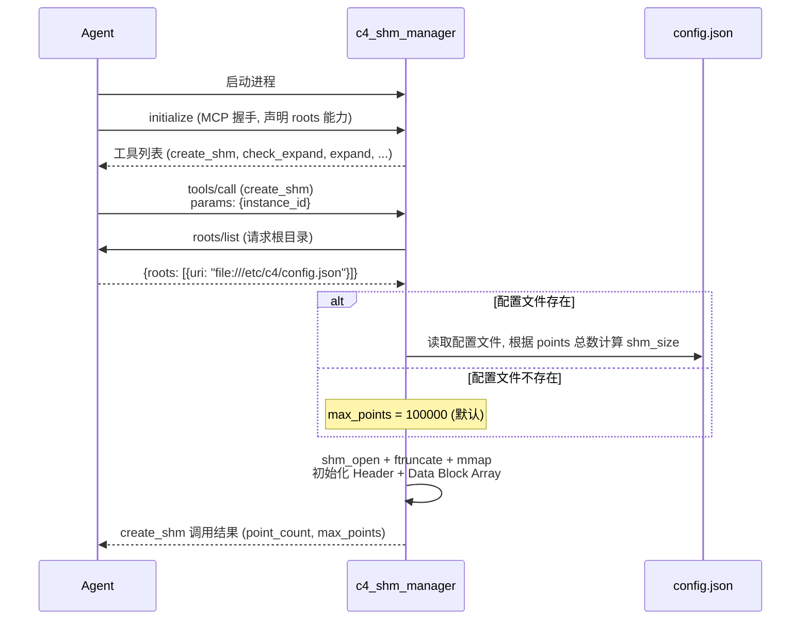

### 3.3.1 配置文件解析与 shm_id 分配算法

Agent 生成的配置文件（以 §3.2.6 为例）中，各 MCP Server 的 `points` 数组中 `shm_id`
均默认为 0（表示尚未分配）。`c4_shm_manager` 在读取配置文件后，按以下算法计算所需空间
并分配全局唯一的 shm_id。

**MCP Server 分类**：

| 角色 | MCP Server | 说明 |
|------|-----------|------|
| **Writer** | `c4_modbus_client`、`c4_iec104_client`、`c4_asfp2_server` | 向共享内存写入数据。其中 `c4_asfp2_server` 无 points 列表（接收端按反向映射动态分配），静态分配时贡献 0 点 |
| **Reader** | `c4_asfp2_client`、`c4_influxdb_client` | 从共享内存读取数据 |

**算法**：

`c4_shm_manager` 根据配置文件中的 `c4_shm_manager.writer` 字段识别哪些 MCP Server 类型
需要分配 shm_id。该字段由 Agent 生成，数据来源于各 MCP Server 注册时声明的角色属性。

> **前置条件**：以下算法仅在配置文件存在且非空时执行。若配置文件不存在、为 null、
> 或文件内容为空 JSON，c4_shm_manager 创建默认 10 万点共享内存空间（max_points = 100000, point_count = 0），
> 不涉及 shm_id 分配和配置回填。

Writer 端通过 `{service_id}.{point_id}` 组合形成全局唯一 key（如 `hnals_1_scada.windspeed`），
Reader 端通过 `key` 字段引用同一 key。`c4_shm_manager` 据此为同一 data flow 的双方分配相同 shm_id。

```
1. 解析配置文件，读取 c4_shm_manager.writer 和 c4_shm_manager.reader 分类
   ┌ 若 c4_shm_manager 段缺失或 writer 为空或 reader 为空 → 报错，拒绝创建
   └ 若分类正常 → 继续
2. 遍历 writer 中列出的每个 MCP Server 类型，统计其 points 数组长度
   → writer_points = Σ 各 Writer 的 points.length
3. 计算共享内存容量：
   max_points = writer_points × 2   // 2 倍余量，供后续扩容
   shm_size = (max_points + 1) × 32  // +1 为 Header
4. 创建并初始化共享内存（shm_open → ftruncate → mmap → 初始化 Header + Data Block）
5. 为每个 Writer point 分配全局 shm_id（从 1 开始连续递增）：
   for each Writer 实例：
     for each entry in points：
       pid = next_id++
       key = "{service_id}.{point_id}"   // point_id 为 point 的 id 字段，如 "windspeed"
       ┌ 若 key 已存在 → 报错（key 冲突，存在重复的 service_id 或 point_id），拒绝创建
       └ 若 key 唯一 → 记录 key → pid 映射
   → 如 `hnals_1_scada.windspeed → 1`, `hnals_1_scada.temperature → 2`, ...
6. 回填 Reader 的 shm_id：
   遍历 reader 中列出的每个 MCP Server 类型，对每个 point entry：
     根据 entry.key 查找步骤 5 记录的 key → pid 映射
     ┌ 若找到映射 → 填入对应的 pid
     └ 若未找到 → 报错（Reader 引用了不存在的 Writer key），拒绝创建共享内存
     （同一 key 可出现在多个 Reader 中，实现一对多数据流）
7. 返回 create_shm 调用结果：{point_count, max_points, 分配后的配置文件}
   （c4_shm_manager 将回填后的配置文件写入磁盘）
```

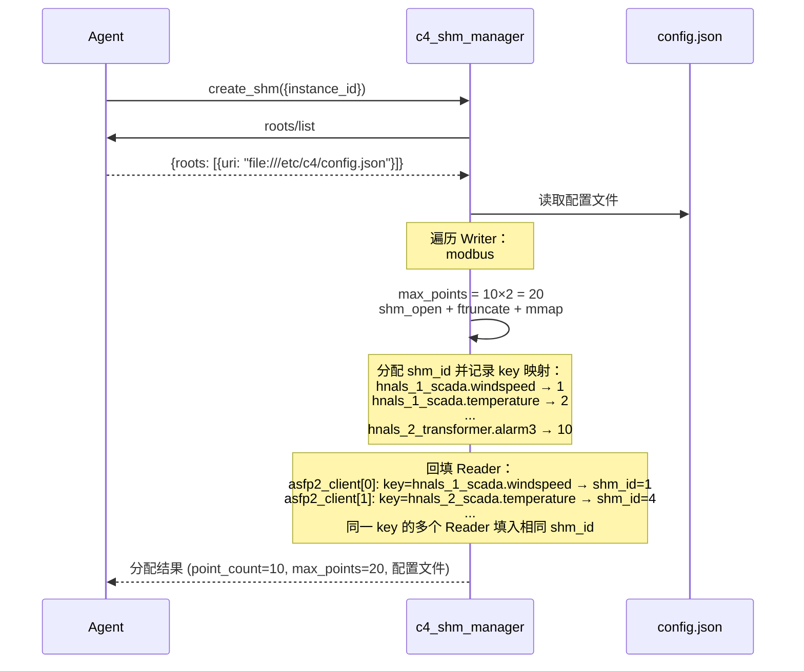

**关键性质**：

- **Reader 不参与 shm_id 分配**：Reader 的 `shm_id` 引用 Writer 已分配的值，由 Agent 在 mapping 阶段填入
- **2 倍余量**：50% 的 point 直接在空闲区（state=0），后续新增采集点时若余量足够则无需扩容
- **连续递增**：简化寻址，避免碎片化管理
- **shm_id 从 1 开始**：shm_id=0 表示尚未分配，配置中默认为 0，由 `c4_shm_manager` 分配后回填为 ≥1 的实际值
- **key 解耦位置依赖**：Writer 通过 `{service_id}.{point_id}` 生成全局唯一 key，Reader 通过 `key` 引用。增删条目不影响已有 key 的映射关系
- **一对多数据流**：同一 key 可出现在多个 Reader 中，`c4_shm_manager` 为其填入相同的 shm_id，实现一份数据多路消费

### 3.3.2 c4_shm_manager MCP 工具定义

`c4_shm_manager` 通过 MCP 协议向 Agent 暴露以下工具（命名规范：`verb_noun`）。
所有参数和返回值均使用 JSON 格式，schema 遵循 JSON Schema Draft 2020-12。

**MCP 错误约定**：
- **协议层错误**（tool 不存在、参数 schema 不匹配、JSON 解析失败）→ JSON-RPC `error` 对象，code 为 `-32601` / `-32602` / `-32700`，由 MCP 框架/传输层直接返回
- **业务层错误**（tool 成功路由到 handler，但业务逻辑执行失败）→ `result.isError: true`，`content[0].text` 以 `ERROR_TYPE:` 前缀开头

> 示例：参数缺失 `instance_id` → JSON-RPC `{"error": {"code": -32602, "message": "Invalid params: missing required field 'instance_id'"}}`；
> 共享内存已存在 → `{"result": {"content": [{"type": "text", "text": "SHM_ALREADY_EXISTS: ..."}], "isError": true}}`。

---

#### Tool: `create_shm`

创建共享内存，按 §3.3.1 算法解析配置文件、分配 shm_id 并初始化共享内存。

**触发条件**：`c4_shm_manager` 首次启动后、Agent 准备启动其他 MCP 服务前调用。

**参数**：

```json
{
    "name": "create_shm",
    "description": "创建 POSIX 共享内存，解析配置文件并按 key 分配全局 shm_id",
    "inputSchema": {
        "type": "object",
        "properties": {
            "instance_id": {
                "type": "string",
                "description": "C4 实例标识符。共享内存命名为 /c4_{instance_id}"
            }
        },
        "required": ["instance_id"]
    }
}
```

**内部流程**：

1. 向 Agent 发送 `roots/list` 请求，获取配置文件绝对路径 URI
2. 若配置文件不存在或为 null（roots/list 返回空、路径无效、或文件内容为空 JSON）：
   a. `shm_open("/c4_{instance_id}", O_CREAT|O_EXCL|O_RDWR)` → `ftruncate` → `mmap`
   b. Header 字段：`magic = 0xC4DA7A00`、`version = 1`、`max_points = 100000`、`point_count = 0`；
      其余字段（`remap_version`、`global_write_seq`、`reserved`）保持 `ftruncate` 零填充后的默认值 `0`（参见 §2.2.1 初始化规则）
   c. 初始化所有 Data Block 的 `magic = 0xC4DA7A00`（state 自然为 0）
   d. 写入 Header `magic = 0xC4DA7A00`（最终提交）
   e. 跳至步骤 6（不涉及 shm_id 分配和配置回填）
3. 若配置文件存在：
   a. 读取配置文件，按 §3.3.1 算法分配 shm_id 并回填到各 MCP Server 的 `points` 数组
      ┌ 若 `c4_shm_manager.writer` 或 `c4_shm_manager.reader` 为空 → 返回 `CONFIG_MISSING_SECTION` 错误
      └ 若正常 → 继续
   b. `shm_open("/c4_{instance_id}", O_CREAT|O_EXCL|O_RDWR)` → `ftruncate` → `mmap`
   c. 初始化所有 Data Block 的 `magic = 0xC4DA7A00`（state 自然为 0）
   d. 写入 Header `magic = 0xC4DA7A00`
   e. 将回填 shm_id 后的配置文件写回磁盘
4. 返回结果给 Agent

**返回值**：成功时返回 `"success"`。
`point_count = 0`、`max_points = 100000` 表示以默认模式创建（配置文件不存在）。

**MCP 应答示例**：

```json
// ========== 成功：配置文件存在，按算法创建 ==========
// --> 请求
{"jsonrpc": "2.0", "id": 1, "method": "tools/call", "params": {"name": "create_shm", "arguments": {"instance_id": "hnals_farm_01"}}}
// <-- 应答
{"jsonrpc": "2.0", "id": 1, "result": {"content": [{"type": "text", "text": "success"}], "isError": false}}

// ========== 成功：配置文件不存在，默认 10 万点 ==========
// --> 请求
{"jsonrpc": "2.0", "id": 1, "method": "tools/call", "params": {"name": "create_shm", "arguments": {"instance_id": "hnals_farm_01"}}}
// <-- 应答
{"jsonrpc": "2.0", "id": 1, "result": {"content": [{"type": "text", "text": "success"}], "isError": false}}

// ========== 业务错误：共享内存已存在 ==========
// <-- 应答
{"jsonrpc": "2.0", "id": 1, "result": {"content": [{"type": "text", "text": "SHM_ALREADY_EXISTS: /c4_hnals_farm_01 is already created"}], "isError": true}}

// ========== 业务错误：c4_shm_manager 配置段缺少 writer ==========
// <-- 应答
{"jsonrpc": "2.0", "id": 1, "result": {"content": [{"type": "text", "text": "CONFIG_MISSING_SECTION: 'c4_shm_manager.writer' or 'c4_shm_manager.reader' not found or empty in config"}], "isError": true}}

// ========== 业务错误：Writer 端 key 冲突 ==========
// <-- 应答
{"jsonrpc": "2.0", "id": 1, "result": {"content": [{"type": "text", "text": "DUPLICATE_KEY: key 'hnals_1_scada.windspeed' already assigned to shm_id=1, duplicate found in c4_modbus_client[1]"}], "isError": true}}

// ========== 业务错误：Reader key 不存在 ==========
// <-- 应答
{"jsonrpc": "2.0", "id": 1, "result": {"content": [{"type": "text", "text": "UNKNOWN_READER_KEY: reader 'c4_asfp2_client[0].points[3].key' = 'unknown_scada.windspeed' not found in any writer"}], "isError": true}}

// ========== 业务错误：roots/list MCP 调用失败 ==========
// <-- 应答
{"jsonrpc": "2.0", "id": 1, "result": {"content": [{"type": "text", "text": "CONFIG_PATH_MISSING: roots/list protocol call failed, Agent may not be responding"}], "isError": true}}

// ========== 业务错误：系统调用失败 ==========
// <-- 应答
{"jsonrpc": "2.0", "id": 1, "result": {"content": [{"type": "text", "text": "SHM_SYSCALL_FAILED: ftruncate failed - ENOSPC (No space left on device)"}], "isError": true}}

// ========== 协议层错误：参数缺失 ==========
// <-- 应答
{"jsonrpc": "2.0", "id": 1, "error": {"code": -32602, "message": "Invalid params: missing required field 'instance_id'"}}
```

---

#### Tool: `check_expand`

检查当前共享内存的空闲块是否足够容纳新增 point 数量。
若不够，返回需要的 `new_max_points` 供 `expand` 工具使用。

**触发条件**：Agent 计划新增采集点（如新增 Modbus 设备、IEC104 测点），或
`c4_asfp2_server` 收到新数据源需要 `block_alloc` 时。

**参数**：

```json
{
    "name": "check_expand",
    "description": "检查共享内存空闲块是否足够容纳 new_points 个新 point，不够则返回扩容建议",
    "inputSchema": {
        "type": "object",
        "properties": {
            "new_points": {
                "type": "integer",
                "minimum": 1,
                "description": "计划新增的 point 数量"
            }
        },
        "required": ["new_points"]
    }
}
```

**返回值**：

| 字段 | 类型 | 说明 |
|------|------|------|
| `action` | string | `"no_expand"`（空闲块足够）或 `"need_expand"`（需要扩容） |
| `free_blocks` | integer | 当前空闲块数量 |
| `required` | integer | 需要的总块数（含当前活跃块 + new_points） |
| `current_max_points` | integer | 当前共享内存最大容量 |
| `new_max_points` | integer | 建议扩容到的最大容量（仅 action=need_expand 时返回） |

**MCP 应答示例**：

```json
// ========== 成功：无需扩容 ==========
// --> 请求
{"jsonrpc": "2.0", "id": 2, "method": "tools/call", "params": {"name": "check_expand", "arguments": {"new_points": 3}}}
// <-- 应答
{"jsonrpc": "2.0", "id": 2, "result": {"content": [{"type": "text", "text": "{\"action\":\"no_expand\",\"free_blocks\":8,\"required\":12,\"current_max_points\":20}"}], "isError": false}}

// ========== 成功：需要扩容 ==========
// <-- 应答
{"jsonrpc": "2.0", "id": 2, "result": {"content": [{"type": "text", "text": "{\"action\":\"need_expand\",\"free_blocks\":2,\"required\":15,\"current_max_points\":20,\"new_max_points\":32}"}], "isError": false}}

// ========== 业务错误：共享内存未创建 ==========
// <-- 应答
{"jsonrpc": "2.0", "id": 2, "result": {"content": [{"type": "text", "text": "SHM_NOT_CREATED: shared memory not initialized, call create_shm first"}], "isError": true}}
```

---

#### Tool: `expand`

扩容共享内存。**前置条件**：Agent 必须先通过 Pause-Resume 协议暂停所有 MCP 进程
的数据路径（见 §2.5.2 两阶段扩容流程），确认所有进程已暂停后再调用此工具。

**触发条件**：`check_expand` 返回 `action = "need_expand"` 后，Agent 完成 Pause 阶段后调用。

**参数**：

```json
{
    "name": "expand",
    "description": "扩容 POSIX 共享内存到 new_max_points 容量。调用前必须确保所有 MCP 进程已暂停数据路径",
    "inputSchema": {
        "type": "object",
        "properties": {
            "new_max_points": {
                "type": "integer",
                "minimum": 1,
                "description": "扩容后的最大 point 容量（建议使用 check_expand 返回的 new_max_points 值）"
            }
        },
        "required": ["new_max_points"]
    }
}
```

**内部流程**：

1. 校验当前无 MCP 进程访问 shm（由 Agent 通过 Pause-Resume 协议保证，此步为防御性检查）
2. `ftruncate(shm_fd, (new_max_points + 1) × 32)`
3. `header.max_points = new_max_points`
4. `header.remap_version++`
5. `munmap` 旧映射 → `mmap` 新大小
6. 新增 block 全部写入 `magic = 0xC4DA7A00`

**返回值**：成功时返回 `"success"`。

**MCP 应答示例**：

```json
// ========== 成功 ==========
// --> 请求
{"jsonrpc": "2.0", "id": 3, "method": "tools/call", "params": {"name": "expand", "arguments": {"new_max_points": 32}}}
// <-- 应答
{"jsonrpc": "2.0", "id": 3, "result": {"content": [{"type": "text", "text": "success"}], "isError": false}}

// ========== 业务错误：大小无效 ==========
// <-- 应答
{"jsonrpc": "2.0", "id": 3, "result": {"content": [{"type": "text", "text": "INVALID_SIZE: new_max_points=20 is not greater than current max_points=20"}], "isError": true}}

// ========== 业务错误：共享内存未创建 ==========
// <-- 应答
{"jsonrpc": "2.0", "id": 3, "result": {"content": [{"type": "text", "text": "SHM_NOT_CREATED: shared memory not initialized, call create_shm first"}], "isError": true}}

// ========== 业务错误：ftruncate 失败 ==========
// <-- 应答
{"jsonrpc": "2.0", "id": 3, "result": {"content": [{"type": "text", "text": "SHM_SYSCALL_FAILED: ftruncate failed - ENOSPC (No space left on device)"}], "isError": true}}
```

---

#### Tool: `block_alloc`

从共享内存空闲块中分配 `count` 个 block，返回分配的 `shm_id` 列表。
**不修改 block 的 state**——state 由 Writer 首次写入时自行置 1。

**触发条件**：
- 新增静态采集点：Agent 在 `create_shm` 或扩容后分配新 block
- 运行时动态分配：`c4_asfp2_server` 收到新数据源时，Agent 协调分配 block 供其写入

**参数**：

```json
{
    "name": "block_alloc",
    "description": "从共享内存空闲块中分配 count 个 block，返回 shm_id 列表",
    "inputSchema": {
        "type": "object",
        "properties": {
            "count": {
                "type": "integer",
                "minimum": 1,
                "description": "需要分配的 block 数量"
            }
        },
        "required": ["count"]
    }
}
```

**内部流程**：

1. 扫描 `block[1..max_points]`，收集所有 `state=0` 的 `shm_id`
2. 若空闲块不足 → 返回错误（Agent 应先调用 `check_expand` 确认），不在此处触发扩容
3. `header.point_count += count`
4. 返回分配的 `shm_id` 列表（不修改 block 的 state，magic 已由创建/扩容时确保有效）

**返回值**：

| 字段 | 类型 | 说明 |
|------|------|------|
| `allocated` | integer[] | 分配的 `shm_id` 列表（长度 = count） |
| `free_blocks` | integer | 分配后剩余空闲块数 |

**MCP 应答示例**：

```json
// ========== 成功 ==========
// --> 请求
{"jsonrpc": "2.0", "id": 4, "method": "tools/call", "params": {"name": "block_alloc", "arguments": {"count": 5}}}
// <-- 应答
{"jsonrpc": "2.0", "id": 4, "result": {"content": [{"type": "text", "text": "{\"allocated\":[21,22,23,24,25],\"free_blocks\":7}"}], "isError": false}}

// ========== 业务错误：空闲块不足 ==========
// <-- 应答
{"jsonrpc": "2.0", "id": 4, "result": {"content": [{"type": "text", "text": "INSUFFICIENT_BLOCKS: requested 10 blocks, only 3 free (need 7 more). Call check_expand first"}], "isError": true}}

// ========== 业务错误：共享内存未创建 ==========
// <-- 应答
{"jsonrpc": "2.0", "id": 4, "result": {"content": [{"type": "text", "text": "SHM_NOT_CREATED: shared memory not initialized, call create_shm first"}], "isError": true}}
```

---

#### Tool: `block_free`

回收指定的 `shm_id` 集合。**前置条件**：Agent 必须已通过回收协议（§2.5.2）确保
对应 Writer 已停止写入且 Reader 已暂停读取。

**触发条件**：Writer 停止、点表缩减、或 Agent 回收长期未更新的 block。

**参数**：

```json
{
    "name": "block_free",
    "description": "回收指定的 shm_id 集合，将对应 block 的 state 置 0",
    "inputSchema": {
        "type": "object",
        "properties": {
            "shm_ids": {
                "type": "array",
                "items": { "type": "integer", "minimum": 1 },
                "minItems": 1,
                "description": "需要回收的 shm_id 列表"
            }
        },
        "required": ["shm_ids"]
    }
}
```

**内部流程**：

1. 校验每个 `shm_id` 在有效范围 [1, max_points] 内
2. 将对应 block 的 `state` 置 0（不修改 magic、write_seq 等字段）
3. `header.point_count -= len(shm_ids)`

**返回值**：成功时返回 `"success"`。

**MCP 应答示例**：

```json
// ========== 成功 ==========
// --> 请求
{"jsonrpc": "2.0", "id": 5, "method": "tools/call", "params": {"name": "block_free", "arguments": {"shm_ids": [31,32,33,34,35]}}}
// <-- 应答
{"jsonrpc": "2.0", "id": 5, "result": {"content": [{"type": "text", "text": "success"}], "isError": false}}

// ========== 业务错误：shm_id 越界 ==========
// <-- 应答
{"jsonrpc": "2.0", "id": 5, "result": {"content": [{"type": "text", "text": "INVALID_SHM_ID: shm_id=999 out of range [1, 100]"}], "isError": true}}

// ========== 业务错误：block 已空闲 ==========
// <-- 应答
{"jsonrpc": "2.0", "id": 5, "result": {"content": [{"type": "text", "text": "BLOCK_ALREADY_FREE: shm_id=5 is already free (state=0)"}], "isError": true}}

// ========== 业务错误：共享内存未创建 ==========
// <-- 应答
{"jsonrpc": "2.0", "id": 5, "result": {"content": [{"type": "text", "text": "SHM_NOT_CREATED: shared memory not initialized, call create_shm first"}], "isError": true}}
```

---

#### Tool: `query_status`

查询共享内存整体状态，包括容量、活跃点数、空闲块数和 Header 完整性信息。

**触发条件**：Agent 周期性监控（心跳）、用户查询、故障诊断。

**参数**：

```json
{
    "name": "query_status",
    "description": "查询共享内存的整体状态，包括容量、活跃点、空闲块、Header 校验信息",
    "inputSchema": {
        "type": "object",
        "properties": {},
        "required": []
    }
}
```

**返回值**：

| 字段 | 类型 | 说明 |
|------|------|------|
| `magic` | string | Header magic 校验结果：`"valid"` / `"invalid"` / `"not_found"` |
| `version` | integer | 布局版本号 |
| `remap_version` | integer | 当前 remap 版本号 |
| `point_count` | integer | 当前活跃 point 数量（state=1 的 block 总数） |
| `max_points` | integer | 共享内存最大 point 容量 |
| `free_blocks` | integer | 空闲块数量（= max_points - point_count） |
| `global_write_seq` | integer | 全局写入序号 |

**MCP 应答示例**：

```json
// ========== 成功 ==========
// --> 请求
{"jsonrpc": "2.0", "id": 6, "method": "tools/call", "params": {"name": "query_status", "arguments": {}}}
// <-- 应答
{"jsonrpc": "2.0", "id": 6, "result": {"content": [{"type": "text", "text": "{\"magic\":\"valid\",\"version\":1,\"remap_version\":1,\"point_count\":10,\"max_points\":20,\"free_blocks\":10,\"global_write_seq\":15042}"}], "isError": false}}

// ========== 业务错误：magic 损坏 ==========
// <-- 应答
{"jsonrpc": "2.0", "id": 6, "result": {"content": [{"type": "text", "text": "SHM_CORRUPTED: header magic is 0x00000000, expected 0xC4DA7A00"}], "isError": true}}

// ========== 业务错误：共享内存未创建 ==========
// <-- 应答
{"jsonrpc": "2.0", "id": 6, "result": {"content": [{"type": "text", "text": "SHM_NOT_CREATED: shared memory /c4_hnals_farm_01 does not exist"}], "isError": true}}
```

---

### 3.3.3 MCP 服务通用生命周期工具

以下工具并非 `c4_shm_manager` 独占，而是每个数据路径 MCP 服务（`c4_modbus_client`、
`c4_iec104_client`、`c4_asfp2_server`、`c4_asfp2_client`、`c4_influxdb_client`）
均应实现的通用生命周期接口，供 Agent 在 Pause-Resume 协议和故障恢复中使用。

#### Tool: `pause`

通知 MCP 服务暂停数据路径（停止读写循环），用于扩容和回收协议的 Phase 1。

**参数**：

```json
{
    "name": "pause",
    "description": "暂停数据路径。停止读写循环，等待所有 in-flight 临界区自然结束后向 Agent 确认",
    "inputSchema": {
        "type": "object",
        "properties": {
            "shm_ids": {
                "type": "array",
                "items": { "type": "integer", "minimum": 1 },
                "description": "需要暂停的 shm_id 列表。空数组表示暂停全部"
            }
        },
        "required": ["shm_ids"]
    }
}
```

**返回值**：成功时返回 `"success"`。

**MCP 应答示例**：

```json
// ========== 成功：暂停全部 ==========
// --> 请求
{"jsonrpc": "2.0", "id": 10, "method": "tools/call", "params": {"name": "pause", "arguments": {"shm_ids": []}}}
// <-- 应答
{"jsonrpc": "2.0", "id": 10, "result": {"content": [{"type": "text", "text": "success"}], "isError": false}}

// ========== 业务错误：shm_id 不在订阅列表中 ==========
// <-- 应答
{"jsonrpc": "2.0", "id": 10, "result": {"content": [{"type": "text", "text": "UNKNOWN_SHM_ID: shm_id=999 not in subscribed list"}], "isError": true}}
```

---

#### Tool: `resume`

通知 MCP 服务恢复数据路径。进程检测 `remap_version` 变化后自动 `munmap` + `mmap`
重新映射共享内存，然后重启读写循环。

**参数**：

```json
{
    "name": "resume",
    "description": "恢复数据路径。检测 remap_version 变化后自动重新映射共享内存，重启读写循环",
    "inputSchema": {
        "type": "object",
        "properties": {
            "shm_ids": {
                "type": "array",
                "items": { "type": "integer", "minimum": 1 },
                "description": "需要恢复的 shm_id 列表。空数组表示恢复全部"
            },
            "new_max_points": {
                "type": "integer",
                "description": "扩容后的新 max_points 值（发生扩容时传递，帮助进程校验重新映射的正确性）"
            }
        },
        "required": ["shm_ids"]
    }
}
```

**返回值**：成功时返回 `"success"`。

**MCP 应答示例**：

```json
// ========== 成功 ==========
// --> 请求
{"jsonrpc": "2.0", "id": 11, "method": "tools/call", "params": {"name": "resume", "arguments": {"shm_ids": [], "new_max_points": 32}}}
// <-- 应答
{"jsonrpc": "2.0", "id": 11, "result": {"content": [{"type": "text", "text": "success"}], "isError": false}}

// ========== 业务错误：remap 后大小不一致 ==========
// <-- 应答
{"jsonrpc": "2.0", "id": 11, "result": {"content": [{"type": "text", "text": "REMAP_MISMATCH: expected max_points=32, got max_points=20 after remap"}], "isError": true}}

// ========== 业务错误：magic 校验失败 ==========
// <-- 应答
{"jsonrpc": "2.0", "id": 11, "result": {"content": [{"type": "text", "text": "SHM_CORRUPTED: header magic invalid after remap"}], "isError": true}}
```

---

### 3.3.4 典型交互时序

#### 场景一：首次创建

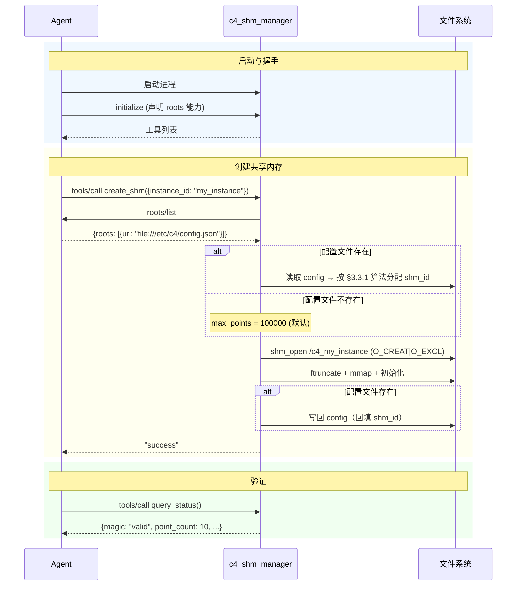

#### 场景二：扩容流程

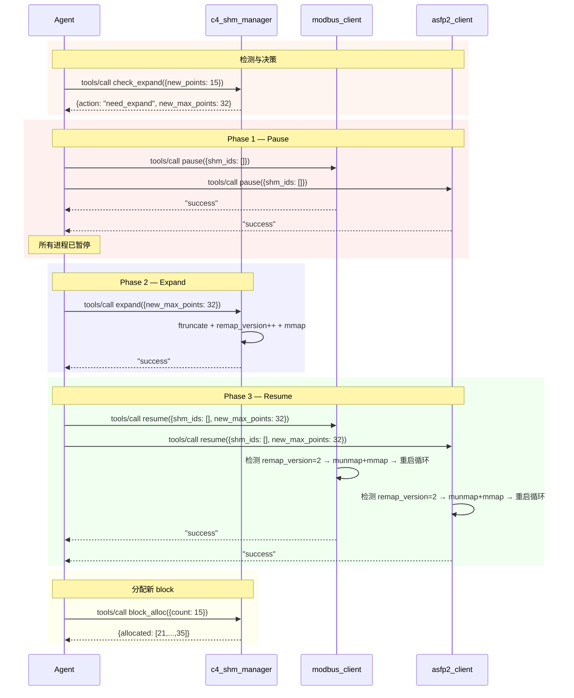

#### 场景三：运行时动态分配（`c4_asfp2_server`）

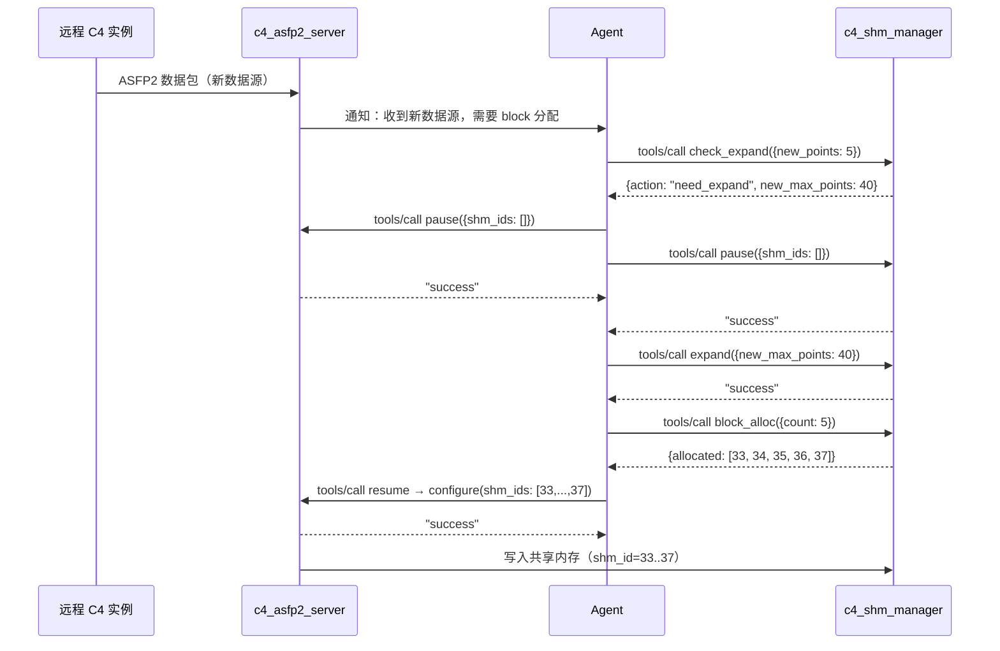

#### 场景四：Writer 崩溃后回收

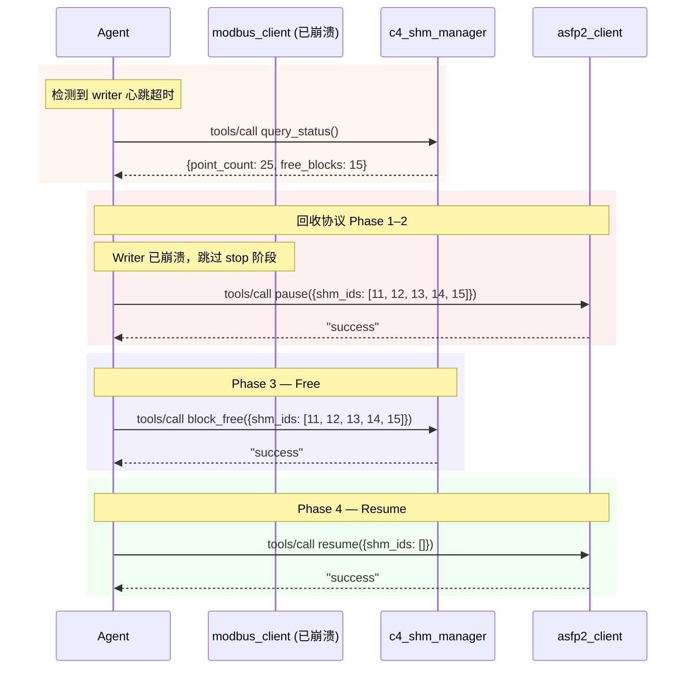

---

### 3.3.5 错误码汇总

**业务层错误**（`result.isError: true`，`content[0].text` 以 `ERROR_TYPE:` 前缀开头）：

| 错误码 | 含义 | 触发工具 |
|--------|------|---------|
| `SHM_ALREADY_EXISTS` | 共享内存已存在（O_EXCL 冲突） | `create_shm` |
| `SHM_NOT_CREATED` | 共享内存尚未创建 | `check_expand`, `expand`, `block_alloc`, `block_free`, `query_status` |
| `SHM_CORRUPTED` | Header magic 校验失败 | `query_status`, `resume` |
| `SHM_SYSCALL_FAILED` | POSIX 系统调用失败（shm_open / ftruncate / mmap） | `create_shm`, `expand` |
| `CONFIG_MISSING_SECTION` | 配置文件存在，但 `c4_shm_manager.writer` 或 `reader` 缺失或为空 | `create_shm` |
| `CONFIG_PATH_MISSING` | roots/list MCP 协议调用失败（Agent 不可达或超时） | `create_shm` |
| `DUPLICATE_KEY` | 两个 Writer point 的 `{service_id}.{point_id}` 重复 | `create_shm` |
| `UNKNOWN_READER_KEY` | Reader 的 `key` 字段引用了不存在的 Writer key | `create_shm` |
| `INSUFFICIENT_BLOCKS` | 空闲块不足，需先扩容 | `block_alloc` |
| `INVALID_SHM_ID` | shm_id 越界 | `block_free` |
| `BLOCK_ALREADY_FREE` | 尝试回收一个已经是空闲的 block | `block_free` |
| `INVALID_SIZE` | 扩容参数无效（不大于当前容量） | `expand` |
| `UNKNOWN_SHM_ID` | 指定的 shm_id 不在本进程订阅/写入列表中 | `pause` |
| `REMAP_MISMATCH` | mmap 后 max_points 与预期不一致 | `resume` |

**协议层错误**（JSON-RPC `error` 对象，由 MCP 框架/传输层直接返回）：

| JSON-RPC code | 含义 | 触发场景 |
|---------------|------|---------|
| `-32601` | Method not found | tool 名称拼写错误或不存在 |
| `-32602` | Invalid params | 必填参数缺失、类型错误、schema 校验失败 |
| `-32700` | Parse error | JSON 格式不合法 |

---

> **对应功能**：C4_FUN_00006, C4_FUN_00008, C4_FUN_00009, C4_FUN_00010, C4_FUN_00011, C4_FUN_00012~00017, C4_FUN_00022, C4_FUN_00024, C4_FUN_00042, C4_FUN_00047
