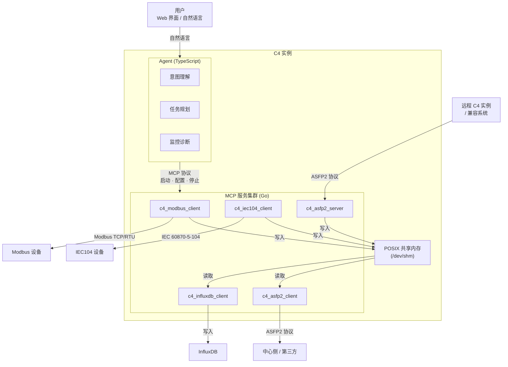
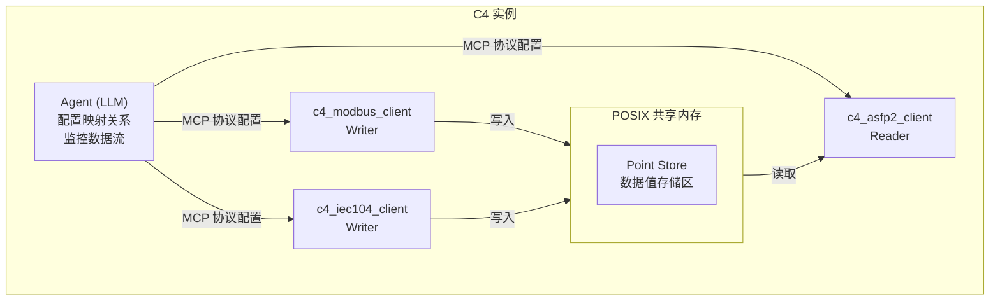
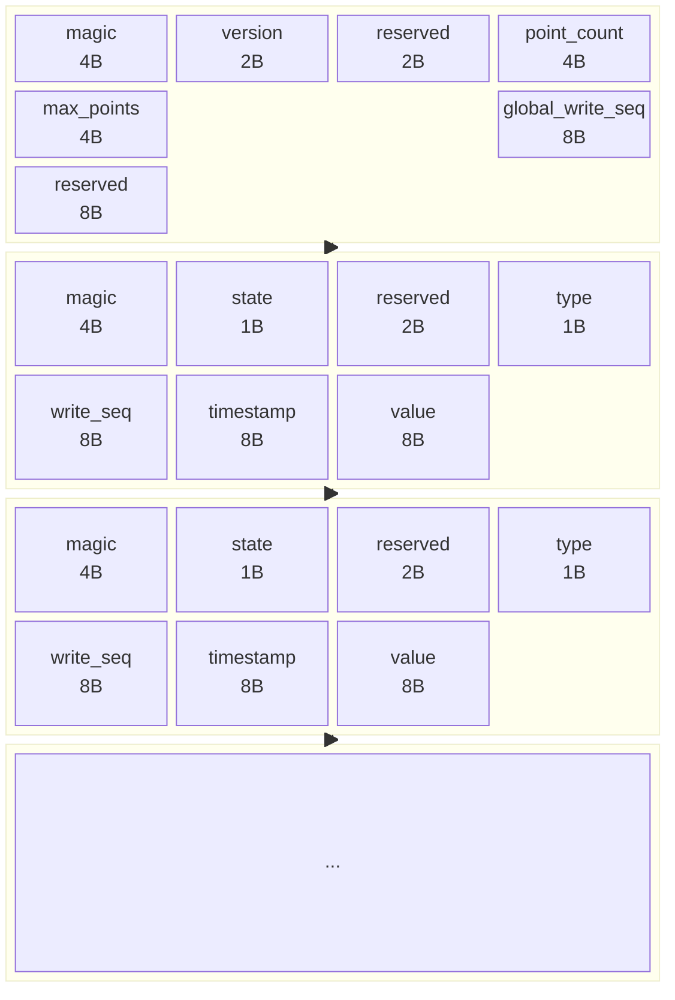
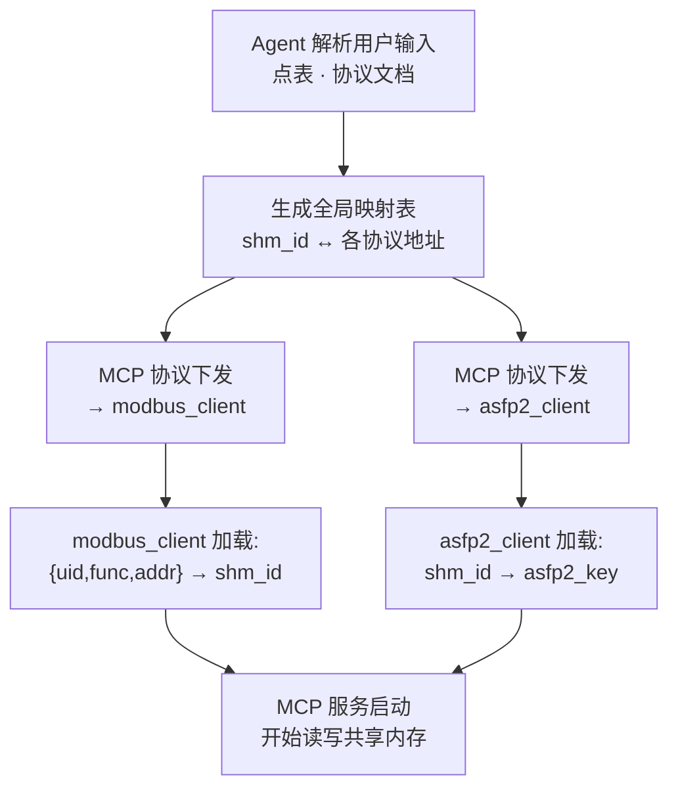
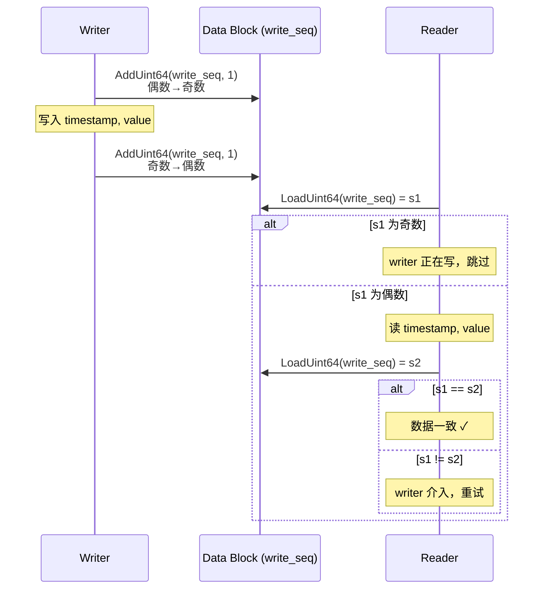
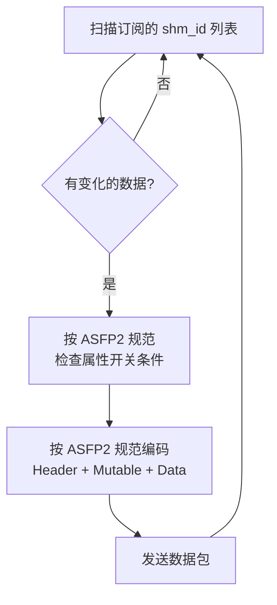

# C4 架构设计

> **版本**：v0.4.0 | **最后更新**：2026-07-15

---

# 第一章 架构设计

## 1.1 设计背景与目标

C4 的数据接入流程涉及多个 MCP 服务之间的数据传递。典型的场景：

- `c4_modbus_client` 从 Modbus 设备采集寄存器数据
- `c4_iec104_client` 从 IEC104 设备采集远动数据
- `c4_asfp2_server` 接收远程 C4 实例或兼容系统发来的 ASFP2 数据
- `c4_asfp2_client` 将数据按 ASFP2 协议转发到中心侧
- `c4_influxdb_client` 将数据写入 InfluxDB

这些 MCP 服务是**独立进程**，需要一种高效、低延迟的数据共享机制。
方案要求：零拷贝或近零拷贝、确定性延迟、支持一对多写入/读取、故障隔离。

## 1.2 技术选型

| 组件 | 语言 | 选型理由 |
|------|------|---------|
| **Agent** | TypeScript | MCP SDK 原生支持、Web 界面同语言、异步 I/O 成熟、LLM 生态丰富 |
| **MCP 服务** | Go | 高性能低内存、交叉编译为静态二进制、goroutine 天然适配多设备并发连接、工业 Linux 部署友好 |

## 1.3 整体架构

C4 采用 **Agent + MCP 服务集群** 架构。Agent 是智能决策层，MCP 服务是确定性执行层。
**Agent 与各 MCP 服务均为独立的系统服务**（systemd 守护进程单元），进程生命周期互不依赖，
可单独启动和退出；双方通过 **Unix 域 socket 上的标准 MCP 协议**（JSON-RPC 2.0）通信。
该部署形态是需求 §3.2（C4_RS_00030 Agent 故障不影响 MCP 数据管道、C4_RS_00031 MCP 自主运行、
C4_RS_00032 Agent 恢复后自动接续监控）的结构性保障——Agent 的任何形式的退出（正常停止、崩溃、升级）
都不会触及 MCP 服务的进程与数据路径。每个 C4 实例部署在一台工业数据服务器上
（单机单实例；水平扩展按服务器放置实例，见 C4_RS_00212）。

```
                      用户（Web 界面 / 自然语言）
                                │
                                ▼
┌───────────────────────────────────────────────────────────┐
│                    C4 实例（一台服务器）                     │
│                                                           │
│   ┌─────────────────────────────────────────────────┐    │
│   │              Agent (TypeScript)                   │    │
│   │  ┌──────────┐ ┌──────────┐ ┌──────────┐         │    │
│   │  │ 意图理解  │ │ 任务规划  │ │ 监控诊断  │  ...    │    │
│   │  └──────────┘ └──────────┘ └──────────┘         │    │
│   └──────┬──────────────┬──────────────┬────────────┘    │
│          │ MCP 协议     │ MCP 协议     │ MCP 协议         │
│          ▼              ▼              ▼                  │
│   ┌──────────┐   ┌──────────┐   ┌──────────┐   ┌──────────┐   ┌──────────┐    │
│   │ modbus   │   │ iec104  │   │ asfp2   │   │ asfp2   │   │ influxdb│ ...│
│   │ client   │   │ client  │   │ server  │   │ client  │   │ client  │    │
│   │  (Go)    │   │  (Go)   │   │  (Go)   │   │  (Go)   │   │  (Go)   │    │
│   └────┬─────┘   └────┬────┘   └────┬────┘   └────┬────┘   └────┬────┘    │
│        │rw           │rw          │rw          │r            │r             │
│        ▼             ▼            ▼            ▼                          │
│   ┌──────────────────────────────────────────────────────────────────────┐       │
│   │                    POSIX 共享内存 (/dev/shm)                          │       │
│   └──────────────────────────────────────────────────────────────────────┘       │
└───────────────────────────────────────────────────────────────────────────────────┘
        │             │            │            │            │
        ▼             ▼            ▼            ▼            ▼
   Modbus 设备    IEC104 设备  ASFP2 接收   ASFP2 发送    InfluxDB
   (RTU/TCP)      (远动装置)   (服务端)      (中心侧/第三方)
```


```mermaid
flowchart TB
    User["用户<br/>Web 界面 / 自然语言"]

    subgraph C4Instance["C4 实例"]
        subgraph AgentBox["Agent (TypeScript)"]
            Intent["意图理解"]
            Plan["任务规划"]
            Monitor["监控诊断"]
        end

        subgraph MCPServers["MCP 服务集群 (Go)"]
            Modbus["c4_modbus_client"]
            IEC104["c4_iec104_client"]
            ASFP2Svr["c4_asfp2_server"]
            ASFP2Cli["c4_asfp2_client"]
            InfluxDB["c4_influxdb_client"]
        end

        SHM["POSIX 共享内存<br/>(/dev/shm)"]

        AgentBox -->|"MCP 协议<br/>启动 · 配置 · 停止"| MCPServers
        Modbus -->|"写入"| SHM
        IEC104 -->|"写入"| SHM
        ASFP2Svr -->|"写入"| SHM
        SHM -->|"读取"| ASFP2Cli
        SHM -->|"读取"| InfluxDB
    end

    User -->|"自然语言"| AgentBox
    Modbus -->|"Modbus TCP/RTU"| Dev1["Modbus 设备"]
    IEC104 -->|"IEC 60870-5-104"| Dev2["IEC104 设备"]
    Remote["远程 C4 实例<br/>/ 兼容系统"] -->|"ASFP2 协议"| ASFP2Svr
    ASFP2Cli -->|"ASFP2 协议"| Target["中心侧 / 第三方"]
    InfluxDB -->|"写入"| InfluxDB2["InfluxDB"]
```

## 1.4 核心设计原则

- Agent（TypeScript）处理所有智能决策——理解用户意图、规划接入方案、配置和监控 MCP 服务
- MCP 服务（Go）处理所有确定性数据搬运——协议采集、数据转换、数据转发
- Agent 不在实时数据路径中运行。Agent 故障不影响已运行的 MCP 数据管道
- **Agent 与 MCP 服务均为独立系统服务**：进程生命周期互不依赖，均可单独启动和退出。
  Agent 以 systemd 单元运行（崩溃后由 systemd 拉起）；各 MCP 服务同样是 systemd 单元
  （`Restart=always`，满足 C4_RS_00240 异常退出自动重启）。二者之间不存在父子进程关系
- Agent 与 MCP 之间通过标准 MCP 协议（Model Context Protocol）通信，传输层为
  **Unix 域 socket**（每服务一个 socket 文件，权限即鉴权边界，满足 C4_RS_00015 最小权限）
- MCP 服务之间通过 POSIX 共享内存交换数据，零拷贝、纳秒级延迟。`c4_shm_manager` 是每个
  C4 实例首个随系统启动的 MCP 服务，负责共享内存的创建、扩容、块分配回收和销毁策略管理
  （运行期不销毁 shm——销毁仅发生在整机重启（tmpfs 清零）与卸载脚本 `shm_unlink`）；
  shm 的实际创建/扩容仍由 Agent 通过 MCP 工具触发，服务进程常驻不等于 shm 常驻

---

# 第二章 MCP 服务和共享内存通信

## 2.1 总体方案：共享内存 + 点映射表

每个 C4 实例内，所有本地 MCP 服务通过一块 POSIX 共享内存交换数据。
Agent 负责分配点映射关系，MCP 服务按映射读写。

```
┌──────────────────────────────────────────────────────┐
│                   C4 实例（一台服务器）                 │
│                                                      │
│  ┌─────────┐   ┌─────────┐   ┌─────────┐             │
│  │ modbus  │   │ iec104  │   │ asfp2   │             │
│  │ client  │   │ client  │   │ client  │   ...       │
│  │ (writer)│   │ (writer)│   │ (reader)│             │
│  └────┬────┘   └────┬────┘   └────┬────┘             │
│       │  写入        │  写入       │  读取             │
│       ▼              ▼             ▼                  │
│  ┌────────────────────────────────────────────┐      │
│  │              POSIX 共享内存                  │      │
│  │  ┌──────────────────┐ │      │
│  │  │    Point Store    │ │      │
│  │  │  (数据值存储区)    │ │      │
│  │  └──────────────────┘ │      │
│  └────────────────────────────────────────────┘      │
│                                                      │
│  ┌────────────────────────────────────────────┐      │
│  │              Agent (LLM)                    │      │
│  │   配置映射关系、监控数据流、诊断异常          │      │
│  └────────────────────────────────────────────┘      │
└──────────────────────────────────────────────────────┘
```


```mermaid
flowchart TB
    subgraph C4Instance["C4 实例"]
        Agent["Agent (LLM)<br/>配置映射关系<br/>监控数据流"]

        Modbus["c4_modbus_client<br/>Writer"]
        IEC["c4_iec104_client<br/>Writer"]
        ASFP2["c4_asfp2_client<br/>Reader"]

        subgraph SHM["POSIX 共享内存"]
            Store["Point Store<br/>数据值存储区"]
        end

        Modbus -->|"写入"| SHM
        IEC -->|"写入"| SHM
        SHM -->|"读取"| ASFP2
        Agent -->|"MCP 协议配置"| Modbus
        Agent -->|"MCP 协议配置"| IEC
        Agent -->|"MCP 协议配置"| ASFP2
    end
```

## 2.2 共享内存布局

共享内存采用**定长数据块数组**布局。每个数据块固定 32 字节，全局 Header 占据
块[0]（shm_id = 0），实际数据从块[1]（shm_id = 1）开始。任意数据块的
地址通过 `shm_id * 32` 直接计算，无需间接寻址。

```
┌──────────────────────────────────────────────────────┐  ← 0x0000
│                 Global Header (32B)                    │
│  magic(4) │ version(2) │   reserved(2)   │ point_count(4) │ max_points(4)  │
│  global_write_seq(8) │ reserved(8)                    │
├──────────────────────────────────────────────────────┤  ← 0x0020
│               Data Block [1] (32B)                    │
│  magic(4) │ state(1) │ reserved(2) │ type(1)          │
│  write_seq(8) │ timestamp(8) │ value(8)               │
├──────────────────────────────────────────────────────┤  ← 0x0040
│               Data Block [2] (32B)                    │
│  ...                                                  │
├──────────────────────────────────────────────────────┤
│               Data Block [N] (32B)                    │
│  ...                                                  │
└──────────────────────────────────────────────────────┘
```

地址公式：`block_offset = shm_id * 32`


```mermaid
block-beta
    columns 1
    block:Header
        columns 4
        h_magic["magic\n4B"]
        h_ver["version\n2B"]
        h_rver["reserved\n2B"]
        h_pc["point_count\n4B"]
        h_mp["max_points\n4B"]
        space
        space
        h_wseq["global_write_seq\n8B"]
        h_resv["reserved\n8B"]
    end
    block:Block1
        columns 4
        b1_m["magic\n4B"]
        b1_s["state\n1B"]
        b1_r["reserved\n2B"]
        b1_t["type\n1B"]
        b1_w["write_seq\n8B"]
        b1_ts["timestamp\n8B"]
        b1_val["value\n8B"]
    end
    block:Block2
        columns 4
        b2_m["magic\n4B"]
        b2_s["state\n1B"]
        b2_r["reserved\n2B"]
        b2_t["type\n1B"]
        b2_w["write_seq\n8B"]
        b2_ts["timestamp\n8B"]
        b2_val["value\n8B"]
    end
    block:BlockN
        columns 1
        bn["..."]
    end
    Header --> Block1
    Block1 --> Block2
    Block2 --> BlockN
```

### 2.2.1 Global Header 字段说明

| 字段 | 大小 | 偏移 | 说明 |
|------|------|------|------|
| `magic` | 4B | 0 | `0xC4DA7A00`，共享内存有效性校验 |
| `version` | 2B | 4 | 布局版本号，极少变更，当前 `1` |
| `reserved` | 2B | 6 | 保留字段，始终为 0 |
| `point_count` | 4B | 8 | 已分配（已分配 shm_id）的 point 数量，不包含 Header 自身。分配时递增，回收时递减。在分配与 Writer 首次写入之间可能暂高于实际 state=1 的 block 数 |
| `max_points` | 4B | 12 | 最大 point 容量，空闲块数 = `max_points - point_count` |
| `global_write_seq` | 8B | 16 | 预留字段（跨 point 全局写序号），当前无消费者，Writer 不递增，保持 0 |
| `reserved` | 8B | 24 | 保留，总计 32B |

> **初始化规则**：`c4_shm_manager` 创建共享内存时，先通过 `ftruncate` 将文件扩展到目标大小
> （自动零填充），再按上表写入各字段的指定值。未明确指定非零值的字段（`reserved`、
> `point_count`、`global_write_seq`、`reserved`）保持 `ftruncate` 后的默认值 `0`。

### 2.2.2 Data Block 字段说明

| 字段 | 大小 | 偏移 | 说明 |
|------|------|------|------|
| `magic` | 4B | 0 | 块级完整性校验。`c4_shm_manager` 在创建/扩容时一次性写入 `0xC4DA7A00`，此后永不变更。Writer 和 Reader 每次访问前校验——`0` 表示未初始化，其他值表示内存损坏 |
| `state` | 1B | 4 | 块激活状态：0=空闲（未激活），1=活跃（Writer 首次写入时置 1）。回收时由 `c4_shm_manager` 置 0 |
| `reserved` | 2B | 5 | 保留 |
| `type` | 1B | 7 | 数据类型（ASFP2_TYPE_* 枚举） |
| `write_seq` | 8B | 8 | Seqlock 序列号——奇数=writer 写入中，偶数=稳定可读。同时承载数据新鲜度判断（超过 `last_seen` 即新数据） |
| `timestamp` | 8B | 16 | 采集时间戳，Unix 纪元毫秒差值（本机序） |
| `value` | 8B | 24 | 实际数据值，统一 8B（本机序），不足 8B 的类型低位存储、高位补零 |

### 2.2.3 数据类型存储

所有类型的 value 统一占用 8B，不足 8B 的类型在低位存储，高位补零。

| ASFP2 类型 | 枚举值 | 有效字节 | 存储位置（8B value 中） |
|------------|--------|---------|------------------------|
| BOOLEAN | 0 | 1B | 最低字节（offset 0） |
| INT8 | 1 | 1B | 最低字节（offset 0） |
| UINT8 | 2 | 1B | 最低字节（offset 0） |
| INT16 | 3 | 2B | 低 2 字节（offset 0~1） |
| UINT16 | 4 | 2B | 低 2 字节（offset 0~1） |
| INT32 | 5 | 4B | 低 4 字节（offset 0~3） |
| UINT32 | 6 | 4B | 低 4 字节（offset 0~3） |
| INT64 | 7 | 8B | 全部 8 字节 |
| UINT64 | 8 | 8B | 全部 8 字节 |
| FLOAT16 | 9 | 4B | 低 4 字节（offset 0~3）：存储该值对应的 float32 位模式（见下方 FLOAT16 特例） |
| FLOAT32 | 10 | 4B | 低 4 字节（offset 0~3） |
| FLOAT64 | 11 | 8B | 全部 8 字节 |
| BIT | 15 | 1B | 最低字节（offset 0） |

所有类型的 value 使用本机序存储（Writer 与 Reader 均运行在同一台机器，直接读写本机内存序，无需网络序转换）。
FLOAT 类型的 value 同样使用本机序存储（Go: `binary.NativeEndian`），其 IEEE 754 位模式与整数类型一致地按本机序写入。
BOOLEAN 和 BIT 类型：最低位（bit 0）表示有效值，其余位为 0。

> **FLOAT16 特例**：shm 存储尺寸为 **4 字节**，内容为该值对应的 **float32 IEEE 754 位模式**
> （本机序）——与线缆尺寸（2 字节 f16 位型）不同。Writer 侧（`c4_asfp2_server`）在解码报文后
> 先将 f16 转为 float32 位模式再写入；读取方（`c4_asfp2_client`、`c4_shm_manager` 的
> `read_points`）按 float32 位模式解释低 4 字节，可无损转回 float16。

### 2.2.4 定长块设计优势

与变长槽位（根据不同 type 分配 9~16B 大小不等的槽位）相比，定长 32B 块设计：

- **O(1) 直接寻址**：`shm_id * 32`（一条左移 5 位指令）即定位目标块
- **单次 cache line 访问**：32B 正好半条 cache line（64B），元数据+数据在一次 cache miss 内全部获取
- **块级完整性校验**：`magic` 由 `c4_shm_manager` 创建时一次性写入，Writer/Reader 每次访问前校验，检测内存踩踏或未初始化块
- **无写入顺序问题**：`magic` 永不变更（写入在前），`state` 由 Writer 首次写入时激活（在后）。不存在"先看到 state=1 再看到 magic=0"的竞态
- **Seqlock 崩溃安全**：`write_seq` 的奇偶位替代自旋锁，writer 崩溃后 sequence 停在奇数，reader 跳过此 block 而不阻塞，无"锁永远不释放"问题
- **分配/回收内聚**：`state` 变化即回收，`magic` 保持不变，无需跨区域清理

对于小类型（BOOLEAN / UINT16 等）的 value 空间浪费，50 万 UINT16 点浪费约 3MB（6B×50 万），在 64MB 共享内存上占比 4.7%，可接受。

## 2.3 点地址映射表

映射表位于共享内存之外（Agent 独立管理），通过 Agent → MCP 的 MCP 协议下发配置。

### 2.3.1 映射方向

```
  采集端 MCP 的本地地址         全局 shm_id        转发端 MCP 的本地地址
  ┌──────────────────┐         ┌─────────┐         ┌──────────────────┐
  │ modbus:           │         │         │         │ asfp2:            │
  │  uid=1,func=3,    │ ──────► │    1    │ ◄────── │  key=100          │
  │  addr=40001       │         │         │         │                  │
  ├──────────────────┤         ├─────────┤         ├──────────────────┤
  │ modbus:           │         │         │         │ asfp2:            │
  │  uid=1,func=3,    │ ──────► │    2    │ ◄────── │  key=101          │
  │  addr=40002       │         │         │         │                  │
  ├──────────────────┤         ├─────────┤         ├──────────────────┤
  │ iec104:            │         │         │         │ asfp2:            │
  │  ca=1,ioa=16385   │ ──────► │   100   │ ◄────── │  key=200          │
  └──────────────────┘         └─────────┘         └──────────────────┘
```

### 2.3.2 映射表结构

Agent 维护一张全局映射表：

```json
{
  "points": [
    {
      "shm_id": 1,
      "type": "uint16",
      "sources": [
        {"mcp": "modbus_client", "uid": 1, "func": 3, "addr": 40001}
      ],
      "targets": [
        {"mcp": "asfp2_client", "asfp2_key": 100}
      ]
    },
    {
      "shm_id": 100,
      "type": "float32",
      "sources": [
        {"mcp": "iec104_client", "common_address": 1, "ioa": 16385}
      ],
      "targets": [
        {"mcp": "asfp2_client", "asfp2_key": 200}
      ]
    }
  ]
}
```

### 2.3.3 映射下发流程

```
1. Agent 解析用户输入（点表、协议文档）→ 生成映射表
2. Agent 通过 MCP 协议向各 MCP 服务下发各自的地址→shm_id 映射
   - modbus_client 收到：{uid:1, func:3, addr:40001} → shm_id:1
   - asfp2_client 收到：shm_id:1 → asfp2_key:100
3. MCP 服务启动后加载映射，开始读写
```


```mermaid
flowchart TB
    A["Agent 解析用户输入<br/>点表 · 协议文档"] --> B["生成全局映射表<br/>shm_id ↔ 各协议地址"]
    B --> C1["MCP 协议下发<br/>→ modbus_client"]
    B --> C2["MCP 协议下发<br/>→ asfp2_client"]
    C1 --> D1["modbus_client 加载:<br/>{uid,func,addr} → shm_id"]
    C2 --> D2["asfp2_client 加载:<br/>shm_id → asfp2_key"]
    D1 --> E["MCP 服务启动<br/>开始读写共享内存"]
    D2 --> E
```

## 2.4 读写并发协议

### 2.4.1 单写多读模型

每个 shm_id **只有一个写入者**（产生数据的采集 MCP），
可有**多个读取者**（转发 MCP 或其他消费者）。

### 2.4.2 Seqlock 协议

利用 `write_seq` 的奇偶性实现无锁并发：writer 写入前后各递增一次序列号（偶数→奇数→偶数），reader 通过比较前后序列号是否一致来判断读到的是否为完整数据。

**Writer（采集 MCP）**：

```go
block := (*DataBlock)(unsafe.Pointer(shmPtr + uintptr(pointID)*32))

// 1. 校验块完整性——magic 异常则拒写
if atomic.LoadUint32(&block.magic) != MAGIC {
    logError("block %d magic invalid", pointID)
    return
}

// 2. 首次写入时激活块（state 0→1），并重置序列号为偶数起点
if block.state == 0 {
    block.state = 1
    atomic.StoreUint64(&block.write_seq, 0)  // 归零，保证偶数→奇数→偶数的 seqlock 协议
}

// 3. 获取全局序号（预留，当前无消费者，不递增）
// atomic.AddUint64(&header.global_write_seq, 1)  // 可选，按需

// 4. 递增序列号为奇数，宣告写入开始
atomic.AddUint64(&block.write_seq, 1)

// 5. 写入数据
block.timestamp = ts
memcpy(&block.value, &data, size)

// 6. 递增序列号为偶数，宣告写入完成
atomic.AddUint64(&block.write_seq, 1)
```

**Reader（转发 MCP）**：

```go
block := (*DataBlock)(unsafe.Pointer(shmPtr + uintptr(pointID)*32))

// 1. 校验块完整性
if atomic.LoadUint32(&block.magic) != MAGIC {
    logError("block %d magic invalid", pointID)
    return
}
// 2. 块未激活，跳过
if block.state == 0 {
    return
}

for {
    s1 := atomic.LoadUint64(&block.write_seq)
    if s1&1 != 0 {           // 奇数：writer 正在写，返回等待下一轮 poll
        return
    }
    // 偶数：block 处于稳定状态，安全读取
    ts := block.timestamp
    val := block.value
    s2 := atomic.LoadUint64(&block.write_seq)
    if s1 == s2 {
        // 序列号未变，读到一致数据
        if s1 > lastSeen[pointID] {
            lastSeen[pointID] = s1
            // 消费数据 ...
        }
        return
    }
    // s1 != s2：writer 在读取期间介入，重试
}
```

**设计约束：Writer 1Hz，Reader 10Hz**。Writer 每秒写入一次（采集周期），Reader 每秒轮询 10 次。
Reader 的 poll 频率 10 倍于 Writer 的写入频率，Writer 在两次 poll 之间最多写入 1 次。
Reader 触发 skip（奇数 seq）的概率 = 1/10，发生 skip 后下一轮 poll（100ms 后）必定拿到已完成的最新值。
Reader 仅在 s1≠s2 时可能重试一次（概率 < 0.001%）。


```mermaid
sequenceDiagram
    participant W as Writer
    participant B as Data Block (write_seq)
    participant R as Reader

    W->>B: AddUint64(write_seq, 1)<br/>偶数→奇数
    Note over W: 写入 timestamp, value
    W->>B: AddUint64(write_seq, 1)<br/>奇数→偶数

    R->>B: LoadUint64(write_seq) = s1
    alt s1 为奇数
        Note over R: writer 正在写，跳过
    else s1 为偶数
        Note over R: 读 timestamp, value
        R->>B: LoadUint64(write_seq) = s2
        alt s1 == s2
            Note over R: 数据一致 ✓
        else s1 != s2
            Note over R: writer 介入，重试
        end
    end
```

### 2.4.3 为什么选用 Seqlock

| 特性 | 说明 |
|------|------|
| **崩溃安全** | Writer 崩溃后 `write_seq` 停在奇数，reader 检测到奇数即跳过该 block。无"锁永远不释放"的状态。失效 block 的回收由 `c4_shm_manager` 的 `adjust_shm` 孤儿扫描完成（以 config.json 为权威）；数据面健康观测的指标来源与实现不在本节展开 |
| **Writer 不被 Reader 阻塞** | Writer 只做两次 `atomic.AddUint64`，无需获取锁。Reader 从不阻碍 writer 的数据写入路径 |
| **Reader 不被 Writer 阻塞** | Reader 不获取锁，writer 写入期间 reader 跳过并重试（概率 < 0.001%，工业轮询间隔下实际永不触发） |
| **O_RDONLY 兼容** | Reader 全程只读不写，可以用 `O_RDONLY` mmap 映射。自旋锁方案要求 CAS 原子写，只读页面无法工作 |
| **无自旋等待** | 无 `CAS(0→1)` 自旋循环，CPU 指令流水线不被锁竞争打断 |

**与自旋锁方案的关键差异**：

| 维度 | 自旋锁 | Seqlock |
|------|--------|---------|
| Writer-Reader 关系 | 互斥串行 | 并行 |
| writer 崩溃后果 | lock=1 永存，block 永久死亡 | write_seq 停在奇数，reader 跳过 |
| reader 持锁崩溃 | block 同样死亡 | reader 不持锁，无影响 |
| 临界区写入延迟 | CAS(~10ns) + write(~25ns) + store(~5ns) | AddUint64(~5ns) + write(~25ns) + AddUint64(~5ns) |
| reader 只读路径 | CAS 必须写 `lock`，O_RDONLY 不可用 | 无需写操作，O_RDONLY 可用 |

### 2.4.4 write_seq 语义

`write_seq` 同时承载 seqlock 序列号和数据新鲜度判断：

- **偶数**（bit 0 = 0）：block 处于稳定态，reader 可安全读取
- **奇数**（bit 0 = 1）：writer 正在更新 block，reader 跳过
- **单调递增**：每次写入递增 2（例如 0→1→2, 2→3→4），reader 比较 `write_seq > last_seen`
- **64 位**：2^64 足以覆盖任意部署周期，无需担心溢出（100Hz 写入需 58.5 亿年）

`global_write_seq`（Global Header 中 8B）为预留字段，当前无任何组件读取。设计上用于跨 point 的
全局顺序，但尚无消费者，Writer 不递增（保持 0）。待有跨点全序需求时再启用并定义语义。

### 2.4.5 不变式

以下规则在正常运行中必须始终成立，是实现和测试的验证基准：

| 不变式 | 维护者 | 校验时机 |
|--------|--------|---------|
| `block.state=1` ⇒ `block.magic=0xC4DA7A00` | Writer（写 state=1 前已验证 magic） | 每次写入前 |
| 每个 block 只有一个 writer（shm_id 集合不重叠） | Agent（分配时不交叉） | 分配时 |
| block 被回收（state→0）前，writer 已停止，reader 已停止 | Agent（Stop-Start 协议） | 回收 Phase 3 入口 |
| `write_seq` 单调递增（每次 +2：偶数→奇数→偶数） | Writer（seqlock） | — |
| 扩容期间无其他进程读写 shm | Agent（先 stop 所有 MCP） | 扩容入口 |
| `point_count` = 已分配但尚未回收的 block 数 | `c4_shm_manager`（alloc/free 维护；重启时扫描 state=1 重建） | Agent 重启后 |
| `magic` 仅在创建/扩容时由 `c4_shm_manager` 写入，此后永不变 | `c4_shm_manager` | 创建/扩容时 |

## 2.5 共享内存生命周期

共享内存由 **`c4_shm_manager`** 创建并管理。`c4_shm_manager` 是每个 C4 实例默认启动
的首个 MCP 服务，负责：

- **创建**：根据配置文件计算容量，初始化 Header 和 Data Block Array
- **扩容**：通过 `adjust_shm` 工具统一完成容量判断、`ftruncate` 扩容、shm_id 分配和配置回填。Agent 调用前须通过 Stop-Start 协议停止所有 MCP 服务的数据路径（详见 [c4_shm_manager.md](c4_shm_manager.md) §1.2）
- **崩溃恢复**：进程重启后不主动 attach shm；Agent 重新调用 `create_shm` / `adjust_shm`
  工具时附加已有共享内存，以 `state=1` 为权威源重建 `point_count`
  （见 [c4_shm_manager.md](c4_shm_manager.md) §1.3）

Agent 不直接操作共享内存——所有 shm 操作通过 `c4_shm_manager` 提供的 MCP 工具完成。
两个工具职责分界：`create_shm` 只负责段级容器（不存在则创建、已存在则校验附加，幂等
create-or-attach），不做点位分配；点位分配对账由 `adjust_shm` 负责（同参数重跑收敛、
重放安全）——详见 [c4_shm_manager.md](c4_shm_manager.md) §3「职责分界与幂等契约」。

> 详细设计（创建流程、扩容协议、配置解析算法、工具接口、交互时序、错误码）见
> [c4_shm_manager.md](c4_shm_manager.md)。

## 2.6 ASFP2 协议集成

C4 使用两个独立的 MCP 服务处理 ASFP2 协议，另有 `c4_shm_manager` 管理共享内存：
- `c4_asfp2_client`：从共享内存读取数据，编码为 ASFP2 数据包后发送到中心侧或第三方
- `c4_asfp2_server`：作为服务端接收远程 ASFP2 数据，解析后写入共享内存。`c4_asfp2_server` 以 `O_RDWR` 模式打开已有共享内存（由 `c4_shm_manager` 创建），不参与共享内存的创建或销毁

### 2.6.1 ASFP2 发送（`c4_asfp2_client`）

`c4_asfp2_client` 从共享内存读取多个 point 的数据，构造 ASFP2 数据包。

```
asfp2_client 打包循环:
  1. 扫描共享内存中所有已订阅 shm_id，取出有新数据的 point
  2. 按 ASFP2 协议规范（`asfp2_specification.md`）的要求，
     检查属性开关条件（SAME_DATA_TYPE / KEY_SEQUENCE / SAME_TIMESTAMP），
     将符合条件的 point 归入同一个数据包
  3. 按 ASFP2 规范编码 Header + Mutable + Data
  4. 发送 → 返回步骤 1
```


```mermaid
flowchart TD
    A["扫描订阅的 shm_id 列表"] --> B{"有变化的数据?"}
    B -->|"是"| C["按 ASFP2 规范<br/>检查属性开关条件"]
    B -->|"否"| A
    C --> D["按 ASFP2 规范编码<br/>Header + Mutable + Data"]
    D --> E["发送数据包"]
    E --> A
```

### 2.6.2 shm_id 到 asfp2_key 的映射（发送端）

```json
// c4_asfp2_client 从 Agent 接收的配置
{
  "subscriptions": [
    {"shm_id": 1,   "asfp2_key": 100},
    {"shm_id": 2,   "asfp2_key": 101},
    {"shm_id": 100, "asfp2_key": 200}
  ]
}
```

`c4_asfp2_client` 维护 `shm_id → asfp2_key` 的本地索引，
打包时遍历索引表，从共享内存读取最新值，按 ASFP2 规范编码。

### 2.6.3 ASFP2 接收（`c4_asfp2_server`）

`c4_asfp2_server` 以 O_RDWR 模式附加已有共享内存，作为 ASFP2 服务端监听连接。
收到远程 C4 实例或兼容系统的 ASFP2 数据包后，解析并按 `asfp2_key → shm_id`
的反向映射写入对应的 shm_id 记录，供本地其他 MCP 服务消费。
接收端的 point 映射由 Agent 配置下发，其 JSON 结构与发送端相反：
`{"asfp2_key": 100, "shm_id": 1}`。

## 2.7 错误处理与故障恢复

| 场景 | 处理方式 |
|------|---------|
| Writer（采集 MCP）崩溃 | `write_seq` 停在奇数（seqlock 特征），reader 检测到奇数后跳过该 block；进程异常退出由 systemd 重启，Agent 重连后按瀑布流程收敛实例 |
| Reader（转发 MCP）崩溃 | Writer 不受影响（Seqlock 中 writer 不等待 reader）；进程异常退出由 systemd 重启，Agent 重连后按瀑布流程收敛实例 |
| 共享内存损坏 | Header 或 Data Block 的 `magic` 校验失败 → 数据服务按 `SHM_CORRUPTED` 拒绝并报告；恢复经外部手段（整机重启或清理脚本，见 c4_deployment.md shm 损坏恢复） |

注：数据面健康观测的指标来源与实现不在本表展开。
| 内存不足 | Agent 检测 `point_count ≥ max_points` → 触发扩容或拒绝新增 point |
| 跨进程时间同步 | 所有 MCP 进程使用 Unix 纪元毫秒作为统一的时间戳格式；数据新鲜度由 `write_seq` 单调计数器保证，与时间源无关 |

## 2.8 性能考量

| 考量 | 设计选择 |
|------|---------|
| Cache line | Data Block 32B/条目，正好半条 cache line（64B），元数据+数据一次访问到位，无跨块 false sharing |
| 读写并发 | Seqlock 协议——writer/reader 并行不互斥，reader 仅在 writer 写入的 ~35ns 窗口内可能重试一次（概率可忽略） |
| 内存占用 | 32B/point；50 万 point ≈ 16MB（含 Header） |
| 写入延迟 | AddUint64(~5ns) + memcpy(~20ns) + AddUint64(~5ns)，总 ~30ns |
| 读取延迟（无竞争） | LoadUint64(~5ns) + memcpy(~20ns) + LoadUint64(~5ns)，总 ~30ns |
| 崩溃安全 | Seqlock 无锁设计——writer 崩溃只留奇数 seq，reader 跳过；无"锁永远不释放"风险 |

## 2.9 备选方案讨论

| 方案 | 优点 | 缺点 | 结论 |
|------|------|------|------|
| 共享内存（本方案） | 零拷贝、纳秒级延迟 | 单机限制、需处理并发 | ✅ 选用 |
| Unix Domain Socket | 跨网络、协议灵活 | 数据拷贝、微秒级延迟 | 备选（跨容器场景） |
| Redis/MQ | 解耦、持久化 | 网络开销大、引入外部依赖 | 不适合实时数据路径 |
| 管道/FIFO | 简单 | 单向、无随机访问 | 不适用 |

---

# 第三章 Agent 和 MCP 接口规范

Agent（TypeScript）与 MCP Server（Go）的交互分为两部分：**运行时 MCP 工具调用**（Agent 通过 MCP 协议操作 MCP Server）和**启动配置下发**（Agent 写入配置文件后，通过 MCP 工具指令各 MCP Server 加载配置并启动数据路径）。**Agent 不再以父子进程方式拉起 MCP Server**——各 MCP Server 是独立系统服务（systemd 单元），进程由 systemd 管理并常驻；Agent 启动时通过 Unix 域 socket 主动连接各 MCP Server，以 MCP 客户端身份建立会话后下发指令（数据路径实例的启停由 Agent 经工具控制，与进程启停解耦）。`~/.local/c4/config.json` 仅为示例路径，配置文件的绝对路径通过 start(instance_id, config_path)、adjust_shm(instance_id, config_path) 等工具参数直接传入，不依赖 MCP roots/list 协议。各 MCP 工具的签名、参数 schema、MCP 应答格式及错误码详见 §3.3.2~§3.3.5。

---

## 3.1 Agent ↔ MCP Server 交互模型

```
┌─────────────────────────────────────────────────────────────────┐
│              Agent (TypeScript)   [systemd: c4-agent]            │
│                                                                 │
│   ┌─────────────┐  ┌──────────────┐  ┌───────────────────┐     │
│   │ 配置生成器   │  │ 运行时 MCP   │  │ 状态监控          │     │
│   │ (写 config)  │  │ 工具调用     │  │ (MCP Resource)    │     │
│   └──────┬──────┘  └──────┬───────┘  └────────┬──────────┘     │
│          │                │                    │                │
└──────────┼────────────────┼────────────────────┼────────────────┘
           │                │                    │
           ▼                ▼                    ▼
    config.json (示例路径)  MCP 协议             MCP 协议
           │      (Unix domain socket)  (Unix domain socket)
           │      /run/c4/<service>.sock      │
           │                │                    │
           ▼                ▼                    ▼
    ┌──────────┐   ┌──────────┐   ┌──────────┐   ┌──────────┐
    │c4_shm    │   │c4_modbus │   │c4_iec104 │   │c4_asfp2  │  ...
    │_manager  │   │_client   │   │_client   │   │_client   │
    │  (Go)    │   │  (Go)    │   │  (Go)    │   │  (Go)    │
    └──────────┘   └──────────┘   └──────────┘   └──────────┘
```

### 交互流程

```
系统启动阶段（systemd，与 Agent 无关）：
  1. systemd 依单元依赖拉起各 MCP Server（c4_shm_manager 最先）——均为独立系统服务，
     进程常驻；未收到 start 指令前不运行任何数据路径实例
  2. 各 MCP Server 启动后创建/监听自己的 Unix socket（/run/c4/<service>.sock），
     等待 Agent 连接；此阶段 Agent 是否在运行不影响以上任何一步

Agent 启动/恢复阶段（对应 C4_RS_00032）：
  3. Agent（systemd 单元 c4-agent）启动，逐一连接各 MCP Server 的 Unix socket，
     完成 MCP initialize 握手建立会话
  4. Agent 读取 config.json，逐服务调用 start(instance_id, config_path) 完成收敛：
     应答 success＝此前为空白进程、实例已按当前配置拉起；应答 ALREADY_RUNNING＝实例
     本就在运行（无在途事务标记即保证配置与运行状态一致），视为无需动作。
     随后重建监控——监控状态来源于 MCP 服务与配置文件本身，
     而非 Agent 本地记忆，因此 Agent 崩溃重启后可无损接续（详见 §3.1.2）
  5. 若某 MCP Server 的 socket 暂不可连（服务重启中），Agent 按退避策略重试，
     不阻塞其余服务的接入（优雅降级，C4_RS_00242）

运行阶段：
  6. Agent 通过 MCP 工具监控各 MCP Server 状态（心跳、数据统计）
  7. 用户要求新增采集点 → Agent 更新配置文件，生成新的 points 列表
      → Agent 通过 Stop-Start 协议停止所有 MCP 数据路径
      → Agent 调用 c4_shm_manager.adjust_shm(instance_id, config_path) 完成容量调整和点分配
      → Agent 重新 start 所有 MCP
      （以上全部经由 Unix socket 上的 MCP 工具调用。Agent 崩溃期间数据路径不受影响：
        MCP 进程常驻、实例照常运行，无会话不等于无数据——C4_RS_00030/00031）

停止/回收阶段：
   8. Agent 通过 Stop-Start 协议停止相关 MCP，回收不再使用的 shm_id
  9. Agent 更新配置文件并通知 MCP Server
 10. 单独停止某 MCP Server（systemctl stop <unit>）＝该服务数据路径随进程退出而停止，
     其余 MCP Server 与 shm 既有数据不受影响；停止 Agent 本身不触发任何 MCP 进程退出
```

### 3.1.1 部署形态：独立系统服务与 Unix Socket 通道

**systemd 单元划分**（每 C4 实例一组）：

| 单元 | 进程 | 重启策略 | 说明 |
|------|------|---------|------|
| `c4-shm-manager` | c4_shm_manager | `Restart=always` | 首个启动的 MCP 服务（单元依赖序在最前） |
| `c4-asfp2-server` / `c4-asfp2-client` / `c4-modbus-client` / ... | 各数据路径 MCP | `Restart=always` | 满足 C4_RS_00240 异常自动重启；进程常驻，数据路径实例由 Agent 经工具启停 |
| `c4-agent` | Agent（Node.js） | `Restart=always` | 崩溃自动拉起；RTO 由重启策略与监控重建流程决定（C4_RS_00241） |

**启用策略（方案 A，部署期决定）**：安装的全部 MCP 服务单元默认启用并开机自启——进程集合是部署期静态决策，运行期不做进程级按需启停。未使用的服务以零实例状态常驻（仅监听 socket，不运行数据路径），资源占用计入 C4_RS_00203 预算；未部署（禁用）的协议服务，Agent 连接失败时向用户明确提示该协议服务未在此站部署，不做隐式拉起。新增 MCP 服务的接入属部署期操作：以 **root** 账户安装服务二进制与 systemd 单元并启用（enable），随后**重启 Agent** 使其发现并接入新服务——Agent 的服务清单在启动时建立，不支持运行期热发现。

各单元以专用非 root 账户（`c4`）运行，满足 C4_RS_00015。**单元之间不设强制服务级依赖**——
Agent 不因某 MCP 服务停止而停止，MCP 服务不因 Agent 停止而停止；数据路径 MCP 单元可选择性
附加 `Wants=c4-shm-manager.service` + `After=c4-shm-manager.service` 作防御性启动排序（见下）。

**c4_shm_manager 先于其他 MCP 的保证（三层防线）**：

1. **进程层（systemd，防御性）**：数据路径 MCP 单元 `After=c4-shm-manager.service`。
   注意这层不承载正确性——新模型下 MCP 进程启动后只监听 socket、**不 attach shm**，
   shm 的创建/附加全部发生在工具调用中
2. **逻辑层（权威保证）**：数据路径实例的唯一拉起入口是 Agent 的 start 工具，而 Agent
   启动/恢复流程固定先连 `c4_shm_manager` 对账 shm（不存在则 `create_shm`，异常则
   fail-fast 终止），成功后才对任何数据服务调 start——因此 start 执行时 shm 必已存在
3. **工具层（兜底）**：数据服务的 start 自带同步 shm 校验（`SHM_OPEN_FAILED` /
   `SHM_CORRUPTED` / `SHM_ID_NOT_ASSIGNED`），顺序被打破时表现为干净的 tool 错误，
   不会产生数据损坏。MCP 服务被 systemd 重启后不自动恢复实例（等待 Agent 指令），
   不存在乱序 attach 的路径

**Unix Socket 约定**：

- 每服务一个 socket 文件：`/run/c4/<service>.sock`（如 `/run/c4/c4_asfp2_server.sock`）
- 权限 `0660`，属主 `c4:c4`——socket 文件权限构成 uid 粒度的鉴权边界（全部 C4 进程共享
  uid c4，为主机级边界；如需服务级隔离，后续可引入 SO_PEERCRED 对端校验）（C4_RS_00015），
  未授权用户无法连接
- 绑定前清理：MCP 服务绑定 Unix socket 前必须移除残留的 socket 文件（unlink-before-bind）。
  systemd 单元的单例性保证不会误删存活实例的 socket（同一单元同时仅一个进程）；
  socket 文件目录 /run/c4 由单元的 RuntimeDirectory=c4 提供
- 传输语义：JSON-RPC 2.0 over Unix 流式 socket；MCP `initialize` 握手按连接进行，
  一个连接一个会话。旧会话失效无副作用——MCP 工具本身无会话态，配置以 config.json
  与共享内存为权威，Agent 重建会话后重新 initialize 即可继续调用全部工具
- Agent 侧连接管理：断线自动重连（指数退避）；重连成功后按 §3.1.2 的恢复流程收敛
  （依据 start 的契约返回，不做独立的状态探测）
- **MCP 存活状态**＝连接状态推导：已连接＝运行中，断连/连接失败＝已停止；
  供 Web 页面展示与告警使用（C4_RS_00060/00068），恢复流程本身不消费状态查询。
  存活推导区分不了「部署时禁用/运维手动停止/单元进入 failed」三种停止原因，也覆盖不了
  Agent 自身宕机期间的告警缺位；单元进入 failed 状态需人工 `systemctl reset-failed`
  （运维手册见 c4_deployment.md §6.5）

**故障矩阵**：

| 场景 | 数据接入/转发 | 恢复行为 |
|------|--------------|---------|
| Agent 崩溃/停止 | **不受影响**（MCP 进程常驻，实例照常运行） | Agent 重启后连 socket → 对账 → 接续监控（C4_RS_00030/00031/00032） |
| 某 MCP 服务崩溃 | 仅该服务数据路径中断，其余服务不受影响 | systemd `Restart=always` 拉起 → socket 重新监听 → Agent 检测重连后按 config 重新 start 实例（C4_RS_00240/00242） |
| c4_shm_manager 崩溃 | **零影响**——shm_manager 不在实时数据路径上，数据服务各自持有 mmap，分配器死亡不影响读写 | systemd 拉起 → Agent 重连 → 幂等工具调用（create-or-attach）验证段存在；配置变更能力恢复 |
| 二者同时崩溃 | MCP 先恢复，实例未启动（等待 Agent 指令） | 各自由 systemd 拉起；Agent 就绪后按 §3.1.2 瀑布流程收敛，数据路径恢复 |
| 升级 | 互相独立：升级 Agent 不中断 MCP 数据路径（C4_RS_00252）；升级单个 MCP 服务仅影响其自身数据路径（C4_RS_00251） | 各单元独立 restart |

**生命周期双层模型**：进程生命周期归 systemd（常驻、重启、升级）；数据路径实例生命周期归
Agent 经 MCP 工具管理（start / stop / Stop-Start 协议）。二者解耦是本架构的核心——
Agent 管理的是"实例是否运行"，而非"进程是否存在"。这也是 §3.3.1 中各生命周期工具
只操作实例、不操作进程的原因。

### 3.1.2 变更事务与 Agent 启动/恢复流程

**变更事务协议**（Agent 执行任何 config.json 变更——增删点、增删实例——的固定序列）：

```
1. 写事务标记 pending_change.json（持久化：变更描述、涉及服务、回滚源路径），写后 fsync
2. 复制 config.json → config.json.prev.1（回滚源，滚动保留 .prev.1~.3 三版），拷贝后 fsync
3. 写新 config.json：写临时文件 → fsync → 原子 rename → rename 后对父目录 fsync
   （rename 原子性保证：磁盘上的 config.json 任意瞬间要么旧完整、要么新完整，
     不存在半截——崩溃最多落在 rename 前＝旧版、rename 后＝新版）
4. 执行 Stop-Start / merge 序列
5. 成功 → 删除事务标记；失败 → 恢复 .prev，并以恢复的配置执行完整 Stop-Start 协议
   （含 c4_shm_manager 的 adjust_shm，使 shm 分配表与恢复后的配置重新同步——禁止只
     restart 不调 adjust_shm，否则已回收的 shm 块与恢复后的点位错配，造成跨点数据污染），
   然后报告失败
```

**崩溃恢复语义**：Agent 崩溃于变更过程任意时刻 → 重启后第 0 级发现 pending_change.json
→ **恢复 .prev 并向用户报告"上次接入变更未完成，已回滚，接入不成功"**。
恢复 .prev 后必须以恢复的配置执行完整 Stop-Start 协议（含 c4_shm_manager 的 adjust_shm），
使 shm 分配表与恢复后的配置重新同步——禁止只 restart 不调 adjust_shm（否则已回收的
shm 块与恢复后的点位错配，造成跨点数据污染）。
已开始的变更一律作废回滚、不续做——与 C4_RS_00066 一致：变更须用户确认，
半截变更不得静默完成。恢复必须显式告知用户，不得静默。

**单飞规则**：config.json 变更是单飞操作——进程级配置事务互斥锁自写入 pending_change.json
起持有，至删除事务标记释放；并发配置变更请求在会话层直接拒绝，向用户提示
「有配置变更正在执行，请稍后重试」；只读操作（点位查询、状态展示）不持锁；
启动恢复瀑布持同一把锁直至收敛完成。每个 C4 实例仅一个 Agent 进程，且只有 Agent 写
config.json，进程内异步互斥锁已足够。

**Agent 启动/恢复四级瀑布**：

```
第 0 级 config.json 健康：parse + schema 校验
    损坏 或 pending_change.json 存在 → 恢复 .prev → 报告接入不成功
    （恢复前必须先校验 .prev（parse + schema）：.prev 不可用（损坏/缺失）时不得覆盖
      config.json——保留当前 config.json、删除 pending_change.json（避免每次重启
      重入该分支）、报告异常等待人工介入。
      首次接入尚无 .prev 时崩溃于 rename 之后 → 无可回滚的历史，保留新 config.json
      并如实报告"上次变更结果未知，请核验"）
    通过 → config.json 获得权威地位（期望状态声明）
第 1 级 连接：逐服务连 Unix socket（L1 断连事件 / L2 退避重连）
    不可连的服务标记降级、退避重试，不阻塞其余服务（C4_RS_00242）。
    c4_shm_manager 是唯一的全局前置：其 socket 不可连时，所有数据路径服务的收敛
    （start）必须挂起并退避等待，不得以 SHM_OPEN_FAILED 告警风暴的形式失败；
    其余服务之间的不可达互相不阻塞
第 2 级 收敛（信任 MCP 契约返回，不做独立的状态探测）：
    涉及已回滚事务的服务 → 完整 Stop-Start 协议（stop → adjust_shm → start，
    以恢复后的配置执行，确定性全量重载）
    其余服务 → start(instance_id, config_path)
        success         ＝此前为空白进程，实例已按当前配置拉起
        ALREADY_RUNNING ＝实例本就在运行（无标记保证 config 一致）→ 无动作
第 3 级 监控接续：重建周期监控；服务存活状态＝连接状态推导，供页面展示与告警
```

**契约信任原则**：Agent 信任 MCP 的同步契约返回——start/stop 的 success 即事实；
运行期行为（连接建立、数据流动）由持续监控独立观测。MCP 若违背契约（如返回 success
而实例未运行）属于 MCP 缺陷，经诊断/修复路径处理（C4_RS_00062/00063/00065），
不设计成 Agent 的运行时防御逻辑。

**空配置段语义**：config.json 中无某服务的配置段（或为空数组）＝期望状态为零实例，
属合法期望——start 幂等返回 success，不得作为错误（零实例报错会误触发回滚级联）。
配置段缺失与空数组在 schema 层等价；c4_shm_manager 的配置段为对象，其「空」定义为
writer 与 reader 数组均为空。

**崩溃与报告的边界**：事务完成后若 Agent 在向用户报告前崩溃，重启恢复流程应在末尾
补发「上次变更已完成」的通知（C4_RS_00067）。config.json 仅由 Agent 维护，
进程外手工修改不受支持——ALREADY_RUNNING 的一致性保证以此为前提。

---

## 3.2 配置文件（示例：~/.local/c4/config.json）

配置文件是数据路径配置的权威载体，由 Agent 生成和维护。MCP Server 进程为独立系统服务，由 systemd 拉起、常驻运行，**进程启动时不读取配置文件**；Agent 经 Unix socket 调用 start(instance_id, config_path) 等工具时，服务才按参数读取配置并启动数据路径实例。配置文件的绝对路径由 Agent 通过工具参数 config_path 直接传入（start(instance_id, config_path)、adjust_shm(instance_id, config_path)），不依赖 MCP roots/list 协议。以下以 `~/.local/c4/config.json` 为例说明（`~` 指 Agent 运行账户的家目录，工具参数中应传入展开后的绝对路径）。
start 等工具被调用时，各 MCP Server 读取文件中同名顶层 key 对应的配置数组（支持多实例）；Agent 负责生成和维护此文件。

### 3.2.1 通用结构

```json
{
    "c4_shm_manager":      { ... },            // Writer/Reader 分类声明
    "c4_modbus_client":     [ {...}, {...} ],   // Modbus 采集实例列表
    "c4_iec104_client":     [ {...}, {...} ],   // IEC104 采集实例列表
    "c4_asfp2_client":      [ {...}, {...} ],   // ASFP2 转发实例列表
    "c4_asfp2_server":      [ {...} ],          // ASFP2 接收实例列表
    "c4_influxdb_client":   [ {...} ]           // InfluxDB 入库实例列表
}
```

每个顶层 key 对应一个 MCP Server 类型，值为该类型实例的配置数组。不同实例按数组顺序启动。

> **标识符命名规范**：各 MCP 服务配置中的 `id` 字段（即 `service_id`）和 points 数组中的 `id` 字段（即 `point_id`）均须匹配 `[a-zA-Z_]+`，仅允许字母和下划线，**不得包含 `.`**。`.` 被保留用作全局 key 的连接符，格式为 `{service_id}.{point_id}`（如 `hnals_1_scada.windspeed`）。Agent 在生成配置时负责校验此规则。

### 3.2.2 c4_modbus_client 配置

每个元素代表一个 Modbus TCP 设备连接。

| 字段 | 类型 | 说明 |
|------|------|------|
| `name` | string | 实例名称，用于日志和监控标识 |
| `id` | string | 实例标识符，全局唯一。与 point.id 组合形成 `{service_id}.{point_id}` 的全局 key |
| `ip` | string | Modbus TCP 设备 IP 地址 |
| `port` | int | Modbus TCP 端口，标准 502 |
| `hton_register` | int | 是否将每个 16 位寄存器的网络序格式转换为本机序格式：`1`=转换（网络序→本机序，默认），`0`=不转换 |
| `hton_total` | int | 保留 |
| `t0` | int | 连接超时（秒） |
| `t1` | int | 请求超时（秒） |
| `retries` | int | 最大重试次数 |
| `coils_quantity_max` | int | 单次请求最大 Coil 数量 |
| `registers_quantity_max` | int | 单次请求最大 Register 数量 |
| `timer` | int | 采集周期（毫秒），决定写入共享内存的频率。设计约束 **1Hz（timer=1000）** |

**points 数组元素**（参见 `docs/C4.docx` §19.29）：

| 字段 | 类型 | 含义 |
|------|------|------|
| `id` | string | 采集点标识符。`{service_id}.{point_id}` 构成全局唯一 key，供 Reader 端通过 `key` 字段引用 |
| `uid` | integer | 单元标识符（设备地址） |
| `addr` | integer | Modbus 地址 |
| `fun` | integer | Modbus 功能码 |
| `type` | integer | 数据的类型（ASFP2_TYPE_* 枚举值，见 §2.2.3） |
| `swap` | integer | 多寄存器值的字顺序交换（`swap` 字节为一组首尾镜像交换），单寄存器/位类型必须为 0 |
| `shm_id` | integer | 全局 shm_id，默认 0（未分配），由 `c4_shm_manager` 分配后回填 |

### 3.2.3 c4_iec104_client 配置

每个元素代表一个 IEC 60870-5-104 设备连接。

| 字段 | 类型 | 说明 |
|------|------|------|
| `name` | string | 实例名称 |
| `id` | string | 实例标识符，全局唯一。与 point.id 组合形成 `{service_id}.{point_id}` 的全局 key |
| `ip` | string | RTU/远动装置 IP 地址 |
| `port` | int | IEC104 TCP 端口，标准 2404 |
| `k` | int | 发送窗口大小（未确认 I 格式 APDU 最大数） |
| `w` | int | 接收窗口大小（最新确认的接收序号之后的最大 I 格式数） |
| `t0` | int | 连接超时（秒） |
| `t1` | int | 发送超时（秒） |
| `t2` | int | 接收超时（秒） |
| `t3` | int | 空闲超时（秒），超时后发送 TEST FR |
| `modules` | int | 发送/接收序号（N(S)/N(R)）的模数，固定 32768（15 位序号，不可配置） |
| `common_address` | int | 公共地址（CASDU） |
| `discard_cp56time2a` | int | 忽略 CP56Time2a 时间戳：1=忽略, 0=使用 |
| `ignore_qds` | int | 忽略品质描述字：1=忽略, 0=使用 |
| `it_timer` | int | 累计量召唤周期（毫秒） |
| `gi_timer` | int | 总召周期（毫秒） |

**points 数组元素**（参见 `docs/C4.docx` §19.11）：

| 字段 | 类型 | 含义 |
|------|------|------|
| `id` | string | 采集点标识符。`{service_id}.{point_id}` 构成全局唯一 key |
| `addr` | integer | 104 地址（信息体地址 IOA） |
| `shm_id` | integer | 全局 shm_id，默认 0（未分配），由 `c4_shm_manager` 分配后回填 |

### 3.2.4 c4_asfp2_client 配置

每个元素代表一个 ASFP2 数据转发目标。

| 字段 | 类型 | 说明 |
|------|------|------|
| `name` | string | 转发实例名称 |
| `id` | string | 实例标识符，全局唯一。用于 modify/delete 时匹配目标实例 |
| `ip` | string | 目标服务器 IP |
| `port` | int | ASFP2 服务端口 |
| `t0` | int | 连接超时（秒） |
| `t1` | int | 心跳发送间隔（秒） |
| `t2` | int | 心跳应答超时（秒） |
| `key_sequence` | int | ASFP2_ATTRIBUTE_KEY_SEQUENCE 开关：1=key 连续, 0=不连续 |
| `same_data_type` | int | ASFP2_ATTRIBUTE_SAME_DATA_TYPE 开关：1=同类型, 0=不同类型 |
| `same_timestamp` | int | ASFP2_ATTRIBUTE_SAME_TIMESTAMP 开关：1=同时间戳, 0=不同时间戳 |
| `smart` | int | 时间戳毫秒归零：1=归零（提高压缩率）, 0=保留毫秒精度 |
| `forward_kack` | int | 正向 KeepAlive Ack 字节值（典型 255） |
| `inverse_keep` | int | 反向 KeepAlive 字节值（典型 0） |
| `timer` | int | 转发周期（毫秒）。Reader 以 10 倍频率轮询（设计约束 **Reader=10Hz**，即此值 ≤ 100） |

**points 数组元素**（参见 `docs/C4.docx` §19.24）：

| 字段 | 类型 | 含义 |
|------|------|------|
| `key` | string | 引用的 Writer 采集点标识，格式为 `{service_id}.{point_id}`（如 `hnals_1_scada.windspeed`）。`c4_shm_manager` 根据此 key 填入与 Writer 端相同的 shm_id |
| `addr` | integer | ASFP2 地址（协议中的 key） |
| `shm_id` | integer | 全局 shm_id，默认 0（未分配），由 `c4_shm_manager` 通过 key 匹配 Writer 后填入 |

### 3.2.5 c4_shm_manager 与 Writer/Reader 分类

`c4_shm_manager` 配置段由 Agent 在生成配置文件时写入。`writer` 和 `reader` 数组
列出哪些 MCP Server 类型为 Writer 或 Reader——这些信息来源于各 MCP Server 注册到
Agent 时携带的角色属性。

```json
{
    "c4_shm_manager": {
        "writer": ["c4_modbus_client", "c4_iec104_client", "c4_asfp2_server"],
        "reader": ["c4_asfp2_client", "c4_influxdb_client"]
    }
}
```

Writer 需要分配 shm_id（向共享内存写入数据），Reader 引用已分配的 shm_id
（从共享内存读取数据）。`instance_id` 由 Agent 从 `agent.json` 读取后，通过 MCP 工具调用（`create_shm` / `adjust_shm` / `start`）时传入。

`c4_asfp2_server` 的配置结构与 `c4_asfp2_client` 不同：server 作为服务端监听端口、无目标 IP、points 为 `{addr → shm_id}` 反向映射（接收端按 ASFP2 key 写入对应 shm_id）。详细设计见 [c4_asfp2_server.md](c4_asfp2_server.md)。

### 3.2.6 完整配置示例

以下是一个完整的配置示例（`~/.local/c4/config.json` 仅为示例路径），包含 Modbus 采集（2 个风机 SCADA）、
IEC104 采集（2 个主变 RTU）和 ASFP2 转发（到中心侧数据库和第三方）三种 MCP Server
的多实例配置。各选项含义参见 `docs/C4.docx` 第 19 章。

```json
{
    "c4_shm_manager": {
        "writer": ["c4_modbus_client", "c4_iec104_client", "c4_asfp2_server"],
        "reader": ["c4_asfp2_client", "c4_influxdb_client"]
    },
    "c4_modbus_client": [
        {
            "name": "华能阿拉善1#风机SCADA服务",
            "id": "hnals_1_scada",
            "ip": "192.168.110.1",
            "port": 502,
            "hton_register": 1,
            "hton_total": 0,
            "t0": 30,
            "t1": 10,
            "retries": 10,
            "coils_quantity_max": 2000,
            "registers_quantity_max": 125,
            "timer": 1000,
            "points": [
                {"id": "windspeed", "uid": 1, "addr": 1000, "fun": 3, "type": 10, "swap": 2, "shm_id": 1},
                {"id": "temperature", "uid": 1, "addr": 1002, "fun": 3, "type": 10, "swap": 2, "shm_id": 2}
            ]
        },
        {
            "name": "华能阿拉善2#风机SCADA服务",
            "id": "hnals_2_scada",
            "ip": "192.168.110.2",
            "port": 502,
            "hton_register": 1,
            "hton_total": 0,
            "t0": 30,
            "t1": 10,
            "retries": 10,
            "coils_quantity_max": 2000,
            "registers_quantity_max": 125,
            "timer": 1000,
            "points": [
                {"id": "windspeed", "uid": 1, "addr": 1000, "fun": 3, "type": 10, "swap": 2, "shm_id": 3},
                {"id": "temperature", "uid": 1, "addr": 1002, "fun": 3, "type": 10, "swap": 2, "shm_id": 4}
            ]
        }
    ],
    "c4_iec104_client": [
        {
            "name": "华能阿拉善1#主变",
            "id": "hnals_1_transformer",
            "ip": "192.168.110.99",
            "port": 2404,
            "k": 12,
            "w": 8,
            "t0": 30,
            "t1": 15,
            "t2": 10,
            "t3": 20,
            "modules": 32768,
            "common_address": 1,
            "discard_cp56time2a": 0,
            "ignore_qds": 0,
            "it_timer": 1000,
            "gi_timer": 1000,
            "points": [
                {"id": "uab", "addr": 16385, "shm_id": 5},
                {"id": "ubc", "addr": 16386, "shm_id": 6},
                {"id": "uac", "addr": 25601, "shm_id": 7}
            ]
        },
        {
            "name": "华能阿拉善2#主变",
            "id": "hnals_2_transformer",
            "ip": "192.168.110.199",
            "port": 2404,
            "k": 12,
            "w": 8,
            "t0": 30,
            "t1": 15,
            "t2": 10,
            "t3": 20,
            "modules": 32768,
            "common_address": 1,
            "discard_cp56time2a": 0,
            "ignore_qds": 0,
            "it_timer": 1000,
            "gi_timer": 1000,
            "points": [
                {"id": "alarm1", "addr": 1, "shm_id": 8},
                {"id": "alarm2", "addr": 2, "shm_id": 9},
                {"id": "alarm3", "addr": 3, "shm_id": 10}
            ]
        }
    ],
    "c4_asfp2_client": [
        {
            "name": "转发到中心测数据库服务器",
            "id": "hnals_asfp2_center",
            "ip": "172.16.109.11",
            "port": 9999,
            "t0": 30,
            "t1": 20,
            "t2": 10,
            "key_sequence": 1,
            "same_data_type": 1,
            "same_timestamp": 1,
            "smart": 1,
            "forward_kack": 255,
            "inverse_keep": 0,
            "timer": 100,
            "points": [
                {"key": "hnals_1_scada.windspeed", "addr": 1000, "shm_id": 1},
                {"key": "hnals_1_scada.temperature", "addr": 1001, "shm_id": 2},
                {"key": "hnals_2_scada.windspeed", "addr": 1002, "shm_id": 3},
                {"key": "hnals_2_scada.temperature", "addr": 1003, "shm_id": 4}
            ]
        },
        {
            "name": "转发到第三方数据服务器",
            "id": "hnals_asfp2_third",
            "ip": "172.16.109.13",
            "port": 9999,
            "t0": 30,
            "t1": 20,
            "t2": 10,
            "key_sequence": 1,
            "same_data_type": 1,
            "same_timestamp": 1,
            "smart": 1,
            "forward_kack": 255,
            "inverse_keep": 0,
            "timer": 100,
            "points": [
                {"key": "hnals_2_scada.windspeed", "addr": 8002, "shm_id": 3},
                {"key": "hnals_2_scada.temperature", "addr": 8003, "shm_id": 4}
            ]
        }
    ]
}
```

---

## 3.3 共享内存管理

`c4_shm_manager` 通过 MCP 协议向 Agent 暴露 `create_shm`、`adjust_shm(instance_id, config_path)`、
`read_points(shm_ids)` 三个工具，涵盖共享内存的创建、扩容、点分配和只读取值。`adjust_shm` 通过 `config_path` 参数接收配置文件的绝对路径。Agent 不直接操作共享内存（含只读读取——观测类读取一律经 `read_points`）。

> 工具接口定义、配置文件解析算法、交互时序和错误码详见 [c4_shm_manager.md](c4_shm_manager.md)。

---

### 3.3.1 MCP 服务通用生命周期工具

以下工具并非 `c4_shm_manager` 独占，而是每个数据路径 MCP 服务（`c4_modbus_client`、
`c4_iec104_client`、`c4_asfp2_server`、`c4_asfp2_client`、`c4_influxdb_client`）
均应实现的通用生命周期接口，供 Agent 在 Stop-Start 协议和故障恢复中使用。

**操作粒度**：`stop` 和 `start` 的操作对象是该 MCP 服务进程内的**全部数据路径实例**（进程本身为独立系统服务、常驻运行，不随 `stop` 退出——见 §3.1.1 生命周期双层模型）。`stop` 关闭所有数据路径并销毁实例状态，`start` 重新加载配置并启动全部实例。共享内存级别的调整由 `c4_shm_manager` 的 `adjust_shm(instance_id, config_path)` 工具负责。Agent 经由 Unix socket 上的 MCP 会话调用这些工具；Agent 退出不影响已启动的实例继续运行。

**空配置段语义**：config.json 中无该服务的配置段（或为空数组）＝期望状态为零实例，
属合法期望，`start` 幂等返回 success，不得作为错误（零实例报错会误触发回滚级联，
参见 §3.1.2）；`CONFIG_PARSE_ERROR` 仅针对文件不可读或 JSON 非法。

**返回时机语义**（所有数据路径 MCP 服务必须遵循）：

- `start` 的返回时机是「所有实例均已启动」——各实例的 goroutine 已创建并进入运行循环。
  `start` **不等待**实例是否成功连接服务器/设备、是否收到对端连接、应用层握手（如 IEC 104 的
  STARTDT）是否完成。这些运行时行为的结果（成功或失败）记录到日志，由实例内部的连接管理
  （重连 / 重试）逻辑异步处理，**不作为 `start` 的返回条件或错误码**。
  以 `c4_asfp2_client` 为例：连接失败（含首连）时实例保持未连接态，按 ASFP2 §T0 定时器
  （配置项 `t0`，缺省 30s）周期后台重拨，连接建立后关闭 T0；SHM/配置类致命错误仍使
  `start` 同步失败。
- **tool 错误分类约束（所有数据路径 MCP 服务必须遵循）**：MCP tool 错误仅限
  **资源/配置类致命错误**——参数缺失或非法（CONFIG_PATH_MISSING / INVALID_INSTANCE_ID）、
  配置解析校验失败（CONFIG_PARSE_ERROR）、共享内存资源错误（SHM_OPEN_FAILED /
  SHM_ID_NOT_ASSIGNED / SHM_CORRUPTED）。ALREADY_RUNNING 不属于 tool 错误——
  ALREADY_RUNNING 以正常结果（isError=false）返回（见下文 `start` 工具）。
  **业务层运行时网络错误**（连接失败、读超时、对端拒绝、应用层握手失败）**禁止作为
  tool 错误返回 Agent**——它们只记录日志并由实例内部重连机制处理，Agent 通过日志与
  周期统计观测链路健康，而非 tool 错误。
- `stop` 的返回时机是「所有实例均已销毁」——实例管理的连接（TCP 连接、监听端口等）必须全部关闭，
  共享内存映射释放，进程回到初始化完成但未启动的状态。

#### Tool: `stop`

关闭全部数据路径，销毁所有实例（关闭监听端口、释放连接），进程回到初始化完成但未启动的状态。

**参数**：无

**返回值**：成功时返回 `"success"`。

**MCP 应答示例**：

```json
// ========== 成功 ==========
// --> 请求
{"jsonrpc": "2.0", "id": 10, "method": "tools/call", "params": {"name": "stop", "arguments": {}}}
// <-- 应答
{"jsonrpc": "2.0", "id": 10, "result": {"content": [{"type": "text", "text": "success"}], "isError": false}}
```

---

#### Tool: `start`

加载配置文件，附加共享内存，启动所有数据路径实例。首次调用完成服务初始化并启动实例；
再次调用仅在服务处于未运行状态时有效，运行中调用返回 ALREADY_RUNNING。
服务已在运行时，返回 ALREADY_RUNNING，不重启实例、不中断数据路径
（正常结果，isError=false）。

**参数**：`instance_id`（必填，string）—— C4 实例标识符（即共享内存名，须匹配 `c4_[a-zA-Z0-9]+`）；`config_path`（必填，string）—— config.json 的绝对路径

**返回值**：成功时返回 `"success"`。

**MCP 应答示例**：

```json
// ========== 成功 ==========
// --> 请求
{"jsonrpc": "2.0", "id": 11, "method": "tools/call", "params": {"name": "start", "arguments": {"instance_id": "c4_hnalsfarm01", "config_path": "~/.local/c4/config.json"}}}
// <-- 应答
{"jsonrpc": "2.0", "id": 11, "result": {"content": [{"type": "text", "text": "success"}], "isError": false}}

// ========== 业务错误：magic 校验失败 ==========
// <-- 应答
{"jsonrpc": "2.0", "id": 11, "result": {"content": [{"type": "text", "text": "SHM_CORRUPTED: header magic invalid"}], "isError": true}}
```

**stop/start 相关错误码**：

| 错误码 | 含义 | 触发工具 |
|--------|------|---------|
| `SHM_CORRUPTED` | 共享内存 magic 校验失败 | `start` |

---

> **对应功能**：C4_FUN_00006, C4_FUN_00008, C4_FUN_00009, C4_FUN_00010, C4_FUN_00011, C4_FUN_00012~00017, C4_FUN_00022, C4_FUN_00024, C4_FUN_00042, C4_FUN_00047
>
> **子文档**：[c4_shm_manager.md](c4_shm_manager.md) — 共享内存管理详细设计
