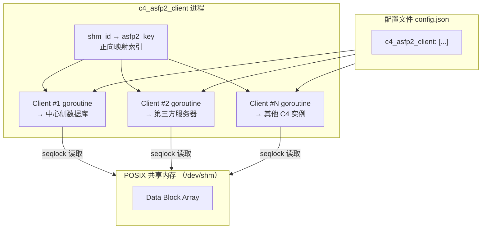
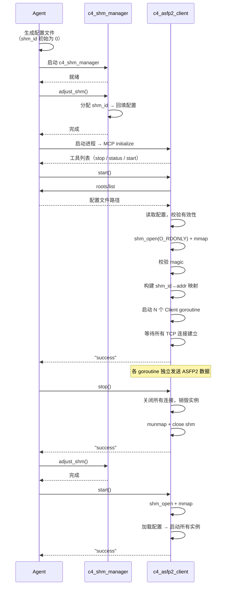
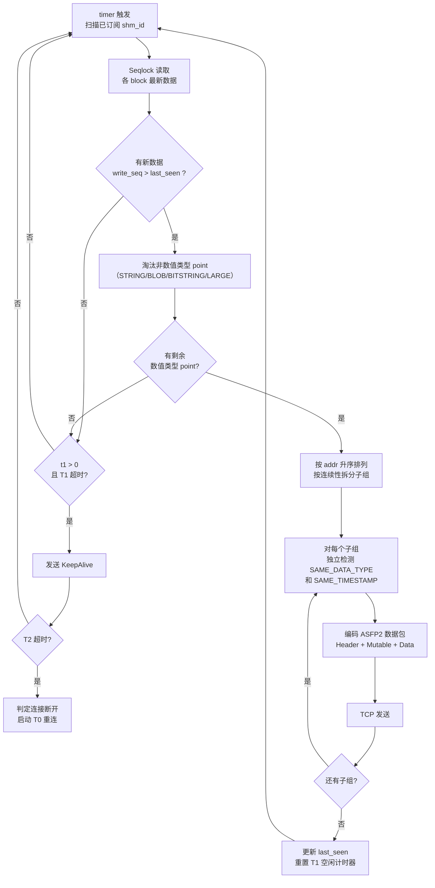

# C4 ASFP2 发送 MCP 服务设计

> **版本**：v0.1.1 | **最后更新**：2026-07-18 | **父文档**：[c4_architecture.md](c4_architecture.md) | **对应功能**：[C4_FUN_00059](../specification/c4_function.md), [C4_FUN_00047](../specification/c4_function.md), [C4_FUN_00060](../specification/c4_function.md)

---

本文档描述 `c4_asfp2_client` MCP 服务的详细设计，包括多实例启动、配置文件解析、
共享内存读取、ASFP2 数据包构造与发送、属性开关自动检测和 MCP 工具接口。
ASFP2 协议规范见 [asfp2_specification.md](../specification/asfp2_specification.md)，
共享内存布局和并发协议见 [c4_architecture.md](c4_architecture.md)。

---

## 1. 设计背景

`c4_asfp2_client` 是 C4 实例中负责发送 ASFP2 数据的 MCP 服务。单个二进制文件启动后，
根据配置文件中的实例列表（`c4_asfp2_client` 数组），启动多个 ASFP2 Client goroutine，
每个 goroutine 连接一个目标服务器，定时从共享内存读取已订阅 point 的数据，
按 ASFP2 协议最新版本编码后发送到中心侧或其他 C4 实例。

`c4_asfp2_client` 以 **Reader** 角色访问共享内存（`O_RDONLY` 模式），不参与共享内存的
创建或销毁——共享内存由 `c4_shm_manager` 创建。

```
                    配置文件 (config.json)
                          │
         ┌────────────────┼────────────────┐
         ▼                ▼                ▼
  ┌───────────┐   ┌───────────┐   ┌───────────┐
  │ Client #1  │   │ Client #2  │   │ Client #N  │   goroutine 实例
  │ → 中心侧DB │   │ → 第三方   │   │ → 其他C4  │
  └─────┬─────┘   └─────┬─────┘   └─────┬─────┘
        │  读取shm       │  读取shm       │  读取shm
        ▼                ▼                ▼
  ┌────────────────────────────────────────────┐
  │             POSIX 共享内存                  │
  └────────────────────────────────────────────┘
        │  ASFP2         │  ASFP2         │  ASFP2
        ▼                ▼                ▼
  中心侧服务器       第三方服务器     其他C4实例
```



### 1.1 角色定位

| 属性 | 值 |
|------|-----|
| MCP 服务类型 | Reader |
| 共享内存访问模式 | `O_RDONLY` |
| 实例模型 | 单二进制，多 goroutine（每个配置项一个 Client 实例） |
| 共享内存创建/销毁 | 不参与（由 `c4_shm_manager` 管理） |
| 生命周期管理 | Agent 通过 MCP 工具控制 |
| 发送协议版本 | 默认 ASFP2 最新版本（`ASFPV211`） |
| 数据类型限制 | 仅支持数值类型（BOOLEAN / INT* / UINT* / FLOAT* / BIT） |

---

## 2. 配置文件

### 2.1 配置结构

`c4_asfp2_client` 的配置位于全局配置文件（如 `/etc/c4/config.json`）的
`c4_asfp2_client` 顶层 key 下，值为实例配置数组。每个元素代表一个独立的
ASFP2 发送实例。

与 `c4_asfp2_server` 不同，Client 端的属性开关（`KEY_SEQUENCE` / `SAME_DATA_TYPE` /
`SAME_TIMESTAMP`）**不在配置文件中指定**，而是在每次打包时自动检测当前数据是否符合条件——
符合则打开，不符合则关闭。同样，points 中不再需要 `valid`、`coeff`、`base` 字段。

```json
{
    "c4_asfp2_client": [
        {
            "name": "转发到中心测数据库服务器",
            "ip": "172.16.109.11",
            "port": 9999,
            "t0": 30,
            "t1": 0,
            "t2": 0,
            "smart": 1,
            "forward_kack": 255,
            "inverse_keep": 0,
            "timer": 100,
            "points": [
                {"key": "hnals_1_scada.windspeed", "addr": 1000, "shm_id": 1},
                {"key": "hnals_1_scada.temperature", "addr": 1001, "shm_id": 2}
            ]
        },
        {
            "name": "转发到第三方数据服务器",
            "ip": "172.16.109.13",
            "port": 9999,
            "t0": 30,
            "t1": 0,
            "t2": 0,
            "smart": 1,
            "forward_kack": 255,
            "inverse_keep": 0,
            "timer": 100,
            "points": [
                {"key": "hnals_2_scada.windspeed", "addr": 8002, "shm_id": 3},
                {"key": "hnals_2_scada.temperature", "addr": 8003, "shm_id": 4}
            ]
        }
    ]
}
```

### 2.2 实例级别字段

| 字段 | 类型 | 默认值 | 说明 |
|------|------|--------|------|
| `name` | string | — | 实例名称，用于日志和监控标识 |
| `ip` | string | — | 目标服务器 IP 地址 |
| `port` | int | — | ASFP2 服务端口 |
| `t0` | int | — | 连接超时（秒） |
| `t1` | int | `0` | 正向 KeepAlive 发送间隔（秒）。`0` 表示关闭 T1 定时器（不发送心跳），此时 `t2` 无效。`t1 > 0` 时作为空闲超时定时器——仅在 t1 秒内无数据发送时才发送 KeepAlive |
| `t2` | int | `0` | 正向 KeepAlive 应答超时（秒）。仅在 `t1 > 0` 时有效。`0` 表示关闭 T2 应答等待（不检测对端存活性），约束 `t2 < t1` |
| `smart` | int | — | 时间戳毫秒归零：`1`=归零（提高包聚合率和压缩率），`0`=保留毫秒精度 |
| `forward_kack` | int | — | 正向 KeepAlive Ack 字节值（典型 255） |
| `inverse_keep` | int | — | 反向 KeepAlive 字节值（典型 0） |
| `timer` | int | — | 转发周期（毫秒），即从共享内存读取并发送数据的间隔。设计约束：Reader 频率 10 倍于 Writer（Writer 为 1Hz），即 `timer ≤ 100`。典型配置 `timer=100`（100ms 间隔，10Hz） |

### 2.3 points 数组元素

每个 point 描述一个从共享内存 shm_id 到 ASFP2 协议地址（addr）的映射关系。

| 字段 | 类型 | 含义 |
|------|------|------|
| `key` | string | 引用的 Writer 采集点标识，格式为 `{service_id}.{point_id}`（如 `hnals_1_scada.windspeed`）。`c4_shm_manager` 根据此 key 填入与 Writer 端相同的 shm_id |
| `addr` | integer | ASFP2 协议中的 key（地址），编码到数据包的 Data 部分。取值范围 0 ~ 16777215 |
| `shm_id` | integer | 全局 shm_id，默认 0（未分配），由 `c4_shm_manager` 分配后回填 |

**已移除的字段**（与原有 ASFP2 客户端相比）：

| 移除字段 | 移除原因 |
|---------|---------|
| `valid` | C4 架构中不再支持倍率和偏移量变换——数据以原始值在共享内存中传递 |
| `coeff` | 同上 |
| `base` | 同上 |

### 2.4 全局配置中的声明

在全局配置的 `c4_shm_manager` 段中，`c4_asfp2_client` 声明为 Reader：

```json
{
    "c4_shm_manager": {
        "writer": ["c4_modbus_client", "c4_iec104_client", "c4_asfp2_server"],
        "reader": ["c4_asfp2_client", "c4_influxdb_client"]
    }
}
```

---

## 3. 启动流程 —— C4_FUN_00059

### 3.1 整体流程

```
启动阶段：
  1. Agent 生成配置文件，写入 c4_asfp2_client 实例列表
     （所有 point 的 shm_id 初始为 0）
  2. Agent 启动 c4_shm_manager（首个服务）
  3. Agent 调用 c4_shm_manager.adjust_shm()
     → 计算所需点数 → 分配 shm_id → 回填配置文件中 c4_asfp2_client 的 shm_id 字段
  4. Agent 启动 c4_asfp2_client 进程（仅注册 MCP 工具，无其他初始化）
  5. Agent 调用 c4_asfp2_client 的 `start` 工具
     → client 在工具 handler 中完成：
     a. 通过 roots/list 获取配置文件路径
     b. 读取 c4_asfp2_client 配置段
     c. 校验配置有效性（shm_id 合法性、addr 合法性等）
     d. 以 O_RDONLY 模式 shm_open 已有共享内存
     e. mmap 共享内存，校验 magic
     f. 构建 shm_id → asfp2_key 正向映射索引（内部数据结构）
     g. 为每个配置实例启动一个 goroutine，连接目标服务器
     h. 等待所有 goroutine 的 TCP 连接全部建立
     i. 返回 "success" 或 isError 报告失败原因
  6. Agent 收到成功应答 → c4_asfp2_client 进入运行状态

运行阶段：
  7. 各 goroutine 独立运行，定时从共享内存读取数据并发送
  8. Agent 通过 MCP 工具监控状态

扩容/调整阶段：
   9. Agent 执行 Stop-Start 协议：
      a. Agent 向 c4_asfp2_client 发送 `stop` → 销毁所有实例，释放连接
      b. Agent 调用 c4_shm_manager.adjust_shm()
      c. Agent 向 c4_asfp2_client 发送 `start`
         → client 重新加载配置 → 启动所有实例 → 返回
```



### 3.2 停止与重启 —— C4_FUN_00060

Agent 在需要调整共享内存容量或变更发送配置时，执行 Stop-Start 协议：

1. Agent 调用 `stop` → 关闭所有 TCP 连接，销毁全部实例，munmap 并关闭共享内存
2. Agent 调用 `c4_shm_manager.adjust_shm()` 完成共享内存调整
3. Agent 调用 `start` → 重新 `shm_open` + `mmap` 共享内存，加载配置文件，启动所有实例

`stop` 销毁所有实例并释放共享内存映射后，服务回到进程刚启动的状态。`start` 的执行流程与首次启动完全一致——无需区分"首次"和"重启"。

> **接口一致性**：`stop` 和 `start` 均无参数。`stop` → `adjust_shm` → `start` 三步操作，Agent 无需在服务间传递 shm_id 列表或容量参数。`start` 在 `stop` 之后可再次调用——与首次启动复用同一逻辑。
>
> **数据语义**：Stop-Start 后 `last_seen` 归零（随进程状态重置），导致重启时可能重复发送 stop 前最近一次已成功发送的数据项。客户端提供 **at-least-once** 发送语义，接收端应具备幂等处理能力。

---

## 4. 数据发送 —— C4_FUN_00047

### 4.1 发送循环

每个 Client goroutine 以 `timer` 为周期执行以下循环：

```
1. 扫描所有已订阅 shm_id 的 Data Block，通过 Seqlock 协议读取最新数据
2. 筛选 write_seq > last_seen 的 point（有新数据）
3. 淘汰非数值类型（STRING / BLOB / BITSTRING / LARGE_DATA_BLOCK）的 point
4. 若无剩余 point，且 t1 > 0，检查 T1 空闲超时 → 必要时发送 KeepAlive
5. 若有剩余 point：
   a. 按 addr 升序排列
   b. 按 addr 连续性拆分为多个子组（不连续处断开）
      → 每个子组独立打包（参见 §4.3）
   c. 对每个子组：
      - 独立检测 SAME_DATA_TYPE 和 SAME_TIMESTAMP 属性
      - 按检测结果编码 Header + Mutable + Data（参见 §4.4）
      - TCP 发送
   d. 重置 T1 空闲计时器
6. 返回步骤 1
```



### 4.2 共享内存读取

`c4_asfp2_client` 作为 Reader，遵循 [c4_architecture.md §2.4.2](c4_architecture.md)
定义的 Seqlock 协议从共享内存读取数据。

以 `O_RDONLY` 模式打开共享内存，全程只读。Writer 的写入不会阻塞 Reader，
Reader 在 `write_seq` 为奇数时跳过该轮（下一轮必定读到完成值）。

```go
func readBlock(shmPtr unsafe.Pointer, shmID uint32) (dataType uint8,
                timestamp uint64, value uint64, seq uint64, ok bool) {

    block := (*DataBlock)(unsafe.Pointer(shmPtr + uintptr(shmID)*32))

    // 1. 校验块完整性
    if atomic.LoadUint32(&block.magic) != MAGIC {
        return 0, 0, 0, 0, false
    }
    // 2. 块未激活
    if block.state == 0 {
        return 0, 0, 0, 0, false
    }

    for {
        s1 := atomic.LoadUint64(&block.write_seq)
        if s1&1 != 0 {
            // 奇数：writer 正在写，跳过本轮
            return 0, 0, 0, 0, false
        }
        dt := block.type
        ts := block.timestamp
        val := block.value
        s2 := atomic.LoadUint64(&block.write_seq)
        if s1 == s2 {
            return dt, ts, val, s1, true
        }
        // 重试（概率极低）
    }
}
```

**读取频率约束**：Reader 每 `timer` 毫秒轮询一次。Writer 为 1Hz（每 1000ms 写一次），
Reader 频率 10 倍于 Writer（`timer ≤ 100` → Reader ≥ 10Hz），确保不漏数据。
`write_seq` 在奇数时跳过（概率 ≈ 1/10），下一轮必定拿到完成值。

**Seqlock 安全约束**：`readBlock` 使用无界 `for` 循环重试 seqlock 读取。在 Writer 1Hz /
Reader ≥10Hz 的频率比下，seqlock 奇数窗口（~µs）与 Reader 轮询间隔（≤100ms）相差 5 个
数量级，**碰撞需要重试的概率 < 0.01%**。若违反此频率约束（如 `timer > 100` 或 Writer 频率 > 1Hz），
重试次数可能急剧增加。代码中以 `runtime.Gosched()` + 100 次上限作为防御性兜底保护。

### 4.3 属性开关自动检测

三个 Attribute 开关中，`KEY_SEQUENCE` 的发生概率最高——同一转发目标的点通常按连续 addr 分配，
数据更新也是整批到达。因此以 **KEY_SEQUENCE 为优先分组维度**：按 addr 连续性拆分子组，
每个子组再独立检测其余两个开关。

**检测流程**：

```
1. 收集所有 write_seq 变化的 point
2. 淘汰非数值类型（type 为 STRING / BLOB / BITSTRING / LARGE_DATA_BLOCK）的 point
   → 仅保留数值类型（BOOLEAN / INT* / UINT* / FLOAT* / BIT）
3. 按 addr 升序排列
4. 按 addr 连续性拆分为多个子组：
   遍历排序后的 point，若 addr[i] != addr[i-1] + 1，则此处断开，开启新子组
   → 每个子组内保证 KEY_SEQUENCE 成立，每个子组独立打包

5. 对每个子组独立检测：
   a. KEY_SEQUENCE → 子组内已保证连续，固定 ✓
   b. SAME_DATA_TYPE：
      比较子组内所有 point 的 type，全部一致 → ✓，否则 ✗
   c. SAME_TIMESTAMP：
      - 若 smart=1：先将各 timestamp 的毫秒部分置 0，再比较
      - 若 smart=0：直接比较原始 timestamp
      - 全部一致 → ✓，否则 ✗
   d. 设置 Attribute = (KEY_SEQUENCE ? 0x01 : 0)
                        | (SAME_DATA_TYPE ? 0x02 : 0)
                        | (SAME_TIMESTAMP ? 0x04 : 0)

6. 每个子组按各自的 Attribute 独立编码为一个 ASFP2 数据包，依次发送
```

**示例**：

| 场景 | 有新数据的 addr | 拆分结果 | 各包 Attribute |
|------|----------------|---------|---------------|
| 全部连续 | 1,2,3,4,5,6,7,8,9,10 | 1 个子组 [1..10] | KEY_SEQUENCE + SAME_DATA_TYPE + SAME_TIMESTAMP（视实际情况） |
| 中间缺一个 | 1,2,3,5,6,7,8,9,10 | 2 个子组 [1..3], [5..10] | 两个子组各自独立判断 |
| 首尾各一段 | 1,2,3,7,8 | 2 个子组 [1..3], [7..8] | 两个子组各自独立判断 |
| 完全不连续 | 1,3,5,7,9 | 5 个子组（每个 1 个 point） | KEY_SEQUENCE 对单点无意义但无害，其余两开关按单点判断 |

> **注意**：单点子组（count=1）的三个开关全部成立——单个 key 天然是"连续的"，type 和 timestamp
> 与自身相同。此时编码开销与全手动编码等同（均 28+n 字节）。当 Count ≥ 2 时，
> 至多节省 12×(N−1) 字节（三个属性全部打开时）。开销可接受，无需特殊处理。

**开关效果**（与 c4_asfp2_server 不对称）：

与接收端（`c4_asfp2_server`）不同，发送端不依赖配置文件中的固定开关值——
每次打包时动态计算，且每次只对当前子组判断。即使上一轮 SAME_TIMESTAMP 不成立，
本轮 smart=1 归零后也可能成立。

### 4.4 数据包编码

#### 4.4.1 协议版本

`c4_asfp2_client` 默认按 ASFP2 最新版本（2.1.1）编码数据包。
Header Flag 为 `ASFPV211`。

| 版本特性 | 行为 |
|---------|------|
| Length 字段 | 4 字节，高 2 字节为 Attribute 高 2 字节 |
| FLOAT 类型 | 网络序（大端）传输 |
| T1 定时器 | 空闲超时模式 |

> **兼容性**：当前版本仅支持 2.1.1 发送。若未来需对接旧版本对端，可在实例配置中增加 `version` 字段指定发送版本。

#### 4.4.2 数据类型限制

`c4_asfp2_client` 仅发送数值类型的数据项。共享内存中 `type` 字段为非数值类型
（STRING / BLOB / BITSTRING / LARGE_DATA_BLOCK）的 block **不出现在发送批次中**，
静默跳过。

| 支持的类型 | 枚举值 | 编码字节数 |
|-----------|--------|-----------|
| BOOLEAN | 0 | 1 字节（非压缩模式）/ 1 位（压缩模式） |
| INT8 | 1 | 1 字节 |
| UINT8 | 2 | 1 字节 |
| INT16 | 3 | 2 字节 |
| UINT16 | 4 | 2 字节 |
| INT32 | 5 | 4 字节 |
| UINT32 | 6 | 4 字节 |
| INT64 | 7 | 8 字节 |
| UINT64 | 8 | 8 字节 |
| FLOAT16 | 9 | 2 字节 |
| FLOAT32 | 10 | 4 字节 |
| FLOAT64 | 11 | 8 字节 |
| BIT | 15 | 1 字节（非压缩模式）/ 1 位（压缩模式） |

**BIT 压缩模式**：当三个属性开关全部打开且 type 为 BOOLEAN（0）或 BIT（15）时，
Data 部分采用压缩编码——每个数据占用 1 位，字节对齐，每字节从低位到高位编号，
最后一个字节的高位填充 0。详见 [asfp2_specification.md §Data](../specification/asfp2_specification.md)。

#### 4.4.3 编码流程

```
输入：一个子组（已按 addr 连续排列）的有序 {type, addr, timestamp, value} 数据项
     子组内 KEY_SEQUENCE 已保证成立

1. 按 §4.3 检测本子组的 SAME_DATA_TYPE 和 SAME_TIMESTAMP flags

2. 编码 Header（16 字节）：
   - Flag：固定 "ASFPV211"（8 字节）
   - Length：Header + Mutable + Data 的总字节数（4 字节，含 Attribute 高 2 字节）
   - Count：本子组数据项个数（2 字节）
   - Attribute：本子组检测结果（低 2 字节），KEY_SEQUENCE 恒为 1
    注：Length 4 字节中的高 2 字节与 Attribute 高 2 字节重叠，
        实际编码：length_and_attr = (attr_high << 16) | length_low

3. 编码 Mutable（可变，根据 Attribute flags）：
   ├── KEY_SEQUENCE=1 → 写入 3 字节 first_key（本子组第一个 addr，网络序）
   ├── SAME_DATA_TYPE=1 → 写入 1 字节 type
   └── SAME_TIMESTAMP=1 → 写入 8 字节 timestamp（网络序）
       若 smart=1，此 timestamp 已在检测阶段（§4.3）将毫秒部分置 0

4. 编码 Data：
   ├── 若三个属性全部打开且 type 为 BOOLEAN（0）或 BIT（15）：
   │     → BIT 压缩模式（参见 §4.4.2）
   │     写入 ceil(Count / 8) 字节，每字节从低位到高位编号（bit 0 = 第 1 项），
   │     最后一个字节的高位填充 0。不再执行逐 item 循环
   │
   └── 否则（非压缩模式），循环 Count 次，每个 item：
      ├── type（若 SAME_DATA_TYPE=0），1 字节
      ├── key（若 KEY_SEQUENCE=0），3 字节（网络序）—— 子组内恒不出现
      ├── timestamp（若 SAME_TIMESTAMP=0），8 字节（网络序）
      │     若 smart=1，将 timestamp 毫秒部分置 0 后再编码
      └── value（根据 type 计算字节数，网络序写入）
            - 整数类型：按各自长度以大端写入
            - FLOAT 类型：转为本机 IEEE 754 位模式后 → 大端写入
            - BOOLEAN / BIT（非压缩模式）：1 字节，最低位有效
```

#### 4.4.4 Smart 选项

当 `smart=1` 时，所有数据项的 timestamp 在编码前将其毫秒部分置 0：

```
timestamp = (timestamp / 1000) * 1000
```

此操作使同一秒内的数据项获得相同的时间戳，从而：
- 提高 `SAME_TIMESTAMP` 属性的命中率
- 增大单包的 point 聚合数，提升吞吐量
- 示例：`1768848814264` → `1768848814000`

### 4.5 TCP 连接与重连

每个 Client goroutine 维护一条到目标服务器的 TCP 长连接。

```
连接建立：
  net.Dial("tcp", "{ip}:{port}") → 成功 → 进入发送循环

连接断开（发送失败 / KeepAlive 超时）：
  → 关闭当前连接 → 启动 T0 定时器
  → T0 超时后 → net.Dial 重连 → 成功 → 进入发送循环
```

### 4.6 心跳处理

#### 正向 KeepAlive（客户端 → 服务端）

客户端在 T1 空闲超时（`t1` 秒内无数据包发送且无对端 KeepAlive）时发送 4 字节
`"KEEP"`，并启动 T2 等待服务端回复 1 字节 ACK。

```
Client → Server:  "KEEP"（4 字节）
Server → Client:  0xFF（1 字节，值 = 对端配置的 forward_kack）
```

**T1 重置条件**（任意一个发生即重置）：
- 发送了数据包
- 收到服务端的反向 KeepAlive（1 字节，值 ≠ forward_kack）

**T2 超时处理**：T2 超时未收到 ACK → 判定连接断开 → 关闭连接 → 启动 T0 重连。

#### 反向 KeepAlive（服务端 → 客户端）

服务端发送 1 字节 KeepAlive（值 = `inverse_keep`，典型 0），客户端收到后回复
4 字节 `"KACK"`。客户端收到反向 KeepAlive 后同时重置 T1 空闲计时器。

```
Server → Client:  0x00（1 字节，值 = inverse_keep）
Client → Server:  "KACK"（4 字节）
```

| 参数 | 方向 | 默认值 | 说明 |
|------|------|--------|------|
| `t1` | 客户端发出 | `0` | 正向 KeepAlive 空闲超时（秒）。`0` 关闭 T1（不发送心跳） |
| `t2` | 客户端等待 | `0` | 正向 KeepAlive 应答超时（秒）。`0` 不等待应答、不判定超时断开 |
| `forward_kack` | 对端发出 | — | 期望收到的正向 KeepAlive Ack 值（用于识别对端回复） |
| `inverse_keep` | 对端发出 | — | 对端反向 KeepAlive 字节值（用于区分正向 ACK 和反向 KA） |

### 4.7 shm_id → asfp2_key 映射索引

进程启动时从配置文件的 points 数组构建内存索引：

```go
// 内部索引结构
type PointMapping struct {
    ShmID    uint32
    Asfp2Key uint32
}

// map[shm_id] → asfp2_key
var index map[uint32]*PointMapping
```

发送时扫描所有 shm_id，读取对应 Data Block，以 asfp2_key 编码到 ASFP2 数据包中。
每个 shm_id 独立维护 `last_seen`（`map[shm_id]uint64`），
仅当 `write_seq > last_seen[shmId]` 时才视为新数据参与打包，打包后更新 `last_seen`。

---

## 5. MCP 工具接口

`c4_asfp2_client` 实现所有数据路径 MCP 服务通用生命周期工具（定义见
[c4_architecture.md §3.3.1](c4_architecture.md)），此外提供状态查询工具。

### 5.1 通用工具

#### Tool: `start`

加载配置文件、附加共享内存、启动所有 ASFP2 Client goroutine。
**操作原子性**：全部实例的 TCP 连接建立成功才返回 `"success"`；任一实例连接失败则
tear down 已建立的 goroutine（关闭连接、清理资源），恢复到调用前状态，返回 `isError: true`。
**首次调用**完成服务初始化。**在 `stop` 之后可再次调用**——`stop` 已释放共享内存，
`start` 重新 `shm_open` + `mmap` 后加载最新配置并启动实例。与首次启动执行完全相同的流程。
**若服务当前处于运行状态（已 start 且未 stop），返回 `ALREADY_RUNNING`。**

**参数**：无

**返回值**：成功返回 `"success"`，失败返回 `isError: true`。

**错误码**：

| 错误码 | 含义 |
|--------|------|
| `ALREADY_RUNNING` | 服务当前处于运行状态，须先调用 `stop` |
| `CONFIG_PATH_MISSING` | `roots/list` 超时或未返回配置文件路径 |
| `CONFIG_PARSE_ERROR` | 配置文件格式错误或 `c4_asfp2_client` 段缺失 |
| `SHM_CORRUPTED` | 共享内存 magic 校验失败 |
| `SHM_OPEN_FAILED` | 无法打开共享内存（可能 `c4_shm_manager` 未创建） |
| `SHM_ID_NOT_ASSIGNED` | 配置中存在 shm_id 未分配（=0）的 point——shm_id 必须由 `c4_shm_manager` 回填后才能使用 |
| `CONNECT_FAILED` | 部分或全部实例 TCP 连接失败 |

**MCP 应答示例**：

```json
// ========== 成功 ==========
// --> 请求
{"jsonrpc": "2.0", "id": 1, "method": "tools/call", "params": {"name": "start", "arguments": {}}}
// <-- 应答
{"jsonrpc": "2.0", "id": 1, "result": {"content": [{"type": "text", "text": "success"}], "isError": false}}

// ========== 业务错误：连接失败 ==========
// <-- 应答
{"jsonrpc": "2.0", "id": 1, "result": {"content": [{"type": "text", "text": "CONNECT_FAILED: connect to 172.16.109.11:9999 failed: connection refused"}], "isError": true}}
```

---

#### Tool: `stop`

关闭所有 TCP 连接，销毁全部实例，服务回到初始化完成但未启动的状态。
`stop` 之后可调用 `start` 重新启动。
**若 `start` 从未成功调用过，返回 `SERVICE_NOT_READY`。**

**参数**：无

**返回值**：成功返回 `"success"`。

### 5.2 状态查询工具

#### Tool: `status`

查询各 Client 实例的运行状态和数据统计。**若 `start` 从未成功调用过，返回 `SERVICE_NOT_READY`。**

**参数**：无

**返回值示例**：

```json
{
    "instances": [
        {
            "name": "转发到中心测数据库服务器",
            "target": "172.16.109.11:9999",
            "state": "running",
            "points_count": 2,
            "stats": {
                "packets_sent": 15234,
                "items_sent": 30468,
                "items_skipped": 0,
                "send_errors": 0,
                "reconnects": 1
            }
        },
        {
            "name": "转发到第三方数据服务器",
            "target": "172.16.109.13:9999",
            "state": "running",
            "points_count": 2,
            "stats": {
                "packets_sent": 7621,
                "items_sent": 15242,
                "items_skipped": 0,
                "send_errors": 0,
                "reconnects": 0
            }
        }
    ]
}
```

| 统计指标 | 说明 |
|---------|------|
| `packets_sent` | 成功发送的 ASFP2 数据包总数 |
| `items_sent` | 成功发送的 data item 总数 |
| `items_skipped` | 跳过的 data item 数（type 为非数值类型） |
| `send_errors` | 发送失败次数 |
| `reconnects` | TCP 重连次数 |

---

## 6. 错误处理

| 场景 | 触发工具 | 处理方式 |
|------|---------|---------|
| `start` 在运行状态下再次调用 | `start` | 返回 `ALREADY_RUNNING` |
| `start` 从未成功调用过时调用 `stop`/`status` | `stop`、`status` | 返回 `SERVICE_NOT_READY` |
| `roots/list` 超时或路径缺失 | `start` | 返回 `CONFIG_PATH_MISSING` |
| 配置文件格式错误 | `start` | 返回 `isError: true` + `CONFIG_PARSE_ERROR` |
| 共享内存 magic 校验失败 | `start` | 返回 `SHM_CORRUPTED`，Agent 应重建共享内存后重试 |
| 无法打开共享内存 | `start` | 返回 `SHM_OPEN_FAILED` |
| 配置中存在 shm_id 未分配（=0） | `start` | 返回 `SHM_ID_NOT_ASSIGNED`——`c4_shm_manager` 必须先回填 |
| 部分实例 TCP 连接失败 | `start` | 返回 `CONNECT_FAILED`——tear down 已建立的 goroutine，恢复到调用前状态 |
| Seqlock 读取时 magic 失效 | 运行时 | 跳过该 block，记录错误日志 |
| 读取到非数值类型的 block | 运行时 | 跳过该 point，递增 items_skipped |
| TCP 发送失败 | 运行时 | 递增 send_errors → 关闭连接 → 启动 T0 重连 |
| TCP 连接断开 | 运行时 | 启动 T0 重连，重连成功后恢复发送 |
| KeepAlive 超时（T2） | 运行时 | 关闭连接 → 启动 T0 重连 |
| 单个 goroutine panic | 运行时 | recover 后重启 goroutine，不影响其他实例 |

---

## 7. 不变式

| 不变式 | 维护者 | 说明 |
|--------|--------|------|
| 共享内存只读访问 | 架构约束 | `O_RDONLY` 模式，永不写入共享内存 |
| shm_id → asfp2_key 映射覆盖所有 points | 启动时构建 | shm_id 未分配（=0）的 point 不应出现在运行配置中 |
| 读取前 magic 校验通过 | Reader（每次读取前） | magic 校验失败的 block 不读取 |
| 仅发送数值类型数据项 | 发送逻辑 | 非数值类型 block 静默跳过 |
| 发送协议版本固定为 ASFPV211 | 编码逻辑 | Header Flag 始终为最新版本 |
| Attribute flags 自动检测，不依赖配置 | 打包逻辑 | 每次打包独立检测，无状态 |
| 不创建/销毁共享内存 | 架构约束 | 仅 `c4_shm_manager` 管理共享内存生命周期 |
| 每轮仅发送有数据更新的 point | 发送循环 | `write_seq > last_seen[shmId]` 过滤 |
| 每个子组内 addr 严格连续递增 | KEY_SEQUENCE 分组 | 不连续处断开子组，子组内 `addr[i] == addr[0] + i` |
| 单数据包 Count ≤ 65535，Length ≤ 65535 | 编码逻辑 | ASFP2 协议硬约束（Count 2B + Length 16B 含 Header） |
| 各 goroutine 独立运行 | 并发模型 | 每个 Client goroutine 有独立的连接、last_seen map 和发送循环 |

---

## 8. 与 c4_asfp2_server 的对称性

| 维度 | c4_asfp2_server（接收） | c4_asfp2_client（发送） |
|------|------------------------|------------------------|
| 角色 | Writer | Reader |
| 共享内存访问 | `O_RDWR` | `O_RDONLY` |
| 映射方向 | addr → shm_id（反向） | shm_id → addr（正向） |
| 连接方向 | 监听端口（`net.Listen`） | 主动连接（`net.Dial`） |
| 数据流向 | TCP → 解析 → 写入 shm | 读取 shm → 编码 → TCP |
| 心跳方向 | 收到 `"KEEP"` → 回复 ACK | 发送 `"KEEP"` → 等待 ACK |
| 反向 KA | 主动发送 → 等待 `"KACK"` | 收到 → 回复 `"KACK"` |
| 协议版本 | 自动识别对端版本并适配解码 | 固定最新版本编码 |
| 属性开关 | 按对端数据包解析 | 自动检测并设置 |
| 数据类型 | 仅数值类型，变长类型丢弃 | 仅数值类型，非数值 block 跳过 |
| 生命周期工具 | `start` / `stop` / `status` | `start` / `stop` / `status` |
| 配置字段差异 | `port`、`t1`、`t2`、`forward_kack`、`inverse_keep` | `ip` + `port`、`t0`、`t1`、`t2`、`smart`、`forward_kack`、`inverse_keep`、`timer` |
| Points 字段 | `id`、`addr`、`shm_id` | `key`、`addr`、`shm_id` |

---

> **对应功能**：C4_FUN_00059, C4_FUN_00047, C4_FUN_00060
>
> **父文档**：[c4_architecture.md](c4_architecture.md)
