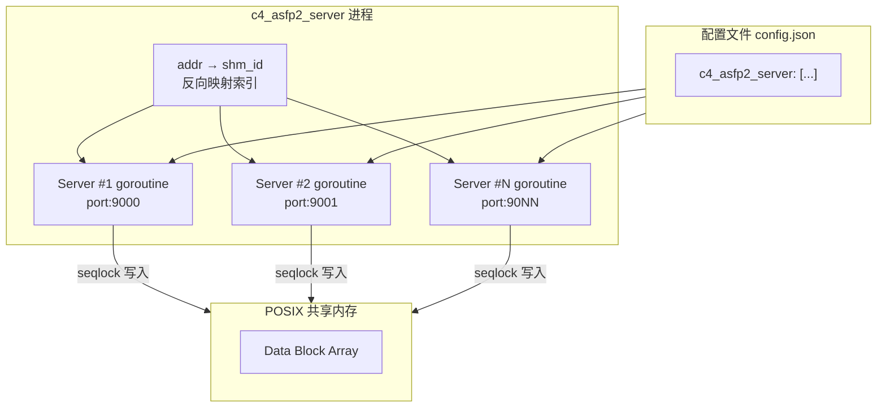
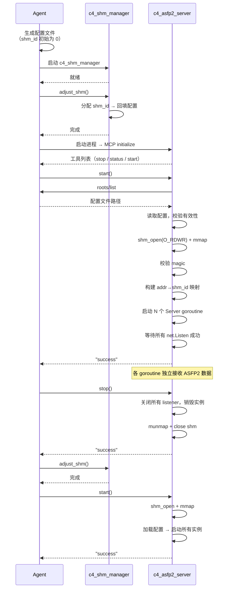
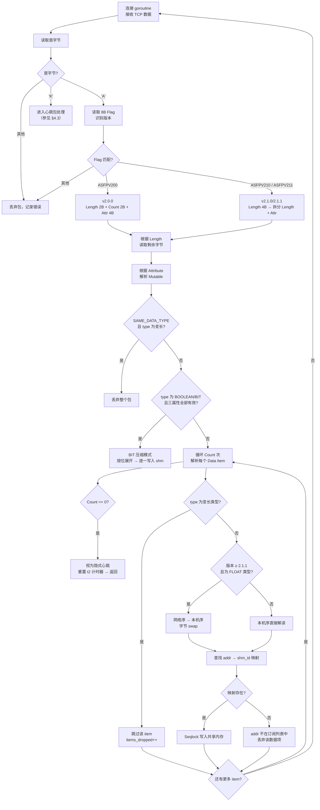

# C4 ASFP2 接收 MCP 服务设计

> **版本**：v0.2.0 | **最后更新**：2026-07-18 | **父文档**：[c4_architecture.md](c4_architecture.md) | **对应功能**：[C4_FUN_00042](../specification/c4_function.md), [C4_FUN_00057](../specification/c4_function.md), [C4_FUN_00058](../specification/c4_function.md)

---

本文档描述 `c4_asfp2_server` MCP 服务的详细设计，包括多实例启动、配置文件解析、
ASFP2 数据包接收与解析、共享内存写入和 MCP 工具接口。ASFP2 协议规范见
[asfp2_specification.md](../specification/asfp2_specification.md)，共享内存布局和并发协议见
[c4_architecture.md](c4_architecture.md)。

---

## 1. 设计背景

`c4_asfp2_server` 是 C4 实例中负责接收 ASFP2 数据的 MCP 服务。单个二进制文件启动后，
根据配置文件中的实例列表（`c4_asfp2_server` 数组），启动多个 ASFP2 Server goroutine，
每个 goroutine 在独立端口上监听连接，接收远程 C4 实例或兼容系统发来的 ASFP2 数据包，
解析后按 `addr → shm_id` 映射写入共享内存。

`c4_asfp2_server` 以 **Writer** 角色访问共享内存（`O_RDWR` 模式），不参与共享内存的
创建或销毁——共享内存由 `c4_shm_manager` 创建。

```
                   配置文件 (config.json)
                         │
          ┌──────────────┼──────────────┐
          ▼              ▼              ▼
   ┌───────────┐  ┌───────────┐  ┌───────────┐
   │ Server #1  │  │ Server #2  │  │ Server #N  │   goroutine 实例
   │ port:9000  │  │ port:9001  │  │ port:90NN  │
   └─────┬─────┘  └─────┬─────┘  └─────┬─────┘
         │  ASFP2        │  ASFP2        │  ASFP2
         ▼               ▼               ▼
   远程 C4 / 兼容系统   远程 C4 / 兼容系统   远程 C4 / 兼容系统
         │               │               │
         │  写入 shm      │  写入 shm      │  写入 shm
         ▼               ▼               ▼
   ┌─────────────────────────────────────────────┐
   │              POSIX 共享内存                   │
   └─────────────────────────────────────────────┘
```



### 1.1 角色定位

| 属性 | 值 |
|------|-----|
| MCP 服务类型 | Writer |
| 共享内存访问模式 | `O_RDWR` |
| 实例模型 | 单二进制，多 goroutine（每个配置项一个 Server 实例） |
| 共享内存创建/销毁 | 不参与（由 `c4_shm_manager` 管理） |
| 生命周期管理 | Agent 通过 MCP 工具控制 |

---

## 2. 配置文件

### 2.1 配置结构

`c4_asfp2_server` 的配置位于全局配置文件（如 `/etc/c4/config.json`）的
`c4_asfp2_server` 顶层 key 下，值为实例配置数组。每个元素代表一个独立的
ASFP2 Server 监听实例。

```json
{
    "c4_asfp2_server": [
        {
            "name": "接收I区风机数据服务",
            "id": "hnals_I_windturbine_receiver",
            "port": 9000,
            "t1": 0,
            "t2": 0,
            "forward_kack": 255,
            "inverse_keep": 0,
            "points": [
                {"id": "windturbine1_windspeed", "addr": 1000, "shm_id": 0},
                {"id": "windturbine1_winddirection", "addr": 1001, "shm_id": 0}
            ]
        },
        {
            "name": "接收I区升压站数据服务",
            "id": "hnals_I_transformer_receiver",
            "port": 9001,
            "t1": 0,
            "t2": 0,
            "forward_kack": 255,
            "inverse_keep": 0,
            "points": [
                {"id": "uab", "addr": 2000, "shm_id": 0},
                {"id": "uac", "addr": 2001, "shm_id": 0}
            ]
        }
    ]
}
```

### 2.2 实例级别字段

| 字段 | 类型 | 默认值 | 说明 |
|------|------|--------|------|
| `name` | string | — | 实例名称，用于日志和监控标识 |
| `id` | string | — | 实例标识符，全局唯一。与 point.id 组合形成 `{service_id}.{point_id}` 的全局 key |
| `port` | int | 首个实例从 `9000` 开始，后续递增 | ASFP2 服务端监听端口，每个实例必须唯一 |
| `t1` | int | `0` | 反向 KeepAlive 发送间隔（秒）。`0` 表示关闭 T1 定时器（不发送心跳），此时 `t2` 无效 |
| `t2` | int | `0` | 反向 KeepAlive 应答超时（秒）。仅在 `t1 > 0` 时有效。`0` 表示关闭 T2 应答等待（不检测对端存活性），约束 `t2 < t1` |
| `forward_kack` | int | — | 正向 KeepAlive Ack 字节值（典型 255） |
| `inverse_keep` | int | — | 反向 KeepAlive 字节值（典型 0） |

### 2.3 points 数组元素

每个 point 描述一个从 ASFP2 协议地址到共享内存 shm_id 的映射关系。

| 字段 | 类型 | 含义 |
|------|------|------|
| `id` | string | 采集点标识符。`{service_id}.{point_id}` 构成全局唯一 key，供 `c4_shm_manager` 通过 key 匹配分配 shm_id |
| `addr` | integer | ASFP2 协议中的 key（地址），用于匹配接收到的数据项。取值范围 0 ~ 16777215 |
| `shm_id` | integer | 全局 shm_id，默认 0（未分配），由 `c4_shm_manager` 分配后回填 |

**shm_id 分配时机**：Agent 在生成配置文件时先将所有 point 的 `shm_id` 置为 0，
随后调用 `c4_shm_manager.adjust_shm()` 完成点分配和 shm_id 回填。
`c4_asfp2_server` 启动时读取的配置中 shm_id 已是已分配的有效值。

### 2.4 全局配置中的声明

在全局配置的 `c4_shm_manager` 段中，`c4_asfp2_server` 声明为 Writer：

```json
{
    "c4_shm_manager": {
        "writer": ["c4_modbus_client", "c4_iec104_client", "c4_asfp2_server"],
        "reader": ["c4_asfp2_client", "c4_influxdb_client"]
    }
}
```

---

## 3. 启动流程

### 3.1 整体流程

```
启动阶段：
  1. Agent 生成配置文件，写入 c4_asfp2_server 实例列表
     （所有 point 的 shm_id 初始为 0）
  2. Agent 启动 c4_shm_manager（首个服务）
  3. Agent 调用 c4_shm_manager.adjust_shm()
     → 计算所需点数 → 分配 shm_id → 回填配置文件中 shm_id 字段
  4. Agent 启动 c4_asfp2_server 进程（仅注册 MCP 工具，无其他初始化）
  5. Agent 调用 c4_asfp2_server 的 `start` 工具
     → server 在工具 handler 中完成：
     a. 通过 roots/list 获取配置文件路径
     b. 读取 c4_asfp2_server 配置段
     c. 校验配置有效性（端口唯一性、addr 合法性等）
     d. 以 O_RDWR 模式 shm_open 已有共享内存
     e. mmap 共享内存，校验 magic
     f. 构建 addr → shm_id 反向映射索引（内部数据结构）
     g. 为每个配置实例启动一个 goroutine，监听对应端口
     h. 等待所有 goroutine 的 `net.Listen` 全部成功
     i. 返回 "success" 或 isError 报告失败原因
  6. Agent 收到成功应答 → c4_asfp2_server 进入运行状态

运行阶段：
  7. 各 goroutine 独立运行，接收 ASFP2 连接和数据
  8. Agent 通过 MCP 工具监控状态

扩容/调整阶段：
   9. Agent 执行 Stop-Start 协议：
      a. Agent 向 c4_asfp2_server 发送 `stop` → 销毁所有实例，释放端口
      b. Agent 调用 c4_shm_manager.adjust_shm()
      c. Agent 向 c4_asfp2_server 发送 `start`
         → server 重新加载配置 → 启动所有实例 → 返回
```



### 3.2 端口冲突处理

若配置中多个实例指定了相同的 `port`，`start` 工具返回 `isError: true` 并携带错误码 `PORT_CONFLICT`。

### 3.3 停止与重启 —— C4_FUN_00058

Agent 在需要调整共享内存容量或变更接收配置时，执行 Stop-Start 协议：

1. Agent 调用 `stop` → 关闭所有 TCP 监听端口和活跃连接，销毁全部实例，munmap 并关闭共享内存
2. Agent 调用 `c4_shm_manager.adjust_shm()` 完成共享内存调整
3. Agent 调用 `start` → 重新 `shm_open` + `mmap` 共享内存，加载配置文件，启动所有实例

`stop` 销毁所有实例并释放共享内存映射后，服务回到进程刚启动的状态。`start` 的执行流程与首次启动完全一致——无需区分"首次"和"重启"。

> **接口一致性**：`stop` 和 `start` 均无参数。`stop` → `adjust_shm` → `start` 三步操作，Agent 无需在服务间传递 shm_id 列表或容量参数。`start` 在 `stop` 之后可再次调用——与首次启动复用同一逻辑。

---

## 4. 数据接收与解析

### 4.1 连接处理

每个 Server goroutine 执行标准的 TCP Accept 循环：

```
1. net.Listen("tcp", ":{port}")
2. for {
       conn := listener.Accept()
       go handleConnection(conn)   // 每个连接独立 goroutine
   }
```

### 4.2 ASFP2 数据包解析流程

每个连接 goroutine 从 TCP 流中读取 ASFP2 数据包，按以下流程解析。
接收端支持 ASFP2 协议的所有已发布版本（2.0.0 / 2.1.0 / 2.1.1），
根据 Header Flag 自动识别版本并采用对应的解码规则。

```
 收到 TCP 数据
    │
    ▼
读取首字节判断包类型：
  - 首字节 == 'K' → 进入心跳包处理（参见 §4.3）
  - 首字节 == 'A' → 进入数据包解析
  - 其他 → 丢弃包，记录错误
    │
    ▼
读取 8 字节 Flag（含首字节）：
  - "ASFPV200" → 版本 2.0.0
  - "ASFPV210" → 版本 2.1.0
  - "ASFPV211" → 版本 2.1.1
  - 其他 → 丢弃包，记录错误
    │
    ▼
根据版本读取 Length + Count + Attribute：
  - 2.0.0：Length 2B + Count 2B + Attribute 4B（共 8B）
  - 2.1.0/2.1.1：Length 4B（高 2B 为 Attribute 高 2B）+ Count 2B + Attribute 低 2B（共 8B）
    从 Length 高 2B 还原 Attribute 高 2B：
    attribute_high = (length >> 16) & 0xFFFF
    length = length & 0xFFFF
    attribute = (attribute_high << 16) | attribute_low
    │
    ▼
根据 Length 读取剩余字节
    │
    ▼
根据 Attribute 解析 Mutable：
  ├── KEY_SEQUENCE 有效 → 读取 3 字节 first_key
  ├── SAME_DATA_TYPE 有效 → 读取 1 字节 type
 ├── SAME_TIMESTAMP 有效 → 读取 8 字节 timestamp
    │
    ▼
 若 SAME_DATA_TYPE 有效且 type 为变长类型 → 丢弃整个包
 （变长类型：STRING / BLOB / BITSTRING / LARGE_DATA_BLOCK，
  其数据无法存入固定 8 字节的共享内存 value 字段）
    │
    ▼
若 type 为 BOOLEAN（0）或 BIT（15）
 且三属性（KEY_SEQUENCE / SAME_DATA_TYPE / SAME_TIMESTAMP）全部有效
 → BIT 压缩模式：按位解析（不再逐项读取 value）
   读取 ceil(Count / 8) 字节，每字节从低位到高位编号（bit 0 = 第 1 项），
   最后一个字节的高位填充 0。逐位展开为 Count 个值后按 key 递增写入 shm。
    │
    ▼ （非压缩模式）
循环 Count 次，解析每个 Data Item：
  ├── type（若 Mutable 无 type，从 item 中读 1 字节）
  │     └── 若 type 为变长类型 → 丢弃该 item（跳至下一 item，递增 items_dropped）
  │         （变长类型：STRING / BLOB / BITSTRING / LARGE_DATA_BLOCK，
  │          其数据无法存入固定 8 字节的共享内存 value 字段）
  ├── key（若 Mutable 无 key，从 item 中读 3 字节；否则用 first_key + i）
 ├── timestamp（若 Mutable 无 timestamp，从 item 中读 8 字节）
 └── value（根据 type 计算字节数，读对应字节，正确消耗流位置）
      - FLOAT 类型（FLOAT16/FLOAT32/FLOAT64）：
        若版本 ≥ 2.1.1 → 从网络序（大端）转为本机序
        若版本 < 2.1.1 → 本机序直接解读，不做字节 swap
      - 整数类型、Timestamp、Length 始终使用网络序
    │
    ▼
对于每个解析出的 data item，执行写入共享内存流程（参见 §5）
```



### 4.3 心跳处理

ASFP2 协议的心跳包以 `'K'` 开头，与数据包（`'A'`）在首字节即区分。
TCP 流中读到首字节为 `'K'` 后，继续读取 3 字节以识别心跳类型。

#### 正向 KeepAlive（客户端 → 服务端）

客户端发送 4 字节 `"KEEP"`，服务端收到后回复 1 字节 ACK（值 = `forward_kack`）。
服务端收到 `"KEEP"` 即表示客户端存活，重置与该连接关联的 t2 计时器。

```
Client → Server:  "KEEP"（4 字节）
Server → Client:  0xFF（1 字节，值 = forward_kack）
```

#### 反向 KeepAlive（服务端 → 客户端）

服务端按 t1 间隔（或空闲超时，参见 §4.3.1）向客户端发送 1 字节（值 = `inverse_keep`），
并启动 t2 等待应答。客户端收到后应回复 4 字节 `"KACK"`。服务端在 t2 内收到 `"KACK"`
即确认客户端存活，重置 t1 计时器；t2 超时则判定连接断开。

```
Server → Client:  0x00（1 字节，值 = inverse_keep）
Client → Server:  "KACK"（4 字节）
```

#### 心跳处理流程

```
读取首字节
    │
    ├── 'K' → 继续读 3 字节
    │         ├── "KEEP" → 正向 KA：回复 forward_kack（1 字节），重置 t2
    │         └── "KACK" → 反向 KA Ack：停止 t2，重置 t1
    │
    └── 'A' → 数据包解析（§4.2）
              └── Count == 0（空数据包）：视为隐式心跳，重置 t2 计时器
```

| 参数 | 方向 | 说明 |
|------|------|------|
| `forward_kack` | 服务端发出 | 响应正向 `"KEEP"` 时回复的 1 字节 ACK 值（典型 255） |
| `inverse_keep` | 服务端发出 | 反向 KeepAlive 时发送的 1 字节值（典型 0） |
| `t1` | 服务端发出 | 反向 KeepAlive 发送间隔（秒）。`0` 关闭 T1（不发送心跳），此时 `t2` 无效 |
| `t2` | 服务端等待 | 反向 KeepAlive 应答超时（秒），`t1 > 0` 时有效。`0` 关闭 T2（不等待应答、不判定超时断开）。约束 `t2 < t1` |

#### 4.3.1 T1 定时器行为

服务端在以下情况重置 T1（反向 KeepAlive 发送计时器）：

- 收到客户端发来的 `"KEEP"`（正向 KeepAlive）
- 收到客户端发来的 `"KACK"`（反向 KeepAlive 应答）
- 收到客户端发来的数据包（首字节 `'A'`，含 Count == 0 的空包）

仅当 T1 超时（期间无上述任何事件）时，服务端才发送 1 字节反向 KeepAlive（值 = `inverse_keep`）
并启动 T2 等待应答。

**连接断开处理**：T2 超时未收到 `"KACK"` → 关闭 TCP 连接，清理资源。
服务端 goroutine 继续 Accept 新连接。

---

## 5. 共享内存写入

### 5.1 addr → shm_id 映射索引

进程启动时从配置文件的 points 数组构建内存索引：

```go
// 内部索引结构
type PointMapping struct {
    ShmID uint32
}

// map[addr] → shm_id
var index map[uint32]*PointMapping
```

收到 ASFP2 数据包的 data item 时，以 item 的 key（addr）为键查找 index，
获取目标 shm_id 后写入共享内存。addr 不在 index 中的数据项被静默丢弃。

### 5.2 Seqlock 写入协议

`c4_asfp2_server` 作为 Writer，遵循 [c4_architecture.md §2.4.2](c4_architecture.md)
定义的 Seqlock 协议写入共享内存：

```go
func writeBlock(shmPtr unsafe.Pointer, shmID uint32, dataType uint8,
                timestamp uint64, value uint64, valueSize int) error {

    block := (*DataBlock)(unsafe.Pointer(shmPtr + uintptr(shmID)*32))

    // 1. 校验块完整性
    if atomic.LoadUint32(&block.magic) != MAGIC {
        return fmt.Errorf("block %d magic invalid", shmID)
    }

    // 2. 首次写入时激活块
    if block.state == 0 {
        block.state = 1
        atomic.StoreUint64(&block.write_seq, 0)
    }

    // 3. 获取全局序号
    // atomic.AddUint64(&header.global_write_seq, 1)  // 可选，按需

    // 4. 递增序列号为奇数，宣告写入开始
    atomic.AddUint64(&block.write_seq, 1)

    // 5. 写入数据
    block.timestamp = timestamp
    block.type = dataType
    copyValue(&block.value, value, valueSize)   // 大端写入

    // 6. 递增序列号为偶数，宣告写入完成
    atomic.AddUint64(&block.write_seq, 1)

    return nil
}
```

### 5.3 写入频率约束

ASFP2 接收端无独立的采集周期——写入频率取决于发送端的发包频率。
接收端在每次收到数据包后立即写入共享内存，不引入额外延迟。

---

## 6. MCP 工具接口

`c4_asfp2_server` 实现所有数据路径 MCP 服务通用生命周期工具（定义见
[c4_architecture.md §3.3.1](c4_architecture.md)），此外提供状态查询工具。

### 6.1 通用工具

#### Tool: `start`

加载配置文件、附加共享内存、启动所有 ASFP2 Server goroutine。
**首次调用**完成服务初始化。**在 `stop` 之后可再次调用**——`stop` 已释放共享内存，`start` 重新 `shm_open` + `mmap` 后加载最新配置并启动实例。与首次启动执行完全相同的流程。
**若服务当前处于运行状态（已 start 且未 stop），返回 `ALREADY_RUNNING`。**

**参数**：无

**返回值**：成功返回 `"success"`，失败返回 `isError: true`。

**错误码**：

| 错误码 | 含义 |
|--------|------|
| `ALREADY_RUNNING` | 服务当前处于运行状态，须先调用 `stop` |
| `CONFIG_PATH_MISSING` | `roots/list` 超时或未返回配置文件路径 |
| `CONFIG_PARSE_ERROR` | 配置文件格式错误或 `c4_asfp2_server` 段缺失 |
| `PORT_CONFLICT` | 配置中存在重复端口 |
| `SHM_CORRUPTED` | 共享内存 magic 校验失败 |
| `SHM_OPEN_FAILED` | 无法打开共享内存（可能 `c4_shm_manager` 未创建） |

**MCP 应答示例**：

```json
// ========== 成功 ==========
// --> 请求
{"jsonrpc": "2.0", "id": 1, "method": "tools/call", "params": {"name": "start", "arguments": {}}}
// <-- 应答
{"jsonrpc": "2.0", "id": 1, "result": {"content": [{"type": "text", "text": "success"}], "isError": false}}

// ========== 业务错误：端口重复 ==========
// <-- 应答
{"jsonrpc": "2.0", "id": 1, "result": {"content": [{"type": "text", "text": "PORT_CONFLICT: port 9000 duplicated across instances"}], "isError": true}}
```

---

#### Tool: `stop`

关闭所有 TCP 监听端口和活跃连接，销毁全部实例，服务回到初始化完成但未启动的状态。
`stop` 之后可调用 `start` 重新启动。
**若 `start` 从未成功调用过，返回 `SERVICE_NOT_READY`。**

**参数**：无

**返回值**：成功返回 `"success"`。

### 6.2 状态查询工具

#### Tool: `status`

查询各 Server 实例的运行状态和数据统计。**若 `start` 从未成功调用过，返回 `SERVICE_NOT_READY`。**

**参数**：无

**返回值示例**：

```json
{
    "instances": [
        {
            "id": "hnals_I_windturbine_receiver",
            "name": "接收I区风机数据服务",
            "port": 9000,
            "state": "running",
            "connections": 2,
            "points_count": 2,
            "stats": {
                "packets_received": 15234,
                "items_received": 30468,
                "items_written": 30468,
                "items_dropped": 0,
                "parse_errors": 0
            }
        },
        {
            "id": "hnals_I_transformer_receiver",
            "name": "接收I区升压站数据服务",
            "port": 9001,
            "state": "running",
            "connections": 1,
            "points_count": 2,
            "stats": {
                "packets_received": 7621,
                "items_received": 15242,
                "items_written": 15242,
                "items_dropped": 0,
                "parse_errors": 0
            }
        }
    ]
}
```

| 统计指标 | 说明 |
|---------|------|
| `packets_received` | 成功接收并解析的 ASFP2 数据包总数 |
| `items_received` | 解析出的 data item 总数 |
| `items_written` | 成功写入共享内存的 data item 数（addr 命中映射） |
| `items_dropped` | 丢弃的 data item 数（addr 不在映射中） |
| `parse_errors` | 数据包解析失败次数 |

---

## 7. 错误处理

| 场景 | 触发工具 | 处理方式 |
|------|---------|---------|
| `start` 在运行状态下再次调用 | `start` | 返回 `ALREADY_RUNNING` |
| `start` 从未成功调用过时调用 `stop`/`status` | `stop`、`status` | 返回 `SERVICE_NOT_READY` |
| `roots/list` 超时或路径缺失 | `start` | 返回 `CONFIG_PATH_MISSING` |
| 配置文件格式错误 | `start` | 返回 `isError: true` + `CONFIG_PARSE_ERROR` |
| 端口重复（配置冲突） | `start` | 返回 `isError: true` + `PORT_CONFLICT` |
| 单个端口被占用（非配置冲突） | `start` | 返回 `isError: true` + 具体端口；不影响其余实例 |
| 共享内存 magic 校验失败 | `start` | 返回 `SHM_CORRUPTED`，Agent 应重建共享内存后重试 |
| 无法打开共享内存 | `start` | 返回 `SHM_OPEN_FAILED` |
| ASFP2 Flag 不匹配 | 运行时 | 丢弃数据包，递增 parse_errors |
| ASFP2 数据包格式错误（Length 不匹配/截断） | 运行时 | 丢弃数据包，递增 parse_errors，关闭连接 |
| addr 不在映射表中 | 运行时 | 丢弃该 data item，递增 items_dropped |
| Seqlock 写入时 magic 失效 | 运行时 | 跳过该 block，记录错误日志 |
| TCP 连接断开 | 运行时 | 清理连接资源，goroutine 继续 Accept 新连接 |
| KeepAlive 超时 | 运行时 | 关闭连接，重置计时器 |
| 单个 goroutine panic | 运行时 | recover 后重启 goroutine，不影响其他实例 |

---

## 8. 不变式

| 不变式 | 维护者 | 说明 |
|--------|--------|------|
| 同一进程内 port 唯一 | 启动校验 | 拒绝重复 port 的配置 |
| addr → shm_id 映射覆盖所有 points | 启动/重载时构建 | shm_id 未分配（=0）的 point 不应出现在运行配置中 |
| 写入前 magic 校验通过 | Writer（每次写入前） | magic 校验失败的 block 不写入 |
| 不创建/销毁共享内存 | 架构约束 | 仅 `c4_shm_manager` 管理共享内存生命周期 |

---

> **对应功能**：C4_FUN_00042, C4_FUN_00057, C4_FUN_00058
>
> **父文档**：[c4_architecture.md](c4_architecture.md)
