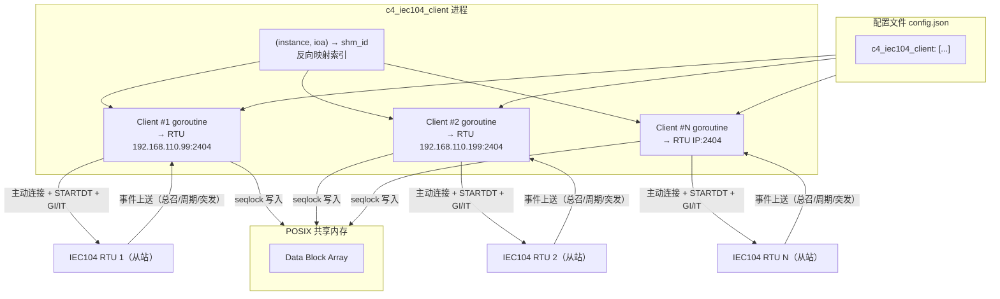
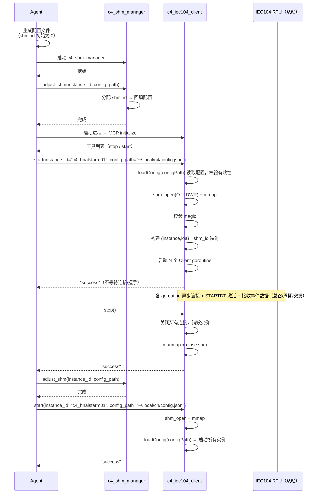
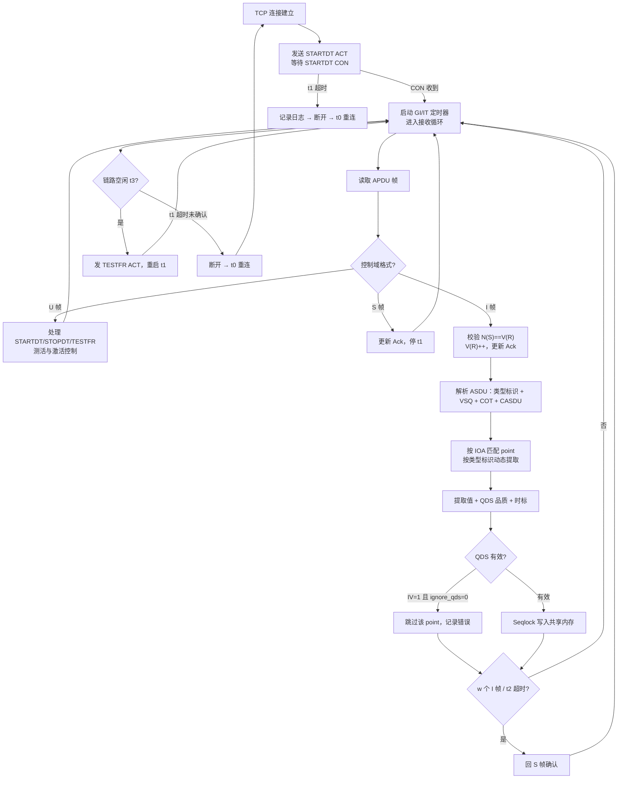

# C4 IEC104 采集 MCP 服务设计

> **版本**：v0.1.0 | **最后更新**：2026-08-17 | **父文档**：[c4_architecture.md](c4_architecture.md) | **对应功能**：[C4_FUN_00013](../specification/c4_function.md), [C4_FUN_00065](../specification/c4_function.md), [C4_FUN_00066](../specification/c4_function.md)

---

本文档描述 `c4_iec104_client` MCP 服务的详细设计，包括多实例启动、配置文件解析、
IEC 60870-5-104 主站采集、共享内存写入和 MCP 工具接口。协议规范见
[IEC 60870-5-101 FDIS](../../../docs/iec104/IEC60870-5-101-FDIS.pdf)（ASDU 应用服务数据单元定义）和
[IEC 60870-5-104 English](../../../docs/iec104/IEC60870-5-104english.pdf)（网络访问 APCI/APDU 定义），
共享内存布局和并发协议见 [c4_architecture.md](c4_architecture.md)。

> **参考实现**：本设计的协议语义（主站角色、窗口/超时、总召/对时、品质与时标处理）与现有 C 实现
> `acquisition/src/plugin/libplugin104/`（IEC 104 主站插件，基于 `infrastructure/src/protocol/libiec104`）
> 保持一致。注意 `acquisition/src/acquisition/iec104d/` 是**从站（被控站/服务器）**，不是本文档的参考对象。

---

## 1. 设计背景

`c4_iec104_client` 是 C4 实例中负责采集 IEC 60870-5-104 远动数据的 MCP 服务。单个二进制文件启动后，
根据配置文件中的实例列表（`c4_iec104_client` 数组），启动多个 Client goroutine，
每个 goroutine 作为 **IEC 104 主站（Controlling Station）** 主动连接一台 RTU / 远动装置，
执行数据传输激活（STARTDT）、总召唤（GI）和累计量召唤（IT），
接收从站上送的遥信 / 遥测 / 遥脉数据，按 `(instance, ioa) → shm_id` 映射写入共享内存。

`c4_iec104_client` 以 **Writer** 角色访问共享内存（`O_RDWR` 模式），不参与共享内存的
创建或销毁——共享内存由 `c4_shm_manager` 创建。

> **与 `c4_modbus_client` 的根本差异**：`c4_modbus_client` 是**轮询（请求/响应）**模型——主站按固定
> 周期主动发请求、从站被动应答；`c4_iec104_client` 是**事件驱动（从站主动上送）**模型——主站建立连接并
> 激活数据传输后，从站按总召 / 周期 / 突发主动推送数据，主站被动接收。此外 IEC 104 在 TCP 之上还定义了
> 应用层连接管理（STARTDT / STOPDT / TESTFR）、流量控制（发送/接收序号、k/w 窗口）和链路测活（t0~t3 超时），
> 协议复杂度显著高于 Modbus。两者差异详见 §9。

```
                     配置文件 (config.json)
                           │
           ┌───────────────┼───────────────┐
           ▼               ▼               ▼
    ┌───────────┐   ┌───────────┐   ┌───────────┐
    │ Client #1  │   │ Client #2  │   │ Client #N  │   goroutine 实例
    │ → RTU 1    │   │ → RTU 2    │   │ → RTU N    │
    └─────┬─────┘   └─────┬─────┘   └─────┬─────┘
          │  主动连接 + 事件接收  │              │
          ▼               ▼              ▼
       IEC 104         IEC 104        IEC 104
       RTU/远动装置     RTU/远动装置     RTU/远动装置
       (从站)           (从站)          (从站)
          │  上送数据      │  上送数据     │  上送数据
          │  (总召/周期/突发) │              │
          │  写入 shm      │  写入 shm     │  写入 shm
          ▼               ▼              ▼
    ┌─────────────────────────────────────────────┐
    │              POSIX 共享内存                   │
    └─────────────────────────────────────────────┘
```



### 1.1 角色定位

| 属性 | 值 |
|------|-----|
| MCP 服务类型 | Writer |
| 共享内存访问模式 | `O_RDWR` |
| 连接方向 | **主动连接** —— IEC 104 主站（Controlling Station，`is_server=0`） |
| 实例模型 | 单二进制，多 goroutine（每个配置项一个 Client 实例） |
| 采集模式 | **事件驱动**（从站主动上送），由 `gi_timer` 周期触发总召唤、`it_timer` 周期触发累计量召唤 |
| 协议层级 | TCP 之上实现 APCI（I/S/U 帧、序号、窗口、超时）+ ASDU（应用数据） |
| 共享内存创建/销毁 | 不参与（由 `c4_shm_manager` 管理） |
| 生命周期管理 | Agent 通过 MCP 工具控制 |

---

## 2. 配置文件

### 2.1 配置结构

`c4_iec104_client` 的配置位于全局配置文件（如 `~/.local/c4/config.json`）的
`c4_iec104_client` 顶层 key 下，值为实例配置数组。每个元素代表一个独立的
IEC 104 远动装置连接实例。

```json
{
    "c4_iec104_client": [
        {
            "name": "华能阿拉善1#主变",
            "id": "hnals_1_transformer",
            "ip": "192.168.110.99",
            "port": 2404,
            "k": 12,
            "w": 8,
            "t0": 30,
            "t1": 15,
            "t2": 10,
            "t3": 20,
            "modules": 32768,
            "common_address": 1,
            "ioa_size": 3,
            "discard_cp56time2a": 0,
            "ignore_qds": 0,
            "it_timer": 1000,
            "gi_timer": 1000,
            "points": [
                {"id": "alarm1", "addr": 1, "shm_id": 8},
                {"id": "uab", "addr": 16385, "shm_id": 5},
                {"id": "energy_total", "addr": 25601, "shm_id": 11}
            ]
        },
        {
            "name": "华能阿拉善2#主变",
            "id": "hnals_2_transformer",
            "ip": "192.168.110.199",
            "port": 2404,
            "k": 12,
            "w": 8,
            "t0": 30,
            "t1": 15,
            "t2": 10,
            "t3": 20,
            "modules": 32768,
            "common_address": 1,
            "ioa_size": 3,
            "discard_cp56time2a": 0,
            "ignore_qds": 0,
            "it_timer": 1000,
            "gi_timer": 1000,
            "points": [
                {"id": "alarm1", "addr": 1, "shm_id": 12},
                {"id": "ubc", "addr": 16386, "shm_id": 13}
            ]
        }
    ]
}
```

### 2.2 实例级别字段

| 字段 | 类型 | 默认值 | 说明 |
|------|------|--------|------|
| `name` | string | — | 实例名称，用于日志和监控标识 |
| `id` | string | — | 实例标识符，全局唯一。与 point.id 组合形成 `{service_id}.{point_id}` 的全局 key |
| `ip` | string | — | RTU / 远动装置 IP 地址 |
| `port` | int | `2404` | IEC 104 TCP 端口，标准 2404 |
| `k` | int | `12` | 发送窗口大小——未收到确认的 I 格式 APDU 最大数（协议参数 k） |
| `w` | int | `8` | 接收窗口大小——收到 I 格式 APDU 后须在 t2 内回 S 帧确认的阈值（协议参数 w） |
| `t0` | int | `30` | 连接建立超时（秒），失败后按此周期定时重连（`0` = 关闭） |
| `t1` | int | `15` | 发送 / 测试 APDU 超时（秒）——发送 I 帧或 TESTFR 后等待确认，超时则断开重连 |
| `t2` | int | `10` | 无数据报文时的确认超时（秒）——收到 I 帧但未凑满 w 个时，超时主动回 S 帧确认。约束 **t2 < t1** |
| `t3` | int | `20` | 链路空闲超时（秒）——空闲超时发送 TESTFR ACT 测活 |
| `modules` | int | `32768` | 发送/接收序号（N(S)/N(R)）的模数。**协议固定 15 位（模数 32768），不可配置**，启动校验必须等于 32768 |
| `common_address` | int | `1` | ASDU 公共地址（CASDU），收包时校验、发包时填入 |
| `ioa_size` | int | `3` | 信息对象地址（IOA）的字节数：`1` / `2` / `3`，决定 IOA 的编码宽度与取值范围（1 字节 0~255，2 字节 0~65535，3 字节 0~16777215） |
| `discard_cp56time2a` | int | `0` | 忽略设备时标（CP56Time2a）：`1`=丢弃设备时标、用本地接收时间作为 shm timestamp；`0`=使用设备时标（对带时标类型） |
| `ignore_qds` | int | `0` | 忽略品质描述字（QDS）：`1`=无视 IV 无效位、无效点也写入；`0`=IV=1 的点视为无效 |
| `it_timer` | int | `0` | 累计量召唤周期（毫秒）——周期发 C_CI_NA_1 请求累计量。`0`=禁用 |
| `gi_timer` | int | `1000` | 总召唤周期（毫秒）——周期发 C_IC_NA_1 请求全数据。`0`=禁用 |

### 2.3 points 数组元素

每个 point 描述一个从 IEC 104 信息对象地址（IOA）到共享内存 shm_id 的映射关系，
与 [c4_architecture.md §3.2.3](c4_architecture.md) 定义一致。

| 字段 | 类型 | 含义 |
|------|------|------|
| `id` | string | 采集点标识符。`{service_id}.{point_id}` 构成全局唯一 key，供 `c4_shm_manager` 通过 key 匹配分配 shm_id |
| `addr` | integer | 信息对象地址（IOA），字节数由实例级 `ioa_size` 决定（1/2/3 字节），取值 0 ~ (2^(8×ioa_size) − 1) |
| `shm_id` | integer | 全局 shm_id，默认 0（未分配），由 `c4_shm_manager` 分配后回填 |

> **IOA 字节数**：IEC 60870-5-101 §7.2.5 定义信息对象地址（IOA）为系统参数，长度 1 / 2 / 3 字节可选，
> 由实例级 `ioa_size` 配置指定。参考实现 `libiec104` 固定 3 字节编码（`uint32_t` 存储，wire 上 3 字节），
> 工业 104 应用亦普遍使用 3 字节，故默认 `ioa_size=3`。`ioa_size` 取 1 或 2 时按对应字节数编解码
> （1 字节 0~255，2 字节 0~65535），是对 `libiec104` 固定 3 字节的扩展。

> **为什么 points 不需要 `type` 字段**：与 Modbus 不同（Modbus 响应是无类型的寄存器字节，必须靠 point
> 预声明 `type` 才能解释），IEC 104 的每个 ASDU 自带 `type_identification`（DUID 首字节），主站收到帧
> 即知每个信息对象的类型，无需预配置。`type_identification → ASFP2 类型` 的映射是协议级固定关系
> （见 §4.3），由代码内置。
>
> **类型稳定性约束**：同一 IOA 可能被设备以不同 type 上报（如 M_ME_NB_1 周期上送 + M_ME_TE_1 事件上送，
> 或 M_ME_NC_1 与 M_ME_TF_1 混用），这些变体映射到**相同的 ASFP2 类型**（见 §4.3），故 `block.type` 实际稳定；
> 但若设备对同一 IOA 上报语义不同的类型（如遥信 vs 遥测），属设备侧配置错误，主站如实按实际类型写入，
> 下游 reader 需容忍。

**shm_id 分配时机**：Agent 在生成配置文件时先将所有 point 的 `shm_id` 置为 0，
随后调用 `c4_shm_manager.adjust_shm(instance_id, config_path)` 完成点分配和 shm_id 回填。
`c4_iec104_client` 启动时读取的配置中 shm_id 已是已分配的有效值。

### 2.4 全局配置中的声明

在全局配置的 `c4_shm_manager` 段中，`c4_iec104_client` 声明为 Writer：

```json
{
    "c4_shm_manager": {
        "writer": ["c4_modbus_client", "c4_iec104_client", "c4_asfp2_server"],
        "reader": ["c4_asfp2_client", "c4_influxdb_client"]
    }
}
```

---

## 3. 启动流程

### 3.1 整体流程 —— C4_FUN_00065

```
启动阶段：
  1. Agent 生成配置文件，写入 c4_iec104_client 实例列表
     （所有 point 的 shm_id 初始为 0）
  2. Agent 启动 c4_shm_manager（首个服务）
  3. Agent 调用 c4_shm_manager.adjust_shm(instance_id, config_path)
     → 计算所需点数 → 分配 shm_id → 回填配置文件中 shm_id 字段
  4. Agent 启动 c4_iec104_client 进程（仅注册 MCP 工具，无其他初始化）
  5. Agent 调用 c4_iec104_client 的 `start` 工具（传入 instance_id 和 config_path 参数）
     → client 在工具 handler 中完成：
     a. 从 config_path 参数获取配置文件绝对路径
     b. 通过 loadConfig(configPath) 读取 c4_iec104_client 配置段
      c. 校验配置有效性（shm_id 合法性、addr 合法性、addr 实例内唯一、t2<t1、modules=32768 等，非法返回 INVALID_POINT / INVALID_CONFIG，见 §7）
     d. 以 O_RDWR 模式 shm_open 已有共享内存
     e. mmap 共享内存，校验 magic
     f. 构建 (instance, ioa) → shm_id 反向映射索引（内部数据结构）
      g. 为每个配置实例启动一个 goroutine，异步发起连接和 STARTDT 激活
      h. 返回 "success"（不等待连接/握手，结果由各 goroutine 异步处理，见 §3.2）
  6. Agent 收到成功应答 → c4_iec104_client 进入运行状态

运行阶段：
  7. 各 goroutine 独立运行，接收从站上送数据并写入共享内存；按 gi_timer/it_timer 周期发起总召/累计量召唤
  8. Agent 通过 MCP 工具监控状态

扩容/调整阶段：
  9. Agent 执行 Stop-Start 协议：
     a. Agent 向 c4_iec104_client 发送 `stop` → 销毁所有实例，释放连接
     b. Agent 调用 c4_shm_manager.adjust_shm(instance_id, config_path)
     c. Agent 向 c4_iec104_client 发送 `start`
        → client 重新加载配置 → 启动所有实例 → 返回
```



### 3.2 数据传输激活（STARTDT）

与 Modbus 不同，IEC 104 在 TCP 连接建立后还需应用层握手激活数据传输。握手由各 Client
goroutine 在启动后异步执行（`start` 不等待握手结果，见 [c4_architecture.md §3.3.1](c4_architecture.md)）：

```
1. TCP 连接建立成功后，主站发送 U 格式 STARTDT ACT
2. 等待从站回 U 格式 STARTDT CON
   - 收到 CON → 数据传输已激活，进入运行态（启动 GI/IT 定时器）
   - t1 超时未收到 CON → 记录日志，断开连接，按 t0 周期重连重试
3. 数据传输激活前，主站不发送 I 格式 APDU，从站上送的 I 帧也应被丢弃（协议规定）
```

STARTDT 激活失败（t1 超时未收到 CON）属运行时事件，记录日志并触发重连，**不导致 `start`
返回错误**，也不 tear down 其他已启动的 goroutine。

### 3.3 停止与重启 —— C4_FUN_00066

Agent 在需要调整共享内存容量或变更采集配置时，执行 Stop-Start 协议：

1. Agent 调用 `stop` → 各实例先发送 STOPDT act 停用数据传输（尽力而为，t1 超时即强制关闭），随后关闭所有到 RTU 的 TCP 连接，销毁全部实例，munmap 并关闭共享内存
2. Agent 调用 `c4_shm_manager.adjust_shm(instance_id, config_path)` 完成共享内存调整
3. Agent 调用 `start`（传入 instance_id 和 config_path 参数）→ 重新 `shm_open` + `mmap` 共享内存，`loadConfig(configPath)` 加载配置文件，启动所有实例

`stop` 销毁所有实例并释放共享内存映射后，服务回到进程刚启动的状态。`start` 的执行流程与首次启动完全一致——无需区分"首次"和"重启"。

> **接口一致性**：`stop` 无参数；`start` 接受 `instance_id` 和 `config_path` 参数。`stop` → `adjust_shm` → `start` 三步操作，Agent 无需在服务间传递 shm_id 列表或容量参数。`start` 在 `stop` 之后可再次调用——与首次启动复用同一逻辑。

---

## 4. IEC 104 协议与数据采集

### 4.1 APDU 帧格式（APCI）

IEC 104 在 TCP 上传输 APDU，由 APCI（应用协议控制信息）与可选的 ASDU 组成。
**多字节字段遵循小端（低位在前）约定**（与 libiec104 及主流 104 实现的约定一致，区别于 Modbus 的大端）。
注：IEC 60870-5-101/104 将字节序作为系统参数而非强制小端。

```
APDU 帧（最大 255 字节 = 1 + 1 + 4 + 249）
┌──────────┬──────────┬──────────────────────────┬─────────────────────────┐
│  START   │  Length  │   Control field (4B)      │          ASDU           │
│  0x68    │  (1B)    │   （APCI 控制域）           │  （I 格式帧才有，≤249B）  │
│  (1B)    │          │                            │                         │
└──────────┴──────────┴──────────────────────────┴─────────────────────────┘
```

**Length**：控制域（4 字节）+ ASDU 的总字节数，取值 4 ~ 253。当 Length=4 时无 ASDU（S/U 帧）。

**控制域 3 种格式**（APCI，4 字节）：

```
I 格式（信息传输，octet1 bit0 = 0）：携带 ASDU，N(S)/N(R) 各 15 位（0~32767）
  octet1:  N(S) 低 7 位（bit7..1），bit0 = 0
  octet2:  N(S) 高 8 位（整字节，无保留位）
  octet3:  N(R) 低 7 位（bit7..1），bit0 = 0
  octet4:  N(R) 高 8 位（整字节，无保留位）

S 格式（监视功能，octet1 bit0 = 1, bit1 = 0）：仅确认，无 ASDU
  octet1:  0x01
  octet2:  0x00
  octet3:  N(R) 低 7 位（bit7..1），bit0 = 0
  octet4:  N(R) 高 8 位（整字节，无保留位）

U 格式（控制功能，octet1 bit0 = 1, bit1 = 1）：仅控制，无 ASDU
  octet1:  TESTFR(bit7 con/bit6 act) | STOPDT(bit5 con/bit4 act) | STARTDT(bit3 con/bit2 act) | 0x03
  octet2~4: 0x00
```

U 格式功能码（`format_u.function`）：

| 功能 | ACT（激活） | CON（确认） |
|------|------------|------------|
| STARTDT | `0x04` | `0x08` |
| STOPDT | `0x10` | `0x20` |
| TESTFR | `0x40` | `0x80` |

### 4.2 ASDU 结构

ASDU（应用服务数据单元）由「数据单元标识」与一个或多个「信息对象」组成（定义见 IEC 60870-5-101 §7.2）：

```
ASDU
├── 数据单元标识
│   ├── 类型标识 Type Identification       1B
│   ├── 可变结构限定词 VSQ                  1B   （bit7 = SQ 连续寻址标志，bit0..6 = 信息对象数量 number）
│   ├── 传送原因 COT                       2B   （低 6 位 = cause，bit6 = P/N，bit7 = T，高 8 位 = 源发地址）
│   └── 公共地址 CASDU                     2B
└── 信息对象 × number
    ├── 信息对象地址 IOA                   1/2/3B（由实例级 ioa_size 决定）
    ├── 信息元素集                          可变（由类型标识决定，含值 + 品质描述 QDS）
    └── 时标（可选）                       3B（CP24Time2a）或 7B（CP56Time2a），带时标类型才有
```

> **SQ 连续寻址**：VSQ 的 SQ=1 时，仅首信息对象携带 IOA（长度由 `ioa_size` 决定），后续信息对象地址依次 +1；
> SQ=0 时每个信息对象都携带完整 IOA。接收端解析时须按 SQ 展开地址。

### 4.3 类型标识与数据类型映射 —— C4_FUN_00013

IEC 104 的类型标识（Type Identification）决定信息元素的字节布局与数值解释方式。每个 ASDU 的
DUID 首字节即类型标识，主站收到帧后**按接收到的类型标识动态提取数值**并确定写入共享内存的
`block.type`——`type_identification → ASFP2 类型` 的映射是协议级固定关系，由代码内置，
points 无需预声明类型（与现有 C 实现 `libplugin104` 一致：点表仅以 IOA 为键）。

**C4 数据以原始值传递**：与 `c4_asfp2_client` / `c4_modbus_client` 一致，`c4_iec104_client`
**不执行需外部参数的变换**（不引入 `coeff` / `base` / `xmax` / `xmin` 字段）。
标度化值（M_ME_NB_1，SVA 为 I16 整数）与累计量（M_IT_NA_1，I32 整数）按原始整数写入共享内存，
倍率 / 偏移变换交由下游（如 `c4_influxdb_client`）处理；归一化值（M_ME_NA_1，NVA 为 F16 定点小数）
按固定换算 `nva / 32768` 转为 FLOAT32 写入——这是无外部参数的固定类型转换
（F16 定点小数 → IEEE 754 浮点），非数值变换（见下注）。

| 接收的类型标识 | 提取字段 | 写入 block.type (ASFP2) | 值字节 | 适用场景 |
|---------------|---------|------------------------|--------|---------|
| M_SP_NA_1 (1) / M_SP_TA_1 (2) / M_SP_TB_1 (30) | `siq.spi` | BOOLEAN (0) | 1 | 遥信（单点） |
| M_DP_NA_1 (3) / M_DP_TA_1 (4) / M_DP_TB_1 (31) | `diq.dpi` | UINT8 (2) | 1 | 遥信（双点） |
| M_ST_NA_1 (5) / M_ST_TA_1 (6) / M_ST_TB_1 (32) | `vti.value` | INT8 (1) | 1 | 步位 |
| M_ME_NA_1 (9) / M_ME_TA_1 (10) / M_ME_ND_1 (21) / M_ME_TD_1 (34) | `nva`（F16 定点小数） | FLOAT32 (10) | 4 | 遥测（归一化值） |
| M_ME_NB_1 (11) / M_ME_TB_1 (12) / M_ME_TE_1 (35) | `sva`（I16 整数） | INT16 (3) | 2 | 遥测（标度化值） |
| M_ME_NC_1 (13) / M_ME_TC_1 (14) / M_ME_TF_1 (36) | `value` | FLOAT32 (10) | 4 | 遥测（短浮点） |
| M_IT_NA_1 (15) / M_IT_TA_1 (16) / M_IT_TB_1 (37) | `bcr.counter_reading` | INT32 (5) | 4 | 遥脉（累计量） |
| 其他（位串 / 打包单点 / 事件等） | — | 跳过，不采集 | — | — |

> **归一化值（M_ME_NA_1）的 F16 定点小数**：IEC 60870-5-101 §7.2.6.6 定义 NVA 为 F16 定点小数
> （范围 -1 ~ +1-2⁻¹⁵，值 = `nva_int16 / 32768`），语义是归一化浮点值；而 SVA（M_ME_NB_1，§7.2.6.7）
> 是 I16 有符号整数。故 M_ME_NA_1 采集时按固定换算 `nva / 32768` 转为 FLOAT32 写入
> （无外部参数的固定类型转换，非数值变换），M_ME_NB_1 按原始 I16 整数写入 INT16。
>
> **未匹配 point 的 IOA 跳过**：收到 ASDU 后按信息对象地址（IOA）匹配 point 表，未匹配的 IOA 静默丢弃。
>
> **带时标 / 不带时标的差异**：同一数据点可能以不带时标（M_ME_NC_1）、3 字节时标（M_ME_TC_1，CP24Time2a）
> 或 7 字节时标（M_ME_TF_1，CP56Time2a）形式上送。三者信息元素的值字段相同、映射到相同的 ASFP2 类型，
> 仅带时标类型多 3 字节（CP24Time2a）或 7 字节（CP56Time2a）。时标是否采用由 `discard_cp56time2a` 决定（§4.5）。

### 4.4 品质描述 QDS 与 ignore_qds

遥测类信息对象携带 1 字节品质描述词 QDS，描述数据的质量：

```
QDS := {OV, RES(3), BL, SB, NT, IV}
  bit0 OV  溢出：值超出预定义范围
  bit1..3 RES 保留
  bit4 BL  闭锁：值被封锁传输
  bit5 SB  取代：值由操作员或自动源取代
  bit6 NT  非当前：最近更新未成功
  bit7 IV  无效：采集源异常，值不可信
```

单点遥信用 SIQ、双点遥信用 DIQ，结构与 QDS 类似（额外含 SPI/DPI 值位）。

**`ignore_qds` 语义**：

| `ignore_qds` | 行为 |
|--------------|------|
| `0`（默认） | 尊重品质位：IV=1 的点视为无效，**不写入共享内存**（跳过该 point，记录错误） |
| `1` | 忽略品质位：IV=1 的点仍按原始值写入共享内存 |

> 与现有 C 实现（libplugin104）一致：`valid = ignore_qds || !qds.iv`。注意 M_ME_ND_1（无品质描述）
> 恒视为有效；M_IT_* 累计量用 `bcr.sequence_notation.iv` 判定。

### 4.5 时标 CP56Time2a 与 discard_cp56time2a

带时标类型的信息对象末尾携带时标：TA/TC 变体（M_SP_TA_1 / M_ME_TC_1 等）为 3 字节 CP24Time2a
（毫秒~分钟），TB/TD/TE/TF 变体（M_SP_TB_1 / M_ME_TF_1 等）为 7 字节 CP56Time2a（毫秒~年）。

```
CP56Time2a := {milliseconds(2B), minutes, hours, day_of_month(低5位)+day_of_week(高3位), months, years}
  各字段为二进制编码；milliseconds 为完整 16 位（0~59999，无保留位）；
  minutes 的 bit7 为 IV 位，hours 的 bit7 为 SU（夏令时）位；
  day_of_month 与 day_of_week 共享同一字节（低 5 位 = 日 1~31，高 3 位 = 星期 1~7）；
  years 0~99，解码时用当前世纪补齐
```

**`discard_cp56time2a` 语义**：

| `discard_cp56time2a` | shm timestamp 来源 |
|----------------------|-------------------|
| `0`（默认） | 带时标类型：解码 CP56Time2a 为 Unix 纪元毫秒；不带时标类型：用本地接收时间 |
| `1` | 一律丢弃设备时标，用本地接收时间（本服务解析完成时刻） |

> 解码 CP56Time2a 时须处理：`minutes.bit7` 为 IV 标志位、`hours.bit7` 为 SU（夏令时）标志位，
> 年份用当前世纪补齐（2 位年份 → 2000~2099）。CP24Time2a（3 字节）仅含 milliseconds + minutes + IV 位，
> 无日/月/年信息，解码后仅有「当日毫秒」语义，无法还原完整日期。

### 4.6 窗口与超时机制

IEC 104 在应用层实现流量控制与链路测活，主站须维护每连接的序号与定时器状态。

**发送/接收序号**（每实例独立）：

```
V(S)  发送状态变量 —— 下一个待发送 I 帧的序号 N(S)
V(R)  接收状态变量 —— 下一个期望收到的 I 帧序号
Ack   已确认序号 —— 从站通过 N(R) 确认的最大序号
```

- 发送 I 帧：`N(S) = V(S)`，`N(R) = V(R)`，发送后 `V(S) = (V(S)+1) mod 32768`
- 收到 I 帧：校验 `N(S) == V(R)`（乱序即断开重连），`V(R) = (V(R)+1) mod 32768`，`Ack = N(R)`
- 收到确认：从站返回 `N(R)` 表示「≤ N(R)-1 的 I 帧均已正确接收」，`Ack == V(S)` 时停 t1
- 序号取模 32768（15 位）

**窗口**：

| 参数 | 语义 |
|------|------|
| `k` | 发送窗口——未收到确认的 I 帧最大数 |
| `w` | 接收窗口——收到 w 个 I 帧后须回 S 帧确认 |

主站收到 w 个 I 帧（且无待发 I 帧）时主动回 S 帧确认；或 t2 超时时回 S 帧确认。

**超时**：

| 参数 | 触发时机 | 超时动作 |
|------|---------|---------|
| `t0` | 连接建立 / 重连 | 未建立连接 → 关闭后按 t0 周期重连 |
| `t1` | 发送 I 帧或 TESTFR 后 | 未收到确认 → 判定链路异常，断开重连 |
| `t2` | 收到 I 帧但未凑满 w 个 | 超时主动回 S 帧确认（约束 t2 < t1） |
| `t3` | 链路空闲（无收发） | 发送 TESTFR ACT，并重启 t1 等待 TESTFR CON |

### 4.7 总召唤 GI 与累计量召唤 IT

主站通过 GI / IT 周期请求从站上送数据，二者共用「激活 → 确认 → 数据 → 终止」握手，且**互斥**（同一时刻仅一个进行中）。

**总召唤 GI**（`gi_timer > 0` 时启用）：

```
1. gi_timer 到期 → 发 C_IC_NA_1（传送原因 = 激活 ACT，QOI = 20 站总召唤）
2. 从站回 C_IC_NA_1 确认（ACTCON）→ 进入「总召唤进行中」状态
3. 从站上送全量数据（各类型标识的 I 帧）→ 逐点解析写入 shm
4. 从站回 C_IC_NA_1 终止（ACTTERM）→ 退出「总召唤进行中」状态，重启 gi_timer
5. 若 gi_timer × 2 时间内未收到 ACTTERM → 强制恢复，重启 gi_timer（防御性超时）
```

**累计量召唤 IT**（`it_timer > 0` 时启用）：

```
1. it_timer 到期 → 发 C_CI_NA_1（QCC = 冻结不复位 + 总请求，传送原因 = 激活 ACT）
2. 从站回确认 → 上送累计量数据（M_IT_NA_1 / M_IT_TB_1）→ 解析写入 shm
3. 从站回终止 → 重启 it_timer；it_timer × 2 超时强制恢复
```

**互斥**：GI 进行中时 IT 定时器挂起（反之亦然），避免召唤冲突（与现有 C 实现的
`g_integrated_status` 状态机一致）。

### 4.8 数据采集流程（事件驱动）

每个 Client goroutine 维护一条到 RTU 的长连接，事件驱动地接收数据：

```
连接阶段（各 goroutine 启动后异步执行，`start` 不等待）：
  1. TCP 连接（t0 超时，失败按 t0 周期重连）
  2. 连接建立后复位 V(S)=V(R)=0（新连接序号归零，标准要求）
  3. 发送 STARTDT ACT，等待 STARTDT CON（t1 超时，失败 → 记录日志，断开重连）
  4. 激活后启动 GI / IT 定时器（按配置）

接收循环（事件驱动）：
  1. 从 TCP 读取 APDU 帧
  2. 按控制域判定帧类型：
     - U 帧：处理 STARTDT/STOPDT/TESTFR 的 ACT/CON（测活、激活/停用数据传输）
     - S 帧：更新 Ack，停 t1
     - I 帧：校验 N(S) == V(R) → V(R)++ → 更新 Ack → 解析 ASDU（§4.2）→
       按 IOA 匹配 point，按类型标识提取值 + QDS 品质 + CP56Time2a 时标 →
       写共享内存（§5）→ 视 w/t2 回 S 帧确认
  3. 空闲时按 t3 周期发 TESTFR ACT 测活
  4. t1 超时（发送未确认）→ 判定链路异常 → 断开 → t0 周期重连

数据触发来源：
  - 总召唤 GI 响应（gi_timer 周期）
  - 累计量召唤 IT 响应（it_timer 周期）
  - 从站突发上送（变化数据，如变位遥信、越限遥测）
  - 从站周期上送（从站侧配置的循环数据）
```



---

## 5. 共享内存写入

### 5.1 映射索引

进程启动时从配置文件的 points 数组构建内存索引：

```go
// 内部索引结构
type PointMapping struct {
    ShmID uint32
}

// 映射键：实例 id + 信息对象地址 IOA
type Iec104Addr struct {
    InstanceID string // 实例 id（service_id），对应一个 RTU 连接
    IOA        uint32 // 信息对象地址（长度由实例级 ioa_size 决定）
}

// map[Iec104Addr] → PointMapping（按实例分片，每 goroutine 持一份）
var index map[Iec104Addr]*PointMapping
```

由于每个实例对应独立的 TCP 连接，实际实现中每个 Client goroutine 仅持有本实例的映射子表
（`map[uint32]PointMapping`，键为 IOA），无需跨实例检索。

### 5.2 Seqlock 写入协议

`c4_iec104_client` 作为 Writer，遵循 [c4_architecture.md §2.4.2](c4_architecture.md)
定义的 Seqlock 协议写入共享内存（与 `c4_modbus_client` / `c4_asfp2_server` 完全一致）：

```go
func writeBlock(shmPtr unsafe.Pointer, shmID uint32, dataType uint8,
                timestamp uint64, value uint64, valueSize int) error {

    block := (*DataBlock)(unsafe.Pointer(shmPtr + uintptr(shmID)*32))

    // 1. 校验块完整性
    if atomic.LoadUint32(&block.magic) != MAGIC {
        return fmt.Errorf("block %d magic invalid", shmID)
    }

    // 2. 首次写入时激活块
    if block.state == 0 {
        block.state = 1
        atomic.StoreUint64(&block.write_seq, 0)
    }

    // 3. 递增序列号为奇数，宣告写入开始
    atomic.AddUint64(&block.write_seq, 1)

    // 4. 写入数据
    block.timestamp = timestamp
    block.type = dataType
    copyValue(&block.value, value, valueSize)   // 本机序写入

    // 5. 递增序列号为偶数，宣告写入完成
    atomic.AddUint64(&block.write_seq, 1)

    return nil
}
```

**timestamp 语义**：由 `discard_cp56time2a` 决定（§4.5）——`0` 时带时标类型用设备 CP56Time2a
解码的 Unix 纪元毫秒差值，`1` 或非时标类型用本服务接收解析完成时刻的 Unix 纪元毫秒差值（本机序）。

**value 字节位置**：提取得到的本机序值按本机序（`binary.NativeEndian`）写入 `block.value` 的
**低位字节**（4 字节类型写 offset 0~3，2 字节类型写 offset 0~1，1 字节类型写 offset 0，高位字节补 0），
与 [c4_architecture.md §2.2.3](c4_architecture.md)「不足 8B 的类型在低位存储、高位补零」及
Reader 的本机序读取约定一致。

### 5.3 写入频率约束

`c4_iec104_client` 是事件驱动，写入频率**不固定**，取决于从站上送频率：

- **总召周期**（`gi_timer`）决定全量数据的刷新频率，设计约束 **gi_timer=1000（1Hz）**，
  与 [c4_architecture.md §2.4.2](c4_architecture.md) 中 "Writer 1Hz / Reader 10Hz" 的频率模型一致
- **突发上送**（变位遥信、越限遥测）可能瞬时高于 1Hz，属协议特性（事件驱动），不违背频率模型
- 累计量召唤（`it_timer`）周期可独立设置（典型 1000ms）

> 与 Modbus 的固定轮询周期（`timer`）不同，IEC 104 的数据到达时刻由从站决定。正常态下总召周期
> （gi_timer）主导数据刷新频率；从站侧配置的突发/周期上送是叠加在总召之上的额外数据源。

---

## 6. MCP 工具接口

`c4_iec104_client` 实现所有数据路径 MCP 服务通用生命周期工具（定义见
[c4_architecture.md §3.3.1](c4_architecture.md)）。

### 6.1 通用工具

#### Tool: `start`

加载配置文件、附加共享内存、启动所有 Client goroutine（各 goroutine 异步发起连接和 STARTDT 激活）。
**返回时机**：所有实例均已启动即返回 `"success"`，**不等待 TCP 连接和 STARTDT 激活**——连接/握手结果
记录到日志，由各 goroutine 的连接管理逻辑（§3.2、§4.8）异步处理（见 [c4_architecture.md §3.3.1](c4_architecture.md)）。
**首次调用**完成服务初始化。**在 `stop` 之后可再次调用**——`stop` 已释放共享内存，
`start` 重新 `shm_open` + `mmap` 后加载最新配置并启动实例。与首次启动执行完全相同的流程。
**若服务当前处于运行状态（已 start 且未 stop），返回 `ALREADY_RUNNING`。**

**参数**：`instance_id`（string，必填）—— C4 实例标识符（即共享内存名，须匹配 `c4_[a-zA-Z0-9]+`）；`config_path`（string，必填）—— 配置文件 config.json 的绝对路径

**返回值**：成功返回 `"success"`，失败返回 `isError: true`。

**错误码**：

| 错误码 | 含义 |
|--------|------|
| `ALREADY_RUNNING` | 服务当前处于运行状态，须先调用 `stop` |
| `CONFIG_PATH_MISSING` | `config_path` 参数缺失或无法读取指定文件 |
| `CONFIG_PARSE_ERROR` | 配置文件格式错误或 `c4_iec104_client` 段缺失 |
| `INVALID_CONFIG` | 实例级字段非法（`t2 ≥ t1`、`ioa_size` 非 1/2/3、`modules` 非 32768、`k`/`w` 超范围等），错误信息指明具体字段与取值 |
| `SHM_CORRUPTED` | 共享内存 magic 校验失败 |
| `SHM_OPEN_FAILED` | 无法打开共享内存（可能 `c4_shm_manager` 未创建） |
| `SHM_ID_NOT_ASSIGNED` | 配置中存在 shm_id 未分配（=0）的 point——shm_id 必须由 `c4_shm_manager` 回填后才能使用 |
| `INVALID_POINT` | point 字段非法（`addr` 等），错误信息指明具体字段与取值 |

**MCP 应答示例**：

```json
// ========== 成功 ==========
// --> 请求
{"jsonrpc": "2.0", "id": 1, "method": "tools/call", "params": {"name": "start", "arguments": {"instance_id": "c4_hnalsfarm01", "config_path": "~/.local/c4/config.json"}}}
// <-- 应答
{"jsonrpc": "2.0", "id": 1, "result": {"content": [{"type": "text", "text": "success"}], "isError": false}}

// ========== 业务错误：point 字段非法 ==========
// <-- 应答
{"jsonrpc": "2.0", "id": 1, "result": {"content": [{"type": "text", "text": "INVALID_POINT: point uab has invalid addr=16777216"}], "isError": true}}
```

---

#### Tool: `stop`

关闭所有到 RTU 的 TCP 连接，销毁全部实例，服务回到初始化完成但未启动的状态。
`stop` 之后可调用 `start` 重新启动。
**幂等：若 `start` 从未成功调用过（服务未运行），直接返回 `"success"`，不报错。**

**参数**：无

**返回值**：成功返回 `"success"`。

---

## 7. 错误处理

| 场景 | 触发工具 | 处理方式 |
|------|---------|---------|
| `start` 在运行状态下再次调用 | `start` | 返回 `ALREADY_RUNNING` |
| `start` 从未成功调用过时调用 `stop` | `stop` | 幂等，直接返回 `"success"` |
| `config_path` 参数缺失 | `start` | 返回 `CONFIG_PATH_MISSING` |
| 配置文件格式错误 | `start` | 返回 `isError: true` + `CONFIG_PARSE_ERROR` |
| 实例级字段非法（t2≥t1、ioa_size 非 1/2/3、modules 非 32768 等） | `start` | 返回 `isError: true` + `INVALID_CONFIG` |
| point 字段非法（addr 等） | `start` | 返回 `isError: true` + `INVALID_POINT`（消息指明字段与取值） |
| 共享内存 magic 校验失败 | `start` | 返回 `SHM_CORRUPTED`，Agent 应重建共享内存后重试 |
| 无法打开共享内存 | `start` | 返回 `SHM_OPEN_FAILED` |
| 配置中存在 shm_id 未分配（=0） | `start` | 返回 `SHM_ID_NOT_ASSIGNED`——`c4_shm_manager` 必须先回填 |
| TCP 连接失败（设备不可达/拒绝连接） | 运行时 | 记录日志 → t0 周期重连（§3.2） |
| STARTDT 激活失败（t1 超时） | 运行时 | 记录日志 → 断开 → t0 周期重连（§3.2） |
| I 帧序号乱序（N(S) ≠ V(R)） | 运行时 | 判定链路异常 → 关闭连接 → t0 重连 |
| t1 超时（发送 I 帧/TESTFR 未确认） | 运行时 | 判定链路异常 → 关闭连接 → t0 重连 |
| t2 超时（收到 I 帧未凑满 w） | 运行时 | 回 S 帧确认 |
| t3 超时（链路空闲） | 运行时 | 发 TESTFR ACT，重启 t1 |
| 未匹配 point 的 IOA | 运行时 | 跳过该信息对象（静默丢弃） |
| QDS 品质 IV=1 且 ignore_qds=0 | 运行时 | 跳过该 point，记录错误 |
| CP56Time2a 解码失败 | 运行时 | 回退为本地接收时间（与 discard_cp56time2a=1 等价） |
| Seqlock 写入时 magic 失效 | 运行时 | 跳过该 block，记录错误日志 |
| 单个 goroutine panic | 运行时 | recover 后重启 goroutine，不影响其他实例 |

> 注：上述运行时计数器（`errors`、`items_dropped` 等）仅用于内部日志与调试，当前无对外
> 读取接口（监控功能尚未实现，见 C4_FUN_00018）。

---

## 8. 不变式

| 不变式 | 维护者 | 说明 |
|--------|--------|------|
| 同一实例内 IOA 唯一 | 启动校验 | 每个 point 由实例 id + IOA 唯一标识，重复则视为配置错误 |
| (instance, ioa) → shm_id 映射覆盖所有 points | 启动/重载时构建 | shm_id 未分配（=0）的 point 不应出现在运行配置中 |
| 写入前 magic 校验通过 | Writer（每次写入前） | magic 校验失败的 block 不写入 |
| 不创建/销毁共享内存 | 架构约束 | 仅 `c4_shm_manager` 管理共享内存生命周期 |
| t2 < t1 | 启动校验 | 配置违反即 INVALID_CONFIG |
| ioa_size ∈ {1, 2, 3} | 启动校验 | 配置违反即 INVALID_CONFIG |
| modules == 32768 | 启动校验 | 协议固定 15 位序号，配置违反即 INVALID_CONFIG |
| N(S) 严格按 V(R) 递增（无乱序） | 接收校验 | 乱序即断开重连 |
| 序号取模 32768 | 发送/接收逻辑 | `V(S)`/`V(R)` 均按 32768（15 位）取模 |
| 新连接复位序号 | 连接管理 | 每次 TCP 重连后 V(S)=V(R)=0 |
| 数据以原始值传递（不变换） | 采集逻辑 | 不做 coeff/base/xmax/xmin 归一化/倍率变换 |
| GI 与 IT 互斥 | 召唤状态机 | 同一时刻仅一个召唤进行中 |
| 各 goroutine 独立运行 | 并发模型 | 每个 Client goroutine 有独立的连接、序号、定时器和轮询循环 |

---

## 9. 与 c4_modbus_client 的差异（事件驱动 vs 轮询）

`c4_iec104_client` 与 `c4_modbus_client` 虽同为「主动连接设备采集数据」的 Writer，但连接模型、
数据触发机制和协议复杂度有本质区别：

| 维度 | c4_modbus_client（Modbus/TCP） | c4_iec104_client（IEC 104） |
|------|-------------------------------|-----------------------------|
| 角色 | Writer | Writer |
| 共享内存访问 | `O_RDWR` | `O_RDWR` |
| 连接方向 | 客户端（`net.Dial`） | 主站（`net.Dial`，Controlling Station） |
| 数据触发机制 | **轮询**：按 `timer` 周期发请求，从站被动应答 | **事件驱动**：从站主动上送（总召/周期/突发），主站被动接收 |
| 数据方向 | 请求 → 响应（每请求一响应，transaction_id 配对） | 主站发召唤/控制命令，从站持续上送数据 |
| 应用层连接管理 | 无（TCP 建立即传输） | **有**：STARTDT/STOPDT 激活、TESTFR 测活 |
| 流量控制 | 无 | **有**：N(S)/N(R) 序号、k/w 窗口、S 帧确认 |
| 心跳/测活 | 无（依赖请求本身） | TESTFR（t3）+ 发送确认（t1） |
| 超时参数 | `t0`（连接）、`t1`（请求） | `t0`（连接）、`t1`（发送/测试）、`t2`（确认）、`t3`（空闲测活） |
| 品质描述 | 无（数据即值） | **有**：QDS 品质（IV/BL/SB/NT/OV），`ignore_qds` 控制是否写无效值 |
| 时标 | 无（用接收时间） | **有**：CP56Time2a 设备时标，`discard_cp56time2a` 控制是否采用 |
| 地址映射 | `(uid, fun, addr) → shm_id`（三维） | `(instance, ioa) → shm_id`（二维） |
| 字节序 | 大端（网络序） | 小端约定（与 libiec104 及主流实现一致） |
| 数据召唤 | 无 | 总召 GI（`gi_timer`）+ 累计量 IT（`it_timer`），互斥 |
| 启动失败场景 | 无（连接失败属运行时） | 无（连接 / STARTDT 失败属运行时） |
| 配置字段 | `ip`+`port`、`t0`、`t1`、`retries`、`timer`、`hton_register`、`coils/registers_quantity_max` | `ip`+`port`、`k`、`w`、`t0`~`t3`、`modules`、`common_address`、`ioa_size`、`discard_cp56time2a`、`ignore_qds`、`it_timer`、`gi_timer` |
| Points 字段 | `id`、`uid`、`addr`、`fun`、`type`、`swap`、`shm_id` | `id`、`addr`（IOA）、`shm_id` |

---

> **对应功能**：C4_FUN_00013, C4_FUN_00065, C4_FUN_00066
>
> **父文档**：[c4_architecture.md](c4_architecture.md)
