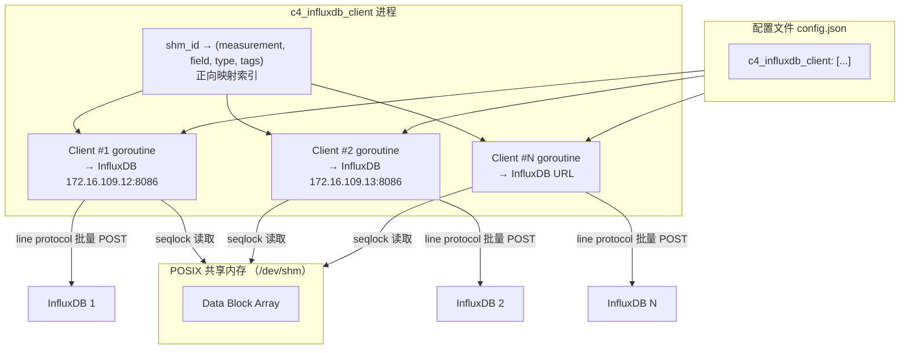
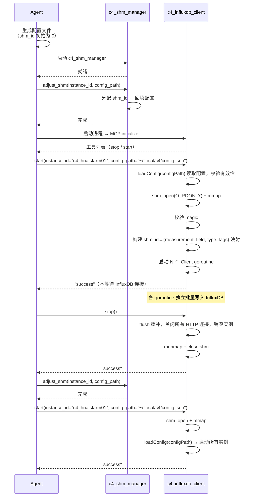
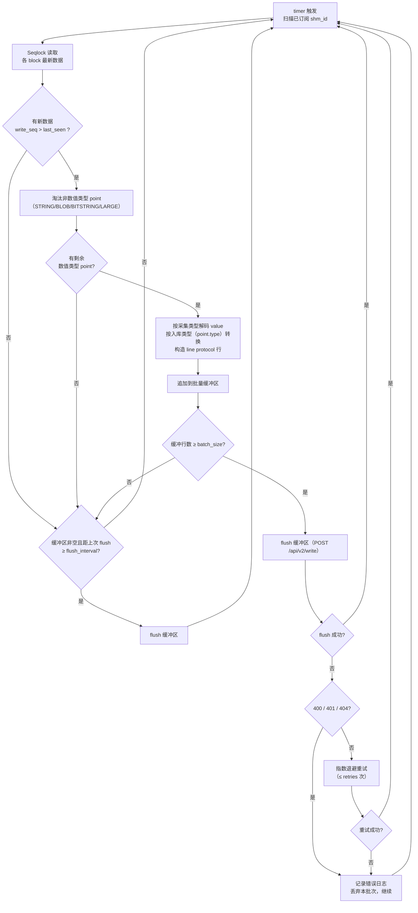

# C4 InfluxDB 写入 MCP 服务设计

> **版本**：v0.1.0 | **最后更新**：2026-08-19 | **父文档**：[c4_architecture.md](c4_architecture.md) | **对应功能**：[C4_FUN_00016](../specification/c4_function.md), [C4_FUN_00067](../specification/c4_function.md), [C4_FUN_00068](../specification/c4_function.md)

---

本文档描述 `c4_influxdb_client` MCP 服务的详细设计，包括多实例启动、配置文件解析、
共享内存读取、line protocol 编码、批量写入 InfluxDB 和 MCP 工具接口。
共享内存布局和并发协议见 [c4_architecture.md](c4_architecture.md)。

---

## 1. 设计背景

`c4_influxdb_client` 是 C4 实例中负责将共享内存中的采集数据写入 InfluxDB 时序数据库的
MCP 服务。单个二进制文件启动后，根据配置文件中的实例列表（`c4_influxdb_client` 数组），
启动多个 Client goroutine，每个 goroutine 连接一个 InfluxDB 实例，定时从共享内存读取
已订阅 point 的数据，按 line protocol 编码后批量写入。

`c4_influxdb_client` 以 **Reader** 角色访问共享内存（`O_RDONLY` 模式），不参与共享内存的
创建或销毁——共享内存由 `c4_shm_manager` 创建。

> **与 `c4_asfp2_client` 的相似性**：两者同为 Reader，都从共享内存读取数据、按 `write_seq`
> 筛选新数据、按固定周期轮询。差异在于下游目标——`c4_asfp2_client` 按 ASFP2 协议编码后通过
> TCP 发送到中心侧或其他 C4 实例；`c4_influxdb_client` 按 line protocol 编码后通过 HTTP
> 写入时序数据库。因此两者的共享内存读取逻辑完全一致，仅「编码 + 传输」层不同。对称性详见 §8。

```
                     配置文件 (config.json)
                           │
         ┌─────────────────┼─────────────────┐
         ▼                 ▼                 ▼
  ┌───────────┐    ┌───────────┐    ┌───────────┐
  │ Client #1  │    │ Client #2  │    │ Client #N  │   goroutine 实例
  │ → InfluxDB │    │ → InfluxDB │    │ → InfluxDB │
  └─────┬─────┘    └─────┬─────┘    └─────┬─────┘
        │  读取shm        │  读取shm        │  读取shm
        ▼                 ▼                 ▼
  ┌────────────────────────────────────────────┐
  │             POSIX 共享内存                  │
  └────────────────────────────────────────────┘
        │  line protocol  │  line protocol  │  line protocol
        ▼                 ▼                 ▼
   InfluxDB 1         InfluxDB 2        InfluxDB N
```



### 1.1 角色定位

| 属性 | 值 |
|------|-----|
| MCP 服务类型 | Reader |
| 共享内存访问模式 | `O_RDONLY` |
| 实例模型 | 单二进制，多 goroutine（每个配置项一个 Client 实例） |
| 共享内存创建/销毁 | 不参与（由 `c4_shm_manager` 管理） |
| 生命周期管理 | Agent 通过 MCP 工具控制 |
| 写入协议 | InfluxDB line protocol，通过 HTTP `POST /api/v2/write` 写入 |
| 数据类型限制 | 仅支持数值类型（BOOLEAN / INT* / UINT* / FLOAT* / BIT） |

---

## 2. 配置文件

### 2.1 配置结构

`c4_influxdb_client` 的配置位于全局配置文件（如 `~/.local/c4/config.json`）的
`c4_influxdb_client` 顶层 key 下，值为实例配置数组。每个元素代表一个独立的
InfluxDB 写入实例。

```json
{
    "c4_influxdb_client": [
        {
            "name": "华能阿拉善InfluxDB入库",
            "id": "hnals_influx",
            "url": "http://172.16.109.12:8086",
            "token": "YOUR_API_TOKEN",
            "org": "activesys",
            "bucket": "hnals",
            "precision": "ms",
            "batch_size": 5000,
            "flush_interval": 1000,
            "timer": 100,
            "gzip": 1,
            "t0": 30,
            "retries": 3,
            "points": [
                {"key": "hnals_1_scada.windspeed", "measurement": "wind_turbine", "field": "windspeed", "type": "float", "tags": {"site": "hnals", "turbine": "1"}, "shm_id": 1},
                {"key": "hnals_1_transformer.uab", "measurement": "transformer", "field": "uab", "type": "float", "tags": {"site": "hnals"}, "shm_id": 2}
            ]
        }
    ]
}
```

### 2.2 实例级别字段

| 字段 | 类型 | 默认值 | 说明 |
|------|------|--------|------|
| `name` | string | — | 实例名称，用于日志和监控标识 |
| `id` | string | — | 实例标识符，全局唯一（`service_id`），须匹配 `[a-zA-Z_]+` |
| `url` | string | — | InfluxDB 写入端点 URL（如 `http://172.16.109.12:8086`），最终请求路径为 `{url}/api/v2/write` |
| `token` | string | — | 认证 token（**必填，空字符串视为缺失**；SUT 仅校验非空、不校验有效性。1.x 未启用认证时填任意非空值即可） |
| `org` | string | — | 组织名（**必填，空字符串视为缺失**；1.x 时填任意非空值，被忽略） |
| `bucket` | string | — | bucket 名（**必填，空字符串视为缺失**；1.x 时填数据库名） |
| `precision` | string | `"ms"` | 时间戳精度：`ns` / `us` / `ms` / `s`。共享内存 timestamp 为毫秒，默认 `ms` 直接透传；选其他精度时按精度换算（`ms`→`s` 除以 1000、`ms`→`us` 乘以 1000、`ms`→`ns` 乘以 1000000） |
| `batch_size` | int | `5000` | 单次 flush 的 line protocol 行数上限，达到即触发 flush。`0` 或负数视为非法配置（返回 `INVALID_CONFIG`） |
| `flush_interval` | int | `1000` | flush 间隔（毫秒），即使未达 `batch_size` 也按此周期 flush。`0` 禁用时间触发（仅靠 `batch_size` 触发），负数视为非法配置 |
| `timer` | int | `100` | 轮询周期（毫秒），决定从共享内存读取数据的频率。设计约束：Reader 频率 10 倍于 Writer（Writer 为 1Hz），即 `timer ≤ 100` |
| `gzip` | int | `1` | 是否启用 gzip 压缩请求体：`1`=启用（请求体实际 gzip 压缩并加 `Content-Encoding: gzip`），`0`=关闭 |
| `t0` | int | `30` | HTTP 请求超时（秒，`http.Client.Timeout`，覆盖连接 + 发送 + 响应） |
| `retries` | int | `3` | flush 失败（网络错误 / 5xx / 429）时的最大重试次数。`0` 表示不重试，立即判定失败 |

> **InfluxDB 1.x 兼容性**：`org` + `bucket` 面向 InfluxDB 2.x 的
> `POST /api/v2/write?org={org}&bucket={bucket}`。对接 InfluxDB 1.x 时：
> - 1.8+（已启用 v2 API）：沿用 `/api/v2/write`，`bucket` 填数据库名、`org` 填任意非空值（被忽略）
> - 更早的 1.x：使用 legacy `POST {url}/write?db={bucket}` 端点
>
> line protocol 编码层完全一致。
>
> **InfluxDB 3.x（待验证，不在本文档保证范围）**：3.x 主推独立的 `POST /api/v3/write_lp`
> 端点（认证与参数模型不同，使用 database 而非 org/bucket）。本文档**未覆盖**该端点的适配，
> 对接 3.x 前需单独设计其端点与认证细节。

### 2.3 points 数组元素

每个 point 描述一个从共享内存 shm_id 到 InfluxDB 数据点（measurement + field + tags）的映射关系。

| 字段 | 类型 | 含义 |
|------|------|------|
| `key` | string | 引用的 Writer 采集点标识，格式为 `{service_id}.{point_id}`（如 `hnals_1_scada.windspeed`）。`c4_shm_manager` 根据此 key 填入与 Writer 端相同的 shm_id |
| `measurement` | string | InfluxDB measurement 名（如 `wind_turbine`），对应一条时序数据的表名 |
| `field` | string | field key（如 `windspeed`）。缺省时取 `key` 的 `{point_id}` 部分 |
| `type` | string | 入库类型，决定 value 编码为 line protocol field 的类型：`"float"` / `"int"` / `"uint"` / `"bool"`。缺省时跟随采集类型（见 §4.4.1） |
| `tags` | object | 附加 tag 键值对（可选），用于区分设备 / 区域 / 协议等维度。键须匹配 `[a-zA-Z_]+`，值可为任意字符串（含中文） |
| `shm_id` | integer | 全局 shm_id，默认 0（未分配），由 `c4_shm_manager` 分配后回填 |

**points 合法性约束**（`start` 时校验，违反返回 `INVALID_POINT`）：

- `type` 取值须为 `"float"` / `"int"` / `"uint"` / `"bool"` 之一，或省略（跟随采集类型）
- `measurement` 非空
- `field` 与 `tags` 的键名须匹配 `[a-zA-Z_]+`（`tags` 的值可为任意字符串，含中文）
- 同一实例内 `shm_id` 不得重复

### 2.4 全局配置中的声明

在全局配置的 `c4_shm_manager` 段中，`c4_influxdb_client` 声明为 Reader：

```json
{
    "c4_shm_manager": {
        "writer": ["c4_modbus_client", "c4_iec104_client", "c4_asfp2_server"],
        "reader": ["c4_asfp2_client", "c4_influxdb_client"]
    }
}
```

---

## 3. 启动流程 —— C4_FUN_00067

### 3.1 整体流程

```
启动阶段：
  1. Agent 生成配置文件，写入 c4_influxdb_client 实例列表
     （所有 point 的 shm_id 初始为 0）
  2. Agent 启动 c4_shm_manager（首个服务）
  3. Agent 调用 c4_shm_manager.adjust_shm(instance_id, config_path)
     → 计算所需点数 → 分配 shm_id → 回填配置文件中 c4_influxdb_client 的 shm_id 字段
  4. Agent 启动 c4_influxdb_client 进程（仅注册 MCP 工具，无其他初始化）
  5. Agent 调用 c4_influxdb_client 的 `start` 工具，传入 `instance_id` 和 `config_path` 参数
     → client 在工具 handler 中完成：
       a. 从 config_path 参数获取配置文件绝对路径
       b. 通过 loadConfig(configPath) 读取 c4_influxdb_client 配置段
       c. 校验配置有效性（url 格式、token/org/bucket 必填、shm_id 合法性等）
       d. 以 O_RDONLY 模式 shm_open 已有共享内存
       e. mmap 共享内存，校验 magic
       f. 构建 shm_id → (measurement, field, type, tags) 正向映射索引（内部数据结构）
       g. 为每个配置实例启动一个 goroutine，异步发起 HTTP 写入循环
       h. 返回 "success"（不等待与 InfluxDB 的连接建立，连接结果由各 goroutine 异步处理，见 §4.5）
  6. Agent 收到成功应答 → c4_influxdb_client 进入运行状态

运行阶段：
  7. 各 goroutine 独立运行，定时从共享内存读取数据并批量写入 InfluxDB
  8. Agent 通过 MCP 工具监控状态

扩容/调整阶段：
   9. Agent 执行 Stop-Start 协议：
      a. Agent 向 c4_influxdb_client 发送 `stop` → 销毁所有实例，flush 缓冲并释放连接
      b. Agent 调用 c4_shm_manager.adjust_shm(instance_id, config_path)
      c. Agent 向 c4_influxdb_client 发送 `start`
         → client 重新加载配置 → 启动所有实例 → 返回
```



### 3.2 停止与重启 —— C4_FUN_00068

Agent 在需要调整共享内存容量或变更写入配置时，执行 Stop-Start 协议：

1. Agent 调用 `stop` → **尽力 flush 当前缓冲**（单次 flush、不重试、总超时 ≤ `t0` 秒，失败/超时丢弃剩余缓冲），关闭所有 HTTP 连接，销毁全部实例，munmap 并关闭共享内存
2. Agent 调用 `c4_shm_manager.adjust_shm(instance_id, config_path)` 完成共享内存调整
3. Agent 调用 `start`（传入 `instance_id` 和 `config_path` 参数）→ 重新 `shm_open` + `mmap` 共享内存，通过 `loadConfig(configPath)` 加载配置文件，启动所有实例

`stop` 销毁所有实例并释放共享内存映射后，服务回到进程刚启动的状态。`start` 的执行流程与首次启动完全一致——无需区分"首次"和"重启"。

> **接口一致性**：`stop` 无参数；`start` 接受 `instance_id` 和 `config_path` 参数。`stop` → `adjust_shm` → `start` 三步操作，Agent 无需在服务间传递 shm_id 列表或容量参数。`start` 在 `stop` 之后可再次调用——与首次启动复用同一逻辑。
>
> **数据语义**：Stop-Start 后 `last_seen` 归零（随进程状态重置），重启后可能重复写入 stop 前最近一次已成功写入的数据点。InfluxDB 以「相同 measurement + tag set + field key + 相同 timestamp」为主键，重复写入同时间戳数据点即**覆盖**（UPSERT），天然幂等，因此重复写入无害。

---

## 4. 数据写入 —— C4_FUN_00016

### 4.1 写入方式选型：官方 SDK vs 直接 HTTP

InfluxDB 数据写入有两条技术路线，本设计在立项阶段做了专项评估：

- **方案 A：官方 Go SDK（`github.com/influxdata/influxdb-client-go/v2`）**
- **方案 B：直接 HTTP（Go 标准库 `net/http` + 手写 line protocol）**

#### 4.1.1 评估维度

| 维度 | 方案 A：官方 SDK | 方案 B：直接 HTTP |
|------|-----------------|------------------|
| **性能** | 异步 `WriteAPI` 内置批量缓冲（默认 `batchSize=5000`）、`flushInterval=1000ms`、gzip 压缩、HTTP 连接复用，高吞吐下表现优秀；`WritePoint` 有对象构造 + 序列化开销，但可改用 `WriteRecord`（直接写 line protocol 字符串）规避，与手写编码路径等价 | 直接构造 line protocol 字符串批量 POST，配合 `http.Client` 的 keep-alive 连接复用，零抽象层开销；批量粒度与 flush 时机完全自控 |
| **操作性** | 官方维护，批量 / 重试（指数退避，默认 5 次）/ gzip / 错误分类开箱即用；token / org / bucket 为标准配置，运维省心 | 需自行实现批量缓冲、flush 定时、指数退避重试、gzip（约 200~300 行），边界情况（转义、类型、超时）需自行覆盖测试 |
| **扩展性** | 官方跟随 InfluxDB 2.x → 3.x 演进，后续若需 Flux 查询、任务管理、健康检查等高级 API 可直接复用 | line protocol 编码协议十余年稳定不变；但 InfluxDB 版本演进（1.x → 2.x → 3.x 的 URL 参数差异）需自行适配 |

> **性能维度的说明**：官方 SDK 底层即 HTTP + line protocol（两者走同一 `/api/v2/write` 端点），
> 故「SDK vs HTTP」并非两条独立路径的对比，而是「官方封装 vs 手写同一条路径」的对比。**无官方 /
> 第三方针对此对比的量化 benchmark 数据**；客户端封装层的差异（`WritePoint` 构造、异步调度）均
> 可通过 `WriteRecord` / `WriteAPIBlocking` 规避，因此性能非本选型（§4.1.2）的决定因素。
> 官方有据的性能结论仅涉及通用优化——gzip 可带来 up to 5x 提速、最优 batch size 5000 行
> （[optimize-writes](https://docs.influxdata.com/influxdb/v2/write-data/best-practices/optimize-writes/)）；
> 两者均同等适用，不构成选型差异。

#### 4.1.2 决策：选择方案 B（直接 HTTP）

本设计选用**方案 B（直接 HTTP + 手写 line protocol）**。

**前提事实（SDK 即 HTTP 封装）**：InfluxDB 官方 SDK 的**写入**路径都是对 HTTP 的封装——
2.x 的 `influxdb-client-go` 写入 `/api/v2/write`，两者均以 line protocol 为载荷；gRPC /
Apache Arrow Flight 仅用于 InfluxDB 3.x 的**查询**（而非写入）。`c4_influxdb_client` 是
纯写入服务、不涉及查询，因此「直接 HTTP」不损失写入能力，仅省去一层封装及其依赖。
**本文档以 InfluxDB 2.x 的 `/api/v2/write` 为设计目标**；InfluxDB 3.x 的写入端点
（`/api/v3/write_lp`）认证与参数模型不同，其兼容性**不在本文档保证范围内**（见 §2.2）。
在此前提下，理由如下：

1. **架构一致性**：C4 现有 5 个 MCP 服务（`c4_shm_manager` / `c4_modbus_client` /
   `c4_iec104_client` / `c4_asfp2_client` / `c4_asfp2_server`）全部零第三方依赖——
   纯 Go 标准库 + `internal/` 内部模块。InfluxDB 写入的 line protocol 编码 + HTTP POST
   足够简单，可继续用标准库实现，保持架构一致性与可审计性。

2. **确定性优先**：C4 的核心设计原则是「MCP 服务执行确定性数据搬运」。方案 A 的异步
   `WriteAPI` 将数据缓冲在内存中，flush 时机由 SDK 内部定时器驱动，进程异常退出时缓冲
   数据可能丢失且不可控；方案 B 采用**同步阻塞写入 + 显式 flush 时机**（`batch_size` /
   `flush_interval` 双触发），数据流转路径完全确定、可预测。

3. **类型转换必须自写**：共享内存中的 `value` 按 ASFP2 类型枚举（BOOLEAN / INT8 / ... /
   FLOAT64 / BIT）解释，转换为 line protocol 的 field 值（boolean / integer / unsigned /
   float）是 C4 特有的业务逻辑，SDK 不提供此映射。无论选哪种方案，这段转换都必须自行实现；
   SDK 的增量价值仅剩「line protocol 字符串编码 + HTTP 传输」，而这两者用标准库实现成本很低。

4. **line protocol 编码简单可控**：编码规则明确——整数加 `i` 后缀、无符号整数加 `u` 后缀、
   浮点裸写、布尔 `true`/`false`、字符串加引号，特殊字符（`,` / `=` / 空格 / `"` / `\`）
   按固定规则转义。自实现约 50~100 行即可精确控制，无隐式行为。

5. **最小依赖原则**：避免引入 `influxdb-client-go` 及其传递依赖（`deep`、`uuid`、`pkg/errors`
   等），保持静态二进制精简、可审计、可离线部署——契合工业现场部署环境。

> **切换条件（预留）**：若未来 C4 需要对接 InfluxDB 的高级能力（Flux 查询、任务管理、
> InfluxDB 元数据管理、健康检查 API），或需深度适配 InfluxDB 3.x 的复杂特性，可引入官方
> SDK 替换本文档 §4.4~§4.5 的「编码 + HTTP 传输」层；届时 §4.2 的共享内存读取与
> §4.3 的写入循环、§4.6 的映射索引逻辑可完整复用，仅替换底层 I/O。

### 4.2 写入循环

每个 Client goroutine 以 `timer` 为周期执行以下循环：

```
1. 扫描所有已订阅 shm_id 的 Data Block，通过 Seqlock 协议读取最新数据
2. 筛选 write_seq > last_seen 的 point（有新数据）
3. 淘汰非数值类型（STRING / BLOB / BITSTRING / LARGE_DATA_BLOCK）的 point
4. 若有剩余 point：
   a. 按采集类型从 64 位 value 中解码出实际值，再按入库类型（point.type）转换（见 §4.4.1）
   b. 构造 line protocol 行：measurement + tags + field + timestamp（见 §4.4.2）
   c. 追加到批量缓冲区（内存中的 line protocol 字符串拼接）
   d. 若缓冲区行数 ≥ batch_size：
      → flush 缓冲区（§4.5）
5. 若缓冲区非空且距上次 flush ≥ flush_interval（无论本轮是否有新数据）：
   → flush 缓冲区（§4.5）
6. 返回步骤 1
```



### 4.3 共享内存读取

`c4_influxdb_client` 作为 Reader，遵循 [c4_architecture.md §2.4.2](c4_architecture.md)
定义的 Seqlock 协议从共享内存读取数据。以 `O_RDONLY` 模式打开共享内存，全程只读。
Writer 的写入不会阻塞 Reader，Reader 在 `write_seq` 为奇数时跳过该轮（下一轮必定读到完成值）。

```go
func readBlock(shmPtr unsafe.Pointer, shmID uint32) (dataType uint8,
                timestamp uint64, value uint64, seq uint64, ok bool) {

    block := (*DataBlock)(unsafe.Pointer(shmPtr + uintptr(shmID)*32))

    // 1. 校验块完整性
    if atomic.LoadUint32(&block.magic) != MAGIC {
        return 0, 0, 0, 0, false
    }
    // 2. 块未激活
    if block.state == 0 {
        return 0, 0, 0, 0, false
    }

    for i := 0; i < 100; i++ {
        s1 := atomic.LoadUint64(&block.write_seq)
        if s1&1 != 0 {
            // 奇数：writer 正在写，跳过本轮
            return 0, 0, 0, 0, false
        }
        dt := block.type
        ts := block.timestamp
        val := block.value
        s2 := atomic.LoadUint64(&block.write_seq)
        if s1 == s2 {
            return dt, ts, val, s1, true
        }
        // 重试（概率极低）
        runtime.Gosched()
    }
    // 防御性兜底：100 次重试仍未读到稳定值，跳过本轮
    return 0, 0, 0, 0, false
}
```

**读取频率约束**：与 `c4_asfp2_client` 相同，Reader 每 `timer` 毫秒轮询一次，Writer 为 1Hz
（每 1000ms 写一次），Reader 频率 10 倍于 Writer（`timer ≤ 100` → Reader ≥ 10Hz），确保不漏数据。
`write_seq` 为奇数时跳过该轮（概率 ≈ 1/10），下一轮必定拿到完成值。

**Seqlock 安全约束**：`readBlock` 使用有上限（100 次）的 `for` 循环重试 seqlock 读取。在 Writer 1Hz /
Reader ≥10Hz 的频率比下，seqlock 奇数窗口（~µs）与 Reader 轮询间隔（≤100ms）相差 5 个
数量级，**碰撞需要重试的概率 < 0.01%**。若违反此频率约束（如 `timer > 100` 或 Writer 频率 > 1Hz），
重试次数可能急剧增加。代码中以 `runtime.Gosched()` + 100 次上限作为防御性兜底保护。

### 4.4 line protocol 编码

#### 4.4.1 类型转换：采集类型 → 入库类型

共享内存中的 `value` 字段为 64 位，其实际含义由 DataBlock 的 `type`（ASFP2 类型枚举）决定。
写入 InfluxDB 时分为两步：先按**采集类型**解码出原始值，再按 point 配置的 `type`（**入库类型**）
转换为目标类型，最终编码为 line protocol 的 field 值。

**采集类型与入库类型解耦**：采集类型由上游 Writer（如 `c4_modbus_client` 采集的 INT16 / UINT32）
决定，入库类型由本服务的 point 配置独立指定。典型场景——Modbus 采集了多种类型的数据（有符号 /
无符号 / 浮点混杂），但 InfluxDB 端要求所有字段统一为浮点：此时为每个 point 配置 `"type": "float"`，
服务统一将各类采集值转换为浮点后入库。

> **field 类型一致性约束**：InfluxDB 中同一 series（measurement + tag set）下的同一 field，
> 其类型由**首次写入**的值决定，此后写入不同类型会返回 `400` field type conflict。通过 point 的
> `type` 字段显式固定入库类型，可避免上游采集类型变化导致的类型冲突。

**入库类型枚举**（point 配置的 `type` 字段，字符串）：

| `type` 值 | 含义 | line protocol field 编码 |
|-----------|------|------------------------|
| （缺省） | 跟随采集类型（auto） | 按下方「默认映射」表 |
| `"float"` | 浮点（float64） | `{v}`（**必须含小数点或指数**，如 `25.0`——裸数字 `25` 会被解析为整数） |
| `"int"` | 有符号整数（int64） | `{v}i` |
| `"uint"` | 无符号整数（uint64） | `{v}u` |
| `"bool"` | 布尔 | `true` / `false` |

**默认映射（`type` 缺省时，跟随采集类型，不做转换）**：

| ASFP2 类型 | 枚举值 | value 解码 | line protocol field 值 | 编码 |
|-----------|--------|-----------|----------------------|------|
| BOOLEAN | 0 | 低 1 字节（0/1） | boolean | `true` / `false` |
| INT8 | 1 | 低 1 字节（有符号） | integer | `{v}i` |
| UINT8 | 2 | 低 1 字节（无符号） | unsigned integer | `{v}u` |
| INT16 | 3 | 低 2 字节（有符号） | integer | `{v}i` |
| UINT16 | 4 | 低 2 字节（无符号） | unsigned integer | `{v}u` |
| INT32 | 5 | 低 4 字节（有符号） | integer | `{v}i` |
| UINT32 | 6 | 低 4 字节（无符号） | unsigned integer | `{v}u` |
| INT64 | 7 | 8 字节（有符号） | integer | `{v}i` |
| UINT64 | 8 | 8 字节（无符号） | unsigned integer | `{v}u` |
| FLOAT16 | 9 | 低 2 字节（半精度，先解为 float32） | float | `{v}` |
| FLOAT32 | 10 | 低 4 字节（IEEE 754） | float | `{v}` |
| FLOAT64 | 11 | 8 字节（IEEE 754） | float | `{v}` |
| BIT | 15 | 低 1 字节（0/1） | boolean | `true` / `false` |
| STRING / BLOB / BITSTRING / LARGE_DATA_BLOCK | — | — | **跳过，不写入** | — |

> **FLOAT16 特殊处理**：半精度浮点（2 字节）InfluxDB 无法直接表示，解码时先按 IEEE 754
> 半精度格式展开为 float32，再按入库类型转换。
>
> **float 编码统一规则**：所有 float 值（无论 `type` 缺省跟随采集类型，还是显式指定
> `"float"`）编码时都必须携带小数点或指数（如 `25.0`），否则裸数字会被 InfluxDB 解析为整数。

**显式转换矩阵**（point 指定 `type` 时，采集类型 → 目标类型）：

| 采集类型（解码后的原始值） | → `float` | → `int` | → `uint` | → `bool` |
|---------------------------|-----------|---------|----------|----------|
| BOOLEAN / BIT（0/1） | `0.0` / `1.0` | `0` / `1` | `0` / `1` | 原值 |
| INT8/16/32/64（有符号） | 数值转 float64 | 原值（符号扩展） | C 强制转换（负数按无符号环绕） | `值 ≠ 0` |
| UINT8/16/32/64（无符号） | 数值转 float64 | C 强制转换（超出按补码截断） | 原值 | `值 ≠ 0` |
| FLOAT16/32/64（浮点） | 原值 | C 强制转换（向零截断） | C 强制转换（向零截断） | `值 ≠ 0` |

> **转换语义**：所有类型转换直接采用 Go 的类型强制转换（等价于 C 语言强制转换）——
> 整数 ↔ 整数按目标位宽截断 / 环绕，浮点 → 整数向零截断，整数 → 浮点按 `float64(v)`。
> **InfluxDB 绝大部分应存储 float 类型**，宽 → 窄强制转换的溢出 / 环绕边界在浮点入库场景中
> 极少发生，故不引入饱和处理、保持转换简单直接。
> - 浮点 NaN / ±Inf：InfluxDB 不接受 NaN / ±Inf，视为非法，跳过该 point 并记录日志（不写入），并推进该 point 的 `last_seen`（避免每轮重复处理）。

#### 4.4.2 line protocol 行格式

每个数据点编码为一行 line protocol：

```
measurement,tag1=val1,tag2=val2 field1=val1i timestamp
```

- **measurement**：来自 point 配置的 `measurement` 字段
- **tag set**：来自 point 配置的 `tags` 字段，`key=value` 对按逗号分隔（可为空）
- **field set**：`{field}={value}`，`{field}` 来自 point 配置的 `field` 字段（缺省取 `key` 的 point_id 部分），`{value}` 按 point 的 `type`（入库类型）与 §4.4.1 的转换规则编码
- **timestamp**：来自共享内存的 `timestamp` 字段（毫秒），配合实例级 `precision="ms"` 透传

**特殊字符转义规则**（InfluxDB 官方规范）：

| 位置 | 需转义字符 | 转义为 |
|------|-----------|--------|
| measurement | `,` 逗号、空格 | `\,`、`\ ` |
| tag key | `,` 逗号、`=` 等号、空格 | `\,`、`\=`、`\ ` |
| tag value | `,` 逗号、`=` 等号、空格 | `\,`、`\=`、`\ ` |
| field key | `,` 逗号、`=` 等号、空格 | `\,`、`\=`、`\ ` |

> **仅数值 field，无字符串转义**：本服务仅写入数值类型 field（§1.1），line protocol 的字符串
> field value 转义（`"` / `\`）不适用。
>
> **命名安全**：C4 的 `id` / `key` 受 `[a-zA-Z_]+` 约束，measurement / field 通常不含需转义
> 字符；但 `tags` 的值可能为任意字符串（如中文设备名「华能阿拉善1#主变」）。中文字符不属于
> line protocol 特殊字符，无需转义；若 tag value 含逗号 / 空格 / 等号则须转义。编码逻辑
> 对所有字符串位置统一执行转义，避免遗漏。

#### 4.4.3 编码示例

**示例 1（跟随采集类型）**：共享内存中 `hnals_1_scada.windspeed` 块：`type=10`（FLOAT32）、
`value=12.5`、`timestamp=1768848814264`，对应 point 配置
`{"measurement": "wind_turbine", "field": "windspeed", "tags": {"site": "hnals", "turbine": "1"}}`
（未指定 `type`，跟随采集类型 FLOAT32 → float）：

```text
wind_turbine,site=hnals,turbine=1 windspeed=12.5 1768848814264
```

**示例 2（显式转换为 float）**：共享内存中 `hnals_1_scada.temperature` 块：`type=5`（INT32）、
`value=25`、`timestamp=1768848814264`，对应 point 配置
`{"measurement": "wind_turbine", "field": "temperature", "type": "float", "tags": {"site": "hnals"}}`
（INT32 → float，统一浮点入库）：

```text
wind_turbine,site=hnals temperature=25.0 1768848814264
```

注意示例 2 中整数值 `25` 须编码为 `25.0`——line protocol 中不带小数点的裸数字会被 InfluxDB
解析为**整数**（integer），浮点值必须显式携带小数点（或指数），否则「统一浮点入库」失效、
后续写入分数值会触发 `400 field type conflict`。

### 4.5 批量写入与 flush

#### 4.5.1 HTTP 请求

flush 时将缓冲区的多行 line protocol 拼接为一个请求体，通过 HTTP 发送：

```
POST {url}/api/v2/write?org={org}&bucket={bucket}&precision={precision}
Authorization: Token {token}
Content-Type: text/plain; charset=utf-8
Content-Encoding: gzip            # 当 gzip=1 时

# InfluxDB 1.x 兼容：1.8+ 沿用 /api/v2/write（bucket 填数据库名，org 忽略）；legacy 1.x 用 /write?db={bucket}

<line protocol 行 1>
<line protocol 行 2>
...
```

| 响应码 | 含义 | 处理 |
|--------|------|------|
| `204 No Content` | 写入成功 | flush 完成，清空缓冲区 |
| `400 Bad Request` | line protocol 格式错误 / 类型冲突 | 不重试，记录错误日志（含采样行），丢弃本批次 |
| `401 Unauthorized` | token 无效 | 不重试，记录错误日志 |
| `404 Not Found` | bucket 不存在 | 不重试，记录错误日志 |
| `413 Payload Too Large` | 请求体过大 | 将本批次对半拆分分别重试；拆至单行仍 413 视为不可重试，丢弃该行并记录日志 |
| `429 Too Many Requests` | 触发限流 | 指数退避后重试 |
| `5xx` | 服务端错误 | 指数退避后重试 |

#### 4.5.2 flush 触发条件

flush 由两个条件触发（满足任一即 flush）：

1. **行数触发**：缓冲区行数 ≥ `batch_size`（默认 5000）
2. **时间触发**：距上次 flush ≥ `flush_interval`（默认 1000ms），即使缓冲区未满也 flush

双触发保证：高数据速率下按 `batch_size` 批量（吞吐优先），低数据速率下按 `flush_interval`
及时落库（时效优先，避免数据在缓冲中滞留过久）。

#### 4.5.3 重试策略

flush 失败时执行指数退避重试（最多 `retries` 次，默认 3）：

```
第 n 次重试间隔 = 初始间隔 × 2^(n-1)，初始间隔 1000ms，上限 30s
```

- **可重试错误**：网络错误、`429`、`5xx`——退避后重试；`413`——对半拆分重试（见 §4.5.1）
- **不可重试错误**：`400`、`401`、`404`——立即放弃，记录错误日志
- **重试仍失败**：记录错误日志 + 递增 `write_errors` 统计，丢弃本批次，继续下一轮（数据管道不阻塞）

> **数据语义**：`c4_influxdb_client` 提供 **best-effort** 写入语义——重试过程中可能产生重复
> 写入（InfluxDB 以「measurement + tag set + field key + timestamp」为唯一键，同键重复写入即
> 覆盖 UPSERT，重复无害）；但**重试彻底失败后丢弃的数据点即永久丢失**，其 `last_seen` 已推进、
> 无法回溯重放。数据丢失通过 `write_errors` 统计与错误日志观测，管道本身不被阻塞。与
> `c4_asfp2_client` 的「at-least-once + 接收端幂等」不同，UPSERT 幂等只解决重复、不解决丢失，
> 二者不可等同。

### 4.6 shm_id → (measurement, field, type, tags) 映射索引

进程启动时从配置文件的 points 数组构建内存索引：

```go
// 内部索引结构
type PointMapping struct {
    ShmID       uint32
    Measurement string
    Field       string
    Type        string   // 入库类型：""（跟随采集类型）/ "float" / "int" / "uint" / "bool"
    Tags        map[string]string
}

// map[shm_id] → PointMapping
var index map[uint32]*PointMapping
```

写入时扫描所有 shm_id，读取对应 Data Block，按映射（含 `Type` 转换）编码为 line protocol 行。
每个 shm_id 独立维护 `last_seen`（`map[shm_id]uint64`），仅当 `write_seq > last_seen[shmId]`
时才视为新数据参与写入，并在**处理完该 point（入缓冲或跳过）后**更新 `last_seen`（不等 flush
结果——见 §4.5.3 的 best-effort 语义：flush 失败即丢数、不重放；跳过非数值 / NaN 的 point
同样推进 `last_seen`，避免每轮重复处理）。

---

## 5. MCP 工具接口

`c4_influxdb_client` 实现所有数据路径 MCP 服务通用生命周期工具（定义见
[c4_architecture.md §3.3.1](c4_architecture.md)）。

### 5.1 通用工具

#### Tool: `start`

加载配置文件、附加共享内存、启动所有 InfluxDB Client goroutine（各 goroutine 异步发起写入循环）。
**返回时机**：所有实例均已启动即返回 `"success"`，**不等待与 InfluxDB 的连接建立**——连接成功与否
记录到日志，由各 goroutine 的写入循环（§4.5）异步处理。
**首次调用**完成服务初始化。**在 `stop` 之后可再次调用**——`stop` 已释放共享内存，
`start` 重新 `shm_open` + `mmap` 后加载最新配置并启动实例。与首次启动执行完全相同的流程。
**若服务当前处于运行状态（已 start 且未 stop），返回 `ALREADY_RUNNING`。**

**参数**：`instance_id`（string，必填）—— C4 实例标识符（即共享内存名，须匹配 `c4_[a-zA-Z0-9]+`）；`config_path`（string，必填）—— 配置文件 config.json 的绝对路径

**返回值**：成功返回 `"success"`，失败返回 `isError: true`。

**错误码**：

| 错误码 | 含义 |
|--------|------|
| `ALREADY_RUNNING` | 服务当前处于运行状态，须先调用 `stop` |
| `CONFIG_PATH_MISSING` | `config_path` 参数缺失或无法读取指定文件 |
| `CONFIG_PARSE_ERROR` | 配置文件格式错误或 `c4_influxdb_client` 段缺失 |
| `INVALID_CONFIG` | 配置字段非法——`url` 缺失或格式错误、`token`/`org`/`bucket` 缺失、`batch_size` ≤ 0、`flush_interval` < 0 |
| `INVALID_POINT` | point 配置非法——`type` 取值非法（非 float/int/uint/bool）、`measurement` 为空、`field`/`tags` 键名违反 `[a-zA-Z_]+`、同实例内 shm_id 重复 |
| `SHM_CORRUPTED` | 共享内存 magic 校验失败 |
| `SHM_OPEN_FAILED` | 无法打开共享内存（可能 `c4_shm_manager` 未创建） |
| `SHM_ID_NOT_ASSIGNED` | 配置中存在 shm_id 未分配（=0）的 point——shm_id 必须由 `c4_shm_manager` 回填后才能使用 |

**MCP 应答示例**：

```json
// ========== 成功 ==========
// --> 请求
{"jsonrpc": "2.0", "id": 1, "method": "tools/call", "params": {"name": "start", "arguments": {"instance_id": "c4_hnalsfarm01", "config_path": "~/.local/c4/config.json"}}}
// <-- 应答
{"jsonrpc": "2.0", "id": 1, "result": {"content": [{"type": "text", "text": "success"}], "isError": false}}

// ========== 业务错误：shm_id 未分配 ==========
// <-- 应答
{"jsonrpc": "2.0", "id": 1, "result": {"content": [{"type": "text", "text": "SHM_ID_NOT_ASSIGNED: point hnals_1_scada.windspeed has shm_id=0"}], "isError": true}}
```

---

#### Tool: `stop`

**尽力 flush 当前缓冲**（单次 flush、不重试、总超时 ≤ `t0` 秒），无论 flush 成功与否，随后
关闭所有 HTTP 连接、销毁全部实例，服务回到初始化完成但未启动的状态。flush 失败 / 超时时
丢弃剩余缓冲并记录日志，`stop` 仍返回 `"success"`——flush 不阻塞 `stop` 超过 `t0` 上限。
`stop` 之后可调用 `start` 重新启动。
**幂等：若 `start` 从未成功调用过（服务未运行），直接返回 `success`，不报错。**

**参数**：无

**返回值**：成功返回 `"success"`。

---

## 6. 错误处理

| 场景 | 触发工具 | 处理方式 |
|------|---------|---------|
| `start` 在运行状态下再次调用 | `start` | 返回 `ALREADY_RUNNING` |
| `stop` 在服务未运行（从未 start）时调用 | `stop` | 幂等：直接返回 `success`，不报错 |
| `config_path` 参数缺失或无法读取指定文件 | `start` | 返回 `CONFIG_PATH_MISSING` |
| 配置文件格式错误 | `start` | 返回 `isError: true` + `CONFIG_PARSE_ERROR` |
| 配置字段非法（url/token/org/bucket 缺失或格式错、batch_size ≤ 0、flush_interval < 0） | `start` | 返回 `INVALID_CONFIG` |
| point 配置非法（`type` 取值非法 / `measurement` 为空 / `field`·`tags` 键名违反 `[a-zA-Z_]+` / 同实例 shm_id 重复） | `start` | 返回 `INVALID_POINT`（消息指明字段与取值） |
| 共享内存 magic 校验失败 | `start` | 返回 `SHM_CORRUPTED`，Agent 应重建共享内存后重试 |
| 无法打开共享内存 | `start` | 返回 `SHM_OPEN_FAILED` |
| 配置中存在 shm_id 未分配（=0） | `start` | 返回 `SHM_ID_NOT_ASSIGNED`——`c4_shm_manager` 必须先回填 |
| HTTP 写入失败（网络错误 / 5xx / 429） | 运行时 | 指数退避重试（≤ `retries` 次，§4.5.3） |
| HTTP 写入失败（400 / 401 / 404） | 运行时 | 不重试，记录错误日志 + 递增 `write_errors` |
| `413` 请求体过大 | 运行时 | 本批次对半拆分分别重试（不重置 `retries` 计数）；拆至单行仍 413 视为不可重试，丢弃该行并记录日志 |
| `stop` 时 flush 失败 / 超时 | 运行时 | 丢弃剩余缓冲、记录日志，`stop` 仍返回 `success`（不阻塞超过 `t0`） |
| Seqlock 读取时 magic 失效 | 运行时 | 跳过该 block，记录错误日志 |
| 读取到非数值类型的 block | 运行时 | 跳过该 point，递增 `items_skipped`，并推进 `last_seen` |
| 浮点值为 NaN / ±Inf | 运行时 | 跳过该 point、记录日志（不写入），并推进 `last_seen` |
| 单个 goroutine panic | 运行时 | recover 后重启 goroutine，不影响其他实例 |

---

## 7. 不变式

| 不变式 | 维护者 | 说明 |
|--------|--------|------|
| 共享内存只读访问 | 架构约束 | `O_RDONLY` 模式，永不写入共享内存 |
| shm_id → (measurement, field, type, tags) 映射覆盖所有 points | 启动时构建 | shm_id 未分配（=0）的 point 不应出现在运行配置中 |
| 读取前 magic 校验通过 | Reader（每次读取前） | magic 校验失败的 block 不读取 |
| 仅写入数值类型数据项 | 编码逻辑 | 非数值类型 block 静默跳过 |
| 写入协议固定为 line protocol | 编码逻辑 | 全部实例统一 line protocol，不随版本切换 |
| 不创建/销毁共享内存 | 架构约束 | 仅 `c4_shm_manager` 管理共享内存生命周期 |
| 每轮仅写入有数据更新的 point | 写入循环 | `write_seq > last_seen[shmId]` 过滤 |
| flush 由行数 / 时间双触发 | 写入循环 | 满足任一即 flush（`flush_interval=0` 时仅行数触发），数据不滞留 |
| 各 goroutine 独立运行 | 并发模型 | 每个 Client goroutine 有独立的连接、last_seen map、缓冲和写入循环 |
| 时间戳单位为毫秒（默认） | 编码逻辑 | 共享内存 timestamp 为毫秒，`precision="ms"` 透传 |

---

## 8. 与 c4_asfp2_client 的对称性

| 维度 | c4_asfp2_client（转发） | c4_influxdb_client（入库） |
|------|------------------------|---------------------------|
| 角色 | Reader | Reader |
| 共享内存访问 | `O_RDONLY` | `O_RDONLY` |
| 映射方向 | shm_id → addr（ASFP2 key） | shm_id → (measurement, field, type, tags) |
| 传输方式 | 主动 TCP 长连接（`net.Dial`） | HTTP 短请求 + keep-alive（`net/http`） |
| 数据编码 | ASFP2 数据包（Header + Mutable + Data） | line protocol 文本行 |
| 批量策略 | 按 addr 连续性拆分子组打包 | 按行数 / 时间双触发 flush |
| 下游协议 | ASFP2（自定义二进制协议） | InfluxDB line protocol（HTTP API） |
| 心跳 | T1/T2 KeepAlive | HTTP keep-alive（连接复用，无应用层心跳） |
| 数据类型 | 仅数值类型，非数值 block 跳过 | 仅数值类型，非数值 block 跳过 |
| 数据语义 | at-least-once（接收端幂等） | best-effort（UPSERT 幂等，重试耗尽即丢数） |
| 生命周期工具 | `start` / `stop` | `start` / `stop` |
| 配置字段差异 | `ip` + `port`、`t0`/`t1`/`t2`、`smart`、`forward_kack`、`inverse_keep`、`timer` | `url` + `token` + `org`/`bucket`、`precision`、`batch_size`、`flush_interval`、`gzip`、`t0`、`timer`、`retries` |
| Points 字段 | `key`、`addr`、`shm_id` | `key`、`measurement`、`field`、`type`、`tags`、`shm_id` |

---

> **对应功能**：C4_FUN_00016, C4_FUN_00067, C4_FUN_00068
>
> **父文档**：[c4_architecture.md](c4_architecture.md)
