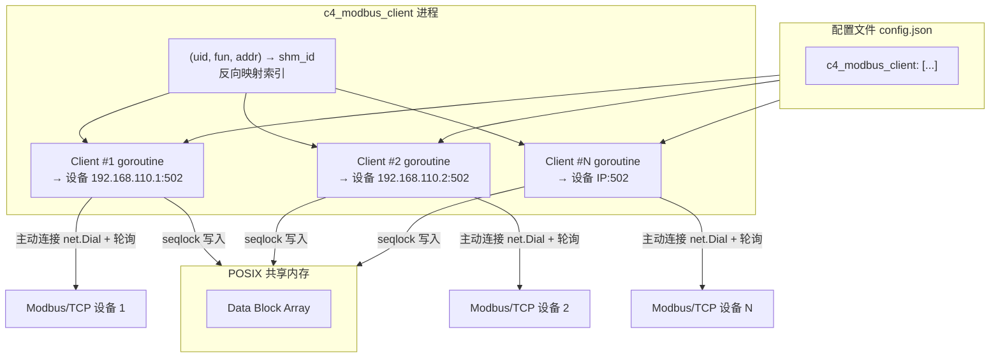
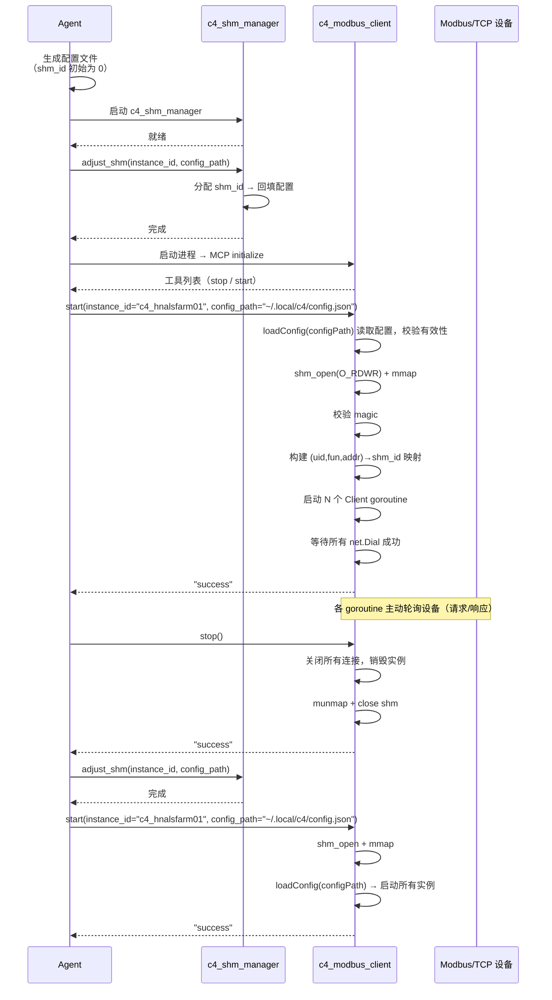
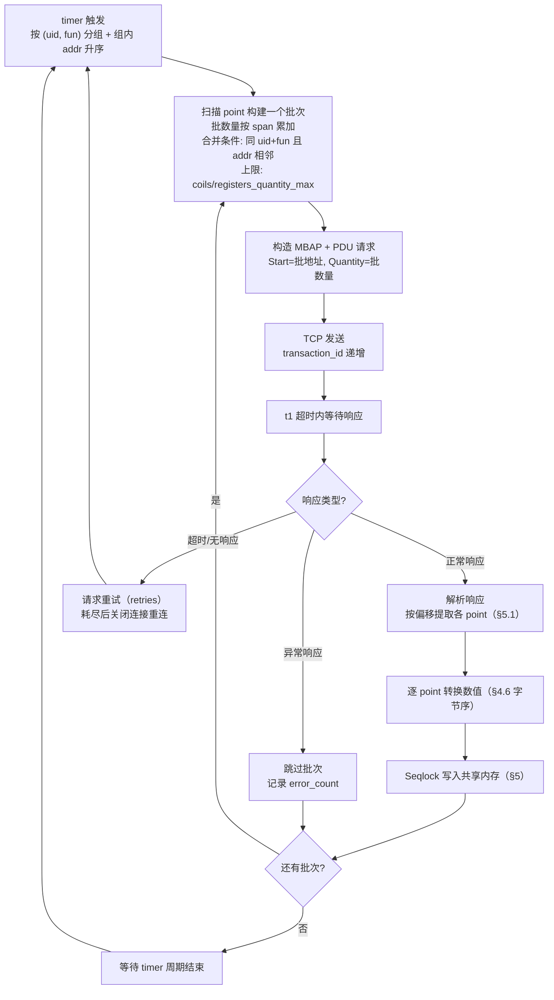

# C4 Modbus/TCP 采集 MCP 服务设计

> **版本**：v0.1.1 | **最后更新**：2026-08-13 | **父文档**：[c4_architecture.md](c4_architecture.md) | **对应功能**：[C4_FUN_00062](../specification/c4_function.md), [C4_FUN_00012](../specification/c4_function.md), [C4_FUN_00063](../specification/c4_function.md)

---

本文档描述 `c4_modbus_client` MCP 服务的详细设计，包括多实例启动、配置文件解析、
Modbus/TCP 请求/响应采集、共享内存写入和 MCP 工具接口。Modbus 协议规范见
[Modbus Application Protocol V1.1b3](../../../docs/modbus/Modbus_Application_Protocol_V1_1b3.pdf) 和
[Modbus Messaging on TCP/IP Implementation Guide V1.0b](../../../docs/modbus/Modbus_Messaging_Implementation_Guide_V1_0b.pdf)，
共享内存布局和并发协议见 [c4_architecture.md](c4_architecture.md)。

> **本设计仅覆盖 Modbus/TCP 二进制帧格式**。Modbus 串行线（RTU / ASCII）帧格式不在本文档范围内。

---

## 1. 设计背景

`c4_modbus_client` 是 C4 实例中负责采集 Modbus/TCP 设备数据的 MCP 服务。单个二进制文件启动后，
根据配置文件中的实例列表（`c4_modbus_client` 数组），启动多个 Client goroutine，
每个 goroutine 作为 **Modbus TCP 主站（Master）** 主动连接一台设备，按固定周期轮询
读取寄存器/线圈数据，解析后按 `(uid, fun, addr) → shm_id` 映射写入共享内存。

`c4_modbus_client` 以 **Writer** 角色访问共享内存（`O_RDWR` 模式），不参与共享内存的
创建或销毁——共享内存由 `c4_shm_manager` 创建。

> **与 `c4_asfp2_server` 的根本差异**：`c4_asfp2_server` 是**服务端（被动监听 `net.Listen`，
> 等待远端连接推送数据）**；`c4_modbus_client` 是**客户端（主动发起 `net.Dial` 连接设备，
> 轮询请求/响应拉取数据）**。两者的数据方向、连接模型和触发机制完全不同，详见 §9。

```
                    配置文件 (config.json)
                          │
          ┌───────────────┼───────────────┐
          ▼               ▼               ▼
   ┌───────────┐   ┌───────────┐   ┌───────────┐
   │ Client #1  │   │ Client #2  │   │ Client #N  │   goroutine 实例
   │ → 设备1   │   │ → 设备2   │   │ → 设备N   │
   └─────┬─────┘   └─────┬─────┘   └─────┬─────┘
         │  主动连接+轮询   │              │
         ▼               ▼              ▼
     Modbus/TCP      Modbus/TCP      Modbus/TCP
     设备 (从站)      设备 (从站)      设备 (从站)
         │               │              │
         │  写入 shm      │  写入 shm     │  写入 shm
         ▼               ▼              ▼
   ┌─────────────────────────────────────────────┐
   │              POSIX 共享内存                   │
   └─────────────────────────────────────────────┘
```



### 1.1 角色定位

| 属性 | 值 |
|------|-----|
| MCP 服务类型 | Writer |
| 共享内存访问模式 | `O_RDWR` |
| 连接方向 | **主动连接（`net.Dial`）** —— Modbus TCP 主站（Master） |
| 实例模型 | 单二进制，多 goroutine（每个配置项一个 Client 实例） |
| 采集模式 | **轮询（定时请求/响应）**，周期由 `timer` 决定 |
| 共享内存创建/销毁 | 不参与（由 `c4_shm_manager` 管理） |
| 生命周期管理 | Agent 通过 MCP 工具控制 |
| 协议范围 | 仅 Modbus/TCP（MBAP + PDU 二进制帧） |

---

## 2. 配置文件

### 2.1 配置结构

`c4_modbus_client` 的配置位于全局配置文件（如 `~/.local/c4/config.json`）的
`c4_modbus_client` 顶层 key 下，值为实例配置数组。每个元素代表一个独立的
Modbus/TCP 设备连接实例。

```json
{
    "c4_modbus_client": [
        {
            "name": "华能阿拉善1#风机SCADA服务",
            "id": "hnals_1_scada",
            "ip": "192.168.110.1",
            "port": 502,
            "t0": 30,
            "t1": 10,
            "retries": 10,
            "coils_quantity_max": 2000,
            "registers_quantity_max": 125,
            "hton_register": 1,
            "hton_total": 0,
            "timer": 1000,
            "points": [
                {"id": "windspeed", "uid": 1, "addr": 1000, "fun": 3, "type": 10, "swap": 2, "shm_id": 1},
                {"id": "temperature", "uid": 1, "addr": 1002, "fun": 3, "type": 10, "swap": 2, "shm_id": 2},
                {"id": "run_state", "uid": 1, "addr": 0, "fun": 1, "type": 15, "swap": 0, "shm_id": 3}
            ]
        },
        {
            "name": "华能阿拉善2#风机SCADA服务",
            "id": "hnals_2_scada",
            "ip": "192.168.110.2",
            "port": 502,
            "t0": 30,
            "t1": 10,
            "retries": 10,
            "coils_quantity_max": 2000,
            "registers_quantity_max": 125,
            "hton_register": 1,
            "hton_total": 0,
            "timer": 1000,
            "points": [
                {"id": "windspeed", "uid": 1, "addr": 1000, "fun": 3, "type": 10, "swap": 2, "shm_id": 4}
            ]
        }
    ]
}
```

### 2.2 实例级别字段

| 字段 | 类型 | 默认值 | 说明 |
|------|------|--------|------|
| `name` | string | — | 实例名称，用于日志和监控标识 |
| `id` | string | — | 实例标识符，全局唯一。与 point.id 组合形成 `{service_id}.{point_id}` 的全局 key |
| `ip` | string | — | Modbus/TCP 设备 IP 地址 |
| `port` | int | `502` | Modbus/TCP 端口，标准 502 |
| `t0` | int | `30` | 连接超时（秒） |
| `t1` | int | `10` | 请求/响应超时（秒） |
| `retries` | int | `10` | 请求失败最大重试次数（`0` = 无限重试，与 C 采集层 `libmodbus` 语义一致） |
| `coils_quantity_max` | int | `2000` | 单次请求最大线圈/离散输入数量（协议上限 2000） |
| `registers_quantity_max` | int | `125` | 单次请求最大寄存器数量（协议上限 125） |
| `hton_register` | int | `1` | 是否将每个 16 位寄存器的网络序格式转换为本机序格式：`1`=转换（网络序→本机序），`0`=不转换 |
| `hton_total` | int | `0` | 保留字段，始终为 0（接受但忽略，与 C 采集层配置兼容） |
| `timer` | int | `1000` | 采集周期（毫秒），决定轮询和写入共享内存的频率。设计约束 **1Hz（timer=1000）** |

### 2.3 points 数组元素

每个 point 描述一个从 Modbus 地址到共享内存 shm_id 的映射关系。

| 字段 | 类型 | 含义 |
|------|------|------|
| `id` | string | 采集点标识符。`{service_id}.{point_id}` 构成全局唯一 key，供 `c4_shm_manager` 通过 key 匹配分配 shm_id |
| `uid` | integer | 单元标识符（Unit Identifier），即 MBAP Header 中的从站地址 |
| `addr` | integer | Modbus 地址，即 PDU 中的 Starting Address（0 基地址，直接编码进请求的 2 字节地址字段） |
| `fun` | integer | Modbus 功能码：`1`(Read Coils) / `2`(Read Discrete Inputs) / `3`(Read Holding Registers) / `4`(Read Input Registers) |
| `type` | integer | 数据类型（ASFP2_TYPE_* 枚举值，见 [c4_architecture.md §2.2.3](c4_architecture.md)）。决定该 point 跨越的寄存器数量与数值解释方式（见 §4.6） |
| `swap` | integer | 多寄存器值的字顺序交换数（`swap` 字节为一组做首尾交换）。单寄存器（INT16/UINT16）与位类型（BOOLEAN/BIT）必须为 0；合法取值与规则见 §4.6.2 |
| `shm_id` | integer | 全局 shm_id，默认 0（未分配），由 `c4_shm_manager` 分配后回填 |

**shm_id 分配时机**：Agent 在生成配置文件时先将所有 point 的 `shm_id` 置为 0，
随后调用 `c4_shm_manager.adjust_shm(instance_id, config_path)` 完成点分配和 shm_id 回填。
`c4_modbus_client` 启动时读取的配置中 shm_id 已是已分配的有效值。

### 2.4 全局配置中的声明

在全局配置的 `c4_shm_manager` 段中，`c4_modbus_client` 声明为 Writer：

```json
{
    "c4_shm_manager": {
        "writer": ["c4_modbus_client", "c4_iec104_client", "c4_asfp2_server"],
        "reader": ["c4_asfp2_client", "c4_influxdb_client"]
    }
}
```

---

## 3. 启动流程

### 3.1 整体流程

```
启动阶段：
  1. Agent 生成配置文件，写入 c4_modbus_client 实例列表
     （所有 point 的 shm_id 初始为 0）
  2. Agent 启动 c4_shm_manager（首个服务）
  3. Agent 调用 c4_shm_manager.adjust_shm(instance_id, config_path)
     → 计算所需点数 → 分配 shm_id → 回填配置文件中 shm_id 字段
  4. Agent 启动 c4_modbus_client 进程（仅注册 MCP 工具，无其他初始化）
  5. Agent 调用 c4_modbus_client 的 `start` 工具（传入 instance_id 和 config_path 参数）
     → client 在工具 handler 中完成：
     a. 从 config_path 参数获取配置文件绝对路径
     b. 通过 loadConfig(configPath) 读取 c4_modbus_client 配置段
     c. 校验配置有效性（shm_id 合法性、fun/addr/type 合法性、point 区间不重叠等，非法返回 INVALID_POINT，见 §8）
     d. 以 O_RDWR 模式 shm_open 已有共享内存
     e. mmap 共享内存，校验 magic
     f. 构建 (uid, fun, addr) → shm_id 反向映射索引（内部数据结构）
     g. 为每个配置实例启动一个 goroutine，主动连接设备
     h. 等待所有 goroutine 的 TCP 连接全部建立
     i. 返回 "success" 或 isError 报告失败原因
  6. Agent 收到成功应答 → c4_modbus_client 进入运行状态

运行阶段：
  7. 各 goroutine 独立运行，按 timer 周期轮询采集数据
  8. Agent 通过 MCP 工具监控状态

扩容/调整阶段：
  9. Agent 执行 Stop-Start 协议：
     a. Agent 向 c4_modbus_client 发送 `stop` → 销毁所有实例，释放连接
     b. Agent 调用 c4_shm_manager.adjust_shm(instance_id, config_path)
     c. Agent 向 c4_modbus_client 发送 `start`
        → client 重新加载配置 → 启动所有实例 → 返回
```



### 3.2 连接失败处理

`start` 要求**全部实例的 TCP 连接建立成功才返回 `"success"`**。若任一实例连接失败
（`CONNECT_FAILED`），则 tear down 已建立的 goroutine（关闭连接、清理资源），恢复到
调用前状态，返回 `isError: true` 并携带失败实例的 `ip:port`。

> 与 `c4_asfp2_server` 的差异：server 处理的是"端口冲突"（配置级冲突），client 处理的
> 是"连接失败"（网络级故障，设备不可达/拒绝连接）。

### 3.3 停止与重启 —— C4_FUN_00063

Agent 在需要调整共享内存容量或变更采集配置时，执行 Stop-Start 协议：

1. Agent 调用 `stop` → 关闭所有到设备的 TCP 连接，销毁全部实例，munmap 并关闭共享内存
2. Agent 调用 `c4_shm_manager.adjust_shm(instance_id, config_path)` 完成共享内存调整
3. Agent 调用 `start`（传入 instance_id 和 config_path 参数）→ 重新 `shm_open` + `mmap` 共享内存，`loadConfig(configPath)` 加载配置文件，启动所有实例

`stop` 销毁所有实例并释放共享内存映射后，服务回到进程刚启动的状态。`start` 的执行流程与首次启动完全一致——无需区分"首次"和"重启"。

> **接口一致性**：`stop` 无参数；`start` 接受 `instance_id` 和 `config_path` 参数。`stop` → `adjust_shm` → `start` 三步操作，Agent 无需在服务间传递 shm_id 列表或容量参数。`start` 在 `stop` 之后可再次调用——与首次启动复用同一逻辑。

---

## 4. Modbus/TCP 协议与数据采集

### 4.1 Modbus/TCP 帧格式（二进制）

Modbus/TCP 通过 MBAP Header（7 字节）封装标准 Modbus PDU，构成应用数据单元（ADU）。
**所有多字节字段均为大端（网络字节序）编码**。默认端口 `502`。

```
Modbus/TCP ADU（最大 260 字节 = 7 + 253）
┌────────────────────────── MBAP Header (7B) ──────────────────────────┐
│  Transaction ID  │  Protocol ID  │   Length    │  Unit ID  │
│     (2B 大端)     │   (2B = 0x0000)│  (2B 大端)   │   (1B)    │
├─────────────────────────────── PDU ───────────────────────────────────┤
│  Function Code   │                     Data                          │
│      (1B)        │                   (N 字节)                         │
└───────────────────────────────────────────────────────────────────────┘
```

#### MBAP Header 字段

| 字段 | 大小 | 字节序 | 说明 |
|------|------|--------|------|
| Transaction Identifier | 2B | 大端 | 事务标识。客户端初始化并递增，服务端在响应中原样复制，用于请求/响应配对 |
| Protocol Identifier | 2B | 大端 | 协议标识。Modbus 固定为 `0x0000` |
| Length | 2B | 大端 | 后续字节数（Unit Identifier + PDU），不含本字段本身。即 `Length = 1 + PDU 长度` |
| Unit Identifier | 1B | — | 单元标识（从站地址），用于网关/桥接路由。对应配置中的 `uid` |

#### PDU 字段

| 字段 | 大小 | 说明 |
|------|------|------|
| Function Code | 1B | 功能码，指示服务端执行的操作 |
| Data | N 字节 | 功能码相关的参数与数据 |

**长度约束**：`MODBUS_ADU_LENGTH_MAX = 260`，`MODBUS_PDU_LENGTH_MAX = 253`，即 Data 最多 252 字节。

### 4.2 读功能码

`c4_modbus_client` 作为采集端，仅使用 **4 个读功能码**。所有请求 PDU 中，
地址与数量字段均为 2 字节大端，地址为 **0 基地址**（直接编码进 Starting Address 字段）。

| 功能码 | 名称 | 数据单元 | 单次请求数量上限 |
|--------|------|---------|-----------------|
| `0x01` | Read Coils | 线圈（位） | 1 ~ 2000（0x07D0） |
| `0x02` | Read Discrete Inputs | 离散输入（位） | 1 ~ 2000（0x07D0） |
| `0x03` | Read Holding Registers | 保持寄存器（16 位） | 1 ~ 125（0x007D） |
| `0x04` | Read Input Registers | 输入寄存器（16 位） | 1 ~ 125（0x007D） |

#### 0x01 Read Coils / 0x02 Read Discrete Inputs

```
请求 PDU（5 字节）：
  Function Code         1B    0x01（或 0x02）
  Starting Address      2B    0x0000 ~ 0xFFFF（大端）
  Quantity of Coils     2B    1 ~ 2000（大端）

响应 PDU：
  Function Code         1B    0x01（或 0x02）
  Byte Count            1B    N（数据字节数）
  Coil/Input Status     N 字节  位打包：每个线圈占 1 位，LSB 优先
                                （第 1 个地址位于首字节 bit0，向高位递增，
                                 末字节不足 8 位时高位补 0）
```

**位打包示例**（读取地址 20~38，共 19 个线圈）：Byte Count=3，数据 `CD 6B 05`，
其中 `CD = 1100 1101` 对应线圈 27~20（线圈 20 为 LSB），末字节 `05 = 0000 0101`
对应线圈 38~36，高位 5 位补 0。

#### 0x03 Read Holding Registers / 0x04 Read Input Registers

```
请求 PDU（5 字节）：
  Function Code         1B    0x03（或 0x04）
  Starting Address      2B    0x0000 ~ 0xFFFF（大端）
  Quantity of Registers 2B    1 ~ 125（大端）

响应 PDU：
  Function Code         1B    0x03（或 0x04）
  Byte Count            1B    2 × N
  Register Values       N×2B  每个寄存器 2 字节，高字节在前（大端）
```

**示例**（读取保持寄存器地址 107~109，共 3 个寄存器）：请求 `03 00 6B 00 03`
（Starting Address = 0x006B = 107，0 基地址）；响应 `03 06 02 2B 00 00 00 64`，
即地址 107 = `0x022B`（555），地址 108 = `0x0000`（0），地址 109 = `0x0064`（100）。

### 4.3 异常响应

当设备无法处理请求时，返回异常响应：功能码最高位置 1（`功能码 + 0x80`），后跟 1 字节异常码。

```
异常响应 PDU：
  Function Code         1B    请求功能码 + 0x80（如 0x83）
  Exception Code        1B    异常码
```

| 异常码 | 名称 | 含义 |
|--------|------|------|
| `0x01` | Illegal Function | 设备不支持该功能码 |
| `0x02` | Illegal Data Address | 地址非法（地址或地址+数量超出范围） |
| `0x03` | Illegal Data Value | 数量非法（超出允许范围） |
| `0x04` | Server Device Failure | 设备内部故障 |

> 其余异常码（0x05 Acknowledge / 0x06 Server Device Busy / 0x08 Memory Parity Error /
> 0x0A Gateway Path Unavailable / 0x0B Gateway Target Failed to Respond 等）无专门处理，
> 按通用错误处理（跳过批次、递增 errors）。

### 4.4 连接处理

`c4_modbus_client` 作为 **Modbus TCP 主站**，主动发起 TCP 连接：

```
1. net.DialTimeout("tcp", "{ip}:{port}", t0)  → 建立到设备的 TCP 连接（`t0` 为连接超时）
2. 连接成功后进入轮询循环（§4.5）
3. 连接断开（请求超时 / 读响应失败 / 设备主动关闭）：
   → 关闭当前连接 → 每个 timer 周期尝试一次重连（`net.DialTimeout`），直到成功；
   请求级重试由 `retries` 控制（见 §4.5、§7），重连本身不消耗 `retries`
```

与 `c4_asfp2_server`（`net.Listen` + Accept 循环）相反，client 使用 `net.Dial` 主动出站，
每个实例维护一条到对应设备的长连接。

### 4.5 轮询采集流程 —— C4_FUN_00012

每个 Client goroutine 以 `timer` 为周期执行以下循环。批次划分采用**寄存器/线圈跨度**为
单位的连续性统计算法（与现有 C 采集层 `libpluginmodbus` 的点表分批算法一致，见
`acquisition/src/plugin/libpluginmodbus/data_handle/data_handle.c` 的 `_send_request()`）。

```
准备阶段（每个 timer 周期）：
  1. 将本实例 points 按 (uid, fun) 分组
  2. 每组内按 addr 升序排列
  3. 每个 point 的跨度 span 由 type 决定（见 §4.6.1）：
     线圈/离散输入 point span = 1（1 位）；寄存器 point span = 1 / 2 / 4（寄存器）

批次划分（对每个 (uid, fun) 组，从组首顺序扫描）：
  4. 新建批次：批功能码 fun、批地址 = 首 point.addr、批数量 = 首 point.span
  5. 顺序检查后续 point，满足「合并条件」时并入当前批次：
     - uid 相同（同一设备）
     - fun 相同（同一功能码）
     - 地址相邻：当前 point.addr == 前一 point.addr + 前一 point.span
       （当前 point 起始地址紧接前一 point 跨度末尾，point 区间不重叠）
     若满足合并条件：
       新数量 = 批数量 + 当前 point.span
       若 新数量 > 上限（fun=1/2 用 coils_quantity_max；fun=3/4 用 registers_quantity_max）
         → 本批次结束，当前 point 归入下一批次
       否则 → 批数量 = 新数量，继续扫描
     若不满足合并条件 → 本批次结束，当前 point 归入下一批次
  6. 输出一个批次 {fun, 批地址, 批数量}，重复步骤 4~6 直到该组扫描完毕

发送与解析（对每个批次）：
  7. 递增 transaction_id（每实例独立计数器，用于请求/响应配对）
  8. 构造 MBAP Header + 请求 PDU（§4.1、§4.2）：
     Starting Address = 批地址，Quantity = 批数量
  9. TCP 发送
  10. 在 t1 超时内等待并解析响应（按 transaction_id 配对）
  11. 异常响应（§4.3）→ 跳过该批次，记录错误
  12. 正常响应 → 解析数据 → 逐 point 写入共享内存（§5.1 按偏移提取）
  13. 等待 timer 周期结束 → 返回步骤 1
```

**关键点**：批数量以「寄存器/线圈跨度」累加（而非 point 个数）。跨寄存器 point
（FLOAT32 / INT32 / UINT32 占 2 寄存器，FLOAT64 / INT64 / UINT64 占 4 寄存器）的跨度
计入批数量，因此单批不会超出协议数量上限。单个 point 的完整跨度始终整体保留——由于
`span` 最大仅 4（寄存器）或 1（线圈），任何单个 point 都不会单独超出 125/2000 的上限，
不存在拆分 point 的情形；仅当「并入后」数量超出上限时，该 point 整体归入下一批次。

**示例**：两个 FLOAT32 point 位于 addr 1000、1002（各占 2 寄存器，覆盖连续区间
[1000, 1003]），合并为 1 个批次：Starting Address = 1000，Quantity = 4。



### 4.6 数据解析与字节序

#### 4.6.1 type 与寄存器数量

`type` 字段（ASFP2_TYPE_*）决定一个 point 占用多少寄存器/位，以及响应数据的解释方式：

| `type` 枚举值 | 类型 | 适用功能码 | 数据单元 | 字节数 |
|---------------|------|-----------|---------|--------|
| `0` BOOLEAN | 布尔 | 0x01 / 0x02 | 1 位（线圈/离散输入） | 1 bit |
| `15` BIT | 位 | 0x01 / 0x02 | 1 位（线圈/离散输入） | 1 bit |
| `3` INT16 | 有符号 16 位 | 0x03 / 0x04 | 1 寄存器 | 2 |
| `4` UINT16 | 无符号 16 位 | 0x03 / 0x04 | 1 寄存器 | 2 |
| `5` INT32 | 有符号 32 位 | 0x03 / 0x04 | 2 寄存器 | 4 |
| `6` UINT32 | 无符号 32 位 | 0x03 / 0x04 | 2 寄存器 | 4 |
| `7` INT64 | 有符号 64 位 | 0x03 / 0x04 | 4 寄存器 | 8 |
| `8` UINT64 | 无符号 64 位 | 0x03 / 0x04 | 4 寄存器 | 8 |
| `10` FLOAT32 | 32 位浮点 | 0x03 / 0x04 | 2 寄存器 | 4 |
| `11` FLOAT64 | 64 位浮点 | 0x03 / 0x04 | 4 寄存器 | 8 |

> INT8 / UINT8（1 字节）与 FLOAT16 不适用于 Modbus（寄存器最小 16 位），
> 不出现在 Modbus point 的 `type` 中。线圈/离散输入 point 仅使用 BOOLEAN 或 BIT。

#### 4.6.2 字节序规则

1. **协议层（固定）**：MBAP Header 所有多字节字段大端（§4.1）。
2. **寄存器网络序转换**（`hton_register`，实例级）：是否将每个 16 位寄存器从网络序转换为本机序。
3. **寄存器/字顺序**（`swap`，point 级）：决定跨寄存器值的寄存器排列顺序。

| 字段 | 级别 | 含义 |
|------|------|------|
| `hton_register` | 实例 | `1`（默认）：寄存器按网络序（大端）传输，解码时做网络序→本机序转换（Intel/小端机即每寄存器字节交换）；`0`：寄存器已按本机序，不做转换 |
| `swap` | point | 对解码缓冲区做 `_swap_byte` 风格首尾交换（以 `swap` 字节为单位），见下表 |

**`swap` 取值效果**（`_swap_byte` 语义：把 `swap` 字节为一组，首尾镜像对调，
循环 `count/swap/2` 次；`swap=0` 或 `swap ≥ count` 时无操作）：

| `swap` | 32 位（count=4） | 64 位（count=8） |
|--------|-----------------|-----------------|
| `0` | 不交换 | 不交换 |
| `1` | 1 字节组镜像交换（整体字节反转） | 1 字节组镜像交换（整体字节反转） |
| `2` | 2 字节组镜像交换（高低字交换） | 2 字节组镜像交换 |
| `4` | 无操作（swap≥count） | 4 字节组镜像交换（高低 32 位交换） |

> **`swap` 合法取值**：`swap` 只能是 `0`、`1`、`2`、`4`，且必须整除解码字节数 `count`
> （否则 `count/swap` 非整数，交换语义无定义）。非法取值（如 `swap=3`）在启动校验时
> 视为 `INVALID_POINT`。单寄存器（INT16/UINT16）与位类型（BOOLEAN/BIT）必须为 0。

**32 位值常见字节序 → 解码配置**（以 Intel/小端机为例；目标值 V 的标准大端字节
ABCD = [Hi_hi, Hi_lo, Lo_hi, Lo_lo]，Hi/Lo 分别为高/低 16 位字，hi/lo 分别为该字的高/低字节；
寄存器按地址升序排列）：

| 设备字节序 | 线上字节 | Intel/小端机配置 |
|-----------|---------|-----------------|
| ABCD（标准大端，高字在前） | [Hi_hi, Hi_lo, Lo_hi, Lo_lo] | `hton_register=1`, `swap=2` |
| BADC（寄存器内字节交换） | [Hi_lo, Hi_hi, Lo_lo, Lo_hi] | `hton_register=0`, `swap=2` |
| CDAB（寄存器间字交换，低字在前） | [Lo_hi, Lo_lo, Hi_hi, Hi_lo] | `hton_register=1`, `swap=0` |
| DCBA（完全反转） | [Lo_lo, Lo_hi, Hi_lo, Hi_hi] | `hton_register=0`, `swap=0` |

> **配置与本机架构相关**：`hton_register` 是「网络序→本机序」转换开关，故同一设备的配置
> 随本机 CPU 字节序不同而不同。上表为 Intel/小端机（C4 部署的典型工业服务器）。大端机
> （如 SUN）上网络序即本机序，标准大端设备（ABCD）为 `hton_register=0, swap=0`，字交换
> 设备（CDAB）为 `hton_register=0, swap=2`。

64 位值（FLOAT64 / INT64 / UINT64，4 个寄存器、8 字节）同理：标准大端（寄存器地址升序、
每寄存器大端）在 Intel/小端机上同为 `hton_register=1, swap=2`（先每寄存器转本机序，
再 2 字节组镜像交换以反转寄存器顺序）。`swap=4` 用于 4 字节组交换（高低 32 位交换，
设备 32 位半字顺序颠倒时）。单寄存器类型（INT16 / UINT16）与位类型（BOOLEAN / BIT）仅受
`hton_register` 影响，`swap` 必须为 0。

> **与现有 C 实现的语义一致**：`swap` 意图即 `acquisition/src/plugin/libpluginmodbus/data_handle/data_handle.c`
> 中 `_swap_byte()` 的「`swap` 字节为一组首尾镜像交换」；`hton_register` 即该实现对每个
> 16 位寄存器做 `ntohs`（网络序→本机序）的开关。**注意**：该 C 实现在 `count=8, swap=2`
> 时循环边界有缺陷（只交换最外层一组，漏掉 [2,3]↔[4,5]），本 Go 服务按本文档表格的完整
> 镜像语义实现，不逐行移植 C 循环。解码得到本机序值后，写入共享内存时按本机序写入
> （`binary.NativeEndian`）。

---

## 5. 共享内存写入

### 5.1 映射索引

进程启动时从配置文件的 points 数组构建内存索引：

```go
// 内部索引结构
type PointMapping struct {
    ShmID uint32
    Type  uint8   // ASFP2_TYPE_*，决定寄存器数量与解释方式
    Span  uint8   // 跨度：span(type)，1/2/4 寄存器，线圈/离散输入为 1
    Swap  int     // 字节交换数
}

// 映射键：funcode 区分寄存器/线圈，addr 定位起始地址
type ModbusAddr struct {
    UID  uint8   // unit identifier
    Fun  uint8   // function code
    Addr uint32  // starting address（0 基）
}

// map[ModbusAddr] → PointMapping
var index map[ModbusAddr]*PointMapping
```

收到设备响应后，对批次内每个 point，按 `(uid, fun, addr)` 查找 index 获取 shm_id、
type、swap，从响应缓冲区提取数值后写入共享内存。提取方式分两类：

- **寄存器 point**（fun=3/4）：偏移为 `point.addr - 批次起始地址` 个寄存器，每个寄存器
  2 字节，从响应缓冲区切出 `span(type) × 2` 字节，再按 §4.6.2 字节序规则解码。
- **线圈/离散输入 point**（fun=1/2）：响应为位打包，LSB 优先（符合 Modbus 规范，见 §4.2：
  「首字节的 LSB 是查询的首个地址，其余位向高位、后续字节向低位→高位排列」）。按位提取：

  ```
  bit_offset = point.addr - 批次起始地址      // 位偏移
  byte_index = bit_offset / 8                 // 所在字节下标
  bit_index  = bit_offset % 8                 // 字节内位下标（bit0 = LSB）
  value      = (response[byte_index] >> bit_index) & 0x01
  ```

由于批次由本服务的 point 表构造，正常响应必然全部命中 index；仅当设备返回地址不匹配或
畸形的响应时才可能出现未命中项，此类字节被静默丢弃。

### 5.2 Seqlock 写入协议

`c4_modbus_client` 作为 Writer，遵循 [c4_architecture.md §2.4.2](c4_architecture.md)
定义的 Seqlock 协议写入共享内存（与 `c4_asfp2_server` 完全一致）：

```go
func writeBlock(shmPtr unsafe.Pointer, shmID uint32, dataType uint8,
                timestamp uint64, value uint64, valueSize int) error {

    block := (*DataBlock)(unsafe.Pointer(shmPtr + uintptr(shmID)*32))

    // 1. 校验块完整性
    if atomic.LoadUint32(&block.magic) != MAGIC {
        return fmt.Errorf("block %d magic invalid", shmID)
    }

    // 2. 首次写入时激活块
    if block.state == 0 {
        block.state = 1
        atomic.StoreUint64(&block.write_seq, 0)
    }

    // 3. 获取全局序号
    // atomic.AddUint64(&header.global_write_seq, 1)  // 可选，按需

    // 4. 递增序列号为奇数，宣告写入开始
    atomic.AddUint64(&block.write_seq, 1)

    // 5. 写入数据
    block.timestamp = timestamp
    block.type = dataType
    copyValue(&block.value, value, valueSize)   // 本机序写入

    // 6. 递增序列号为偶数，宣告写入完成
    atomic.AddUint64(&block.write_seq, 1)

    return nil
}
```

**timestamp 语义**：写入的 `timestamp` 为设备数据采集完成时刻的 Unix 纪元毫秒差值（本机序）。
由于 Modbus 设备响应中通常不携带时间戳，以 `c4_modbus_client` 收到响应并解析完成的时间为准。

**value 字节位置**：解码得到的本机序值按本机序（`binary.NativeEndian`）写入
`block.value` 的**低位字节**（4 字节类型写 offset 0~3，2 字节类型写 offset 0~1，
高位字节补 0），与 [c4_architecture.md §2.2.3](c4_architecture.md)「不足 8B 的类型在
低位存储、高位补零」及 Reader（`c4_asfp2_client`）的本机序读取约定一致。

> **`block.type` 写入**：`block.type = dataType` 在临界区内每次写入，与
> `c4_asfp2_server` 一致；[c4_architecture.md §2.4.2](c4_architecture.md) 的 Writer 伪代码
> 未显式写 `type`，属架构文档省略，实现以写入 `type` 为准。
>
> **内存模型提示**：`block.state`/`type`/`timestamp`/`value` 使用普通（非原子）字段访问，
> 会被 `go test -race` 标记为数据竞争。Seqlock 的正确性由 `write_seq` 的 `sync/atomic`
> 顺序一致语义保证（普通写发生在两次 `AddUint64` 之间，对 Reader 可见），该竞争在实际
> 中良性且继承自架构文档；若 CI 启用 race detector，需改用原子读写。

### 5.3 写入频率约束

`c4_modbus_client` 的写入频率由 `timer`（采集周期）决定，设计约束 **1Hz（timer=1000）**，
与 [c4_architecture.md §2.4.2](c4_architecture.md) 中 "Writer 1Hz / Reader 10Hz" 的频率模型一致。
每个轮询周期内，各 point 写入一次，覆盖前一次的值。

> **`t1` 与 `timer` 相互独立**：`timer`（默认 1000ms）决定正常情况下的采集周期（1Hz）。
> `t1`（请求超时）与 `retries` 仅作用于失败路径——设备无响应时，请求最长等待 `t1`、
> 重试 `retries` 次，故障期间本周期耗时自然拉长、低于 1Hz，属预期行为，不受 `timer`
> 约束。二者分属「正常」与「失败」两种互斥场景，无需相互制约。

---

## 6. MCP 工具接口

`c4_modbus_client` 实现所有数据路径 MCP 服务通用生命周期工具（定义见
[c4_architecture.md §3.3.1](c4_architecture.md)）。

### 6.1 通用工具

#### Tool: `start`

加载配置文件、附加共享内存、启动所有 Client goroutine 并连接设备。
**操作原子性**：全部实例的 TCP 连接建立成功才返回 `"success"`；任一实例连接失败则
tear down 已建立的 goroutine（关闭连接、清理资源），恢复到调用前状态，返回 `isError: true`。
**首次调用**完成服务初始化。**在 `stop` 之后可再次调用**——`stop` 已释放共享内存，
`start` 重新 `shm_open` + `mmap` 后加载最新配置并启动实例。与首次启动执行完全相同的流程。
**若服务当前处于运行状态（已 start 且未 stop），返回 `ALREADY_RUNNING`。**

**参数**：`instance_id`（string，必填）—— C4 实例标识符（即共享内存名，须匹配 `c4_[a-zA-Z0-9]+`）；`config_path`（string，必填）—— 配置文件 config.json 的绝对路径

**返回值**：成功返回 `"success"`，失败返回 `isError: true`。

**错误码**：

| 错误码 | 含义 |
|--------|------|
| `ALREADY_RUNNING` | 服务当前处于运行状态，须先调用 `stop` |
| `CONFIG_PATH_MISSING` | `config_path` 参数缺失或无法读取指定文件 |
| `CONFIG_PARSE_ERROR` | 配置文件格式错误或 `c4_modbus_client` 段缺失 |
| `SHM_CORRUPTED` | 共享内存 magic 校验失败 |
| `SHM_OPEN_FAILED` | 无法打开共享内存（可能 `c4_shm_manager` 未创建） |
| `SHM_ID_NOT_ASSIGNED` | 配置中存在 shm_id 未分配（=0）的 point——shm_id 必须由 `c4_shm_manager` 回填后才能使用 |
| `INVALID_POINT` | point 字段非法（`fun`/`addr`/`type`/`swap` 等），错误信息指明具体字段与取值 |
| `CONNECT_FAILED` | 部分或全部实例 TCP 连接失败 |

**MCP 应答示例**：

```json
// ========== 成功 ==========
// --> 请求
{"jsonrpc": "2.0", "id": 1, "method": "tools/call", "params": {"name": "start", "arguments": {"instance_id": "c4_hnalsfarm01", "config_path": "~/.local/c4/config.json"}}}
// <-- 应答
{"jsonrpc": "2.0", "id": 1, "result": {"content": [{"type": "text", "text": "success"}], "isError": false}}

// ========== 业务错误：连接失败 ==========
// <-- 应答
{"jsonrpc": "2.0", "id": 1, "result": {"content": [{"type": "text", "text": "CONNECT_FAILED: connect to 192.168.110.1:502 failed: connection refused"}], "isError": true}}
```

---

#### Tool: `stop`

关闭所有到设备的 TCP 连接，销毁全部实例，服务回到初始化完成但未启动的状态。
`stop` 之后可调用 `start` 重新启动。
**幂等：若 `start` 从未成功调用过（服务未运行），直接返回 `"success"`，不报错。**

**参数**：无

**返回值**：成功返回 `"success"`。

---

## 7. 错误处理

| 场景 | 触发工具 | 处理方式 |
|------|---------|---------|
| `start` 在运行状态下再次调用 | `start` | 返回 `ALREADY_RUNNING` |
| `start` 从未成功调用过时调用 `stop` | `stop` | 幂等，直接返回 `"success"` |
| `config_path` 参数缺失 | `start` | 返回 `CONFIG_PATH_MISSING` |
| 配置文件格式错误 | `start` | 返回 `isError: true` + `CONFIG_PARSE_ERROR` |
| point 字段非法（fun/addr/type/swap 等） | `start` | 返回 `isError: true` + `INVALID_POINT`（消息指明字段与取值） |
| 共享内存 magic 校验失败 | `start` | 返回 `SHM_CORRUPTED`，Agent 应重建共享内存后重试 |
| 无法打开共享内存 | `start` | 返回 `SHM_OPEN_FAILED` |
| 配置中存在 shm_id 未分配（=0） | `start` | 返回 `SHM_ID_NOT_ASSIGNED`——`c4_shm_manager` 必须先回填 |
| 部分实例 TCP 连接失败 | `start` | 返回 `CONNECT_FAILED`——tear down 已建立的 goroutine，恢复到调用前状态 |
| 设备返回异常响应（§4.3） | 运行时 | 跳过该批次，递增 errors |
| 请求超时（t1 超时） | 运行时 | 递增 errors → 按 retries 重试 → 仍失败则关闭连接重连 |
| 设备返回地址不匹配/畸形响应 | 运行时 | 丢弃未命中映射的字节，递增 items_dropped（仅畸形响应时发生） |
| Seqlock 写入时 magic 失效 | 运行时 | 跳过该 block，记录错误日志 |
| TCP 连接断开 | 运行时 | 启动重连，重连成功后恢复轮询 |
| 单个 goroutine panic | 运行时 | recover 后重启 goroutine，不影响其他实例 |

> 注：上述运行时计数器（`errors`、`items_dropped` 等）仅用于内部日志与调试，当前无对外
> 读取接口（监控功能尚未实现，见 C4_FUN_00018）。

---

## 8. 不变式

| 不变式 | 维护者 | 说明 |
|--------|--------|------|
| 同一实例内 (uid, fun, addr) 唯一 | 启动校验 | 每个 point 由 (uid, fun, addr) 三元组唯一标识，重复则视为配置错误 |
| (uid, fun, addr) → shm_id 映射覆盖所有 points | 启动/重载时构建 | shm_id 未分配（=0）的 point 不应出现在运行配置中 |
| 写入前 magic 校验通过 | Writer（每次写入前） | magic 校验失败的 block 不写入 |
| 不创建/销毁共享内存 | 架构约束 | 仅 `c4_shm_manager` 管理共享内存生命周期 |
| 单次请求数量不超协议上限 | 轮询拆分逻辑 | 批数量按 span 累加：线圈/离散输入 ≤ coils_quantity_max（≤2000），寄存器 ≤ registers_quantity_max（≤125） |
| 同一 (uid, fun) 组内 point 区间不重叠 | 启动校验 | 按 addr 升序后 next.addr ≥ prev.addr + prev.span，重叠即 INVALID_POINT |
| 所有多字节字段大端编码 | 编码/解码逻辑 | 遵循 Modbus/TCP 规范 |
| 采集周期固定为 timer（1Hz，健康状态下） | 轮询循环 | 与 Writer 1Hz / Reader 10Hz 频率模型一致；设备超时（`t1`×`retries`）时有效周期会拉长，见 §5.3 |
| 各 goroutine 独立运行 | 并发模型 | 每个 Client goroutine 有独立的连接、transaction_id 计数器和轮询循环 |

---

## 9. 与 c4_asfp2_server 的差异（Client vs Server）

`c4_modbus_client` 与 `c4_asfp2_server` 虽同为 Writer，但连接模型、数据触发机制和
协议处理有本质区别：

| 维度 | c4_asfp2_server（接收） | c4_modbus_client（采集） |
|------|------------------------|------------------------|
| 角色 | Writer | Writer |
| 共享内存访问 | `O_RDWR` | `O_RDWR` |
| 连接方向 | **服务端**：监听端口（`net.Listen` + Accept） | **客户端**：主动连接（`net.Dial`） |
| 数据触发机制 | **事件驱动**：远端推送即收 | **轮询**：按 timer 周期主动请求 |
| 数据方向 | 远端 → 本服务 → shm（单向推送） | 本服务 → 设备（请求）→ 本服务（响应）→ shm |
| 协议模型 | 单向数据流（数据包 + 心跳） | 请求/响应（每请求一响应，transaction_id 配对） |
| 心跳 | ASFP2 KeepAlive（`"KEEP"` / `"KACK"`） | 无（TCP 连接保活，依赖 Modbus 请求本身） |
| 二进制格式 | ASFP2 帧（Flag + Length + Count + Attribute） | MBAP Header（7B）+ PDU（功能码 + 数据） |
| 地址映射 | `addr → shm_id`（ASFP2 key） | `(uid, fun, addr) → shm_id`（三维映射） |
| 数量上限 | 无（随包内 item 数） | 单次请求 ≤ 2000 线圈 / ≤ 125 寄存器 |
| 启动失败场景 | 端口冲突（配置级） | 连接失败（网络级） |
| 配置字段 | `port`、`t1`、`t2`、`forward_kack`、`inverse_keep` | `ip` + `port`、`t0`、`t1`、`retries`、`timer`、`hton_register` 等 |
| Points 字段 | `id`、`addr`、`shm_id` | `id`、`uid`、`addr`、`fun`、`type`、`swap`、`shm_id` |

---

> **对应功能**：C4_FUN_00062, C4_FUN_00012, C4_FUN_00063
>
> **父文档**：[c4_architecture.md](c4_architecture.md)
