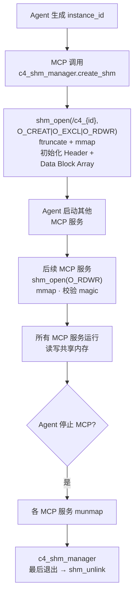
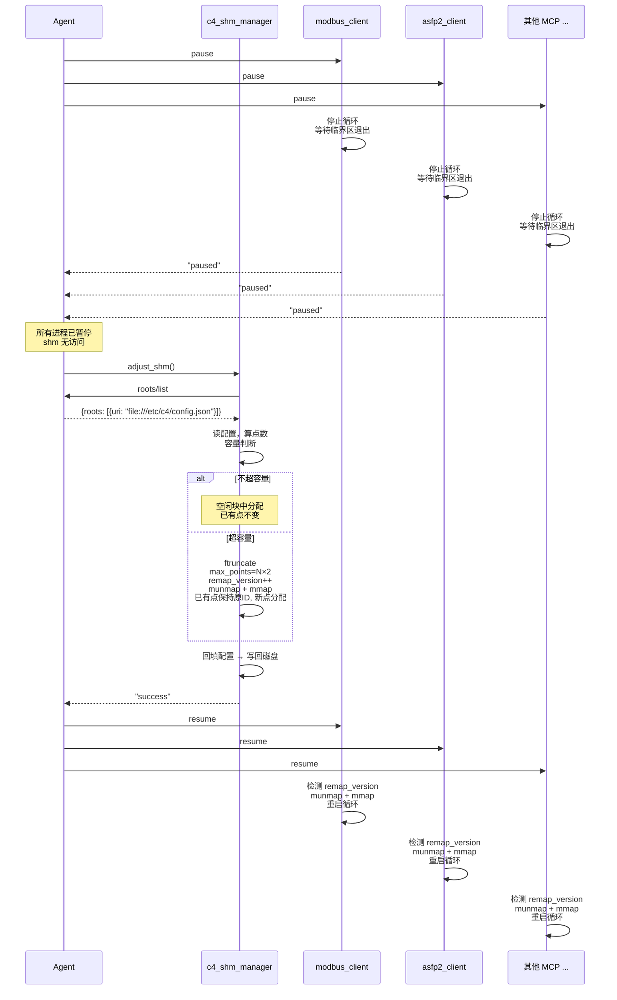
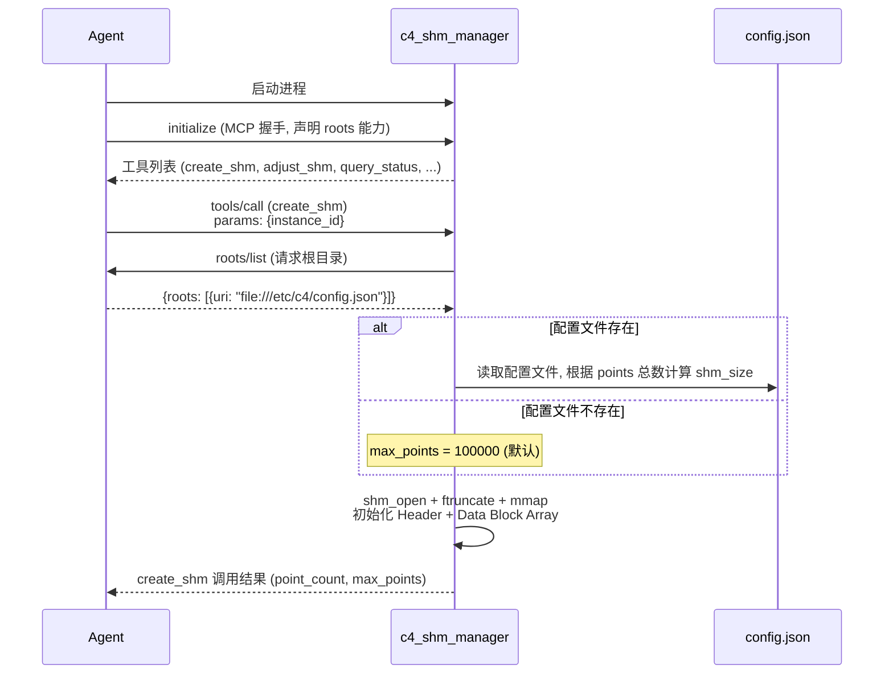
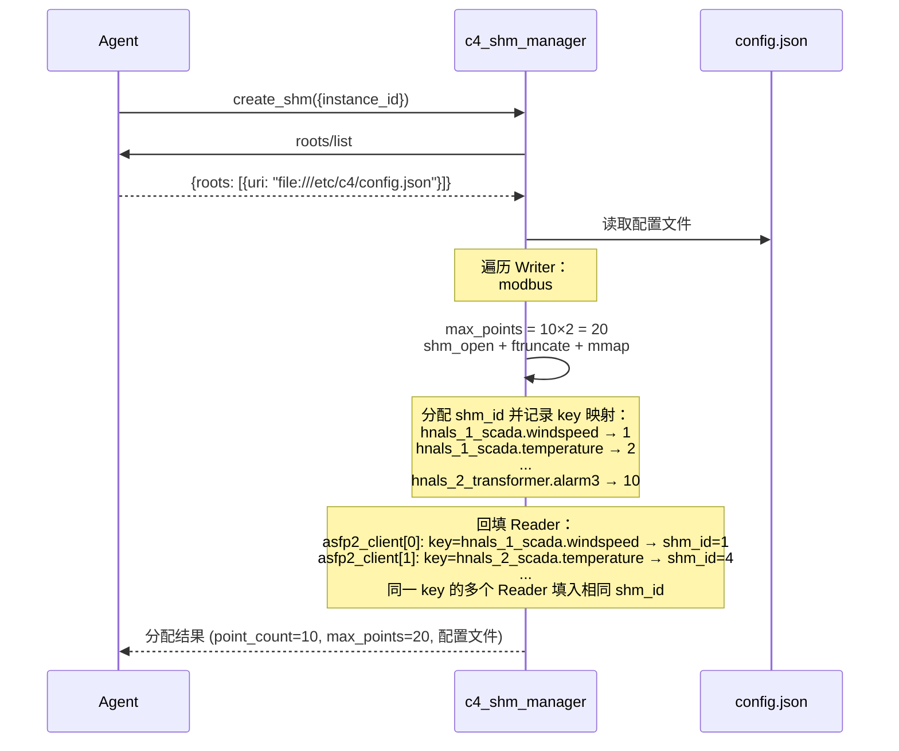
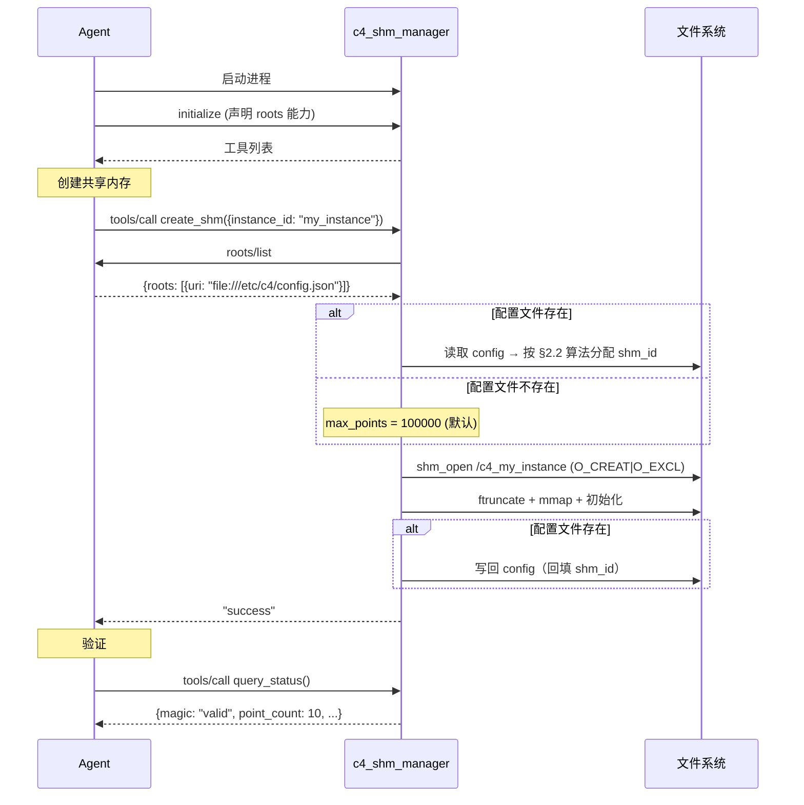
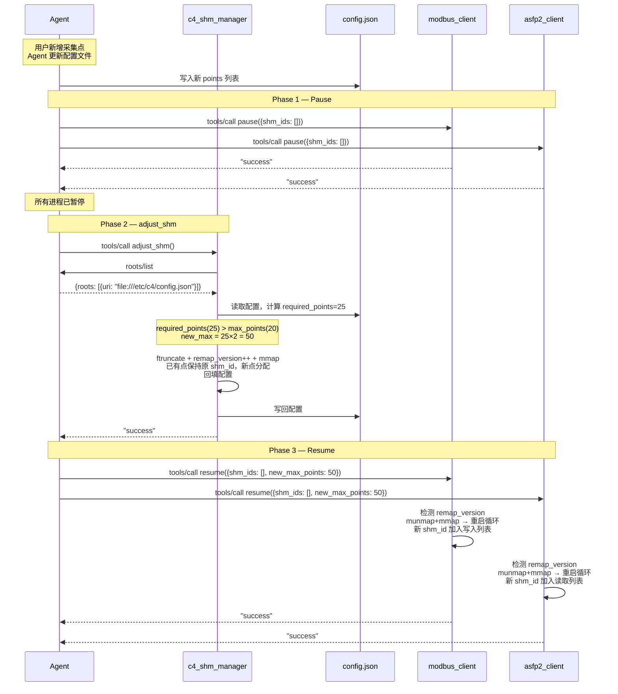
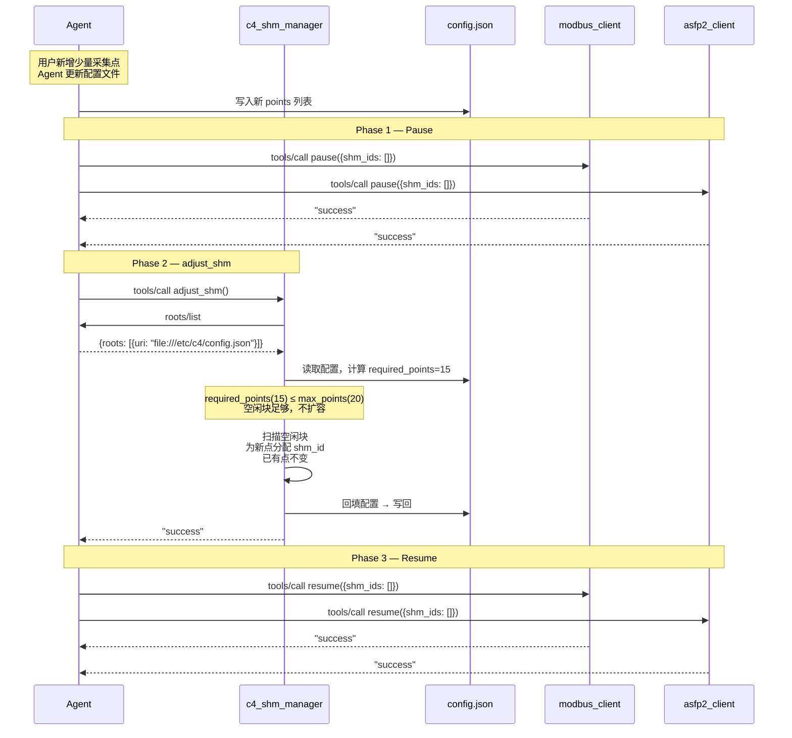

# C4 共享内存管理设计

> **版本**：v0.1.0 | **最后更新**：2026-07-15 | **父文档**：[c4_architecture.md](c4_architecture.md)

---

本文档描述 `c4_shm_manager` MCP 服务的详细设计，包括共享内存的创建、扩容、点分配、
配置文件解析、MCP 工具接口和错误码。共享内存的布局定义、并发协议和整体架构见
[c4_architecture.md](c4_architecture.md)。

---

## 1. 共享内存生命周期

共享内存由 **`c4_shm_manager`** 创建并管理。`c4_shm_manager` 是每个 C4 实例默认启动
的首个 MCP 服务，它通过 MCP 协议向 Agent 暴露共享内存管理的全部能力（创建、扩容、
块分配/回收、状态查询）。Agent 不直接操作共享内存——所有 shm 操作通过
`c4_shm_manager` 提供的 MCP 工具完成。

### 1.1 创建流程

```
Agent 生成 instance_id
        │
        │ MCP 工具调用 c4_shm_manager.create_shm
        ▼
┌───────────────────────────────────────────────┐
│            c4_shm_manager（Go）                 │
│                                               │
│  shm_open("/c4_{id}", O_CREAT|O_EXCL|O_RDWR)  │
│  ftruncate(shm_size)                           │
│  mmap                                         │
│  初始化 Header（magic, version, max_points）    │
│  写入所有 Data Block 的 magic = 0xC4DA7A00      │
│  写入 Header magic = 0xC4DA7A00 （最后）          │
│  返回创建结果 → Agent                          │
└───────────────────────────────────────────────┘
        │
        │ Agent 通过 MCP 协议启动其他 MCP 服务
        ▼
┌───────────────────────────────────────────────┐
│          其他 MCP 服务启动（Go）                 │
│  shm_open("/c4_{id}", O_RDWR)   // 不传 O_CREAT│
│  mmap                                         │
│  校验 magic == 0xC4DA7A00                      │
│  开始读写共享内存                               │
└───────────────────────────────────────────────┘
```



| 操作 | 说明 |
|------|------|
| 创建 | Agent 通过 MCP 工具调用 `c4_shm_manager`，命名规则 `/c4_{instance_id}` |
| 附加 | 后续 MCP 服务以普通 `O_RDWR` 或 `O_RDONLY` 打开，校验 `magic` 后附加 |
| 大小 | 无配置文件时默认 100k 点（≈3 MB）；配置文件存在时按 §2.2 算法计算，Agent 可通过 MCP 工具调整 |
| 销毁 | `c4_shm_manager` 最后退出时 `shm_unlink`；进程异常退出由操作系统回收 |

### 1.2 扩容与块分配管理

#### adjust_shm 统一调整机制

当用户新增采集点或启动新 Writer 后，Agent 更新配置文件，然后调用
`c4_shm_manager` 的 `adjust_shm` 工具一次性完成容量判断、扩容（如需）和点分配。
所有操作在 `c4_shm_manager` 进程内原子化完成。

**Pause-Resume 协议前置**：为确保 `ftruncate` / `munmap` 期间其他 MCP 进程不访问
共享内存（避免 SIGSEGV），Agent 调用 `adjust_shm` 前必须先执行 Pause-Resume 的
Pause 阶段（pause/resume 工具定义见 [c4_architecture.md §3.3.1](c4_architecture.md)）。流程如下：

```
Phase 1 - Pause：
  a. Agent 向所有 MCP 进程下发 pause 指令
  b. 每个 MCP 进程：
     - 停止读写循环（不再进入新临界区）
     - 等待所有 in-flight 临界区自然结束（最多一个写入周期）
     - 向 Agent ack "paused"

Phase 2 - adjust_shm：
  a. Agent 确认所有 MCP 进程已暂停 → 调用 c4_shm_manager.adjust_shm()
  b. c4_shm_manager 内部：
     - 通过 roots/list 获取配置文件路径
     - 读取配置文件，按 §2.2 算法计算所需点数 (required_points)
       ┌ 若 required_points ≤ current_max_points（不超容量）：
       │   在 state=0 的空闲块中为新点分配 shm_id
       │   已有点地址不变
       │   header.point_count = required_points
       └ 若 required_points > current_max_points（超容量）：
           new_max = required_points × 2
           ftruncate(shm_fd, (new_max + 1) × 32)
           header.max_points = new_max
           header.remap_version++          // 递增版本号
           munmap + mmap 新大小
           新增 block 全部写入 magic = 0xC4DA7A00
           已有点保持原 shm_id，配置中 shm_id=0 的新点分配空闲 shm_id
           header.point_count = required_points
     - 回填配置文件（将分配后的 shm_id 写入各 MCP Server 的 points 数组）
     - 写回配置文件到磁盘
     - 返回结果给 Agent

Phase 3 - Resume：
  a. Agent 向所有 MCP 进程下发 resume 指令（携带 new_max_points）
  b. 每个 MCP 进程：
     - 检测 header.remap_version 与本地 local_remap_version 不一致
     - munmap + mmap 新大小
     - local_remap_version = header.remap_version
     - 重启读写循环
```



**`remap_version` 的双重角色**：

- **主路径**：Pause-Resume 协议保证扩容时无人访问 shm，`remap_version` 作为恢复阶段各进程判断"是否需要重新映射"的依据
- **降级路径**：如果某个 MCP 进程因网络抖动错过了 resume 指令，它在下次读写循环前检测到 `remap_version` 变化后自行 munmap + mmap——不依赖信号到达

**扩容开销**：扩容过程中数据断流时长 ≈ pause 收集时间（< 1ms）+ ftruncate + mmap（~100μs）+ resume 恢复（< 1ms），总计 < 5ms。扩容是低频事件（数天至数月一次），可接受。

**关键性质**：

- **配置文件是唯一真相源**：`adjust_shm` 以配置文件中的 points 列表为准计算需求和分类 block（已有点 vs 孤儿块 vs 空闲块），不依赖 Agent 传入点数参数
- **已有点地址不变**：`ftruncate` 只追加尾部空间，已有 block 的物理偏移不变。配置文件中已有点的 shm_id 始终保持原值
- **shm_id 一次分配，终身不变**：寻址公式绑定物理位置，重编号会导致映射关系全乱
- **不缩容**：已分配后不再缩减共享内存，避免截断仍在使用的块。空间换简单性
- **回收逻辑另议**：Writer 停止或点表缩减时产生的孤儿 block 回收对应 C4_FUN_00055，不在当前 `adjust_shm` 范围内处理
- **全量离线可重建**：如果碎片严重，可在所有 writer 离线时 `shm_unlink` 后重新紧凑分配

#### 块回收

回收发生在 writer 停止或需要减少采集点时。必须确保 write 和 read 都已停止后才修改
`state`，避免与新分配的 writer 冲突。回收逻辑对应 C4_FUN_00055，不在 `adjust_shm` 中处理。

**`point_count` 的维护**：由于只有 `c4_shm_manager`（受 Agent 委托）做分配/回收操作，
`point_count` 的读写是无竞争的，无需原子操作保护。

#### Writer 替换示例

```
初始状态（create_shm 后，max_points=20）：
  writer1: [ 1..2]   (2个, state=1)
  writer2: [ 3..4]   (2个, state=1)
  writer3: [ 5..7]   (3个, state=1)
  writer4: [ 8..10]  (3个, state=1)
  空闲:    [11..20]  (10个, state=0)
  point_count=10

Agent 新增 writer5(15个)，生成新配置文件：

1. Agent → 所有 MCP: pause

2. Agent → c4_shm_manager: adjust_shm()
   required_points = 10 + 15 = 25
   current_max_points = 20
   required_points(25) > current_max_points(20) → 扩容
   new_max = 25 × 2 = 50
   ftruncate → max_points=50, remap_version++
   分配：已有 [1..10] 不变，新增 [11..25]
   空闲：[26..50] (25个, state=0)
   point_count=25
   回填配置，返回 "success"

3. Agent → 所有 MCP: resume

最终：
  writer1:  [ 1..2]   (2个, 不变)
  writer2:  [ 3..4]   (2个, 不变)
  writer3:  [ 5..7]   (3个, 不变)
  writer4:  [ 8..10]  (3个, 不变)
  writer5:  [11..25]  (15个, 新增)
  空闲:    [26..50]  (25个)
  point_count=25
```

关键性质：
- **已有点全部保持原 shm_id**：writer1~4 的 shm_id 不变，数据管道无需重配置
- **碎片可接受**：`shm_id * 32` 仍是 O(1) 直接寻址

### 1.3 `c4_shm_manager` 崩溃恢复

`c4_shm_manager` 崩溃后，POSIX 共享内存对象 `/c4_{id}` 仍然存在于 `/dev/shm`
（崩溃进程未调用 `shm_unlink`），其他 MCP 进程的 mmap 映射不受影响。

重启时不能走 `O_CREAT|O_EXCL` 路径——名字已被占用。流程如下：

```
c4_shm_manager 重启
        │
        │ shm_open("/c4_{id}", O_RDWR)  // 不传 O_CREAT
        │ 若失败（文件不存在或权限错误）→ shm_unlink + O_CREAT|O_EXCL 新建
        ▼
┌───────────────────────────────────────────────┐
│              附加已有共享内存                   │
│                                               │
│  mmap                                         │
│  校验 Header magic == 0xC4DA7A00              │
│  ┌─ 若 magic 无效：shm_unlink + 重建新 shm     │
│  └─ 若 magic 有效：                           │
│       扫描 block[1..max_points]               │
│         count = 0                             │
│         for i = 1..max_points:                │
│           if block[i].state == 1: count++     │
│         header.point_count = count            │
│        → 以 state=1 为唯一权威源重建 point_count│
│                                               │
│  恢复正常服务（可接受 alloc/free 请求）          │
└───────────────────────────────────────────────┘
```

关键保证：

- **其他 MCP 进程不受影响**：它们的 mmap 在 crash 期间始终有效，不会 SIGSEGV
- **`point_count` 自动修复**：扫描重建，不依赖崩溃前的内存值
- **`state=1` 是权威源**：即使崩溃发生在 alloc 后、writer 首次写入前（block 已分配但 state 仍为 0），重建后这些 block 自然为"空闲"，下次分配时回收——不浪费
- **始终复用而非重建**：重建意味着 `shm_unlink`，会导致其他进程的 mmap 失效后 SIGSEGV。只有 magic 校验失败（shm 真的损坏了）才走重建路径

---

## 2. 配置文件解析与 shm_id 分配算法

### 2.1 流程概述

Agent 与 `c4_shm_manager` 的交互遵循 MCP 标准协议。启动 `c4_shm_manager` 并创建共享内存的
完整流程如下：

```
1. Agent 启动 c4_shm_manager 进程
2. Agent 使用 MCP 协议初始化 c4_shm_manager，获得工具列表
   （Agent 须在 initialize 中声明 roots 能力，否则 c4_shm_manager 无法发送 roots/list 请求）
3. Agent 调用 c4_shm_manager 的 create_shm 工具（传入 instance_id）
4. c4_shm_manager 向 Agent 发送 roots/list 请求（MCP 协议中 server→client 的根目录查询）
   → Agent 返回配置文件的绝对路径 URI（含文件名）。文件名和路径可配置，例如
   `/etc/c4/shm.json` 或 `~/.local/c4/shared_memory.json`
5. c4_shm_manager 根据配置文件是否存在决定共享内存大小：
   - **配置文件不存在或为 null**（roots/list 返回空、文件路径不存在、或文件内容为空 JSON）：
     创建默认 10 万点共享内存空间（max_points = 100000，point_count = 0），
     所有 Data Block 初始化为 magic=0xC4DA7A00、state=0，
     此时无 Writer/Reader 配置，不涉及 shm_id 分配和配置回填
   - **配置文件存在**：
     读取并解析配置文件，若 c4_shm_manager.writer 为空则报错拒绝创建，
     否则按 §2.2 算法计算所需大小，创建并初始化共享内存空间，
     分配 shm_id 并回填配置文件
6. c4_shm_manager 向 Agent 返回 create_shm 的调用结果
```



### 2.2 分配算法

Agent 生成的配置文件中，各 MCP Server 的 `points` 数组中 `shm_id`
均默认为 0（表示尚未分配）。`c4_shm_manager` 在读取配置文件后，按以下算法计算所需空间
并分配全局唯一的 shm_id。

**MCP Server 分类**：

| 角色 | MCP Server | 说明 |
|------|-----------|------|
| **Writer** | `c4_modbus_client`、`c4_iec104_client`、`c4_asfp2_server` | 向共享内存写入数据。其中 `c4_asfp2_server` 无 points 列表（接收端按反向映射动态分配），静态分配时贡献 0 点 |
| **Reader** | `c4_asfp2_client`、`c4_influxdb_client` | 从共享内存读取数据 |

**算法**：

`c4_shm_manager` 根据配置文件中的 `c4_shm_manager.writer` 字段识别哪些 MCP Server 类型
需要分配 shm_id。该字段由 Agent 生成，数据来源于各 MCP Server 注册时声明的角色属性。

> **前置条件**：以下算法仅在配置文件存在且非空时执行。若配置文件不存在、为 null、
> 或文件内容为空 JSON，c4_shm_manager 创建默认 10 万点共享内存空间（max_points = 100000, point_count = 0），
> 不涉及 shm_id 分配和配置回填。

Writer 端通过 `{service_id}.{point_id}` 组合形成全局唯一 key（如 `hnals_1_scada.windspeed`），
Reader 端通过 `key` 字段引用同一 key。`c4_shm_manager` 据此为同一 data flow 的双方分配相同 shm_id。

```
1. 解析配置文件，读取 c4_shm_manager.writer 和 c4_shm_manager.reader 分类
   ┌ 若 c4_shm_manager 段缺失或 writer 为空或 reader 为空 → 报错，拒绝创建
   └ 若分类正常 → 继续
2. 遍历 writer 中列出的每个 MCP Server 类型，统计其 points 数组长度
   → writer_points = Σ 各 Writer 的 points.length
3. 计算共享内存容量：
   max_points = writer_points × 2   // 2 倍余量，供后续扩容
   shm_size = (max_points + 1) × 32  // +1 为 Header
4. 创建并初始化共享内存（shm_open → ftruncate → mmap → 初始化 Header + Data Block）
5. 为每个 Writer point 分配全局 shm_id（从 1 开始连续递增）：
   for each Writer 实例：
     for each entry in points：
       pid = next_id++
       key = "{service_id}.{point_id}"   // point_id 为 point 的 id 字段，如 "windspeed"
       ┌ 若 key 已存在 → 报错（key 冲突，存在重复的 service_id 或 point_id），拒绝创建
       └ 若 key 唯一 → 记录 key → pid 映射
   → 如 `hnals_1_scada.windspeed → 1`, `hnals_1_scada.temperature → 2`, ...
6. 回填 Reader 的 shm_id：
   遍历 reader 中列出的每个 MCP Server 类型，对每个 point entry：
     根据 entry.key 查找步骤 5 记录的 key → pid 映射
     ┌ 若找到映射 → 填入对应的 pid
     └ 若未找到 → 报错（Reader 引用了不存在的 Writer key），拒绝创建共享内存
     （同一 key 可出现在多个 Reader 中，实现一对多数据流）
7. 返回 create_shm 调用结果：{point_count, max_points, 分配后的配置文件}
   （c4_shm_manager 将回填后的配置文件写入磁盘）
```



**关键性质**：

- **Reader 不参与 shm_id 分配**：Reader 的 `shm_id` 引用 Writer 已分配的值，由 Agent 在 mapping 阶段填入
- **2 倍余量**：50% 的 point 直接在空闲区（state=0），后续新增采集点时若余量足够则无需扩容
- **连续递增**：简化寻址，避免碎片化管理
- **shm_id 从 1 开始**：shm_id=0 表示尚未分配，配置中默认为 0，由 `c4_shm_manager` 分配后回填为 ≥1 的实际值
- **key 解耦位置依赖**：Writer 通过 `{service_id}.{point_id}` 生成全局唯一 key，Reader 通过 `key` 引用。增删条目不影响已有 key 的映射关系
- **一对多数据流**：同一 key 可出现在多个 Reader 中，`c4_shm_manager` 为其填入相同的 shm_id，实现一份数据多路消费

---

## 3. MCP 工具定义

`c4_shm_manager` 通过 MCP 协议向 Agent 暴露以下工具（命名规范：`verb_noun`）。
所有参数和返回值均使用 JSON 格式，schema 遵循 JSON Schema Draft 2020-12。

**MCP 错误约定**：
- **协议层错误**（tool 不存在、参数 schema 不匹配、JSON 解析失败）→ JSON-RPC `error` 对象，code 为 `-32601` / `-32602` / `-32700`，由 MCP 框架/传输层直接返回
- **业务层错误**（tool 成功路由到 handler，但业务逻辑执行失败）→ `result.isError: true`，`content[0].text` 以 `ERROR_TYPE:` 前缀开头

> 示例：参数缺失 `instance_id` → JSON-RPC `{"error": {"code": -32602, "message": "Invalid params: missing required field 'instance_id'"}}`；
> 共享内存已存在 → `{"result": {"content": [{"type": "text", "text": "SHM_ALREADY_EXISTS: ..."}], "isError": true}}`。

---

### 3.1 Tool: `create_shm`

创建共享内存，按 §2.2 算法解析配置文件、分配 shm_id 并初始化共享内存。

**触发条件**：`c4_shm_manager` 首次启动后、Agent 准备启动其他 MCP 服务前调用。

**参数**：

```json
{
    "name": "create_shm",
    "description": "创建 POSIX 共享内存，解析配置文件并按 key 分配全局 shm_id",
    "inputSchema": {
        "type": "object",
        "properties": {
            "instance_id": {
                "type": "string",
                "description": "C4 实例标识符。共享内存命名为 /c4_{instance_id}"
            }
        },
        "required": ["instance_id"]
    }
}
```

**内部流程**：

1. 向 Agent 发送 `roots/list` 请求，获取配置文件绝对路径 URI
2. 若配置文件不存在或为 null（roots/list 返回空、路径无效、或文件内容为空 JSON）：
   a. `shm_open("/c4_{instance_id}", O_CREAT|O_EXCL|O_RDWR)` → `ftruncate` → `mmap`
   b. Header 字段：`magic = 0xC4DA7A00`、`version = 1`、`max_points = 100000`、`point_count = 0`；
      其余字段（`remap_version`、`global_write_seq`、`reserved`）保持 `ftruncate` 零填充后的默认值 `0`（参见 [c4_architecture.md §2.2.1](c4_architecture.md) 初始化规则）
   c. 初始化所有 Data Block 的 `magic = 0xC4DA7A00`（state 自然为 0）
   d. 写入 Header `magic = 0xC4DA7A00`（最终提交）
   e. 跳至步骤 6（不涉及 shm_id 分配和配置回填）
3. 若配置文件存在：
   a. 读取配置文件，按 §2.2 算法分配 shm_id 并回填到各 MCP Server 的 `points` 数组
      ┌ 若 `c4_shm_manager.writer` 或 `c4_shm_manager.reader` 为空 → 返回 `CONFIG_MISSING_SECTION` 错误
      └ 若正常 → 继续
   b. `shm_open("/c4_{instance_id}", O_CREAT|O_EXCL|O_RDWR)` → `ftruncate` → `mmap`
   c. 初始化所有 Data Block 的 `magic = 0xC4DA7A00`（state 自然为 0）
   d. 写入 Header `magic = 0xC4DA7A00`
   e. 将回填 shm_id 后的配置文件写回磁盘
4. 返回结果给 Agent

**返回值**：成功时返回 `"success"`。
`point_count = 0`、`max_points = 100000` 表示以默认模式创建（配置文件不存在）。

**MCP 应答示例**：

```json
// ========== 成功：配置文件存在，按算法创建 ==========
// --> 请求
{"jsonrpc": "2.0", "id": 1, "method": "tools/call", "params": {"name": "create_shm", "arguments": {"instance_id": "hnals_farm_01"}}}
// <-- 应答
{"jsonrpc": "2.0", "id": 1, "result": {"content": [{"type": "text", "text": "success"}], "isError": false}}

// ========== 成功：配置文件不存在，默认 10 万点 ==========
// --> 请求
{"jsonrpc": "2.0", "id": 1, "method": "tools/call", "params": {"name": "create_shm", "arguments": {"instance_id": "hnals_farm_01"}}}
// <-- 应答
{"jsonrpc": "2.0", "id": 1, "result": {"content": [{"type": "text", "text": "success"}], "isError": false}}

// ========== 业务错误：共享内存已存在 ==========
// <-- 应答
{"jsonrpc": "2.0", "id": 1, "result": {"content": [{"type": "text", "text": "SHM_ALREADY_EXISTS: /c4_hnals_farm_01 is already created"}], "isError": true}}

// ========== 业务错误：c4_shm_manager 配置段缺少 writer ==========
// <-- 应答
{"jsonrpc": "2.0", "id": 1, "result": {"content": [{"type": "text", "text": "CONFIG_MISSING_SECTION: 'c4_shm_manager.writer' or 'c4_shm_manager.reader' not found or empty in config"}], "isError": true}}

// ========== 业务错误：Writer 端 key 冲突 ==========
// <-- 应答
{"jsonrpc": "2.0", "id": 1, "result": {"content": [{"type": "text", "text": "DUPLICATE_KEY: key 'hnals_1_scada.windspeed' already assigned to shm_id=1, duplicate found in c4_modbus_client[1]"}], "isError": true}}

// ========== 业务错误：Reader key 不存在 ==========
// <-- 应答
{"jsonrpc": "2.0", "id": 1, "result": {"content": [{"type": "text", "text": "UNKNOWN_READER_KEY: reader 'c4_asfp2_client[0].points[3].key' = 'unknown_scada.windspeed' not found in any writer"}], "isError": true}}

// ========== 业务错误：roots/list MCP 调用失败 ==========
// <-- 应答
{"jsonrpc": "2.0", "id": 1, "result": {"content": [{"type": "text", "text": "CONFIG_PATH_MISSING: roots/list protocol call failed, Agent may not be responding"}], "isError": true}}

// ========== 业务错误：系统调用失败 ==========
// <-- 应答
{"jsonrpc": "2.0", "id": 1, "result": {"content": [{"type": "text", "text": "SHM_SYSCALL_FAILED: ftruncate failed - ENOSPC (No space left on device)"}], "isError": true}}

// ========== 协议层错误：参数缺失 ==========
// <-- 应答
{"jsonrpc": "2.0", "id": 1, "error": {"code": -32602, "message": "Invalid params: missing required field 'instance_id'"}}
```

---

### 3.2 Tool: `adjust_shm`

根据配置文件计算所需点数，判断是否需要扩容，并为所有点分配 shm_id。
已有点的 shm_id 保持不变，新点在空闲块或扩容后的新空间中分配。

**前置条件**：Agent 必须先通过 Pause-Resume 协议暂停所有 MCP 进程的数据路径
（见 §1.2），确认所有进程已暂停后再调用此工具。

**触发条件**：Agent 更新配置文件后（新增 Writer、新增采集点），需要调整共享内存
容量和点分配。

**参数**：

```json
{
    "name": "adjust_shm",
    "description": "调整共享内存容量和点分配。根据配置文件计算所需点数，如不超容量则在空闲块中分配新点，超容量则扩容至所需点数的 2 倍后分配。已有点地址不变",
    "inputSchema": {
        "type": "object",
        "properties": {},
        "required": []
    }
}
```

**内部流程**：

1. 向 Agent 发送 `roots/list` 请求，获取配置文件绝对路径 URI
   ┌ 若 roots/list 失败或返回空 → 返回 `CONFIG_PATH_MISSING` 错误
   └ 正常 → 继续
2. 读取配置文件，按 §2.2 算法计算所需点数 (`required_points`)
   ┌ 若 `c4_shm_manager.writer` 或 `reader` 缺失或为空 → 返回 `CONFIG_MISSING_SECTION` 错误
   └ 正常 → 继续
3. 读取当前共享内存 Header，获取 `current_max_points`
4. 容量判断与执行：
   a. **不超容量**（`required_points ≤ current_max_points`）：
      - 扫描 `block[1..max_points]`，收集 `state=0` 的空闲 shm_id
      - 为配置文件中 `shm_id=0` 的新点分配空闲 shm_id
      - 已有点（已有 shm_id 的）地址不变
      - `header.point_count = required_points`
   b. **超容量**（`required_points > current_max_points`）：
      - `new_max_points = required_points × 2`
      - `ftruncate(shm_fd, (new_max_points + 1) × 32)`
      - `header.max_points = new_max_points`
      - `header.remap_version++`
      - `munmap` 旧映射 → `mmap` 新大小
      - 新增 block 全部写入 `magic = 0xC4DA7A00`
      - 已有点保持原 shm_id，配置中 `shm_id=0` 的新点分配空闲 shm_id
      - `header.point_count = required_points`
5. 回填配置文件（将分配后的 shm_id 写入各 MCP Server 的 `points` 数组）
6. 写回配置文件到磁盘
7. 返回结果给 Agent

> **部分失败恢复**：`adjust_shm` 的内部操作序列非原子。若中途失败：
> - **写入 Header 后、配置文件写入前失败**：shm 已更新但 config 未回写。此时 `adjust_shm` 的 no-expand 路径通过扫描 `state=0` 分配空闲块，若上次已分配的 block 已是 `state=1`，可能无法完成回填。此场景将在 C4_FUN_00055（回收/再分配）设计中统一处理。
> - **`mmap` 后文件尺寸与 `header.max_points` 不一致**（崩溃发生在 `ftruncate` 后、`header.max_points` 更新前）：重启后 `c4_shm_manager` `mmap` 时检测 `file_size > (header.max_points + 1) × BLOCK_SIZE`，以文件尺寸为准修正 `header.max_points`，然后按 §1.3 崩溃恢复流程重建 `point_count`。
> - **配置文件必须原子写入**：回填配置文件时使用 write-to-temp + `fsync` + `rename` 模式，避免中途崩溃导致配置文件损坏（半写 JSON 无法解析）。

**返回值**：成功时返回 `"success"`。Agent 需要状态信息时可调用 `query_status`。

**MCP 应答示例**：

```json
// ========== 成功 ==========
// --> 请求
{"jsonrpc": "2.0", "id": 2, "method": "tools/call", "params": {"name": "adjust_shm", "arguments": {}}}
// <-- 应答
{"jsonrpc": "2.0", "id": 2, "result": {"content": [{"type": "text", "text": "success"}], "isError": false}}

// ========== 业务错误：共享内存未创建 ==========
// <-- 应答
{"jsonrpc": "2.0", "id": 2, "result": {"content": [{"type": "text", "text": "SHM_NOT_CREATED: shared memory not initialized, call create_shm first"}], "isError": true}}

// ========== 业务错误：配置文件缺失 ==========
// <-- 应答
{"jsonrpc": "2.0", "id": 2, "result": {"content": [{"type": "text", "text": "CONFIG_PATH_MISSING: roots/list protocol call failed, Agent may not be responding"}], "isError": true}}

// ========== 业务错误：配置段缺失 ==========
// <-- 应答
{"jsonrpc": "2.0", "id": 2, "result": {"content": [{"type": "text", "text": "CONFIG_MISSING_SECTION: 'c4_shm_manager.writer' or 'c4_shm_manager.reader' not found or empty in config"}], "isError": true}}

// ========== 业务错误：系统调用失败 ==========
// <-- 应答
{"jsonrpc": "2.0", "id": 2, "result": {"content": [{"type": "text", "text": "SHM_SYSCALL_FAILED: ftruncate failed - ENOSPC (No space left on device)"}], "isError": true}}

// ========== 业务错误：key 冲突 ==========
// <-- 应答
{"jsonrpc": "2.0", "id": 2, "result": {"content": [{"type": "text", "text": "DUPLICATE_KEY: key 'hnals_1_scada.windspeed' already assigned to shm_id=1, duplicate found in c4_modbus_client[1]"}], "isError": true}}

// ========== 业务错误：Reader key 不存在 ==========
// <-- 应答
{"jsonrpc": "2.0", "id": 2, "result": {"content": [{"type": "text", "text": "UNKNOWN_READER_KEY: reader 'c4_asfp2_client[0].points[3].key' = 'unknown_scada.windspeed' not found in any writer"}], "isError": true}}
```

---

### 3.3 Tool: `query_status`

查询共享内存整体状态，包括容量、活跃点数、空闲块数和 Header 完整性信息。

**触发条件**：Agent 周期性监控（心跳）、用户查询、故障诊断。

**参数**：

```json
{
    "name": "query_status",
    "description": "查询共享内存的整体状态，包括容量、活跃点、空闲块、Header 校验信息",
    "inputSchema": {
        "type": "object",
        "properties": {},
        "required": []
    }
}
```

**返回值**：

| 字段 | 类型 | 说明 |
|------|------|------|
| `magic` | string | Header magic 校验结果：`"valid"` / `"invalid"` / `"not_found"` |
| `version` | integer | 布局版本号 |
| `remap_version` | integer | 当前 remap 版本号 |
| `point_count` | integer | 当前活跃 point 数量（state=1 的 block 总数） |
| `max_points` | integer | 共享内存最大 point 容量 |
| `free_blocks` | integer | 空闲块数量（= max_points - point_count） |
| `global_write_seq` | integer | 全局写入序号 |

**MCP 应答示例**：

```json
// ========== 成功 ==========
// --> 请求
{"jsonrpc": "2.0", "id": 6, "method": "tools/call", "params": {"name": "query_status", "arguments": {}}}
// <-- 应答
{"jsonrpc": "2.0", "id": 6, "result": {"content": [{"type": "text", "text": "{\"magic\":\"valid\",\"version\":1,\"remap_version\":1,\"point_count\":10,\"max_points\":20,\"free_blocks\":10,\"global_write_seq\":15042}"}], "isError": false}}

// ========== 业务错误：magic 损坏 ==========
// <-- 应答
{"jsonrpc": "2.0", "id": 6, "result": {"content": [{"type": "text", "text": "SHM_CORRUPTED: header magic is 0x00000000, expected 0xC4DA7A00"}], "isError": true}}

// ========== 业务错误：共享内存未创建 ==========
// <-- 应答
{"jsonrpc": "2.0", "id": 6, "result": {"content": [{"type": "text", "text": "SHM_NOT_CREATED: shared memory /c4_hnals_farm_01 does not exist"}], "isError": true}}
```

---

## 4. 典型交互时序

### 4.1 场景一：首次创建



### 4.2 场景二：扩容流程



### 4.3 场景三：不扩容（空闲块足够）



### 4.4 场景四：Writer 崩溃后回收

回收流程对应 C4_FUN_00055，不在 `adjust_shm` 中处理。Agent 检测到 writer 心跳超时后，
通过 Pause-Resume 协议暂停相关 reader，然后通过共享内存直接操作回收对应的 block
（state → 0，point_count 递减）。详见 C4_FUN_00055 设计。

---

## 5. 错误码汇总

**业务层错误**（`result.isError: true`，`content[0].text` 以 `ERROR_TYPE:` 前缀开头）：

| 错误码 | 含义 | 触发工具 |
|--------|------|---------|
| `SHM_ALREADY_EXISTS` | 共享内存已存在（O_EXCL 冲突） | `create_shm` |
| `SHM_NOT_CREATED` | 共享内存尚未创建 | `adjust_shm`, `query_status` |
| `SHM_CORRUPTED` | Header magic 校验失败 | `query_status`, `resume` |
| `SHM_SYSCALL_FAILED` | POSIX 系统调用失败（shm_open / ftruncate / mmap） | `create_shm`, `adjust_shm` |
| `CONFIG_MISSING_SECTION` | 配置文件存在，但 `c4_shm_manager.writer` 或 `reader` 缺失或为空 | `create_shm`, `adjust_shm` |
| `CONFIG_PATH_MISSING` | roots/list MCP 协议调用失败（Agent 不可达或超时） | `create_shm`, `adjust_shm` |
| `DUPLICATE_KEY` | 两个 Writer point 的 `{service_id}.{point_id}` 重复 | `create_shm`, `adjust_shm` |
| `UNKNOWN_READER_KEY` | Reader 的 `key` 字段引用了不存在的 Writer key | `create_shm`, `adjust_shm` |

**协议层错误**（JSON-RPC `error` 对象，由 MCP 框架/传输层直接返回）：

| JSON-RPC code | 含义 | 触发场景 |
|---------------|------|---------|
| `-32601` | Method not found | tool 名称拼写错误或不存在 |
| `-32602` | Invalid params | 必填参数缺失、类型错误、schema 校验失败 |
| `-32700` | Parse error | JSON 格式不合法 |

> **对应功能**：C4_FUN_00053, C4_FUN_00054, C4_FUN_00055, C4_FUN_00056, C4_FUN_00049
