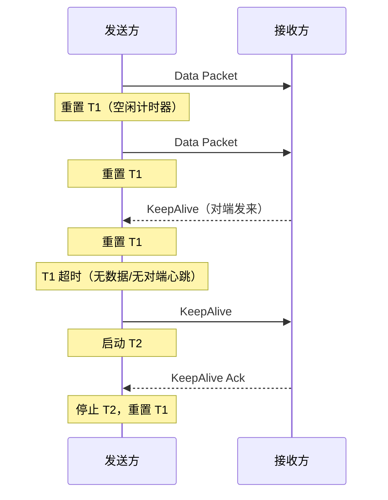

# ActiveSys转发协议(版本2) — ASFP2 协议规范

> **提取自**：`docs/C4.docx` 第8章 | **提取日期**：2026-07-11

ActiveSys转发协议第二版本(ActiveSys Forward Protocol 2)简称ASFP2，用于集控产品底层数据采集和转发网络中，负责将数据在各个节点转发。

ASFP2从ASFP发展而来，它继承了ASFP的优点，例如隔离穿透等，同时它还解决ASFP本身的一些如占用带宽高等问题，此外还具备了一些新特性如双向的keep-alive。

## 与ASFP协议的不同

ASFP2虽然从ASFP发展而来，但是二进制格式并不兼容，与ASFP相比，ASFP2有如下不同点：
UINT32类型的key：
ASFP中设计了可变长度的key，目的是支持多种类型的可以，但是实践中表明uint32类型的key就足够使用了，所以ASFP2仅支持uint32类型的key。
协议标识符和版本号：
协议头中的标识符引入的版本号，这样做的目的是为了向后兼容。
支持协议属性：
通过属性可以改变协议二进制格式，用以适应各种传输情况。
支持超过255秒的超时时间：
ASFP2支持超过255秒的T0~T2的设置。

## 包结构

ASFP2协议包含两种包结构，数据包和心跳包。

### 数据包

```
| byte0  |  byte1 |  byte2 | byte3  |
+--------+--------+--------+--------+  \
| ‘A’    ‘S’    ‘F’   ‘P’   |   |
+                                   +   |
|  ‘V’   ‘2’   ‘0’   ‘0’    |   > header
+--------+--------+--------+--------+   |
|  length         |    count        |   |
+--------+--------+--------+--------+   |
|             attribute             |  /
+--------+--------+--------+--------+  \
| type   |      key                 |  |
+--------+--------+--------+--------+  |
|                                   |  > mutable
+             timestamp             +  |
|                                   |  |
+--------+--------+--------+--------+  /
|             value 0               |  |
+--------+--------+--------+--------+  > data
|             value 1               |  |
+--------+--------+--------+--------+  /
|                 ……                 |
图 81 ASFP2数据包格式
```

数据包包含三部分：头部Header，可变部分Mutable和数据Data。

#### ASFP2 Header

Header分为四部分，标志位Flag，包长度Length，数据项个数Count，包属性Attribute。
Flag：
ASFP2标志位是8个字节，包含标志字符串和版本字符串，目前ASFP2的版本号是ASFP2.0.0所以Flag就是字符串”ASFPV200”。如果后续ASFP2协议发布新版本例如ASFP2.1.8，那么Flag的编码就变成了”ASFPV218”。
Length：
ASFP2包长度，2个字节，包含Header的长度，单位是字节。所以一个数据包的最大长度是65535个字节。
Count：
ASFP2包中包含的数据项的个数，2个字节。所以一个数据包中最多包含65535个数据项。
Attribute：
ASFP2数据项属性，4个字节。这个字段影响了Mutable和Data部分的编码方式，具体的影响方式参考8.2.1.2和8.2.1.3。目前Attribute只有低三位有效其余部分都是0：
表 81 ASFP2 Attribute有效值
值
宏定义
0x00000001
ASFP2_ATTRIBUTE_KEY_SEQUENCE
0x00000002
ASFP2_ATTRIBUTE_SAME_DATA_TYPE
0x00000004
ASFP2_ATTRIBUTE_SAME_TIMESTAMPE

ASFP2 Header中各个字段都是网络序。

#### ASFP2 Mutable

ASFP2 Mutable是协议的可变部分，它受到Attribute的影响。Mutable的目的是当数据包中的各个数据项有相同的部分或者是可以通过一个值可以推导出来的话，可以将这部分数据提取出来放在Mutable部分。ASFP2中每个数据项都有4部分组成，key，type，value和timestamp。其中在一个包中type和timestamp可能所有数据项都是相同的，那么就可以将type和timestamp提取出来，放在Mutable部分中，这样数据项中就不必再出现type和timestamp字段了。对于key，ASFP2采用UINT32类型的key，一个包中可能数据项从第一个到最后一个是连续的，所以这样也可以将第一个key提取出来放在Mutable部分中，后续的key都可以根据第一个key推导出来。

Attribute的三个值就是对应这三种情况的，当Attribute的低三位全部有效的时候，Mutable的type，key和timestamp全部出现，顺序与图 81顺序一致。当Attribute低三位全部无效的时候，Mutable不出现。

Mutable各个字段都是网络序的。

Key：
当ASFP2_ATTRIBUTE_KEY_SEQUENCE有效，表示数据包中各个数据项的key是顺序出现的，Mutable中的key是第一个数据项的key，数据项中不再出现key，其他数据项的key都是前一个数据项的key+1。
当ASFP2_ATTRIBUTE_KEY_SEQUENCE无效的时候，mutable中的key不出现，每个数据项都带有自己的key。
Mutable的key采用3个字节编码，所以ASFP2协议中支持的最大的key就是16777215。
Type：
当ASFP2_ATTRIBUTE_SAME_DATA_TYPE有效，表示数据包中各个数据项的type都是一致的，这个值出现在Mutable的type字段中，数据项中不再出现type。
当ASFP2_ATTRIBUTE_SAME_DATA_TYPE无效，Mutable中不出现type，每个数据项带有自己的type。
具体type的定义请参考8.2.1.3.1。
Timestamp：
当ASFP2_ATTRIBUTE_SAME_TIMESTAMPE有效，表示数据包中各个数据项的timestamp都是一致的，这个值出现在Mutable的timestamp字段中，数据项中不再出现timestamp。
当ASFP2_ATTRIBUTE_SAME_TIMESTAMPE无效，Mutable中不出现timestamp，每个数据项都带有自己的timestamp。
具体timestamp定义请参考8.2.1.3.3。

#### ASFP2 Data

ASFP2 Data部分携带所有的数据，数据项之间是连续编码，每一个数据项的完整格式如下：
```
| byte0  |  byte1 |  byte2 | byte3  |
+--------+--------+--------+--------+
|  type  |      key                 |
+--------+--------+--------+--------+
|                                   |
+             timestamp             +
|                                   |
+--------+--------+--------+--------+
|             value                 |
+--------+--------+--------+--------+
图 82 ASFP2一个数据项的结构
```


数据项中的type，key，timestamp是由Attribute字段决定是否出现在数据项中的，但是value必须出现，因为它表示实际的数据。Data中的各个字段都是网络序的。

Type
Type表示数据的类型，实际的数据长度由Type决定，Type的具体定义如下：
表 82 ASFP2数据类型定义
值
含义
宏定义
长度
0
Boolean类型
ASFP2_TYPE_BOOLEAN
1位
1
有符号8位整数
ASFP2_TYPE_INT8
1字节
2
无符号8位整数
ASFP2_TYPE_UINT8
1字节
3
有符号16位整数
ASFP2_TYPE_INT16
2字节
4
无符号16位整数
ASFP2_TYPE_UINT16
2字节
5
有符号32位整数
ASFP2_TYPE_INT32
4字节
6
无符号32位整数
ASFP2_TYPE_UINT32
4字节
7
有符号64位整数
ASFP2_TYPE_INT64
8字节
8
无符号64位整数
ASFP2_TYPE_UINT64
8字节
9
16位浮点数
ASFP2_TYPE_FLOAT16
2字节
10
32位浮点数
ASFP2_TYPE_FLOAT32
4字节
11
64位浮点数
ASFP2_TYPE_FLOAT64
8字节
12
字符串类型
ASFP2_TYPE_STRING
由长度决定
13
二进制数据块类型
ASFP2_TYPE_BLOB
由长度决定
14
位串类型
ASFP2_TYPE_BITSTRING
由长度决定
15
位
ASFP2_TYPE_BIT
1位

Key
Key字段采用三个字节编码，所以key的最大值是16777215。

Timestampe
时间戳，是采集上来的数据的时间戳，64位长，网络序。这个时间戳表示的是时间戳产生的时刻与元(1970-01-01 00:00:00 000)时间之间的差值，单位是毫秒。当配置文件中的smart选项生效时，ASFP2客户端自动将时间戳毫秒设置成0，这样能够保证传输使用更大的包，吞吐量更大，例如1768848814264，当smart设置为0时就变成1768848814000。

Value
Value是实际的数据，是字节对齐的，没有填充，这一点是与ASFP不同的。数据中的数值都是采用网络序传输。各种数据类型的数据传输格式都是不同的：

位类型
位类型包括ASFP2_TYPE_BOOLEAN和ASFP2_TYPE_BIT。对于ASFP2_TYPE_BOOLEAN和ASFP2_TYPE_BIT类型来说，每个数据占用一个字节，最低位表示有效，其他位都是0。
但是这两个类型还有一个特殊情况，当ASFP2_ATTRIBUTE_KEY_SEQUENCE, ASFP2_ATTRIBUTE_SAME_DATA_TYPE, ASFP2_ATTRIBUTE_SAME_TIMESTAMP三个属性都有效的时候，采用压缩的模式，每个数据占用一位，数据是字节对齐的，每个字节都是从地位到高位编号的，最后一个字节的高位填充0。

例子一：
包中包含5个数据，数据不足一个字节，采用一个字节传输数据，高三位填充。那么这个值就是：
```
|bit7|bit6|bit5|bit4|bit3|bit2|bit1|bit0|
+----+----+----+----+----+----+----+----+
| 0  | 0  | 0  | 1  | 1  | 1  | 1  | 1  |
+----+----+----+----+----+----+----+----+
图 83 有5个数据的位类型的ASFP2数据的压缩编码格式
```


例子二：
包中包含10个数据，那么占用两个字节，第一个字节表示数据0~7，第二个字节从低位开始表示数据8和9，高六位填充成0：
```
|bit7|bit6|bit5|bit4|bit3|bit2|bit1|bit0|
+----+----+----+----+----+----+----+----+
| 1  | 1  | 1  | 1  | 1  | 1  | 1  | 1  |
+----+----+----+----+----+----+----+----+
```


```
|bit7|bit6|bit5|bit4|bit3|bit2|bit1|bit0|
+----+----+----+----+----+----+----+----+
| 0  | 0  | 0  | 0  | 0  | 0  | 1  | 1  |
+----+----+----+----+----+----+----+----+
图 84 有10个数据的位类型的ASFP2数据的压缩编码格式
```


整数类型
整数类型包括ASFP2_TYPE_INT8, ASFP2_TYPE_UINT8, ASFP2_TYPE_INT16, ASFP2_TYPE_UINT16, ASFP2_TYPE_INT32, ASFP2_TYPE_UINT32, ASFP2_TYPE_INT64, ASFP2_TYPE_UINT64，这些类型没有什么特殊的地方，它们按照各自的长度传输，使用网络序进行传输。

浮点数类型
包括ASFP2_TYPE_FLOAT16, ASFP2_TYPE_FLOAT32, ASFP2_TYPE_FLOAT64。浮点数按照各自的长度使用**网络序（大端）**进行传输，小端主机（x86/ARM）收发时需字节 swap。具体见 §ASFP2协议的2.1.1版本。

字符(字节)串类型
包括ASFP2_TYPE_STRING和ASFP2_TYPE_BLOB类型，它们实质上是相同的，只是传送的数据不同，ASFP2_TYPE_STRING传输的字符的ASCII，ASFP2_TYPE_BLOB传输的是二进制数据，它们具有相同的结构：
```
| byte0  | byte1  | byte2  | byte3  |
+--------+--------+--------+--------+
|      length     |                 |
+--------+--------+                 +
|                                   |
+             string or blob        +
|                                   |
+                                   +
图 85 字符(字节)串类型数据的编码结构
```


前两个字节表示string或者blob的字节数，length采用网络序传输，string不包含’\0’。

位串类型
位串类型ASFP2_TYPE_BITSTRING类型在结构上与ASFP2_TYPE_STRING或者ASFP2_TYPE_BLOB是相同的，但是length指的是位的长度，并且位串是字节对齐的，最后一个字节的低位填充。结构如下：
```
| byte0  | byte1  | byte2  | byte3  |
+--------+--------+--------+--------+
|      length     |                 |
+--------+--------+                 +
|                                   |
+             bitstring             +
|                                   |
+                                   +
图 86 位串类型数据的编码结构
```


例如要传输一个20位的位串，编码之后的结果是：
00 14 FF FF F0
红色字体表示位串的长度20位，蓝色字体表示位串的数据位，20个1，黑色的0是填充位。

### 心跳包

ASFP2的心跳包与ASFP的不同有两点：
双向的Keep Alive。将客户端到服务器的Keep Alive称作正向Keep Alive，服务器到客户端的Keep Alive称作反向Keep Alive。
服务器发送的Keep Alive以及Keep Alive Ack只发送单个字节。

#### 正向Keep Alive

正向Keep Alive结构：
```
| byte0  |  byte1 |  byte2 | byte3  |
+--------+--------+--------+--------+
|  ‘K’    ‘E’     ‘E’   ‘P’ |
+--------+--------+--------+--------+
图 87 ASFP2正向Keep Alive
```


正向Keep Alive Ack是一个字节，这个字节的值可以配置，典型值是0xFF。
```
| byte0  |
+--------+
|  0xFF  |
+--------+
图 88 ASFP2正向Keep Alive Ack
```


#### 反向Keep Alive

反向Keep Alive是服务器向客户端发送一个字节，这个字节可配置，典型值是0x00，但是配置的值不能够与正向Keep Alive Ack一致。
```
| byte0  |
+--------+
|  0x00  |
+--------+
图 89 ASFP2反向Keep Alive
```


反向Keep Alive Ack结构：
```
| byte0  |  byte1 |  byte2 | byte3  |
+--------+--------+--------+--------+
|  ‘K’    ‘A’     ‘C’   ‘K’ |
+--------+--------+--------+--------+
图 810 ASFP2反向Keep Alive Ack
```


## 协议时序

ASFP2包含两种时序，数据时序和心跳时序，只有客户端有数据时序，但是心跳时序是客户端和服务器都有的。

### 数据时序

数据时序是客户端周期性的给服务器发送数据。

```
    Client                          Server
       |                               |
       |                               |
       |-------- Data ---------------->|
       |                               |
       |-------- Data ---------------->|
       |                               |
       |-------- Data ---------------->|
       |                               |

图 811 ASFP2数据时序
```

### 客户端心跳时序

客户选定期给服务器发送正向Keep Alive，并且接收服务器发送的正向Keep Alive Ack。

```
    Client                          Server
       |                               |
       |                               |
       |-------- KeepAlive ----------->|
       |                               |
       |<-- KeepAlive Ack -------------|
       |                               |
       |-------- KeepAlive ----------->|
       |                               |

图 812 ASFP2正向Keep Alive时序
```

### 服务器端心跳时序

服务器端心跳时序是服务器端定期发送反向Keep Alive，并且从客户端接收反向Keep Alive Ack。

```
    Client                          Server
       |                               |
       |                               |
       |<-- KeepAlive -----------------|
       |                               |
       |-------- KeepAlive Ack ------->|
       |                               |
       |<-- KeepAlive -----------------|
       |                               |

图 813 ASFP2反向Keep Alive Ack时序
```

## 定时器

ASFP2有三类定时器，连接超时T0，心跳包发送定时器T1，心跳包应答超时T2。

### T0

T0表示连接超时时间，当ASFP2的连接断开后启动T0定时器，定时器超时后启动重连机制，当ASFP2连接成功建立之后关闭T0定时器：

```
    Client                          Server
       |                               |
       |                               |
      /|-------- TCP connect --------->|
   T0< |                               |
      \|                               |
       |-------- TCP connect --------->|
      /|                               |
   T0< |                               |
      \|-------- TCP connect --------->|
       |                               |

图 814 ASFP2定时器T0
```

### T1和T2

T1和T2都是和心跳包相关的定时器，T1定时器是持续的，当T1定时器超时后客户端向服务器发送一个心跳包，并且启动T2定时器，如果T2定时器没有超时之前心跳客户端收到心跳应答，则停止T2定时器，否则T2定时器超时后表示服务器没有心跳，断开连接，停止T1并且启动T0。根据一样的逻辑，ASFP2协议要求T2 <T1。T1和T2对于客户端和服务器均有效。

**T1 和 T2 的零值语义**：

| 配置 | 行为 |
|------|------|
| `t1 = 0` | 关闭 T1 定时器。不发送心跳包，`t2` 的值无效（心跳机制完全禁用） |
| `t1 > 0` 且 `t2 = 0` | T1 正常发送心跳，关闭 T2 应答等待。不等待应答也**不判定超时断开**——适用于仅需保活、不检测对端存活性的场景 |
| `t1 > 0` 且 `t2 > 0` | 正常模式：T1 发送心跳，T2 等待应答，T2 超时判定连接断开。约束 `t2 < t1` |

客户端的T1和T2定时器：

```
    Client                          Server
       |                               |
       |                               |
       |-------- KeepAlive ----------->|
      /|\                              |
     | | > T2                          |
     | |/                              |
     | |<-- KeepAlive Ack -------------|
   T1< |                               |
     | |                               |
      \|-------- KeepAlive ----------->|
       |                               |

图 815 ASFP2的客户端T1和T2
```

服务器端T1和T2定时器：

```
    Client                          Server
       |                               |
       |                               |
       |<-- KeepAlive -----------------|
       |                              /|\
       |                           T2< | |
       |                              \| |
       |-------- KeepAlive Ack ------->| > T1
       |                               | |
       |                               | |
       |<-- KeepAlive -----------------|/
       |                               |

图 816 ASFP2服务器端T1和T2
```

## ASFP2协议实现要求

ASFP2协议规范要求实现可以根据实际的情况动态的改变协议的一些可变参数，这样可以更大的发挥ASFP2协议的性能。

### 封包格式

ASFP2协议的数据包格式设计的目的是可以根据不同的传输数据类型的环境来实现最大的带宽节省率。通过调整Attribute部分的开关来调整Mutable和Data部分的数据格式。

有两种极端的情况：
第一种情况：如果发送的数据都是单一的数据类型，并且每个包的key都是连续，并且每个包的时间戳都是一致的。那么ASFP2_ATTRIBUTE_KEY_SEQUENCE，ASFP2_ATTRIBUTE_SAME_DATA_TYPE，ASFP2_ATTRIBUTE_SAME_TIMESTAMPE开关全部打开，那么就会实现包最小化。
第二种情况：如果发送的数据在一个包中每个数据的类型都不同，key也不是连续的，并且时间戳也是不同的，如果这样的情况是打开三个开关那么会出现每个数据包只包含一个数据的情况，这样是对带宽的浪费，因为每个数据都带有一个头部。这样的情况就需要关闭所有的开关，那么包中就会包含了所有的数据，但是Mutable部分不会出现，所有的表示字段都出现在Data中。

可以看到三个开关是针对数据的三个属性key，type， timestamp来设定的，根据数据的情况来设计相应的开关。例如包中的key是连续的，那么打开ASFP2_ATTRIBUTE_KEY_SEQUENCE就会节省带宽。

对于这三种开关需要实现支持配置，通过配置来改变封包的格式。这个是必须实现的。
还可以通过动态的识别一个包中的数据是否符合这些开关的条件，在封包的过程中符合条件的动态的打开相应的属性开关，不符合就关闭相应的开关，这个推荐实现。

## ASFP2协议的2.1.0版本

### ASFP210 Header

Header分为四部分，标志位Flag，包长度Length，数据项个数Count，包属性Attribute。
Flag：
ASFP210标志位是8个字节，版本号是2.1.0，所以flag是字符串”ASFPV210”。
Length：
ASFP210包长度，4个字节，原有length字段是长度的低两个字节，长度的高两个字节是attribute的高两个字节。这样最大支持4G数据。
Count：
ASFP210 的count字段没有变化。
Attribute：
高两位变成了长度的高两个字节，第两个字节不变。

ASFP210 Header中各个字段都是网络序。

### ASFP210 新数据类型large data block

#### Type

large data block数据类型的值是16
表 82 ASFP210数据类型定义
值
含义
宏定义
长度
16
Large data block类型
ASFP2_TYPE_LARGE_DATA_BLOCK
由长度决定

#### Value

大数据块类型
包括ASFP2_TYPE_LARGE_DATA_BLOCK类型，传输的是大量的二进制数据，它的结构：
```
| byte0  | byte1  | byte2  | byte3  |
+--------+--------+--------+--------+
|      length                       |
+--------+--------+--------+--------+
|                                   |
+           data block              +
|                                   |
+                                   +
 图 85 大数据块类型数据的编码结构
```

---

## ASFP2协议的2.1.1版本

### 背景

ASFP2 原有规范（含 2.1.0）在浮点数类型一节中声称"浮点数都是 IEEE 754 标准的，所以不存在本机序和网络序"。这是**错误的**。

IEEE 754 标准只定义了浮点数的**位布局**（符号位、指数位、尾数位各占多少比特），**没有规定这几位在内存中的字节排列顺序**。字节序由硬件平台决定（x86/ARM 小端，SPARC/PowerPC 大端），与整数类型完全一致。

这个错误导致小端主机将 float/double 的位模式原样写入网络包，大端主机读出后得到错误值。例如 `float32(1.0)` 的 IEEE 754 位表示为 `0x3F800000`：

```
平台              内存字节（低→高）      按网络序解读    实际值
──────────────────────────────────────────────────────────
大端主机写入      [3F][80][00][00]      0x3F800000     1.0    ✓
小端主机写入      [00][00][80][3F]      0x0000803F     8.968e-44  ✗
```

### 修正

从 ASFP2 2.1.1 起，FLOAT 类型（FLOAT16 / FLOAT32 / FLOAT64）与整数类型一样，规范要求
使用网络序（大端）传输。Header 中的版本号（Flag 字段）为 `ASFPV211`，数据编码格式
与 2.1.0 无其他变化。

### 与旧版本的兼容

ASFP2 协议的版本号由 Header Flag 中的版本字符串标识（例如 `ASFPV210` 表示 2.1.0，
`ASFPV200` 表示 2.0.0）。

**2.1.0 及之前版本**中，FLOAT/DOUBLE 类型按本机序（native byte order）直接传输，
不做网络序和本机序之间的转换。这是原规范"浮点数不存在字节序"错误结论的历史遗留。

**2.1.1 起**，实现方在收发 FLOAT 类型时必须根据对端版本号决定行为：

| 对端版本 | 发送端行为 | 接收端行为 |
|----------|-----------|-----------|
| < 2.1.1 | 本机序直接传输，**不做**字节 swap | 本机序直接解读，**不做**字节 swap |
| ≥ 2.1.1 | 转为网络序（大端）后传输 | 从网络序（大端）转为本机序后解读 |

实现方解析 Header Flag 获取版本号后，按上述规则处理 FLOAT 类型的编解码。
整数类型（INT8~UINT64）、Timestamp、Length 等字段不受影响——它们始终使用网络序。**

### T1 定时器行为变更

从 ASFP2 2.1.1 起，T1 定时器的行为与之前版本不同：

- **2.1.0 及之前版本**：T1 是持续运行的周期性定时器。每 T1 超时，发送方发送 KeepAlive，同时启动 T2 等待应答。
- **2.1.1 起**：T1 改为**空闲超时定时器**。发送方在每次发送数据包后启动（或重置）T1 定时器。仅在 T1 超时（即 T1 时间内无数据包发送）时，才发送 KeepAlive 并启动 T2 等待应答。如果在 T1 超时前有新的数据包发送，或接收到对端发来的 KeepAlive（正向或反向），T1 定时器重新计时。

此变更使 KeepAlive 仅在连接空闲时发送——有数据流动时心跳自动抑制，减少不必要的带宽消耗。

```
    2.1.1 T1 定时器行为（发送方视角）：
    
    发送数据包 ──→ 重置 T1
       │
       ├── 收到对端 KeepAlive ──→ 重置 T1
       │
       └── T1 超时（无数据包发送，无对端 KeepAlive）
              └──→ 发送 KeepAlive，启动 T2
                     │
                     ├── T2 超时前收到应答 ──→ 重置 T1
                     │
                     └── T2 超时 ──→ 判定连接断开，启动 T0
```



T2 的行为不变：发送 KeepAlive 后启动 T2，T2 超时未收到应答则判定连接断开。T2 < T1 的约束依然有效。


