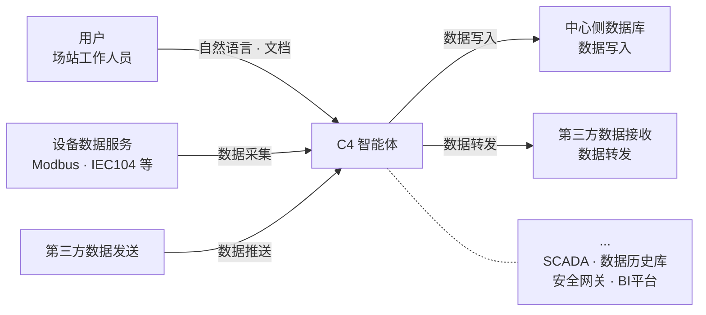
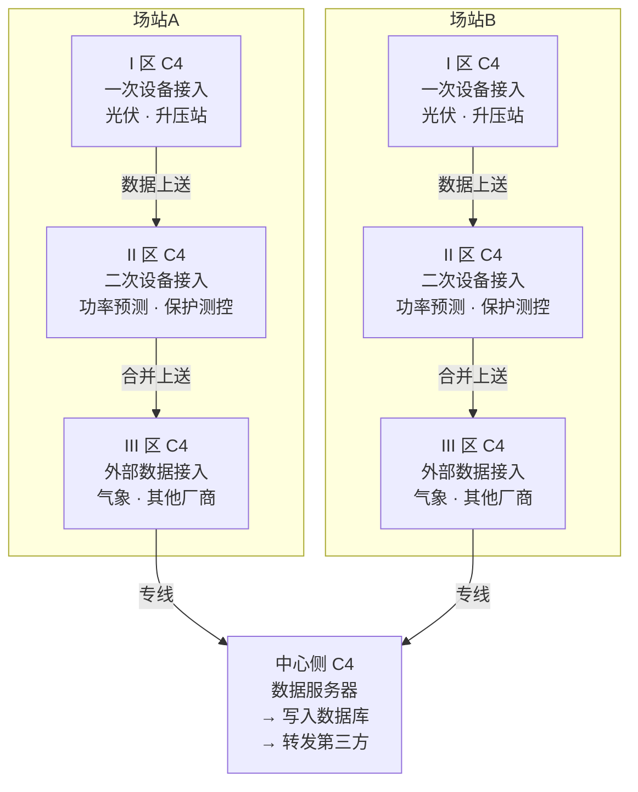
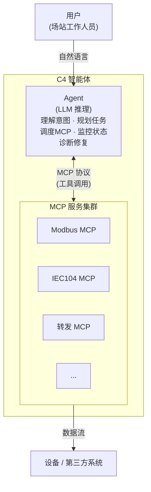
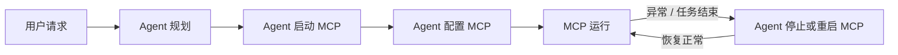
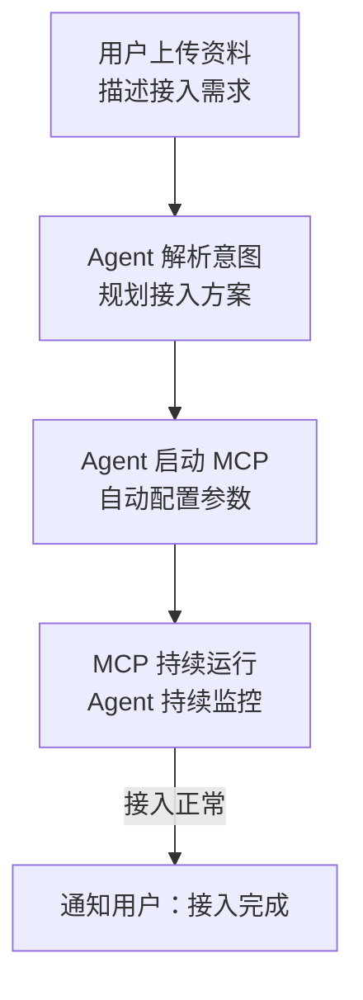
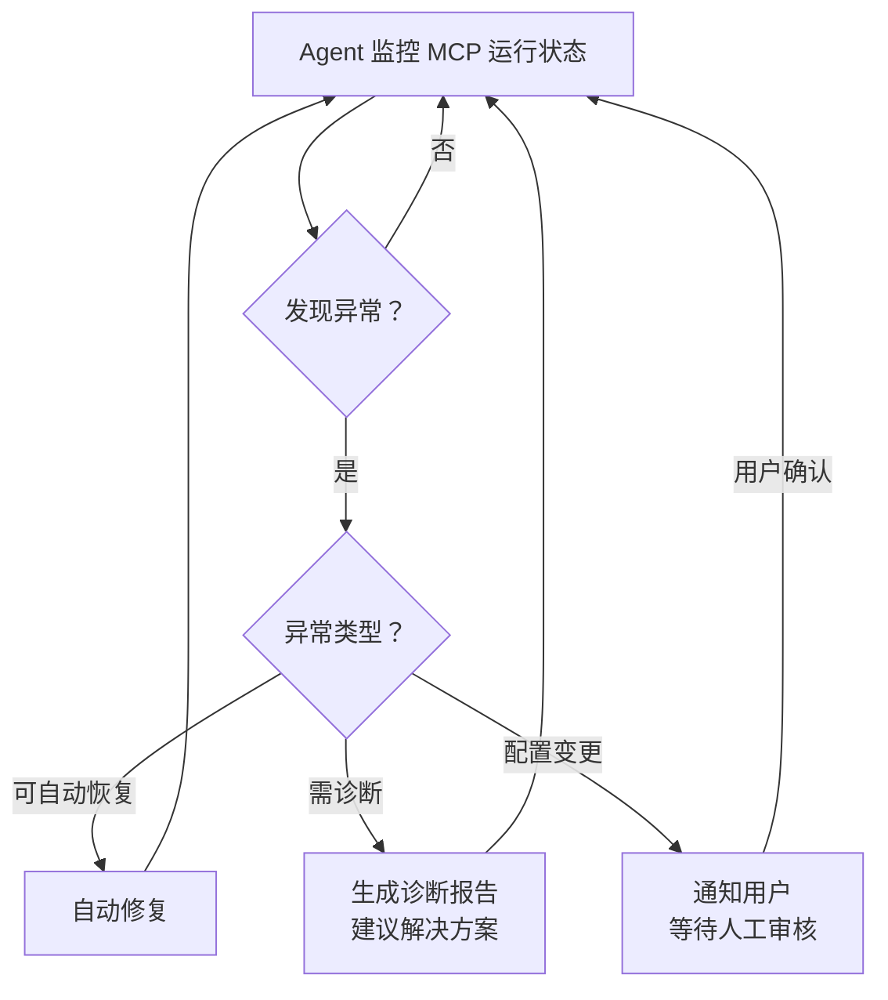

# C4 — 数据接入AI智能体

> **版本**：v0.2.1 | **最后更新**：2026-07-11

## 1. 概述

C4 是一个部署在工业数据服务器上的 AI 智能体，目标是将工业现场的数据接入工作从人工配置转变为智能化的自动流程。

**核心愿景**：C4让数据接入更智能、更轻松。

**解决的问题**：传统工业数据接入需要实施工程师人工完成大量重复性配置工作——解读点表、配置协议参数、设置转发规则、排查连接故障。C4 将这一过程交给 AI 智能体，使得不具备计算机专业知识的场站工作人员也能通过自然语言和任意格式的文档完成数据接入。

**核心理念**：AI 在数据管道之外负责理解、规划、配置和监控；确定性的协议级数据搬运由专门的 MCP 服务负责。AI 不进入实时数据路径，确保数据接入的可靠性和确定性。

### 1.1 C4 的边界

C4 专注于数据接入的智能化和自动化，处于以下系统的交汇中心：

```
                          用户
                     (场站工作人员)
                          │
                     自然语言 · 文档
                          │
                          ▼
 设备数据服务 ─────────► ┌─────────┐ ────────► 中心侧数据库
(Modbus IEC104 等)       │   C4    │            (数据写入)
                         │ 智能体   │
 第三方数据发送 ────────► │         │ ────────► 第三方数据接收
                         └─────────┘            (数据转发)
```



C4 **不是**：SCADA 系统、数据历史库、安全网关、BI 平台。C4 在已有安全边界内运行，不替代场站已有的安全基础设施。

## 2. 应用场景

### 2.1 领域范围

C4 主要应用于工业领域，同时支持与 IT 系统的交互。

### 2.2 典型场景：光伏场站数字化

以光伏场站数字化项目为例，需要将各光伏场站设备产生的数据传输到中心侧数据库，供中心侧应用读取和使用。

**物理部署拓扑**：

```
场站A                          场站B
┌─────────────────────┐      ┌─────────────────────┐
│  III区（外部数据接入） │      │  III区（外部数据接入） │
│   气象数据、其他厂商    │      │   气象数据、其他厂商    │
│         ↓            │      │         ↓            │
│  II区（二次设备接入）   │      │  II区（二次设备接入）   │
│   功率预测、保护测控    │      │   功率预测、保护测控    │
│         ↓            │      │         ↓            │
│  I区（一次设备接入）    │      │  I区（一次设备接入）    │
│   光伏、升压站         │      │   光伏、升压站         │
└─────────┬───────────┘      └─────────┬───────────┘
          │ 专线                        │ 专线
          └──────────┬─────────────────┘
                     ↓
          ┌─────────────────────┐
          │   中心侧数据服务器    │
          │   → 写入数据库       │
          │   → 转发第三方       │
          └─────────────────────┘
```



**数据流向**：

- I 区子网：采集一次设备数据（光伏逆变器、升压站等），上传至 II 区
- II 区子网：采集二次设备数据（功率预测、保护测控等），合并 I 区数据上传至 III 区
- III 区子网：接收外部数据（气象数据、其他厂商数据），合并 I、II 区数据上传至中心侧
- 中心侧：接收各场站数据，写入数据库或转发给第三方

### 2.3 C4 的部署位置

C4 部署在每一个数据服务器上：

- I 区升压站数据接入服务器
- II 区功率预测数据接入服务器
- III 区其他厂家气象数据接入服务器
- 中心侧接收场站数据并写入数据库的服务器

不同子网的 C4 构成统一的 C4 网络，保证数据从生产端到消费端可追溯。

### 2.4 数据治理

- 用户上传的配置文档和数据所有权归属于场站方
- C4 不对采集的数据内容进行持久化存储（数据经 MCP 管道流式转发，不在 C4 内部落地）

## 3. 系统架构

### 3.1 核心架构：Agent + MCP

每个 C4 实例由两部分组成：

```
┌──────────────────────────────────────────────┐
│                  C4 智能体                    │
│                                              │
│  ┌────────────┐          ┌────────────────┐  │
│  │   Agent    │  ◄───►  │  MCP 服务集群   │  │
│  │  (LLM推理)  │   MCP   │                │  │
│  │            │  协议   │ ┌────────────┐  │  │
│  │  理解意图   │        │ │ Modbus MCP │  │  │
│  │  规划任务   │        │ ├────────────┤  │  │
│  │  调度MCP   │        │ │ IEC104 MCP │  │  │
│  │  监控状态   │        │ ├────────────┤  │  │
│  │  诊断修复   │        │ │  转发 MCP  │  │  │
│  └────────────┘        │ ├────────────┤  │  │
│         │              │ │    ...     │  │  │
│         │ 自然语言      │ └────────────┘  │  │
│         ▼              └────────────────┘  │
│     用户（场站工作人员）         │             │
└──────────────────────────────│─────────────┘
                               ▼
                       设备 / 第三方系统
```



- **Agent**：基于 LLM 的推理核心。接收用户的自然语言指令和文档资料，理解意图，规划数据接入方案，通过 MCP 协议调度 MCP 服务，监控运行状态，诊断和修复问题。
- **MCP 服务**：支持 [Model Context Protocol](https://modelcontextprotocol.io/) 的数据接入服务。每个 MCP 服务负责一种具体的数据接入工作（如 Modbus 采集、IEC104 采集、数据转发），由 Agent 按需启动和配置。新的协议支持通过新增 MCP 服务实现，遵循标准 MCP 接口。
- **MCP 协议**：Agent 与 MCP 服务之间的通信协议，采用 Anthropic 的 Model Context Protocol 标准，实现 Agent 对 MCP 服务的工具调用（tool calling）和资源访问。

### 3.2 设计原则

| 原则 | 说明 |
|------|------|
| **AI 在管道外** | Agent 负责理解、配置、监控，不进入实时数据路径。数据搬运由 MCP 服务以确定性方式执行。 |
| **MCP 在管道内** | MCP 服务负责协议级的数据接入和转发，保证低延迟、高可靠、确定性。 |
| **按需启动** | MCP 服务根据任务需要由 Agent 启动，任务完成后可停止，节约资源。 |
| **渐进自主** | 常规操作自主执行，关键配置变更需人工审核。 |
| **故障隔离** | Agent 故障不影响已运行的 MCP 数据管道。MCP 服务在 Agent 不可用期间继续自主运行，Agent 恢复后自动接续监控状态。 |

## 4. Agent 设计

### 4.1 输入方式

Agent 支持用户以任意形式提供信息：

- **自然语言**：口头或文字描述数据接入需求
- **结构化文档**：Excel 点表、CSV 配置表
- **非结构化文档**：PDF 设备手册、Word 规范文档、图片/截图
- **混合形式**：上述任意形式的组合

Agent 自动解析各种格式的输入，提取关键信息（设备地址、寄存器映射、数据类型、通信参数等）。

Agent 通过 Web 界面与用户交互，用户可在浏览器中提交数据接入需求、上传文档、查看运行状态和诊断报告。

### 4.2 核心能力

| 能力 | 描述 |
|------|------|
| 意图理解 | 从用户的自然语言和文档中理解数据接入需求 |
| 任务规划 | 将接入需求分解为可执行的步骤（选择协议、配置参数、启动 MCP） |
| MCP 调度 | 通过 MCP 协议启动、配置、停止 MCP 服务 |
| 状态监控 | 持续监控各 MCP 服务的运行状态和数据质量 |
| 问题诊断 | 发现异常时分析根因，提供详尽的解决方案 |
| 自动修复 | 对已知类型的故障自动执行恢复操作 |

### 4.3 错误处理策略

Agent 采用分级错误处理策略：

- **自动恢复**：对可自动处理的故障（如通信连接中断）执行自动修复，无需人工介入
- **诊断上报**：对需要领域知识判断的异常（如数据质量问题）生成诊断报告并建议解决方案，供用户决策
- **人工审核**：涉及数据接入配置的变更始终要求人工审核确认后生效，Agent 不得在未经审核的情况下修改配置
- **告警通知**：对达到设定等级的故障，Agent 通过邮件或其他渠道向指定人员发送告警通知。故障等级阈值和通知渠道可配置

## 5. MCP 服务设计

### 5.1 定义

MCP 服务是支持 Model Context Protocol 的数据接入服务。每个 MCP 服务封装一种具体的数据接入能力，对外暴露标准化的 MCP 接口（tools、resources），供 Agent 通过 MCP 协议调用。

### 5.2 职责

- 接收 Agent 的配置指令，完成协议级参数配置
- 执行确定性的数据采集、转换、转发工作
- 向 Agent 报告运行状态、数据统计、异常信息
- 保证长期稳定运行，不因 Agent 不可用而中断数据采集

### 5.3 MCP 服务示例

| MCP 服务 | 功能 | 触发场景 |
|----------|------|---------|
| Modbus MCP | 通过 Modbus TCP/RTU 协议采集设备寄存器数据 | 用户要求接入 Modbus 设备 |
| IEC104 MCP | 通过 IEC 60870-5-104 协议采集远动数据 | 用户要求接入 IEC104 设备 |
| 转发 MCP | 将采集到的数据按指定格式转发给第三方 | 用户要求将数据转发给其他系统 |
| InfluxDB MCP | 将数据写入指定的 InfluxDB | 用户要求数据入库 |
| ASFP2 MCP | 通过 ASFP2 协议接收或发送数据 | 用户要求接入 ASFP2 数据源或向 ASFP2 目标发送数据 |

### 5.4 生命周期

```
用户请求 → Agent 规划 → Agent 启动 MCP → Agent 配置 MCP → MCP 运行
                                                              │
                                    ┌─────────────────────────┘
                                    │ 异常/任务结束
                                    ▼
                              Agent 停止或重启 MCP
```



MCP 服务按需启动，由 Agent 管理其完整生命周期。

## 6. C4 网络

### 6.1 跨子网协作

不同子网（I 区、II 区、III 区、中心侧）的 C4 Agent 构成统一的 C4 网络。

```
I区 C4 Agent ◄──────► II区 C4 Agent ◄──────► III区 C4 Agent ◄──────► 中心侧 C4 Agent
```


Agent 之间直接对等通信，不通过统一管理节点协调。Agent 之间交换任务协调信息和数据流元数据，不传输原始采集数据。原始数据的传输由各子网的 MCP 服务按配置的数据流向执行。

### 6.2 数据追溯

C4 网络保证每条数据从生产端到消费端的路径可追溯——即可以确定数据的产生设备、经过的子网节点、到达中心侧的时间。

> **待定**：Agent 之间的通信协议和全链路数据追溯的定义与要求将在后续设计中确定。

## 7. 工作流程

### 7.1 新数据源接入

```
用户表达需求、上传资料 → Agent 解析意图、规划方案 → Agent 配置并启动 MCP → 持续监控
```



### 7.2 异常处理流程

```
持续监控 → 检测异常 → 分级响应（自动恢复 / 诊断上报 / 人工介入）
```



## 8. 安全设计

C4 部署在工业安全分区环境中（I/II/III 区），安全是架构的第一等关注点。

### 8.1 安全能力

C4 在以下四个维度提供安全保障：

| 维度 | 说明 |
|------|------|
| 身份认证 | 验证访问 C4 Agent 的用户身份和 Agent 实例间的互认身份 |
| 操作授权 | 基于角色的权限控制，关键配置变更须经授权审核 |
| 传输加密 | 跨安全分区（I/II/III 区 / 中心侧）的通信链路加密 |
| 操作审计 | 记录关键操作（配置修改、MCP 启停、数据转发变更），支持事后追溯 |

### 8.2 安全原则

- **最小权限**：MCP 服务仅拥有执行其数据接入任务所需的最小权限
- **审核门禁**：任何涉及数据接入配置的变更须经人工审核确认后生效
- **分区合规**：跨子网通信符合场站网络安全分区管理规定

### 8.3 安全边界

C4 自身不替代场站已有的安全基础设施（防火墙、网闸、入侵检测等）。C4 在已有安全边界内运行，通过加密和认证保护自身通信链路。

> **待定**：具体的安全机制选型（证书管理、加密协议版本等）根据部署环境的安全规范在详细设计中确定。

## 9. 技术约束

### 9.1 运行环境

- 部署于工业现场的数据服务器上
- 需要长期稳定运行
- 支持有网络隔离的多层子网环境（I/II/III 区）

### 9.2 通信要求

- Agent 与 MCP 服务之间的通信基于 MCP 协议（Model Context Protocol）
- Agent 之间的通信基于[待定]协议

## 10. 待明确事项

以下内容需要在后续讨论中确定：

- [ ] Agent 之间的对等通信协议
- [ ] 全链路数据追溯的定义与要求
- [ ] 用户与 Agent 的交互范式
- [ ] Agent 的持久化状态管理（配置存储、历史记录）
- [ ] 安全认证与权限管理的具体机制
- [ ] 性能指标（支持的设备数量、数据吞吐量、响应时间）

## 11. 商用许可

C4 采用 AGPL v3 开源许可，源代码在 GitHub 公开。企业部署 Agent 实例需获取商业授权，
通过许可密钥激活，授权模式为按 Agent 实例数量计费。

许可密钥包含数字签名防篡改，支持在线激活和离线导入两种方式。Agent 启动时验证许可有效性，
到期前提供告警和宽限期，按许可等级控制可用功能。

---

> **版本**：v0.3.0 | **最后更新**：2026-07-11
